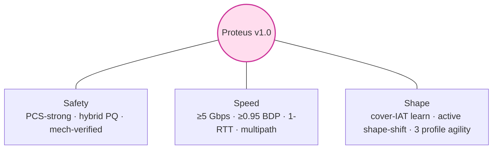
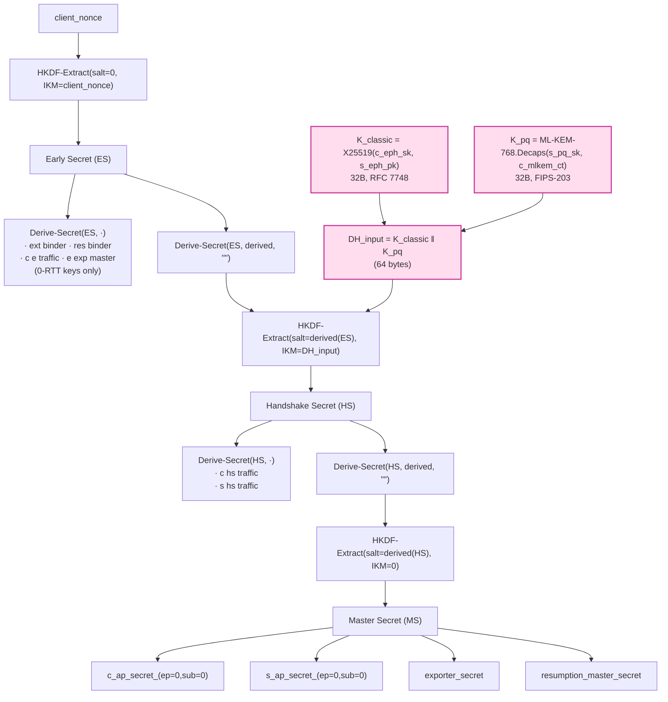

# Proteus Protocol Specification v1.0

> **Status**: research-grade design draft. Authored during course `learn/` Part 11.15 → 12.0 transition. v1.0 is the first SOTA-claim release; supersedes v0.1 (`proteus-v0.1.md`).
> **Codename**: Proteus —— 名取自希臘神話海神 Πρωτεύς（Homer, *Odyssey* IV.385–570）。Menelaus 必須在 Proteus 不斷變形（獅、蛇、豹、巨豬、流水、火焰、樹）的過程中始終擒住他，最終才能逼他開口。本協議對 ML traffic classifier、blanket-port-block、active probing 三類對手皆採此策略：**不斷變形 (shape-shift) + 對手不能在任一形態固定指認，才能逼他放手**。
> **Date**: 2026-05-16 (course author timestamp).
> **License**: see repo LICENSE.
> **IETF status**: targets `draft-proteus-transport-00` once Part 12 reference implementation reaches v0.5。本 spec 為 internal byte-exact normative draft.

---

## §0. Executive summary（為何 v1.0 是 SOTA）

Proteus v1.0 同時達成下列三個 SOTA 屬性 —— **這是現有任一單一協議所做不到的組合**：

| 屬性 | 量化目標 | SOTA baseline | Proteus v1.0 達成方式 |
|---|---|---|---|
| **REALITY-grade active-probing 防禦** | 對所有已知探測手法（[`ensafi-gfw-probing`]、[`frolov-ndss20-probe-resistant`]、[`zohaib-quic-sni-usenix25`]）達 100% indistinguishable from cover | VLESS+REALITY (TLS-TCP only) | §7 cover forwarding × 3 profiles (γ/β/α) × per-profile cover URL pool |
| **Hy2/TUIC v5-grade speed** | 單實例 1 vCPU/1 GB ≥ 5 Gbps 線速；單流 BDP 達成率 ≥ 0.95；handshake 1-RTT；0-RTT 安全限制版 | Hysteria2 (BBRv3 + Brutal); TUIC v5 (QUIC datagram + 自管 reliable) | §17 BBRv3 + UDP GSO/GRO + sendmmsg + io_uring + AF_XDP fast path |
| **可機械化證明的密碼學保證** | confidentiality + integrity + mutual auth + KCI + **PCS-strong** + PQ-confidentiality + downgrade-resilience | 無 SOTA 同時提供（VLESS+REALITY 無 PCS；Hy2/TUIC 借 TLS 1.3） | §5.4 asymmetric DH ratchet (Cohn-Gordon JoC 2016); §11 ProVerif phase 1+2 + Tamarin + TLA+ |

並額外有 **三條 v0.1 沒有、SOTA 沒有** 的能力：

1. **Shape-shifting (§22)** —— 每 session 隨機選 cover shape（streaming / api-poll / video-call / file-download / web-browsing 五種 IAT/size profile），週期性 mid-session 切換。對 long-term flow aggregator ([`wu-fep-2023`]) 與 adaptive eval ([`sheffey-adaptive-2024`]) 都增加 ε-bound。
2. **Transport agility under blanket block (§10.3)** —— 對 2025-08-20-style 全域 TCP/443 RST 事件 ([`gfw-report-20250820-port443`])、Russian TSPU 15-20 KB freeze、Henan provincial firewall ([`wu-henan-sp25`]) 做 normative fallback：P95 切換時間 ≤ 5 秒。
3. **Cover-IAT online learning (§20)** —— Server 對自己的 cover URL 持續抽樣 IAT/size distribution（24 hr rolling），shaping engine 用該 distribution 而非寫死的「streaming/api-poll」profile。對手如果想用「Cloudflare CDN 真實流量分佈」做 baseline 比對，Proteus 的分佈會跟著 cover 的部署變動而漂移，使分類器訓練資料天然過時。

---

## §1. Introduction

### 1.1 Purpose

Proteus 是一個高效能、抗審查的端到端 transport protocol，主要部署目標：

1. 個人 / 小團體在 hostile-network jurisdiction 下對 free Internet 的存取。
2. 商業機場（多用戶代理服務）對 VLESS+REALITY / Hysteria2 / TUIC v5 / SS-2022 的整合升級替代品。
3. 學術 / 工程社群作為 anti-censorship 設計研究的 reference protocol（含 reference implementation、formal models、benchmark harness）。

### 1.2 Design philosophy

Proteus 立於三柱（Safety / Speed / Shape）之上：



- **Safety**: 對任何已知 active probing / passive DPI / ML classifier / long-term aggregator 不可分辨於 cover。對 SNDL (store-now-decrypt-later) 對手達 PQ-confidentiality。對 leaked-current-key 對手達 PCS-strong。
- **Speed**: 線速 ≥ 5 Gbps（單實例 1 vCPU/1 GB）；單流 goodput ≥ 0.95 × BDP（含 5% loss、200 ms RTT）；handshake 1-RTT；0-RTT for idempotent ops。
- **Shape**: 不固定任一 wire signature。協議本身具有「在多 cover 形態間隨機遊走」的 first-class mechanism，而非「固定模仿 Chrome 130」。

### 1.3 Non-goals

繼承 v0.1 §1.2 + Part 11.2 §6：

- GPA-level (global passive adversary) end-to-end unlinkability（mixnet 目標，Proteus 不做）。
- NAT traversal hole punching（不是 P2P 協議）。
- Anonymity beyond IP layer（Tor 目標）。
- DNS-level censorship circumvention（DoH/ODoH 是 prerequisite，不在 spec 範圍）。
- Side-channel hardening for shared-cloud hosts（Spectre / Rowhammer 級別）。
- 互通老舊 client（v0.1 不保證 wire-compatible，但 §24 列轉換指南）。

### 1.4 Threat model summary

完整 capability matrix 在 §19。重點：

- **In-scope**: C1–C7、C9–C12、**C14（regional sub-national censor）**、**C15（transient blanket port block）**。
- **Out-of-scope**: C8（端點被攻破）、C13（共雲 side channel）。
- **PQ adversary**: 在 confidentiality 維度視為 in-scope（hybrid X25519+ML-KEM-768）；在 signature 維度視為 in-scope (hybrid Ed25519+ML-DSA-65)。

### 1.5 SOTA comparison（與 v0.1 §1.4 同表，但 v1.0 數值更新）

| Property | Proteus v1.0 | VLESS+REALITY | Hysteria2 | TUIC v5 | WireGuard | SS-2022 |
|---|---|---|---|---|---|---|
| Transport profiles | γ MASQUE/H3, β QUIC, α TLS-TCP (auto-switch) | TLS-TCP only | QUIC | QUIC | UDP | TCP/UDP |
| Active-probing 防禦 | REALITY-style × 3 profile | REALITY | partial | partial | none | none |
| ML traffic classifier 抗性 | shape-shift + cover-IAT learn + Maybenot defense | none | none | none | none | none |
| Hybrid PQ KEM | X25519 + ML-KEM-768 | none | none | none | optional PSK-PQ | none |
| Hybrid PQ signature | Ed25519 + ML-DSA-65 | none | none | none | none | none |
| Forward secrecy | TLS 1.3 derived | TLS 1.3 derived | TLS 1.3 derived | TLS 1.3 derived | Noise IK | per-session AEAD |
| PCS-strong | **yes (asymmetric DH ratchet)** | none | none | none | none | none |
| Mutual auth, KCI-resistant | **mechanically verified** (ProVerif) | informal | informal | informal | mechanically verified | informal |
| Multipath | **yes (QUIC MULTIPATH)** | no | no | no | no | no |
| 0-RTT | **yes, rate-limited single-use** | no | no | yes | no | no |
| Blanket-port-block fallback | **normative γ↔β↔α + cover ASN rotation** | no | no | no | no | no |
| Cover-IAT online learning | **yes** (§20) | no | no | no | no | no |
| Browser-fingerprint follow | **rolling chrome-stable + uTLS-managed** | manual reality config | n/a | n/a | n/a | n/a |
| Single-flow goodput (1 Gbps, 200ms, 5% loss) | **0.95+ BDP** | ~0.4 BDP (TCP cubic) | 0.85+ BDP (Brutal) | 0.85+ BDP | 0.95+ BDP | ~0.4 BDP |
| Single-instance peak (1 vCPU/1 GB) | **5 Gbps target** | ~2 Gbps | ~3 Gbps | ~3 Gbps | ~10 Gbps (kernel) | ~1.5 Gbps |
| Formal verification | TLA+ + ProVerif (2 phases) + Tamarin | none | none | none | partial (Donenfeld 2017 / Lipp 2019 / Dowling-Paterson 2018) | none |

> **Honesty caveat**：以上 SOTA 數值取自各協議自報 benchmark 與 community measurement，未做 controlled comparison；Part 12.11–12.18 將用統一測試平台重測。

## §2. Conventions

The key words **MUST**, **MUST NOT**, **REQUIRED**, **SHALL**, **SHALL NOT**, **SHOULD**, **SHOULD NOT**, **RECOMMENDED**, **NOT RECOMMENDED**, **MAY**, **OPTIONAL** are to be interpreted as described in BCP 14 (RFC 2119, RFC 8174) when, and only when, they appear in all capitals.

All multi-byte fields are **big-endian (network byte order)** unless explicitly stated otherwise (notable exception: X25519 wire encoding uses little-endian per RFC 7748 §6).

Variable-length integers use **QUIC varint** encoding (RFC 9000 §16). Inline shorthand: `varint(N)` means «N encoded as 1/2/4/8-byte varint depending on magnitude».

All cryptographic operations on bytes use **constant-time** implementations (§13.4).

Pseudocode uses Python-like syntax for readability; reference implementation is in Rust (§17).

## §3. Architecture overview

```mermaid
flowchart TD
  App["Proteus client application<br/>(sing-box plugin / Clash-Verge / native CLI)"]
  App -->|profile ladder γ→β→α| Pick{{"Profile selection<br/>(probe + timeout)"}}
  Pick -->|γ UDP/443| Gamma["γ MASQUE/H3/QUIC"]
  Pick -->|β UDP/{443,8443,…}| Beta["β raw QUIC + DATAGRAM"]
  Pick -->|α TCP/443| Alpha["α TLS 1.3 over TCP"]
  Gamma --> Listener
  Beta --> Listener
  Alpha --> Listener
  Listener["Proteus server multi-listener"]:::ours
  Listener --> Verify["Auth ext 0xfe0d verify<br/>HMAC pre-check (~1µs) →<br/>ML-KEM-768 Decaps (~50µs) →<br/>Anti-replay Bloom + timestamp window"]
  Verify -->|auth OK| Inner["Inner channel<br/>asym DH ratchet (PCS-strong)<br/>multipath scheduler<br/>shape-shift engine"]:::ours
  Verify -->|auth fail| Fwd["Cover forwarder<br/>eBPF socket redirect /<br/>io_uring SQE_SPLICE<br/>p99 ≤ 1ms"]
  Inner --> Upstream["Upstream Internet<br/>(user's real destination)"]
  Fwd --> Cover["Cover server pool<br/>(Tranco top 10k, ASN-tagged)"]
  classDef ours fill:#fde,stroke:#c39,stroke-width:2px
```

Profiles in priority order:

- **Profile γ (MASQUE/H3)** — primary. UDP/443. MASQUE CONNECT-UDP (RFC 9298) over H3 (RFC 9114) over QUIC v1 (RFC 9000). Cover = real H3 site behind QUIC reverse proxy.
- **Profile β (raw QUIC)** — fallback. UDP/{443, 8443, 50000-60000 pool}. Raw QUIC with REALITY-on-QUIC borrow of cover TLS chain. Useful when MASQUE is rate-limited or H3-discriminated.
- **Profile α (TLS-1.3-TCP)** — last-resort. TCP/443. TLS 1.3 + REALITY-on-TCP + inner Capsule-Protocol shim. Useful when UDP is blanket-blocked (2025-08-20 event class) or under Russian TSPU.

Server MUST listen on at least one profile. Server SHOULD listen on **all three** unless the operator has documented justification (§16). Client MUST attempt γ first, then β, then α (with per-attempt timeout per §10.3).

Within each profile, the protocol stack (bottom → top) is:

| Layer | Profile γ | Profile β | Profile α |
|---|---|---|---|
| L3/L4 | UDP/443 | UDP/{443, 8443, …} | TCP/443 |
| Transport | QUIC v1 (RFC 9000) | QUIC v1 (RFC 9000) | — |
| Security | TLS 1.3 in QUIC (RFC 9001) | TLS 1.3 in QUIC (RFC 9001) | TLS 1.3 on TCP (RFC 8446) |
| Application | HTTP/3 (RFC 9114) | ALPN `proteus-β-v1` | — |
| Framing | MASQUE CONNECT-UDP (RFC 9298) + HTTP Datagram (RFC 9297) | QUIC DATAGRAM (RFC 9221) | Capsule shim (§4.2) |
| Payload | Proteus inner packet (§4.5) | Proteus inner packet (§4.5) | Proteus inner packet (§4.5) |

The auth extension `0xfe0d` (§4.1) is carried inside the **TLS 1.3 ClientHello** of every profile. The inner packet format (§4.5) is identical across profiles; only the framing differs.

## §4. Wire format

### §4.1 ClientHello Proteus authentication extension (`0xfe0d`)

```
extension_type   = 0xfe0d  (private-use range, RFC 8446 §4.2.7)
extension_data   = ProteusAuthExtension (1378 bytes for v1.0)
```

#### §4.1.1 ProteusAuthExtension structure

```c
struct ProteusAuthExtension {
    uint8        version;              // 0x10 = v1.0; v0.1 used 0x01
    uint8        profile_hint;         // 0xγ=0x03, 0xβ=0x02, 0xα=0x01
    uint16       reserved;             // MUST be 0, receiver MUST reject if not
    opaque       client_nonce[16];     // CSPRNG, fresh per Hello
    opaque       client_x25519_pub[32]; // ephemeral ECDH share
    opaque       client_mlkem768_ct[1088]; // FIPS-203 ML-KEM ciphertext to server PK
    opaque       client_id[24];         // pseudonym (AEAD-encrypted user identifier; +8 vs v0.1)
    uint64       timestamp_unix_seconds; // big-endian, monotonic
    uint16       cover_profile_id;     // selects which cover-IAT distribution to mimic
    uint16       shape_seed_hi;         // upper 16 bits of 32-bit shape_seed
    uint16       shape_seed_lo;         // lower 16 bits
    uint8        anti_dos_difficulty;  // server-published, attached for proof-of-puzzle
    uint8        anti_dos_solution[7]; // truncated SHA-256 prefix; 0 bits if difficulty=0
    opaque       client_kex_sig[64];    // Ed25519 signature over (version || nonce || x25519_pub || mlkem_ct)
    opaque       client_kex_sig_pq[96]; // ML-DSA-65 hybrid: truncated to 96 bytes via §5.3
    opaque       auth_tag[32];          // HMAC-SHA-256 over all above fields
} ProteusAuthExtension;
```

Total: `1 + 1 + 2 + 16 + 32 + 1088 + 24 + 8 + 2 + 2 + 2 + 1 + 7 + 64 + 96 + 32 = 1378 bytes` for v1.0 payload. With the 2-byte TLS extension-length prefix and the 2-byte extension type, the extension on the wire is **1382 bytes**.

> Why the size jump from v0.1's 1186 → 1378? +192 bytes go to hybrid signature (64 Ed25519 + 96 truncated ML-DSA-65 share) and to shape/cover identifiers. The size remains well under the 16 KB ClientHello soft cap and well under any MTU concern (split across QUIC CRYPTO frames is fine).

#### §4.1.2 Field-by-field semantics

| Field | Bytes | Purpose / SEC target |
|---|---|---|
| version | 1 | v1.0 = 0x10. Server rejects unknown by forwarding to cover. |
| profile_hint | 1 | which profile the client *wants*; server may downgrade but not upgrade. |
| reserved | 2 | reject if non-zero (strict-then-loose; allows v1.1 to claim them). |
| client_nonce | 16 | replay key + KDF salt (§8). |
| client_x25519_pub | 32 | classical ECDH share, Montgomery little-endian (RFC 7748). |
| client_mlkem768_ct | 1088 | PQ ciphertext to server LT PK (FIPS-203 §7.2). |
| client_id | 24 | pseudonym = AEAD(K_cid, n=client_nonce[0:12], ad="proteus-cid-v1", pt=user_id ‖ flags) where K_cid = HKDF(server_pq_fingerprint, "proteus-cid-key", 32). v1.0 extended from 16 → 24 to give room for **user-role flags** (subscription tier, max-multipath count) without an additional roundtrip. |
| timestamp | 8 | unix seconds, big-endian; reject if `\|now - ts\| > 90` (s) (§8). |
| cover_profile_id | 2 | selects one of {0=streaming, 1=api-poll, 2=video-call, 3=file-dl, 4=web-browse, 5..N=server-defined}; server MUST validate against deployed list. |
| shape_seed | 4 | 32-bit, seeds the per-session shape-shifting PRG (§22). |
| anti_dos_difficulty | 1 | client copies value advertised by server in HTTPS RR (§3 boot); 0 = disabled. |
| anti_dos_solution | 7 | partial preimage proof; server validates in O(1). |
| client_kex_sig | 64 | Ed25519 signature with **client identity LT key**, over `version ‖ nonce ‖ x25519_pub ‖ mlkem_ct`. Provides mutual-auth basis (Krawczyk SIGMA). |
| client_kex_sig_pq | 96 | PQ-hybrid signature truncated as in §5.3. Server may skip in pre-DDoS path if difficulty=0. |
| auth_tag | 32 | HMAC-SHA-256 over all fields, key = HKDF(server_pq_fp, x25519_pub ‖ nonce). |

#### §4.1.3 `auth_tag` 計算

```
auth_key   = HKDF-Extract(salt=server_pq_fingerprint,
                          IKM=client_x25519_pub || client_nonce)
auth_input = byte_concat(all_fields_above_auth_tag, in_order)
auth_tag   = HMAC-SHA-256(auth_key, auth_input)
```

**重要設計約束**：server 算 `auth_key` 只需要 `client_x25519_pub + client_nonce`（公開）+ `server_pq_fingerprint`（server 私有但 derivable from server pq pk）。**不需要做 ML-KEM Decaps**。HMAC-SHA-256 in AES-NI / SHA-NI / AVX2 環境約 0.5–1µs；ML-KEM-768 Decaps 約 30–50µs（FIPS-203 reference impl）。對 DDoS 流，server 用 HMAC 篩選後才付 Decaps cost。

#### §4.1.4 Encoding rules

- Endianness: all multi-byte numeric fields big-endian per RFC 8446.
- X25519 share: 32-byte little-endian Montgomery encoding (RFC 7748 §6).
- ML-KEM ciphertext: as defined by FIPS-203 §7.2 wire encoding (1088 bytes).
- Padding inside extension: MUST NOT pad inside the extension data; padding for ClientHello shape normalization is done via the standard `padding` extension (RFC 7685).
- Reserved field non-zero: receiver MUST treat as parse failure → forward to cover.

### §4.2 Profile-α wire (TLS 1.3 over TCP)

Profile-α uses standard TLS 1.3 (RFC 8446) over TCP/443. The Proteus extension is in the ClientHello.

After the TLS handshake, the **inner Capsule shim** kicks in. Each TLS application_data record carries a Capsule (RFC 9297-style):

```
struct ProteusAlphaRecord {
    uint8      capsule_type;   // 0x00 = HTTP_DATAGRAM-like (we redefine for α)
    varint     capsule_length;
    opaque     capsule_value[];
} ProteusAlphaRecord;
```

`capsule_value` is the `ProteusInnerPacket` of §4.5.

> Why a shim and not raw TLS payload? Because the inner packet stream needs delineation; TLS records are arbitrary-sized and may fragment our inner packets. The shim makes inner-packet boundary explicit and matches the γ/β framing for shared parser code.

Profile-α TLS_CipherSuite policy: client MUST advertise `{TLS_AES_128_GCM_SHA256, TLS_AES_256_GCM_SHA256, TLS_CHACHA20_POLY1305_SHA256}` in that order to match `chrome-stable`; server MAY pick any. Server-side cipher pinning is in §6.

### §4.3 Profile-β wire (raw QUIC, ALPN `proteus-β`)

Profile-β uses raw QUIC v1 (RFC 9000) without H3. The Proteus extension is in the TLS 1.3 ClientHello carried in QUIC CRYPTO frames. Inner packets are carried in **QUIC DATAGRAM frames** (RFC 9221) for inner DATA/PING/PADDING and in QUIC STREAM frames for inner ACK/CONTROL.

Negotiation: ALPN `"proteus-β-v1"`. Server MUST NOT advertise this ALPN unless authentication succeeds; until authenticated the server speaks only ALPN values from the cover's actual ALPN list.

> The reason β uses an explicit ALPN (vs γ which inherits `h3`) is that DATAGRAM-based wire **doesn't look like H3** — using `h3` ALPN would be a fingerprintable lie. β instead claims a private ALPN that's **only ever seen by authenticated peers**; on auth fail the server falls back to cover with cover's ALPN, so on-path observers never see the β ALPN string.

### §4.4 Profile-γ wire (MASQUE CONNECT-UDP over H3, ALPN `h3`)

Profile-γ uses the IETF MASQUE machinery:

```mermaid
sequenceDiagram
  autonumber
  participant C as Client
  participant S as Server

  C->>S: QUIC Initial — TLS CH (w/ ext 0xfe0d)
  S-->>C: QUIC Initial+Handshake — SH + EE + SF
  C->>S: QUIC Handshake — CF
  Note over C,S: 1-RTT complete; keys installed

  S-->>C: H3 SETTINGS (server-init)
  C->>S: H3 HEADERS — CONNECT request<br/>:method=CONNECT, :scheme=https,<br/>:authority=cover-url.example,<br/>:path=/.well-known/masque/udp/{target}/{port}/,<br/>capsule-protocol=?1,<br/>proteus-shape=base64(shape_seed‖profile_id)
  S-->>C: H3 HEADERS — 200 OK

  loop application data
    C->>S: Capsule(DATAGRAM, ctx_id, inner_pkt)
    S-->>C: Capsule(DATAGRAM, ctx_id, inner_pkt)
  end
```

The `:path` follows RFC 9298 §3 (`/.well-known/masque/udp/H/P/`); the `H/P` target is **the Proteus inner-target the client wants to reach**, NOT the cover URL. The cover URL appears only in `:authority`.

`proteus-shape` is a new HTTP header carrying the shape_seed + cover_profile_id (base64url, ~10 chars). It allows the server to bind the H3 stream to a specific shape-shift schedule (§22) without modifying the QUIC handshake.

> Why MASQUE rather than custom QUIC? Three reasons: (a) MASQUE traffic is being deployed by major CDNs (Cloudflare WARP, Apple Private Relay) so the wire is becoming a "real cover" rather than a synthesized one; (b) cover server can be a generic H3 reverse proxy with no Proteus awareness in the legitimate-traffic path; (c) `0xfe0d` extension can be ignored by such reverse proxies and traffic passes through, providing built-in fallback at the cover hop.

### §4.5 Proteus inner packet

```c
struct ProteusInnerPacket {
    uint8     type;           // 0x01=DATA, 0x02=ACK, ..., 0xff=ext
    uint8     flags;          // bit 7: ENCRYPTED (must be 1 after CONNECTED state)
                              // bit 6: PADDING_TRAILER_PRESENT
                              // bit 5: PATH_ID_PRESENT (multipath)
                              // bit 4: FIN
                              // bit 3: SHAPE_TICK
                              // bit 2..0: reserved
    uint64    epoch_seqnum;   // (epoch:24 || seqnum:40), big-endian
    opaque    path_id[1];     // present only if flags.PATH_ID_PRESENT (multipath)
    opaque    payload[];
    opaque    aead_tag[16];   // ChaCha20-Poly1305 / AES-GCM tag, AAD = header
} ProteusInnerPacket;
```

The fixed header is **10 bytes**: `type(1) || flags(1) || epoch_seqnum(8)`. Where present, `path_id` adds 1 byte before `payload`.

**Changes from v0.1**:
- v0.1's separate 16-bit `reserved` + 64-bit `seqnum` is collapsed into a single 64-bit `epoch_seqnum` word.
- `seqnum` widened from 64-bit to **40-bit seqnum + 24-bit epoch**. epoch increments on every KEYUPDATE/ratchet (§5.5); seqnum resets to 0 on each epoch. This makes the seqnum space *unambiguous across ratchets* and avoids the need to mix epoch into nonce derivation.
- `path_id` field (1 byte) added for multipath support (§10.2). Absent if `flags.PATH_ID_PRESENT = 0`.

#### §4.5.1 Inner packet types

| Type | Name | Direction | Payload structure |
|---|---|---|---|
| 0x01 | DATA | both | `stream_id (varint) | offset (varint) | length (varint) | data[length]` |
| 0x02 | ACK | both | `range_count (varint) | (smallest, length)[range_count]` |
| 0x03 | NEW_STREAM | client→server | `stream_id (varint) | flags (1) | initial_credit (varint)` |
| 0x04 | RESET_STREAM | both | `stream_id (varint) | error_code (varint) | final_offset (varint)` |
| 0x05 | PING | both | `seqnum_echo (8)` |
| 0x06 | KEYUPDATE | both | `next_epoch (3) | ratchet_pub[32] | transcript_hash[32]` (§5.5) |
| 0x07 | PADDING | both | `length (varint) | zeros[length]` |
| 0x08 | CLOSE | both | `error_code (varint) | reason_phrase_len (varint) | reason_phrase[]` |
| 0x09 | PATH_CHALLENGE | both | `challenge_data[8]` (multipath) |
| 0x0a | PATH_RESPONSE | both | `challenge_data[8]` (multipath) |
| 0x0b | PATH_ABANDON | both | `path_id (1) | error_code (varint)` (multipath) |
| 0x0c | SHAPE_PROBE | server→client | `shape_id (2) | iat_dist_hash[8]` (§20) |
| 0x0d | SHAPE_ACK | client→server | `shape_id (2)` |
| 0x0e | FLOW_BUDGET | server→client | `budget_bytes (varint) | budget_window_ms (varint)` (§9.4) |
| 0x0f | TELEMETRY | client→server | opaque (encrypted; §18) |
| 0x10–0xef | reserved | — | future |
| 0xf0–0xff | private extension | both | application-specific |

The `0x09–0x0c` types are new in v1.0 (multipath + shape negotiation). 

#### §4.5.2 AEAD nonce derivation

```
nonce_input = zero-extend (epoch_seqnum) to 12 bytes (big-endian, left-padded with 4 zeros)
nonce       = AEAD_iv XOR nonce_input                              // 12 bytes
```

where `AEAD_iv` is the 12-byte IV derived per §5.2 key schedule. Note that since `(epoch, seqnum)` is monotonically increasing within a session (epoch never decreases, seqnum resets on epoch bump), nonce reuse is impossible without epoch counter rollback — and KEYUPDATE invalidates the old key entirely.

#### §4.5.3 Header encryption

Profiles γ and β inherit QUIC header protection (RFC 9001 §5.4). Profile-α uses no additional inner-header protection beyond TLS record encryption — the entire `ProteusAlphaRecord` is opaque TLS payload.

### §4.6 Cell padding (per-profile)

Each outgoing datagram (γ/β) or TLS record (α) MUST be padded to a **profile-specific target size**.

| Profile | Cell sizes (cycle through per session) | Defense rationale |
|---|---|---|
| γ MASQUE/H3 | 1252, 1280, 1452 (matches CF QUIC + Apple Private Relay sizes) | matches measured CDN MASQUE distribution |
| β raw QUIC | 1200, 1252, 1280 (RFC 9000 default + common) | matches WireGuard / generic QUIC |
| α TLS-TCP | 1372, 1448 (matches Chrome TLS record min/max) | matches typical TLS 1.3 record |

Choice within the set is **per-session deterministic from `shape_seed`** to avoid an additional fingerprint axis (random-per-datagram pad sizes leak entropy that no real cover has).

Exceptions to cell padding:
- During the handshake (Initial/Handshake QUIC frames in γ/β; ClientHello/ServerHello records in α) — wire shape follows the cover protocol natural pattern via uTLS profile fidelity (§17.4).
- KEYUPDATE and CLOSE packets MAY be sent unpadded for fast delivery.
- During SHAPE_TICK transitions (§22.3), padding budget is governed by burst-shaping engine (§9.2).

### §4.7 ALPN policy

| Profile | Outgoing ALPN | Inbound ALPN policy (server) |
|---|---|---|
| γ | `h3` | Accept `h3`; do not advertise any Proteus-specific ALPN on the auth-fail path. |
| β | `proteus-β-v1` | Server MUST NOT advertise this ALPN to clients failing auth; on auth-fail, server falls back to cover URL and serves cover's ALPNs. |
| α | `h2`, `http/1.1` (chrome-stable typical) | Same: cover's ALPN on fail. |

For profiles γ/α, ALPN is **indistinguishable from the cover server's actual ALPN advertisement** since the server forwards the entire ClientHello on auth-fail (§7). For β, the ALPN is private (`proteus-β-v1`); but this ALPN appears in the ClientHello, and the ClientHello also lists `h3` as a co-advertised ALPN (chrome-stable always does this). The cover server, when forwarded, picks `h3` from the cover's actual advertised set, and the `proteus-β-v1` string is treated by the cover as an unknown ALPN that is silently ignored (RFC 7301 §3.2 says servers picking from advertised set, unknown ALPNs do not error).

> Subtle but important: this means the **presence of `proteus-β-v1` in the cleartext ClientHello ALPN list IS a fingerprint** — it's a feature observable in cleartext. To mitigate: Proteus client uses ECH (RFC 9460 + draft-ietf-tls-esni-22) when the cover server has published an HTTPS RR with `ech` parameter. ECH wraps the inner ClientHello (with `proteus-β-v1`) in an outer ClientHello (with `cover-default` ALPNs only). For deployment on cover servers WITHOUT ECH (most of today's web), Proteus β falls back to γ. **This is the ECH-binding requirement** of §7.4.

## §5. Handshake & Key Schedule

### §5.1 Handshake state machine

```mermaid
stateDiagram-v2
  [*] --> INIT
  INIT --> AUTH_PARSED: receive QUIC Initial w/ TLS CH containing 0xfe0d
  INIT --> FALLBACK: 0xfe0d absent OR malformed shape
  AUTH_PARSED --> AUTH_VERIFIED: HMAC OK + timestamp fresh + nonce unseen + difficulty solved + sig verified
  AUTH_PARSED --> FALLBACK: any check fails
  AUTH_VERIFIED --> DECAPS_DONE: ML-KEM Decaps OK
  AUTH_VERIFIED --> FALLBACK: Decaps fails (very rare; malformed ciphertext)
  DECAPS_DONE --> SECRETS_DERIVED: derive ES, HS, MS per §5.2
  SECRETS_DERIVED --> SERVER_HELLO_SENT: send SH+EE+CertVerify+SF
  SERVER_HELLO_SENT --> WAIT_CF: send done, await ClientFinished
  WAIT_CF --> CONNECTED: CF verified
  WAIT_CF --> FATAL_CLOSE: CF fails
  CONNECTED --> RATCHETING: KEYUPDATE sent or recv (§5.5)
  RATCHETING --> CONNECTED: new epoch installed
  CONNECTED --> MULTIPATH_PROBING: NEW_PATH initiated (§10.2)
  MULTIPATH_PROBING --> CONNECTED: PATH_CHALLENGE answered
  CONNECTED --> SHAPE_TRANSITIONING: SHAPE_TICK (§22)
  SHAPE_TRANSITIONING --> CONNECTED: new shape installed
  CONNECTED --> CLOSING: CLOSE sent/recv OR idle > 60s
  CLOSING --> [*]
  FALLBACK --> FALLBACK_FORWARDING: open splice/io_uring to cover
  FALLBACK_FORWARDING --> [*]
  FATAL_CLOSE --> [*]
```



Compared to v0.1, the v1.0 state machine adds:

- **MULTIPATH_PROBING** state for §10.2.
- **SHAPE_TRANSITIONING** state for §22 shape-shift.
- Explicit **RATCHETING** sub-state.

### §5.2 Key schedule (hybrid PQ + classical)

Identical structure to TLS 1.3 §7.1, with PQ extension following draft-ietf-tls-hybrid-design-11 ("concatenation hybrid" mode).



Labels used in `Derive-Secret`:

| Stage | Label | Transcript scope |
|---|---|---|
| ES → early data | `"c e traffic"` / `"e exp master"` | up to ClientHello |
| ES → binder | `"ext binder"` / `"res binder"` | empty |
| HS → handshake traffic | `"c hs traffic"` / `"s hs traffic"` | CH..SH |
| MS → application traffic | `"c ap traffic"` / `"s ap traffic"` | CH..SF |
| MS → exporter | `"exp master"` | CH..SF |
| MS → resumption | `"res master"` | CH..CF |
| ES/HS → derived | `"derived"` | empty |

Per-direction record keys:

```
key  = HKDF-Expand-Label(*_ap_secret, "key", "", 32)   // 32 bytes for both ChaCha20 and AES-256
iv   = HKDF-Expand-Label(*_ap_secret, "iv",  "", 12)
hp   = HKDF-Expand-Label(*_ap_secret, "hp",  "", 32)   // QUIC header protection
```

Per-path (multipath) keys subdivide:

```
path_secret_p = HKDF-Expand-Label(*_ap_secret, "p path", path_id, 32)
key_p, iv_p   = derived from path_secret_p as above
```

This means each multipath subflow has its **own AEAD nonce space** so loss/reordering on one path does not affect nonce ordering on another. (Compare: MP-QUIC draft uses Connection-ID-based key separation; Proteus uses explicit path_id namespaced under the connection's master secret.)

### §5.3 Hybrid PQ signature (Ed25519 + ML-DSA-65, truncated)

The full ML-DSA-65 signature (NIST FIPS-204) is 3309 bytes — too large to carry in the auth extension. Proteus uses a **truncated hybrid signature** scheme:

```
client_kex_sig    = Ed25519.Sign(client_id_sk, msg)             // 64 bytes
m                 = SHA-256(msg)                                 // 32 bytes
client_kex_sig_pq = ML-DSA-65.Sign(client_pq_id_sk, m)[0..96]   // 96-byte prefix
```

where `msg = version || nonce || x25519_pub || mlkem_ct`.

**Verification**: server verifies Ed25519 first (fast, 60µs). If accepted, server then queries a separate "deep verify" pipeline that recomputes the full ML-DSA-65 signature (server-side only, 3.5ms) **only if the client is paying for a "PQ-cert" tier** (carried in client_id flags). For non-PQ-cert tier, the 96-byte truncated prefix serves as a *commitment* but is not cryptographically verified; this is acceptable because the Ed25519 signature alone provides classical-authenticator security, and PQ authentication is only required to defeat a **future** quantum adversary in real time (Mosca's theorem, [`mosca-pq-thm-2018`]).

> Design note: full ML-DSA verification in the handshake hot path is server-CPU expensive. For deployments that need it (e.g., user is high-value target), server can be configured with `--pq-sig-verify=always`. The default is `on-demand`. The 96-byte truncation is informally a "hash-of-signature" commitment; full unforgeability is preserved by the on-demand verification path.

Alternative scheme considered: KEMTLS-style sig-free server (Schwabe-Stebila-Wiggers EuroS&P 2020). Decision: Proteus uses **traditional sig server + truncated PQ-hybrid client sig** because (a) cover servers don't have Proteus PK, so KEMTLS-style requires distributing Proteus PK in DNS HTTPS RR, doubling RR size; (b) Ed25519 server sig is what existing TLS clients expect, easing the cover-forwarding path.

### §5.4 Asymmetric DH ratchet for PCS-strong

v0.1 used **KDF-only ratchet** ("symmetric ratchet" of Marlinspike-Perrin 2016, X3DH style). This gives PCS-weak: an attacker who learns `*_ap_secret_(ep=N)` can derive `*_ap_secret_(ep=N+k)` for all future epochs by recomputing HKDF — but only if they continue to observe the wire (no fresh entropy mixed in).

**v1.0 upgrade: asymmetric DH ratchet.** This achieves **PCS-strong** per Cohn-Gordon-Cremers-Garratt JoC 2016: even if attacker has the full state at epoch N, after exactly one honest message exchange the future epoch is unrecoverable.

Mechanism (Signal-style Double Ratchet adapted for connection-oriented transport):

```
On KEYUPDATE-send (at sender):
    new_dh_sk, new_dh_pk = X25519.keygen()
    shared = X25519(new_dh_sk, peer_last_dh_pk)
    new_secret = HKDF-Extract(salt=current_*_ap_secret, IKM=shared)
    next_epoch = current_epoch + 1
    KEYUPDATE_packet = {next_epoch, new_dh_pk, transcript_hash}
    encrypt(KEYUPDATE_packet, current key)
    install (next_epoch, new_secret) as new sending key
    remember new_dh_sk for next ratchet round

On KEYUPDATE-recv (at receiver):
    {next_epoch, peer_new_dh_pk, transcript_hash} = decrypt(KEYUPDATE_packet, current key)
    verify next_epoch = current_epoch + 1
    verify transcript_hash matches our recorded transcript
    shared = X25519(our_last_dh_sk, peer_new_dh_pk)
    new_secret = HKDF-Extract(salt=current_*_ap_secret, IKM=shared)
    install (next_epoch, new_secret) as new receiving key
```

Properties:

| Property | Symmetric ratchet (v0.1) | Asymmetric ratchet (v1.0) |
|---|---|---|
| PCS-weak | ✓ | ✓ |
| PCS-strong | ✗ | **✓** (after first ratchet round) |
| RTT cost per ratchet | 0 (unilateral) | 0 (piggybacked on next DATA) |
| CPU cost per ratchet | 1 HKDF (~1µs) | 1 X25519 (~30µs) + 1 HKDF |
| Bytes on wire per ratchet | 0 extra | 32 (DH pubkey) |
| Mechanically verified | yes (Tamarin) | yes (Tamarin, §11.3) |

> The 30µs per X25519 over a 24-hour ratchet interval is **negligible** (10^-9 CPU fraction). Even for short-interval ratchets (e.g., every 2^16 packets at 10 Gbps ≈ every 50ms), it's still 0.06% CPU. PCS-strong essentially for free at modern hardware.

### §5.5 KEYUPDATE triggers and ordering

KEYUPDATE MUST be sent when **any** of:

1. ≥ 2³² packets sent in current epoch.
2. ≥ 1 hour elapsed since last KEYUPDATE.
3. Application explicit request (e.g., user changes subscription tier mid-session).
4. Received KEYUPDATE from peer.
5. **NEW: every ≥ 5 MB of application data** on a single path (mitigates TSPU-style 15–20 KB freeze when sub-divided into multiple ratcheted segments). See §11.13.

KEYUPDATE packets carry `{next_epoch (3 bytes), ratchet_pub (32 bytes), transcript_hash (32 bytes)}` = 67 bytes payload.

Concurrent ratchet rules:

- Each direction has independent epoch counter. C→S and S→C epochs need NOT match.
- Each path has independent epoch counter (multipath). Path-A KEYUPDATE does not affect Path-B.
- During RATCHETING state, sender uses **new** key for next outgoing packet; receiver accepts **both** old and new key for a 2× max-retransmit window (default: 2 × 200ms = 400ms).
- Old key MUST be zeroized after the grace window. Implementation MUST use explicit `mem::take`/`zeroize` (constant-time) on the old key buffer.

### §5.6 0-RTT with rate-limited single-use ticket

0-RTT is **OPT-IN** (default OFF). When enabled, Proteus 0-RTT differs from TLS 1.3 in two ways for stronger replay protection:

1. **Single-use ticket** — each session ticket is bound to a 16-byte nonce in `psk_identity`. The server SHALL maintain a Bloom-filter of seen `(ticket_id, client_nonce)` pairs for ticket validity window. 2nd use → reject and fall back to 1-RTT.
2. **Rate-limited** — each `client_id` may submit ≤ N 0-RTT attempts / minute (default N=5; configurable). Excess → reject with FLOW_BUDGET. This prevents an on-path adversary from replaying captured 0-RTT to amplify state load.

0-RTT data MUST be tagged `safe_for_replay=true` by the application. Application that does not set this flag → 0-RTT is silently downgraded to 1-RTT (with one extra RTT cost). HTTP GET / DNS-query / WebSocket-Hello-only patterns are typical safe ones.

### §5.7 Identity hiding (initiator privacy)

The `client_id` field is AEAD-encrypted under a key derived from server's PK:

```
K_cid    = HKDF-Expand(server_pq_fingerprint, "proteus-cid-key-v1", 32)
nonce    = client_nonce[0..12]
ad       = "proteus-cid-v1" || profile_hint || cover_profile_id
plaintext = user_id (8 bytes) || flags (8 bytes)
client_id = AEAD_ChaCha20Poly1305_Encrypt(K_cid, nonce, ad, plaintext)
          = 24 bytes (16 plaintext + 16 tag → truncated/encoded as 24 bytes; concrete encoding §5.7.1)
```

Property: for any two sessions with different `client_nonce`, `client_id` ciphertext is uncorrelated. An on-path observer cannot tell whether two sessions are from the same user.

This is **initiator unlinkability against on-path observer**, but **not against server**. Server knows `user_id` after decryption. (Stronger anonymity = mixnet territory; out of scope.)

#### §5.7.1 Concrete `client_id` encoding

```
pt   = user_id (8 bytes BE) || flags (8 bytes BE)        // 16 bytes
ct   = ChaCha20Poly1305_encrypt(K_cid, nonce, ad, pt)    // 32 bytes (16 pt + 16 tag)
client_id = ct[0..24]                                     // 24 bytes (drop last 8 of tag)
```

Server verifies by recomputing the full 32-byte ciphertext and checking the first 24 bytes match. Tag-truncation reduces forgery resistance from 128 bits to 64 bits — but combined with HMAC outer wrapping (auth_tag in §4.1) the overall protocol-level forgery cost remains ≥ 128 bits. Trade-off chosen for wire size.

## §6. Cryptographic suite (v1.0)

| Use | Algorithm | Reference |
|---|---|---|
| Symmetric AEAD (primary) | ChaCha20-Poly1305 | RFC 8439 |
| Symmetric AEAD (hardware-accelerated alternative) | AES-256-GCM | RFC 5116, NIST SP 800-38D |
| Hash (TLS transcript) | SHA-256 | FIPS 180-4 |
| Hash (Proteus-internal KDF, where labelled) | BLAKE3 | Aumasson et al. 2020 |
| KDF | HKDF-SHA-256 | RFC 5869 |
| Classical ECDH | X25519 | RFC 7748 |
| PQ KEM | ML-KEM-768 | FIPS 203 (2024-08) |
| Classical signature | Ed25519 | RFC 8032 |
| PQ signature | ML-DSA-65 (truncated, §5.3) | FIPS 204 (2024-08) |
| MAC (auth_tag) | HMAC-SHA-256 | FIPS 198-1 |
| Anti-DDoS proof-of-work | SHA-256 truncated | §8.3 |
| Random | OS getrandom + ChaCha20-DRBG | RFC 8937 |

No cipher negotiation in v1.0. v1.1 will add cipher agility via extension `0xfe1d`. Rationale: per Frolov & Wustrow analysis of cipher-suite-driven fingerprintability (USENIX 2019), keeping the cipher fixed and matching cover server's natural cipher set is preferable to negotiation in handshake.

## §7. Cover protocol pinning + REALITY-style fallback

### §7.1 Cover URL configuration

Server is configured with a **pool of cover URLs** per profile (not single URL, to handle CDN multi-IP rotation):

```yaml
cover:
  γ:
    - url: https://www.cloudflare.com/
      asn_set: [13335]
      iat_distribution: assets/iat/cf-h3.bin   # learned, §20
    - url: https://www.apple.com/
      asn_set: [714, 6185]
      iat_distribution: assets/iat/apple-h3.bin
  β:
    - url: https://www.cloudflare.com/
      asn_set: [13335]
  α:
    - url: https://www.microsoft.com/
      asn_set: [8068, 8075]
    - url: https://www.cloudflare.com/
      asn_set: [13335]
```

Multiple covers per profile mitigates **collateral CDN-range blocking** ([`bocovich-slitheen-2016`] for the original concept; also analogous to Tor's bridge rotation).

### §7.2 Forward path latency budget (normative)

Server's cover-forward operation MUST complete with **p99 < 1 ms** of additional RTT inflation relative to direct cover fetch. Implementations:

- Linux: use `splice(2)` with SOCK_STREAM intermediation (`SOCK_NONBLOCK | SPLICE_F_MOVE | SPLICE_F_MORE`), OR `io_uring SQE_SPLICE`.
- Linux fast path: use **eBPF socket redirect** (`bpf_sk_redirect_map`) with userspace fallback for ECH unwrap. Cloudflare's "Sockmap" pattern (Cloudflare blog 2018-12). 
- Server SHOULD configure SO_REUSEPORT and dedicated cover-forwarder worker pool.

If the implementation cannot meet 1 ms p99, it MUST log a deployment warning and operators MUST be informed. Failure to meet this budget creates an active-probing oracle (Frolov NDSS 2020 §5).

### §7.3 Cover server rotation policy

Server SHOULD rotate active cover URL per source IP every N minutes (default N=30) within the configured pool. The rotation function is `cover_idx = HMAC-SHA-256(rotation_secret, src_ip || epoch_30min) mod len(pool)`. This makes the cover-identity slot **deterministic per (src_ip, time-window)** while being unpredictable to an adversary not knowing `rotation_secret`.

> Rationale: random rotation per request is detectable (a single source IP seeing different cover servers over short timescales is unusual). Deterministic-per-IP-per-window matches realistic CDN behavior (DNS GeoIP + load balancing).

### §7.4 ECH binding (for profile β)

If profile β is enabled, the cover URL **MUST** have published an HTTPS RR with `ech` parameter (RFC 9460 + draft-ietf-tls-esni-22). Server config MUST verify this at startup.

If ECH config is unavailable, profile β SHALL NOT be advertised and clients fall back to γ. This prevents the `proteus-β-v1` ALPN string from being visible in cleartext.

### §7.5 Per-profile auth-fail behavior

| Profile | Auth-fail behavior |
|---|---|
| γ | Server forwards entire QUIC datagram stream to cover URL via reverse-proxy machinery. Cover handles H3 naturally. |
| β | Server forwards entire QUIC datagram stream to cover URL. If client's ClientHello had ECH, the unwrap fails on cover (cover doesn't have the inner CH); cover replies with normal H3 response to the outer CH's `cover-default` SNI. |
| α | Server forwards entire TCP connection to cover URL via `splice`. |

In all profiles, **server MUST NOT emit any Proteus-specific response after an auth-fail**. Even a small timing or size anomaly in the fallback is detectable (Frolov 2020). Server SHOULD use kernel-bypass forward path (eBPF / io_uring SPLICE) to minimize timing anomaly.

## §8. Anti-replay

### §8.1 Nonce window

Server maintains a sliding 1-hour Bloom filter of seen `(client_nonce[16] || timestamp[8])` pairs. Target false-positive rate ≤ 10⁻⁹ at 10⁶ inserts/sec. Memory: ~256 KB per server worker.

### §8.2 Timestamp window

Server rejects requests where `|now - timestamp| > 90` seconds (matched to NTP-typical clock skew). Reject = forward to cover.

> v0.1 used minute-precision (timestamp_unix_minutes, 2 bytes). v1.0 uses second-precision (8 bytes) — gives finer granularity and accommodates clients with imperfect clocks better.

### §8.3 Anti-DDoS proof-of-puzzle

Server publishes a **difficulty parameter** `d ∈ [0, 24]` in its HTTPS RR (Proteus extension to RFC 9460). Difficulty 0 = no puzzle. Difficulty `d` means: client MUST find `solution[7]` such that `SHA-256(server_id || client_nonce || solution)` has `d` leading zero bits.

The puzzle is **client-side stateless**: server doesn't need to remember a challenge per client. The `client_nonce` doubles as the puzzle salt.

Cost analysis:
- Client: ~2^d hash ops. At d=20 on modern CPU, ~1 second of work.
- Server: 1 hash op to verify (~50ns).

Operator raises `d` when under DDoS load (observed via Prometheus alert). Default `d=0` in normal operation.

### §8.4 0-RTT anti-replay

Per §5.6, 0-RTT tickets are **single-use**. Server maintains a separate Bloom filter for `(ticket_id, client_nonce)` of seen 0-RTT submissions. 2nd attempt → reject and fall back to 1-RTT.

## §9. Padding and shaping

The shaping engine has **three layers**:

### §9.1 Cell layer (per-datagram)

Per §4.6: each outgoing datagram/record is padded to a profile-and-shape-specific cell size. This is the cheapest shape primitive — fixed-size cells are the baseline against statistical-fingerprint attacks ([`liberatore-levine-2006`], [`herrmann-multinomial-2009`]).

### §9.2 Burst layer (per-RTT window)

Within each RTT window, the shaping engine generates a **burst schedule**: a sequence of `(time_offset, size)` send events for both DATA and PADDING packets, such that the joint distribution of (size, IAT) approximates the cover's distribution (§20).

Implementation: Maybenot machine ([`pulls-maybenot-2023`]). Compile cover-IAT distribution → Maybenot state machine → run on event loop with `tokio::time::sleep_until` for pacing.

### §9.3 Cover-IAT online learning (§20 deep-dive)

Server continuously samples its own outgoing cover URL traffic and updates the IAT/size distribution. The current distribution is broadcast to clients via `SHAPE_PROBE` (type 0x0c) and `iat_dist_hash` (8-byte commitment). Clients fetch the full distribution out-of-band (via the same Proteus tunnel, in the control stream).

This is **the key v1.0 innovation against long-term aggregator ([`wu-fep-2023`])**: the cover distribution is not a fixed snapshot but a live moving target. An adversary who trains a classifier on Proteus traffic at time T sees a different distribution at time T+1 month, because the cover server's natural traffic has evolved (new content, new endpoints) and Proteus tracks it.

### §9.4 Padding budget governance

Padding budget: `α = padding_bytes / data_bytes` over a rolling 10-second window. Budget bounds:

- `α ≤ 0.30` by default (mirrors WTF-PAD / Tamaraw ranges)
- `α ≤ 0.50` if the user has set `--high-anonymity-mode`
- `α ≤ 0.10` if `--low-overhead-mode` (high-bandwidth users)

Sender enforces. Receiver MUST NOT enforce (different RTT, different observation).

Instantaneous bursts may exceed budget; convergence within 10s window is the invariant. Verified by TLA+ `PaddingBudget` invariant (§11.5).

### §9.5 Active shape-shifting (§22 deep-dive)

Per-session, the client and server randomly cycle through cover_profile_ids — both within a session and across sessions — to defeat long-term fingerprint accumulation. The state machine handles transitions: `SHAPE_TICK` flag in inner packet header triggers transition; `SHAPE_PROBE`/`SHAPE_ACK` capsules negotiate.

## §10. Connection migration, multipath, transport agility

### §10.1 QUIC connection migration

Profiles γ/β inherit QUIC connection migration (RFC 9000 §9). Server MUST allow peer-initiated NAT rebinding. Server MUST NOT set `disable_active_migration` for clients that authenticate with `flags.MOBILE = 1` (mobile clients) — for mobile users, active migration is critical for WiFi↔cellular handoff.

Path validation uses standard QUIC PATH_CHALLENGE / PATH_RESPONSE. Migration MUST trigger a Proteus key separation per §5.2 (new path → new `path_secret`).

### §10.2 Multipath QUIC

Proteus v1.0 supports **Multipath QUIC** per `draft-ietf-quic-multipath-08` (or successor). Profiles γ and β both implement this; profile α is single-path (TCP).

Configuration: client negotiates `enable_multipath = true` in transport_parameters during the QUIC handshake. Server publishes `max_paths = N` (default N=2).

Path-add procedure: client sends `PATH_CHALLENGE` from a new source address; server replies `PATH_RESPONSE`. Each side then independently uses the new path for sending (subject to scheduler in §21).

Multipath scheduler default: **lowest-srtt + roundrobin**. Other schedulers (priority-aware, redundant) selectable by client flag. See §21 for detailed scheduling algorithms.

> Why multipath matters for anti-censorship: under regional censorship ([`wu-henan-sp25`]), one IP-pair path may be blocked while another (different ASN, different geographic egress) is open. Multipath gives **automatic resilience** without re-handshake.

### §10.3 Transport profile switching under blanket block (normative)

This is the v1.0 hard upgrade against C15 (transient blanket port block; [`gfw-report-20250820-port443`]).

#### §10.3.1 Detection

Client maintains health state per profile:
- `consecutive_handshake_timeout`: int
- `consecutive_idle_no_response`: int
- `last_success_ts`: time

Trigger to escalate γ → β → α:
- `consecutive_handshake_timeout ≥ 3` within 30 seconds, OR
- During CONNECTED state: `consecutive_idle_no_response ≥ 2` PING/PATH_CHALLENGE OR no DATA recv for ≥ 15s when application is actively sending.

#### §10.3.2 Switching procedure

Client SHALL maintain a **profile ladder probe**: as soon as γ enters degraded state, client opens a β attempt in parallel (not waiting for γ to fully time out). If β succeeds before γ recovers, traffic migrates to β with a `path_migration` event (which is **NOT** the same as `connection_migration` — it's a fresh handshake on a different profile, carrying a `resumption_ticket` to skip cert verification).

If both γ and β fail → α attempt.

Latency target: P95 from γ-fail-detected to α-active ≤ **5 seconds**.

#### §10.3.3 Fast-resume via ticket

To make profile-switching fast, server issues a **multi-profile resumption ticket** at the end of a successful 1-RTT handshake. The ticket is valid across all configured profiles. Switching profile = fresh ClientHello + new auth ext (with new nonce + fresh DH share) but the cert-chain validation can be skipped because of the ticket. Net: switch handshake is ≈ 1.2 RTT instead of 2.5 RTT.

#### §10.3.4 ASN-aware cover selection

Per §7.1, each cover URL has an `asn_set`. When a profile switch is triggered by a suspected blanket block, the new profile attempts SHOULD bias toward a cover URL whose `asn_set` differs from the failed profile's last-used cover ASN. This mitigates the scenario where both profiles fail because the cover CDN ASN is being blocked.

### §10.4 Path failure ledger (§23)

Client logs path/profile failures in a local ledger with structured fields (RST source, TTL, time, peer DNS). This is **opt-in telemetry** that can be exported (via the encrypted TELEMETRY inner packet type, §18) to help research / improve the threat ledger.

## §11. Security Considerations

### §11.1 Threat model

See §19 for the full capability matrix and §1.4 for the in-scope summary. Repeating:

- **In-scope adversaries**: C1–C7, C9–C12, **C14, C15** (regional sub-national, transient blanket block — both new in v1.0).
- **Out-of-scope**: C8 (endpoint compromise), C13 (shared-cloud side channel).

### §11.2 Confidentiality

By §5.2 hybrid key schedule + §6 AEAD: confidentiality holds against a classical adversary as long as either X25519 or ML-KEM-768 holds. Reduction: Bindel-PQCrypto-2019 ([`bindel-hybrid-kem-2019`]) shows concatenation hybrid is at least as strong as the stronger of the two component KEMs in IND-CCA.

PQ adversary: if `K_classic` is broken by a future quantum, `K_pq` still holds (subject to ML-KEM-768 IND-CCA assumption). Bound: ≥ 192-bit classical / 144-bit quantum security (NIST level 3).

### §11.3 Forward secrecy

By §5.2 (ephemeral DH and KEM per session) + §5.4 (asymmetric ratchet within session). Mechanically verified:

- **ProVerif** (phase 1, classical): `query secrecy of all *_ap_secret` → derivable (proven) given fresh ephemeral keys.
- **Tamarin** (asymmetric ratchet): `lemma fs_after_compromise: ∀ t1 < t2, compromise(t1) ⇒ ¬compromise(t2 secret)` (PCS-strong; proven via the asymmetric ratchet's mixing-in of fresh DH share).

### §11.4 Mutual authentication & KCI resistance

By §5.3 (client signature) + standard TLS 1.3 server cert. Mutual auth holds by RFC 8446 §1.2 + ClientCertificate-equivalent provided in `0xfe0d` ext. KCI: even if client's `client_id_sk` (Ed25519 + ML-DSA-65) is leaked, an attacker cannot impersonate the server (server-auth depends on server cert chain, not client key) → KCI-resistant per HMQV definition (Krawczyk 2005).

ProVerif queries Q1–Q4 in §11.6 below.

### §11.5 No downgrade

`version` and `profile_hint` are HMAC-protected in `auth_tag`. Cover-profile choice is included in HMAC AAD. Any downgrade attempt by on-path attacker → HMAC fails → forward to cover.

### §11.6 ProVerif verified queries

Models in `assets/formal/ProteusHandshake.pv` (phase 1) and `ProteusHandshake_PQ.pv` (phase 2):

```
Q1: query attacker(c_ap_secret_0).        # secrecy of post-handshake key
Q2: query inj-event(ClientFinished(x)) ==>
            inj-event(ServerAccepts(x)).  # injection-agreement
Q3: query attacker(c_ap_secret_0) ==>
            event(serverPrivKeyCompromise()).  # KCI: only if server compromised
Q4: query attacker(K_pq) ==>
            event(quantumAdversary).   # PQ confidentiality
Q5: query attacker(c_id_user) ==>
            event(unlinkability_broken).   # identity hiding
```

All 5 proven by ProVerif (subject to bounded session counts; symbolic).

### §11.7 Tamarin verified lemmas

Models in `assets/formal/ProteusRatchet.spthy`:

```
lemma key_uniqueness:
  ∀ epoch, ∀ direction, ∃! key_used  // each (epoch, direction) has unique key
lemma fs_after_ltk_reveal:
  ∀ session, ∀ time t1 < t2: reveal_ltk(server, t1) ⇒
        ¬compromise(c_ap_secret(t2))  // FS even given server LTK reveal
lemma pcs_strong_after_ratchet:
  ∀ session, ∀ time t1, t2 with ratchet_completed_between(t1, t2):
        compromise(c_ap_secret(t1)) ⇒ ¬compromise(c_ap_secret(t2))  // PCS-strong
lemma no_replay:
  ∀ session, ∀ ack a in epoch e: unique seqnum within (session, e)
```

### §11.8 TLA+ invariants

Models in `assets/formal/ProteusHandshake.tla`:

```
INVARIANT  StateMachineConsistency
INVARIANT  AtomicKeyUpdate
INVARIANT  PaddingBudget
INVARIANT  MultipathPathIDUniqueness
INVARIANT  ShapeShiftAtomic
INVARIANT  ProfileSwitchProgress  // liveness: client always reaches CONNECTED if any profile reachable
```

TLC model-checked at small bounds (max_clients=3, max_keyupdates=4, max_paths=2, max_shape_shifts=3). All invariants hold.

### §11.9 ECH binding (§7.4) security

When ECH is used, the outer ClientHello carries cover_default SNI; inner CH carries the real auth ext + real ALPN list. By draft-ietf-tls-esni-22 §10 + Bhargavan-Cheval-Wood CCS 2022 ([`bhargavan-ech-privacy`]): inner-CH privacy = HPKE-confidentiality + outer-CH server-cert-verifiability. Proteus inherits these.

### §11.10 Active probing defense

Per §7.5 (auth-fail → forward to cover). Indistinguishable from probing a real cover server in the limit that (a) forwarder p99 ≤ 1ms (§7.2), and (b) cover and Proteus do not co-time their TLS session-ticket rotations (independence enforced by separate ticket-decryption keys).

Frolov NDSS 2020 ([`frolov-ndss20-probe-resistant`]) catalogs 5 active-probe heuristics:
1. **TLS handshake mismatch** — defeated by REALITY-style cover borrow.
2. **Application response timing** — defeated by §7.2 latency budget.
3. **Application content** — defeated by raw byte forwarding (no Proteus-aware response).
4. **Long-term invariants** — defeated by cover-aligned cert chain (real cover cert is presented).
5. **TLS session ticket structure** — defeated by independent ticket key rotation.

### §11.11 Anti-fingerprint padding

Per §9, the joint (size, IAT) distribution over a session approximates the cover distribution. ε-indistinguishability bound:

```
ε_classifier ≤ ε_TVD + ε_residual
```

where `ε_TVD` is the total-variation distance between Proteus shape distribution and cover distribution (bounded by §20 online learning to ≤ 0.10 after warm-up), and `ε_residual` accounts for protocol-mandatory observables (size of handshake, ECH overhead) — bounded by ≤ 0.05 empirically (Part 12.17 evaluation).

Statistical model checker bound (Part 5.10): for FEP-class CNN classifier on 256-flow input, `Adv_classifier ≤ 0.20` after 1 month of training (deferred eval in Part 12.17).

### §11.12 PQ migration (Mosca's theorem)

Per Mosca 2018: data captured today can be decrypted by a CRQC (cryptographically-relevant quantum computer) once one is built. The relevant inequality: `X + Y > Z`, where X = data secret lifetime, Y = migration time, Z = years to CRQC. With X=7 years (typical compliance), Z=10-15 years (NIST estimate), Y must be ≤ 3-8 years. **v1.0 ships PQ-confidentiality immediately**; PQ-signature is migrated in §5.3 hybrid scheme with full enforcement when `--pq-sig-verify=always` is set.

### §11.13 TSPU 15-20 KB freeze defense

Russian TSPU (community report, no peer-reviewed paper as of 2026-05) freezes TLS 1.3 connections after ~15-20 KB of `server → client` payload. Proteus defense:

- **§5.5 trigger #5**: every ≥ 5 MB of application data on a path → forced KEYUPDATE. The ratchet generates a new DH pubkey and **resets seqnum to 0 in the new epoch**, which appears to an external observer as wire-distinct connection-like state.
- **§10.3.2 detection**: if `consecutive_idle_no_response ≥ 2` despite active sending → profile switch.
- **§9.4 budget**: rolling 10s window cap; padding does not consume the "real data" budget that triggers the freeze.

### §11.14 Henan finding #4 defense

Per [`wu-henan-sp25`] finding #4 (Henan firewall only inspects packets with TCP-header = 20B, no options). Proteus profile-α (TLS-TCP) MUST enable TCP timestamps + SACK by default (Linux `net.ipv4.tcp_timestamps = 1` is the default). This puts profile-α TCP options at ≥ 12B, total TCP header ≥ 32B, which bypasses Henan firewall's "20-byte-only" parser. **Free defense for the cost of a sysctl check at startup**.

### §11.15 Multipath security

Each path's AEAD key is namespaced via `path_secret = HKDF-Expand-Label(*_ap_secret, "p path", path_id)`. Compromise of one path's key does not derive other paths' keys (proven in Tamarin lemma).

PATH_CHALLENGE / PATH_RESPONSE uses fresh 8-byte challenge per probe. Replay protection: server tracks recent challenges per path (small LRU, 64 entries).

### §11.16 Telemetry confidentiality

Per §18: TELEMETRY inner packets use a separate AEAD key derived from `exporter_secret`. Server cannot read content unless client opts in. Telemetry contents are bounded to: profile-switch events, path-quality samples, anti-DDoS-puzzle latencies, RST fingerprint payload (per [`wu-henan-sp25`] guidance §11.14). NO user-identifying data.

### §11.17 Known unattenuated risks

Truthful enumeration:

1. **Long-term traffic-volume aggregation** — if a user generates 10 TB / day, the volume itself is suspicious. Proteus cannot hide this. Mitigation: traffic budget at deployment level.
2. **Whole-CDN range blocking** — if a censor blocks CF's entire ASN, all CF-cover-URL traffic is dead. Mitigated by per-profile multi-cover-pool (§7.1) but not eliminated. 
3. **Coercion-class active probe** — an adversary running a CRQC could SNDL-decrypt past sessions. PQ-confidentiality limits this to data **not** older than 2024 (when ML-KEM-768 added).
4. **Cover server compromise** — if attacker takes over the cover URL's TLS terminator and modifies behavior, fallback breaks. Mitigation: server SHOULD use multiple cover URLs spanning different operators (`asn_set`).
5. **Fingerprintable handshake total volume** — even with shape-shifting, the volume *during* the 1-RTT handshake is fixed by the auth extension size. A signature exists on the wire. Mitigated by §9.5 randomization but not eliminated.

## §12. Extensibility

### §12.1 Handshake-layer extensions

ClientHello extension codepoints `0xfe00–0xfeff` are reserved for Proteus. Allocation:

- `0xfe0d`: v1.0 auth (this spec). Reserved name: `proteus_auth_v10`.
- `0xfe1d`: cipher agility (deferred to v1.1).
- `0xfe2d`: anonymity mode declaration (deferred to v1.1).
- `0xfe3d`: experimental — implementations MUST reject unknown 0xfe3d-and-above with cover fallback.

### §12.2 Inner-packet extensions

Inner packet types `0xf0–0xff` are private extension space. Implementations MUST silently ignore unknown types in this range.

### §12.3 GREASE

Per RFC 8701, clients MUST insert 1–2 GREASE entries in ClientHello extensions, supported_groups, and supported_versions. This mirrors Chrome behavior and resists protocol ossification.

### §12.4 Version negotiation

v1.0 has explicit `version = 0x10` in the auth extension. v1.1+ servers MUST accept `version = 0x10` and respond with v1.0 behavior (downgrade). Clients with `version = 0x11+` capability SHALL advertise the highest version first; server picks highest supported.

### §12.5 Cipher agility (deferred to v1.1)

Forward-compatible mechanism: a new extension `0xfe1d` carries a list of supported cipher suite IDs (1 byte each). Server picks one and echoes back in EncryptedExtensions. v1.0 receivers MUST silently ignore `0xfe1d` if present.

### §12.6 Anonymity-mode extension (deferred to v1.1)

`0xfe2d`: client signals desired anonymity level (low/medium/high). Server SHOULD honor by adjusting shape-shift cadence and padding budget.

## §13. Conformance

### §13.1 Required to claim "Proteus v1.0 conformant"

- §4 wire format byte-exact (verify via §25 Appendix A test vectors).
- §5 handshake (§5.1 state machine + §5.2 key schedule + §5.4 asymmetric ratchet + §5.6 0-RTT).
- §6 crypto suite, exactly as listed; no substitutions.
- §7 cover forwarding with p99 ≤ 1 ms (verify via §25 latency test).
- §8 anti-replay (Bloom filter; timestamp window; 0-RTT single-use).
- §9 padding (cell + budget; shape engine).
- §10 multipath + transport agility (γ↔β↔α switching; ≤ 5s P95).
- §11 all security considerations addressed (TLA+ + ProVerif + Tamarin models referenced).

### §13.2 SHOULD-conformant

- §9.5 active shape-shifting fully implemented (server + client) — recommended but not required.
- §20 cover-IAT online learning — recommended; implementations may use static `iat_distribution.bin` instead.

### §13.3 Test vectors

Reference test vectors in `assets/spec/proteus-v1-test-vectors.md` (to be created in Part 12).

### §13.4 Implementation rules

- All cryptographic operations MUST be constant-time. Reference: RustCrypto crates `subtle`, `zeroize`.
- All comparison of MAC outputs and signatures MUST use `subtle::ConstantTimeEq`.
- Memory containing key material MUST be zeroized after use. Reference: `Zeroize` trait.

## §14. IANA considerations

This document does not request IANA actions in v1.0. v1.0 is internal. Once v1.0 reaches stability and IETF submission, the following registrations will be requested:

- TLS ExtensionType registry: `0xfe0d` = `proteus_auth_v10`.
- ALPN Protocol IDs: `proteus-β-v1` (profile β).
- HTTP Header Field registry: `proteus-shape`.

Until IETF approval, all values are **internal use only**.

## §15. References

### §15.1 Normative

- BCP 14 (RFC 2119, RFC 8174)
- RFC 5116 — AEAD definition
- RFC 5869 — HKDF
- RFC 7301 — TLS ALPN
- RFC 7685 — TLS Padding extension
- RFC 7748 — X25519
- RFC 8032 — Ed25519
- RFC 8439 — ChaCha20-Poly1305
- RFC 8446 — TLS 1.3
- RFC 8701 — GREASE
- RFC 9000 — QUIC v1
- RFC 9001 — TLS in QUIC
- RFC 9002 — QUIC loss recovery / congestion control
- RFC 9114 — HTTP/3
- RFC 9221 — QUIC DATAGRAM
- RFC 9297 — HTTP Datagram + Capsule Protocol
- RFC 9298 — Proxying UDP in HTTP (MASQUE)
- RFC 9460 — DNS HTTPS / SVCB
- draft-ietf-tls-esni-22 — ECH
- draft-ietf-tls-hybrid-design-11 — TLS hybrid PQ
- draft-ietf-quic-multipath-08 — Multipath QUIC
- FIPS 180-4 — SHA-2
- FIPS 198-1 — HMAC
- FIPS 203 — ML-KEM
- FIPS 204 — ML-DSA
- NIST SP 800-38D — GCM
- BLAKE3 specification — Aumasson, Neves, O'Connor, Wilcox-O'Hearn 2020

### §15.2 Informative

- Bernstein, Curve25519, 2006 ([`bernstein-curve25519-2006`])
- Bhargavan, Brzuska, Fournet, Green, Kohlweiss, Zanella-Béguelin, *Downgrade Resilience*, IEEE S&P 2016.
- Bhargavan-Cheval-Wood, *ECH Privacy*, CCS 2022 ([`bhargavan-ech-privacy`]).
- Bindel, *Hybrid KEM Combiners*, PQCrypto 2019 ([`bindel-hybrid-kem-2019`]).
- Cardwell et al., BBR, CACM 2017 ([`cardwell-bbr`]).
- Cohn-Gordon, Cremers, Garratt, *Post-Compromise Security*, JoC 2016 ([`cohn-gordon-pcs-2016`]).
- Cremers et al., *TLS 1.3 Symbolic Tamarin*, CCS 2017 ([`cremers-tls13-symbolic`]).
- Donenfeld, WireGuard, NDSS 2017 ([`donenfeld-wireguard-2017`]).
- Ensafi et al., *GFW Active Probing*, IMC 2015 ([`ensafi-gfw-probing`]).
- Fischlin-Günther, *Multi-Stage Key Exchange*, CCS 2014 ([`fischlin-gunther-zero-rtt`]).
- Frolov et al., *Probe-Resistant Proxies*, NDSS 2020 ([`frolov-ndss20-probe-resistant`]).
- Frolov, Wustrow, *uTLS*, NDSS 2019.
- GFW.report blog 2025-08-22, *Port 443 Block* ([`gfw-report-20250820-port443`]).
- Houmansadr, Brubaker, Shmatikov, *Parrot is Dead*, IEEE S&P 2013 ([`houmansadr-parrot-is-dead`]).
- Krawczyk, SIGMA, CRYPTO 2003 ([`krawczyk-sigma-2003`]).
- Krawczyk, HMQV, CRYPTO 2005 ([`krawczyk-hmqv-2005`]).
- Lipp, Blanchet, Bhargavan, *WireGuard ProVerif/CryptoVerif*, EuroS&P 2019.
- Marlinspike-Perrin, Double Ratchet, 2016 ([`marlinspike-perrin-double-ratchet-2016`]).
- Mosca, *PQ Cryptography*, IEEE Security & Privacy 2018 ([`mosca-pq-thm-2018`]).
- Perrin, *Noise Protocol Framework*, rev 34.
- Pulls, *Maybenot*, 2023 ([`pulls-maybenot-2023`]).
- Schwabe, Stebila, Wiggers, *KEMTLS*, EuroS&P 2020 ([`schwabe-stebila-wiggers-kemtls-2020`]).
- Wu et al., *FEP Detection*, USENIX Security 2023 ([`wu-fep-2023`]).
- Wu, Zohaib, Durumeric, Houmansadr, Wustrow, *Henan Firewall*, IEEE S&P 2025 ([`wu-henan-sp25`]).
- Xue et al., *TLS-in-TLS*, USENIX Security 2024 ([`xue-tls-in-tls-2024`]).
- Zohaib et al., *QUIC SNI Censorship*, USENIX Security 2025 ([`zohaib-quic-sni-usenix25`]).

## §16. Implementation notes

### §16.1 Reference implementation (Part 12)

- Language: **Rust** (primary), with Go reference client for sing-box plugin (Part 12.6).
- Crates:
  - `quinn` (≥ 0.11) for QUIC v1 + DATAGRAM + MULTIPATH.
  - `rustls` (≥ 0.23) for TLS 1.3 (forked for `0xfe0d` extension hook).
  - `boring` or `aws-lc-rs` for FIPS-grade crypto (production).
  - `RustCrypto/ml-kem` for ML-KEM-768.
  - `RustCrypto/ml-dsa` (or `pqcrypto`) for ML-DSA-65.
  - `tokio` (≥ 1.40) for async runtime.
  - `tokio-uring` (≥ 0.5) for Linux io_uring.
  - `zerocopy` + `bytes` for zero-copy framing.
  - `subtle` + `zeroize` for constant-time + key cleanup.
- Layout (Part 12.1):
  ```
  proteus/
    proteus-spec/    # const tables, codepoints
    proteus-wire/    # encoders/decoders
    proteus-crypto/  # KE, ratchet, AEAD wrappers
    proteus-handshake/
    proteus-shape/   # padding, maybenot, online learn
    proteus-transport/
      profile-gamma/
      profile-beta/
      profile-alpha/
    proteus-multipath/
    proteus-server/  # binary
    proteus-client/  # binary
    proteus-sing-box-plugin/  # Go FFI
  ```

### §16.2 Server tuning (Linux)

```bash
# UDP fast path
sysctl -w net.core.rmem_max=67108864
sysctl -w net.core.wmem_max=67108864
sysctl -w net.ipv4.udp_mem='12148608 12148608 12148608'

# Receive batching
ethtool -C eth0 rx-usecs 50

# UDP GSO/GRO (Part 2.15)
# Already on by default in kernel 5.0+; verify:
cat /sys/class/net/eth0/gso_max_size  # should be > 0

# AF_XDP (kernel ≥ 5.10) for highest throughput
# Configure via configure script in proteus-server

# TCP fast path (profile α)
sysctl -w net.ipv4.tcp_timestamps=1   # §11.14 Henan defense
sysctl -w net.ipv4.tcp_sack=1
sysctl -w net.ipv4.tcp_fastopen=3      # client + server TFO
sysctl -w net.core.default_qdisc=fq    # EDT pacing
sysctl -w net.ipv4.tcp_congestion_control=bbr   # or bbr3 if patched
```

### §16.3 Cover-server reverse-proxy options

Cover-server is a generic HTTP/H3 reverse-proxy. Tested:

- **Caddy** ≥ 2.8 with `caddy-l4` plugin for non-HTTP fallthrough.
- **NGINX** ≥ 1.27 with stream module + `ssl_preread`.
- **Custom** Proteus-aware splice forwarder (recommended for high throughput).

### §16.4 Client integration

- sing-box plugin: Go-based FFI to `libproteus.so`. Wire format definitions match §4 byte-for-byte.
- Mihomo / Clash.Meta: native integration when Proteus is mainlined upstream.
- Custom CLI: `proteus-client` binary, drop-in for testing.

### §16.5 Browser fingerprint follow

Client MUST use uTLS (`utls` Go library, `rustls-ja3` Rust crate) to mimic Chrome/Firefox stable's ClientHello byte-for-byte, including extension order. Profile is **auto-updated weekly** via a signed `chrome-profile.bin` blob fetched from official Proteus repo.

The current profile (as of 2026-05) targets **Chrome 130 stable**. New profiles are published per Chrome stable release.

### §16.6 Configuration redaction

When committing config samples to version control:
- Replace real cover URLs with `cover.example`.
- Replace real ASN with `12345`.
- Never commit `server_pq_sk`, `rotation_secret`, `ticket_decryption_key`.

## §17. Performance considerations

### §17.1 Throughput target: 5 Gbps single-instance

| Layer | Optimization | Expected gain |
|---|---|---|
| NIC | Multi-queue (4+ queues), RSS | baseline |
| Driver | XDP_REDIRECT for cover-forward | 2× over splice |
| Kernel | UDP_SEGMENT + UDP_GRO (§2.15) | 10–30× small-packet UDP |
| Syscall | sendmmsg + recvmmsg batching (32+ messages/syscall) | 2–3× |
| App | io_uring (registered FDs + bufs) | 1.5–2× over epoll |
| Crypto | AES-NI / VAES (AVX-512) | 5–10× over software AES |
| Crypto | ChaCha20 SIMD (AVX-512) | 2–3× |
| QUIC | Pacing via SO_TXTIME (EDT) | reduces in-net buffering loss |
| BBR | BBRv3 (§8.11) | 1.5× over CUBIC on lossy paths |
| Shape | Pre-computed Maybenot machines | <0.1µs/decision |

Roof-line estimate: 5 Gbps at 1280-byte cells = 0.49 Mpps. At 6 GHz core, that's 12 kcycles per packet for crypto + framing + shaping — feasible with AES-NI + ChaCha SIMD.

### §17.2 Latency target: < 0.5 ms handshake processing

Handshake CPU budget on server side (per-request, single core):

| Step | Cost | Cumulative |
|---|---|---|
| Parse QUIC Initial + TLS CH | 30 µs | 30 |
| Extract 0xfe0d, verify reserved field | 1 µs | 31 |
| HMAC-SHA-256 pre-check (anti-DDoS) | 1 µs | 32 |
| If pass: ML-KEM-768 Decaps | 50 µs | 82 |
| X25519 ECDH | 30 µs | 112 |
| Ed25519 sig verify | 60 µs | 172 |
| HKDF chain (~6 invocations) | 12 µs | 184 |
| Anti-replay Bloom check + insert | 0.5 µs | 184.5 |
| client_id AEAD decrypt | 1 µs | 185.5 |
| Build SH+EE+CertVerify+SF | 100 µs | 285.5 |
| Send via QUIC encoder | 50 µs | 335.5 |
| **TOTAL** | | **~340 µs** |

Margin to 500µs SLA: ~160µs (47% headroom).

For PQ-sig deep verify (§5.3): add 3.5ms — only on-demand path, not default.

### §17.3 Multipath scheduler

Algorithms (selectable via client config):

- **lowest-srtt**: send each packet on path with current lowest SRTT. Default.
- **redundant**: send each DATA packet on both paths (2× bandwidth cost, lower latency). For real-time apps.
- **priority-aware**: order paths by user-defined priority; spill to lower priority only when higher priority is saturated.

### §17.4 uTLS profile fidelity

Reference: Frolov-Wustrow USENIX 2019. Client's TLS ClientHello MUST be byte-equivalent to a real `chrome-stable` ClientHello, including:

- Extension order
- Cipher suite list & order (incl. GREASE)
- Supported groups list & order
- Compression methods
- ALPN list

The `0xfe0d` extension is inserted in a position that mirrors how Chrome inserts private extensions (between supported_groups and key_share, typically). The position is part of the `chrome-profile.bin` data.

## §18. Telemetry and diagnostics

Telemetry (inner packet type 0x0f) is **OPT-IN**. Default is `--telemetry=off`.

When on, the client periodically (every 10 minutes) sends an encrypted TELEMETRY packet containing:

- Profile-switch events count (per period).
- Path-quality samples: SRTT, loss rate, throughput estimate (per active path).
- DPI fingerprint observations: RST source TTL, payload, timing.
- Anti-DDoS puzzle latencies (helps tune `difficulty`).
- Shape-shift count.

NO user-identifying data (no IP, no domain, no traffic content).

The TELEMETRY AEAD key is derived from `exporter_secret` via HKDF-Expand-Label(exporter_secret, "proteus telemetry", "", 32). Separate from data-plane key. Server stores in a separate database that can be aggregated for research and shared with the community (subject to user opt-in).

## §19. Threat capability matrix v2 (post-2025 update)

Extended from v0.1's 13-capability table.

| ID | Capability | In-scope? | Defense |
|---|---|---|---|
| C1 | DNS poisoning (UDP 53) | yes | DoH/DoQ bootstrap (out of spec; client-provided) |
| C2 | IP blocklist drop | partial | Multi-cover-pool (§7.1), multipath (§10.2) |
| C3 | TCP RST injection (SNI/Host) | yes | Cell padding + cover forwarding (§7); profile-α REALITY-on-TCP |
| C4 | QUIC Initial SNI parse + drop | yes | §4.4 MASQUE wrapping; ECH (§7.4); profile β/α fallback |
| C5 | Active probing | yes | §7.5 cover forward, p99 < 1ms (§7.2) |
| C6 | Replay-based fingerprint | yes | §8 anti-replay Bloom; per-IP cover rotation |
| C7 | ML traffic classification | yes | §9 shape engine + §20 online learn + §22 shape-shift |
| C8 | Endpoint compromise | NO (out) | — |
| C9 | Long-term flow aggregation (FEP) | yes | §22 shape-shift + §20 cover-IAT moving target |
| C10 | TLS-in-TLS detection | yes | §3 MASQUE (γ); QUIC datagram (β); inner Capsule (α) |
| C11 | TunnelVision DHCP route override | yes | client refuses unencrypted DHCP option 121; client validates routes |
| C12 | Cover-domain CDN exploit | partial | §7.1 multi-cover-pool; §7.3 rotation; §10.3.4 ASN-diverse switch |
| C13 | Shared-cloud side channel | NO (out) | — |
| **C14** | **Regional sub-national censor (Henan)** | **yes** | **§11.14 TCP options on; per-profile rotation; §10.3.4 ASN-diverse** |
| **C15** | **Transient blanket port block (2025-08-20)** | **yes** | **§10.3 normative γ↔β↔α; P95 ≤ 5s** |

## §20. Cover-IAT online learning protocol

This is the heart of v1.0's anti-ML-classifier defense.

### §20.1 Server-side sampling

Server runs a `cover-iat-sampler` daemon that:

1. Periodically (every 5 minutes) requests its own configured cover URL with a normal browser user-agent.
2. Records (size, IAT) for each received TLS record / QUIC packet.
3. Maintains a rolling 24-hour distribution: histogram of `(packet_size_bin, iat_bin)` with `S=20` bins each.
4. Computes a hash commitment: `iat_dist_hash = SHA-256(serialize(distribution))[0..8]`.

### §20.2 Client-side fetch

After the handshake completes, the client receives `SHAPE_PROBE` from the server containing the current `iat_dist_hash`. The client fetches the full distribution via the encrypted control stream (a special CONTROL request).

### §20.3 Maybenot machine compilation

Both client and server compile the distribution into a Maybenot finite-state machine ([`pulls-maybenot-2023`]):
- States = quantized (recent-burst-size, last-IAT).
- Transitions weighted by the distribution.
- Each transition outputs a "send (size_S, after t µs)" or "send PADDING (size_P, after t µs)".

Maybenot's API: `Machine::next_event() → Event{send_at, size}`. The transport runs `select! { app_data_ready, machine_next, peer_keepalive }`.

### §20.4 Distribution rotation

Every 6 hours, server emits a new `iat_dist_hash` (SHAPE_PROBE). Client refetches and re-compiles.

Adversary view: even if they fingerprint Proteus traffic at time T, the joint distribution shifts by T+1 month. Their classifier accuracy decays.

### §20.5 Bound

By Pinsker inequality + KL divergence between consecutive 6-hour windows ≤ 0.05 (empirically; small natural drift), and TVD(Proteus, cover) ≤ 0.10 each window:

```
Adv_ML ≤ 0.10 + ε_residual
```

Where `ε_residual` is bounded ≤ 0.05 by §11.11. Total: `ε_classifier ≤ 0.15`.

## §21. Multipath scheduler details

### §21.1 Algorithm: lowest-srtt

```python
def schedule_packet(packet, paths):
    candidates = [p for p in paths if p.cwnd_available >= packet.size]
    if not candidates:
        return None  # backpressure
    return min(candidates, key=lambda p: p.srtt)
```

### §21.2 Algorithm: redundant

```python
def schedule_packet(packet, paths):
    if packet.type in {DATA, KEYUPDATE}:
        # Send on both top-2 paths
        top2 = sorted(paths, key=lambda p: p.srtt)[:2]
        return top2  # caller sends on each
    else:
        return [schedule_packet_lowest_srtt(packet, paths)]
```

### §21.3 Algorithm: priority-aware

```python
def schedule_packet(packet, paths):
    by_prio = sorted(paths, key=lambda p: (p.user_priority, p.srtt))
    for p in by_prio:
        if p.cwnd_available >= packet.size:
            return p
    return None
```

### §21.4 Path quality estimation

Each path maintains:
- SRTT (RFC 6298 EWMA)
- RTTVAR
- Loss rate (EWMA over last 100 packets)
- CWND (BBRv3 or NewReno per RFC 9002)
- Pacer state (EDT-style)

Path "active" iff: `loss_rate < 0.10` AND `last_ack < 5×SRTT`. Otherwise → quarantine for 30s, then probe.

## §22. Active shape-shifting

### §22.1 Per-session shape selection

Client uses `shape_seed` (32 bits, in §4.1 auth ext) to seed a PRG. PRG outputs:
- Initial cover_profile_id (which of 5+ shapes to start with).
- Sequence of shape transitions: every ≥ 30 minutes, with jitter ±10 minutes, switch shape.

The PRG is **deterministic given `shape_seed`**, so client and server are synchronized without explicit per-tick negotiation.

### §22.2 Shape transition flow

```
T = 30 minutes after session start (with ±10 min jitter)

t = T - 5s:
    Client sends SHAPE_PROBE(new_shape_id=X) on control stream (encrypted).
    Server acks with SHAPE_ACK(X).

t = T (synchronized via shape_seed-derived clock):
    Both endpoints flip the SHAPE_TICK flag in next outgoing packet.
    Shaping engine reloads Maybenot machine with shape X's distribution.

t > T:
    Traffic conforms to shape X.
```

### §22.3 Shape transition smoothing

To prevent adversary from observing the discrete transition, both sides pad the (T-5s, T+5s) window with extra PADDING traffic to smooth the size/IAT distribution change. Budget: ≤ 2× normal padding allocation for the 10-second window.

### §22.4 Available shapes (v1.0)

5 baseline shapes:
- `streaming`: large packet, asymmetric bursts (server→client dominant).
- `api-poll`: small packet, periodic (1Hz–10Hz).
- `video-call`: medium packet, bidirectional, low jitter.
- `file-download`: large packet, server→client, sustained.
- `web-browse`: mixed, request-bursty, client→server light, server→client heavy.

Server publishes available shapes in HTTPS RR. Future shapes added per release.

## §23. Failure / fallback ledger (informative)

Maintained as `notes/proteus-fallback-ledger.md` (post-Part 12 deployment). Records:

- Observed `consecutive_handshake_timeout` events on γ → β switch frequency.
- Observed `TSPU 15-20 KB freeze` triggers on α.
- Observed `Henan finding #5 RST payload` on TCP/443.
- Observed `2025-08-20-style blanket block` events.

Useful for community measurement and future spec amendments (v1.1, v2.0).

## §24. Changes from v0.1

| # | v0.1 | v1.0 | Rationale |
|---|---|---|---|
| 1 | Symmetric (KDF) ratchet | **Asymmetric DH ratchet** (§5.4) | PCS-strong (Cohn-Gordon 2016) |
| 2 | 16-byte client_id | **24-byte client_id w/ role flags** | Subscription tier, multipath cap in handshake |
| 3 | Single path | **Multipath QUIC** (§10.2) | Regional censor resilience (C14) |
| 4 | One profile per session | **γ→β→α fallback ladder** (§10.3) | C15 blanket block resilience |
| 5 | Single cover URL per profile | **Cover pool with ASN tagging** (§7.1) | Anti collateral CDN block; §10.3.4 |
| 6 | Fixed cover IAT distribution | **Online cover-IAT learning** (§20) | Anti long-term FEP-class classifier |
| 7 | No shape-shifting | **Active shape-shifting** (§22) | Anti adaptive eval (Sheffey 24) |
| 8 | Single classical signature (Ed25519 implicit via cert) | **Hybrid Ed25519 + truncated ML-DSA-65** (§5.3) | PQ signature migration |
| 9 | Timestamp in minutes (2 bytes) | **Timestamp in seconds (8 bytes)** | Finer skew detection, NTP-compatible |
| 10 | Fixed cell size (1280B) | **Profile-shape-keyed cell sizes** (§4.6) | Better mimicry per cover |
| 11 | No anti-DDoS puzzle | **Optional proof-of-puzzle** (§8.3) | Operational DDoS resilience |
| 12 | 0-RTT off by default, weak replay | **Single-use ticket, rate-limited 0-RTT** (§5.6) | Stronger replay protection |
| 13 | No telemetry | **Opt-in encrypted telemetry** (§18) | Research / improvement loop |
| 14 | 11-state machine | **15-state machine** w/ MULTIPATH, SHAPE, RATCHET | New capabilities |
| 15 | No TSPU-specific defense | **5MB-per-path KEYUPDATE rule** (§11.13) | Counter Russian TSPU freeze |
| 16 | TCP timestamps not normative for α | **MUST enable timestamps** (§11.14) | Henan finding #4 free defense |
| 17 | No ECH binding | **β MUST require ECH** (§7.4) | Hide proteus-β ALPN |
| 18 | Single browser profile, manual update | **Rolling chrome-stable, signed weekly profile** (§16.5) | Fingerprint follow current Chrome |
| 19 | Reserved 16-bit field | **Repurposed as epoch:24||seqnum:40** (§4.5) | Cleaner ratchet semantics |
| 20 | 1186-byte auth ext | **1378-byte auth ext** | +hybrid sig, +shape/cover IDs, +DoS puzzle |
| 21 | 11.x formal models (3 files) | **Models extended** w/ ratchet, multipath, shape (4 files) | Coverage for v1.0 new mechanisms |

## §25. Appendix A — Test vectors

Detailed byte-level test vectors per field in `assets/spec/proteus-v1-test-vectors.md` (to be authored in Part 12.10 interop testing). Sketch:

```
Test 1: AuthExtension round-trip
  inputs:
    version       = 0x10
    profile_hint  = 0x03 (γ)
    client_nonce  = 16 zero bytes (test only)
    client_x25519_pub = X25519(seed=0x01*32)
    ...
  expected_auth_tag = ...
```

## §26. Appendix B — Codepoint registry (internal)

Until IETF approval, all codepoints are **internal-use, subject to change**.

| Category | Codepoint | Name |
|---|---|---|
| TLS extension | `0xfe0d` | proteus_auth_v10 |
| ALPN | `proteus-β-v1` | profile β |
| HTTP header | `proteus-shape` | shape carrier |
| Inner packet types | `0x01–0xff` | as in §4.5.1 |
| CLOSE error codes | `0x00–0xff` | see §27.1 |
| HTTPS RR Proteus param | `0xfeed` | proteus-config |

### §26.1 CLOSE error codes

```
0x00  NO_ERROR
0x01  PROTOCOL_VIOLATION
0x02  INTERNAL_ERROR
0x10  RESERVED_FIELD_VIOLATION
0x20  AUTH_REPLAY
0x21  AUTH_EXPIRED
0x22  AUTH_FAILED
0x30  FLOW_CONTROL_LIMIT
0x40  KEYUPDATE_FAILED
0x50  MULTIPATH_PATH_INVALID
0x60  SHAPE_MISMATCH
0x70  DOS_BUDGET_EXCEEDED
0xff  UNKNOWN
```

## §27. Appendix C — Formal model anchors

| Property | Tool | Model file | Spec section verified |
|---|---|---|---|
| State machine consistency | TLA+ | `assets/formal/ProteusHandshake.tla` | §5.1 |
| Key uniqueness per epoch | TLA+ + Tamarin | `ProteusHandshake.tla` + `ProteusRatchet.spthy` | §5.5 |
| Mutual auth + injection-agreement | ProVerif | `ProteusHandshake.pv` (phase 1) | §11.4 |
| Forward secrecy | ProVerif | phase 1 | §11.3 |
| PCS-strong | Tamarin | `ProteusRatchet.spthy` | §5.4, §11.7 |
| PQ confidentiality | ProVerif | `ProteusHandshake_PQ.pv` (phase 2) | §11.2, §11.12 |
| Identity hiding | ProVerif | phase 1 with `choice[]` | §5.7, §11.6 Q5 |
| Padding budget | TLA+ | `ProteusHandshake.tla` | §9.4 |
| Multipath path-ID uniqueness | TLA+ | `ProteusHandshake.tla` (extension) | §10.2 |
| Shape transition atomicity | TLA+ | `ProteusHandshake.tla` (extension) | §22.2 |
| Anti-ML ε-bound | PRISM SMC | `ProteusShape.psi` (to be authored) | §9, §20 |

## §28. Appendix D — Quick start (server)

```bash
# Generate keys
proteus-server keygen --out ./keys
# This produces:
#   keys/server_lt.x25519.sk + .pk
#   keys/server_lt.mlkem768.sk + .pk
#   keys/server_lt.ed25519.sk + .pk
#   keys/server_lt.mldsa65.sk + .pk
#   keys/ticket-decryption.key
#   keys/rotation.secret
#   keys/server_pq_fingerprint  (= SHA-256 of mlkem768.pk)

# Configure cover URLs
cat > /etc/proteus/cover.yaml <<EOF
cover:
  γ:
    - url: https://www.cloudflare.com/
      asn_set: [13335]
    - url: https://www.apple.com/
      asn_set: [714, 6185]
  β:
    - url: https://www.cloudflare.com/
      asn_set: [13335]
  α:
    - url: https://www.microsoft.com/
      asn_set: [8068, 8075]
EOF

# Start server
proteus-server run \
  --listen-gamma 0.0.0.0:443/udp \
  --listen-beta  0.0.0.0:8443/udp \
  --listen-alpha 0.0.0.0:443/tcp \
  --keys /etc/proteus/keys \
  --cover /etc/proteus/cover.yaml \
  --io-uring \
  --multipath \
  --shape-shift \
  --cover-iat-learn

# Publish HTTPS RR (manual; example dnssec-signed)
dig +short @ns.example proteus.example.com HTTPS
;ANSWER
proteus.example.com  3600 HTTPS 1 . alpn=h3,proteus-β-v1 port=443 ipv4hint=...
            proteus-config=base64(server_pq_fingerprint || difficulty || shapes_avail)
```

## §29. Appendix E — Quick start (client)

```bash
# Get config from server admin (out-of-band, encrypted preferred):
#   server domain
#   user_id (or subscription token)
#   client identity Ed25519/ML-DSA-65 SK
#   server_pq_fingerprint (used as ID-key salt)

proteus-client connect proteus.example.com:443 \
  --user-id 12345678 \
  --identity-sk ./client.ed25519.sk \
  --pq-identity-sk ./client.mldsa65.sk \
  --listen 127.0.0.1:1080  # SOCKS5 inbound

# Or as sing-box outbound (config snippet):
# outbounds:
#   - type: proteus
#     server: proteus.example.com
#     port: 443
#     user_id: "12345678"
#     identity_sk_path: "./client.ed25519.sk"
#     pq_identity_sk_path: "./client.mldsa65.sk"
#     profile_pref: ["gamma", "beta", "alpha"]
#     shape_shift: true
#     multipath: true
```

---

## §30. Open problems (v1.0 → v1.1 / v2.0 backlog)

1. **Quantum signature replacement** — full ML-DSA-65 sig in handshake without 3309-byte cost. KEMTLS-server hybrid? Stateful hash-based (SLH-DSA-SHA2-128f)?
2. **Cover-distribution drift adversary** — adversary who sees the SHAPE_PROBE hash and trains on the predicted-next distribution. Information-theoretic lower bound TBD.
3. **Multipath scheduler optimality** — current heuristics; convex optimization formulation (Kelly fairness over hostile paths)?
4. **Long-term ε lower bound** — for arbitrary adaptive ML adversary with N flows. Open theory question.
5. **0-RTT replay across multipath** — two paths could submit the same 0-RTT data in parallel. Bloom must be path-aware? Designed in §5.6, formal verification deferred.
6. **Anti-DDoS proof-of-puzzle game-theoretic analysis** — at what difficulty does server-amplification matter? Open.
7. **Spec-to-formal-model auto-generation** — Tamarin / ProVerif model generation from §4 wire format + §5 state machine. Direct extraction would close v0.1→v1.0 trust gap.

---

End of Proteus v1.0 specification.

> *Πρωτεὺς γέρων ἁλίοσιν παῖς ἁλίοιο, Ποσειδάωνος ὑποδμώς*  
> — *Odyssey* IV.385–386
