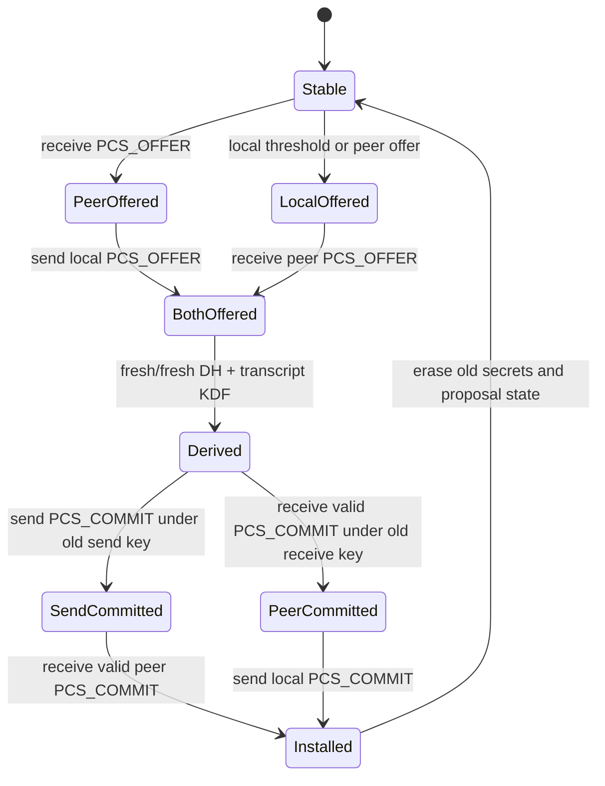

# Proteus v1.3 amendment — two-party fresh/fresh PCS ratchet

**Status:** α wire/state and production relay integration implemented;
promotion gates still open

**Handshake version byte:** `0x13`

**Record-layer capability:** mandatory for `0x13`; no silent downgrade

**Supersedes:** the one-shot bootstrap-DH healing claim, not the v1.2
triple-hybrid handshake

## 1. Security objective and boundary

The v1.2 α record layer performs one asymmetric step by combining a sender's
fresh X25519 secret with a receiver private key retained from the handshake.
That construction heals disclosure of the traffic secret alone. It does not
heal full session-state compromise, because the retained receiver private key
is part of the compromised state.

Version 1.3 requires both endpoints to generate fresh X25519 secrets after the
compromise point. Once the attacker has lost endpoint access and can only
observe the exchange, the resulting fresh/fresh DH value is unknown even when
every pre-exchange session secret was disclosed.

The guaranteed property is:

> Passive full-session-state post-compromise recovery after one completed,
> transcript-bound fresh/fresh exchange.

This amendment does not claim recovery while an attacker both retains active
network control and knows all authentication material used by the exchange.
Such an attacker can substitute a DH share. Active PCS requires an
authentication root outside the compromised session state, such as a
hardware-backed identity key or an external re-authentication ceremony.

The checked symbolic boundary is
`projects/proteus/formal/proverif/proteus-two-party-pcs-ratchet.pv`.

## 2. Cryptographic core

For generation `g`, the client and server independently generate:

```text
c_g_sk, c_g_pk = X25519.KeyGen()
s_g_sk, s_g_pk = X25519.KeyGen()
fresh_shared_g = X25519(c_g_sk, s_g_pk)
               = X25519(s_g_sk, c_g_pk)
```

Both sides reject an all-zero X25519 result as required by RFC 7748 §6.1.

Public-share ordering is always client then server, independent of which side
initiated the exchange:

```text
th_g = SHA-256(
    "proteus two-party pcs transcript v1" ||
    uint64_be(g) ||
    c_g_pk ||
    s_g_pk
)
```

The old directional state is also canonical:

```text
old_state_g = SHA-256(
    "proteus two-party pcs old state v1" ||
    old_c2s_secret ||
    old_s2c_secret
)

root_g = HKDF-Extract(
    salt = old_state_g,
    IKM  = fresh_shared_g
)

new_c2s_secret = HKDF-Expand-Label(
    root_g,
    "two-party pcs c2s v1",
    th_g,
    32
)

new_s2c_secret = HKDF-Expand-Label(
    root_g,
    "two-party pcs s2c v1",
    th_g,
    32
)
```

Mixing the old secrets preserves continuity and binds the new epoch to the
existing authenticated session. Security after full old-state disclosure comes
from `fresh_shared_g`, not from treating `old_state_g` as secret.

## 3. α control records

Two new record types are reserved:

| Type | Name | Plaintext |
|---|---|---|
| `0x14` | `PCS_OFFER` | `generation:u64_be || fresh_x25519_public:[32]` |
| `0x15` | `PCS_COMMIT` | `generation:u64_be || transcript_hash:[32]` |

Both plaintexts are exactly 40 bytes and therefore 56 bytes after the current
16-byte AEAD tag. They use an ordinary monotonically increasing sequence
number under the old directional key. They never use the ratchet sentinel
sequence number.

Control records count against the current epoch's record budget but not its
application-byte budget. They are consumed internally and never surfaced as
application payload.

## 4. State machine

Each bidirectional session owns one coordinator shared by its send and receive
halves. The coordinator stores only one in-flight generation.



The sender installs its new directional secret immediately after writing its
`PCS_COMMIT`. Ordered carriers guarantee all later records in that direction
arrive after the commit. The receiver installs its new directional secret only
after decrypting the commit with the old key and checking generation plus
transcript hash.

## 5. Concurrency and liveness rules

An incoming offer MUST wake the local send half even when the application has
no outgoing data. Otherwise a one-way bulk transfer can deadlock with one
endpoint waiting forever for the second fresh contribution.

The send half prioritizes pending PCS control records before application data.
It may continue sending old-key application records between `PCS_OFFER` and
`PCS_COMMIT`; ordered delivery keeps them unambiguous. It MUST NOT send
new-key application data before its commit has been fully written.

Simultaneous initiation is normal. A received offer for the current generation
is idempotent only when its public share is byte-identical. A second, different
share for the same generation is a fatal protocol error.

Only generation `current_generation + 1` is accepted. Stale, skipped, wrapped,
or mismatched generations fail closed. Generation exhaustion requires a fresh
outer handshake.

## 6. Failure and downgrade behavior

The following conditions close the Proteus session without α fallback:

1. X25519 all-zero shared output.
2. Generation mismatch, skip, replay, or wrap.
3. Conflicting offers for one generation.
4. Commit before both offers are known.
5. Commit transcript mismatch.
6. Application record under the new epoch before a valid commit.
7. Negotiated PCS capability followed by legacy one-shot `0x11` behavior.
8. Timeout while an exchange remains half-complete.

A half-complete exchange has a fixed 30-second deadline beginning with the
first local or peer offer. The deadline is enforced by both send and receive
halves; a receiver blocked on carrier input wakes at the deadline and closes
the session. It is cleared only after both authenticated commits complete.

A peer that does not authenticate `version = 0x13` MUST NOT receive
`PCS_OFFER` or `PCS_COMMIT`. Production v1.3 endpoints reject v1.2 and older
before key derivation; operators that need legacy compatibility must run a
separate explicit listener rather than silently downgrading one session.

## 7. Erasure requirements

After both commits complete, implementations erase:

1. Both old directional traffic secrets and derived AEAD keys.
2. The local fresh X25519 private key.
3. The fresh/fresh shared result.
4. Intermediate HKDF roots and old-state hashes.
5. In-flight offer and commit buffers.

Only the generation number, new directional secrets, and non-secret transcript
hash remain. Erasure is an implementation obligation; the ProVerif model does
not prove allocator, stack, crash-dump, or swap behavior.

## 8. Performance constraints

The exchange adds 112 ciphertext bytes plus α framing per endpoint: one
56-byte offer and one 56-byte commit. X25519 and two HKDF expansions run once
per rekey generation, outside the per-record hot loop.

The coordinator MUST NOT introduce a mutex acquisition for every data cell.
The hot path checks an atomic pending flag; locking occurs only when a threshold
fires or a control record arrives. This constraint protects the established
Hy2 head-to-head throughput margin.

The benchmark promotion gate compares v1.3 enabled versus disabled under the
same 512 MiB workload. Median throughput regression greater than 1% or a
statistically positive CPU-time regression greater than 3% blocks promotion.
The disabled control is a compile-time-only benchmark feature that retains the
v1.3 handshake and symmetric ratchet while omitting fresh/fresh PCS. Production
builds have no runtime downgrade switch, and the container build requires a
second explicit allow flag before it will compile the insecure control.

The 2026-07-19 promoted gate at commit `f05773a` passed with 30 runs per
mode: enabled throughput was 0.214% higher than control, while client CPU
time increased 0.342% (95% bootstrap interval +0.040% to +0.859%). The
production PCS-enabled image retained a +96.51% median throughput margin
over Hy2 in the same 512 MiB, 100 ms RTT, 0% loss cell. Raw arrays, image
IDs, qdisc counters, statistical method, and the single-host limitation are
preserved in
[`notes/perf/2026-07-19-v13-pcs-overhead.jsonl`](../../notes/perf/2026-07-19-v13-pcs-overhead.jsonl).

## 9. Required conformance gates

The wire/state implementation remains incomplete until all of these pass:

1. Client and server derive byte-identical canonical c2s/s2c secrets.
2. Repeating an exchange from identical disclosed old state produces different
   secrets because both endpoints regenerate X25519 keys.
3. Either low-order public share fails closed without state advancement.
4. Simultaneous offers converge on one generation.
5. A one-way transfer completes rekey without reverse application traffic.
6. Conflicting, replayed, skipped, and reordered control records fail closed.
7. The first new-key data record decrypts only after the matching commit.
8. A captured pre-rekey data record fails after installation.
9. Old secrets and proposal private keys are zeroized on success and failure.
10. ProVerif preserves the expected result vector:
    passive full-state secrecy `true`, active old-auth secrecy `false`,
    pre-compromise forward secrecy `true`.
11. The full α regression suite, sanitizers, clippy, dependency audit, and
    fuzz targets pass.
12. Matched Hy2 benchmarks satisfy the performance constraints in §8.

## 10. Promotion status

The cryptographic core, symbolic boundary model, exact wire records,
simultaneous-initiation wire path, production v1.3 negotiation, directional
relay wakeups, and repeated one-way rekeys exist as of 2026-07-19. Production
v1.3 rejects both older handshake versions and legacy `0x11` ratchet records.

The 30-second half-exchange deadline now wakes blocked send and receive halves.
The erasure audit also found and fixed a disabled dependency feature:
`x25519-dalek/zeroize` is mandatory so proposal private keys and DH shared
results erase on drop; directional roots already use `Zeroizing`.

The matched enabled-versus-disabled performance gate is now closed. Promotion
still requires sanitizer and fuzz gates plus independent review. Until those
gates close, v1.3 remains an implementation candidate. The README may report
only the narrower property already proved and tested: passive full-session-state
recovery after the attacker loses endpoint access and both fresh contributions
complete.
