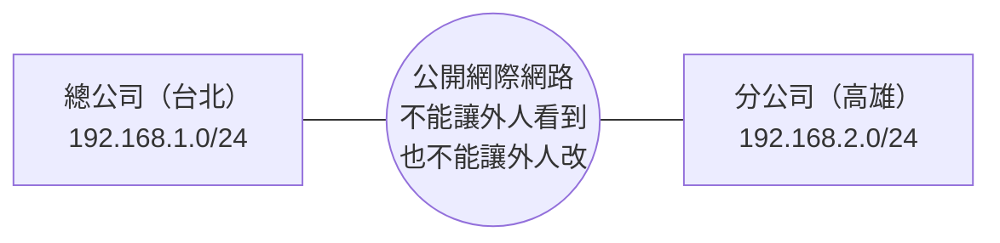
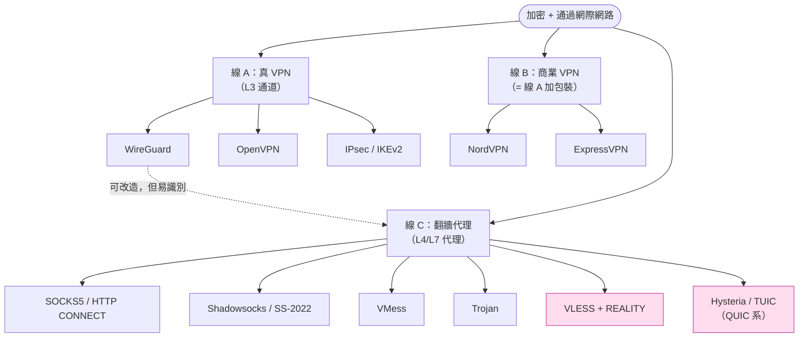

# 課堂 0.1 — 「VPN」這個詞被誤用了 30 年

## 學前知道

- **前置課**：無，這是第一堂。
- **預計閱讀時間**：20 分鐘。
- **這堂課不講技術細節**，只把你腦中的詞彙拆乾淨。整門課都會建在這份地圖上。

---

## 動機

你打開 App Store 搜「VPN」會跳出 NordVPN、ExpressVPN、Surfshark；打開 GitHub 搜「VPN」會跳出 WireGuard、OpenVPN、SoftEther；打開中文翻牆社群搜「VPN」會看到 Shadowsocks、Clash、機場、Hysteria。

這三批東西**幾乎沒有一個是同一回事**。它們解決不同問題、用不同協議、面對不同對手。但因為大家都叫「VPN」，於是新手永遠搞不清楚自己在學什麼、買什麼、配什麼。

這堂課的任務只有一個：**把這個詞拆成三條線**。拆完之後，後面 9 個 Part 你才知道每一節在講哪一條線上的事。

---

## 核心概念

### 「VPN」原本是什麼

VPN = **Virtual Private Network**，1990 年代企業界的發明。

當時的場景：



兩個分點各有自己的內部網段（`192.168.x.x`，這個記號 Part 1 會講），但中間隔著公開的網際網路。需求是讓「兩邊的電腦像在同一個區域網路裡一樣互通」，**而且訊息要加密**，避免在路上被人看到或竄改。

解法就是 VPN：在兩邊各架一台「VPN 閘道」，閘道之間建立一條**加密通道**，把兩邊的內網**虛擬地**接起來。從電腦的角度看，它在台北的同事跟在高雄的同事，沒差別。

**這個原始定義裡，三個關鍵字都重要**：

- **Virtual**（虛擬）— 不是真的拉一條光纖，是用軟體在現有網路上「假裝」出一條專線。
- **Private**（私有）— 加密 + 認證，外人看不到也進不來。
- **Network**（網路）— 重點，**它是把兩個網路合併**，不是「讓你連去某個伺服器」。

---

### 現在「VPN」這個詞被當作三件事

| | 線 A：**真 VPN** | 線 B：**商業 VPN 服務** | 線 C：**翻牆代理** |
|---|---|---|---|
| 代表 | WireGuard、OpenVPN、IPsec | NordVPN、ExpressVPN、Surfshark | Shadowsocks、Trojan、VLESS、Hysteria |
| 解決的問題 | 把兩個網路合併、遠端存取公司內網 | 隱藏 IP、跨區看 Netflix | 繞過 GFW、訪問被封鎖的網站 |
| 工作層級 | L3（IP 層）—— 接管整張網卡 | L3（套用真 VPN 協議） | L4/L7（TCP/UDP/HTTP 層）—— 按程式或規則代理 |
| 加密 | 是 | 是 | 是 |
| **抗審查/抗識別** | **不在意**（沒被封過） | **不在意**（在自由國家賣） | **核心需求**（不躲就死） |
| 客戶端形態 | 系統 VPN 介面、tun 接管所有流量 | 商業 app（內部跑線 A 的協議） | Clash / sing-box + 規則引擎 |
| 你會在哪看到 | 公司 IT、研究網路的人 | App Store、信用卡廣告 | GitHub `awesome-xxx`、TG 群、機場訂閱 |

**你現在用的 ccb + Clash Verge Rev 是線 C**。但中文圈習慣統稱為「VPN」，所以你一直以為自己在玩線 A。這個誤會解開，後面就順了。

---

### 三條線的「家族樹」

下面這張圖你不用記細節，先有個輪廓。後面 Part 5/6 會逐一解剖。



> 圖中粉色節點是現代 SOTA、也是我們研究設計的直接競品。

注意三件事：

1. **線 B 內部就是線 A**。商業 VPN 賣的東西本質是「我幫你維運一台 OpenVPN/WireGuard 伺服器，再加個漂亮 app」。技術上沒有第三條協議線，是商業模式不同。
2. **線 A 跟線 C 在「加密」這件事上是一樣的**。差別不在密碼學，差別在**威脅模型**——線 A 的對手是「想偷聽的人」，線 C 的對手是「想識別並封鎖你的國家級防火牆」。
3. **線 A 的協議在線 C 場景下會被打**。WireGuard 在台灣、香港、新加坡用得很爽，在中國大陸用會被很快識別並阻斷。**為什麼？** 答案是 Part 9（審查對抗）的重點。

---

### 威脅模型：差別其實在這

「威脅模型（threat model）」這個詞之後會反覆出現。意思就是：**你在防誰、那個對手能做什麼**。

| | **線 A 真 VPN** | **線 C 翻牆代理** |
|---|---|---|
| **對手** | 路上的監聽者 | 你和對端之間的國家級防火牆 |
| **對手能做** | 看封包、改封包 | 看封包、改封包、阻斷連線、主動探測伺服器、IP 拉黑、流量模式分析（封包大小、時序、burst） |
| **對手不能做** | 阻斷你（如果阻斷你會發現斷網了） | （幾乎沒有「不能做」） |
| **防禦目標** | 機密性 + 完整性 | 機密性 + 完整性 + **不可識別性 + 抗主動探測 + 抗流量分析** |

**這就是為什麼線 C 的協議一年要換一輪**：對手會進化，每一代協議都是對對手新招的回應。Trojan 的誕生是因為 Shadowsocks 被認出來了；VLESS+REALITY 的誕生是因為 Trojan 的證書指紋也被認出來了。Part 6 會帶你走完整條演化線。

---

### 一個容易踩的坑：「全局模式」≠「真 VPN」

你 Clash Verge Rev 裡有個「全局模式 / 規則模式 / 直連模式」的開關，還有個「TUN 模式」開關。很多人以為「打開 TUN 就變成真 VPN 了」——**不對**。

真相是：

- **TUN 模式**只是**接管流量的方式**。它讓 Clash 能拿到「整張網卡」的封包（不只是設了系統代理的 app）。
- 拿到之後，Clash 還是把封包**丟進它的代理協議**（SS / VLESS / Trojan…）送出去。
- 所以你還是在跑**線 C**，只是「客戶端攔截範圍」變大了。

**真 VPN 跟翻牆代理 + TUN 的差別**在於：

| | 真 VPN（如 WireGuard） | 翻牆代理 + TUN |
|---|---|---|
| 通道協議 | WireGuard 自己（線 A） | SS/VLESS/Trojan… 還是線 C |
| 對端看到的流量 | 一條 WireGuard 隧道 | 一條看起來像 HTTPS 的 TLS 連線 |
| 是否能合併網段 | 能 | 不能（代理沒這概念） |
| 抗識別 | 弱 | 強（如果用 REALITY 等現代協議） |

**結論**：TUN 模式是「**怎麼把流量交給代理**」的問題，不是「**用什麼協議連出去**」的問題。把這兩件事分開想，後面學 Part 4（OS 網路堆疊）和 Part 8（客戶端規則引擎）就不會卡。

---

## 與你經驗的連結

打開你 Clash Verge Rev 的某個節點細節，你大概會看到類似這樣的欄位（**這是公開範例，不是你訂閱裡的**）：

```yaml
- name: "示範節點"
  type: vless              # ← 線 C：翻牆代理協議
  server: vps.example.com
  port: 443
  uuid: 00000000-0000-0000-0000-000000000000
  network: tcp
  tls: true                # ← 套一層 TLS（Part 3 講）
  servername: cloud.example.org
  reality-opts:            # ← REALITY，最新一代抗識別技術
    public-key: ...
    short-id: ...
  flow: xtls-rprx-vision   # ← XTLS-Vision，效能優化
```

對照本堂的分類：

- `type: vless` → 線 C，VLESS 協議。
- `tls: true` + `reality-opts:` → 線 C 為了抗識別套的偽裝層。
- 全篇沒有任何「網段合併」「子網」「對端 IP 範圍」的東西 → 這就是線 C 的特徵：**它根本不是 Network**。

如果這是 WireGuard（線 A），你會看到的是：

```ini
[Interface]
PrivateKey = ...
Address = 10.0.0.2/24      # ← 我在 VPN 內網的 IP
DNS = 10.0.0.1

[Peer]
PublicKey = ...
AllowedIPs = 0.0.0.0/0     # ← 我要把哪些目的地走這條隧道
Endpoint = vps.example.com:51820
```

注意 `Address = 10.0.0.2/24`——你**真的在 VPN 內被分配了一個 IP**，這就是「Network」的本意。Clash 配置裡你看不到任何「我在代理內的 IP」這種東西，因為**翻牆代理沒有「我在裡面」這種概念**，只有「把這條 TCP 連線的目的地換掉」。

---

## 小練習

打開終端機跑這兩個指令，**對比結果**（不要怕看不懂，這只是觀察）：

```bash
# 1. 列出你目前所有網路介面
ifconfig | grep -E '^[a-z]' | head -20
```

你會看到一堆 `lo0`、`en0`、`utun0`、`utun1`…。

```bash
# 2. 看你目前的預設路由是什麼
netstat -rn | grep -E '^(default|0/1)' | head -5
```

**觀察題**：

- **A**：把 Clash TUN 模式關掉，跑一次上面兩個指令。
- **B**：把 Clash TUN 模式打開，再跑一次。
- **C**：對比兩次的差別。多了哪個 `utun*` 介面？預設路由的 `gateway` 變成什麼？

你**不需要**現在就解釋這些變化是什麼意思——Part 4 會詳講。這個練習的目的是讓你**親眼看到** Clash 點下「TUN 模式」按鈕後，OS 真的多了一張虛擬網卡、真的改了路由。**眼見為憑比讀十遍書都有用**。

---

## 自我檢查

能用自己的話回答下面這些就過關。答不出來告訴我哪題，我們重講。

1. 「VPN」這個詞在歷史上原本指什麼？三個關鍵字 V、P、N 各代表什麼意義？
2. 線 A、線 B、線 C 各舉一個你聽過的例子。
3. 為什麼線 A 的協議（如 WireGuard）拿來翻牆會被打？
4. Clash 的 TUN 模式 = 真 VPN 嗎？為什麼不是？
5. 「威脅模型」是什麼意思？線 A 跟線 C 的威脅模型差在哪一條？

---

## 延伸（可跳過）

- 「VPN」一詞的最早記載大致在 1996 年微軟的 PPTP（Point-to-Point Tunneling Protocol）規格裡——一個今天已經被廢棄的協議，因為加密弱到爆。對歷史好奇可以查 RFC 2637，但**完全不影響你後續學習**。
- 商業 VPN 服務（線 B）的商業模式有不少黑歷史：免費 VPN 經常賣使用者流量、付費 VPN 經常吹「軍事級加密」這種無意義的詞。如果未來你想評鑑一個商業 VPN，看的就是「它後端用什麼協議（WireGuard 為佳）、有沒有第三方審計、log 政策」這三件事。
- 中國境內**還有一個第四條線**：政府/企業核准的「合規 VPN」，本質是線 A 的 IPsec/L2TP，要實名、要備案、不能訪問被封網站。這條線跟你完全無關，知道有就好。

---

## 研究級補遺

> 這一節是把前面那個「友善版」分類學升級成「研究級」入口。新手可以先跳過，但這門課既然瞄準 SOTA，第一堂就要開始建立學界詞彙與引文意識。

### 1. 學界詞彙：你以後 google 要用這些詞

中文圈說的「翻牆」，在學術文獻裡叫 **censorship circumvention** 或 **anti-censorship**。整個研究領域的入口論文是：

- **SoK**: Tschantz, Afroz, Anonymous, Paxson. *SoK: Towards Grounding Censorship Circumvention in Empiricism*. **IEEE S&P 2016**.
  - 整個領域的方法論清算。我們 Part 9.1 會精讀。
- Khattak, Elahi, et al. *SoK: Making Sense of Censorship Resistance Systems*. **PoPETs 2016**.
  - 系統分類學的姊妹篇，給「circumvention systems」做了完整 taxonomy。我們 Part 10.10 會精讀。

「線 C」在學界叫 **encrypted circumvention proxy** / **fully encrypted protocol (FEP)**。**FEP** 這個詞特別重要——之後 Part 9.7 我們會精讀的 USENIX Security 2023 論文 *How the Great Firewall of China Detects and Blocks Fully Encrypted Traffic* (Wu et al.) 就是用這個術語打到了 SS / VMess / Trojan 這一整批。

### 2. 對手分類學（adversary taxonomy）：把「威脅模型」精確化

本堂正文裡我用了「對手能做什麼」的口語化描述。研究級需要更精確的分類：

```
按位置          按行為            按知識
─────────       ─────────         ─────────
on-path         passive           known-plaintext
（在路徑上）     （只觀察）         （知部分明文）
                                   
off-path        active            chosen-plaintext
（不在路徑上    （主動探測、       （能餵入流量）
 但能注入封包）   注入、阻斷）
                                   adaptive
in-path                            （多輪適應）
（在路徑上且
 能改包/丟包）
```

**GFW 的標準假設是 in-path + active + adaptive**——它能看你所有封包、能改、能丟、能主動探測你伺服器、會根據看到的東西調整策略。這是整門課的對手模型。

形式化版本是 **Dolev-Yao model**（密碼學界的標準對手模型，1983 年由 Dolev 與 Yao 提出）：對手控制整個網路、能截獲/修改/重放任何訊息，但不能破解密碼學原語。Part 3.15 我們用 ProVerif 形式化驗證協議時，背後就是這個模型。

### 3. 線 C 內部還有「世代」

本堂正文把所有翻牆代理塞進「線 C」一格，但內部其實有清楚的世代演化，每一代都是對 GFW 新能力的回應：

| 世代 | 代表 | 對手能力 | 防禦關鍵 |
|---|---|---|---|
| **G0** 明文代理 | SOCKS5、HTTP CONNECT | 無 DPI | （只解決「在哪」） |
| **G1** 流加密 | Shadowsocks (2012~2017) | 簡單 DPI | 加密 |
| **G2** AEAD + 認證 | SS-AEAD、VMess | 主動探測 | AEAD + 認證標籤 |
| **G3** TLS 偽裝 | Trojan | TLS ClientHello 指紋 | 偽裝成 HTTPS |
| **G4** TLS 借用 | VLESS+REALITY | 對證書/密鑰指紋驗真 | 借真實大網站握手 |
| **G5** QUIC 系 | Hysteria2、TUIC v5 | 對 TCP 流量分析 | 跑 UDP/QUIC + HTTP/3 偽裝 |
| **Proteus** ??? | **我們要做的** | （Part 9~10 列） | （Part 11 設計） |

**這也定位了我們研究目標的位置**：要做 Proteus，**同時繼承 G4 的抗識別深度與 G5 的速度優勢**——歷史上沒有協議同時拿下這兩件事，這就是我們研究的 contribution claim。

### 4. 「我們協議」在這張地圖上的座標

明確寫下來，後面所有 Part 都會回頭引用這幾行：

- **不是線 A**（不做 site-to-site VPN、不做 L3 隧道合併網段）
- **不是線 B**（不做商業服務）
- **是線 C 的 Proteus 候選**：
  - **抗識別等級**目標 ≥ G4（VLESS+REALITY）：對 in-path active adaptive 對手免疫
  - **速度等級**目標 ≥ G5（Hysteria2 / TUIC v5）：高丟包鏈路下吞吐領先
  - **可部署性**目標 ≥ G4：單 binary、配置複雜度不超過 REALITY
  - **形式化保證**目標**超越所有現存代理**：用 ProVerif/Tamarin 證 secrecy + authenticity + forward secrecy；用 TLA+ 證關鍵不變量

### 5. 一個閱讀任務（5 分鐘）

把以下三個資源加進你的 bookmark 或 RSS：

- **GFW.report** — <https://gfw.report/>。整個審查研究領域最重要的觀測站，論文 + blog 並重。我們 Part 9 整個 part 大量引用。
- **Censored Planet** — <https://censoredplanet.org/>。Michigan 大學的全球審查測量平台，方法論偏 macro。
- **net4people/bbs** — <https://github.com/net4people/bbs/issues>。協議作者吵架的地方，讀 issue 比讀 paper 學得更快。Hysteria、Xray、sing-box 的核心開發者都在裡面。

不需要現在讀，登記就好——以後每次 GFW 出新動作或新協議發布，你會在這三個地方第一時間看到。

---

下一堂：[**0.2 整門課的學習地圖**](./0.2-course-map.md)（12 個 Part 的依賴圖、為什麼這個順序、什麼時候可以並行讀）。
