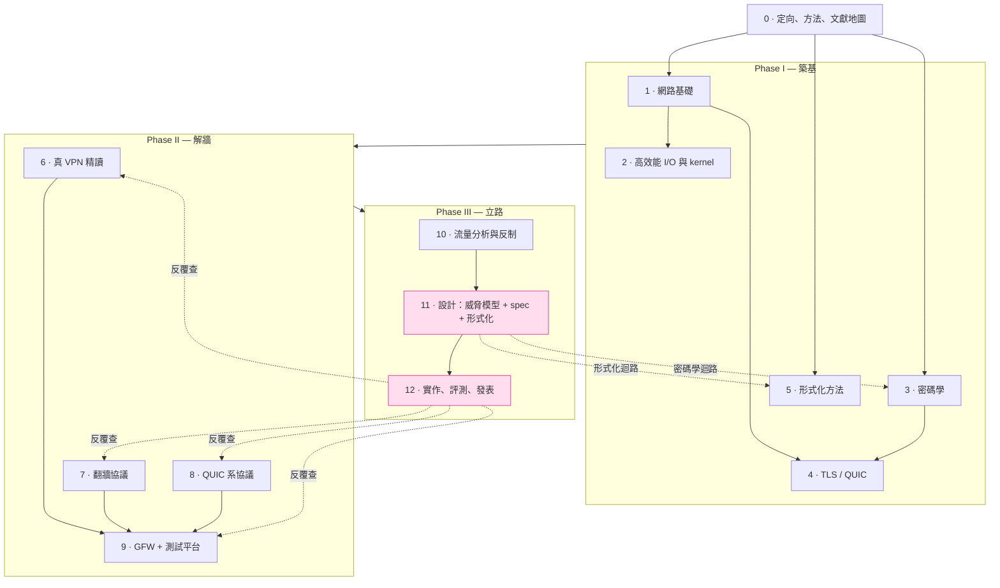
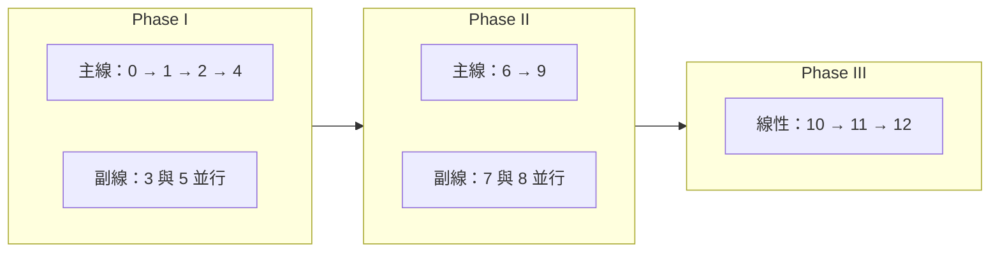
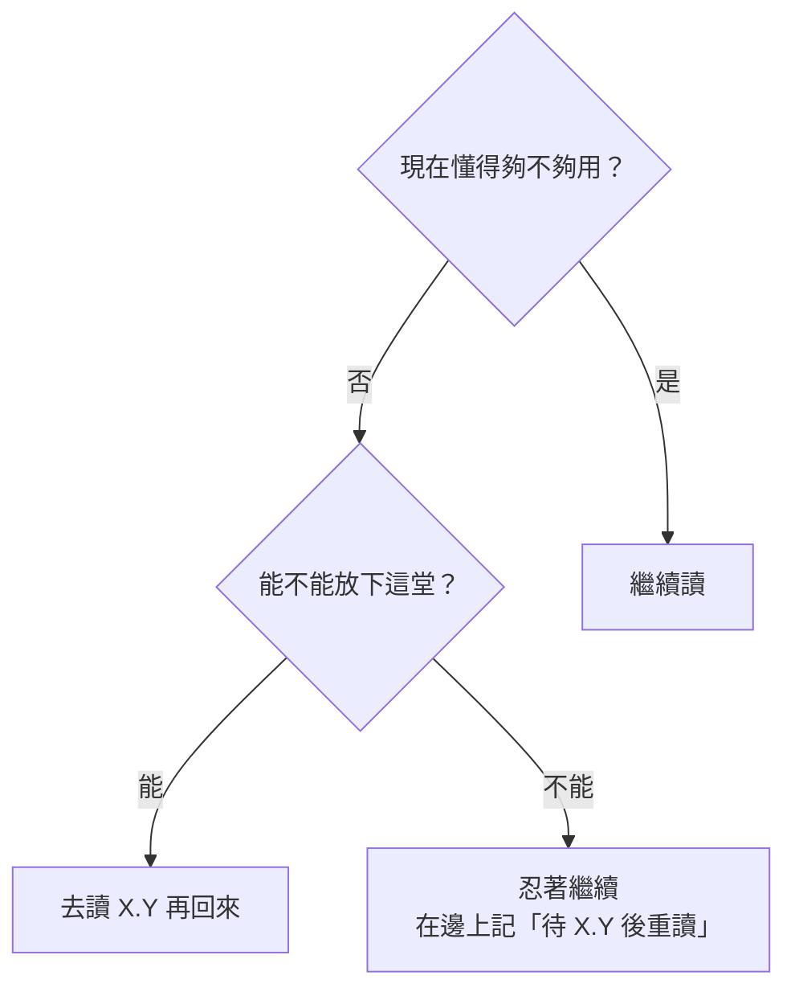

# 課堂 0.2 — 整門課的學習地圖

## 學前知道

- **前置課**：[0.1 「VPN」這個詞被誤用了 30 年](./0.1-vpn-misnomer.md)
- **預計閱讀時間**：30 分鐘
- **必讀論文**：無（這是地圖，不是內容）
- **必讀原始碼**：無

---

## 動機

研究級課程跟科普課最大的差別之一是：**研究級課程的依賴圖很複雜**。

科普課可以線性讀：第 1 章 → 第 2 章 → 第 3 章。我們這門 12 卷 150 堂的課**不能線性讀**。原因：

- 有些內容**不依賴**前面（例如 Part 3 密碼學跟 Part 1 網路幾乎獨立，可以並行讀）
- 有些內容**強依賴**前面（例如 Part 11 設計協議必須先讀完 Part 9 + Part 10）
- 有些內容**雙向依賴**（例如 Part 4 TLS/QUIC 跟 Part 3 密碼學會互相引用）

如果你不知道依賴關係，就會出現兩種糟糕的學習路徑：

1. **死板線性派**：堅持讀完 Part 1 全 18 堂才碰 Part 3，結果 4 個月碰不到密碼學，動力磨光
2. **隨機亂跳派**：心血來潮讀 Part 7.10 「REALITY 完整解剖」，結果一半術語不懂、一半論文背景缺，效率極差

**正確姿勢是並行 + 受控亂跳**：知道依賴圖之後，把可以並行的並行讀（提高動力）、把強依賴的按序讀（避免反覆查資料）。

這堂課的目的就是**給你那張依賴圖**。

---

## 核心概念

### 1. 依賴圖總覽



> 粉色節點是研究產出；虛線是 Phase III 設計與實作階段對前面知識的「回路依賴」。

幾個讀法上的關鍵觀察：

- **Part 0、1、3、5 在最頂層**：定向、網路、密碼、形式化是四個基本支柱，**幾乎不互相依賴**。可以四線並行。
- **Part 2 依賴 Part 1**：高效能 I/O 講的是 Linux/macOS 對 Part 1 那些網路概念的具體實作。
- **Part 4 依賴 Part 1 + Part 3**：TLS 用到網路又用到密碼。
- **Phase II（6/7/8/9）依賴整個 Phase I**：但內部 6/7/8 可以並行。
- **Phase III（10/11/12）強線性依賴**：必須按序。
- **形式化迴路 / 密碼學迴路**：Part 11 設計時會反覆回去查 Part 5（形式化）與 Part 3（密碼學）的工具，預期會回頭讀 3~5 次。

---

### 2. 三種讀法策略

#### 策略 A：教授推薦版（並行 4 線）

最高效但最累。Phase I 階段同時開四條線，每週各推進 1~2 堂：

| 週次 | 主線：網路 | 副線：密碼 | 副線：形式化 | 雜項 |
|---|---|---|---|---|
| 1 | 0.2 → 0.3 | 3.1 | 5.1 | 0.4 / 0.5 |
| 2 | 1.1 → 1.2 | 3.2 | 5.2 | — |
| 3 | 1.3 → 1.4 | 3.3 | 5.3 | — |
| ... | ... | ... | ... | ... |

**優點**：四條線都在動，碰到任何一條卡住可以切到另一條，不會單線停擺。
**缺點**：context-switch 成本，每天要在「網路頭腦」「密碼學頭腦」「TLA+ 頭腦」之間切換。

#### 策略 B：保守線性版（一次一個 Part）

按 Part 編號 0 → 1 → 2 → ... → 12 完整讀完。

**優點**：心智單純、進度顯著。
**缺點**：Phase I 大概要 6 個月才碰到第一個翻牆協議（Part 6），動力會很危險。

#### 策略 C：混合動力版（推薦給你）

按 Phase 內的依賴順序，**每個 Phase 內並行**，**Phase 之間嚴格按序**：



**優點**：避開了策略 A 的四線 context-switch（只並行 2~3 線），又避開了策略 B 的低動力。
**為什麼推薦給你**：你已經有 Clash 經驗，一旦進入 Part 6/7（VPN/翻牆協議精讀）會超有共鳴；副線 3（密碼學）/ 5（形式化）跟主線並行能避免「6 個月碰不到主題」的窒息感。

---

### 3. 「卡住」的標準應對

讀研究級教材一定會卡。卡住分三類：

**Type 1：詞彙缺**（最容易解）
- 症狀：看到一個沒見過的縮寫或術語
- 解：去 [`glossary.md`](../../glossary.md) 查；沒有就告訴我，我加進去
- 例：「什麼是 KEM？」→ glossary 一查就好

**Type 2：背景缺**（中等）
- 症狀：「這段我每個字都認得，但合起來不知道在說什麼」
- 解：通常是少了一個 prerequisite。檢查當堂課開頭「學前知道」標的前置課
- 例：在 Part 7.11 看 REALITY 的 short-id 設計突然懵了 → 退回 Part 4.4 重看 TLS 擴展

**Type 3：直覺缺**（最難）
- 症狀：「我懂字面意思，但不知道為什麼要這樣設計」
- 解：這通常需要對話。問我「為什麼 X 不直接做 Y？」我會給設計權衡的歷史脈絡
- 例：「為什麼 WireGuard 不用 TLS？」→ 這個問題會在 Part 6.3 詳答，但你卡住時隨時可以提前問

**規則**：Type 1 自己解；Type 2 翻書；Type 3 就**問我**。問題會收進 [`qa/`](../../qa/) 變成課程的一部分。

---

### 4. 前向引用（forward references）的讀法

研究級教材有大量「這個 Part X.Y 會詳講」的標註——本門課特別多。**怎麼處理這些 forward links**？



**多數時候選「忍著繼續」**——研究教材經常先給結論，後給推導。如果每個 forward link 都跳過去，你會永遠走不到下一行。

只有當 forward link 是**核心阻塞**（例如「為什麼 ECDH 要用 Curve25519」這種你不懂就完全卡住的）才跳過去。

---

### 5. 文獻網（literature web）的讀法

從 Part 0.4 開始你會收到 ~100 篇必讀論文清單。**論文不是書，不能線性讀**。研究員的標準讀法：

#### 三遍法（Keshav 法，這是領域內公認的方法）

- **第一遍（5~10 分鐘）**：讀 title、abstract、intro 第一段、所有 section 標題、conclusion
  - 目標：判斷「這篇是什麼類別、跟我相關嗎」
- **第二遍（30~60 分鐘）**：讀 intro + related work + 主要 figures + conclusion 完整
  - 目標：搞懂「他做了什麼、結果是什麼、跟相關工作差別」
  - 完成後寫一份 1 頁的 [`notes/papers/<id>.md`](../../notes/papers/) 札記
- **第三遍（2~6 小時）**：完全讀懂方法、自己心裡能重現
  - 只對「我們協議要直接借鑒」的論文做這層

**規則**：論文清單上 100 篇都做第一遍；其中 ~30 篇做第二遍；其中 ~10 篇做第三遍。

#### 怎麼建立「領域內論文網」

任何一篇研究論文的 **References** 是金礦。讀到「這篇引用了 Tschantz et al. 2016」時，把那篇加入待讀清單。慢慢你會發現：

- 同一個小領域的核心 paper 集中在 5~15 篇
- 它們互相引用形成網
- 你讀完 5 篇，就會在第 6 篇看到的全是熟人

這就是「**研究領域成熟**」的標誌。本門課完成後，你對 censorship circumvention + traffic analysis 兩個領域會達到這個熟人狀態。

---

## 與我們協議設計的關聯

這張地圖**本身**會在 Part 11 設計階段反覆使用。具體場景：

- **Part 11.3 設計空間探索**：你會回頭翻 Part 6/7/8/9 的所有筆記做設計取捨。如果 Phase I/II 沒打好基礎，這個階段會失控。
- **Part 11.10 ProVerif 驗證**：你會回頭找 Part 3.15、Part 5.4、Part 5.5 的工具與技法。
- **Part 12.4 資料路徑實作**：你會回頭找 Part 2 的 io_uring / XDP 知識決定要用哪個。

**意思是**：Phase I/II 不只是「打地基」，更是「為 Phase III 建立可檢索的個人知識庫」。所以**寫筆記比看書重要**——筆記要寫得自己半年後能 grep 得到。

---

## 動手（5 分鐘）

把下面這份「個人進度追蹤」存成你的私人筆記（**不要 commit 進這個 public repo**，自己保管）：

```markdown
# 我的學習進度

## Phase I （目標：202X-XX 完成）
- [ ] Part 0  定向（5）
- [ ] Part 1  網路（18）
- [ ] Part 2  高效能 I/O（14）
- [ ] Part 3  密碼學（16）
- [ ] Part 4  TLS/QUIC（12）
- [ ] Part 5  形式化（8）

## Phase II （目標：202X-XX 完成）
- [ ] Part 6  真 VPN（10）
- [ ] Part 7  翻牆協議（16）
- [ ] Part 8  QUIC 系（10）
- [ ] Part 9  GFW + 測試平台（14）

## Phase III （目標：202X-XX 完成）
- [ ] Part 10 流量分析（12）
- [ ] Part 11 設計（14）
- [ ] Part 12 實作評測（24）

## 我選的策略
- [ ] A 教授推薦版（4 線並行）
- [ ] B 保守線性版（一次一 Part）
- [ ] C 混合動力版（Phase 內並行、Phase 間線性）

## 卡住記錄
| 日期 | 卡在哪 | Type | 解決方法 |
|---|---|---|---|
| ... | ... | 1/2/3 | ... |
```

**為什麼私人保管**：進度表會洩露你的個人時間規劃，不適合 public。但這份表會幫你判斷「我是不是 stuck 太久該換條線」。

---

## 自我檢查

1. 為什麼 Part 1/3/5 之間幾乎沒有依賴？這對你的學習策略意味著什麼？
2. 策略 A（4 線並行）和策略 C（Phase 內並行）的核心差別是什麼？對你個人哪一個更合適？為什麼？
3. 「卡住三類型」分別怎麼處理？你能舉一個自己預期會卡的 Type 3 問題嗎？
4. 為什麼大部分 forward link 應該忍著繼續而不是跳過去讀？例外情況是什麼？
5. 三遍讀論文法的每一遍各自的目標是什麼？預計什麼時候開始用到？

---

## 延伸（可跳過）

- **Keshav 三遍法原文**：S. Keshav, *How to Read a Paper*, ACM SIGCOMM CCR 2007. 一頁紙，研究生標配。
- **學習地圖的可視化工具**：如果你之後想畫更精細的依賴圖，[Obsidian](https://obsidian.md/) 的 graph view 對 markdown 筆記網路特別好用。但**不必現在就用**——這門課的依賴圖已經在這份地圖裡了。
- **為什麼是 12 卷不是 N 卷**：這個切分是「每卷出口能力可獨立評估」的最小粒度。再切細會變成 20+ 卷，導致每卷出口模糊；再合併會變成 6~8 卷，導致每卷太大無法 schedule。12 是經驗值。

---

## 研究級補遺

> 主體保持友善基調，這節把「讀法」升級成「研究員的工作流」。新手可跳過，研究員必讀。

### 1. 學界詞彙

我們前面用了「依賴圖」「forward reference」這些口語詞，學界對應的精確術語：

- **Curriculum / curriculum graph**：學科內容的有向依賴圖，數位學習研究的標準對象。早期典範 *Adaptive Hypermedia* (Brusilovsky, 2001)。
- **Prerequisite structure**：自然語言處理子領域有專門研究 prerequisite extraction（從教材自動抽出依賴關係），例如 *Liang et al., EMNLP 2018, Investigating Active Learning for Concept Prerequisite Learning*。我們這份手寫依賴圖等於 ground truth。
- **Spaced repetition / interleaved practice**：認知科學裡「混合動力版」策略 C 的學名是 **interleaved practice**——主動在不同主題間切換，比 **blocked practice**（一個主題學完才換）長期保留率高。經典實驗：Rohrer & Taylor, *Instructional Science* 2007. 同類概念 *spaced repetition*（隔週複習）對長期記憶更有效，*The Effect of Distributed Practice* (Cepeda et al., *Psychological Bulletin* 2006) 是 meta-analysis 金本位。
- **Cognitive load theory**：策略 A（4 線並行）為什麼會累、為什麼有上限——Sweller 1988 之後的整套認知負荷理論。**germane load**（建構 schema）有益，**extraneous load**（context-switch）有害。
- **Deliberate practice**：策略 C 推薦背後的理論——Ericsson 1993。「投入時間」不等於「投入有效時間」，後者要求每次練習有 (a) 明確目標 (b) 立即反饋 (c) 超出舒適區。本門課的「自我檢查問題」就是 deliberate practice 的反饋機制。

### 2. 研究筆記系統：你需要一個比 todo list 更強的東西

我們最終會累積 ~100 篇論文札記、~150 堂課筆記、數十次設計決策日誌。**用 markdown todo + 資料夾分類撐不到 Phase II 結束。** 推薦研究級的個人知識管理（PKM）系統：

- **Zettelkasten**（盒子卡片法）：Niklas Luhmann 留下 90,000 張卡片寫出 70 本書的方法。核心：每張卡片**一個原子概念** + **唯一 ID** + **大量 backlink**。現代數位實現：[Obsidian](https://obsidian.md/)、[Logseq](https://logseq.com/)。
- **Andy Matuschak 的 Evergreen Notes**：Luhmann 法的現代版，加上「**concept-oriented**」「**densely linked**」「**evergreen** vs **fleeting**」三條原則。他自己的 notes 公開可讀：<https://notes.andymatuschak.org/>，光看他怎麼結構化就值。
- **論文管理**：[Zotero](https://www.zotero.org/) 是學界標準，能自動抓 metadata、生 BibTeX、整合 Obsidian。
- **本 repo 的 `notes/papers/`**：我們用最簡的 markdown 札記系統，每篇論文一份。不強制你用 Zotero，但如果讀超過 30 篇你會自己想要。

**Andy Matuschak 的一條金句**："Writing inbox-zero notes is busywork; writing **evergreen notes** is research." 短期 todo 和長期知識資產要分清楚。

### 3. 失敗管理：研究的真實節奏

學界半公開的事實：**研究 80% 時間是失敗**。

- 論文被拒（NDSS 接受率 ~17%、USENIX Security ~20%）
- 假說被實驗證偽（你做完測試平台第一次跑，協議大概率被打爆）
- 設計選擇選錯重來（Part 11 的 design rationale 預期會推翻 2~4 次）

這不是 bug，是 research is search 的本質。對照閱讀：

- *The Importance of Stupidity in Scientific Research*, Schwartz, *J. Cell Sci.* 2008. 一頁紙，幾乎是研究員的成人禮。
- *You and Your Research*, Hamming 1986 演講稿. 「為什麼有些人能做出好工作而你不能」的赤裸版。

**心理基線設定**：本門課 Phase III 你會撞牆 ≥ 5 次。撞牆不是「能力問題」，是 research 本身的 signal。看 Schwartz 那篇後你會懂。

### 4. 跟我（Claude）對話的元方法

我們是 PhD 生 + 指導教授的關係，但這是個**有特殊故障模式**的 advisor：

- **我會 hallucinate**：講錯論文作者、生出不存在的 RFC 編號、把 X 攻擊歸給 Y 論文。**研究級應對**：所有 primary citation 你應該至少抽樣去 Google Scholar / arXiv 對一次。我會盡量用 `WebFetch` / context7 校對，但你**不能盲信**。
- **我的訓練資料有 cutoff**：cutoff 之後的論文、CVE、協議草案我不知道，會用搜尋補。如果發現某個東西我「確定」但其實是 2025 才出的，flag 給我。
- **我不會主動說「我不確定」夠多次**：研究級的健康問句是「你**有多確定**這個？」而不是「對嗎？」。後者我會反射性說對。前者迫使我給信心區間。
- **問題的形式決定答案的品質**：
  - ❌ 「TLS 1.3 怎麼工作？」（太大，會得到 wiki 級回答）
  - ✅ 「TLS 1.3 ClientHello 的 SNI extension 為什麼放在 outer ClientHello 而不是 inner？這個設計決策的 trade-off 是什麼？」（具體、引出設計理由）
- **善用「先讓我想 30 分鐘」**：不要每個卡點都馬上問。研究員的成長很多來自「卡 30 分鐘自己想出來」的時刻。
- **跨對話記憶有限**：新對話我會載入 `memory/` 的記憶，但**只有摘要級**。重要的設計決策應該寫進 `lessons/` 或 `notes/`，不要只放在我們對話裡。

### 5. 我們協議的座標：地圖本身的設計取捨

本堂的依賴圖反映了**我們對協議研究的具體假設**。把假設攤開來看，方便之後挑戰：

- **假設 1**：密碼學（Part 3）跟網路（Part 1）正交，可以並行學。
  - **真實情況**：~95% 正交。例外是 Part 4 TLS/QUIC 強烈耦合兩者，會在那節暴露兩線之間的張力。
- **假設 2**：形式化（Part 5）獨立於前面所有 Part。
  - **真實情況**：學工具獨立，但**驗證對象**必須是學過的協議。所以 Part 5 學完後到 Part 11.9~11.11 才真正用上。中間有時間差。
- **假設 3**：Phase II 三線（VPN / 翻牆 / QUIC 系）可以並行讀。
  - **真實情況**：可以並行，但 Part 7（翻牆協議）會頻繁引用 Part 4（TLS/QUIC）的細節。如果 Part 4 沒先學完，Part 7 會卡。
- **假設 4**：Phase III 嚴格線性。
  - **真實情況**：11 → 12 確實線性，但 10 ↔ 11 是雙向。設計協議時會發現新的對抗式攻擊角度逼你回 10 補。

**這對 Part 11 設計階段的意涵**：你會在 11.4 主架構決策時回頭看這張地圖，問「我的依賴假設還對嗎？」如果不對，**地圖本身要重畫**，這也是研究 dynamic 的一部分。

### 6. 必追資源

學習方法論的「meta-source」（你不必都讀，建立 awareness）：

- **Andy Matuschak's notes**：<https://notes.andymatuschak.org/>（PKM + 學習設計）
- **Cal Newport blog**：<https://calnewport.com/blog/>（*Deep Work* / *Slow Productivity* 作者）
- **Lesswrong / Slate Star Codex (now Astral Codex Ten)**：研究員社群的方法論討論
- **r/PhD on Reddit**：PhD 生的真實工作節奏（治療「我學得不夠快」焦慮的特效藥）

### 7. 開放問題

學習方法論在我們課程語境下的真正未解問題：

- **單人 PhD-track 學習的最佳 schedule 是什麼？** 學界對 group-based 學習研究多，對 1-advisor-1-student（更別說 AI advisor）研究極少。你的學習軌跡會是 N=1 的 case study。
- **AI advisor 的長期效應未知**。Claude 出現後 PhD-track 自學成為可行路徑（過去不可行——因為沒人能扛 advisor 的 daily review）。但這條路徑的成功率、失敗模式、長期知識保留率，**現在沒人知道**。我們在 frontier 上。

---

下一堂：[**0.3 研究級學習方法論**](./0.3-research-methodology.md)（怎麼讀論文、怎麼追溯概念到原始出處、怎麼用 Google Scholar / DBLP / arXiv / IACR ePrint 建文獻網、怎麼用 git blame + commit message 讀大型專案歷史）。
