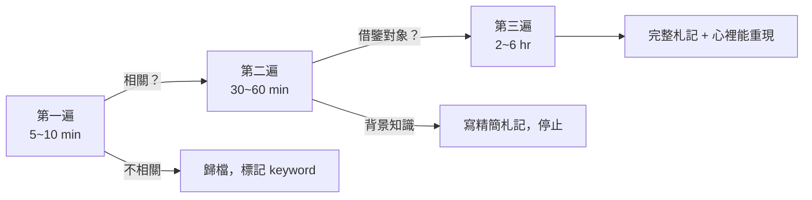
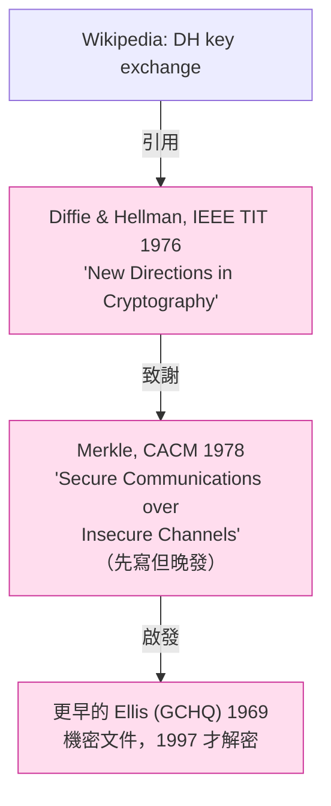
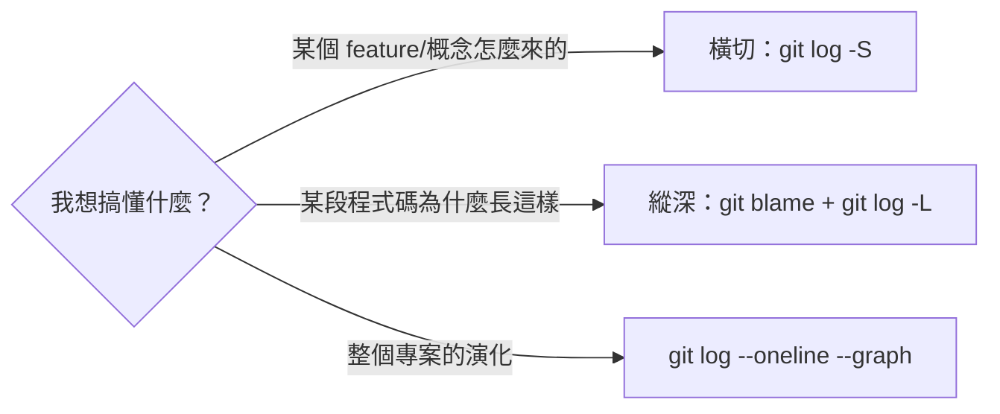

# 課堂 0.3 — 研究級學習方法論

## 學前知道

- **前置課**：[0.2 整門課的學習地圖](./0.2-course-map.md)
- **預計閱讀時間**：35 分鐘
- **必讀論文**：
  - S. Keshav, *How to Read a Paper*, ACM SIGCOMM CCR 2007（一頁紙）
  - R. W. Hamming, *You and Your Research*, 1986 演講稿（不是論文，但同等重要）
  - 推薦但不強制：B. Buchanan & R. Buchanan, *On Asking Good Questions*, Lancet 2005
- **必讀原始碼**：無

---

## 動機

0.2 教你**怎麼安排** 12 卷的學習順序，**這堂教你「每堂學習行為本身」怎麼做**。

這兩件事的差別像「行軍路線」和「個人戰鬥技能」：路線再好，士兵不會射擊也沒用。研究級的學習行為跟一般學生差別在五件具體的事：

1. **讀論文不是讀書** —— 每篇論文一份札記，一輩子建一張個人文獻網
2. **追溯到 primary source** —— 不接受「某 blog 說 X」當證據
3. **讀原始碼像讀史料** —— `git blame` / `git log` 是一手史
4. **筆記是 evergreen 不是 fleeting** —— 寫給半年後的自己看
5. **問題的形式比答案更重要** —— 問對問題比 google 出答案值錢 10 倍

這堂逐一拆解。**這些不是建議，是研究員的職業技能**——學不會這五件事，你後面 ~100 篇必讀論文會把你壓死。

---

## 核心概念

### 1. 三遍讀法（Keshav method），加強版

0.2 已介紹過骨架。這裡給可操作版。



#### 第一遍：判讀

- **讀什麼**：title、abstract、intro 第一段、所有 section/subsection 標題、figure caption、conclusion
- **目標**：5 個問題的答案
  1. **Category**：這是什麼類別的論文？（measurement / system / theory / SoK / position）
  2. **Context**：跟什麼相關工作對話？
  3. **Correctness**：假設看起來合理嗎？
  4. **Contribution**：宣稱的主要貢獻是什麼？
  5. **Clarity**：寫得清楚嗎？
- **輸出**：在 `notes/papers/{shortid}.md` 建檔，至少寫到 `**One-line**:` 那行

> Keshav 把這個叫 **Five Cs**。記住這五個 C，你以後拿到任何論文都不會蒙。

#### 第二遍：理解

- **讀什麼**：完整 intro、related work、所有 figures（特別注意座標軸與單位、是不是 log scale、誤差棒）、所有 table、conclusion
- **跳過什麼**：證明、複雜方法描述、附錄
- **目標**：能用 5 句話跟同行解釋論文做了什麼、結果是什麼、為什麼這比相關工作好
- **輸出**：完成札記的 Problem / Contribution / Method / Results / How it informs our protocol design 五段

> 第二遍經常會發現「這論文不值得做第三遍」——那就停在這裡。研究員 80% 讀的論文都停在第二遍。

#### 第三遍：重現

- **讀什麼**：完整方法、證明、附錄
- **目標**：心裡能重現實驗 / 推導，可以閉著眼睛跟人講解 30 分鐘
- **方法**：先試著**自己重新發明一次方法**，再對著論文看。每次跟論文有出入就停下來想「為什麼他們選這個我選那個」
- **輸出**：札記寫滿到 Open questions

> 第三遍只對 ~10% 的論文做。你最後做完的協議**直接借鑒**的那幾篇必須做第三遍。

---

### 2. 追溯到 primary source

研究員的職業病：**看到任何概念都想回去找它第一次被提出的地方**。

#### 為什麼

- **避免 Chinese-whisper effect**：A 引 B 引 C 引 D，D 是原文。中間每一手都可能扭曲。維基百科最常踩這個坑
- **理解設計動機**：原文通常**寫了為什麼**，後人引用時只摘結論，動機消失。沒有動機，你的設計取捨會盲
- **發現 unsaid assumptions**：原文受限於當時的環境（硬體、其他協議、攻擊面）才這樣設計。後人套用到新環境時這些假設可能已經不成立——但不讀原文不會知道

#### 怎麼做：一個具體案例

「**Diffie-Hellman 金鑰交換**」——這個概念你以後會看到 100 次。它的真實出處是哪？



幾個你只有讀原文才會知道的事：
- 這算法**真正的發明者**有爭議：Merkle 寫得早但發得晚；Ellis 在 GCHQ 1969 就做出來了但機密
- 1976 原論文**不只**講 DH，還包括了「公鑰加密」的整個概念
- 「中間人攻擊」在原文裡有討論，不是後人加的

**追溯工具**：

| 工具 | 用法 | 強項 |
|---|---|---|
| **DBLP** <https://dblp.org> | 搜作者名、論文標題 | 計算機領域最完整的書目資料庫，metadata 比 Scholar 準 |
| **Google Scholar** <https://scholar.google.com> | 搜任何詞 | 覆蓋廣，「Cited by N」按鈕能追後續引用 |
| **Semantic Scholar** <https://www.semanticscholar.org> | 同上 | 多了「TLDR」自動摘要，論文 graph 視覺化好用 |
| **Connected Papers** <https://www.connectedpapers.com> | 給一篇論文，看它的「鄰居」 | 視覺化整個 sub-field 的論文網 ⭐ |
| **arXiv** <https://arxiv.org> | 搜 preprint | 物理 / 數學 / CS 的 preprint 倉庫，新論文最早出現的地方 |
| **IACR ePrint** <https://eprint.iacr.org> | 搜密碼學 preprint | 密碼學專屬 arXiv，所有近代密碼論文先在這裡 |
| **The Internet Archive Scholar** <https://scholar.archive.org> | 搜舊論文 / 死連結 | 找回 paywall 後消失的論文 |
| **Sci-Hub** | （視所在地法律狀態而定） | — |

#### 規則

- 看到「**XXX et al. 2018**」這種引用，不查原文你不能用這個概念
- 看到「**眾所周知 X**」，**追問「誰先說的？」** 通常會發現「眾所周知」是社群幻覺
- 看到「**業界普遍做法**」，要求對方給 RFC / 論文 / 商業專利。給不出 = 還沒被嚴肅檢驗

---

### 3. 讀原始碼：git archaeology

我們會通讀 4+ 個大型專案（wireguard-go、Xray、sing-box、quic-go）。**讀大型專案不能像讀小程式一樣從 main() 開始往下讀**——會在 5 分鐘內迷路。

研究級讀原始碼有兩個正交策略：**橫切（追一個概念）** vs **縱深（追一個檔案）**。

#### 橫切策略：追概念演化

問：**「Xray 的 REALITY 是怎麼一步步加進去的？」**

工作流：

```bash
# 1. 找關鍵字第一次出現
git log --all --oneline -S "REALITY" -- path/to/repo

# 2. 看那個 commit 的完整 diff
git show <commit-sha>

# 3. 看作者寫的 commit message（這是史料）
git log <commit-sha> --format=fuller

# 4. 跟蹤後續演化
git log --all --oneline --follow -- transport/internet/reality/
```

**Commit message 是金礦**：好的開源作者會在 commit message 寫設計動機。RPRX (Xray 作者) 的 commit message 就特別詳細。

#### 縱深策略：讀懂一個關鍵檔

問：**「`transport/internet/reality/reality.go` 到底在做什麼？」**

工作流：

```bash
# 1. 看這個檔案是誰寫的、什麼時候、改過幾次
git log --follow --stat path/to/file.go

# 2. 看每一行的最後修改者（responsible person）
git blame path/to/file.go

# 3. 對某行不解？看那行的歷史
git log -L <linenum>,<linenum>:path/to/file.go

# 4. 想知道某個函數什麼時候加的？
git log -L :functionName:path/to/file.go
```

`git log -L` 是被低估的神器。它顯示**指定行範圍/函數的完整歷史**，比 `git blame` 強得多。

#### 兩個策略的時機



#### 補充工具

- **`tig`**：終端機的 git GUI，比 `git log` 好用十倍。`brew install tig`
- **`gitui`**：更現代的替代，Rust 寫的。`brew install gitui`
- **GitHub blame view**：網頁版 blame 直接點到 PR，能看到 review 對話，**這是讀別人專案的非對稱優勢**

---

### 4. 筆記紀律：fleeting vs evergreen

我們會累積 ~150 堂課筆記 + ~100 篇論文札記 + 數十次設計決策日誌。沒有筆記紀律會崩。

#### 兩種筆記的區別

| | **Fleeting notes** | **Evergreen notes** |
|---|---|---|
| 寫給誰 | 當下的自己 | 半年後/三年後的自己 |
| 壽命 | 幾天到幾週 | 永久 |
| 結構 | 流水帳 | 一個概念一檔 |
| 命名 | 日期 | 概念名 |
| 例 | 「今天讀完 §3.2，TLS handshake 的 SNI 部分搞懂了」 | `notes/concepts/sni-extension.md` 描述 SNI 的角色、設計動機、安全意涵、跟 ECH 的關係 |

來源：Andy Matuschak 的 evergreen notes 方法論 <https://notes.andymatuschak.org/Evergreen_notes>。Niklas Luhmann 的 Zettelkasten 是源頭。

#### 我們 repo 的具體實踐

```
lessons/             ← 教材本身（既是 fleeting 也是 evergreen，特殊形態）
notes/papers/        ← 每篇論文一份 evergreen 札記
notes/concepts/      ← （將來可能加）每個重要概念一份 evergreen 卡片
qa/                  ← fleeting → 隨堂答疑，按日期歸檔
你私人的 todo / 進度  ← 不 commit，純 fleeting
```

#### Evergreen note 的五條原則（Matuschak）

1. **Atomic**：一個概念一張卡，不要塞多個
2. **Concept-oriented**：標題是概念名（「DH 金鑰交換」），不是來源（「TLS 1.3 RFC 第 4.1.2 節」）
3. **Densely linked**：大量交叉連結。一張沒被連結的卡基本沒用
4. **Phrased as claims**：標題寫成主張（「DH 在中間人攻擊下不安全」），而不是話題（「DH 中間人攻擊」）
5. **Personal**：寫給自己，不要假裝寫給「公眾讀者」

#### 我們現階段的實作門檻

不要求你立刻搞 Zettelkasten。**先做到一件事就好**：每篇讀過的論文寫一份 `notes/papers/{shortid}.md`。這已經是 80% 的研究員都做不到的紀律。

---

### 5. 問問題的形式

學界有句老話：「**A well-formulated question is half the answer.**」這對你跟我（Claude）對話特別重要——0.2 已經提過大方向，這裡給可操作的問題模式。

#### 反模式（不要問）

| 反模式 | 例 | 為什麼壞 |
|---|---|---|
| 太大 | 「TLS 怎麼工作？」 | 會得到 wiki 級回答，沒重點 |
| 二元 | 「VLESS 比 Trojan 好嗎？」 | 我會反射性說「看情況」，沒幫助 |
| 假前提 | 「為什麼 WireGuard 用 TLS？」 | WireGuard 不用 TLS。我會被前提帶偏 |
| 求結論 | 「我們協議該用哪個傳輸層？」 | 設計決策不能外包，我會給意見但你會錯過思考過程 |

#### 正模式

| 正模式 | 例 | 為什麼好 |
|---|---|---|
| 機制問 why | 「TLS 1.3 SNI 為什麼要放在 outer ClientHello 而不是 inner？」 | 引出設計理由 |
| 比較 trade-off | 「VLESS vs Trojan 在『被主動探測』這個威脅向量下各自的弱點是什麼？」 | 強迫精確化 |
| 自己給假設 | 「我認為 WireGuard 跟 TLS 不同是因為 X、Y、Z，對嗎？」 | 我可以校對你的理解，比白問效率高 10 倍 |
| 標明信心 | 「你**有多確定** X？我看到 Y 的論文好像不一樣」 | 避免我反射說對 |

#### 一個健康的對話節奏

```
卡住 → 自己想 30 分鐘 → 寫下你的猜測（哪怕錯的）→ 帶猜測來問
```

這比「卡住立刻問」高效十倍。原因：**寫下猜測這個動作本身**會迫使你定義問題；很多時候寫到一半就發現答案了。

---

## 與我們協議設計的關聯

這五件事在 Phase III 會直接收成：

- **三遍讀法**：Part 9（GFW 研究）會給你 ~25 篇論文清單，沒這個方法你會被淹死
- **追溯 primary source**：Part 11 設計時會反覆問「為什麼 X 這樣設計？」沒有 primary 來源你就只能抄而不能改
- **git archaeology**：Part 6.4~6.6 通讀 wireguard-go、Part 7.14~7.16 通讀 Xray/sing-box/mihomo 全靠這個
- **evergreen notes**：Phase II 結束時你應該有 ~100 篇論文札記 + ~50 個概念卡。Phase III 設計階段你會反覆 grep 它們
- **問問題的形式**：跟我合作的整體效率取決於這個。學會這個你的學習速度會 2~3x

---

## 動手（30 分鐘）

完成兩件事：

### 1. 設好工具鏈（10 分鐘）

```bash
# git archaeology 工具
brew install tig

# 論文管理（可選，但強烈推薦）
brew install --cask zotero

# Zotero 連接器（從瀏覽器一鍵存論文）
# https://www.zotero.org/download/connectors
```

### 2. 第一次三遍讀法練習（20 分鐘）

對 **Keshav, How to Read a Paper, SIGCOMM CCR 2007** 本身做第一遍。論文 1 頁，PDF：<https://web.stanford.edu/class/ee384m/Handouts/HowtoReadPaper.pdf>

完成後在 `notes/papers/keshav-how-to-read.md` 建檔（用 [`notes/papers/README.md`](../../notes/papers/README.md) 的模板），至少寫到 `**One-line**:`。

> 這是個 meta 練習：**用論文教的方法讀那篇論文**。完成後你已經符合「讀過至少一篇學術論文」的研究級基準線。

---

## 自我檢查

1. Keshav 的 Five Cs 是哪五個？你能對 Keshav 自己那篇論文說出五個 C 的答案嗎？
2. 「DH 金鑰交換」追到原始出處後，你發現了至少兩件「只讀後人引用不會知道」的事，分別是什麼？
3. `git log -S` 跟 `git blame` 跟 `git log -L` 各自回答什麼問題？什麼時候用哪個？
4. Andy Matuschak 的 evergreen notes 五條原則是？你能舉一個本門課將來會出現的「壞標題 vs 好標題」對比嗎？
5. 為什麼「卡住立刻問」比「自己想 30 分鐘 + 寫下猜測再問」差？這跟密碼學裡 active vs passive 對手有什麼類比關係？

---

## 延伸閱讀

- **Hamming, *You and Your Research*, 1986**：演講稿，YouTube 也有錄影。「為什麼有些人能做出好工作而你不能」的赤裸版。<https://www.cs.virginia.edu/~robins/YouAndYourResearch.html>
- **Karpathy, *A Recipe for Training Neural Networks*, 2019**：對 ML 的講解，但**方法論部分**對任何工程研究都通用。<https://karpathy.github.io/2019/04/25/recipe/>
- **Buchanan, *On Asking Good Questions*, Lancet 2005**：醫學界的，但問問題的原則跨領域通用
- **Adler, *How to Read a Book*, 1940**：四層閱讀法的源頭。Keshav 三遍法可以視為它的論文版簡化

---

## 研究級補遺

> 主體已經是研究方法論，這節把「方法論的方法論」往上推一階——meta-methodology。新手可跳過。

### 1. 學界詞彙

- **Bibliometrics**：用書目計量學分析論文網路。**Lotka's law**（少數作者寫多數論文）、**Bradford's law**（少數期刊載多數重要論文）、**Garfield's impact factor** 是基礎工具。
- **Citation analysis** vs **co-citation analysis** vs **bibliographic coupling**：三種衡量論文「相似」的指標，Connected Papers 用的是 co-citation。
- **Provenance**（出處鏈）：來自資料庫研究的概念，「一份資料 / 一個結論的完整來源軌跡」。研究級寫作要求每個 claim 有 provenance。
- **Epistemic humility**：知識論謙遜——明確區分「我知道」「我相信但不確定」「我不知道」。Hamming 演講的核心精神之一。
- **Reproducibility crisis**：2010 年代以來席捲多個領域（心理學、ML、systems）的危機，發現很多 published results 重現不出來。**Reproducibility** vs **Replicability** 在學界有分工：reproducibility = 同樣資料跑同樣方法得同樣結果，replicability = 新資料跑同樣方法得同樣結果。
- **Negative results**：論文證偽某個假設、證明某個方法不 work。學界長期歧視 negative results，但近年 USENIX 等場次設了 negative results track。我們做研究時要有意識地記錄 negative results（在 `notes/` 裡寫「為什麼不採用 X」的死路檔案）。

### 2. 我們協議的座標

這堂的所有方法論在 Phase III 會具體變成：

| 方法 | 在 Phase III 的具體用法 |
|---|---|
| 三遍讀法 | Part 9 的 ~25 篇 GFW 論文做第二遍；其中 ~5 篇做第三遍 |
| 追溯 primary source | Part 11.5 寫 spec 時，每個設計選擇要能追到「最早這樣設計的人」 |
| git archaeology | Part 6.4~6.6 wireguard-go / Part 7.14~7.16 三個翻牆核心，全用這個方法讀 |
| Evergreen notes | Phase III 12.22 寫論文 intro 時，related work 直接從 evergreen notes 拼起來 |
| 問問題的形式 | Phase III 跟我（Claude）的所有 design review session |

### 3. 必追資源（meta-research methodology）

- **Andy Matuschak's notes**：<https://notes.andymatuschak.org/>（evergreen notes 的源頭實作）
- **Karpathy's blog**：<https://karpathy.github.io/>（ML 但方法論通用，特別是工程紀律部分）
- **Lesswrong / Astral Codex Ten**：研究員社群方法論討論（注意 community quality）
- **Two Minute Papers** YouTube 頻道：訓練「快速判讀論文」的肌肉，不是學內容
- **YouTube: Andrej Karpathy talks**：他的演講都是方法論教科書

### 4. 開放問題

- **AI advisor 改變了什麼？** Claude 出現前 PhD-track 自學不可行（沒人扛 daily review）。現在可行了，但**這條路徑的成功率、知識保留率、長期影響沒人研究過**。我們是 N=1 的 case study。
- **Evergreen notes 系統的長期維護成本**沒被嚴格量化。有人寫了 5 年累積 10,000+ notes 然後放棄了；有人只用 2 年寫出 PhD thesis。差別在哪？學界沒答案。
- **Tooling 是阻礙還是助力？** Obsidian / Roam / Notion / 純 markdown，每年都有新一波「最佳 PKM 工具」的軍備競賽。研究員的真實生產力跟工具相關性多強？沒人知道，因為沒法做 RCT。

### 5. 對你的具體建議

**前 3 個月**只需要做到三件事，其他先放：

1. **每讀一篇論文就在 `notes/papers/` 寫一份札記**（哪怕只有 5 行）
2. **問問題前先寫下猜測**（哪怕錯的）
3. **看 git log 的時候永遠看一眼 commit message**

這三件事任何一件做到位，就贏過大多數自學者。三件都做到位，3 個月後你看自己會驚訝。

---

下一堂：[**0.4 文獻地圖**](./0.4-literature-map.md)（你接下來要面對的 ~100 篇論文，按主題分組與閱讀順序）。
