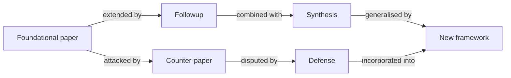
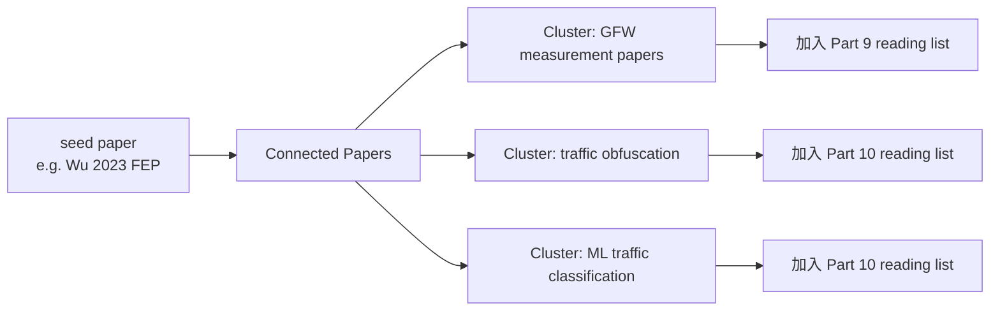
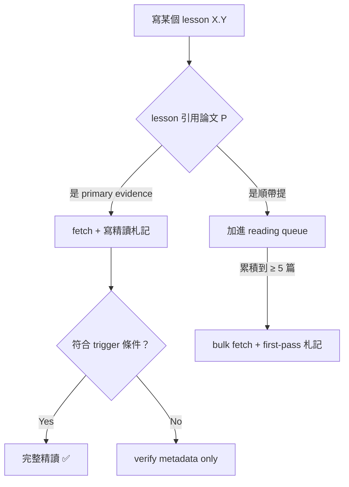

# 課堂 0.4 — 文獻地圖

## 學前知道

- **前置課**：[0.3 研究級學習方法論](./0.3-research-methodology.md)
- **預計閱讀時間**：60~90 分鐘（本堂是清單性 lesson，可分多次讀完）
- **必讀論文**：本堂自身**不引論文當主要證據**——清單裡的論文會在後續對應 lesson 才讀
- **必讀原始碼**：無

---

## 動機

研究員之間有句行話：「**Show me your bibliography and I'll tell you what kind of researcher you are.**」一份完整、有層次、有對話脈絡的參考文獻，是研究品質的最強 indicator。

到 Phase III 寫論文 intro / related work 時，你需要**幾百篇論文**作為背景——不是每篇都精讀，但每篇都該知道「它說什麼、跟誰對話、跟我們什麼關係」。從零建這個清單是 **6 個月起跳**的工作；現在我把骨架先給你。

這堂課給你三件東西：

1. **文獻發現工具**（Connected Papers、Semantic Scholar、DBLP 等）的實際用法
2. **~100 篇核心論文清單**，按 12 卷分組、標 priority tier、標將在哪個 lesson 精讀
3. **Batch fetch 策略**——不是現在抓 100 篇，是隨 lesson 進度同步抓

---

## 核心概念

### 1. 為什麼是「地圖」不是「清單」

清單（list）= 線性、無關聯、無 priority。地圖（map）= 有座標、有 cluster、有 navigation。

研究領域的論文有三種關係，地圖要能呈現：



- **延伸關係**（A → B）：B 在 A 基礎上做更多
- **對立關係**（A → C）：C 反駁 A 的核心 claim
- **整合關係**（B + E → F）：新論文吸收前人的對立成果

光看 abstract 看不出這些關係——必須**自己讀完三篇才能畫出第一段 graph**。本堂只給你 starting nodes，graph 的 edge 要你後續 lesson 自己畫。

### 2. 文獻發現工具

按用途排序：

| 工具 | 何時用 | 強項 |
|---|---|---|
| **Connected Papers** <https://www.connectedpapers.com> | 給一篇論文，看「誰在跟它對話」 | 視覺化整個 sub-field 的論文 cluster ⭐⭐⭐ |
| **Semantic Scholar** <https://www.semanticscholar.org> | 找論文 + 自動 TLDR + influential citations | 「TLDR」按鈕對 first-pass 極省時 ⭐⭐ |
| **DBLP** <https://dblp.org> | 查作者完整書目 | CS 領域 metadata 最準（sponsored by Schloss Dagstuhl） |
| **Google Scholar** <https://scholar.google.com> | 通用搜尋 + 「Cited by N」 | 覆蓋最廣 |
| **arXiv** <https://arxiv.org> | 找 preprint | CS / 數學 / 物理 preprint 倉庫 |
| **IACR ePrint** <https://eprint.iacr.org> | 密碼學 preprint | 密碼學專屬 arXiv，所有當代密碼論文先在這裡 |
| **GFW.report** <https://gfw.report> | 審查研究專屬 | Censorship measurement 領域**唯一**集中入口 ⭐⭐⭐ |
| **Censored Planet** <https://censoredplanet.org> | 全球審查觀測 | Michigan 大學 macro-level data |
| **net4people/bbs** <https://github.com/net4people/bbs/issues> | 翻牆社群 | 協議作者吵架的地方，**讀 issue 比 paper 學更快**現實動態 |

#### Connected Papers 工作流（最值得學會）

給定一篇 seed paper，Connected Papers 用 **co-citation similarity** 算出最相關的 ~40 篇 + 視覺化成 force-directed graph。



**操作步驟**：
1. 找一篇你已知的 seed paper（例如我們已建檔的 Wu 2023 FEP）
2. 貼進 Connected Papers
3. 看 prior works（左邊）+ derivative works（右邊）
4. 點任何節點看摘要 + 直接跳到 PDF
5. 重複——半小時內你能從 1 篇推到 30 篇相關論文

### 3. Alert system：讓新論文自己找上門

研究領域日新——你需要被動接收新論文，不是主動 google：

| Alert | 設定方式 | 頻率 |
|---|---|---|
| **Google Scholar Alerts** | scholar.google.com → 搜任何 keyword → 「Create alert」 | weekly |
| **Semantic Scholar 作者 follow** | 找關鍵作者頁 → 「Follow」 | new paper 通知 |
| **arXiv RSS** | <https://arxiv.org/list/cs.CR/recent> 加 RSS | daily |
| **IACR ePrint RSS** | <https://eprint.iacr.org/rss/news-items.xml> | daily |
| **GFW.report RSS** | 站內有 RSS 連結 | per post |
| **net4people/bbs GitHub watch** | repo → Watch → Custom → Issues | per issue |

**建議的最小 alert set**（給本門課使用者）：
- Google Scholar alert: `"censorship circumvention"` weekly
- Google Scholar alert: `"shadowsocks" OR "VLESS" OR "REALITY" OR "Hysteria"` weekly
- Google Scholar alert: 主要作者：Wustrow、Houmansadr、Paxson、Murdoch、Goldberg、Tschantz、Khattak
- arXiv cs.CR (cryptography & security) RSS
- IACR ePrint RSS
- GFW.report RSS
- GitHub watch: net4people/bbs, XTLS/Xray-core, SagerNet/sing-box, MetaCubeX/mihomo, hysteria, EAimTY/tuic

設定一次，之後論文找上門。

### 4. Priority tier 系統

不是所有論文同等重要。本門課用三層：

| Tier | 含義 | 數量 | 處理方式 |
|---|---|---|---|
| **P0 必讀** | 核心領域 SoK / 我們協議直接借鑒 | ~25 | Keshav 三遍法的**第三遍**，深讀 + 完整札記 |
| **P1 強烈推薦** | 重要 contribution / 對話對象 | ~50 | 三遍法**第二遍**，1 頁札記 |
| **P2 延伸** | 背景知識 / 替代方案 / 歷史脈絡 | ~50 | 三遍法**第一遍** + 一行札記，視需要再深讀 |

100% P0 + 50% P1 + 20% P2 是合理目標——不是要求 100% 全讀完。

### 5. ~100 篇核心論文清單

按 12 卷分組。每篇格式：

```
**ShortID** — *Title* — Author, Venue Year. **Tier**. (Lesson where it's read in depth.)
[brief why]
```

✅ 標記表已建檔在 `notes/papers/`。

---

#### **Part 1 — 網路基礎**

- ✅ **bbr-cacm17** — *BBR: Congestion-Based Congestion Control* — Cardwell et al., **CACM 2017**. **P0**. (Lesson 1.10)
  Google 提出的 model-based 擁塞控制，徹底改變 TCP/QUIC 設計地景；Hysteria 的 Brutal 算法概念來源。
- **click-tocs00** — *The Click Modular Router* — Kohler et al., **TOCS 2000**. P1. (Lesson 1.18)
  把 router 寫成可組合 element 的 paradigm，影響 DPDK / VPP。
- **fast-tcp-ino-rfc5681** — RFC 5681 *TCP Congestion Control*. P1. (Lesson 1.10) Reference baseline。
- **tfo-rfc7413** — RFC 7413 *TCP Fast Open*. P1. (Lesson 1.8) GFW 對 TFO 特別敏感。
- **mptcp-rfc8684** — RFC 8684 *Multipath TCP*. P2. (Lesson 1.11) Apple 在 iOS 用，潛在翻牆應用。
- **bgp-hijack-sigcomm17** — *Profiling BGP Serial Hijackers* — Testart et al., **IMC 2019**. P2. (Lesson 1.15)
- **ipv6-adoption-sigcomm14** — *Measuring IPv6 Adoption* — Czyz et al., **SIGCOMM 2014**. P2. (Lesson 1.13)
- **dnssec-fail-sp16** — *A Longitudinal, End-to-End View of the DNSSEC Ecosystem* — Chung et al., **USENIX Security 2017**. P2. (Lesson 1.14)
- **dns-cache-poisoning-2008** — Kaminsky 2008 DNS attack 原始 disclosure。P1. (Lesson 1.14)
- **ecs-edns-rfc7871** — RFC 7871 *Client Subnet in DNS Queries*. P2. (Lesson 1.14)
- **iptree-trie-fib** — Linux kernel `net/ipv4/fib_trie.c` source + design notes. P1. (Lesson 1.4) 不是論文，但 LC-trie 設計值得讀。
- **carrier-grade-nat** — RFC 6888 *CGN Considerations*. P2. (Lesson 1.7)

#### **Part 2 — 高效能 I/O 與 kernel 網路**

- **iouring-axboe19** — *Efficient IO with io_uring* — Jens Axboe whitepaper, 2019. **P0**. (Lesson 2.2)
  Linux I/O 的 paradigm shift；高效能網路 stack 必懂。
- **xdp-conext18** — *The eXpress Data Path* — Høiland-Jørgensen et al., **CoNEXT 2018**. **P0**. (Lesson 2.7)
  在 NIC driver 層處理封包，DDoS 防禦與高效能 firewall 標配。
- **mtcp-nsdi14** — *mTCP: A Highly Scalable User-level TCP Stack* — Jeong et al., **NSDI 2014**. P1. (Lesson 2.9)
- **ebpf-strawman** — Cilium docs + Brendan Gregg blog. P1. (Lesson 2.5–2.6) 非單一論文，但是入門必讀。
- **dpdk-archive** — DPDK 官方 docs + Intel original whitepapers. P1. (Lesson 2.8)
- **af-xdp-paper** — Karlsson & Töpel 2018 AF_XDP socket. P1. (Lesson 2.7)
- **kktls-paper** — Stewart et al. 2017 *Kernel-TLS*. P1. (Lesson 2.4)
- **netns-design** — Eric Biederman LWN articles on Linux network namespaces. P1. (Lesson 2.12)
- **fq-codel-rfc8290** — RFC 8290 *FlowQueue-Codel*. P2. (Lesson 2.13)

#### **Part 3 — 密碼學：從數論到後量子**

- **curve25519-bernstein06** — *Curve25519: New Diffie-Hellman Speed Records* — Bernstein, **PKC 2006**. **P0**. (Lesson 3.5)
  WireGuard、Noise、TLS 1.3、Signal 全用。
- **ed25519-bernstein11** — *High-Speed High-Security Signatures* — Bernstein et al., **CHES 2011**. P1. (Lesson 3.7)
- **chacha20-poly1305-rfc8439** — RFC 8439 *ChaCha20 and Poly1305 for IETF Protocols*. P1. (Lesson 3.2)
- **aead-relations-bn00** — *Authenticated Encryption: Relations Among Notions* — Bellare & Namprempre, **ASIACRYPT 2000**. **P0**. (Lesson 3.2)
- **noise-perrin18** — *The Noise Protocol Framework* — Perrin spec, 2018. **P0**. (Lesson 3.8)
  WireGuard Noise IK 的源頭；理解 modern lightweight protocol design。
- **optls-krawczyk-wee15** — *The OPTLS Protocol and TLS 1.3* — Krawczyk & Wee, **EuroS&P 2016**. **P0**. (Lesson 3.6) TLS 1.3 設計學理基礎。
- **hkdf-rfc5869** — RFC 5869 *HMAC-based Extract-and-Expand Key Derivation Function*. P1. (Lesson 3.3)
- **argon2-pwhash16** — *Argon2 Password Hashing* — Biryukov et al., 2016. P2. (Lesson 3.3)
- **rsa-attacks-boneh99** — *Twenty Years of Attacks on the RSA Cryptosystem* — Boneh, **Notices of AMS 1999**. P1. (Lesson 3.4)
- **lucky-thirteen-sp13** — *Lucky Thirteen: Breaking the TLS and DTLS Record Protocols* — AlFardan & Paterson, **IEEE S&P 2013**. P1. (Lesson 3.13)
- **sphincs-plus-pqc** — Bernstein et al. SLH-DSA / SPHINCS+ NIST submission. P1. (Lesson 3.11)
- **kyber-pqc** — ML-KEM / Kyber NIST submission docs. P1. (Lesson 3.11)
- **dilithium-pqc** — ML-DSA / Dilithium NIST submission docs. P1. (Lesson 3.11)
- **dolev-yao-83** — *On the Security of Public Key Protocols* — Dolev & Yao, **IEEE TIT 1983**. P1. (Lesson 3.15) 形式化驗證的對手模型源頭。
- **ind-cca-cs98** — Cramer-Shoup IND-CCA encryption. P2. (Lesson 3.4)
- **timing-attacks-kocher96** — Kocher 1996 timing attacks on RSA/DH. P1. (Lesson 3.13)

#### **Part 4 — TLS / QUIC**

- **tls-13-rfc8446** — RFC 8446 *The Transport Layer Security (TLS) Protocol Version 1.3*. **P0**. (Lessons 4.3–4.5)
- **quic-rfc9000** — RFC 9000 *QUIC: A UDP-Based Multiplexed and Secure Transport*. **P0**. (Lessons 4.7–4.9)
- **quic-tls-rfc9001** — RFC 9001 *Using TLS to Secure QUIC*. **P0**. (Lesson 4.8)
- **quic-recovery-rfc9002** — RFC 9002 *QUIC Loss Detection and Congestion Control*. P1. (Lesson 4.7)
- **http3-rfc9114** — RFC 9114 *HTTP/3*. P1. (Lesson 4.10)
- **quic-datagram-rfc9221** — RFC 9221 *Unreliable Datagram Extension*. P1. (Lesson 4.9)
- **quic-sigcomm17** — *The QUIC Transport Protocol: Design and Internet-Scale Deployment* — Langley et al., **SIGCOMM 2017**. **P0**. (Lesson 4.7)
- **ech-draft** — IETF draft `draft-ietf-tls-esni`. **P0**. (Lesson 4.6) 看最新 draft 版本號。
- **hpke-rfc9180** — RFC 9180 *Hybrid Public Key Encryption*. P1. (Lesson 4.6) ECH 的密碼學基礎。
- **alps-draft** — IETF draft *Application-Layer Protocol Settings*. P2. (Lesson 4.4)
- **tls13-tamarin-cremers16** — Cremers et al. *Automated Analysis of the TLS 1.3 Handshake* — **IEEE S&P 2017**. P1. (Lesson 4.3 + 5.6)
- **0rtt-replay-fischlin17** — Fischlin & Günther 0-RTT replay analysis. P1. (Lesson 4.5)
- **masque-draft** — IETF draft *MASQUE*. P1. (Lesson 4.10) 翻牆 next-gen 候選。

#### **Part 5 — 形式化方法**

- **proverif-blanchet** — Blanchet *ProVerif: Cryptographic Protocol Verifier in the Formal Model*. **P0**. (Lessons 5.4–5.5)
- **tamarin-meier13** — Meier et al. *The TAMARIN Prover for the Symbolic Analysis of Security Protocols* — **CAV 2013**. **P0**. (Lesson 5.6)
- **cryptoverif-blanchet** — Blanchet *A Computationally Sound Mechanized Prover for Security Protocols* — **IEEE S&P 2006**. P1. (Lesson 5.7)
- **tla-plus-lamport** — Lamport *Specifying Systems* book + TLA+ tutorial. **P0**. (Lessons 5.2–5.3) 不是論文，是書 + 線上資源。
- **applied-pi-calc-aif01** — Abadi & Fournet *Mobile Values, New Names, and Secure Communication* — **POPL 2001**. P1. (Lesson 5.4)
- **needham-schroeder-flaw-1995** — Lowe 1995 *An Attack on the Needham-Schroeder Public-Key Authentication Protocol*. P1. (Lesson 5.1)
  經典 case：17 年才被發現的協議缺陷。
- **noise-proverif** — Kobeissi et al. Noise framework formal verification. P1. (Lesson 5.5)
- **wireguard-proverif** — Donenfeld + Kobeissi WireGuard formal proof. P1. (Lesson 5.5)

#### **Part 6 — 真 VPN 協議**

- **wireguard-whitepaper-17** — Donenfeld *WireGuard: Next Generation Kernel Network Tunnel* — **NDSS 2017**. **P0**. (Lessons 6.3–6.6)
  12 頁 whitepaper，現代 VPN 設計典範。
- **openvpn-rfc** — OpenVPN protocol docs (no formal RFC). P1. (Lesson 6.2)
- **ipsec-arch-rfc4301** — RFC 4301 *Security Architecture for the IP*. P1. (Lesson 6.1)
- **ikev2-rfc7296** — RFC 7296 *IKEv2*. P1. (Lesson 6.1)
- **amneziawg-blog** — AmneziaWG fork blog posts. P2. (Lesson 6.7) WireGuard 抗 GFW fork。
- **boringtun-cloudflare** — Cloudflare BoringTun design notes. P2. (Lesson 6.8)

#### **Part 7 — 翻牆協議完整演化史**

- **socks5-rfc1928** — RFC 1928 *SOCKS Protocol Version 5*. P1. (Lesson 7.1)
- ✅ **gfw-ss-imc20** — *How China Detects and Blocks Shadowsocks* — Alice, Bob, Carol, Jan Beznazwy, Amir Houmansadr, **IMC 2020**. **P0**. (Lesson 7.2 + 9.2)
  GFW 對 SS 的 IP-entropy heuristic 揭密——SS 走向 SS-AEAD 的學理推手。
- **ss-2022-spec** — Shadowsocks SIP022 spec. P1. (Lesson 7.4)
- **vmess-spec** — V2Ray VMess specification. P1. (Lesson 7.5)
- **trojan-spec** — Trojan-GFW protocol spec. P1. (Lesson 7.7)
- **vless-spec** — XTLS VLESS specification. P1. (Lesson 7.8)
- **xtls-vision-spec** — XTLS-Vision specification. **P0**. (Lesson 7.9)
- **reality-spec** — REALITY protocol announcement + spec. **P0**. (Lessons 7.10–7.12)
- ✅ **parrot-dead-sp13** — *The Parrot is Dead: Observing Unobservable Network Communications* — Houmansadr, Brubaker, Shmatikov, **IEEE S&P 2013**. **P0**. (Lesson 7.7)
  證明 mimicry 翻牆的根本缺陷；是 Trojan/VLESS 哲學轉向「真 TLS」的學理基礎。**該抓**——加入 backfill 清單。
- **frolov-tls-circumvention-ndss19** — *The Use of TLS in Censorship Circumvention* — Frolov, Wustrow, **NDSS 2019**. **P0**. (Lessons 7.7 + 9.9)
- **utls-paper** — Frolov & Wustrow uTLS Go library design. P1. (Lesson 9.9)
- **conjure-ccs19** — *Conjure: Summoning Proxies from Unused Address Space* — Frolov et al., **CCS 2019**. P1. (Lesson 7.13 + 10.6)

#### **Part 8 — QUIC 系協議**

- **hysteria2-spec** — Hysteria2 protocol spec (HyNetwork docs). **P0**. (Lessons 8.2–8.3)
- **tuic-v5-spec** — TUIC v5 protocol spec (EAimTY docs). **P0**. (Lesson 8.4)
- **naiveproxy-design** — NaiveProxy design notes. P1. (Lesson 8.5)
- **brutal-cc-paper** — Hysteria Brutal congestion control writeup. P1. (Lesson 8.2)
- ✅（implied）**masque-draft** — 跨指 Part 4.10。

#### **Part 9 — GFW 研究 + 自建測試平台**

- ✅ **tschantz-sok-sp16** — *SoK: Towards Grounding Censorship Circumvention in Empiricism* — Tschantz, Afroz, Anonymous, Paxson, **IEEE S&P 2016**. **P0**. (Lesson 9.1)
- ✅ **khattak-sok-popets16** — *SoK: Making Sense of Censorship Resistance Systems* — Khattak et al., **PoPETs 2016**. **P0**. (Lesson 10.10)
- ✅ **wu-fep-usenix23** — *How the Great Firewall of China Detects and Blocks Fully Encrypted Traffic* — Wu et al., **USENIX Security 2023**. **P0**. (Lesson 9.7)
- **ensafi-active-probing-imc15** — *Examining How the Great Firewall Discovers Hidden Circumvention Servers* — Ensafi et al., **IMC 2015**. **P0**. (Lesson 9.6)
- **alice-low-entropy-usenix20** — Alice et al. *Triplet Censors: Demystifying Great Firewall's DNS Censorship Behavior* — **USENIX FOCI 2020**. **P0**. (Lesson 9.2)
- **iclab-ndss20** — *ICLab: A Global, Longitudinal Internet Censorship Measurement Platform* — Niaki et al., **IEEE S&P 2020**. P1. (Lesson 9.1)
- **censored-planet-ccs20** — *Censored Planet: An Internet-wide, Longitudinal Censorship Observatory* — Sundara Raman et al., **CCS 2020**. P1. (Lesson 9.1)
- **gfw-arch-anonymous** — Various GFW.report blog posts. **P0**（集合）. (Lesson 9.1)
- **geddes-cover-acks-ccs13** — *Cover Your ACKs: Pitfalls of Covert Channel Censorship Circumvention* — Geddes et al., **CCS 2013**. P1. (Lesson 9.6)
- **decoy-routing-foci11** — *Decoy Routing: Toward Unblockable Internet Communication* — Karlin et al., **FOCI 2011**. P1. (Lesson 10.6)
- **telex-usenix11** — *Telex: Anticensorship in the Network Infrastructure* — Wustrow et al., **USENIX Security 2011**. P1. (Lesson 10.6)
- **bock-geneve-ccs19** — *Geneva: Evolving Censorship Evasion Strategies* — Bock et al., **CCS 2019**. **P0**. (Lesson 9.13)
  GA-based censorship evasion；自動化 evasion 策略生成。
- **zmap-usenix13** — *ZMap: Fast Internet-Wide Scanning* — Durumeric et al., **USENIX Security 2013**. P1. (Lesson 9.10) 自建測試平台 scan 工具。

#### **Part 10 — 對抗式流量分析與反制**

- **flowprint-ndss20** — *FlowPrint: Semi-Supervised Mobile-App Fingerprinting on Encrypted Network Traffic* — Van Ede et al., **NDSS 2020**. **P0**. (Lesson 10.3)
- **deep-fp-ccs18** — *Deep Fingerprinting: Undermining Website Fingerprinting Defenses with Deep Learning* — Sirinam et al., **CCS 2018**. **P0**. (Lesson 10.3)
- **walkie-talkie-usenix17** — *Walkie-Talkie: An Efficient Defense Against Passive Website Fingerprinting Attacks* — Wang & Goldberg, **USENIX Security 2017**. P1. (Lesson 10.2)
- **ja3-jr-paper** — Althouse JA3 / JA4 specification. P1. (Lesson 10.2)
- **ja4-2023** — JA4+ improved fingerprint specification (FoxIO). P1. (Lesson 10.2)
- **adv-traffic-classification** — *Adversarial Examples for Network Traffic Classification* — various 2020+. P1. (Lesson 10.4)
- **obfs4-design** — Yawning Angel obfs4 design notes. P1. (Lesson 10.6)
- **meek-popets15** — *Examining HTTPS-only Domain Fronting* — Fifield et al., 2015. P1. (Lesson 10.6 + 9.4)
- **snowflake-design** — Snowflake pluggable transport design. P1. (Lesson 10.6)
- **scramblesuit-13** — Winter, Pulls, Fuss *ScrambleSuit: A Polymorphic Network Protocol* — **WPES 2013**. P1. (Lesson 10.6)
- **silentknock** — Vasserman, Hopper, Tyra *SilentKnock: Practical, Provably Undetectable Authentication*. P2. (Lesson 10.6)
- **regulator-ml-2023** — recent ML-based censorship detection — varies. P2. (Lesson 10.3)

#### **Part 11/12 — 設計與評測 related work**

- **websurvey-tor-pluggable** — Tor pluggable transport ecosystem overview. P1. (Lesson 11.3)
- **xray-source-code** — Xray-core GitHub repo. **P0**（source）. (Lesson 7.14)
- **singbox-source-code** — sing-box GitHub repo. **P0**（source）. (Lesson 7.15)
- **mihomo-source-code** — Clash.Meta / mihomo GitHub repo. **P0**（source）. (Lesson 7.16)
- **wireguard-go-source-code** — wireguard-go GitHub repo. **P0**（source）. (Lessons 6.4–6.6)
- **quic-go-source-code** — quic-go GitHub repo. **P0**（source）. (Lesson 4.11)
- **net4people-bbs-issues** — net4people/bbs issue tracker. P1（ongoing）. (cross-referenced 多個 lessons)

#### **Meta — research methodology**

- ✅ **keshav-howtoread-ccr07** — Keshav *How to Read a Paper* — **SIGCOMM CCR 2007**. **P0**. (Lesson 0.3)
- ✅ **hamming-research-86** — Hamming *You and Your Research* (Bell Labs talk). **P0**. (Lesson 0.3)
- ✅ **schwartz-stupidity-jcs08** — Schwartz *The Importance of Stupidity in Scientific Research* — **J Cell Sci 2008**. **P0**. (Lesson 0.2)
- ✅ **rohrer-taylor-shuffling-is07** — Rohrer & Taylor *The Shuffling of Mathematics Problems Improves Learning* — **Instructional Science 2007**. **P0**. (Lesson 0.2)
- ✅ **cepeda-distributed-pb06** — Cepeda et al. *Distributed Practice in Verbal Recall Tasks* — **Psych Bull 2006**. **P0**. (Lesson 0.2)
- ✅ **sweller-cognitive-cs88** — Sweller *Cognitive Load During Problem Solving* — **Cognitive Science 1988**. **P0**. (Lesson 0.2)
- ✅ **ericsson-deliberate-pr93** — Ericsson, Krampe, Tesch-Romer *The Role of Deliberate Practice* — **Psych Rev 1993**. **P0**. (Lesson 0.2)

---

### 6. Batch fetch 策略

按 CLAUDE.md「>20 篇 batching schedule」原則，**不一次抓 100 篇**——隨 lesson 進度 just-in-time fetch：



**具體 priority 順序**（如使用者想 ahead-of-schedule 抓某幾批）：

1. **批次 0**（已完成）：meta + Part 9 SoK 共 10 篇
2. **批次 1**（Part 7 啟動時）：parrot-dead-sp13, frolov-tls-ndss19, gfw-ss-imc20——翻牆協議三大背景
3. **批次 2**（Part 9 啟動時）：ensafi-imc15, alice-foci20, bock-geneve-ccs19, censored-planet-ccs20, iclab-ndss20——GFW 完整研究
4. **批次 3**（Part 10 啟動時）：flowprint, deep-fingerprinting, walkie-talkie, ja3/ja4 papers——流量分析
5. **批次 4**（Part 11/12 啟動時）：obfs4, meek, snowflake, scramblesuit, conjure, telex, decoy-routing——related work corpus

預估總精讀札記數：Phase III 結束時 **40~60 篇**完整札記 + **20+ 篇** first-pass 札記。

### 7. 「不在清單上但你會遇到的」處理

清單必然 incomplete。你之後會遇到：

- **Citation 鏈追下去新發現的 paper** → 按「primary source 追溯」原則加入個人 reading queue
- **Alert system 推送的新論文** → first-pass 後決定是否加 queue
- **net4people/bbs 討論引用的非學術文** → 加進 `notes/` 但不算 paper precis（非 peer-reviewed）
- **使用者你個人感興趣的 tangent** → 自由探索；產生的札記放 `notes/papers/` 但標 tier P3「個人興趣」

**規則**：所有讀過的論文都該寫札記。沒札記 = 沒讀。

---

## 與我們協議設計的關聯

這份地圖在 Phase III 三個關鍵時刻會直接派上用場：

1. **Part 11.1 威脅模型**：直接從 Part 9 cluster（GFW 研究 ~10 篇）+ Part 10 cluster（traffic analysis ~10 篇）建模對手能力。
2. **Part 11.3 設計空間探索**：從 Part 6/7/8 三個協議家族 cluster 抽出設計取捨選項。
3. **Part 12.22 論文 Related Work section**：直接從**所有 P0 + P1** 札記 grep 出對話對象——預估能寫 ~40 篇 reference 的高質量 related work。

**關鍵觀察**：好的 related work 不是論文清單，是**對話地圖**——告訴 reviewer「我們的工作如何 fit into existing literature 的具體 gap」。本門課完成時你應該能畫出這張對話地圖。

---

## 動手（30 分鐘）

完成兩個步驟：

### 1. 設好 alert 系統（15 分鐘）

至少設定：
- Google Scholar Alert: `"censorship circumvention"`
- arXiv RSS: cs.CR (放進你的 RSS reader)
- GitHub Watch: net4people/bbs

### 2. 玩一次 Connected Papers（15 分鐘）

- 開 <https://www.connectedpapers.com>
- seed paper: `Wu et al., How the Great Firewall of China Detects and Blocks Fully Encrypted Traffic, USENIX Security 2023`
- 等它跑出 graph
- 點 graph 中**還沒在我們清單上**的任何 3 篇，記下 title + 一行原因「為什麼這篇有意思」
- 把這 3 篇加進你個人 reading queue

這個練習目的是讓你**親自體驗**用視覺化工具發現論文，比給你「100 篇必讀」高效十倍。

---

## 自我檢查

1. Connected Papers / Semantic Scholar / DBLP / Google Scholar 各擅長什麼？什麼時候用哪個？
2. P0 / P1 / P2 三 tier 的處理方式分別是什麼？為什麼不全部 deep-read？
3. 為什麼用 batch fetch 而不是現在抓 100 篇？這跟 CLAUDE.md 哪條規則對齊？
4. 你能舉出我們協議設計的「直接借鑒對象」（P0 必讀）至少 5 篇嗎？
5. 「沒札記 = 沒讀」的規則對你個人學習意味著什麼具體行動？

---

## 延伸閱讀

- **Webster & Watson 2002** *Analyzing the Past to Prepare for the Future: Writing a Literature Review* — MIS Quarterly. 寫 literature review 的方法論金本位。
- **Petticrew & Roberts 2006** *Systematic Reviews in the Social Sciences* — 系統性 review 的書本級指南。
- **Gusenbauer & Haddaway 2020** *Which Academic Search Systems Are Suitable for Systematic Reviews* — Research Synthesis Methods. 對比 26 個搜尋系統的 coverage 與 reproducibility。
- **Andy Matuschak — Working with the garage door up** — <https://notes.andymatuschak.org/Work_with_the_garage_door_up>。為什麼研究筆記公開有用。

---

## 研究級補遺

> 本堂主體已是 meta-level（關於 literature 本身）。這節再上一階——meta-meta，講「文獻地圖」這件事本身的學界 best practice 與我們的座標。

### 1. 學界詞彙

- **Systematic review** vs **scoping review** vs **narrative review** vs **SoK** (Systematization of Knowledge)：
  - **Systematic review** 有嚴格 protocol（PRISMA），要 reproducible
  - **Scoping review** 比 systematic 寬鬆，重在 mapping that landscape
  - **SoK** 是 IEEE S&P / USENIX Security / NDSS / CCS 特定 track，要求高深度的 synthesis
  - **Narrative review** = 我們在做的，按主題敘述
- **Bibliometric analysis**：用引用數據定量分析領域結構（Lotka's law, Bradford's law, Garfield h-index）
- **Co-citation analysis** vs **bibliographic coupling**：兩種「論文相似度」算法。Connected Papers 用前者
- **Snowballing** (forward / backward)：從 seed paper 追 references（backward）或追被誰引（forward），系統性擴展 reading list
- **Saturation**：當你新加的 paper 都不再帶來新觀點時，達到該 sub-topic 的 reading saturation——可以停了

### 2. 我們協議的座標

本堂清單反映 G6 設計目標的**直接 evidence base**：

| Cluster | 數量 | 對 G6 的角色 |
|---|---|---|
| GFW 研究（Part 9） | ~12 | 對手能力來源 |
| Traffic analysis（Part 10） | ~10 | 反制設計 evidence |
| TLS / QUIC（Part 4） | ~13 | 偽裝 substrate |
| 翻牆協議（Part 7） | ~13 | 設計取捨先例 |
| QUIC 系協議（Part 8） | ~5 | 速度路線 evidence |
| Cryptography（Part 3） | ~16 | 工具箱 |
| Formal methods（Part 5） | ~8 | 驗證方法 |
| Network basics（Part 1） | ~12 | 底層假設 |
| High-perf I/O（Part 2） | ~9 | 實作能力 |
| Real VPN（Part 6） | ~6 | 設計哲學對照 |
| Meta-research（Part 0） | ~7 | 學習方法論 |

**~110 篇是「個人能掌握」的上限**——超過這個量後 retention 會下降（Cepeda meta-analysis 給的證據）。這份清單是有意識地 capped 在 ~100 篇。

### 3. 形式化定義

文獻網的形式化（圖論視角）：

- **Citation graph** = directed graph G(V, E)，V = papers, E = (A, B) iff A cites B
- **Co-citation similarity**: sim(A, B) = |{P: P cites both A and B}| / normalisation
- **PageRank-like influence**: 一篇論文的「重要性」可以用其在 citation graph 中的 PageRank 評估
- **Reading completeness metric**: 你的個人 reading set R 對某 sub-field S 的覆蓋 = |R ∩ relevant(S)| / |relevant(S)|，目標通常 > 0.8 表示「sub-field 熟悉」

### 4. 領域的關鍵會議與期刊

按重要性排序（censorship + security + networking）：

| 場次 | 主題 | 接受率 | 備註 |
|---|---|---|---|
| **USENIX Security** | Security broadly | ~17% | 翻牆研究主場之一 |
| **IEEE S&P (Oakland)** | Security broadly | ~15% | 最 prestigious 之一 |
| **NDSS** | Network & system security | ~17% | 同上 |
| **CCS** | Computer & Communications Security | ~18% | 同上 |
| **PoPETs / PETS** | Privacy enhancing technologies | ~25% | Khattak 2016 SoK 在這 |
| **SIGCOMM** | Networking | ~15% | QUIC 1st paper 在這 |
| **NSDI** | Networked Systems Design | ~18% | mTCP 在這 |
| **IMC** | Internet Measurement | ~20% | GFW measurement 主場 |
| **FOCI** (workshop) | Free & Open Communications | ~40% | 較 lightweight，arxiv-like discussion |
| **CoNEXT** | Networking | ~20% | XDP 在這 |
| **CACM** | Communications of ACM | invited | BBR 在這（轉載） |
| **CRYPTO / EUROCRYPT / ASIACRYPT** | Cryptography | ~22% | IACR 三大旗艦 |
| **TCC** | Theory of cryptography | — | Theoretical |

**我們論文目標**：USENIX Security / NDSS / CCS。寫作風格要對齊。

### 5. 必追資源（meta）

literature methodology meta-resources：

- **PRISMA Statement** <http://www.prisma-statement.org/> — systematic review reporting standard
- **Cochrane Handbook** — medical 領域 systematic review 黃金標準（concept transferable）
- **Open Syllabus Project** <https://www.opensyllabus.org/> — millions of course syllabuses，用來看「某主題在學界怎麼教」
- **Papers with Code** <https://paperswithcode.com/> — ML 領域 paper-code 連結，雖然非我們主領域但 traffic ML 部分有用
- **Awesome lists**: GitHub 上 awesome-censorship、awesome-anonymity、awesome-cryptography 等 community-curated 清單

### 6. 開放問題

- **AI-assisted literature mapping**：Claude / GPT 可以一次讀 10 篇 paper 寫 cluster summary——這會改變 literature review 的 economics 嗎？目前無系統研究
- **Reproducibility crisis** in security research：你 implement 一篇 paper 結果發現對不上原文 results，**怎麼辦**？學界 norm 是 silently 不發；這對我們做 evaluation 影響大
- **Publication bias in censorship research**：失敗的 circumvention 嘗試很少發表（negative result + operational risk）。**真實的 design space 比文獻表面更大**——但無從系統性挖掘
- **GFW.report 是公開研究，但仍有 information asymmetry**：許多 China-based 研究員/工具開發者不能 publicly publish。我們的文獻清單**結構性 missing** 一部分知識
- **本門課 100-篇清單的 PageRank 覆蓋率**：未量化。理論上可以 implement——把所有 cited paper 抓出來算 PageRank，看我們 list 的 top-K coverage

### 7. 對你的建議

「**清單是 starting point，不是終點**。」三個月內你應該有：

- 讀完 ≥ 5 篇 P0 論文（含完整札記）
- 設定 ≥ 3 個 alert，每週至少看一次
- 用 Connected Papers 探索過 ≥ 2 個 sub-cluster
- 在個人 reading queue 加進 ≥ 10 篇「不在清單但你想讀」的 paper

到那時候，這份清單會變得**過時**——你會自己發現新 cluster、新作者、新 venue。**那是好事**。地圖是給你 navigate 的，不是給你膜拜的。

---

下一堂：[**0.5 工具鏈與環境準備**](./0.5-tooling.md)（macOS 開發機 + 兩台 Linux VPS 配置；Wireshark / tcpdump / tshark / nDPI / Zeek / ProVerif / TLA+ / bpftrace 安裝；實驗筆記格式）。
