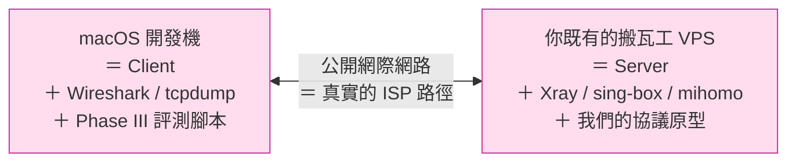
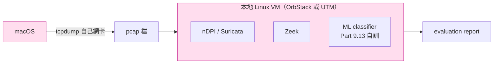
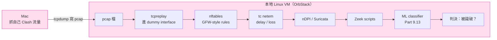

# 課堂 0.5 — 工具鏈與環境準備

## 學前知道

- **前置課**：[0.4 文獻地圖](./0.4-literature-map.md)
- **預計閱讀時間**：50~70 分鐘（含設定時間 1~3 小時，可分次完成）
- **必讀論文**：本堂無——是動手 lesson
- **必讀原始碼**：無
- **預先準備**：
  - macOS 開發機（已有）
  - **你既有的那台搬瓦工 VPS 完全足夠**——本堂不要求你新開 VPS

---

## 動機

研究員與業餘玩家最大的差別，常常**不在知識量**，而在**環境的可重現性與工具的熟練度**。

舉例：兩個人都要驗證「我新設計的協議能不能被 GFW 識別」——
- **業餘玩家**：在自己 VPS 上跑、自己連、看「能上 Google 嗎」
- **研究員**：在受控網路上 replay 已知 GFW detection rules、用 Zeek 跑 nDPI、跑 ML classifier、把結果跟 baseline 對比、產出可重現的 evaluation report

兩者的差別不是聰明程度，是**工具鏈**。本堂把 Phase I 到 Phase III 會用到的全部工具一次裝齊，並建立**可重現的實驗紀錄系統**。

> **注意**：這堂裝的工具總共 ~30 個，不是要你**現在**都精通——是要先**有**。Phase II/III 真正用到時你會回來查。

---

## 核心概念

### 1. 實驗拓撲：個人版的最小可行配置

學界 testbed paper（Wu 2023、Ensafi 2015 等測量論文）常配置兩台 VPS + GFW sim 中間節點——那是因為研究員人在美國，需要實際租中國境內 VPS 才能複製 GFW 行為。

**個人學習者不需要那種配置**。你本來就是個人翻牆使用者，你的 Mac 就是真實 client，搬瓦工就是真實 server——這就是最忠實的 GFW 對抗縮影：



**這就夠了**——Phase I/II/III 全部 baseline 工作都能在這個 setup 完成。

#### 那「GFW 模擬節點」呢？

放本地 Mac 上跑就好。**OrbStack**（macOS 上目前最快的 Linux VM 工具）能秒開 Linux container/VM，跑 nDPI/Zeek/Suricata 分析你 Mac 抓下來的 pcap——做的是分析工作，不是 in-path 攔截：



關鍵觀察：**Phase III 評測的核心是「分析 pcap」**——nDPI/Zeek/ML classifier 都是被動分析既有 pcap，不需要 in-path live deployment。pcap 你自己 Mac 上 `tcpdump` 自己網卡就有了。

#### 真的「需要 in-path 中間節點」嗎？

只有一種情境：**Phase III 12.18「真實對抗測試」**——想看你的協議在「中國境內客戶 → GFW → 境外服器」的真實路徑上會不會被封。即使這種情境，**也不需要你自己建中間節點**——直接租一台中國境內 VPS（百度雲/騰訊雲/阿里雲，按小時計費）當客戶端，連你的搬瓦工 server，做完銷毀。一週成本 ~$2~5。

#### Phase 對應實際需求

| Phase | 真實所需 | 額外成本 |
|---|---|---|
| **Part 1~5** 網路基礎 / 密碼 / TLS / 形式化 | Mac + 你既有搬瓦工 | $0 |
| **Part 6~8** VPN / 翻牆協議精讀 | 同上（讀原始碼 + 抓自己 Clash 流量） | $0 |
| **Part 9** GFW 研究 | 同上（外加 Mac 上開 Linux VM 跑 nDPI / Zeek） | $0 |
| **Part 10** 流量分析與反制 | 同上（Mac 上跑 ML classifier） | $0 |
| **Part 11~12** 協議設計與實作 | 同上（Mac 寫程式，VPS 跑 server，netem 在 VPS 上模擬高丟包鏈路） | $0 |
| **Part 12.18** 真實對抗測試（**可選**） | 短期租中國境內 VPS | $2~5 一週 |

**Phase I/II 結束時你不該有任何額外硬體支出**。Phase III 結束時最多累計 $10~30（多次短期測試）。

### 2. macOS 開發機完整工具清單

按用途分類。每節給出 `brew install` 指令 + 一句話用途。

#### 2.1 基礎開發

```bash
# 已假設你有 Homebrew、git、現代 shell（zsh）
brew install --cask iterm2          # 比內建 Terminal 強
brew install jq                     # JSON 處理
brew install yq                     # YAML 處理（mihomo / clash 配置必備）
brew install fzf rg fd bat eza      # 現代 CLI 黃金組合
brew install zoxide                 # cd 升級
brew install lazygit tig            # git TUI（0.3 提過）
brew install gh                     # GitHub CLI
brew install tmux                   # 多 session 持久化
brew install --cask visual-studio-code
```

#### 2.2 程式語言

```bash
# Go (Phase III 主語言)
brew install go
go version                          # 應 ≥ 1.22

# Rust (Phase III 候選 + 部分 lib)
curl --proto '=https' --tlsv1.2 -sSf https://sh.rustup.rs | sh
cargo install cargo-nextest         # 並行測試
cargo install bacon                 # 背景檢查
brew install rustup-init            # 替代上面 curl 也可

# Python (uv 工作流)
brew install uv
uv python install 3.13              # 最新穩定 3.x

# Node (Phase III TS 客戶端可能用)
brew install bun
```

#### 2.3 抓包與流量觀察 ⭐ 核心

```bash
brew install wireshark              # GUI + tshark + dumpcap
brew install --cask wireshark       # 同上 cask 版有 chmodbpf permission helper
brew install nmap                   # 掃 port 與服務指紋
brew install mtr                    # 比 traceroute 強
brew install dnsutils               # dig
brew install drill                  # dig 的更乾淨替代
brew install masscan                # 大規模 IP scan（之後要復現 Wu 2023）
```

#### 2.4 網路除錯

```bash
brew install lsof                   # 看哪個 process 開哪個 port
brew install iperf3 qperf           # 頻寬測試
brew install httpie                 # 比 curl 漂亮的 HTTP client
brew install hey wrk2               # HTTP load test
brew install hping3                 # 自訂封包送出（active probing 模擬）
```

#### 2.5 形式化方法

```bash
# ProVerif (Lesson 5.4–5.5)
brew install proverif

# Tamarin (Lesson 5.6) — 較大，需 ghc
brew install tamarin-prover

# TLA+ — 安裝 Toolbox（Lesson 5.2–5.3）
brew install --cask tla-plus-toolbox
# 或用 VS Code extension：
code --install-extension alygin.vscode-tlaplus
```

#### 2.6 密碼學工具

```bash
brew install openssl@3              # 命令列工具 + libcrypto
brew install gnupg                  # 簽章驗證
brew install age                    # 現代 file encryption（Filippo Valsorda 設計）
brew install --cask cryptography-fernet
```

#### 2.7 文件與筆記

```bash
brew install pandoc                 # markdown → 任何格式
brew install --cask zotero          # 論文管理（0.3 推薦）
brew install --cask obsidian        # 個人 Zettelkasten（可選）
brew install --cask mactex-no-gui   # LaTeX（Phase III 寫論文時需要）
brew install texlab                 # LaTeX LSP
```

#### 2.8 VPN / 代理 client

```bash
# WireGuard (Lesson 6.x)
brew install wireguard-tools wireguard-go

# Xray / sing-box / mihomo（Phase II 通讀原始碼用）
go install github.com/xtls/xray-core/main@latest
brew install sing-box
# mihomo: 從 GitHub release 抓 binary，或自己 build
```

#### 2.9 VS Code Extensions（建議）

```bash
code --install-extension golang.Go
code --install-extension rust-lang.rust-analyzer
code --install-extension ms-python.python
code --install-extension ms-vscode.cpptools
code --install-extension bierner.markdown-mermaid    # 我們已經裝
code --install-extension yzhang.markdown-all-in-one
code --install-extension davidanson.vscode-markdownlint
code --install-extension alygin.vscode-tlaplus
code --install-extension tamasfe.even-better-toml
```

### 3. Linux VPS 工具清單（你既有搬瓦工 + 本地 Linux VM）

下面的指令在**兩個地方**都會用到：
- 你既有的搬瓦工 VPS（當 server）
- Mac 上的 OrbStack/UTM Linux VM（當分析環境 + Part 9 起的 nDPI/Zeek 主場）

VPS OS 建議 **Debian 12 或 Ubuntu 24.04 LTS**——搬瓦工面板裡能切換重灌。理由：
- kernel 新（≥ 6.x，io_uring / eBPF 完整支援）
- apt 套件多
- 文件最齊
- WireGuard / Xray / sing-box 都優先支援

如果你搬瓦工現在跑的是 CentOS 7 之類舊系統，**第一週的功課就是趁 Part 1 還在熱身時重灌一次**（你機場備份好、別人租用要先打招呼）。CentOS 7 已 EOL，後續工具裝不上。

#### 3.1 基本系統工具

```bash
sudo apt update && sudo apt upgrade -y
sudo apt install -y \
  build-essential pkg-config libssl-dev \
  curl wget git vim tmux htop iotop \
  jq yq fzf ripgrep fd-find bat \
  net-tools iproute2 ethtool \
  dnsutils whois \
  ca-certificates gnupg
```

#### 3.2 網路與流量分析 ⭐

```bash
# 抓包與基本工具
sudo apt install -y \
  tcpdump tshark \
  nmap masscan \
  mtr-tiny iperf3 qperf \
  netcat-openbsd \
  hping3

# tc + netem 隨核心內建（iproute2）；nftables 也有
sudo apt install -y nftables

# DPI
sudo apt install -y ndpi-utils suricata

# Zeek（要從官方 repo 裝，apt 版過舊）
echo 'deb http://download.opensuse.org/repositories/security:/zeek/Debian_12/ /' \
  | sudo tee /etc/apt/sources.list.d/security:zeek.list
curl -fsSL https://download.opensuse.org/repositories/security:zeek/Debian_12/Release.key \
  | gpg --dearmor | sudo tee /etc/apt/trusted.gpg.d/security_zeek.gpg > /dev/null
sudo apt update
sudo apt install -y zeek
```

#### 3.3 eBPF / XDP / kernel 觀察

```bash
sudo apt install -y \
  bpfcc-tools bpftrace libbpf-dev \
  linux-tools-common linux-tools-generic \
  perf-tools-unstable \
  systemtap

# Cilium / XDP 需要更新 LLVM
sudo apt install -y llvm clang
```

#### 3.4 程式語言（在 VPS 上偶爾要編）

```bash
# Go
curl -fsSL https://go.dev/dl/go1.23.linux-amd64.tar.gz | sudo tar -C /usr/local -xzf -
echo 'export PATH=$PATH:/usr/local/go/bin' >> ~/.bashrc

# Rust
curl --proto '=https' --tlsv1.2 -sSf https://sh.rustup.rs | sh

# Python (uv)
curl -LsSf https://astral.sh/uv/install.sh | sh
```

#### 3.5 VPN / 代理 server

```bash
# WireGuard (kernel module + tools)
sudo apt install -y wireguard wireguard-tools

# Xray、sing-box、mihomo——按需抓 release binary
# 為了學習通讀，建議在 VPS 上 git clone 原始碼，但編譯放 dev 機
```

### 4. 本地 Linux VM：分析環境兼 GFW 模擬器

Phase II 起會需要一個能跑 nDPI / Zeek / 自訓 ML classifier 的 Linux 環境——**這應該跑在 Mac 上的 VM**，不要佔用你搬瓦工的（搬瓦工是 server，要保持乾淨）。

#### 為什麼是 VM 不是 Docker？

| | Docker | Linux VM (OrbStack) |
|---|---|---|
| 啟動速度 | 秒級 | OrbStack 也是秒級 |
| Kernel 隔離 | 共用 host kernel | 完整獨立 kernel |
| nftables / eBPF / XDP | macOS host 沒有 → **無法測** | ✅ 真正 Linux kernel |
| WireGuard kernel module | macOS 沒有 → 只能 wireguard-go | ✅ 能跑 kernel 版 |
| netem / tc | macOS 沒有 → **無法測** | ✅ 完整支援 |

研究 Linux kernel 級的網路（Part 2 高效能 I/O / Part 9 GFW sim），**必須真正的 Linux kernel**。

#### OrbStack（首選）

OrbStack 是 macOS 上目前最快的 Linux VM 工具，免費版夠用：

```bash
brew install --cask orbstack
# 開 GUI → Create Linux machine → 選 Debian 12 / Ubuntu 24.04
# 5 秒內就好，自動掛載 Mac home 目錄
orb              # ssh 進 default VM
orb -m debian    # ssh 進指定名字 VM
```

OrbStack 的優勢：
- 比 UTM 快約 3x（用 Apple Virtualization Framework）
- 自動把 Mac 的 `~/code` 掛進 VM（你可以 Mac 上編輯，VM 內直接跑）
- 網路橋接設定極簡

#### UTM（備援，免費開源）

如果你不想付費（OrbStack 進階功能要錢，但基本 Linux VM 永久免費）：

```bash
brew install --cask utm
# 從官方下載 Debian 12 / Ubuntu 24.04 ISO，建 VM 安裝
```

#### Phase III GFW 模擬器架構（你最終要建的）

到 Part 9.10–9.13 才會具體建。架構：



關鍵：**這不是 in-path 攔截真實流量**，是離線分析既有 pcap。你 Mac 不用改 routing，搬瓦工不用變動。**完整實作會在 Part 9.10–9.13 詳講**。本堂只要你裝好 OrbStack。

### 5. 實驗筆記系統 ⭐ 重要

每個實驗一個 markdown 檔，存在 `notes/experiments/`，命名 `YYYY-MM-DD-short-id.md`。模板：

```markdown
# Experiment {id}: {title}

**Date**: YYYY-MM-DD
**Goal**: 一句話說這個實驗要證明 / 證偽什麼
**Lesson reference**: Part X.Y
**Status**: planning / running / done / failed

## Hypothesis
- H1: ...
- H2: ...
- (each one falsifiable)

## Setup
- Hardware: VPS A (region X), VPS B (region Y), GFW sim VM (region Z)
- Software versions: ...
- Configuration files: link to git commit hash

## Protocol（步驟）
1. ...
2. ...

## Raw data
- pcap files (gitignored, summary in this file)
- Zeek logs (path)
- syslog (path)

## Analysis
- 圖、表、結論

## Conclusion
- H1: confirmed / falsified / inconclusive (with evidence)
- H2: ...

## Surprises / lessons learned
（這節最重要——negative results 與 unexpected behavior 都記）

## Next experiments suggested
```

**為什麼要這份模板**：
- 「沒記錄的實驗 = 沒做的實驗」（Hamming 1986 暗示）
- 半年後的你 grep 自己——找得到結論才算真的學到
- Phase III 寫論文時，evaluation section 直接從這些 entry 拼

### 6. 環境設置 checklist

按優先序，完成你目前 Phase 需要的就好：

#### Tier 0（**現在**就要）

- [ ] macOS Homebrew 升級到最新
- [ ] 裝 §2.1 基礎開發工具
- [ ] 裝 §2.3 抓包工具（Wireshark）
- [ ] 設定 git config + GitHub SSH key
- [ ] 完成 Markdown preview 樣式（已做）

#### Tier 1（Phase I 結束前）

- [ ] 裝 §2.2 三大語言（Go / Rust / Python）
- [ ] 裝 §2.5 形式化工具（ProVerif + TLA+）
- [ ] 開一個 VPS（任一家），裝 §3.1, §3.2 工具
- [ ] 在 VPS 上跑通 wireguard-go，自己連自己

#### Tier 2（Phase II 開始時）

- [ ] 第二個 VPS（不同 provider）
- [ ] 在 VPS 上裝 §3.3 eBPF 工具
- [ ] 裝 Xray-core / sing-box / mihomo（從 source 編，學 build system）
- [ ] 在 dev machine 跑 wireshark 抓自己 Clash 流量看 TLS handshake

#### Tier 3（Part 9 開始時）

- [ ] 第三個 VPS 當 GFW 模擬節點
- [ ] 完整 §4 GFW 模擬器配置
- [ ] netem / nftables / Zeek pipeline 跑通
- [ ] 復現 Wu 2023 §4 那 5 條 heuristic（在 sandbox 內）

### 7. 預算與安全

#### 預算

| 階段 | 你需要的硬體 | 額外月費 |
|---|---|---|
| Phase I（網路基礎 / 密碼 / TLS / 形式化） | Mac + 你既有搬瓦工 | **$0** |
| Phase II（VPN / 翻牆協議精讀） | 同上 + OrbStack（免費）VM | **$0** |
| Phase III（協議設計 + 實作 + 評測） | 同上 | **$0** |
| Phase III 12.18 真實對抗測試（可選） | 短期境內 VPS | 一週 $2~5 |

**全程累計額外成本：$0~30**——研究級工作流不必燒錢。

如果未來 Phase II/III 你發現**真的**需要一台額外境外 VPS（例如你想跑 long-running benchmark 不想用搬瓦工會影響翻牆），最便宜選項：
- **Hetzner Cloud** CX22：€3.79/月（歐洲 only，到中國 RTT 較高）
- **Vultr** Tokyo $2.50/月實例（已售完則嘗試 IPv6-only 方案）
- **RackNerd / BandwagonHost / NexusBytes** 等 LET（lowendtalk）廠商，年付有 $10–20/年方案

**但記住：Phase I/II/III baseline 不需要這些。**

#### 搬瓦工 + 機場共存策略

你既有搬瓦工大概率還跑著你的個人機場（Xray / sing-box / mihomo）。Phase II/III 開始要在同一台 VPS 跑研究用協議時：

**做法 A（簡單）**：另開 port，研究用協議跑在不同 port，跟機場並存。例如 ccb 用 443，你研究協議用 8443。

**做法 B（乾淨）**：用 systemd-nspawn 或 lxc container 把研究環境跟機場隔離，避免你寫的 toy code crash 影響機場使用。

我推薦 **A** 先做——簡單，Phase II 結束前不夠用再升級到 B。

#### 安全注意

- **CLAUDE.md 的硬規則**：`~/code/vpn/confidential/` Claude 永不讀（已寫進）
- **搬瓦工憑證**（IP / 域名 / SSH key / Xray UUID 等）寫成 `~/code/vpn/confidential/bwg.env`，**不**進 git
- **SSH 改成 key-only auth**（搬瓦工面板上禁用密碼登入）
- **研究用協議不要綁你的真實域名**——用 `vps.example.com` 之類佔位符放 spec 公開檔案裡
- **公開 repo 的範例**永遠脫敏（CLAUDE.md 已強制）

### 8. 復現性（Reproducibility）紀律

研究員的核心紀律之一。每個實驗應該能讓**別人**（或半年後的你自己）一鍵復現。三個層次：

| 層次 | 機制 | 用在哪 |
|---|---|---|
| **L1** | 文字步驟列表 | 簡單實驗 |
| **L2** | Bash script + `set -euo pipefail` | 中等實驗 |
| **L3** | Docker image / Vagrant box / Nix flake | Phase III 評測 |

**現階段建議**：L1 + L2，Phase III 再升 L3。

---

## 與我們協議設計的關聯

工具鏈直接決定 Phase III 能做多深：

1. **Wireshark / tshark** → Phase III 12.15 抗審查評測 → 看自己協議流量像不像 HTTPS
2. **nDPI / Zeek** → Phase III 12.15 → 跑被動 detection
3. **hping3 / 自寫 Go probe** → Phase III 12.16 主動探測模擬
4. **netem** → Phase III 12.13 高丟包鏈路評測（vs Hysteria2）
5. **eBPF / XDP** → Phase III 12.4 資料路徑零拷貝實作（如果走 Linux 路線）
6. **ProVerif / Tamarin** → Phase III 11.10–11.11 形式化驗證
7. **TLA+** → Phase III 11.9 規格化關鍵不變量
8. **Zeek scripts** → Phase III 12.17 ML classifier 訓練 dataset 來源

**沒裝好工具就直接進 Phase III** = 在 Phase III 邊學邊裝，效率減半。

---

## 動手（90 分鐘可分次完成）

按 Tier 0 + Tier 1 完成基本環境。具體三個任務：

### 任務 1（30 min）：完成 Tier 0 + Wireshark 抓包

```bash
# 1. 裝齊 Tier 0 工具（10 min）
brew install jq yq fzf rg fd bat eza zoxide lazygit tig gh tmux
brew install --cask iterm2 wireshark

# 2. 抓 5 分鐘自己的 Clash 流量（10 min）
# 開 Wireshark，選 "en0"（你的 WiFi 介面）
# Capture filter: host vps.example.com（換成你機場的 IP/域名）
# 開 Clash 走某個 VLESS+REALITY 節點
# 隨便瀏覽幾個網站
# 停止 capture

# 3. 觀察（10 min）
# 找一條 TCP 連線，看 TLS Client Hello
# 看 SNI 欄位（你 Clash 配置裡 servername 對得上嗎？）
# 看 Cipher Suites（跟你瀏覽器直接連 google.com 的長一樣嗎？）
```

**這個動手練習目的**：第一次親眼看到 VLESS+REALITY 的 TLS Client Hello——之後 Part 4/7 學它原理時你會「啊原來那一行就是這個 byte」。

### 任務 2（30 min）：盤點你既有搬瓦工 + 裝 OrbStack

```bash
# 1. SSH 進搬瓦工（用你的真實 IP/域名，下面是佔位符）
ssh root@vps.example.com

# 2. 確認 OS 版本
cat /etc/os-release
# 如果是 CentOS 7/8 → 安排重灌 Debian 12 / Ubuntu 24.04（搬瓦工面板能重灌）
#                     重灌前先備份你機場配置 + 通知共用者
# 如果是 Debian 11/12 或 Ubuntu 22.04/24.04 → 直接用

# 3. 裝研究用工具（跟既有機場並存，不影響）
apt update && apt install -y \
  tcpdump tshark nmap mtr-tiny iperf3 nftables \
  wireguard wireguard-tools

# 4. 確認沒佔到機場用的 port
ss -tlnp | grep -E ':(443|80|8443)'

# 5. 回到 Mac 裝 OrbStack
exit
brew install --cask orbstack
# 開 GUI → Create Linux machine → Debian 12
# 等 5 秒
orb    # 直接 ssh 進去

# 6. 在 OrbStack VM 內裝 Phase III 主場工具
sudo apt update && sudo apt install -y \
  build-essential tcpdump tshark nmap nftables \
  bpfcc-tools bpftrace libbpf-dev linux-tools-generic
```

### 任務 3（30 min）：建立實驗筆記目錄 + 第一份實驗紀錄

```bash
cd ~/code/vpn/learn
mkdir -p notes/experiments
```

把上面任務 1 + 2 寫成兩份 experiment notes，用 §5 的模板。**就算實驗很小**，今天養成的習慣比未來補做有效十倍。

---

## 自我檢查

1. 為什麼**個人學習者**用「Mac + 既有 VPS + 本地 VM」就夠，不需要學界 testbed paper 那種「兩台 VPS + GFW sim 中間節點」？學界那個 setup 是為解決什麼問題？我們為什麼不需要解決同一個問題？
2. macOS dev machine vs Linux VM 的工具差別在哪？哪些 Phase III 任務**必須**在真正 Linux kernel 上做、不能只靠 macOS？
3. ProVerif / Tamarin / TLA+ 各自驗證什麼類型的屬性？什麼時候用哪個？（Part 5 詳講，現在能說個大方向就行）
4. 「實驗筆記系統」為什麼比「跑完實驗就好」重要？這跟 Hamming 1986 的哪個 habit 對應？
5. 復現性 L1/L2/L3 三層，本門課現階段你應該停在哪一層？為什麼不是直接 L3？

---

## 延伸閱讀

- **Brendan Gregg's Linux Performance**: <https://www.brendangregg.com/linuxperf.html> — Linux 性能觀察工具的 canonical 學習地圖。圖表已成業界 meme
- **Julia Evans' Networking zines**: <https://wizardzines.com/zines/tcp-ip/> — 用漫畫教 networking debugging tools，輕鬆但精確
- **Sandstorm.io reproducibility manifesto**: <https://sandstorm.io/news/2017-04-18-reproducible-builds> — 為什麼 reproducible builds 對 security 重要
- **Nix / NixOS for research**: <https://nixos.org/> — Phase III 升 L3 reproducibility 時值得認真考慮的方向
- **The Tor Project's research safety guidelines**: <https://research.torproject.org/safetyboard/guidelines/> — 做 censorship research 的 ethics best practice

---

## 研究級補遺

> 主體已是動手指南。這節升級到「研究員的工具觀」與環境設計的更高 level discussion。

### 1. 學界詞彙

- **Reproducibility** vs **Replicability**：學界術語有 ACM 標準分工——
  - **Reproducibility** = 同樣 artifact + 同樣 setup → 同樣結果（同一團隊重做）
  - **Replicability** = 不同 artifact + 同樣 method → 同樣結論（不同團隊重做）
  - **Repeatability** = 同 team 同 setup 多次跑得到一致結果（最嚴格的 internal validity）
  - 我們本堂強調的是 **reproducibility**——你六個月後重做一遍要能跑通
- **Artifact evaluation**：USENIX Security / CCS / SOSP 等場次有 **Artifact Evaluation track**——你 submit code + data + reproduction script，由獨立 reviewer 確認能跑通才會給「Artifacts Available」「Artifacts Functional」「Results Reproduced」三層 badge。我們協議發表時這是 USENIX Security baseline expectation
- **Hermetic build** / **deterministic build**：build 系統不依賴 host environment、不含 timestamp / random ID——同源永同 binary。Bazel / Nix 為達成此目標而生
- **Sandboxing levels**：chroot < container (Docker/Podman) < VM (KVM/VirtualBox) < hardware-isolated (separate machine)——對 GFW simulation 我們需要至少 VM-level 隔離，避免 nftables 規則 contaminate host
- **Test bed / Testbed**：學界稱「實驗用網路環境」的標準詞。我們的三節點 GFW sim 在學界正式名稱是 **circumvention research testbed**
- **Laboratory censor** vs **operational censor**：lab 模擬的 GFW 永遠是過時的（基於 published research），real GFW 永遠領先 published 6–12 個月——**evaluation 時必須誠實標 lab caveats**

### 2. 形式化定義

實驗環境的 reproducibility 可形式化為：

- 令 **artifact** A = (code commit hash, dependency lock, OS image, hardware spec, config files, random seed)
- 令 **measurement** M(A) = 在 artifact A 下產生的 observable output set
- **Reproducible** iff for all valid A, multiple runs yield M(A) within ε statistical similarity
- **Replicable** iff for "method-equivalent" A' ≠ A, conclusions C(M(A')) ≅ C(M(A))

實務 implication：**lock everything**——random seed、time、network conditions（用 netem 固定 delay/loss seed）、locale、tz——否則 ε 會大到結論不一致。

### 3. 我們協議的座標

工具鏈選擇直接決定 Phase III 12.x 的可達深度：

| 工具決策 | 對協議能力影響 |
|---|---|
| 用 Go vs Rust vs C 寫 client | 影響可達 throughput；Go GC 可能限制 < 5 Gbps |
| 用 io_uring vs epoll | Linux only；io_uring 才能上 Hysteria2 級單實例 throughput |
| 用 ring vs BoringSSL vs OpenSSL | constant-time 保證等級；ring > BoringSSL > OpenSSL |
| 用 quic-go vs 自寫 QUIC | 自寫成本巨大但 freedom 大；quic-go fork 是中道 |
| 用 nftables vs eBPF/XDP for GFW sim | XDP 可達 line rate，nftables 可能成 evaluation bottleneck |
| ProVerif vs Tamarin | Tamarin 表達力強但學曲線陡 |

**Phase III 11.4 主架構決策**會回頭看本堂工具清單做 trade-off。如果工具沒裝、沒玩過、沒對它有直覺，那個決策會被瞎選。

### 4. 必追資源

#### 高品質工具發布追蹤

- **brew tap homebrew/cask**：macOS 工具新版本
- **Linux From Scratch** docs：底層理解 distro 是怎麼組成的
- **Awesome lists**:
  - <https://github.com/awesome-selfhosted/awesome-selfhosted>
  - <https://github.com/sindresorhus/awesome-nodejs>（雖非主領域但好）
  - <https://github.com/Hack-with-Github/Awesome-Hacking>

#### 觀察其他研究員的環境

- **Brendan Gregg 個人 blog**：Linux performance tools 之神
- **Marek Majkowski (Cloudflare blog)**：底層網路工程文章極多
- **filosottile (Filippo Valsorda) 個人 blog**：Go cryptography lead，環境組合精準
- **Dan Luu**：debugging methodology + environment setup case studies

#### Conference artifact tracks

- USENIX Security AE: <https://www.usenix.org/conference/usenixsecurity24/call-for-artifacts>
- ACM CCS Artifacts: <https://www.sigsac.org/ccs/CCS2024/call-for-papers/artifacts.html>
- 看別人怎麼 package research artifact 是最快的學習方式

### 5. 常見坑與 anti-patterns

10 年研究員會踩的坑：

- **VPS 用 root 直接幹活**——一個誤操作毀掉整個 instance；應該建 user + sudo
- **SSH 用 password**——遲早被字典攻擊；只用 key + disable password auth
- **抓包不過濾**——VPS 上 `tcpdump` 沒 filter 一秒幾百萬封包，盤滿
- **跨 provider 跑 evaluation 沒記錄 ASN/region**——後來發現結果跟 routing 路徑強相關，無法 reproduce
- **同一個 VPS 跑 client + server**——loopback 流量跟真實網路天差地別
- **不記 dependency 版本**——半年後 `apt install` 拿到不同版本，行為改變
- **不存 raw data**——只存 summary stats，質疑時無法重新 analyze
- **用個人 SSH key 進 research VPS**——一旦 key 洩漏個人 GitHub 也跟著掛
- **`git clone --depth 1`** 拿原始碼——丟失 git history，無法做 git archaeology
- **本機不用 dotfiles repo**——換機器要重 setup 半天

### 6. 開放問題

- **AI-augmented dev environment** 的 net effect：Claude / Copilot 改變了「需要 install 多少工具」的 trade-off——也許某些工具現在 just-in-time 安裝即可
- **Cloud-native research environment**（GitHub Codespaces、Gitpod、Coder）vs 本機開發：對 GFW research 哪個更適合？網路實驗特別需要 low-level 控制，cloud 環境可能限制太多
- **Reproducibility crisis in security research**：USENIX Security 2024 的 Artifact Evaluation 統計顯示 ~60% paper 提交 artifact，但只 ~40% 通過 "Results Reproduced" badge。**為什麼？** 學界沒共識
- **Lab censor vs real censor 的鴻溝怎麼縮**：本堂的 GFW sim 永遠基於 published research，落後真實 GFW；除了「等別人 publish 新 GFW behavior」之外有更主動的方法嗎？
- **Quantifying experimental rigor**：怎麼量化「我這次實驗夠嚴謹」？目前學界靠 reviewer judgment——能否有自動 metric？

### 7. 對你的具體建議

**第一週**：完成 Tier 0 + 任務 1（Wireshark 抓包看自己 Clash 流量）。**這個動作會永久改變你看待網路的方式**——你會第一次「看見」協議。

**第一個月**：完成 Tier 1。Tier 1 完成意味著：
- 你能在 dev machine 寫 Go/Rust/Python
- 你能 SSH 進 VPS 做基本網路測試
- 你能用 ProVerif 跑 toy 例子（哪怕沒懂 syntax）

**Phase II 結束前**：Tier 2 完成。**Tier 3（GFW 模擬器）拖到 Part 9 啟動時做**——太早做沒實際 lesson 用上會生疏忘掉。

---

下一堂：**Part 1.1 — 分層的真實意義**（不是教科書版）。

至此 Part 0 全部完成 ✅✅✅✅✅，正式進入 Phase I 主體：18 堂的網路基礎深潛。

**Part 0 出口能力 self-check**：
- ✅ 你知道整門課要做什麼（0.1）
- ✅ 你有一張依賴地圖知道怎麼讀（0.2）
- ✅ 你有可操作的研究員工作流（0.3）
- ✅ 你知道接下來要面對哪些論文（0.4）
- ✅ 你有一套可重現的工具環境（0.5）

5 條都點頭 = Part 0 結業。
