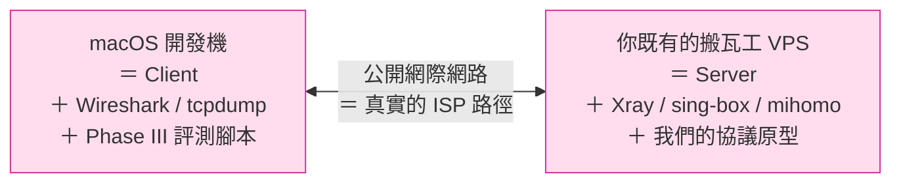
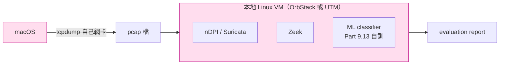
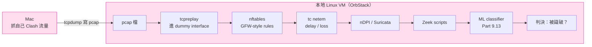

# 課堂 0.5 — 工具鏈與環境準備

## 學前知道

- **前置課**：[0.4 文獻地圖](./0.4-literature-map.md)
- **預計閱讀時間**：50~70 分鐘（含設定時間 1~3 小時，可分次完成）
- **必讀論文**：本堂無——是動手 lesson
- **必讀原始碼**：無
- **預先準備**：
  - macOS 開發機（已有）
  - **你既有的那台搬瓦工 VPS 完全足夠**——本堂不要求你新開 VPS

---

## 動機

研究員與業餘玩家最大的差別，常常**不在知識量**，而在**環境的可重現性與工具的熟練度**。

舉例：兩個人都要驗證「我新設計的協議能不能被 GFW 識別」——
- **業餘玩家**：在自己 VPS 上跑、自己連、看「能上 Google 嗎」
- **研究員**：在受控網路上 replay 已知 GFW detection rules、用 Zeek 跑 nDPI、跑 ML classifier、把結果跟 baseline 對比、產出可重現的 evaluation report

兩者的差別不是聰明程度，是**工具鏈**。本堂把 Phase I 到 Phase III 會用到的全部工具一次裝齊，並建立**可重現的實驗紀錄系統**。

> **注意**：這堂裝的工具總共 ~30 個，不是要你**現在**都精通——是要先**有**。Phase II/III 真正用到時你會回來查。

---

## 核心概念

### 1. 實驗拓撲：個人版的最小可行配置

學界 testbed paper（Wu 2023、Ensafi 2015 等測量論文）常配置兩台 VPS + GFW sim 中間節點——那是因為研究員人在美國，需要實際租中國境內 VPS 才能複製 GFW 行為。

**個人學習者不需要那種配置**。你本來就是個人翻牆使用者，你的 Mac 就是真實 client，搬瓦工就是真實 server——這就是最忠實的 GFW 對抗縮影：



**這就夠了**——Phase I/II/III 全部 baseline 工作都能在這個 setup 完成。

#### 那「GFW 模擬節點」呢？

放本地 Mac 上跑就好。**OrbStack**（macOS 上目前最快的 Linux VM 工具）能秒開 Linux container/VM，跑 nDPI/Zeek/Suricata 分析你 Mac 抓下來的 pcap——做的是分析工作，不是 in-path 攔截：



關鍵觀察：**Phase III 評測的核心是「分析 pcap」**——nDPI/Zeek/ML classifier 都是被動分析既有 pcap，不需要 in-path live deployment。pcap 你自己 Mac 上 `tcpdump` 自己網卡就有了。

#### 真的「需要 in-path 中間節點」嗎？

只有一種情境：**Phase III 12.18「真實對抗測試」**——想看你的協議在「中國境內客戶 → GFW → 境外服器」的真實路徑上會不會被封。即使這種情境，**也不需要你自己建中間節點**——直接租一台中國境內 VPS（百度雲/騰訊雲/阿里雲，按小時計費）當客戶端，連你的搬瓦工 server，做完銷毀。一週成本 ~$2~5。

#### Phase 對應實際需求

| Phase | 真實所需 | 額外成本 |
|---|---|---|
| **Part 1~5** 網路基礎 / 密碼 / TLS / 形式化 | Mac + 你既有搬瓦工 | $0 |
| **Part 6~8** VPN / 翻牆協議精讀 | 同上（讀原始碼 + 抓自己 Clash 流量） | $0 |
| **Part 9** GFW 研究 | 同上（外加 Mac 上開 Linux VM 跑 nDPI / Zeek） | $0 |
| **Part 10** 流量分析與反制 | 同上（Mac 上跑 ML classifier） | $0 |
| **Part 11~12** 協議設計與實作 | 同上（Mac 寫程式，VPS 跑 server，netem 在 VPS 上模擬高丟包鏈路） | $0 |
| **Part 12.18** 真實對抗測試（**可選**） | 短期租中國境內 VPS | $2~5 一週 |

**Phase I/II 結束時你不該有任何額外硬體支出**。Phase III 結束時最多累計 $10~30（多次短期測試）。

### 2. macOS 開發機工具清單（2026 版）

按用途分類。每節給出 `brew install` 指令 + 一句話用途。

> **設計原則**：選 2026 年活躍維護、Apple Silicon 原生、能跟未來 5 年同行的工具。對於仍是行業標準的舊工具（tmux、Wireshark）保留；對於有顯著超越的用新版本：
> - **Ghostty** > iTerm2（GPU 渲染、低延遲）
> - **mise** > nvm / pyenv / rbenv / asdf（統一語言版本管理）
> - **OrbStack** > Docker Desktop（Apple Silicon 原生、container + VM 一把刀）
> - **uv + ruff** > pip / black / flake8 / isort（Astral 出品，Rust 寫，飛快）
> - **starship** > powerlevel10k（跨 shell、Rust、持續活躍）

#### 2.1 終端機與 shell

```bash
brew install --cask ghostty         # Apple Silicon 原生終端機，GPU 渲染，CJK 字體無缝
brew install starship               # 跨 shell prompt（zsh/bash/fish 共用配置）
brew install zoxide                 # cd 升級，模糊跳目錄
brew install atuin                  # shell history 升級，可跨機器同步、模糊搜尋
brew install tmux                   # 多 session 持久化（仍行業標準）
```

> Ghostty 是 Mitchell Hashimoto（HashiCorp 創辦人）2024 年底開源的，Metal GPU 渲染，啟動 ~50ms、輸入延遲極低、東亞字體 + ligatures 同框不破——對寫中文研究筆記特別重要。iTerm2 不算過時，但 Ghostty 是 2025+ 新標準。

#### 2.2 核心 CLI 工具集

```bash
brew install fzf rg fd bat eza      # find/grep/cat/ls 的現代替代黃金組合
brew install jq yq                  # JSON / YAML 處理（Clash 配置必備；速度敏感場景可加 jaq = jq Rust port）
brew install git-delta              # git diff 專用 pager（跟 bat 同作者；formula 名是 git-delta）
brew install lazygit                # git TUI
brew install gh                     # GitHub CLI（v2.91+ 預設啟用 telemetry，研究級 repo 建議透過環境變數關掉，見下）
brew install xh                     # HTTP client（Rust 寫，比 curl 漂亮、比 httpie 快）
brew install oha                    # HTTP load test，Rust 寫，比 hey/wrk 漂亮
brew install btop                   # top/htop 的現代替代
brew install dust                   # du 的可視化替代
brew install duf                    # df 的可視化替代
brew install procs                  # ps 的現代替代
brew install --cask visual-studio-code
```

> **gh telemetry**：v2.91 (2026-04) 起預設開啟匿名 usage 上傳。研究級 repo 建議關掉——**環境變數**設定：
> ```bash
> echo 'export GH_TELEMETRY=false' >> ~/.zshrc
> # 或業界通用 do-not-track 訊號（gh 也認）：
> echo 'export DO_NOT_TRACK=1' >> ~/.zshrc
> ```

#### 2.3 多語言版本管理 ⭐ 重要

不要再用 `brew install go` / `brew install python` / `nvm` / `rbenv` 各管各的——2025 起 **mise** 是統一解：

```bash
brew install mise                   # 取代 asdf/rbenv/nvm/pyenv/goenv 全部

# .zshrc 加一行 activate
echo 'eval "$(/opt/homebrew/bin/mise activate zsh)"' >> ~/.zshrc

# 安裝並 pin 各語言（先看 latest 版本：mise latest python）
mise use --global go@latest
mise use --global rust@stable
mise use --global python@3.14
mise use --global node@latest
mise use --global bun@latest
mise use --global java@temurin-25-LTS    # Phase III 偶爾用到（Ghidra、Bazel 之類）
```

`mise` 用 `~/.config/mise/config.toml` 或 project 內 `mise.toml`/`.tool-versions` 自動切換版本——你 cd 進不同 project 自動換 Go 版本。**比 brew 各裝各的少 5 倍 PATH 衝突**。

> **注意**：brew 已裝的 `go` / `node` / `python@3.14` / `openjdk` 等不必卸——它們被其他 brew formula（如 `summarize`、`staticcheck`、`golangci-lint`、`ghidra`）依賴。mise 在 PATH 前面，互動 shell 自動走 mise；brew formula 內部仍用 brew 版本。兩條路徑共存。

#### 2.4 程式語言補充工具

```bash
# Rust 生態（mise 裝完 rust 後）
cargo install cargo-nextest         # 並行測試
cargo install bacon                 # 背景持續檢查
cargo install cargo-watch           # 檔案變動自動跑指令
cargo install --locked cargo-deny   # 依賴審計（security + license）

# Python 生態（mise 裝完 python 後）
brew install uv                     # Python 依賴管理 + 虛擬環境（Astral 出品）
brew install ruff                   # Python linter + formatter（Astral）
```

> Python 不用 `pip` + `venv` + `requirements.txt` 那套，2025 已過時——`uv` 加 `pyproject.toml` 是新標準。

#### 2.5 抓包與流量觀察 ⭐ 核心

```bash
brew install --cask wireshark       # GUI + tshark + dumpcap（cask 版含 chmodbpf helper，免 sudo 抓包）
# tshark 直接用即可——termshark TUI 自 2022 年起停滯（最後 release v2.4 = 2022-07），不再推薦
brew install nmap                   # 掃 port + 服務指紋（同包提供 nping 取代 hping3）
brew install mtr                    # 強化版 traceroute（互動 TUI 更現代可選 trippy: brew install trippy）
brew install dnsutils               # dig（macOS 內建沒有；人類可讀輸出可選 doggo: brew install doggo）
brew install masscan zmap           # 大規模 IP scan（zmap 是 Wu 2023 / GFW.report 復現的標準工具，masscan 是細節控制備援）
brew install --cask mitmproxy       # HTTPS 流量檢視（比 Wireshark 對 application 層友善）
```

#### 2.6 網路除錯

```bash
brew install iperf3                 # 頻寬測試
brew install gping                  # ping 圖形化（看延遲 spike 一目了然）
# nping（自訂封包送出 / active probing 模擬）已隨 nmap 一起裝；裝 nmap 就有 nping
# - 我們在 §2.5 裝過 nmap，nping 在 /opt/homebrew/bin/nping
# - hping3 是經典工具但 macOS brew 已 disabled (homebrew-core #5555)；
#   真要用 hping 在 Linux VM 跑（apt install hping3）；macOS 上 nping 等價
# lsof macOS 內建 (/usr/sbin/lsof)，不必 brew install
```

#### 2.7 形式化方法

```bash
# ProVerif (Lesson 5.4–5.5) — 不在 brew core，透過 OCaml opam 裝
brew install opam
opam init --bare -ay
opam switch create 5.2.0          # 建一個 OCaml 5.2 switch
eval $(opam env)
opam install proverif

# Tamarin (Lesson 5.6) — 官方提供 brew tap
brew install tamarin-prover/tap/tamarin-prover

# TLA+：用 VS Code extension 即可，不必裝 toolbox
code --install-extension alygin.vscode-tlaplus
```

> TLA+ Toolbox（Java GUI）已不維護，2025+ 改用上面這個 VS Code extension（社群維護版本）。
> ProVerif 由 INRIA 維護，透過 opam 是官方推薦方式（macOS 無 brew formula）。

#### 2.8 密碼學工具

```bash
brew install openssl@3              # 命令列工具 + libcrypto（CLI 端仍 SOTA；library 端 rustls 性能勝但無 CLI）
brew install gnupg                  # 簽章驗證 + git signing（仍 SOTA；Rust-native 替代 Sequoia 已成熟可選：brew install sequoia-sq）
brew install age                    # 現代 file encryption（Filippo Valsorda 設計）
brew install sops                   # 加密 git 內的 secrets（CNCF 接管後仍活躍）
```

> **Sequoia-PGP (`sq`)** 是 Rust-native 重寫的 OpenPGP 工具，2024 SecureDrop 等專案已遷移使用。GnuPG 仍是 git signing / keyserver 兼容的安全預設，**短期不必換**——但寫 Phase III 需要長期維護的工具時 `sq` 值得評估。

#### 2.9 文件與筆記

```bash
brew install pandoc                 # markdown → 任何格式
brew install typst                  # LaTeX 的現代替代，編譯瞬殺
brew install --cask mactex-no-gui   # 完整 TeX Live（~6GB；USENIX/CCS 論文模板會用到一堆 package）
# Zotero 不在 brew，從 https://www.zotero.org/download/ 抓 .dmg
```

> Markdown 編輯與 Mermaid / Zettelkasten-style backlink 直接在 VS Code 處理（裝 `bierner.markdown-mermaid` + `Foam` 或 `Markdown Memo` extension 即可），不需要 Obsidian。

> Phase III 寫論文：USENIX Security / NDSS / CCS 仍要求 LaTeX 模板。完整版 `mactex-no-gui` 比輕量版 `basictex` 多了 ~5GB，但寫論文時不會半夜 `tlmgr install` 救火。**個人筆記和初稿**用 **Typst** 寫順手得多——語法現代、編譯 < 100ms、錯誤訊息人話。

#### 2.10 VPN / 代理 client

**Clash Verge Rev 是你的日常 client，也是 Phase III 我們協議要整合進去的目標客戶端之一**。

它不在 brew——官方只在 GitHub releases 發 `.dmg`：

- 下載：<https://github.com/clash-verge-rev/clash-verge-rev/releases>
- 抓 `Clash.Verge_*_aarch64.dmg`（Apple Silicon）
- App 自帶 in-app updater，不需要 brew 管

研究與對照用的核心 binary：

```bash
# sing-box CLI（Phase II 通讀原始碼 + Phase III 整合主要對象）
brew install sing-box

# mihomo（Clash.Meta 的延續，Clash Verge Rev 底下跑的核心）
brew install mihomo               # 已在 homebrew/core，直接裝

# Xray-core（Part 7 通讀 + REALITY 細節主場）
# 不在 brew——從 GitHub release 抓 darwin-arm64 binary 或自己編：
# https://github.com/XTLS/Xray-core/releases
# 自編（mise go 已就緒）：
go install github.com/xtls/xray-core/main@latest
```

WireGuard 工具——**只在 Part 6 學 WireGuard 那段才會用，不是日常 client**：

```bash
brew install wireguard-tools        # wg / wg-quick CLI（Part 6.x）
brew install wireguard-go           # userspace 實作，macOS 上必用（無 kernel module）
```

#### 2.11 容器與 Linux VM

**OrbStack** 一個工具同時提供 Docker engine 與輕量 Linux VM。**不要用 Docker Desktop**（待機 ~2GB RAM、啟動 30 秒、Apple Silicon 上慢）：

```bash
brew install --cask orbstack
```

第一次開啟會問你「**What do you want to use?**」三選一（Docker / Kubernetes / Linux）：**選 Docker** 即可——它會啟動 docker engine，把 `docker` CLI context 自動切到 OrbStack。Linux VM 等 Part 2 / Part 9 再建。

驗證 OrbStack 接管 Docker：

```bash
docker context ls                   # 應該看到 orbstack * 標星號
docker version | grep -A1 Server    # Server 那段應該是 "Docker Engine - Community"，不是 "Docker Desktop"
docker run --rm hello-world         # 跑通就贏
```

Phase II/III 需要 Linux VM 時：

```bash
orb create debian dev               # 建一個叫 dev 的 Debian VM
orb -m dev                          # SSH 進 dev VM
orbctl list                         # 列所有 VM 與 container
```

> **如果你之前有 Docker Desktop**：先卸載再裝 OrbStack。Docker Desktop 內部的 LinuxKit VM 跟 OrbStack 衝突，並列會 socket 互搶。卸載流程：
> ```bash
> brew uninstall --cask docker --force  # 會要 macOS 密碼移除 system helper
> # 清殘留：
> rm -rf ~/Library/{Group\ Containers/group.com.docker,Containers/com.docker.docker,Application\ Support/Docker\ Desktop,Caches/com.docker.docker,Logs/Docker\ Desktop} ~/.docker
> ```

#### 2.12 VS Code Extensions

> **原則**：just-in-time。不一口氣全裝——每個 extension 都會多吃 RAM + 啟動時間。本門課真正必裝的只有一個。

**Phase 0 baseline（現在就裝）**：

```bash
code --install-extension bierner.markdown-mermaid       # Mermaid 圖在預覽渲染（本 repo 所有 lesson 都用）
```

就這一個。其他 markdown 增強（lint / TOC / GitHub style 預覽）對個人筆記只是噪音，不需要。

**按 Part 進度才需要的**（**到時候**再裝，**不要現在**）：

| 何時 | Extension |
|---|---|
| Part 5 用 TLA+ | `tlaplus.vscode-ide`（2026 官方；**不是**舊的 `alygin.vscode-tlaplus`） |
| Part 6 通讀 wireguard-go | `golang.Go` |
| Part 7 通讀 Xray-core | `golang.Go`（同上） |
| Part 11 寫 Typst spec 草稿 | `myriad-dreamin.tinymist`（**不是**舊的 `nvarner.typst-lsp`，已 archived） |
| Part 12 自寫實作（Go） | `golang.Go` + `tamasfe.even-better-toml` |
| Part 12 自寫實作（Rust） | `rust-lang.rust-analyzer` |
| Part 12 自寫實作（Python eval scripts） | `ms-python.python` + `charliermarsh.ruff` |
| Part 12 自寫實作（C/C++ tooling） | `ms-vscode.cpptools`（無 compile_commands.json 時預設） + `llvm-vs-code-extensions.vscode-clangd`（有 compile_commands.json 時更精準） |
| 想 SSH 進 VPS 直接編 | `ms-vscode-remote.remote-ssh` |
| 想開 dev container | `ms-vscode-remote.remote-containers` |

### 3. Linux 工具清單（你既有搬瓦工 + 本地 OrbStack VM）

下面的指令在**兩個地方**都會用到：
- 你既有的搬瓦工 VPS——**Ubuntu 24.04 LTS（x86_64）**，當 server
- Mac 上的 OrbStack Linux VM——建議用 **Debian 12（aarch64）**，當分析環境 + Part 9 起的 nDPI/Zeek 主場

兩邊 apt 指令通用（套件名一樣）。OrbStack VM 在 Apple Silicon 上跑 aarch64 原生，速度比 x86 emulation 快一個檔次；少數工具如果只發 x86 binary（罕見），再臨時建 x86 VM (`orb create debian dev --arch=amd64`)。

Ubuntu 24.04 LTS 是當前理想選擇：
- kernel 6.8，io_uring / eBPF / XDP 完整支援
- apt 套件齊全且新
- WireGuard / Xray / sing-box 都優先支援
- LTS 維護到 2029，學完整個 Phase III 都不用換

#### 3.1 基本系統工具

```bash
sudo apt update && sudo apt upgrade -y
sudo apt install -y \
  build-essential pkg-config libssl-dev \
  curl wget git vim tmux htop btop iotop \
  jq yq fzf ripgrep fd-find bat \
  net-tools iproute2 ethtool \
  dnsutils whois \
  ca-certificates gnupg
```

> `btop` 比 `htop` 漂亮且資訊更多，是 2024+ 新標準。Debian 12 的 apt 直接有。

#### 3.2 網路與流量分析 ⭐

```bash
# 抓包與基本網路工具
sudo apt install -y \
  tcpdump tshark \
  nmap masscan zmap \
  mtr-tiny iperf3 \
  netcat-openbsd \
  hping3                          # Linux 仍有 hping3 套件（macOS 沒了）

# tc + netem 隨核心內建（iproute2）；nftables 也有
sudo apt install -y nftables
```

**nDPI（DPI 函式庫 + CLI）**——Ubuntu 24.04 套件名是 `ndpi`（含 `ndpiReader` CLI 工具），而非舊版的 `ndpi-utils`：

```bash
sudo apt install -y ndpi
ndpiReader --version       # 驗證
```

**Suricata**——OISF 官方 PPA 對 Ubuntu 24.04 的支援延後了，2026 中後才上 noble。在那之前用 universe repo 的版本即可（夠 Phase II 用）；Phase III 真要最新版時從 source build：

```bash
sudo apt install -y suricata        # universe repo 版（夠用）
suricata --build-info | head -5
```

**Zeek**——要用 Zeek 官方 OBS（OpenSUSE Build Service）repo，**對 Ubuntu 24.04 (noble) 有對應 path**：

```bash
echo 'deb http://download.opensuse.org/repositories/security:/zeek/xUbuntu_24.04/ /' \
  | sudo tee /etc/apt/sources.list.d/security:zeek.list
curl -fsSL https://download.opensuse.org/repositories/security:zeek/xUbuntu_24.04/Release.key \
  | gpg --dearmor | sudo tee /etc/apt/trusted.gpg.d/security_zeek.gpg > /dev/null
sudo apt update
sudo apt install -y zeek-lts        # LTS 版（Phase III 評測穩定性優先）
# 或：sudo apt install -y zeek      # 主線版（功能最新）

# Zeek binary 在 /opt/zeek/bin，加進 PATH（依 $SHELL 寫入對應 rc）：
SHELL_NAME=$(basename "$SHELL")
echo 'export PATH=/opt/zeek/bin:$PATH' >> ~/.${SHELL_NAME}rc
```

> Mac 上的 OrbStack VM 如果建的是 Debian 12，把 `xUbuntu_24.04` 換成 `Debian_12` 即可——OBS 兩個都有。

#### 3.3 eBPF / XDP / kernel 觀察

```bash
sudo apt install -y \
  bpfcc-tools bpftrace libbpf-dev \
  linux-tools-common linux-tools-generic \
  systemtap \
  llvm clang
```

> `perf-tools-unstable` 已從 Debian 12 移除，不再需要——`linux-tools-generic` 已包含 `perf`。
> Cilium / XDP / 現代 eBPF tooling 需要 LLVM/clang（apt 版本夠用）。

#### 3.4 程式語言（在 VPS 上偶爾要編）

VPS 上同樣用 **mise** 統一管理，避免一堆 PATH 衝突：

```bash
# 裝 mise
curl https://mise.run | sh

# 加 activate 進你的 shell rc（依 $SHELL 二選一）
SHELL_NAME=$(basename "$SHELL")
echo "eval \"\$(~/.local/bin/mise activate $SHELL_NAME)\"" >> ~/.${SHELL_NAME}rc
exec $SHELL_NAME    # reload

# 用 mise 裝語言（Server 端通常只需 Go / Python / Rust）
mise use --global go@latest
mise use --global rust@stable
mise use --global python@3.14

# Python 依賴管理用 uv
curl -LsSf https://astral.sh/uv/install.sh | sh
```

> **注意**：VPS 預設可能是 bash；如果你跟 Mac 一樣換成 zsh，所有 PATH / activate 設定要寫進 `~/.zshrc` 而不是 `~/.bashrc`，否則 zsh 不會載入。

#### 3.5 VPN / 代理 server

```bash
# WireGuard (kernel module 在 Debian 12 kernel 6.x 已內建，apt 套件只裝 userspace 工具)
sudo apt install -y wireguard-tools

# Xray / sing-box / mihomo（server 端通常從 release binary 跑，不在 VPS 上編譯）
# Phase III 寫自己協議要 deploy 時，dev 機 cross-compile 後 scp 上去
# 範例（Phase III 才會用）：
#   GOOS=linux GOARCH=amd64 go build -o myproto-linux ./cmd/server
#   scp myproto-linux user@vps:/usr/local/bin/

# 如果搬瓦工原本用 ccb 部署過，相關 binary 應該已在
# /usr/local/bin/xray 或 /usr/local/x-ui 之類路徑——別亂動，跟你機場並存就好
```

### 4. 本地 Linux 環境：分析環境兼 GFW 模擬器

Phase II 起會需要能跑 nDPI / Zeek / 自訓 ML classifier 的 Linux 環境——這跑在 Mac 上，不佔用你搬瓦工。OrbStack 同時提供兩種選項：

| | **Docker container（OrbStack）** | **Linux VM（OrbStack）** |
|---|---|---|
| 啟動速度 | 秒級 | 秒級 |
| 何時用 | 一次性分析腳本、Zeek/nDPI 跑 pcap、tooling 試用 | Part 2 kernel-level 實驗、Part 9 完整 GFW sim |
| Kernel module 載入 | container 預設 read-only kernel | ✅ 自由 |
| 多 netns + veth pair | container 內可做但污染主環境 | ✅ 完全隔離 |
| io_uring / eBPF / XDP | 部分可（macOS Docker 內部本來就是 Linux VM）| ✅ 完全可控 |
| netem / tc | 部分可 | ✅ 完全支援 |
| 持久化資料 | volume | filesystem |

**實務建議**：

- **Phase I~II 早期**：用 Docker container 即可。OrbStack 啟動 Docker engine 後 `docker run -it --rm debian:12 bash`，幾秒搞定。
- **Part 2（高效能 I/O）開始**：升級到完整 Linux VM。
- **Part 9.10–9.13（GFW 模擬器）**：**強烈建議完整 VM**——多 netns + tc + nftables 隔離環境。

#### OrbStack 同時管 Docker + VM

OrbStack 是 macOS 上 Apple Silicon 原生的 Linux 虛擬化工具，一個工具同時跑 Docker container 和輕量 Linux VM：

```bash
# 你已裝 OrbStack（取代 Docker Desktop），現在可以建 VM：
orb create debian dev               # 建一個叫 dev 的 Debian 12 VM
orb -m dev                          # SSH 進去
orbctl list                         # 列所有 VM + container

# VM 內自動掛載 Mac 的 ~/code → /Users/liuzetfung/code（同一路徑）
# Mac 上編輯，VM 內直接跑，零複製成本
```

OrbStack 比 UTM 快約 3x（用 Apple Virtualization Framework），比 Docker Desktop 內部的 LinuxKit 啟動快 10x。

#### UTM（備援，免費開源）

如果未來要跑非 Linux 系統（FreeBSD、Windows），用 UTM：

```bash
brew install --cask utm
```

#### Phase III GFW 模擬器架構（你最終要建的）

到 Part 9.10–9.13 才會具體建。架構：



關鍵：**這不是 in-path 攔截真實流量**，是離線分析既有 pcap。你 Mac 不用改 routing，搬瓦工不用變動。**完整實作會在 Part 9.10–9.13 詳講**。本堂只要你裝好 OrbStack。

### 5. 實驗筆記系統 ⭐ 重要

每個實驗一個 markdown 檔，存在 `notes/experiments/`，命名 `YYYY-MM-DD-short-id.md`。模板：

```markdown
# Experiment {id}: {title}

**Date**: YYYY-MM-DD
**Goal**: 一句話說這個實驗要證明 / 證偽什麼
**Lesson reference**: Part X.Y
**Status**: planning / running / done / failed

## Hypothesis
- H1: ...
- H2: ...
- (each one falsifiable)

## Setup
- Hardware: VPS A (region X), VPS B (region Y), GFW sim VM (region Z)
- Software versions: ...
- Configuration files: link to git commit hash

## Protocol（步驟）
1. ...
2. ...

## Raw data
- pcap files (gitignored, summary in this file)
- Zeek logs (path)
- syslog (path)

## Analysis
- 圖、表、結論

## Conclusion
- H1: confirmed / falsified / inconclusive (with evidence)
- H2: ...

## Surprises / lessons learned
（這節最重要——negative results 與 unexpected behavior 都記）

## Next experiments suggested
```

**為什麼要這份模板**：
- 「沒記錄的實驗 = 沒做的實驗」（Hamming 1986 暗示）
- 半年後的你 grep 自己——找得到結論才算真的學到
- Phase III 寫論文時，evaluation section 直接從這些 entry 拼

### 6. 環境設置 checklist

按優先序，完成你目前 Phase 需要的就好。**全程沒有「再開新 VPS」**——既有搬瓦工 + 本地 Mac/OrbStack VM 通包。

#### Tier 0（**現在**就要）

- [ ] macOS Homebrew 升級到最新（`brew update && brew upgrade`）
- [ ] 裝 §2.1 終端機與 shell（Ghostty + mise + starship + atuin + zoxide + tmux）
- [ ] 裝 §2.2 核心 CLI（rg / fd / bat / eza / fzf / jq / yq / delta / lazygit / gh / xh）
- [ ] 裝 §2.5 抓包工具（Wireshark cask 版 + nmap + mtr + zmap）
- [ ] 設定 git config + GitHub SSH key
- [ ] 完成 Markdown preview 樣式（學前已配）

#### Tier 1（Phase I 結束前）

- [ ] §2.3 mise 接管全部語言（Go / Rust / Python / Node / Bun / Java）
- [ ] §2.7 形式化工具（ProVerif + Tamarin + TLA+ VS Code extension）
- [ ] §2.11 OrbStack 裝好且 `docker run hello-world` 跑通
- [ ] 搬瓦工裝 §3.1, §3.2 工具（你機場本來就有部分了；搬瓦工 Ubuntu 24.04 已是理想 OS）
- [ ] Mac 上跑通 `wireguard-go`，本機自己連自己當 sanity check

#### Tier 2（Phase II 開始時）

- [ ] OrbStack 建第一個 Linux VM（`orb create debian dev`）
- [ ] VM 內裝 §3.3 eBPF 工具
- [ ] Mac 抓自己 Clash 流量 → pcap 拉到 VM 用 Zeek/nDPI 分析（**這個 pipeline 是 Phase III 評測的核心**，提前熟悉）
- [ ] git clone Xray-core / sing-box / mihomo 三個 repo 到 Mac 上（在 Mac 編譯，不要把編譯重活壓在搬瓦工）

#### Tier 3（Part 9 開始時）

- [ ] OrbStack VM 內建完整 §4 GFW 模擬器
- [ ] netem / nftables / Zeek pipeline 在 VM 內跑通
- [ ] 復現 Wu 2023 §4 那 5 條 heuristic（離線跑既有 pcap）

#### Tier 4（**選擇性**，僅 Phase III 12.18 真實對抗測試）

- [ ] 租一台中國境內 VPS（百度雲 / 騰訊雲 / 阿里雲按小時），做測試後銷毀
- [ ] 從境內 VPS 連你搬瓦工 server，跑你寫的協議
- [ ] 在境內 VPS 用 Wireshark 抓回程流量，分析 GFW 真實行為
- [ ] 預算 $2~5 一週

### 7. 預算與安全

#### 預算

| 階段 | 你需要的硬體 | 額外月費 |
|---|---|---|
| Phase I（網路基礎 / 密碼 / TLS / 形式化） | Mac + 你既有搬瓦工 | **$0** |
| Phase II（VPN / 翻牆協議精讀） | 同上 + OrbStack（免費）VM | **$0** |
| Phase III（協議設計 + 實作 + 評測） | 同上 | **$0** |
| Phase III 12.18 真實對抗測試（可選） | 短期境內 VPS | 一週 $2~5 |

**全程累計額外成本：$0~30**——研究級工作流不必燒錢。

如果未來 Phase II/III 你發現**真的**需要一台額外境外 VPS（例如你想跑 long-running benchmark 不想用搬瓦工會影響翻牆），最便宜選項：
- **Hetzner Cloud** CX22：€3.79/月（歐洲 only，到中國 RTT 較高）
- **Vultr** Tokyo $2.50/月實例（已售完則嘗試 IPv6-only 方案）
- **RackNerd / BandwagonHost / NexusBytes** 等 LET（lowendtalk）廠商，年付有 $10–20/年方案

**但記住：Phase I/II/III baseline 不需要這些。**

#### 搬瓦工 + 機場共存策略

你既有搬瓦工大概率還跑著你的個人機場（Xray / sing-box / mihomo）。Phase II/III 開始要在同一台 VPS 跑研究用協議時：

**做法 A（簡單）**：另開 port，研究用協議跑在不同 port，跟機場並存。例如 ccb 用 443，你研究協議用 8443。

**做法 B（乾淨）**：用 systemd-nspawn 或 lxc container 把研究環境跟機場隔離，避免你寫的 toy code crash 影響機場使用。

我推薦 **A** 先做——簡單，Phase II 結束前不夠用再升級到 B。

#### 安全注意

- **CLAUDE.md 的硬規則**：`~/code/vpn/confidential/` Claude 永不讀（已寫進）
- **搬瓦工憑證**（IP / 域名 / SSH key / Xray UUID 等）寫成 `~/code/vpn/confidential/bwg.env`，**不**進 git
- **SSH 改成 key-only auth**（搬瓦工面板上禁用密碼登入）
- **研究用協議不要綁你的真實域名**——用 `vps.example.com` 之類佔位符放 spec 公開檔案裡
- **公開 repo 的範例**永遠脫敏（CLAUDE.md 已強制）

### 8. 復現性（Reproducibility）紀律

研究員的核心紀律之一。每個實驗應該能讓**別人**（或半年後的你自己）一鍵復現。三個層次：

| 層次 | 機制 | 用在哪 |
|---|---|---|
| **L1** | 文字步驟列表 | 簡單實驗 |
| **L2** | Bash script + `set -euo pipefail` | 中等實驗 |
| **L3** | Docker image / Vagrant box / Nix flake | Phase III 評測 |

**現階段建議**：L1 + L2，Phase III 再升 L3。

---

## 與我們協議設計的關聯

工具鏈直接決定 Phase III 能做多深：

1. **Wireshark / tshark** → Phase III 12.15 抗審查評測 → 看自己協議流量像不像 HTTPS
2. **nDPI / Zeek** → Phase III 12.15 → 跑被動 detection
3. **hping3 / 自寫 Go probe** → Phase III 12.16 主動探測模擬
4. **netem** → Phase III 12.13 高丟包鏈路評測（vs Hysteria2）
5. **eBPF / XDP** → Phase III 12.4 資料路徑零拷貝實作（如果走 Linux 路線）
6. **ProVerif / Tamarin** → Phase III 11.10–11.11 形式化驗證
7. **TLA+** → Phase III 11.9 規格化關鍵不變量
8. **Zeek scripts** → Phase III 12.17 ML classifier 訓練 dataset 來源

**沒裝好工具就直接進 Phase III** = 在 Phase III 邊學邊裝，效率減半。

---

## 動手（90 分鐘可分次完成）

按 Tier 0 + Tier 1 完成基本環境。具體三個任務：

### 任務 1（30 min）：完成 Tier 0 + Wireshark 抓包

```bash
# 1. 裝齊 Tier 0 工具（10 min）
brew install --cask ghostty wireshark
brew install mise starship atuin zoxide tmux \
             fzf rg fd bat eza jq yq git-delta lazygit gh \
             xh oha btop dust duf procs

# 2. 抓 5 分鐘自己的 Clash 流量（10 min）
# 開 Wireshark，選 "en0"（你的 WiFi 介面）
# Capture filter: host vps.example.com（換成你機場的 IP/域名）
# 開 Clash 走某個 VLESS+REALITY 節點
# 隨便瀏覽幾個網站
# 停止 capture

# 3. 觀察（10 min）
# 找一條 TCP 連線，看 TLS Client Hello
# 看 SNI 欄位（你 Clash 配置裡 servername 對得上嗎？）
# 看 Cipher Suites（跟你瀏覽器直接連 google.com 的長一樣嗎？）
```

**這個動手練習目的**：第一次親眼看到 VLESS+REALITY 的 TLS Client Hello——之後 Part 4/7 學它原理時你會「啊原來那一行就是這個 byte」。

### 任務 2（30 min）：盤點既有搬瓦工 + 啟用 OrbStack

你的搬瓦工是 **Ubuntu 24.04 LTS（x86_64）**——理想配置，下面直接用：

```bash
# 1. SSH 進搬瓦工（用你的真實 IP/域名，下面是佔位符）
ssh root@vps.example.com

# 2. 確認 OS（應該看到 Ubuntu 24.04 LTS）
cat /etc/os-release

# 3. 裝研究用工具（跟既有機場並存，不影響）
apt update && apt install -y \
  tcpdump tshark nmap mtr-tiny iperf3 nftables \
  wireguard-tools btop

# 4. 確認沒佔到機場用的 port
ss -tlnp | grep -E ':(443|80|8443)'

# 5. 回到 Mac 啟用 OrbStack（前面 Tier 0 已 brew install --cask orbstack）
exit
open -a OrbStack
# 第一次啟動：選 "Docker"（不選 Linux 也不選 Kubernetes）
# 等它把 Docker engine 啟動好

# 6. 驗證 OrbStack 接管 Docker
docker context ls           # 應該看到 orbstack * 標星號
docker run --rm hello-world # 跑通就贏
```

### 任務 3（Tier 1 才需要做）：建 OrbStack Linux VM

進入 Phase I 後期再做——本堂不強制：

```bash
orb create debian dev       # 建一個叫 dev 的 Debian 12 VM
orb -m dev                  # SSH 進去

# VM 內裝 Phase III 主場工具
sudo apt update && sudo apt install -y \
  build-essential tcpdump tshark nmap nftables \
  bpfcc-tools bpftrace libbpf-dev linux-tools-generic
```

### 任務 4（10 min）：建立實驗筆記目錄 + 第一份實驗紀錄

```bash
cd ~/code/vpn/learn
mkdir -p notes/experiments
```

把上面任務 1（Wireshark 抓 Clash）寫成一份 experiment note，用 §5 的模板。**就算實驗很小**，今天養成的習慣比未來補做有效十倍。

---

## 自我檢查

1. 為什麼**個人學習者**用「Mac + 既有 VPS + 本地 VM」就夠，不需要學界 testbed paper 那種「兩台 VPS + GFW sim 中間節點」？學界那個 setup 是為解決什麼問題？我們為什麼不需要解決同一個問題？
2. macOS dev machine vs Linux VM 的工具差別在哪？哪些 Phase III 任務**必須**在真正 Linux kernel 上做、不能只靠 macOS？
3. ProVerif / Tamarin / TLA+ 各自驗證什麼類型的屬性？什麼時候用哪個？（Part 5 詳講，現在能說個大方向就行）
4. 「實驗筆記系統」為什麼比「跑完實驗就好」重要？這跟 Hamming 1986 的哪個 habit 對應？
5. 復現性 L1/L2/L3 三層，本門課現階段你應該停在哪一層？為什麼不是直接 L3？

---

## 延伸閱讀

- **Brendan Gregg's Linux Performance**: <https://www.brendangregg.com/linuxperf.html> — Linux 性能觀察工具的 canonical 學習地圖。圖表已成業界 meme
- **Julia Evans' Networking zines**: <https://wizardzines.com/zines/tcp-ip/> — 用漫畫教 networking debugging tools，輕鬆但精確
- **Sandstorm.io reproducibility manifesto**: <https://sandstorm.io/news/2017-04-18-reproducible-builds> — 為什麼 reproducible builds 對 security 重要
- **Nix / NixOS for research**: <https://nixos.org/> — Phase III 升 L3 reproducibility 時值得認真考慮的方向
- **The Tor Project's research safety guidelines**: <https://research.torproject.org/safetyboard/guidelines/> — 做 censorship research 的 ethics best practice
- **Apple Container** (macOS 26+ 內建)：<https://github.com/apple/container> — Apple 自己出的 container runtime（用 `container` CLI），2026 仍很初期但值得追。**不是現在的選擇**——OrbStack 在功能完整度與 Docker 兼容性上仍領先一個檔次，但 5 年內可能 reshape macOS container 生態

---

## 研究級補遺

> 主體已是動手指南。這節升級到「研究員的工具觀」與環境設計的更高 level discussion。

### 1. 學界詞彙

- **Reproducibility** vs **Replicability**：學界術語有 ACM 標準分工——
  - **Reproducibility** = 同樣 artifact + 同樣 setup → 同樣結果（同一團隊重做）
  - **Replicability** = 不同 artifact + 同樣 method → 同樣結論（不同團隊重做）
  - **Repeatability** = 同 team 同 setup 多次跑得到一致結果（最嚴格的 internal validity）
  - 我們本堂強調的是 **reproducibility**——你六個月後重做一遍要能跑通
- **Artifact evaluation**：USENIX Security / CCS / SOSP 等場次有 **Artifact Evaluation track**——你 submit code + data + reproduction script，由獨立 reviewer 確認能跑通才會給「Artifacts Available」「Artifacts Functional」「Results Reproduced」三層 badge。我們協議發表時這是 USENIX Security baseline expectation
- **Hermetic build** / **deterministic build**：build 系統不依賴 host environment、不含 timestamp / random ID——同源永同 binary。Bazel / Nix 為達成此目標而生
- **Sandboxing levels**：chroot < container (Docker/Podman) < VM (KVM/VirtualBox) < hardware-isolated (separate machine)——對 GFW simulation 我們需要至少 VM-level 隔離，避免 nftables 規則 contaminate host
- **Test bed / Testbed**：學界稱「實驗用網路環境」的標準詞。我們的三節點 GFW sim 在學界正式名稱是 **circumvention research testbed**
- **Laboratory censor** vs **operational censor**：lab 模擬的 GFW 永遠是過時的（基於 published research），real GFW 永遠領先 published 6–12 個月——**evaluation 時必須誠實標 lab caveats**

### 2. 形式化定義

實驗環境的 reproducibility 可形式化為：

- 令 **artifact** A = (code commit hash, dependency lock, OS image, hardware spec, config files, random seed)
- 令 **measurement** M(A) = 在 artifact A 下產生的 observable output set
- **Reproducible** iff for all valid A, multiple runs yield M(A) within ε statistical similarity
- **Replicable** iff for "method-equivalent" A' ≠ A, conclusions C(M(A')) ≅ C(M(A))

實務 implication：**lock everything**——random seed、time、network conditions（用 netem 固定 delay/loss seed）、locale、tz——否則 ε 會大到結論不一致。

### 3. 我們協議的座標

工具鏈選擇直接決定 Phase III 12.x 的可達深度：

| 工具決策 | 對協議能力影響 |
|---|---|
| 用 Go vs Rust vs C 寫 client | 影響可達 throughput；Go GC 可能限制 < 5 Gbps |
| 用 io_uring vs epoll | Linux only；io_uring 才能上 Hysteria2 級單實例 throughput |
| 用 ring vs BoringSSL vs OpenSSL | constant-time 保證等級；ring > BoringSSL > OpenSSL |
| 用 quic-go vs 自寫 QUIC | 自寫成本巨大但 freedom 大；quic-go fork 是中道 |
| 用 nftables vs eBPF/XDP for GFW sim | XDP 可達 line rate，nftables 可能成 evaluation bottleneck |
| ProVerif vs Tamarin | Tamarin 表達力強但學曲線陡 |

**Phase III 11.4 主架構決策**會回頭看本堂工具清單做 trade-off。如果工具沒裝、沒玩過、沒對它有直覺，那個決策會被瞎選。

### 4. 必追資源

#### 高品質工具發布追蹤

- **brew tap homebrew/cask**：macOS 工具新版本
- **Linux From Scratch** docs：底層理解 distro 是怎麼組成的
- **Awesome lists**:
  - <https://github.com/awesome-selfhosted/awesome-selfhosted>
  - <https://github.com/sindresorhus/awesome-nodejs>（雖非主領域但好）
  - <https://github.com/Hack-with-Github/Awesome-Hacking>

#### 觀察其他研究員的環境

- **Brendan Gregg 個人 blog**：Linux performance tools 之神
- **Marek Majkowski (Cloudflare blog)**：底層網路工程文章極多
- **filosottile (Filippo Valsorda) 個人 blog**：Go cryptography lead，環境組合精準
- **Dan Luu**：debugging methodology + environment setup case studies

#### Conference artifact tracks

- USENIX Security AE: <https://www.usenix.org/conference/usenixsecurity24/call-for-artifacts>
- ACM CCS Artifacts: <https://www.sigsac.org/ccs/CCS2024/call-for-papers/artifacts.html>
- 看別人怎麼 package research artifact 是最快的學習方式

### 5. 常見坑與 anti-patterns

10 年研究員會踩的坑：

- **VPS 用 root 直接幹活**——一個誤操作毀掉整個 instance；應該建 user + sudo
- **SSH 用 password**——遲早被字典攻擊；只用 key + disable password auth
- **抓包不過濾**——VPS 上 `tcpdump` 沒 filter 一秒幾百萬封包，盤滿
- **跨 provider 跑 evaluation 沒記錄 ASN/region**——後來發現結果跟 routing 路徑強相關，無法 reproduce
- **同一個 VPS 跑 client + server**——loopback 流量跟真實網路天差地別
- **不記 dependency 版本**——半年後 `apt install` 拿到不同版本，行為改變
- **不存 raw data**——只存 summary stats，質疑時無法重新 analyze
- **用個人 SSH key 進 research VPS**——一旦 key 洩漏個人 GitHub 也跟著掛
- **`git clone --depth 1`** 拿原始碼——丟失 git history，無法做 git archaeology
- **本機不用 dotfiles repo**——換機器要重 setup 半天

### 6. 開放問題

- **AI-augmented dev environment** 的 net effect：Claude / Copilot 改變了「需要 install 多少工具」的 trade-off——也許某些工具現在 just-in-time 安裝即可
- **Cloud-native research environment**（GitHub Codespaces、Gitpod、Coder）vs 本機開發：對 GFW research 哪個更適合？網路實驗特別需要 low-level 控制，cloud 環境可能限制太多
- **Reproducibility crisis in security research**：USENIX Security 2024 的 Artifact Evaluation 統計顯示 ~60% paper 提交 artifact，但只 ~40% 通過 "Results Reproduced" badge。**為什麼？** 學界沒共識
- **Lab censor vs real censor 的鴻溝怎麼縮**：本堂的 GFW sim 永遠基於 published research，落後真實 GFW；除了「等別人 publish 新 GFW behavior」之外有更主動的方法嗎？
- **Quantifying experimental rigor**：怎麼量化「我這次實驗夠嚴謹」？目前學界靠 reviewer judgment——能否有自動 metric？

### 7. 對你的具體建議

**第一週**：完成 Tier 0 + 任務 1（Wireshark 抓包看自己 Clash 流量）。**這個動作會永久改變你看待網路的方式**——你會第一次「看見」協議。

**第一個月**：完成 Tier 1。Tier 1 完成意味著：
- 你能在 dev machine 寫 Go/Rust/Python
- 你能 SSH 進 VPS 做基本網路測試
- 你能用 ProVerif 跑 toy 例子（哪怕沒懂 syntax）

**Phase II 結束前**：Tier 2 完成。**Tier 3（GFW 模擬器）拖到 Part 9 啟動時做**——太早做沒實際 lesson 用上會生疏忘掉。

---

下一堂：**Part 1.1 — 分層的真實意義**（不是教科書版）。

至此 Part 0 全部完成 ✅✅✅✅✅，正式進入 Phase I 主體：18 堂的網路基礎深潛。

**Part 0 出口能力 self-check**：
- ✅ 你知道整門課要做什麼（0.1）
- ✅ 你有一張依賴地圖知道怎麼讀（0.2）
- ✅ 你有可操作的研究員工作流（0.3）
- ✅ 你知道接下來要面對哪些論文（0.4）
- ✅ 你有一套可重現的工具環境（0.5）

5 條都點頭 = Part 0 結業。
