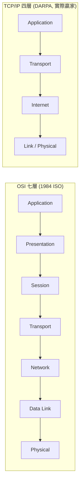
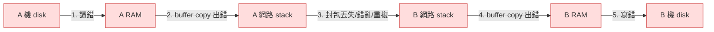
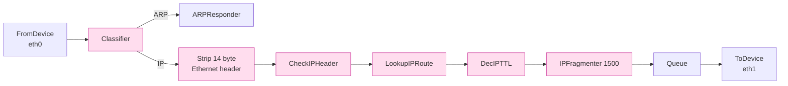
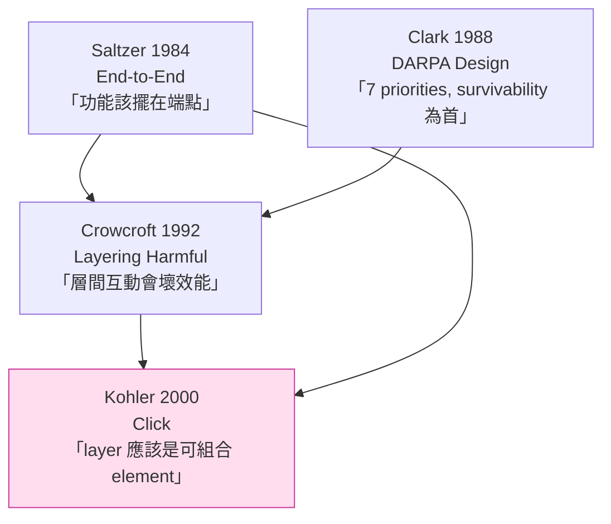

# 課堂 1.1 — 分層的真實意義（不是教科書版）

## 學前知道

- **前置課**：Part 0 全部
- **預計閱讀時間**：30~40 分鐘
- **必讀論文**：
  - **Saltzer, Reed, Clark — End-to-End Arguments in System Design** (ACM TOCS 1984) ⭐
  - **Clark — The Design Philosophy of the DARPA Internet Protocols** (SIGCOMM 1988)
  - **Crowcroft, Wakeman, Wang, Sirovica — Is Layering Harmful?** (IEEE Network 1992)
  - **Kohler, Morris, Chen, Jannotti, Kaashoek — The Click Modular Router** (TOCS 2000)
- **必讀原始碼**：無

---

## 動機

打開任何一本網路教科書，第一章一定畫 OSI 七層。畫完之後，作者通常**不解釋為什麼要分層**，更不會說**為什麼七層**——彷彿這是物理常數。

對「能寫出 SOTA 翻牆協議」這個目標，這種教法是**有害**的。理由：

1. **OSI 七層是政治產物，不是工程真理**——TCP/IP 早就用四層贏了，OSI 只剩教學意義
2. **真正的網路工程**經常**故意打破分層**——QUIC 把傳輸層和加密層融合、TLS 1.3 把握手和金鑰交換融合、REALITY 把代理協議和 TLS 握手融合
3. **「分層」本身就是被嚴肅質疑過的設計選擇**——1992 IEEE Network 的 *Is Layering Harmful?* 用實證證明分層介面引入過真實的效能 bug

要設計新 SOTA 協議，你必須能回答：
- **為什麼**這個功能放這一層而不是上一層或下一層？
- **什麼時候**該打破分層、什麼時候該維護分層？
- **如何**在不破壞抽象的前提下做 cross-layer 優化？

教科書版的「七層金字塔」回答不了這些問題。本堂用四篇 primary source 把這件事講對。

---

## 核心概念

### 1. 教科書版（先承認，再解構）

兩個常見的分層模型：



每層的**承諾**是：
- 我只跟我上面那層 + 我下面那層說話
- 我提供一個穩定介面給上層
- 我不關心上層做什麼語意，下層怎麼實作

歷史現實：**OSI 七層敗了**。商用網路協議實作 99% 是 TCP/IP。OSI 留下的主要遺產是 X.500（→ LDAP）和「session/presentation 這兩個詞」。

### 2. 分層**真正解決**的問題：管理複雜度

不是「分層讓系統更好」——而是**「沒有分層就沒辦法把這麼多人放進同一個系統工作」**。

**分層的三個真實工程價值**：

1. **獨立演化**：你換 WiFi → 4G 不影響 LINE 對話進行；TCP 改 BBR 不影響 HTTP；TLS 1.2 → 1.3 不影響 HTTP semantic
2. **分工**：寫 driver 的人不用懂 HTTP；寫 web app 的人不用懂以太網路 frame format
3. **複用**：一個 TCP 實作給 HTTP / SSH / SMTP / IRC / 你自己的協議用

**分層的代價**：
- **效能**：每層都要做 buffer copy + 加 header + 檢查
- **資訊不對稱**：上層拿不到下層的 hint（ECN、congestion signal、physical-layer SNR）
- **介面僵化**：一旦定下來就難改（IPv4 → IPv6 折騰了 30 年）

### 3. End-to-End Argument（Saltzer 1984）⭐ 整個分層理論的基石

這是**設計師應該記住的第一個工程原則**——不是因為它總是對，而是因為它精確標出了「哪些功能該放高層、哪些該放低層」這個決策的核心。

#### 原始陳述（Saltzer-Reed-Clark, 1984）

> "The function in question can completely and correctly be implemented only with the knowledge and help of the application standing at the end points of the communication system. Therefore, providing that questioned function as a feature of the communication system itself is not possible. Sometimes an incomplete version of the function provided by the communication system may be useful as a performance enhancement."

**翻譯**：某些功能**只能**在端點（application）正確實作；通訊系統 lower-layer 提供它最多只是 performance hint，不能取代端點的實作。

#### Saltzer 的「careful file transfer」案例

設想 A 機器把檔案傳給 B 機器。可能的故障點：



問：「網路層提供 reliable transmission（保證封包不丟、不錯、不重複）」**夠嗎**？

**Saltzer 的答案：不夠**。理由：reliable transmission 只擋掉故障 #3，但 #1 #2 #4 #5 仍可發生。所以**端點 application 反正都得自己做 end-to-end checksum + retry**。既然如此，**lower layer 的 reliable transmission 只剩 performance 價值**，沒有 correctness 價值。

#### MIT 真實案例

Saltzer 親身經歷的 bug：MIT 的 gateway 每傳 100 萬 byte 就交換一對 byte（hardware bug），結果**所有 source code 都被靜默腐化**——直到有人手動跟舊列印對照才發現。

**Lesson**：**就算 hop-by-hop 有 checksum，端點不做 end-to-end checksum 你還是會被搞**。

#### End-to-end argument 的後續應用

Saltzer 把這個論證套到至少 6 個系統功能：

| 功能 | 為什麼端點仍要做 |
|---|---|
| **Reliable delivery** | Hop-by-hop ACK 不等於 application 收到並處理 |
| **Encryption** | 通訊系統做加密 → 在端點 decrypted 後仍暴露；端點還是要 authenticate |
| **Duplicate suppression** | application 自己 retry 也會產生 duplicate，下層擋不掉 |
| **FIFO ordering** | 跨 connection / 跨 process 的 ordering 必須 application 自己做 |
| **Delivery acknowledgement** | 「網路收到」≠「application 處理了」 |
| **Crash recovery** | Two-phase commit 必須在 application layer 實作 |

#### End-to-end argument 對我們協議設計的核心啟發

**幾乎所有 Phase III 設計決策都會遇到這個問題**：

| 設計問題 | end-to-end 觀點 |
|---|---|
| 我們協議要不要做 reliable delivery？ | 取決於我們把「end」定在哪——TCP 內 / TLS 內 / proxy 內 / app 內 |
| 我們協議要不要做加密？ | 我們**就是**加密層，但 application 仍要做 application-layer auth |
| 要不要做 reordering？ | QUIC 做了；TCP 做了；但 application 仍可能要 |
| 要不要做 retry？ | 我們做 connection-level retry；application 做 request-level retry |

**Saltzer 親自講的最重要那句話**：「**The end-to-end argument is not an absolute rule, but rather a guideline that helps in application and protocol design analysis; one must use some care to identify the end points to which the argument should be applied.**」

「端點在哪」決定一切。對我們翻牆協議：
- **使用者**是端點 → 抗審查必須在 application 之上做
- **目標伺服器**是端點 → 內容加密由 TLS / 應用層做
- **Proxy 本身**是中繼，**不是**端點 → 不要在 proxy 層做端點該做的事

### 4. Internet 設計哲學（Clark 1988）

David Clark 1988 SIGCOMM 那篇 *The Design Philosophy of the DARPA Internet Protocols* 是 Internet 設計的**內部回顧**——他列了 7 個設計目標，**按優先順序**：

| # | 目標 | 翻譯 |
|---|---|---|
| 1 | Survivability | 部分節點掛了，通訊仍能繼續 |
| 2 | Multiple types of service | 支援不同 application（檔案傳輸、即時通訊、虛擬電路） |
| 3 | Variety of networks | 跨多種底層網路（衛星、無線、有線） |
| 4 | Distributed management | 沒中央控管 |
| 5 | Cost effective | 便宜 |
| 6 | Host attachment with low effort | 接一台新 host 不該需要重大修改 |
| 7 | Accountability of resources | 知道誰用了多少資源 |

**關鍵**：**這 7 個是有順序的**。Survivability > 一切。所以 Internet 採取 **fate sharing**：把 connection state 放在端點 host，不放在中間的 router。Router 掛了？沒事，host 自己重連。Host 掛了？那 connection 本來就該死。

**對我們的啟示**：

- **Survivability 為第一**直接導致 stateless / soft-state network——這是為什麼 TCP/IP 沒有 connection setup phase 在 router 中（對比 ATM / X.25），也是為什麼 IP packet 自帶完整 routing info
- **Accountability 排第七** = 為什麼 Internet 從一開始就**沒有實名制 / 沒有付費機制**——這個架構決定後來也讓**翻牆**成為可能。如果 Clark 把 accountability 放第一，今天就沒有 Tor / VPN
- **GFW 反過來想做的事，就是在 Internet 沒設計的「accountability + central control」維度上補洞**——這跟 Internet 的 fundamental design philosophy 對抗

### 5. 反論：分層真的有害嗎？（Crowcroft 1992）

1992 年 Jon Crowcroft 等人在 IEEE Network 發了一篇挑釁標題的論文：***Is Layering Harmful?***

#### 案例：BSD socket + TCP 的層間 bug

他們用 RPC over TCP 跑 echo program，發現一個**奇怪的效能 glitch**：

```
傳輸資料量 (bytes)         RPC 完成時間
1000                       0.3 sec
2000                       0.4 sec
3000                       0.4 sec
4000                       0.4 sec
4096                       1.4 sec     ← glitch! 變慢 3.5x
4500                       1.5 sec
5000                       0.6 sec
8000                       0.8 sec
```

**4096 byte 邊界附近，效能掉下來 3.5 倍**。

#### 原因（debug 後揭露）

兩個獨立、各自正確的設計選擇互相打架：

1. **BSD socket layer**：當 send buffer 還有空間，就把 user data copy 進去——**即使空間只夠塞一個 small packet**
2. **TCP layer**：用 **Nagle 演算法**——「有 unacknowledged small packet 在飛時，不要再送 small packet」（為了避免 silly window syndrome）
3. **TCP receiver**：用 **delayed ACK**——「不要每收到一個 packet 就立刻 ACK，等 200ms 看會不會有 piggyback 機會」

**結果**：當 RPC 寫進 4096 + 96 byte 時，第二筆會被 socket 拆成 small packet 送出 → Nagle 等 ACK → receiver delayed ACK 等 200ms → 整體延遲爆炸。

#### Crowcroft 的論點

每一層**自己**都是正確的：
- socket: 「buffer 有空間就用」← 對
- TCP sender: 「Nagle 防 silly window」← 對
- TCP receiver: 「delayed ACK 省頻寬」← 對

但**三個正確的層放在一起，產生錯誤的效能**。這是 **layering 的根本問題**：每一層只看自己 interface 內的事，看不到「整條 data path 整體性能」。

#### Crowcroft 的解法（前瞻 Click）

他引用 Clark & Tennenhouse 1990 的 ALF (Application Layer Framing) + ILP (Integrated Layer Processing) 概念——**讓 application 直接控制 packet boundary，不要被 layer 的 buffer size 隨意切**。

**這個思路後來變成了 QUIC 的設計**（也是 Phase III 11/12 我們協議要做的事）。

### 6. Click：可組合的分層（Kohler 2000）

如果 layer 是個問題，能不能**讓 layer 可組合**？這是 MIT 2000 的 Click router 答案。

#### Click 架構



**Click 的核心觀念**：

1. **Element**：最小處理單位（CheckIPHeader、DecIPTTL、Queue 等），每個是 ~120 行 C++
2. **Connection**：element 之間的 directed graph，packet 沿著 edge 流
3. **Push vs Pull**：connection 有方向性——push 由 source 發起（device 收到 packet 推下去）；pull 由 sink 發起（device 想送 packet 拉上來）
4. **Configuration language**：用 declarative DSL 描述 router

完整 IP router = **16 個 element 連在一起**。要改成支援 Differentiated Services / RED dropping / 鏡像？**加 1~2 個 element**。

#### Click 為什麼重要

**這是「layer 可重組」的存在性證明**——你不必再被 OSI 七層綁死。Phase III 我們設計協議時：
- 加密層、握手層、傳輸層、流控層**可以是 element**
- 用 graph 描述它們的關係
- 想改 → 替換 element，不用重寫整個 stack

**sing-box 的 inbound/outbound/route 設計就是 Click 思想的繼承**。Phase II 我們會通讀 sing-box 原始碼時你會看到。

### 7. 整合：四篇論文怎麼對話



- **Saltzer** 給「功能該擺哪」的判準
- **Clark** 給「為什麼 Internet 長這樣」的歷史
- **Crowcroft** 揭露「層間介面會出 bug」的真實案例
- **Click** 提供「可組合 layer」的工程答案

**這四篇是 Phase III 11.3 設計空間探索時最常被引用的 4 篇**。

---

## 與我們協議設計的關聯

對 Proteus 協議設計的具體指導：

1. **「端點在哪」的明確化**——我們協議的兩個 endpoint：用戶 client + 用戶 server。**不是** GFW、不是 ISP、不是 CDN。所以 anti-detection 必須在 client/server 兩端做，**不能寄望中間任何節點幫忙**。
2. **承擔 Internet 哲學的 cost**——Internet 的 survivability + distributed management 設計給了 GFW「不能 bypass-by-architecture」的特性。我們無法改變 Internet 架構，只能在它上面做 application-layer 對抗。
3. **避免 Crowcroft 式 layering bug**——我們協議的握手、加密、流控、偽裝 layer 之間的 interaction 必須**整體測試**，不能各自正確就好。Phase III 12.13 高丟包鏈路評測就是要抓這類 bug。
4. **採用 Click 式組合架構**——sing-box 的 inbound/outbound/route 三段式設計就是 Click 思想；我們協議要設計成能整合進這個 framework，這直接影響 Spec 的模組化方式（Part 11.5）。

---

## 動手（20 分鐘）

抓一份你 Mac 上連 google.com 的封包，看「分層」在實際 frame 裡長什麼樣：

```bash
# 1. 開 Wireshark 抓 en0
# 2. 在 browser 打 https://www.google.com
# 3. 找一個 TLS Application Data 封包，展開看
```

你會看到（外到內）：

```
Ethernet II (L2)            ← MAC source / dest, EtherType = IPv4
└─ Internet Protocol v4 (L3) ← src IP, dst IP, TTL, protocol = TCP
   └─ Transmission Control Protocol (L4)  ← src port, dst port, seq, ack, flags
      └─ Transport Layer Security (L7?)    ← TLS record
         └─ Application Data (encrypted)
```

**思考題**：
1. 為什麼 Wireshark 不標 TLS 為 L5/L6/L7 中某一層？
2. 把這個封包切成 Saltzer 1984 的「end-to-end」眼光看：哪些 byte 是 application 端點需要的？哪些是中間 router 需要的？
3. 你 Clash 走 VLESS+REALITY 時抓的封包，header 結構跟上面有什麼不同？

---

## 自我檢查

1. End-to-end argument 用一句話講是什麼？舉一個它**不適用**的例子。
2. Clark 1988 的 7 個設計目標，**為什麼順序是 survivability 第一**？這個順序對 GFW 的存在意味著什麼？
3. Crowcroft 1992 的 4096-byte glitch 是哪三個獨立正確的設計選擇互相打架造成的？
4. Click 的 push 和 pull 連接有什麼差別？為什麼 router 設計需要兩種？
5. 我們設計 Proteus 協議時，「end-to-end」原則告訴我們**不能**把哪些功能交給 GFW 之間的中間節點？

---

## 延伸閱讀

- **Clark & Tennenhouse 1990 — Architectural Considerations for a New Generation of Protocols** (SIGCOMM 90) — Crowcroft 引用的 ALF/ILP 論文，QUIC/HTTP3 的 intellectual ancestor
- **RFC 1958 — Architectural Principles of the Internet** (Carpenter 1996) — IETF 把 end-to-end 寫成正式 IAB 立場的文件
- **RFC 3439 — Some Internet Architectural Guidelines and Philosophy** (Bush & Meyer 2002) — End-to-end 的後續修正版，提出 simplicity principle
- **van Schewick — Internet Architecture and Innovation** (MIT Press, 2010) — 把 end-to-end argument 從工程拉到法律/政策層次的書

---

## 研究級補遺

> 主體已是 lesson。這節升級到研究員視角的爭議與未解問題。

### 1. 學界詞彙

- **End-to-end argument** vs **fate sharing** (Clark 1988)：兩個相關但不同的原則。E2E 講功能擺哪、fate sharing 講 state 擺哪。Reed 1976 dissertation 是 fate sharing 的理論基礎
- **Protocol stack** vs **protocol suite**：stack 強調 layer 順序，suite 強調 protocol family。「TCP/IP suite」更精確
- **Layer violation** / **cross-layer optimization**：在 wireless/mobile networking 是公認 best practice；在 wireline 是 anti-pattern
- **Hourglass model** (Beck 2009 *On the Hourglass Model*): IP 在中間 narrow waist，上下都是 diverse protocol。**這是 Internet 能 survive 30 年的核心架構**——但也是 GFW 能在 IP 層做 surveillance 的原因
- **Clean-slate** vs **evolutionary** networking research：2000s NSF FIND/GENI program 嘗試 clean-slate 重設計 Internet；ICN/NDN（Named Data Networking）是其遺產。我們不走 clean-slate，是 evolutionary——在現有 IP/TCP/TLS 上加層
- **PEP (Performance Enhancing Proxy)** (RFC 3135)：違反 end-to-end 的 middle-box 範例，在衛星鏈路上常見
- **Middlebox** (RFC 3234) / **DPI** / **Transparent proxy**：違反 end-to-end 的中間設備分類學

### 2. 對手分類學（GFW 視角下的 layering）

GFW 在不同 layer 的攻擊面：

| Layer | GFW 能做什麼 |
|---|---|
| L7 (HTTP) | URL filter（HTTPS 後失效）、HTTP header inspection（同上）|
| L6 (TLS) | SNI inspection、JA3/JA4 fingerprint、ECH detection、Certificate analysis |
| L5 (Session) | TCP/UDP source/dest IP+port matching、connection rate limiting |
| L4 (TCP/UDP) | TCP RST injection、SYN cookie、connection reset、stream reassembly |
| L3 (IP) | IP blacklist、null routing、BGP-level blocking |
| L2 (Link) | 不適用（GFW 不在 ISP local link） |

**REALITY 攻擊面**：在 L6 (TLS) 借用真實 server 的 ServerHello → 把 GFW 的 L6 inspection 騙過去。但仍暴露 L4 (port) + L3 (IP)。

**Hysteria2 攻擊面**：用 UDP/QUIC，把 GFW 的 L4 TCP-based detection 完全 bypass（GFW 對 UDP 的 L4 detection 弱）。但暴露 L3 + 某些 QUIC 特徵（initial packet 結構）。

**Proteus 設計**：要把對手能力**橫跨多 layer**處理——不能只擋一層。

### 3. 形式化定義

「Layer」的形式定義（出自 ITU-T X.200）：

- 一個 layer 是一個 **service** 與一個 **protocol** 的組合
- **Service**：上層使用的 abstract interface（SAP, Service Access Point）
- **Protocol**：同 layer 兩個 entity 之間的 message exchange rules
- **Encapsulation**：上層 PDU (Protocol Data Unit) 變下層 SDU (Service Data Unit)

對應到 TCP/IP：
- TCP **service** = `socket()` / `read()` / `write()` / `close()`
- TCP **protocol** = SYN / ACK / SEQ / window / checksum / RST / FIN

**Layer 的 algebraic property**：分層是 functor `F: App → Wire`，每層是一個 morphism。Crowcroft 的 critique 是「composition of correct functors 不一定 correct」——這個觀察跟 functional programming 的 monad transformer 有對應關係。

### 4. 領域關鍵論文 / 規格

按重要性排（已建檔的 ✅）：

- ✅ **Saltzer-Reed-Clark 1984** End-to-End Arguments — 設計原則奠基
- ✅ **Clark 1988** DARPA Design — Internet 設計史一手回顧
- ✅ **Crowcroft 1992** Is Layering Harmful — 反論基石
- ✅ **Kohler 2000** Click — 可組合 layer 的工程答案
- **Reed 1976 dissertation** Naming and Synchronization in a Decentralized Computer System — fate sharing 的理論源頭
- **Clark & Tennenhouse 1990** Architectural Considerations for a New Generation of Protocols — ALF/ILP 提出
- **Beck 2009** On the Hourglass Model — IP narrow waist 形式化分析
- **RFC 1958** Architectural Principles of the Internet — IETF 把 end-to-end 寫成 IAB 立場
- **RFC 3439** Some Internet Architectural Guidelines — End-to-end 修正
- **Carpenter & Brim 2002** RFC 3234 Middleboxes — middle-box 分類學
- **Floyd & Jacobson 1993** Random Early Detection — RED queueing，Click 的內建 element

### 5. 我們協議的座標

| 設計問題 | end-to-end 觀點 | 我們協議的選擇 |
|---|---|---|
| 加密 | application 仍要 auth；下層加密只防被動聽 | 我們做 transport-layer encryption，上層 app 仍可加 auth |
| 重傳 | application 仍要 retry；下層 retry 只是 perf | 走 QUIC 的話，QUIC 自己 retry |
| 順序 | application 仍要管 ordering | 走 QUIC 多 stream，per-stream FIFO 即夠 |
| Anti-detection | **必須**在端點做，無法 outsource | 我們協議的核心 |
| Performance | hop-by-hop 可以 help，不能取代 | netem 評測中跑 baseline |

**Phase III 11.4 主架構決策**會回頭問：「我們在哪一層做 anti-detection？」答案影響整個 spec。

### 6. 必追資源

- **End-to-End Research Group** (ETP, IETF) — RFC 1958/3439 的 working group
- **IRTF Internet Research Task Force** — 研究 Internet architecture 的姊妹組織
- **Mark Handley's lectures**（UCL）— 把 Saltzer/Clark/Crowcroft 串起來最好的講義之一
- **IAB blog** <https://www.iab.org/> — IETF 的 architecture board，這幾年常發 end-to-end 在現代 (TLS 1.3 / QUIC / ECH) 下的演進討論

### 7. 開放問題

- **End-to-end 在 ML 加持的 middlebox 時代是否仍適用**？GFW 用 ML 識別流量已經改變了威脅模型——end-to-end argument 隱含「中間 box 是 dumb forwarder」假設，這個假設正在崩塌
- **Layering for adversarial environments** 沒有正式理論——Crowcroft 1992 是「layering 對 performance 有害」，但沒有「layering 對 anti-censorship 有害/有利」的系統性研究
- **Click + ML**：可組合 element 加上 ML element 會變什麼樣？2024+ 有些 P4 + ML middlebox 工作，但不在主流
- **Quantum Internet 重來**：如果 Internet 從零設計給量子網路用，end-to-end 會長什麼樣？這是 NSF QuantumComm 的開放議題

---

下一堂：**1.2 物理層：你不需要懂電壓，但要懂 PHY/MAC 介面**——DMA、ring buffer、NIC offload，為什麼這些影響零拷貝設計。
