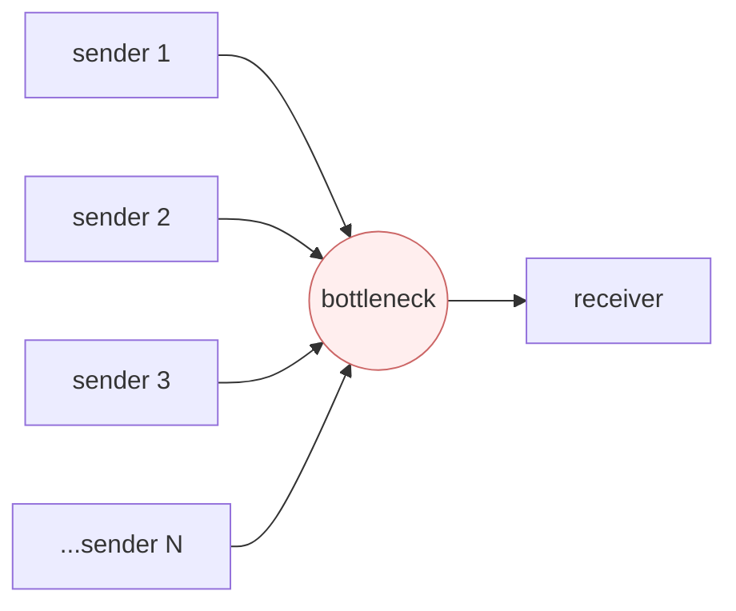
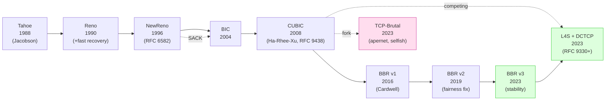
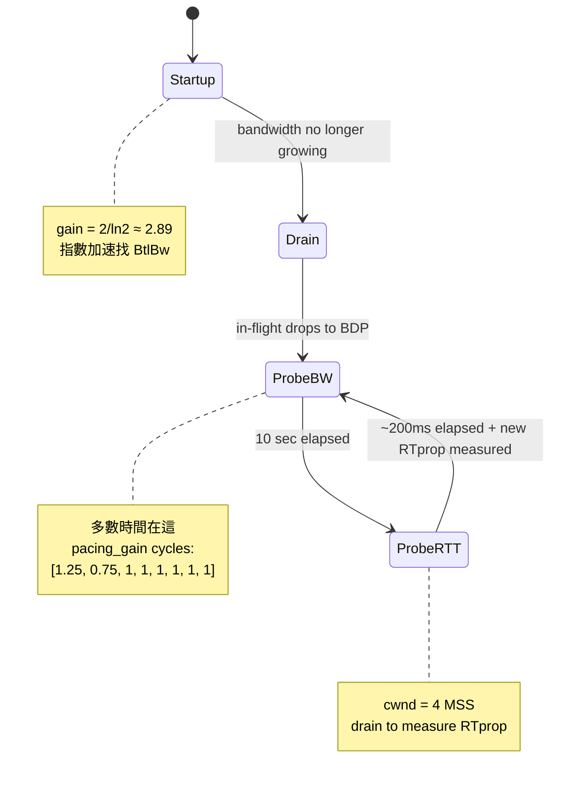

# 課堂 1.10 — TCP 完整解剖（三）：擁塞控制

## 學前知道

- **前置課**：[1.8 TCP 連線管理](./1.8-tcp-connection-mgmt.md)、[1.9 TCP 可靠傳輸](./1.9-tcp-reliable-delivery.md)（RTT estimator 與 fast retransmit）
- **預計閱讀時間**：55~70 分鐘（本堂與 1.9 並列 Part 1 最重）
- **必讀規格 / 論文**：
  - **Jacobson — Congestion Avoidance and Control** (SIGCOMM '88) ⭐ — congestion control 奠基（[precis](../../notes/papers/jacobson-congestion-avoidance.md)）
  - **Chiu & Jain — Analysis of the Increase and Decrease Algorithms for Congestion Avoidance in Computer Networks** (Computer Networks and ISDN Systems, 1989) ⭐ — AIMD optimality 證明
  - **Floyd & Jacobson — Random Early Detection (RED)** (IEEE/ACM TNET 1993) — active queue management 奠基
  - **Ha, Rhee, Xu — CUBIC: A New TCP-Friendly High-Speed TCP Variant** (ACM SIGOPS OSR 2008) ⭐ — RFC 8312 / 9438 標準
  - **RFC 9438 — CUBIC for Fast and Long-Distance Networks** (Xu, Ha, Rhee, Le, Fairhurst, Belshe, 2023) — RFC 8312 update
  - **Cardwell, Cheng, Gunn, Hassas-Yeganeh, Jacobson — BBR: Congestion-Based Congestion Control** (ACM Queue 2016 / CACM 2017) ⭐ — paradigm shift
  - **Cardwell, Cheng, Hassas-Yeganeh, Swett, Vasiliev, Jha, Seung, Mathis, Jacobson — BBR v2: A Model-based Congestion Control** (ICCRG IETF 104, 2019) + **BBRv3 IETF 117 draft** (2023)
  - **RFC 3168 — The Addition of Explicit Congestion Notification (ECN) to IP** (Ramakrishnan, Floyd, Black, 2001)
  - **RFC 8087 — The Benefits of Using Explicit Congestion Notification (ECN)** (Fairhurst, Welzl, 2017)
  - **RFC 9330 / 9331 / 9332 — L4S (Low Latency, Low Loss, Scalable Throughput) Architecture** (De Schepper, Briscoe et al., 2023)
  - **Padhye, Firoiu, Towsley, Kurose — Modeling TCP Throughput** (SIGCOMM '98)
  - **Mathis, Semke, Mahdavi, Ott — The Macroscopic Behavior of the TCP Congestion Avoidance Algorithm** (CCR 1997)
  - **Mishra et al. — The Great Internet TCP Congestion Control Census** (SIGMETRICS 2020) — 部署實況量測
  - **Ware et al. — Modeling BBR's Interactions with Loss-Based Congestion Control** (IMC 2019) — BBR fairness 量化
  - **Hysteria TCP-Brutal documentation** (apernet, 2023) — 「自私」CC 工程實踐
  - **Yan, Yang, Mahdian, Anderson, Krishnamurthy — Pantheon: A Diverse Internet Benchmarking Platform for TCP Variants** (USENIX ATC 2018) — CC variant 比較 framework
  - **Winstein, Sivaraman, Balakrishnan — Stochastic Forecasts Achieve High Throughput and Low Delay over Cellular Networks** (NSDI 2013) — Sprout / Remy 起源
- **必讀原始碼**：
  - Linux `net/ipv4/tcp_cubic.c`、`net/ipv4/tcp_bbr.c`、`net/ipv4/tcp_bbr2.c`（部分 distro）
  - Hysteria 與 TCP-Brutal source <https://github.com/apernet/tcp-brutal>
  - quiche/quinn 的 CUBIC + BBR 實作

---

## 動機

擁塞控制（Congestion Control, CC）是 G6 設計**單一最關鍵**的選擇。為什麼：

1. **CC 直接決定 throughput**：在 high-BDP（衛星、Trans-Pacific、5G mmWave）與 high-loss link（中國對外、CGN、WiFi 邊緣）兩個極端，CC 算法的差異可達 **10-100×**。Cardwell 2017 BBR 論文 demonstration：對 high-BDP link，BBR 比 CUBIC **2~25× 快**；對 receiver buffer 不限制場景**133×**
2. **CC 決定 fairness**：與其他 internet flow 共享頻寬時，CC 是否「**搶**」？若 G6 對其他流量過度 unfair，部署到 production 時 ISP 可能 throttle、host server 可能 abuse-complaint
3. **Hysteria Brutal 的「自私」CC 是當代翻牆協議 SOTA throughput 的祕密**：放棄 fairness 換 throughput——**這個 trade-off 對 G6 是 ethical & technical 雙重決策**
4. **BBR 自身已演化三代**（BBR / BBRv2 / BBRv3）——每代修補前一版的 fairness、loss tolerance、coexistence 問題。**理解這個 evolution = 理解 modern CC 的 frontier**
5. **L4S（RFC 9330+, 2023）是 IETF 未來方向**：搭配 ECN++ + scalable CC（如 DCTCP）達成 sub-ms queueing delay——**G6 若想躋身「2030 SOTA」必須 evaluate L4S 整合**
6. **AIMD 最優性（Chiu-Jain 1989）是 distributed system 經典證明**：在 fairness + efficiency 兩個目標下，AIMD 是 distributed sender 共享 bottleneck 的**最優演算法**。**這個證明是 distributed algorithm 教學寶藏**——同 Perlman 1985 STP、Jacobson 1988

教科書講 TCP CC 的問題：講 Tahoe/Reno 那套 1990 演化就停，不講 CUBIC 之後 20 年新發展（BBR 系列、L4S、ML-tuned CC）；不講 Hysteria 等「self-congestion」設計為何能 work；不評 fairness vs throughput 的 ethical trade-off。本堂從 BBR paradigm shift 切入 + 比較分析 Brutal 的設計取捨。

---

## 核心概念

### 1. 為什麼需要 CC（congestion collapse 的工程意義）



若所有 sender **無 CC** 直接送：
- bottleneck queue 永久滿
- packet drop rate 高
- retx 又加重 queue
- 整體 goodput → 0（即使 link bandwidth 沒變）

**這就是 1986 internet collapse**：LBL → UCB 從 32 Kbps 跌到 40 bps（[Jacobson precis](../../notes/papers/jacobson-congestion-avoidance.md)）。

⇒ CC 的核心問題：**多 sender 在共享 bottleneck 上自治決定速率，達到 (1) high utilization 與 (2) fair allocation 與 (3) low queueing delay 三者平衡**。

### 2. AIMD 與 Chiu-Jain 1989 最優性證明 ⭐

#### 2.1 為什麼 AIMD（不是 AIAD、MIAD、MIMD）

設 N 個 sender 共享 bottleneck capacity C。每個 sender 有自己 rate r_i。
理想狀態：∑ r_i = C 且 r_i = C/N（fair）。

Chiu-Jain 1989 在「**僅 binary feedback（congestion / no-congestion）**」假設下：

| 策略 | 增 | 減 | 結果 |
|---|---|---|---|
| **AIAD** (Additive Inc, Additive Dec) | +α | -α | 振盪，**不收斂** |
| **MIMD** (Mult-mult) | ×k | /k | 不公平（rate 比例不變） |
| **MIAD** (Mult-add) | ×k | -α | 也不收斂 |
| **AIMD** | +α | ×β (β<1) | **公平 + 高效率** ⭐ |

**證明草稿**：
- 在 (r_1, r_2) 二維平面畫 fairness line `r_1 = r_2` 與 efficiency line `r_1 + r_2 = C`
- AIMD：congestion 時兩者乘相同 β → 點往 origin 對角向；no-congestion 時兩者加相同 α → 點 45° 向上
- ⇒ 軌跡**收斂到 fairness line 與 efficiency line 交點**——fair efficient point

#### 2.2 對 G6 設計的意義

**只要 G6 與其他 internet flow 共存（不獨佔 link），AIMD-derived CC 是 fair sharing 唯一保證**。任何 non-AIMD（如 Hysteria Brutal）必須**明確 acknowledge** 它放棄了 Chiu-Jain fairness。

### 3. TCP CC 30 年演化線



#### 3.1 Tahoe / Reno / NewReno（1988-1996）

**Tahoe（1988）**：slow start + congestion avoidance + fast retransmit；無 fast recovery（loss → cwnd 直接回 1）
**Reno（1990）**：加 fast recovery（loss → cwnd 縮半，不回 1）
**NewReno（RFC 6582）**：修補 Reno 對 multiple loss 的反應 bug——partial ACK 視為 still in recovery

**核心問題**：3 個 variant 都是 **loss-based**——把 packet loss **等同** congestion 信號。**對 random loss link（WiFi、cellular、衛星）反應過度**。

#### 3.2 CUBIC（Ha-Rhee-Xu 2008, RFC 9438）⭐

**問題**：在 high-BDP link，Reno cwnd 每 RTT 加 1 MSS——10 Gbps × 100ms RTT BDP = 125 MB cwnd——需 ~125K RTT = ~3 小時才達飽和。**不可接受**。

**CUBIC 核心想法**：cwnd 增長以**最後一次 loss 為原點的三次函數**：

```
W(t) = C × (t - K)^3 + W_max

其中:
  W_max = loss 發生時的 cwnd
  K = (W_max × β / C)^(1/3)
  β = 0.7 (CUBIC default backoff)
  C = 0.4 (CUBIC scaling constant)
```

特性：
- 接近 W_max 時增長**慢**（凹形，謹慎）
- 遠離 W_max 時增長**快**（凸形，積極）
- 對 RTT **不敏感**——同一 path 不同 RTT 的流獲得**接近平等**頻寬
- **default 從 Linux 2.6.19 (2006) 起**——**今天 80%+ Linux server / Android 用 CUBIC**

#### 3.3 為何 CUBIC 仍是 **loss-based**

CUBIC 改進的是 cwnd **增長函數**，但仍**依賴 packet loss 觸發縮窗**——loss = congestion 假設不變。

在 **bufferbloat** 環境（大 buffer router 持續累積但不丟）→ CUBIC 把 RTT 推到極高（>1 sec）才縮窗——**latency 災難**。
在 **lossy link**（WiFi、cellular，loss 來自 wireless 而非 congestion）→ CUBIC 過度縮窗——**throughput 災難**。

⇒ **2010s 後期需要 paradigm shift**——這推動 BBR。

### 4. BBR: 從 loss-based 到 model-based ⭐ ⭐

#### 4.1 BBR 核心理論：兩個 path constraint

Cardwell 2017 paper 的核心 insight：path 由兩個 parameter 完全描述：
- **BtlBw (Bottleneck Bandwidth)**：path 最窄處的 throughput 上限
- **RTprop (Round-Trip Propagation Time)**：path 的純物理 RTT（無 queue 延遲）

**最佳操作點**：sending rate = BtlBw，in-flight data = BDP = BtlBw × RTprop。
此時 **bottleneck 100% 利用 + queue ~0 + RTT ≈ RTprop**——同時達 high throughput 與 low latency。

#### 4.2 Uncertainty principle of measurement

BBR 的測量問題：**BtlBw 與 RTprop 不能同時量**：
- 要量 BtlBw 必須**填滿 pipe**（加 in-flight）—— 但這時候 queue 形成 → RTT > RTprop → 量不到 RTprop
- 要量 RTprop 必須**讓 pipe 空**（少 in-flight）—— 但這時候沒 saturate → 量不到 BtlBw

⇒ BBR 設計**交替**量兩個 parameter：
- 大部分時間穩定在 cwnd = BDP, pacing = BtlBw（**ProbeBW** state）
- 週期性 spike pacing_gain to 1.25 探測 BtlBw 增加
- 週期性 drain to ~0 in-flight 量 RTprop（**ProbeRTT** state）

#### 4.3 BBR state machine



#### 4.4 BBR 部署現實

- **Linux 4.9 (2016) 起 mainline**
- **Google B4 WAN、YouTube 全面 BBR**
- 報告：**throughput +2~25× vs CUBIC**；**RTT global median -53%**、developing world -80%
- 但 **fairness 問題嚴重**：Ware et al. 2019 IMC 量測——BBR 單流與 16 個 CUBIC 共存時占 **40% 頻寬**（公平應該 ~6%）

#### 4.5 BBRv2（2019）/ BBRv3（2023）

修補 BBRv1 的 fairness 與 loss tolerance：
- **加 ECN signal 作為 secondary congestion indicator**（BBRv1 純 model-based, BBRv2 半 model 半 ECN）
- **加 loss-rate cap**（loss > 2% → 縮 BtlBw 估計）
- **改 ProbeRTT 頻率**——減少對 latency 的 inconsistency

**BBRv3 (2023)**：進一步 fairness 改進 + LRO offload friendly + 更穩定的 cwnd 動態。
**Linux kernel 6.x+ 部分 distro 已 carry**，但 mainline 主流仍 BBRv1。

### 5. Hysteria Brutal：自私 CC 的工程實踐 ⭐

#### 5.1 Brutal 想法

**前提**：user **預先知道**自己 link 的 bandwidth（如「我家是 500 Mbps 下載」）。
**演算法**：
- 維持固定 sending rate（user 設定值，如 500 Mbps）
- **不**因 loss 縮速、**不**因 RTT 漲縮速
- 若實際 throughput < 設定值，**根據 loss rate 補償加速**：
  ```
  effective_rate = configured_rate / (1 - loss_rate)
  ```

#### 5.2 為什麼 work

**在 lossy link 上**（特別中國對外的 lossy international link）：
- CUBIC / BBR 看到 loss → 縮窗 → throughput 暴跌
- Brutal 看到 loss → 假設 loss 是 link 物理損耗（非 congestion）→ **反而加速** 補償

**結果**：在中國對 VPS 的 lossy path 上，**Brutal throughput 比 BBR 高 5-10×**——這是 Hysteria/Hysteria2 的核心競爭力。

#### 5.3 代價：fairness 完全放棄

Brutal **不 yield to 其他 flow**——把 link 當自己一個人的。對共網其他用戶：
- 你的 Brutal 流量強行佔 fair share 之外
- 鄰居的 CUBIC / BBR 流量被擠到 backoff
- 對 ISP 是「**ill-behaved flow**」——可能被 deep packet inspection 識別並 throttle

#### 5.4 為什麼可接受（在翻牆場景）

- 翻牆 user 在 lossy international link 上**本來就 throughput 差**——非自私 CC 等於放棄
- 翻牆流量在 link 上 minority（多數流量是國內 traffic）——self-congestion 影響有限
- 用戶**明知 trade-off**——這不是欺騙

#### 5.5 對 G6 的具體建議

| 場景 | CC 選擇 |
|---|---|
| **預設 / 普通家用** | CUBIC（fair, robust） |
| **lossy international link 用戶（有預設 bandwidth）** | Brutal-style，作為 **opt-in option** |
| **高 BDP 衛星 / Starlink** | BBR v3 |
| **共享頻寬 / 多 user** | BBR v3 with ECN |

**G6 baseline 設計**：CC 必須**可插拔**（pluggable）——不同 deployment 場景用不同 CC。server side 可以 hint client 選擇，client 可以 override。

### 6. ECN（RFC 3168）與 L4S（RFC 9330+）

#### 6.1 ECN 想法

**Loss = congestion 信號**這個假設浪費頻寬。**ECN（Explicit Congestion Notification）**：congestion 來臨時 router **mark packet 而非 drop**——sender 看 mark 縮窗，**避免 drop**。

```
IP header ECN field (2 bit):
00 = Non-ECT (不參與)
01 = ECT(1)
10 = ECT(0)
11 = CE (Congestion Experienced, 被 router mark)

TCP ECN-related flags:
ECE (ECN Echo) - receiver 通知 sender「我看到 CE mark」
CWR (Congestion Window Reduced) - sender 通知「我已縮窗」
```

**部署現實**：~20-50% public web servers support ECN (2024)。但**很多中間 box 仍 mangle ECN bit**——deployment 慢。

#### 6.2 L4S（Low Latency, Low Loss, Scalable Throughput）

**RFC 9330 / 9331 / 9332 (2023)**：把 ECN 升級到「**fine-grained**」——router queue 剛開始累積就 mark；endpoint CC 用此 fine-grained signal **avoid loss 同時 keep low queueing**。

**搭配 scalable CC**（如 DCTCP、Prague——專為 fine-grained ECN 設計）：
- queueing delay **< 1ms**
- throughput **接近 link capacity**
- loss rate **接近 0**

**部署**：Comcast、Apple iOS 17+、L4S testbed in 多 ISP。**G6 v2 可能 evaluate 整合**。

### 7. The Great Internet TCP CC Census (Mishra 2020)

SIGMETRICS 2020 量測：
- **Linux server 部署 CUBIC**：65%
- **Linux server 部署 BBR**：23%
- **其他**（Reno、HTCP、Compound、CDG、etc.）：12%
- **iOS / macOS**：CUBIC + 內部 modifications
- **Windows**：Compound TCP（CUBIC + delay-based hybrid）
- **網站 server-side 看 client**：~70% CUBIC，BBR 比例增長中

⇒ **2026 mainstream = CUBIC + BBR 並存**，少數 specialized deployment（Hysteria、Pantheon-tested CC）。

---

## 與我們協議設計的關聯

| 設計面 | CC 知識的影響 |
|---|---|
| **11.4 主架構** | CC 必須 pluggable，不 hard-code 單一 algorithm |
| **11.5 packet format** | 必須保留 timing metadata（pacing-friendly），但對 GFW 不洩漏「我是高速 CC」signature |
| **12.4 data path** | 預設 BBR v3 / fallback CUBIC；opt-in Brutal-style；evaluate L4S |
| **12.5 流量整形** | pacing 是必要（all modern CC 都依賴 pacing）；jitter 對抗 fingerprint |
| **12.12 throughput 評測** | 必測 normal / high-BDP / lossy / mixed-flow 四種場景 |
| **12.13 高丟包鏈路** | 對 lossy international link 必有 Brutal-style fallback 否則 throughput 不可用 |
| **9.x GFW 對抗** | CC pattern 是流量指紋特徵——CUBIC / BBR / Brutal 各有 distinct signature；G6 必須 consider |

### G6 CC 設計矩陣

```yaml
congestion_control:
  default: bbrv3
  fallback: cubic
  available:
    - cubic           # safe default, fair
    - bbrv1
    - bbrv2
    - bbrv3           # 2026 SOTA
    - brutal          # opt-in, requires user-specified bandwidth
    - l4s-prague      # experimental, requires ECN++ network support
  pacing: mandatory
  ecn: enabled-by-default
  jitter_for_fingerprint_evasion: configurable
  selection_signaling:
    method: encrypted_application_message
    visible_to_middlebox: false  # CC choice 不暴露
```

---

## 動手（40 分鐘）

### 任務 1（5 min）：看自己 Linux 當前 CC

```bash
orb -m debian
# 看 default
sysctl net.ipv4.tcp_congestion_control

# 看所有可用 CC
sysctl net.ipv4.tcp_available_congestion_control

# 切換到 BBR
sudo modprobe tcp_bbr
sudo sysctl -w net.ipv4.tcp_congestion_control=bbr
sudo sysctl -w net.core.default_qdisc=fq      # BBR 需要 fq pacing
```

### 任務 2（10 min）：對比 CUBIC vs BBR 在 high-loss 場景

```bash
# 加 5% loss
sudo tc qdisc add dev eth0 root netem loss 5%

# 用 CUBIC
sudo sysctl -w net.ipv4.tcp_congestion_control=cubic
time curl -o /dev/null https://cachefly.cachefly.net/100mb.test

# 用 BBR
sudo sysctl -w net.ipv4.tcp_congestion_control=bbr
time curl -o /dev/null https://cachefly.cachefly.net/100mb.test

sudo tc qdisc del dev eth0 root
```

### 任務 3（10 min）：實際 BBR state 觀察

```bash
sudo sysctl -w net.ipv4.tcp_congestion_control=bbr
curl -o /dev/null https://cachefly.cachefly.net/100mb.test &
sleep 2

# ss 看 BBR internal state
ss -tinm | head

# 看 bbr 的 BtlBw、RTprop、cwnd
ss -tin --info | grep -A 1 bbr
```

### 任務 4（10 min）：安裝並試 TCP-Brutal（高級）

```bash
# 在 VM 內安裝 TCP-Brutal kernel module（需要 kernel headers）
orb -m debian
sudo apt update
sudo apt install -y build-essential linux-headers-$(uname -r) git
git clone https://github.com/apernet/tcp-brutal.git
cd tcp-brutal
make && sudo make install
sudo modprobe brutal

# 應用層 set
# (需要寫 program 用 setsockopt(TCP_CONGESTION, "brutal")，或用 socat/iperf3 patched 版)
```

注意：**只在你自己 VPS / VM** 試，不要在公網對 production 連線 abuse。

### 任務 5（5 min）：理論計算

對 path: BDP = 10 Gbps × 100 ms = 125 MB。問：
- CUBIC 從 1 MSS 慢起到 cwnd = 125 MB（~80K segments）需要多少 RTT？（提示：CUBIC 公式 W(t)）
- BBR Startup（gain = 2/ln2）需要多少 RTT？
- 對應 throughput rampup time 各幾秒？

---

## 自我檢查

1. Chiu-Jain 1989 為什麼 AIMD 是 distributed fairness 的最優策略？AIAD / MIMD / MIAD 各失敗在哪？
2. CUBIC 改善 Reno 的什麼？為什麼仍是 loss-based？loss-based 在哪兩個場景嚴重失效？
3. BBR 的「**兩 parameter**」是什麼？「**uncertainty principle of measurement**」具體指什麼？BBR state machine 怎麼處理這個？
4. BBR 為何在多流共存時占額外份額？BBRv2/v3 怎麼修補？
5. Hysteria Brutal 為什麼能在 lossy international link 上比 BBR 快 5-10×？這個 trade-off 在「fairness」維度付出什麼代價？
6. ECN 與 L4S 的關係是？L4S 為何承諾 sub-ms queueing delay？對 G6 v2 是 opportunity 還是過早採用？
7. G6 baseline 選哪個 CC？為什麼不直接走 Brutal-style 拿最快 throughput？

---

## 延伸閱讀

- **Cardwell 2017 BBR CACM 全文** — 必精讀
- **Ha-Rhee-Xu 2008 CUBIC 全文** — RFC 9438 codify
- **Chiu-Jain 1989 paper** — AIMD 證明
- **Pantheon project (Yan 2018 USENIX ATC)** — 系統 CC 評測 framework
- **Linux net/ipv4/tcp_bbr.c** — 唯一 reference implementation
- **APNIC blog (Geoff Huston) BBR / CUBIC 系列** — 工業視角
- **Hysteria documentation + GitHub issues** — Brutal 工程實踐
- **IETF tcpm WG meetings** — CC 標準演化

---

## 研究級補遺

### 1. 學界詞彙

- **AIMD / AIAD / MIMD / MIAD** (Chiu-Jain 1989)
- **cwnd (Congestion Window)** / **rwnd (Receive Window)** / **ssthresh**
- **slow start / congestion avoidance / fast retransmit / fast recovery**
- **bufferbloat** (Gettys 2011)
- **BtlBw / RTprop / BDP** (BBR terminology)
- **pacing**：均勻分散 packet 發送，避免 burst
- **fq (fair queueing)** Linux qdisc，BBR 必需
- **scalable CC** vs **classic CC** (L4S 術語)
- **DCTCP (Data Center TCP)** — fine-grained ECN 用 CC
- **Prague** — L4S 的 internet 通用 CC（DCTCP 親戚）
- **Copa, PCC, Indigo, Vivace** — 學術 CC variants
- **Power-of-2 fairness**：在 RTT 比 1:2 時 throughput 比例
- **BBR.Pacing_gain cycle** [1.25, 0.75, 1, 1, 1, 1, 1, 1]
- **ProbeBW / ProbeRTT / Startup / Drain** (BBR states)
- **Mathis equation**：throughput ≈ MSS × C / (RTT × √p)
- **TCP throughput equation** (Padhye 1998)：含 RTO contribution 完整版
- **Friendly vs Unfriendly to AIMD**
- **CDG (CAIA Delay Gradient)**, **TCP Vegas**, **Westwood**, **Compound TCP**——其他 CC variants
- **Hystart / Hystart++** — slow start 終止改進
- **HyStart++** in RFC 9406

### 2. 對手分類學

| 對手 | 對 CC 行為的能力 |
|---|---|
| **fair other-flow（CUBIC/BBR neighbor）** | 共享 link；非對抗——但需 fair |
| **selfish other-flow（Brutal/aggressive）** | 強搶 link share；G6 用 Brutal 也加入此 category |
| **router-side AQM (RED/CoDel/PIE)** | 主動 drop / mark 達 fair queueing；對 BBR 影響大 |
| **ISP throttle**（特定 protocol / size pattern） | 識別 G6 後 rate-limit；對 CC pattern 為 fingerprint |
| **GFW selective drop** | 不純 congestion——CC 反應錯誤；Brutal 可緩解 |
| **MITM with bandwidth shaping** | 模擬擁塞改 CC 行為——可用作 covert channel detection |

### 3. 形式化定義

#### 3.1 AIMD 收斂性（Chiu-Jain 1989）

設 N sender 用 AIMD: r_i(t+1) = r_i(t) + α 在 no-congestion，r_i(t+1) = β × r_i(t) (β<1) 在 congestion。
定義 fairness metric F(r) = (∑r_i)² / (N × ∑r_i²)（Jain's fairness index ∈ [1/N, 1]）。

**Theorem**：在 N-flow shared bottleneck 下，AIMD 動態系統的 fixed point 滿足 F → 1（perfect fairness），且 ∑r_i → C（full utilization）。
**Proof sketch**：congestion 觸發時所有 r_i × β → fairness index 不變（同比例縮）；no-congestion 加 α → fairness index 朝 1 移動。Lyapunov function 證收斂。

#### 3.2 BBR 操作點最優性

設 path 模型：
- 物理 RTT = RTprop = constant
- bottleneck rate = BtlBw = constant
- queue = max(0, in-flight - BDP)
- actual RTT = RTprop + queue / BtlBw

**Throughput = min(sending_rate, BtlBw - queue_drop_rate × BtlBw)**。
**Loss-free condition**：queue ≤ buffer_size。

**最佳操作點**：in-flight = BDP，sending_rate = BtlBw → utilization = 100%, queue = 0, RTT = RTprop。

BBR 動態收斂到此點（在 RTprop 與 BtlBw 量測誤差容許下）。

#### 3.3 Brutal 的不收斂性

Brutal 固定 sending_rate = R（user-set）。若 R > fair share：
- BBR/CUBIC 鄰居流量持續被擠 → fairness index → 0
- 系統不收斂到 fair point
- **Brutal 明確接受此 trade-off**

⇒ Brutal 違反 Chiu-Jain optimality。**這是 conscious choice 而非 bug**。

#### 3.4 Loss-based vs Model-based CC 的形式化區別

- **Loss-based**（CUBIC、Reno）：control signal = packet loss event。Reactive。
- **Model-based**（BBR）：control signal = bandwidth/RTT measurement。Proactive。
- **Delay-based**（Vegas、Copa）：control signal = RTT change。Proactive but RTT-fragile。
- **Hybrid（BBRv2+）**：multiple signals (model + ECN + loss)。

### 4. 必追論文 / 規格

- ✅ **Jacobson 1988 SIGCOMM** ⭐
- ✅ **Chiu-Jain 1989** ⭐
- ✅ **Ha-Rhee-Xu 2008 CUBIC** + **RFC 9438**
- ✅ **Cardwell 2017 BBR CACM** ⭐
- ✅ **BBRv2 / v3 IETF drafts**
- ✅ **Mishra 2020 SIGMETRICS** — CC census
- ✅ **Ware 2019 IMC** — BBR fairness 量化
- ✅ **L4S RFC 9330 / 9331 / 9332**
- **Mathis 1997 Macroscopic behavior**
- **Padhye 1998 SIGCOMM TCP throughput**
- **Winstein 2013 NSDI Sprout** — cellular CC
- **Yan 2018 USENIX ATC Pantheon** — CC benchmark
- **Hock et al. 2017 *Experimental Evaluation of BBR Congestion Control***
- **Kakhki et al. 2018 *Taking a long look at QUIC***（IMC） — QUIC vs TCP in production

### 5. 我們協議的座標 / 設計取捨

| 設計面 | CC 知識影響 |
|---|---|
| **default CC** | BBR v3 if available else CUBIC |
| **opt-in selfish mode** | Brutal-style，需 user 明確啟用 + 設定 bandwidth |
| **CC 對 fingerprint 影響** | 不同 CC 的 packet pacing pattern distinct——研究 GFW 是否用此做 detection |
| **多 CC 共存策略** | client / server 各自配置，透過 control plane 協調 |
| **L4S 整合** | v2 evaluate；需要 ECN-enabled network |
| **fairness ethics** | G6 spec 必須明確 default behavior + warning for selfish mode |
| **pacing** | mandatory；fq qdisc on server-side |

### 6. 必追資源

- **IETF tcpm / iccrg WG** — CC 標準
- **Linux netdev mailing list** — kernel CC 演化
- **Google networking research** — BBR 系列產出者
- **Pantheon project / Stanford networking** — academic benchmark
- **APNIC blog** — production deployment insight
- **Hysteria GitHub + community** — selfish CC 工程實踐
- **CoNEXT / IMC / NSDI / SIGCOMM proceedings** — CC research 一線

### 7. 開放問題

- **AI-tuned CC 何時 production-ready**：Indigo、Aurora、Pantheon trained variants 仍 lab-stage
- **L4S 部署速度**：ISP / OS / app 三方協調慢——是否會像 IPv6 一樣 10+ 年才主流？
- **後量子 CC signaling**：ECN signal 是 cleartext bit；若 path validation 需 PQ-secure，整合難
- **跨 multipath 的 CC coordination**：MPTCP / multipath QUIC 不同 subflow CC 互動仍 open
- **adversarial environment 下的 CC fingerprint resistance**：Brutal 是否成為 GFW 識別特徵？open measurement
- **CC 與 streaming codec adaptive bitrate 的耦合**：DASH/HLS 各自做 adaptive，與 CC 互動 sub-optimal
- **DC-WAN-mobile 三段不同 link 的統一 CC**：仍無 single algorithm dominate 所有 case
- **ECN 部署的最後一哩**：home router 大量不傳 ECN bit——L4S 將如何處理？

---

下一堂：**1.11 TCP 進階話題**——TCP Offload Engine / TSO/GSO/USO、Multipath TCP、TCP-AO 取代 TCP-MD5；對應 G6 multipath 與 offload 取捨。
