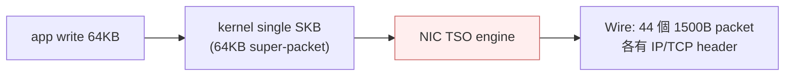
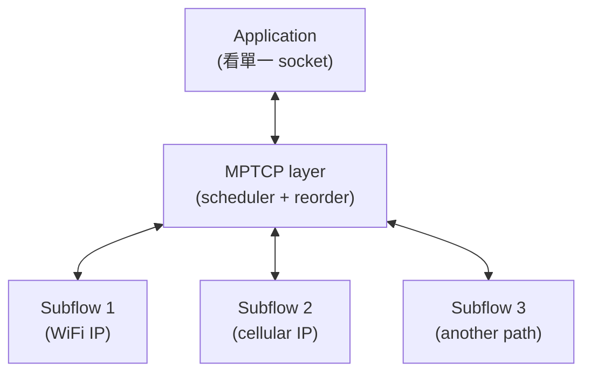

# 課堂 1.11 — TCP 進階話題

## 學前知道

- **前置課**：[1.2 PHY/MAC](./1.2-physical-and-phy-mac.md)（offload 物理基礎）、[1.8](./1.8-tcp-connection-mgmt.md) / [1.9](./1.9-tcp-reliable-delivery.md) / [1.10](./1.10-tcp-congestion-control.md) TCP 三堂
- **預計閱讀時間**：35~45 分鐘
- **必讀規格 / 論文**：
  - **RFC 8684 — TCP Extensions for Multipath Operation with Multiple Addresses (MPTCP v1)** (Ford, Raiciu, Handley, Bonaventure, Paasch, 2020) ⭐ — 取代 RFC 6824 v0
  - **RFC 6824 — TCP Extensions for Multipath Operation (MPTCP v0)** (2013) — 歷史 reference
  - **RFC 6356 — Coupled Congestion Control for Multipath Transport Protocols** (Raiciu, Handley, Wischik, 2011) — MPTCP fairness
  - **RFC 6182 — Architectural Guidelines for Multipath TCP Development** (Ford et al., 2011)
  - **RFC 6181 — Threat Analysis for TCP Extensions for Multipath Operation** (Bagnulo, 2011)
  - **RFC 5925 — The TCP Authentication Option (TCP-AO)** (Touch, Mankin, Bonica, 2010) ⭐ — 取代 RFC 2385 TCP-MD5
  - **RFC 5926 — Cryptographic Algorithms for the TCP Authentication Option** (Lebovitz & Rescorla, 2010)
  - **RFC 2385 — Protection of BGP Sessions via the TCP MD5 Signature Option** (Heffernan, 1998) ⚠️ legacy
  - **RFC 7323 — TCP Extensions for High Performance** (Borman et al., 2014) — Window Scale / Timestamps / PAWS
  - **Raiciu, Wischik, Handley — Practical Congestion Control for Multipath Transport Protocols** (UCL TR 2009)
  - **Paasch, Khalili, Bonaventure — On the Benefits of Applying Experimental Design to Improve Multipath TCP** (CoNEXT 2013)
  - **Singh, Khalili, Bonaventure — Performance Analysis of MPTCP** (CoNEXT 2017)
  - **Apple iOS MPTCP whitepaper** (Apple Developer)
  - **Mogul 1997 + Rizzo 2012 + Neugebauer 2018**（已在 [1.2 PHY/MAC precis](../../notes/papers/) 系列）：NIC offload 工程基礎
- **必讀原始碼**：
  - Linux `net/ipv4/tcp_offload.c`、`net/core/dev.c`（GSO/GRO 整合）
  - Linux `net/mptcp/`（MPTCP v1 kernel 實作，5.6+）
  - Linux `net/tcp_md5sig.c` / `net/tcp_ao.c`（如有）
  - FreeBSD `sys/netinet/tcp_subr.c` 內 TCP-AO 部分

---

## 動機

本堂三個主題看似不相關，但**對 G6 都是 first-order 決策**：

1. **TCP/UDP offload**（TSO/GSO/USO/GRO/LRO/RSS）—— 直接決定 G6 server 能否跑滿 1Gbps+ throughput。理解 offload 才知道「why wireshark 抓到 65535 byte packet 但 wire 上是 1500 byte」這個常見困惑
2. **MPTCP** —— 多路徑傳輸的 reference design。**G6 v2 若考慮 multipath QUIC（IETF 在制定）**，MPTCP 是必須先精通的前作；MPTCP 也是 Apple Siri / Korea Telecom 已部署的 production technology
3. **TCP-AO** —— TCP-level authentication，BGP / LDP / RPKI sessions 用。**G6 若有 control plane over TCP 必須懂 TCP-AO**，且 TCP-MD5 是 BGP 老 server 仍跑的 legacy，了解其 deprecation 是必要

教科書講這三個的問題：
- offload 只在「**NIC feature**」名目下一筆帶過——不講對流量分析的影響
- MPTCP 多數教科書略過——卻是 modern mobile 與 multi-link DC 的 production 技術
- TCP-AO 幾乎只 BGP 圈知道——但對任何 long-lived TCP connection（包括 G6 control channel）都直接適用

本堂從 G6 設計視角切入，深度展開三個主題的工程現實 + 攻防面。

---

## 核心概念

### 1. TCP/UDP Offload 三件套

#### 1.1 TSO（TCP Segmentation Offload）

**Application** 寫 64 KB 到 socket → **kernel** 把它打包成單一 super-packet → **NIC** 自己切成多個 MTU-size segment 送出。



**收穫**：
- Kernel CPU 處理 1 個 SKB 取代 44 個——**reduce CPU 20-50%**
- Cache footprint 降低
- 達到 line rate 友善

**現實**：
- Wireshark 抓在 kernel-NIC 介面 → 看到 super-packet
- Real wire 上 packet 數 ≠ kernel 看到的 packet 數
- **這就是「我抓包看到 65535 byte packet 但 MTU 是 1500」的根因**

#### 1.2 GSO（Generic Segmentation Offload）

當 NIC **不**支援 TSO（軟體 NIC、舊 hardware、bridging 場景），**kernel** 自己做 segmentation——**software TSO**。

差別：
- TSO：NIC hardware 切
- GSO：kernel software 切（但仍延遲到「**最後一刻**」才切，省 CPU 比立即切快）

```bash
# 看自己 NIC offload 狀態
ethtool -k eth0 | grep -E "tcp-segmentation|generic-segmentation|tx-tcp-segmentation"
```

#### 1.3 USO（UDP Segmentation Offload）

**QUIC 推動的 feature**——以前 UDP 無 segmentation offload（每 UDP packet 各自寫 socket），CPU cost 高。

USO（Linux 4.18+ for IPv4, Windows 2019+）：app 寫一個 large UDP gather，NIC 自己切。**對 QUIC throughput 影響極大**：
- 無 USO：QUIC throughput limited by syscall rate, ~1 Gbps single core
- 有 USO：QUIC throughput 達 10+ Gbps single core

**G6 baseline = QUIC = 必須 enable USO** for production server。

#### 1.4 GRO / LRO（Receive 端 offload）

**GRO（Generic Receive Offload）**：kernel 把多個 small inbound packet 合併成一個 super-packet 給 app——reduce 接收側 CPU。
**LRO（Large Receive Offload）**：硬體版（NIC 合併）；對 forwarder 場景**問題大**（packet 邊界丟失），多數 router OS disable。

#### 1.5 RSS（Receive Side Scaling）

**多 core 平行**收 packet：NIC 用 5-tuple hash 把 packet 分到不同 RX queue → 不同 CPU core 處理。

```
hash = toeplitz(src_ip, dst_ip, src_port, dst_port, proto)
target_queue = hash mod num_rx_queues
```

**對 G6 server**：default RSS 用 5-tuple → 同 flow 同 core——cache friendly。
**對 G6 multipath（v2）**：不同 subflow 不同 5-tuple → 不同 core → 可選擇是否 align with application-level scheduling。

#### 1.6 對 G6 設計的具體 implications

| Offload | G6 設計影響 |
|---|---|
| **USO** | QUIC server 必須測試 USO enabled vs not，量化 throughput delta |
| **GRO** | G6 server receive path 應 evaluate enabling GRO for QUIC |
| **TSO/GSO** | G6-over-TCP fallback 需要 |
| **RSS hash** | flow 設計時考慮 5-tuple entropy，確保好 distribution |
| **LRO** | server 端建議 disable，邊界明確 |
| **AQM (fq/fq_codel)** | mandatory for BBR-style pacing |

### 2. MPTCP（RFC 8684, 2020）⭐

#### 2.1 動機

modern device 有多 network interface：
- 手機：WiFi + cellular + （未來 satellite）
- 筆電：WiFi + Ethernet
- 雲端 VM：multiple IP

**傳統 TCP** 連線綁定 4-tuple——任一 IP 變就斷。**MPTCP** 讓單一邏輯連線 spread over 多個 subflow（各自獨立 4-tuple），上層 app 看單一 socket。

#### 2.2 架構



每 subflow 在 wire 上是普通 TCP——middlebox **看不出**是 MPTCP（除了看到 TCP option `MP_CAPABLE` `MP_JOIN`）。

#### 2.3 三層 sequence number

- **Connection-level sequence number** (DSN, Data Sequence Number)：上層 app 看到的 stream order
- **Subflow-level sequence number** (SSN)：個別 subflow 的 TCP seq
- **MPTCP option** 在 packet 內帶 mapping (DSN ↔ SSN)，使 receiver 能正確 reorder

#### 2.4 Scheduler

決定每個 application byte 走哪 subflow：
- **Default**: lowest-RTT-first（minRTT scheduler）
- **Round-robin**: 均衡負載
- **Redundant**: 重要 byte 在多 subflow 同送 (for resilience)

**Scheduler 是 active research**——對 mobile（WiFi/cellular 差異大）特別重要。

#### 2.5 Coupled congestion control（RFC 6356）

**問題**：若 N 個 subflow 各自獨立跑 CUBIC → MPTCP flow 在 shared bottleneck 上 unfair（搶 N 倍 share）。

**RFC 6356 LIA（Linked Increases Algorithm）**：耦合 N 個 subflow 的 cwnd 增長——確保 MPTCP 整體不比 single TCP 占更多。

**確保「do no harm」**：MPTCP 不應因為多 subflow 而比 single TCP 在 same path 上拿更多。

#### 2.6 Apple iOS MPTCP

- iOS 7+ Siri：default 用 MPTCP，handles WiFi→cellular seamless transition
- iOS 11+：擴展到 Maps、Music
- iOS 14+：開放 MPTCP API 給第三方 app
- **Apple 是全球最大 MPTCP deployment**——10 億+ device

#### 2.7 Korea Telecom GiGA LTE

部分 Android device 走 MPTCP 結合 LTE + WiFi 達 600+ Mbps——商業部署成功案例。

#### 2.8 MPTCP threat model（RFC 6181）

新增攻擊面：
- **Cross-path attack**：attacker on path A 觀察、影響 path B 之 subflow（透過 connection-level state inference）
- **MP_JOIN injection**：attacker 加入未授權 subflow——RFC 8684 用 HMAC 對抗
- **Subflow blackhole**：attacker drop 某 subflow，迫流量集中其他 path——便於後續分析

#### 2.9 對 G6 的影響

**G6 baseline 走單路徑 QUIC——不採用 MPTCP**。理由：
- QUIC 已內建 connection migration（[1.7 lesson](./1.7-nat-taxonomy.md)）——解 mobile handoff 主要場景
- 多 subflow 增加流量指紋 surface——對抗 GFW 不利
- Multipath QUIC（IETF draft）尚未 stable

**G6 v2 evaluate multipath QUIC**：當 IETF spec stable 後考慮。

### 3. Multipath QUIC（IETF draft 進度）

#### 3.1 與 MPTCP 對比

| | MPTCP | Multipath QUIC |
|---|---|---|
| **base protocol** | TCP | QUIC |
| **path management** | 各 subflow 是獨立 TCP 連線 | 各 path 是同連線不同 4-tuple |
| **stream multiplexing** | 無（TCP 內無 stream） | 有（QUIC 內建） |
| **connection migration** | 透過 ADD_ADDR / RM_ADDR | 透過 connection ID + path validation |
| **encryption** | TLS over MPTCP（外） | QUIC 內建（內） |
| **middlebox visibility** | TCP option in cleartext | 全加密 |
| **standardization status** | RFC 8684 (2020) stable | active draft 2024-2025 |

**Multipath QUIC** 受益於 QUIC 整體加密——**對抗 GFW 顯著優於 MPTCP**。

#### 3.2 對 G6 v2 設計的具體 considerations

```yaml
multipath_quic_eval_criteria:
  scheduler_design:
    - minRTT for normal traffic
    - redundant for control plane (heartbeat duplicate)
    - configurable bandwidth balance
  fingerprint_resistance:
    - 不同 path 用不同 connection ID
    - control message 不暴露 multipath structure
  congestion_control:
    - 學 RFC 6356 LIA 但走 QUIC pacing path
    - 防止 multi-path G6 對 fair single-path flow 不公
  handover_seamless:
    - mobile WiFi↔cellular transition
    - 0-packet-loss target
```

### 4. TCP-AO（RFC 5925）

#### 4.1 為什麼出現

TCP-MD5（RFC 2385, 1998）原為保護 BGP session 免受 TCP RST attack。問題：
- **MD5 已不安全**（2004 declared deprecated）
- **單一 key per session**——key rotation 困難
- **無 algorithm agility**——不能升級到 SHA-256 etc.
- **無 replay protection**——對 long-lived BGP session 風險

TCP-AO 修補：
- **可選 MAC algorithm**（HMAC-SHA-1 / HMAC-SHA-256 etc.）
- **Per-connection traffic key**——derived from master key + ISN，每 session unique
- **Key rotation in-band**——key ID 機制無丟封包切換
- **Replay protection**——sequence number extension
- **同協議 coexistence**：與 legacy TCP-MD5 共存（per-connection 選一）

#### 4.2 TCP-AO option 結構

```
Kind = 29 (1 byte)
Length = variable (1 byte)
KeyID (1 byte)        ← 當前 key 索引
RNextKeyID (1 byte)   ← 下次切到的 key
MAC (variable, 默認 96 bit HMAC-SHA-1)
```

KeyID + RNextKeyID 機制讓 sender 通知 receiver「下次用 key X」——receiver 確認準備好後 sender 真正切——無丟封包。

#### 4.3 與 IPsec 的差別

| | TCP-AO | IPsec ESP |
|---|---|---|
| **layer** | L4 in TCP option | L3.5 between IP and L4 |
| **scope** | TCP only | any IP traffic |
| **option size** | ~16 byte | new header + variable |
| **firewall friendliness** | TCP option, passes most | own protocol number, NAT 問題 |
| **key negotiation** | out-of-band manual | IKE in-band negotiation |
| **deployment complexity** | 低 | 高 |

**TCP-AO 設計給「**只需保護 single TCP connection**」場景**——典型 BGP / LDP / G6 控制連線。

#### 4.4 部署現實

- **Cisco NX-OS / IOS-XR / Nokia / Juniper**：支援
- **Linux**：kernel 6.x 起 mainline 支援（older versions 需 patch）
- **FRRouting**：active issue tracking 加 TCP-AO（[issue #7240](https://github.com/FRRouting/frr/issues/7240)）
- **大多 BGP peering**：仍走 TCP-MD5 legacy——遷移慢

#### 4.5 對 G6 的影響

**G6 baseline 走 QUIC——天然加密無需 TCP-AO**。但：
- G6 fallback TCP transport 必須走 TLS（不必 TCP-AO，因為 TLS 已給類似保護）
- G6 control plane 若有 BGP-like signaling（如多 server pool 之間的 health gossip），可考慮 TCP-AO 作為 transport security 基礎
- **TCP-AO 對 G6 主要是 reference architecture**——學「**per-connection key derivation + key rotation in-band**」這個設計模式

### 5. 其他 TCP advanced 主題（簡述）

#### 5.1 TCP timestamps + PAWS（RFC 7323）

- timestamps option：用於 RTT 量測 + seq wraparound protection
- PAWS（Protection Against Wrapped Sequences）：32-bit seq 在 1 Gbps+ wrap 之問題的解法

#### 5.2 Window Scale（RFC 7323）

16-bit window field → max 64 KB rwnd → 對 high-BDP 不足。
Window scale option（only in SYN）告知 multiplier (0-14)，effective window 達 1 GB。

#### 5.3 SO_REUSEPORT (Linux 3.9+)

多 process / thread 同時 `bind()` 到同 port，kernel 自動 load balance——HAProxy、nginx 等高並發 server 必用。
**G6 server** 直接 inherit 此模式。

#### 5.4 zerocopy send（MSG_ZEROCOPY, Linux 4.14+）

`sendmsg(... , MSG_ZEROCOPY)` 讓 kernel 不複製 user buffer——直接 DMA。**省 CPU 30-40%**，對高 throughput G6 server 友善。

---

## 與我們協議設計的關聯

| 設計面 | 進階 TCP 知識的影響 |
|---|---|
| **12.4 data path** | USO mandatory；GRO friendly；zerocopy 推薦；SO_REUSEPORT for scaling |
| **12.5 流量整形** | pacing 與 GSO 互動：pacing 要在 GSO 之前，否則 batch 化破壞 pace |
| **12.7 server** | RSS / numa-aware deployment；mq qdisc + fq |
| **12.12 throughput 評測** | 必明確測量 offload on/off 對比；不寫明測試條件等於 fake bench |
| **v2 multipath** | 學 MPTCP scheduler + RFC 6356 LIA；evaluate multipath QUIC |
| **control channel** | 學 TCP-AO 的 per-connection-key derivation 設計模式 |

---

## 動手（30 分鐘）

### 任務 1（5 min）：看自己 NIC offload 配置

```bash
# Linux
orb -m debian -- sudo ethtool -k eth0 | head -25

# macOS
ifconfig en0 | grep -i "tso\|gso\|gro"  # macOS naming 不同
```

### 任務 2（10 min）：USO 對 QUIC throughput 影響

```bash
# Linux 看 USO 支援
sudo ethtool -k eth0 | grep -i "udp-segmentation-offload\|tx-udp"

# 測 QUIC throughput（需要 server）
# 用 quiche or quinn build 個 echo server，client 跑 throughput
# 對比 USO enabled vs disabled
sudo ethtool -K eth0 tx-udp-segmentation off    # disable
# bench...
sudo ethtool -K eth0 tx-udp-segmentation on     # enable
# bench again
```

### 任務 3（10 min）：實際看 MPTCP（Linux 5.6+）

```bash
orb -m debian
# 啟用 MPTCP
sudo sysctl -w net.mptcp.enabled=1

# 看 MPTCP info
ip mptcp endpoint show

# 加 endpoint（讓 MPTCP 用多 path）
sudo ip mptcp endpoint add 192.168.1.5 dev eth0 signal

# Apple device 對 supported URL 應該自動 MPTCP
# Linux user space 工具 mptcpd
sudo apt install mptcpd
```

### 任務 4（5 min）：TCP-AO check

```bash
# Linux kernel 是否含 TCP-AO
zcat /proc/config.gz 2>/dev/null | grep TCP_AO
# 或
cat /boot/config-$(uname -r) | grep TCP_AO

# 看是否載入
grep -i tcp_ao /proc/kallsyms | head
```

---

## 自我檢查

1. TSO / GSO / USO 三者差別是？USO 對 QUIC throughput 為何如此關鍵？
2. Wireshark 抓包看到 65535 byte 「packet」是怎麼來的？真實 wire 上看到的是什麼？這個現象對流量分析（GFW）有何影響？
3. MPTCP 三層 sequence number（DSN / SSN / option mapping）的作用？scheduler 為什麼是 active research？
4. RFC 6356 coupled CC 為何必要？若 MPTCP 用 independent CUBIC over 各 subflow，會發生什麼？
5. TCP-AO 對 TCP-MD5 的 5 個主要改進是什麼？per-connection traffic key derivation 對 G6 control plane 設計有什麼借鏡？
6. G6 baseline 為何不走 MPTCP 風格？什麼條件下 v2 應該 evaluate multipath QUIC？
7. NIC offload（TSO/GSO/USO）對 G6 anti-fingerprinting 設計的影響是什麼？wire 上看到的 packet size 是否還是 G6 server 控制的？

---

## 延伸閱讀

- **Bonaventure et al. — MPTCP @ Apple talks** — IETF / sigcomm presentation 系列
- **Olivier Bonaventure 的 IP Networking Lab page** — MPTCP 一線研究
- **Multipath TCP in the Linux Kernel** <https://www.multipath-tcp.org/> — community + kernel patch source
- **Cilium eBPF blog** — modern Linux networking 工程
- **Cloudflare blog 多篇 about NIC offload** — production 視角
- **The Linux Kernel Networking Documentation** in source tree

---

## 研究級補遺

### 1. 學界詞彙

- **TSO / GSO / USO / LRO / GRO / RSS / Flow Director** — NIC offload 家族
- **mq / fq / fq_codel / pie / cake / tbf** — Linux qdisc
- **MPTCP v0 (RFC 6824) vs v1 (RFC 8684)** — protocol versions
- **MP_CAPABLE / MP_JOIN / MP_PRIO / ADD_ADDR / RM_ADDR / DSS** — MPTCP TCP option subtypes
- **DSN (Data Sequence Number)** vs **SSN (Subflow Sequence Number)**
- **LIA / OLIA / BALIA / wVegas** — MPTCP CC variants
- **TCP-AO (RFC 5925) / TCP-MD5 (RFC 2385)** — TCP-level auth
- **per-connection traffic key (PCTK)** in TCP-AO
- **Replay window** in TCP-AO
- **Window Scale (RFC 7323)**
- **PAWS (Protection Against Wrapped Sequences)**
- **SO_REUSEPORT** Linux socket option
- **MSG_ZEROCOPY** / **AF_XDP** / **io_uring** — modern Linux high-perf IO（Part 2 詳）
- **NAPI** (RFC 7567 referenced) — Linux NIC interrupt mitigation
- **Multipath QUIC** (active IETF draft `draft-ietf-quic-multipath`)

### 2. 對手分類學

| 對手能力 | 對 advanced TCP 的影響 |
|---|---|
| **passive observer** | 看 wire 上 packet size（TSO/GSO 切割後）；看 TCP option（MP_CAPABLE 暴露 MPTCP） |
| **on-path active** | 可改寫 TCP option（多數 GFW 不動 option 但仍可能）；可 drop MP_JOIN 阻 multipath |
| **off-path attacker** | TCP-AO/MD5 protect against RST injection；但需要正確 keying |
| **middlebox（企業 firewall）** | 多數對 MPTCP 不友善——drop 或 strip option |
| **NAT** | MPTCP 透過 ADD_ADDR / RM_ADDR 處理 NAT mobility |

### 3. 形式化定義

#### 3.1 MPTCP coupled CC (RFC 6356) 形式化

設 N 個 subflow 共享 bottleneck。各 subflow cwnd w_i。Aggregate W = ∑ w_i。

**LIA increase rule**：每 ACK 收到 in subflow i，增 w_i by
```
increase_i = min(α_i / W,  1 / w_i)
α_i = max{j} (w_j² × RTT_j²) / (∑_k (w_k × RTT_k))²
```

**LIA decrease rule**：loss 在 subflow i → w_i halved。

**Property（"do no harm"）**：MPTCP aggregate throughput ≤ throughput of single-path TCP on best subflow path。⇒ MPTCP 不搶其他 fair flow 額外份額。

#### 3.2 TCP-AO per-connection traffic key derivation

```
master_key = pre-shared key (out-of-band configured)
traffic_key = KDF(master_key, "TCP-AO", src_IP || src_port || dst_IP || dst_port || ISN_local || ISN_remote)
```

**Property**：兩 distinct connection（即使 same socket pair）有 different ISN → different traffic_key → cross-connection key reuse 不可能。

#### 3.3 NIC offload 對 wire-visible packet 的影響

設 application 寫 N byte 到 socket。Kernel SKB size = M（典型 64KB）。Wire 上 packet 數 K = ceil(N/M × M/MSS) = ceil(N/MSS)（MSS = path MTU - headers）。

**Without offload**：每 packet 一次 kernel/NIC traversal——CPU cost ∝ K。
**With TSO/GSO**：每 super-packet 一次 traversal——CPU cost ∝ N/M。

**對 wire 觀察者**：wire 上 packet 數仍是 K，但**時序**（packet 間 gap）可能不同（NIC 內 batched send）。

### 4. 必追論文 / 規格

- ✅ **RFC 8684 MPTCP v1** — 必通讀
- ✅ **RFC 6356 LIA** — fairness 證明
- ✅ **RFC 5925 TCP-AO** — 完整 spec
- ✅ **Cardwell BBR (1.10 lesson)**——pacing + offload 互動
- **RFC 9000 / 9001 / 9002 QUIC** — 後續 Part 8 詳
- **Multipath QUIC draft-ietf-quic-multipath**
- **Honda et al. 2011 *Is It Still Possible to Extend TCP?***（IMC） — middlebox 對 TCP extension 友善度
- **Hesmans et al. 2013 *Are TCP extensions middlebox-proof?***
- **Detal et al. 2013 *Tracebox: a generic tool to detect packet modifications in the network***
- **Paasch et al. 2014 *MultipathTCP in real cellular networks***
- **Yu et al. 2017 *Towards Lightweight and Robust Machine Learning for CDN Caching***
- **TCP Internet Drafts in tcpm WG**

### 5. 我們協議的座標 / 設計取捨

| 設計面 | 進階 TCP 知識影響 |
|---|---|
| **NIC offload mandatory** | USO + GRO；對應 high-throughput 必要 |
| **pacing 與 GSO 互動** | pacing 在 GSO 之前——保 pace |
| **不用 MPTCP** | 用 connection migration 解 mobility；不引入 multipath fingerprint |
| **v2 multipath QUIC** | 等 IETF spec stable 後 evaluate |
| **control plane key derivation 學 TCP-AO** | per-connection key 從 long-term + session nonce derived |
| **zerocopy send** | server 端 production 必須 |
| **SO_REUSEPORT** | multi-process scale |

### 6. 必追資源

- **Multipath TCP project** <https://www.multipath-tcp.org/>
- **Olivier Bonaventure (UCLouvain) page** — MPTCP 一線研究
- **Apple Developer MPTCP page** — production deployment guidance
- **IETF mptcp WG**（已結束，但 archive 仍 reference）
- **IETF tcpm WG** — TCP maintenance
- **IETF quic WG** + **multipath quic group**
- **APNIC blog (Geoff Huston)** — TCP/QUIC measurement
- **Linux kernel networking mailing list** — high-perf IO 演化

### 7. 開放問題

- **Multipath QUIC 何時 standard track**：draft 已多年，2026 仍 active
- **Scheduler ML/RL 化**：MPTCP scheduler 是否該 ML-trained for cellular？學術已有 prototype
- **TCP-AO 全 internet 部署**：BGP 切換到 TCP-AO 進度慢——5+ 年仍未 universal
- **後量子 TCP-AO**：HMAC-SHA-256 PQ-resistant（symmetric），但 key distribution 仍 manual——是否該整合 PQ KEM？
- **NIC offload security implications**：offload 處理 packet 在 NIC 內，**OS 看不到 wire-level state**——是否成 covert channel surface？open
- **5G uplink multipath**：5G + WiFi-6 + Starlink 三 path 的場景，MPTCP/Multipath QUIC scheduler 是否能達 sum throughput？open
- **NIC RSS hash 對 anti-fingerprinting 影響**：不同 OS RSS hash 對相同 5-tuple 結果不同——可作為 OS fingerprint
- **可程式化 NIC（SmartNIC, P4-based）** 對 G6 server 角色：offload 全部 G6 logic 到 NIC——是 future direction

---

下一堂：**1.12 UDP 完整解剖**——header 8 byte 拆解、UDP-Lite、UDP fragmentation、UDP `connect()` 為何有意義；對應 G6 baseline UDP transport 的所有 corner case。
