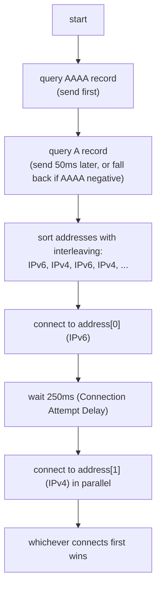

# 課堂 1.13 — IPv6 完整解剖

## 學前知道

- **前置課**：[1.4 IP 路由](./1.4-ip-routing-graph.md)、[1.5 NDP/SLAAC](./1.5-arp-ndp-dhcp.md)（已展開 NDP/SLAAC/Privacy）、[1.6 ICMPv6](./1.6-icmp-deep.md)
- **預計閱讀時間**：40~50 分鐘
- **必讀規格 / 論文**：
  - **RFC 8200 — Internet Protocol, Version 6 (IPv6) Specification** (Deering & Hinden, 2017, STD 86) ⭐ — 取代 RFC 2460
  - **RFC 4291 — IP Version 6 Addressing Architecture** (Hinden & Deering, 2006)
  - **RFC 7136 — Significance of IPv6 Interface Identifiers** (Carpenter & Jiang, 2014)
  - **RFC 6177 — IPv6 Address Assignment to End Sites** (Narten, Huston, Roberts, 2011)
  - **RFC 7858 — DNS over TLS** + **RFC 8484 — DNS over HTTPS** (主題在 1.14 但 IPv6 互動)
  - **RFC 6724 — Default Address Selection for IPv6** (Thaler, Draves, Matsumoto, Chown, 2012)
  - **RFC 8305 — Happy Eyeballs Version 2: Better Connectivity Using Concurrency** (Schinazi & Pauly, 2017) ⭐ — 取代 RFC 6555
  - **RFC 8981 / RFC 7217**（已在 [1.5 lesson](./1.5-arp-ndp-dhcp.md) 與 [precis](../../notes/papers/) ）—— SLAAC privacy
  - **RFC 4007 — IPv6 Scoped Address Architecture** (Deering, Haberman, Jinmei, Nordmark, Zill, 2005)
  - **RFC 7872 — Observations on the Dropping of Packets with IPv6 Extension Headers in the Real World** (Gont, Linkova, Chown, Liu, 2016)
  - **Czyz, Allman, Zhang, Iekel-Johnson, Osterweil, Bailey — Measuring IPv6 Adoption** (SIGCOMM 2014) ⭐
  - **Wing & Yourtchenko — RFC 6555 Happy Eyeballs v1** (2012, historical)
  - **Google IPv6 Statistics** <https://www.google.com/intl/en/ipv6/statistics.html>
  - **APNIC IPv6 measurement** <https://stats.labs.apnic.net/ipv6>
  - **Khormali et al. 2018 *Comprehensive Analysis of IPv6 Adoption***
- **必讀原始碼**：
  - Linux `net/ipv6/addrconf.c`（SLAAC、address selection）、`net/ipv6/ip6_output.c`、`net/ipv6/exthdrs.c`（extension header）
  - Linux `net/ipv6/route.c`、`net/ipv6/fib6_*.c`
  - getaddrinfo() 與 RFC 6724 在 glibc / musl 的 source

---

## 動機

IPv6 對 G6 不只是「**換大 address**」：

1. **GFW 在 IPv6 上能力略弱**：2026 GFW 仍對 IPv6 有 selective drop / DPI，但**部署密度 + 完整度比 IPv4 略低**——IPv6 是**邊際 advantage**，不是 silver bullet
2. **CGNAT 問題在 IPv6 上消失**：每 client 自己有 globally routable IPv6 address——但**SLAAC 暴露隱私**問題反過來嚴重——必須 RFC 8981 + RFC 7217
3. **Extension header drop rate 高**（RFC 7872 量測 ~10-50% path）——對 IPv6 native security feature（IPsec ESP、AH）部署有壓制效果——**RFC 8200 推 simpler header chain** 但路徑 still drop
4. **Happy Eyeballs v2** 是 dual-stack client 必須懂——client-side UX 與 fallback 邏輯——**G6 client 設計必須 inherit**
5. **IPv6 在 hyperscaler 與 mobile carrier 普及極快**：2024 Google statistics ~45% 全球 user 走 IPv6；T-Mobile US / Reliance Jio 印度等是 IPv6-only carrier；**G6 dual-stack mandatory**
6. **IPv6 multicast / anycast / scope 設計**比 IPv4 完整——但**翻牆場景無直接利用價值**——只是部署現實必須懂

教科書講 IPv6 的問題：花太多篇幅講 address 表示法、不展開 extension header 的 dropping 災難、不講 Happy Eyeballs / RFC 6724 default selection 的 deployment 現實、不評 GFW 對 IPv6 態度。本堂從 deployment + 對 G6 影響切入。

---

## 核心概念

### 1. IPv6 header（40 byte 固定）

```
 0                   1                   2                   3
 0 1 2 3 4 5 6 7 8 9 0 1 2 3 4 5 6 7 8 9 0 1 2 3 4 5 6 7 8 9 0 1
+-+-+-+-+-+-+-+-+-+-+-+-+-+-+-+-+-+-+-+-+-+-+-+-+-+-+-+-+-+-+-+-+
|Version| Traffic Class |           Flow Label                  |
+-+-+-+-+-+-+-+-+-+-+-+-+-+-+-+-+-+-+-+-+-+-+-+-+-+-+-+-+-+-+-+-+
|         Payload Length        |  Next Header  |   Hop Limit   |
+-+-+-+-+-+-+-+-+-+-+-+-+-+-+-+-+-+-+-+-+-+-+-+-+-+-+-+-+-+-+-+-+
|                                                               |
+                         Source Address (128 bit)              +
|                                                               |
+-+-+-+-+-+-+-+-+-+-+-+-+-+-+-+-+-+-+-+-+-+-+-+-+-+-+-+-+-+-+-+-+
|                                                               |
+                       Destination Address (128 bit)           +
|                                                               |
+-+-+-+-+-+-+-+-+-+-+-+-+-+-+-+-+-+-+-+-+-+-+-+-+-+-+-+-+-+-+-+-+
```

對比 IPv4 header（20 byte + options）：

| Field | IPv4 | IPv6 |
|---|---|---|
| Version | ✓ | ✓ |
| Total Length | ✓ | ✓ (renamed Payload Length) |
| TTL / Hop Limit | ✓ | ✓ (renamed) |
| Protocol / Next Header | ✓ | ✓ (chained) |
| Source / Dest | 32-bit × 2 | 128-bit × 2 |
| Header Checksum | ✓ | ✗ (removed) |
| Fragmentation (ID, flags, offset) | ✓ | ✗ (moved to ext header) |
| Options | ✓ | ✗ (moved to ext header) |
| Traffic Class | ✓ (DSCP+ECN) | ✓ |
| Flow Label | ✗ | ✓ (20-bit) |

**設計哲學差別**：IPv6 header 是 fixed 40 byte——router fast path 不必 parse 變動 option——hardware-friendly。所有 option 變 chained extension header。

#### Flow Label（20 bit）

新概念：sender 標記「**同 flow**」 packet 用相同 label，help router 做 ECMP hash without parsing L4。

**現實**：RFC 6437 推薦 sender 設 random 但 stable flow label per connection。**多 OS（Linux, macOS）支援**。但**多 router 仍只看 5-tuple**——flow label 部分被 ignored。

**對 G6**：可考慮 set flow label，但 **不要太穩定**（cross-session linkability fingerprint）也**不要每 packet 變**（破壞 ECMP）——典型 per-QUIC-connection unique random。

### 2. Extension Header 機制

不像 IPv4 把 option 塞 header field，IPv6 用「**chained**」extension header：

```
IPv6 main header (Next Header = 0)
   ↓
Hop-by-Hop Options Header (Next Header = 60)
   ↓
Destination Options Header (Next Header = 43)
   ↓
Routing Header (Next Header = 44)
   ↓
Fragment Header (Next Header = 50)
   ↓
ESP / AH (Next Header = 6 for TCP)
   ↓
TCP header + data
```

每 extension header 自己標 next header → form linked list。

#### 主要 extension headers

| Header | Next Header Code | 用途 | Drop rate (RFC 7872) |
|---|---|---|---|
| **Hop-by-Hop (HBH)** | 0 | 沿路每 router 處理 | ~30-40% |
| **Routing (RH)** | 43 | source routing (RH Type 0 deprecated; SRv6 用 Type 4) | ~30-50% |
| **Fragment** | 44 | IPv6 fragmentation（only by source） | ~10-20% |
| **Destination Options** | 60 | end-host options | ~20-30% |
| **AH / ESP** | 51 / 50 | IPsec | ~30-50% |
| **Mobility** | 135 | Mobile IPv6 | ~50% |

**RFC 7872 結論**：「**很多 internet path drop 帶 extension header 的 packet**」——主要是 transit router / firewall 不 parse 完整 chain（CPU cost）或 security policy 一律 drop。

⇒ **G6 IPv6 packet 不應該使用 extension header**——基本不可用。**這個現實對「IPv6 比 IPv4 簡單」這個 narrative 是反例**。

### 3. Address types & scope

#### 3.1 Address 種類

```
::1/128                  loopback
::/128                   unspecified
fe80::/10                Link-Local Unicast (LLA)
fc00::/7                 Unique Local Address (ULA, like 10.x in IPv4)
2000::/3                 Global Unicast Address (GUA)
ff00::/8                 Multicast
::ffff:0:0/96            IPv4-mapped (in dual-stack socket)
64:ff9b::/96             Well-known NAT64 prefix
2001:db8::/32            Documentation prefix
```

#### 3.2 Scope（RFC 4007）

IPv6 address 有 scope：
- **Link-local** (fe80::/10)：only valid on a single link；packet 帶這 src/dst **永遠不離 segment**
- **Site-local**：deprecated (replaced by ULA)
- **Unique local** (fc00::/7)：private, like RFC 1918；globally routable in theory but **多 ISP drop**
- **Global**：internet routable

**注意 link-local 同一 prefix 可在多 interface 出現** → 用 `fe80::1234%eth0` 表 scope（zone id）。

#### 3.3 多 address per interface

IPv6 device **常**同時有多個 address：
- 1 link-local（必須）
- 1+ global (SLAAC stable + temporary)
- 可能 ULA
- 可能 DHCPv6-assigned

**Default Address Selection（RFC 6724）**：app 用 `getaddrinfo()` 拿候選地址 list，按 rule 8 表排序：
1. avoid unusable
2. prefer matching scope
3. avoid deprecated
4. prefer home address
5. prefer matching label (e.g. teredo preferred over native)
6. prefer higher precedence
7. avoid native transport
8. prefer smaller scope
9. ...

**RFC 6724 是 dual-stack deployment 的 hidden complexity 來源**——不同 OS 對此 RFC 實作不一致。

### 4. Happy Eyeballs v2（RFC 8305, 2017）⭐

#### 4.1 問題：IPv6 brokenness

dual-stack client 連 dual-stack server：
- DNS 同時拿 A + AAAA record
- 試 IPv6 路徑——若 broken（partial IPv6 deployment 常見）→ 等 TCP timeout（30-75 sec）才 fallback IPv4
- 用戶 perceived latency 災難

#### 4.2 Happy Eyeballs v1（RFC 6555）

簡單做法：發 IPv6 SYN + 等 300ms → 若無 SYN-ACK → 發 IPv4 SYN race。

#### 4.3 Happy Eyeballs v2（RFC 8305）的改進

更細的 staged approach：



關鍵設計：
- **DNS 也 happy eyeball**：先發 AAAA 等 50ms 再發 A
- **Address sorting + interleaving**：避免「全 IPv6 先試」latency
- **NAT64 detection**：透過 RFC 7050 + RFC 6052 自動 synthesize NAT64 address
- **250ms Connection Attempt Delay**：給 IPv6 head start 但不過長

#### 4.4 對 G6 client 的具體 implication

G6 client 連 G6 server：
- server 應 dual-stack（AAAA + A 都有）
- client 走 Happy Eyeballs v2 connect
- **race connections 對抗 GFW selective drop**：若 IPv4 path 被 throttle，IPv6 自動贏 race → 用戶 fallback seamless

**G6 應該 design 為「Happy Eyeballs across G6 servers」**：給 client multiple G6 server endpoint，race connections——首個成功的取得連線。對 GFW 的單一封鎖點 robust。

### 5. SLAAC privacy（已在 1.5）+ stable opaque IID（RFC 7217）

**摘要**（詳見 [1.5 lesson](./1.5-arp-ndp-dhcp.md)）：

- **EUI-64 SLAAC**：基於 MAC——隱私災難
- **RFC 8981 Temporary Address**：random IID + 定期 rotate
- **RFC 7217 Stable Opaque IID**：`IID = PRF(secret, prefix, iface, dad_counter)`——同 prefix 重連得 same IID，跨 prefix unlinkable
- **建議並用**：stable for inbound reachability + temporary for outbound privacy

### 6. IPv6 部署量測（Czyz et al. 2014 + 後續）

#### 6.1 Czyz 2014 SIGCOMM 主要結果

12 個 metric（traffic, content, BGP prefix, transit AS, etc.）：
- **IPv6 traffic 年增 400%+**（2012-2014）
- **BGP prefix 2004-2014 增 37×**（526 → 19,278）
- **2014 Alexa top 10K reachable via IPv6**：~3.2%
- **regional variation 大**：US、Belgium、Germany 高；中國、印度低（但 2024 已反轉）

#### 6.2 2024 最新狀態（APNIC / Google Statistics）

| Region | IPv6 capable user % (2024) |
|---|---|
| India (Reliance Jio drives) | ~75% |
| Germany | ~70% |
| France | ~70% |
| USA | ~50% |
| Japan | ~50% |
| 中國 mobile | ~40-50% (CNGI 推動) |
| 中國 fixed broadband | ~30-40% |
| Global average | ~45% |

**重要**：中國 IPv6 部署過去 5 年大幅加速——「**IPv6 在中國少**」這個 narrative 不再 accurate。

#### 6.3 GFW 對 IPv6 的態度

公開資料 + 圈內觀察：
- GFW 有 IPv6 DPI 能力——SNI 過濾、Tor IPv6 bridge 封鎖、TLS ClientHello fingerprint
- **但 GFW IPv6 部署可能略弱於 IPv4**：BGP-level 封鎖、active probing 仍少見 IPv6 來源
- **某些 v6 path 可能 escape GFW 主動 inspect**——但**不可依賴**

**對 G6**：IPv6 是 marginal advantage——不是 silver bullet。**dual-stack + Happy Eyeballs 是正解**——而非 IPv6-only。

### 7. IPv6 在 mobile / cellular network

#### 7.1 IPv6-only carrier

T-Mobile US (2014+)、Reliance Jio India、SK Telecom Korea：**內部 mobile network 純 IPv6**。Legacy IPv4 traffic 走 NAT64 / 464XLAT。

**對 G6**：client 在 IPv6-only network 上：
- DNS 拿 AAAA → 用 IPv6 直連 G6 server（**理想**）
- DNS 拿 A 但無 AAAA → NAT64 翻譯 → 仍可用，但多一層 NAT 延遲
- ⇒ **G6 server dual-stack 是 mandatory**

#### 7.2 雙 stack mobile carrier 上的 Happy Eyeballs 行為

mobile carrier 上 IPv6 path 通常 faster + less congested（IPv4 走 CGN 多 hop）。Happy Eyeballs 會 prefer IPv6——**通常正確**。

### 8. IPv6 attack surface（與 IPv4 對比）

| 攻擊 | IPv4 | IPv6 |
|---|---|---|
| **Address scanning** | feasible (~32-bit space) | infeasible (~64-bit subnet) |
| **NDP spoof** | (對應 ARP spoof) | ~same severity, RA-Guard 修補不完整 |
| **Rogue RA** | (對應 DHCP rogue) | 更強——一次 RA 覆蓋整 segment |
| **Fragmentation attack** | header 在 IP main | header 在 ext header，部分 firewall 看不到 |
| **Extension header bypass** | n/a | very real——RFC 7113 RA-Guard evasion |
| **Tunnel-based attack** | n/a | 6to4 / Teredo / ISATAP middlebox bypass |
| **Privacy leak via EUI-64** | n/a | RFC 8981 / 7217 mitigate |

⇒ IPv6 安全教訓：**簡化 header 設計 + 更大 address space 帶來新攻擊面**——不是「自動更安全」。

---

## 與我們協議設計的關聯

| 設計面 | IPv6 知識的影響 |
|---|---|
| **11.1 威脅模型** | GFW IPv6 能力不可低估；雙層 NAT 在 v6 消失但 NDP/RA attack 增 |
| **11.4 主架構** | mandatory dual-stack server；Happy Eyeballs across endpoints |
| **11.5 packet format** | 不用 IPv6 extension header（drop rate 高）；DPLPMTUD 在 v4/v6 各自跑 |
| **11.6 握手** | 第一 packet 大小要 fit IPv6 1280 minimum MTU |
| **12.6 客戶端整合** | Happy Eyeballs v2 mandatory；DNS happy eyeball |
| **12.7 服務端** | dual-stack listen；IPv6 server identifier rotate |
| **12.18 真實環境測試** | 必測 IPv4 only / IPv6 only / dual-stack / NAT64 / 464XLAT 全部 |
| **9.x GFW** | 測 v6 path vs v4 path 對抗能力差異 |

### G6 dual-stack policy 提案

```yaml
g6_dual_stack_policy:
  server:
    listen: [::]
    accept_v4_via_v6_mapped: true
    address_selection_rfc6724_compliant: true
  client:
    happy_eyeballs_v2: mandatory
    dns_happy_eyeball_delay_ms: 50
    connection_attempt_delay_ms: 250
    address_count_to_race: max(4, dual_stack)
    prefer_v6: true
    fallback_v4: enabled
  fingerprint_resistance:
    flow_label: per_connection_random_stable
    no_extension_headers: mandatory
    eui64_address: forbidden
    rfc8981_temporary: mandatory
```

---

## 動手（25 分鐘）

### 任務 1（5 min）：看自己 IPv6 address 配置

```bash
orb -m debian
ip -6 addr show

# 看每個 address 的類型與 lifetime
ip -6 addr show eth0 | grep -A 1 "inet6\|preferred\|valid"

# 看 IPv6 routing
ip -6 route show
```

### 任務 2（5 min）：Happy Eyeballs 觀察

```bash
# curl 對 dual-stack site 看選擇
curl -v -o /dev/null --connect-timeout 5 https://www.google.com 2>&1 | grep -i "trying\|connected to"

# 強制 IPv4 only / IPv6 only
curl -4 -v -o /dev/null https://www.google.com 2>&1 | head
curl -6 -v -o /dev/null https://www.google.com 2>&1 | head
```

### 任務 3（5 min）：看 RFC 6724 default address selection

```bash
# 模擬多 IPv6 address 場景
ip -6 addr show
# 看哪個 address 被 default 用
ip -6 route get 2001:4860:4860::8888  # Google DNS

# Compare to "from <specific src>"
ip -6 route get 2001:4860:4860::8888 from <your-temp-address>
```

### 任務 4（10 min）：抓 Happy Eyeballs 抓包

```bash
# 同時抓 v4 + v6 packet
sudo tcpdump -i any -nn 'tcp port 443 and (host www.google.com or host8.8.8.8)' -c 30 &

# 觸發 happy eyeball
curl -o /dev/null https://www.google.com

# 觀察 packet 順序：v6 first, v4 蓋後 race
```

---

## 自我檢查

1. IPv6 vs IPv4 header 的 5 個主要差別？為何 IPv6 拿掉 header checksum？
2. Extension header 設計初衷與 reality 的差距是什麼？RFC 7872 告訴我們什麼？
3. RFC 6724 default address selection 為何重要？dual-stack client 行為 inconsistent 的常見原因？
4. Happy Eyeballs v2 比 v1 進步在哪？對 G6 client 設計 5 個具體影響各是什麼？
5. RFC 8981 + RFC 7217 並用如何同時滿足 stable inbound reachability 與 outbound privacy？
6. GFW 對 IPv6 與 IPv4 的對抗能力差異是什麼？G6 為何不走 IPv6-only？
7. 2024 IPv6 部署現實（India 75%、global 45%）對 G6 baseline 的 deployment 計畫有什麼具體影響？

---

## 延伸閱讀

- **RFC 8200 IPv6 全文** — STD 86
- **Stevens *TCP/IP Illustrated Volume 1* ch.5-6** — IPv6 chapters
- **Fernando Gont 個人 page** — IPv6 security 一線研究
- **APNIC labs IPv6 statistics** <https://stats.labs.apnic.net/ipv6>
- **Google IPv6 Statistics** <https://www.google.com/intl/en/ipv6/statistics.html>
- **World IPv6 Launch** website
- **IETF v6ops WG documents** — IPv6 部署實務

---

## 研究級補遺

### 1. 學界詞彙

- **IPv6 / IPv4 mapped address** (`::ffff:0:0/96`)
- **SLAAC / DHCPv6 / RA / NDP / DAD** (NS/NA, RS/RA, MLD)（[1.5 lesson](./1.5-arp-ndp-dhcp.md)）
- **Extension Header chain** (HBH/Routing/Fragment/AH/ESP/Dest Options/Mobility)
- **Flow Label** (RFC 6437)
- **DSCP + ECN** in Traffic Class
- **NAT64 / DNS64 / 464XLAT / SIIT / DS-Lite / MAP-T / MAP-E**
- **6to4 / Teredo / ISATAP / 6rd** — historical transition mechanisms
- **CGN-LSN** (IPv6 over IPv4 CGN context)
- **RA-Guard / DHCPv6-Shield / ND-Shield / SAVI**——L2 first-hop security
- **PvD (Provisioning Domain, RFC 7556)**
- **RFC 6724 Default Address Selection**
- **Happy Eyeballs v1 / v2**
- **EUI-64 / RFC 7217 stable opaque IID / RFC 8981 temporary**
- **MLDv1 / MLDv2** (multicast listener discovery)
- **Anycast in IPv6**
- **SRv6** (Segment Routing IPv6)

### 2. 對手分類學

| 對手能力 | IPv6 特定影響 |
|---|---|
| **passive observer** | 看 128-bit address 結構 (prefix/IID 各自含 info) |
| **on-path active** | RA injection 比 DHCP rogue 更強；ext header bypass middlebox |
| **address scanner** | 64-bit IID space 防 brute force scan；但 known prefix + DNS leak 仍可枚舉 |
| **GFW v6 DPI** | SNI/TLS fingerprint 適用 v4/v6；selective drop |
| **GFW v6 BGP** | IPv6 routing 較 sparse——封 prefix 易、覆蓋面廣 |
| **mobile carrier CGNAT-of-v6** | 部分 v6 carrier 仍做 NAT-like translation（NAT66）|

### 3. 形式化定義

#### 3.1 IPv6 address structure

```
128-bit address = 64-bit Network Prefix || 64-bit Interface Identifier
                                            (IID)
```

**Property（RFC 7136）**：IID **不應**承載 host-specific identity——應 random or PRF-derived for unlinkability。

**SLAAC 各模式 IID 的 entropy**：
- EUI-64 from MAC：~24-bit entropy (vendor OUI + 24-bit) → linkable across networks
- RFC 4941 / 8981 temporary：64-bit random → cross-time unlinkable
- RFC 7217 stable opaque：64-bit PRF output → cross-prefix unlinkable but stable within prefix

#### 3.2 Extension header drop 的 information-theoretic 觀察

設 path 上 N 個 router/firewall，每個 drop probability p_i。**End-to-end drop rate of packet with EH** = 1 - Π(1 - p_i)。

RFC 7872 量測 N ≈ 10-15, p_i ≈ 5-10% → end-to-end drop 30-50%。**這個 cumulative effect 是 EH 不可用的根因**——不是任一單點 broken，是 cumulative。

#### 3.3 Happy Eyeballs convergence time

設 v6 path RTT = R_6, v4 path RTT = R_4，且 v6 path broken probability = q_6。

```
Expected total connection time =
  q_6 × (250ms + R_4) + (1 - q_6) × R_6
```

對 R_6 = R_4 = 50ms, q_6 = 10%：
- HE v2: 0.1 × 300 + 0.9 × 50 = 75 ms
- Without HE (only v6): 0.1 × 30000 + 0.9 × 50 = 3045 ms

⇒ Happy Eyeballs 對 partial-broken v6 path **改善 40×**。

### 4. 必追論文 / 規格

- ✅ **RFC 8200 IPv6 spec (STD 86)** — 必通讀
- ✅ **RFC 4291 IPv6 addressing**
- ✅ **RFC 6724 default address selection** — dual-stack hidden complexity
- ✅ **RFC 8305 Happy Eyeballs v2** ⭐
- ✅ **RFC 7872 EH drop measurement** ⭐
- ✅ **Czyz et al. 2014 SIGCOMM** ⭐ — IPv6 adoption
- **Gilad et al. 2014 *Off-Path Hacking: The Illusion of Challenge-Response Authentication***（IPv6 attack 部分）
- **Krenc et al. 2024 *Towards a Non-Binary View of IPv6 Adoption***（IMC 2024）— Czyz 後續
- **Heuse 2017 *IPv6 Insecurity: Two Decades of Slow***
- **THC IPv6 attack toolkit** documentation
- **Apple developer ipv6 transition guide** — Happy Eyeballs deployment

### 5. 我們協議的座標

| G6 設計面 | IPv6 影響 |
|---|---|
| **dual-stack server** | mandatory；不 v6-only |
| **client Happy Eyeballs** | mandatory；可選 across-G6-server happy eyeball |
| **no extension header** | drop rate 高 + middlebox 不 friendly |
| **RFC 7217 + RFC 8981** | client-side enforce |
| **DPLPMTUD** | IPv6 base MTU 1280；探到 1452+ |
| **flow label** | per-connection random stable；不暴露 metadata |

### 6. 必追資源

- **IETF v6ops WG** — IPv6 部署最新
- **IETF 6man WG** — IPv6 maintenance
- **APNIC labs**, **RIPE NCC**, **Google IPv6 stats** — 量測
- **OpenINTEL** — large-scale DNS / IPv6 量測
- **Fernando Gont's IPv6 security page**
- **Geoff Huston (APNIC) IPv6 long-form articles**

### 7. 開放問題

- **2030 IPv4 final exit timeline**：IPv4 何時真正退場？仍 active question
- **GFW 對 IPv6 的能力 catch-up 速度**：IPv4 vs v6 GFW 部署差距 closing 但**量化研究缺**
- **Extension header 命運**：IETF 持續推進 EH friendly path，但部署無進展——是否該 spec 化 「**no EH for new applications**」？
- **NAT66**（IPv6 NAT，違反 IPv6 設計初衷）的部署率：mobile carrier 偷偷做？
- **IPv6-only deployment 的 client UX 邊界**：NAT64 引入的延遲對 real-time app 影響量化研究不夠
- **後量子 IPv6 IPsec**：ESP/AH 算法升級 path 與部署
- **Cross-protocol fingerprint (v4 vs v6)**：同 device 在兩 stack 上行為差別是 fingerprint surface

---

下一堂：**1.14 DNS 完整解剖**——報文 byte by byte、recursive/iterative、Kaminsky cache poisoning、DNSSEC 為何失敗、DoH/DoT/DoQ 取而代之、ECS 對 CDN 與翻牆雙刃；對應 G6 名稱解析設計與抗 DNS poisoning。
