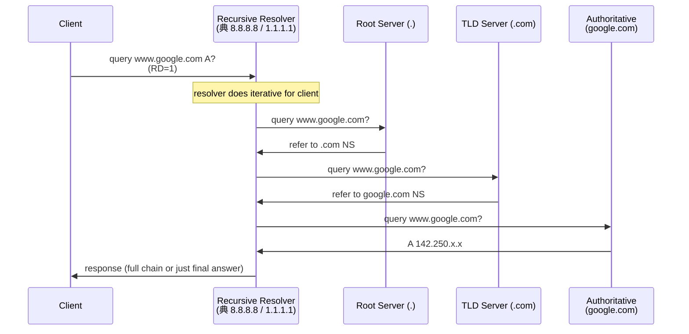

# 課堂 1.14 — DNS 完整解剖

## 學前知道

- **前置課**：[1.4 路由](./1.4-ip-routing-graph.md)、[1.8-1.10 TCP](./1.8-tcp-connection-mgmt.md) / [1.12 UDP](./1.12-udp-anatomy.md)
- **預計閱讀時間**：45~55 分鐘
- **必讀規格 / 論文**：
  - **RFC 1034 + RFC 1035 — Domain Names: Concepts/Facilities + Implementation/Specification** (Mockapetris, 1987) ⭐ — DNS 奠基
  - **RFC 9499 — DNS Terminology** (Hoffman & Sullivan, 2024) — 取代 RFC 8499，2026 權威 DNS 術語表
  - **RFC 2308 — Negative Caching of DNS Queries** (Andrews, 1998)
  - **RFC 6891 — Extension Mechanisms for DNS (EDNS(0))** (Damas, Graff, Vixie, 2013)
  - **RFC 4033 / 4034 / 4035 — DNSSEC** (Arends et al., 2005) — 失敗的標準
  - **RFC 7858 — Specification for DNS over Transport Layer Security (DoT)** (Hu, Zhu, Heidemann, Mankin, Wessels, Hoffman, 2016)
  - **RFC 8484 — DNS Queries over HTTPS (DoH)** (Hoffman & McManus, 2018)
  - **RFC 9250 — DNS over Dedicated QUIC Connections (DoQ)** (Huitema, Dickinson, Mankin, 2022) ⭐
  - **RFC 7871 — Client Subnet in DNS Queries (ECS)** (Contavalli et al., 2016)
  - **RFC 9460 — Service Binding and Parameter Specification via the DNS (SVCB / HTTPS RR)** (Schwartz, Bishop, Nygren, 2023)
  - **RFC 9462 — Discovery of Designated Resolvers (DDR)** (Pauly et al., 2023)
  - **RFC 9463 — DHCP/RA Options for Encrypted DNS** (Boucadair, Reddy, Wing, Cook, Pauly, 2023)
  - **draft-ietf-tls-esni / draft-ietf-dnsop-svcb-https** — Encrypted ClientHello (ECH) 用 SVCB record
  - **Kaminsky 2008 disclosure** (DEFCON / Black Hat 2008) — DNS cache poisoning attack
  - **Schomp, Callahan, Rabinovich, Allman 2013 *Assessing DNS Vulnerability to Record Injection*** (PAM)
  - **Chung et al. 2017 *A Longitudinal, End-to-End View of the DNSSEC Ecosystem*** (USENIX Security)
  - **Hoang, Niaki, Dalek, Knockel, Lin, Marczak, Crete-Nishihata, Gill, Polychronakis — How Great is the Great Firewall? Measuring China's DNS Censorship** (USENIX Security 2021, GFWatch) ⭐
  - **Hoang et al. 2024 *GFWeb: Measuring the GFW's Web Censorship at Scale*** (USENIX Security 2024)
  - **Lu et al. 2019 *An End-to-End, Large-Scale Measurement of DNS-over-Encryption: How Far Have We Come?*** (IMC)
  - **Pearce, Jones, Li, Ensafi, Feamster, Weaver, Paxson — Augur: Internet-Wide Detection of Connectivity Disruptions** (IEEE S&P 2017)
- **必讀原始碼**：
  - **Unbound** <https://github.com/NLnetLabs/unbound> — recursive resolver 工程典範
  - **BIND9** — authoritative + recursive 全功能
  - **dnsmasq** — small footprint resolver
  - **CoreDNS** — Go 實作 plugin 架構
  - **DNSCrypt-proxy, dnscrypt-wrapper** — DoT/DoH/DoQ proxy

---

## 動機

DNS 看似「**域名翻 IP**」一件事，**對 G6 是 5 個 first-order 問題**：

1. **G6 客戶端怎麼知道 G6 server 的 IP？** 必須走 DNS——但 GFW DNS 污染嚴重。Bootstrap problem 沒解，G6 client 連不上 server
2. **GFW DNS 對 G6 的攻擊面**：Hoang 2021 USENIX Sec 揭露**至少 311K 域名被 GFW DNS 污染**（含 ESNI / DoH / GitHub 等翻牆工具相關）；GFW 注 forged IP 模式具體可量化
3. **加密 DNS（DoT/DoH/DoQ）+ ECH (Encrypted Client Hello) 是 anti-censorship 工具，也是 GFW 攻擊目標**：GFW 對 DoH 流量 selective drop、對 ECH 部分動作——這直接影響 G6 部署策略
4. **ECS（EDNS Client Subnet）對 CDN-based G6 deployment**：G6 若部署在 CloudFront / Cloudflare，ECS 決定 client 拿到哪個 anycast IP——**對 latency + 對 GFW 識別均有影響**
5. **SVCB / HTTPS RR + DDR (Discovery of Designated Resolvers) 是 IETF 2023+ 的新方向**：允許 service binding（同一 hostname 多 transport / port hint）+ encrypted DNS discovery——對 G6 v2 設計直接相關

教科書講 DNS 的問題：講 hierarchy + recursive 一遍就完——不講 Kaminsky attack 全細節、不講 DNSSEC 失敗原因、不講 GFW 的 DNS 武器化、不講 DoH/DoQ/ECH/SVCB 過去 5 年的 active development。本堂從威脅與部署現實切入。

---

## 核心概念

### 1. DNS 報文格式（RFC 1035 §4）

```
+---------------------+
|        Header       |  12 byte 固定
+---------------------+
|       Question      |  RR 數: QDCOUNT
+---------------------+
|        Answer       |  RR 數: ANCOUNT
+---------------------+
|      Authority      |  RR 數: NSCOUNT
+---------------------+
|      Additional     |  RR 數: ARCOUNT
+---------------------+
```

#### Header（12 byte）

```
 0  1  2  3  4  5  6  7  8  9 10 11 12 13 14 15
+--+--+--+--+--+--+--+--+--+--+--+--+--+--+--+--+
|                      ID                       |
+--+--+--+--+--+--+--+--+--+--+--+--+--+--+--+--+
|QR|   Opcode  |AA|TC|RD|RA|   Z    |   RCODE   |
+--+--+--+--+--+--+--+--+--+--+--+--+--+--+--+--+
|                    QDCOUNT                    |
+--+--+--+--+--+--+--+--+--+--+--+--+--+--+--+--+
|                    ANCOUNT                    |
+--+--+--+--+--+--+--+--+--+--+--+--+--+--+--+--+
|                    NSCOUNT                    |
+--+--+--+--+--+--+--+--+--+--+--+--+--+--+--+--+
|                    ARCOUNT                    |
+--+--+--+--+--+--+--+--+--+--+--+--+--+--+--+--+
```

- **ID** (16 bit)：transaction id；server 回應必須帶相同 ID
- **QR** (1 bit)：0=query, 1=response
- **Opcode** (4 bit)：standard query (0)、IQUERY、STATUS 等
- **AA** (1 bit)：Authoritative Answer
- **TC** (1 bit)：Truncated（建議 retry over TCP）
- **RD** (1 bit)：Recursion Desired
- **RA** (1 bit)：Recursion Available
- **RCODE** (4 bit)：response code（NOERROR=0, FORMERR=1, SERVFAIL=2, NXDOMAIN=3, NOTIMP=4, REFUSED=5）
- **Z** (3 bit)：reserved（含 AD/CD bits for DNSSEC）
- **QD/AN/NS/AR COUNT**：四 section 的 RR 數

#### Question section（變長）

```
+---+---+---+---+---+---+---+---+
|     QNAME (variable, label encoded)
+---+---+---+---+---+---+---+---+
|     QTYPE (2 byte)            |
+---+---+---+---+---+---+---+---+
|     QCLASS (2 byte)           |
+---+---+---+---+---+---+---+---+
```

**QNAME** 用「**label-length-prefix**」編碼：`www.google.com` →
```
\x03 w w w \x06 g o o g l e \x03 c o m \x00
```
每個 label 最多 63 byte，total name 最多 255 byte。

#### Resource Record（RR）格式

```
+---+---+---+---+---+---+---+---+
|     NAME (variable or pointer)
+---+---+---+---+---+---+---+---+
|     TYPE (2 byte)             |
|     CLASS (2 byte)            |
|     TTL (4 byte)              |
|     RDLENGTH (2 byte)         |
|     RDATA (RDLENGTH byte)     |
+---+---+---+---+---+---+---+---+
```

**Name compression（RFC 1035 §4.1.4）**：avoid 重複寫域名。Pointer 2 byte（前 2 bit `11`，後 14 bit offset）指回 packet 內已出現的 name。**很多 DNS attack 利用此 compression bug**。

### 2. Resource Record 種類（必須懂的部分）

| Type | Code | RDATA | 用途 |
|---|---|---|---|
| **A** | 1 | 4 byte IPv4 | hostname → IPv4 |
| **AAAA** | 28 | 16 byte IPv6 | hostname → IPv6 |
| **CNAME** | 5 | domain name | alias |
| **MX** | 15 | priority + domain | mail exchange |
| **TXT** | 16 | string | 任意文字（SPF/DKIM/驗證等） |
| **PTR** | 12 | domain name | 反向 (IP → hostname) |
| **NS** | 2 | domain name | nameserver |
| **SOA** | 6 | server, admin, serial, ... | zone 起點 |
| **SRV** | 33 | priority/weight/port/target | service location |
| **CAA** | 257 | flags + tag + value | CA Authorization (CA 簽憑證限制) |
| **DNSKEY** | 48 | public key | DNSSEC |
| **DS** | 43 | digest of DNSKEY | DNSSEC delegation |
| **RRSIG** | 46 | signature | DNSSEC |
| **NSEC / NSEC3** | 47 / 50 | next name + types | DNSSEC negative response |
| **HTTPS** | 65 | SvcPriority + TargetName + SvcParams | RFC 9460 service binding（HTTP）|
| **SVCB** | 64 | 同上 | RFC 9460 generic service binding |

**HTTPS RR (type 65) 是 2023 後新標準**——含 ALPN hint、port、IP hints、**ECHConfig**——讓 client 在 DNS 階段就知道 transport details + 提前準備 ECH。對 G6 直接相關。

### 3. Recursive vs Iterative resolution



- **Client → Recursive Resolver**：典型走 `RD=1`（Recursion Desired），resolver 自己負責 chain
- **Resolver → Authoritative**：每跳 iterative，resolver 從 root 開始追
- **Caching**：resolver cache 每層 NS / DS / RR 結果至 TTL 到期

### 4. Caching 與 TTL（RFC 2308 negative cache）

#### Positive cache
- TTL 由 authoritative 決定，client/resolver cache 不超過 TTL
- TTL=0 表「**永不 cache**」（debug 用）
- 典型 TTL：A/AAAA 300-3600 sec, NS 86400, SOA 600-3600

#### Negative cache（RFC 2308）

域名**不存在**（NXDOMAIN）或某 type 不存在的結果也需要 cache，否則重複查 root server 過載。
**SOA 的 MINIMUM field** 表 negative TTL（典型 300-3600 sec）。

#### TTL 對 G6 的影響

- **G6 server IP TTL 短**（如 60 sec）→ 可快速切換 IP；但增加 DNS query 量、洩漏更多 query metadata
- **TTL 長**（如 86400）→ G6 client 不容易切換到新 server
- **建議**：300-600 sec，平衡 agility 與 query frequency

### 5. Kaminsky 2008 cache poisoning attack ⭐

#### 5.1 前置：DNS 信任假設

UDP DNS query 用 16-bit ID + (typical) 同一 src/dst port → **資料 ~32-bit entropy**。Attacker 想偽 response 必須猜 ID。

#### 5.2 傳統 attack（pre-2008）

對 resolver 送大量 forged response，先送 query 觸發 resolver outgoing query，然後 race resolver receive。**成功率低**：**ID 只有 16 bit 可以 brute force，但 resolver 看到 first valid response 就 cache 後續 forged 被丟（duplicate query）**。

#### 5.3 Kaminsky's insight

Don't attack `www.example.com`——attack `RANDOM-SUBDOMAIN.example.com`：
- 每次 query 是新 name → resolver 必須 outgoing 新 query（不會被 cache 擋）
- Attacker 注 forged response with `Additional` section 含 `example.com IN NS attacker.com`
- resolver 接受並 cache **`example.com` 的 nameserver**（不只是該 random subdomain）
- ⇒ **整個 zone 被 poison**——後續所有 `*.example.com` 都走 attacker

**Attack 速率**：典型 brute force 16-bit ID + 預測 src port ~10K queries/sec → **數秒到數分鐘可命中**。

#### 5.4 Mitigation: source port randomization

**RFC 5452**（2009）標準化 source port randomization：resolver 出 query 用 random src port（16-bit） + random ID（16-bit） → 總 entropy 32-bit → brute force **~10^9** queries——不可行。

**Linux / BIND / Unbound / dnsmasq 全部實作**——Kaminsky attack 在 2009 後失效。

#### 5.5 但 fragmentation 攻擊復活！

2020 Klein et al. *DNS Cache Poisoning Attack Reloaded*（NDSS）顯示：透過 ICMP fragmentation needed 強迫 IP fragmentation → 後續 fragment 可注入 → bypass src port + ID entropy。

**現代 resolver 必須 disable IP fragmentation 處理或加 mitigation**。

### 6. DNSSEC（RFC 4033-4035）⭐ — 失敗的標準

#### 6.1 設計

對每個 RR 做數位簽章（RRSIG），用 zone key（DNSKEY）驗。Zone key 用 parent zone 的 DS record 驗——chain of trust 直達 root key。

理論完美：
- Cache poisoning 不可能（forged response 簽章不對）
- Authoritative impersonation 不可能

#### 6.2 為什麼失敗

**部署率（2024 measurement）**：
- 全球 ~5-15% domain 配 DNSSEC
- ~1-3% resolver 驗 DNSSEC
- 大多 client 拿到 unvalidated response 而不知

**根因**：
- **複雜性**：管理 zone key rotation、algorithm rollover 比想像難多
- **NSEC enumeration**：NSEC record 暴露整個 zone 內所有 domain → NSEC3 加 hash 部分解決
- **Algorithm transitions 緩慢**：RSA SHA-1 → SHA-256 → ECDSA → EdDSA → PQ 各代 transition 痛
- **Errors 高**：misconfigured zone 比 unprotected 更糟（直接 SERVFAIL）
- **Performance**：每 query 多 response size 5-10× → larger packet → UDP fragmentation 風險
- **Last-mile 仍 unauthenticated**：client → resolver 之間若 unencrypted，attacker 仍可 forge

**對 G6**：**忽略 DNSSEC**——不依賴；改 trust path 走加密 DNS + cert pinning。

### 7. 加密 DNS: DoT / DoH / DoQ

#### 7.1 三者比較

| | DoT (RFC 7858) | DoH (RFC 8484) | DoQ (RFC 9250) |
|---|---|---|---|
| **Transport** | TLS over TCP | HTTPS (HTTP/1.1, /2, /3) | QUIC |
| **Port** | 853 dedicated | 443 (與 HTTPS 共用) | 853 dedicated UDP |
| **Discoverability** | dedicated port → 識別易 | 與 HTTPS 流量混合 → 識別難 | dedicated port → 易識別 |
| **HoL blocking** | TCP HoL | HTTP/2 一連線 HoL；HTTP/3 無 | 無 |
| **Latency** | TLS handshake | HTTPS handshake (1.1/2 慢) | QUIC 0-RTT 快 |
| **Year** | 2016 | 2018 | 2022 |
| **Adoption** | server-side 多 | client-side 多 (browsers) | growing |

#### 7.2 DoT (RFC 7858)

直接 TLS over TCP/853。**Privacy 與 HTTPS 同等**：DNS query/response 加密。
**但 port 853 dedicated**——middlebox 可 selective block——這就是中國某些網路 DoT 不通的原因。

#### 7.3 DoH (RFC 8484)

DNS query 走 HTTPS POST / GET。POST：body 是 DNS wire format；GET：query string `?dns=base64url-of-wire-format`。
**Port 443**——與 HTTPS 流量混合——**hard for middlebox to block without breaking HTTPS**。
**這是 DoH 抗 censorship 主要 advantage**。

#### 7.4 DoQ (RFC 9250)

DNS over QUIC，dedicated UDP/853（**注意：不是 443**）。
- 0-RTT 連線後 query latency 接近 UDP DNS
- 無 HoL blocking
- 但 port 853 dedicated——同 DoT 易被 selective block

**結論**：**DoQ 對 stub-to-recursive 與 recursive-to-auth latency 友善**，但 censorship resistance 不如 DoH。

### 8. GFW DNS censorship（Hoang 2021 USENIX Sec）⭐

#### 8.1 GFWatch 量測平台

Hoang et al. 部署 GFWatch：每天測 **411M** domain，9 個月發現 **311K** censored domains。

#### 8.2 Injector 分類

三個 GFW DNS injector（用 packet 特徵指紋識別）：
- **Injector 1**：AA bit = 1
- **Injector 2**：AA bit = 0, DF = 1（**負責 99% 受審查 domain**）
- **Injector 3**：AA bit = 0, DF = 0

#### 8.3 Forged IP groups（11 組）

GFW 注 forged IP 模式有特定 set，包括美國公司 IP（Facebook、Dropbox、Twitter 等）——重定向受審查域名到無關 IP，**讓 client 連到 fake IP 而非 NXDOMAIN**。

**2025 follow-up 觀察**：6 個 forged IP（含 8.7.198.46、46.82.174.69 等）行為特殊——對 client 從中國 probe 開所有 65535 port、握手後 RST。**GFW 變成「**主動 honeypot**」**——這是 2024+ 新行為。

#### 8.4 Overblocking

GFWatch 反向工程 GFW 用的 regex pattern，發現 **41K innocuous domain match** filter——overblocking 大量無辜域名。

#### 8.5 對 G6 的具體 implications

- **G6 server domain 必須避開 GFW filter regex**——不能用「**vpn.example.com**」這種顯眼名字
- **G6 client bootstrap 不能依賴 plain DNS**——必須用 DoH（首選）、DoQ、或預配 IP
- **forged IP detection**：G6 client 偵測 DNS response 是否 forged（如 response 含已知 forged IP set → 拒）

### 9. ECS（EDNS Client Subnet, RFC 7871）

#### 9.1 設計

**問題**：CDN edge selection 依 client IP——但 client 用 Cloudflare DNS (1.1.1.1)，Cloudflare DNS 在美國，CDN 看到 query src = 1.1.1.1 → 給美國 IP。Client 在歐洲：拿到不適合 IP。

**ECS 解**：resolver 把 **client subnet (e.g. /24)** 透過 EDNS option 傳給 authoritative；auth 根據 subnet 選 CDN edge。

#### 9.2 ECS 對 G6 影響

- **若 G6 走 CDN-fronting**（Cloudflare Worker / CloudFront）：ECS 決定 edge IP——client geo 變 → IP 變 → GFW 黑名單 efficacy 變
- **隱私洩漏**：ECS 把 client subnet 給 authoritative——authoritative 知道你大致地理位置
- **Cloudflare 不傳 ECS by default**（privacy stance）；Google DNS 傳 (/24 IPv4 or /48 IPv6)

#### 9.3 G6 設計

- 若 G6 用 CDN-fronting，ECS 是 latency 友善但 privacy 災難
- 可選擇：用 ODoH (RFC 9230)——隱藏 client subnet from resolver；或自建 resolver

### 10. ECH (Encrypted Client Hello) + SVCB/HTTPS RR

#### 10.1 ECH

`draft-ietf-tls-esni-current`（active draft, 2024-2025 stabilize 中）：把 TLS ClientHello 內含敏感的 SNI 加密——middlebox 看不到 target hostname。

**部署需 DNS 配合**：client 必須先從 DNS 拿 `ECHConfig`（含 public key）才能加密。**這個 ECHConfig 用 HTTPS RR (RFC 9460) 傳**。

#### 10.2 SVCB / HTTPS RR

新 RR type（64 / 65）：
- 一個 query 同時拿到 host name + ALPN + IP hint + port + ECH config + alpn-priority
- Client 可在 single DNS round trip 內收齊所有 transport info → reduce connection latency

```
example.com. IN HTTPS 1 . alpn="h3,h2" port=443 ipv4hint=192.0.2.1 ech=AED+...
```

#### 10.3 對 G6 的影響

**G6 應該 publish HTTPS RR**：
- 含 G6 ALPN（自定義 ALPN string）
- ECH config（加密 SNI）
- IP hints（client 直接知道，省 A/AAAA round trip）

**但 GFW 對 ECH 已開始 selective drop**——2024+ measurement 顯示中國對含 ECH 的 ClientHello packet drop 部分。**G6 設計必須有 ECH-less fallback**。

### 11. DDR (RFC 9462) + DHCP Encrypted DNS (RFC 9463)

#### 11.1 DDR

Client 知道 plain DNS resolver IP（透過 DHCP），想知道 **same operator 是否提供 encrypted DNS**。

**機制**：query `_dns.resolver.arpa.` SVCB → resolver 回 itself 的 DoH/DoT/DoQ endpoint。

**對 G6**：client 啟動時做 DDR——若 local network 提供 encrypted DNS → 用；否則 fallback 到 G6 自帶 DoH endpoint。

#### 11.2 RFC 9463 DHCP option

新 DHCP option 直接推 encrypted DNS endpoint URL。**比 DDR 更直接**，但 deployment 同樣慢。

---

## 與我們協議設計的關聯

| 設計面 | DNS 知識的影響 |
|---|---|
| **11.1 威脅模型** | GFW DNS poisoning 必須列為已知能力；列出 311K poisoned domain 數量級 |
| **11.4 主架構** | G6 client bootstrap：DoH > DoQ > IP 預配；不用 plain DNS |
| **11.5 packet format** | 若 G6 走 CDN fronting，HTTPS RR 內標 ALPN |
| **11.6 握手** | 與 ECH 整合：DNS 拿 ECHConfig → TLS ClientHello 加密 SNI |
| **12.6 客戶端整合** | DDR (RFC 9462) 偵測 + DoH/DoQ fallback；ODoH 隱私進階；TTL-aware refresh |
| **12.7 server** | G6 server domain 設計避開 GFW regex；HTTPS RR publish |
| **12.18 真實環境測試** | 必測 GFW DNS poisoning 各種 path；ECH 部分國家 drop |

### G6 DNS strategy 提案

```yaml
g6_dns_strategy:
  bootstrap:
    primary: hardcoded_doh_endpoint   # 如 https://cloudflare-dns.com/dns-query
    secondary: hardcoded_doq_endpoint
    tertiary: pre_configured_ip_list   # 完全離線 fallback
  query:
    use_https_rr: prefer               # 1-round-trip with ALPN + ECH + IP hint
    fallback_a_aaaa: enabled
  ech:
    use_ech_when_available: true
    fallback_plain_sni: enabled (for ECH-blocked path)
  cache:
    respect_ttl: true
    min_ttl: 60s
    max_ttl: 3600s
    negative_ttl: 300s
  forged_ip_detection:
    enabled: true
    known_gfw_forged_ips_list: bundled
  ddr:
    try_local_encrypted_resolver: true
    timeout: 200ms
  no_plain_dns: mandatory              # 永不走 53/UDP
```

---

## 動手（30 分鐘）

### 任務 1（5 min）：用 dig 看完整 DNS 報文

```bash
# 完整 query
dig +noall +cmd +stats +answer +authority +additional www.google.com

# 看具體 packet（wire format）
dig +trace www.google.com    # iterative resolution
dig -t HTTPS www.cloudflare.com   # 新 HTTPS RR
dig -t TXT _spf.google.com         # SPF record
```

### 任務 2（10 min）：DoH / DoT / DoQ 客戶端測試

```bash
# DoH (curl 支援)
curl --doh-url https://cloudflare-dns.com/dns-query https://example.com

# DoT (kdig from knot-utils)
kdig @1.1.1.1 +tls www.google.com

# DoQ (kdig 6.x+)
kdig @1.1.1.1 +quic www.google.com
```

### 任務 3（5 min）：看 GFW DNS poisoning

```bash
# 從非中國 path 查
dig @8.8.8.8 www.facebook.com    # 應正常

# 模擬中國境內，用中國 ISP DNS（小心：別在生產用）
dig @114.114.114.114 www.facebook.com 2>&1 | head

# 對比結果——若中國 DNS 返回 US IP，那可能是 GFW 注 forged IP
# Hoang 2021 的 known forged IP set 可從 GFWatch repo 查到
```

### 任務 4（10 min）：實際看 EDNS / ECS

```bash
# 看 EDNS support
dig +nsid www.google.com

# 看 ECS（多數 resolver 不傳）
dig +subnet=8.0.0.0/24 @8.8.8.8 www.netflix.com

# 對比不同 subnet 拿到不同 IP（CDN edge selection）
```

---

## 自我檢查

1. DNS report 結構 4 個 section 各自用途？name compression 怎麼工作？
2. Kaminsky 2008 attack 為何 prior cache poisoning attack 都失效？source port randomization (RFC 5452) 怎麼補？2020 fragmentation reload attack 怎麼繞？
3. DNSSEC 為何 deployment ~5-15% 而不普及？對 G6 是否應整合 DNSSEC？
4. DoT / DoH / DoQ 三者主要差別？對抗 GFW 各自優劣？
5. ECS 對 CDN-fronted G6 deployment 是 advantage 還是 trap？G6 該用 ECS 還是 ODoH？
6. ECH + HTTPS RR (RFC 9460) 怎麼整合？G6 publish 什麼 RR 給 client？
7. Hoang 2021 GFWatch 顯示 GFW DNS injection 三個 injector + 11 forged IP groups + 41K overblocking——這些對 G6 server domain 命名與部署有什麼具體建議？

---

## 延伸閱讀

- **Mockapetris — *Development of the Domain Name System*** (SIGCOMM 1988) — DNS 設計 retrospective
- **Liu & Albitz — *DNS and BIND*** (O'Reilly) — DNS 經典 5+ 版本
- **GFWatch repository** <https://gfwatch.org/> — Hoang 2021 公開資料
- **Censored Planet** <https://censoredplanet.org/> — 全球審查量測
- **APNIC blog DNS 系列** — Geoff Huston DNS measurement
- **NLnet Labs blog** — Unbound 開發者文章
- **DNSCrypt-proxy github** — DoH/DoT/DoQ 用戶端 reference
- **DNS Privacy Project** <https://dnsprivacy.org/>

---

## 研究級補遺

### 1. 學界詞彙

- **DNS hierarchy / zone / delegation**
- **Recursive resolver / stub resolver / authoritative server**
- **TLD (Top-Level Domain) / SLD / ccTLD / gTLD**
- **Resource Record / RRSet / RDATA / RDLENGTH**
- **TTL / negative TTL / minimum field of SOA**
- **EDNS(0) / OPT pseudo-RR / DO bit / extended RCODE**
- **DoT / DoH / DoQ / ODoH (Oblivious DoH, RFC 9230)**
- **ADoT (Authoritative DoT)** vs **Recursive DoT**
- **DNSSEC: DNSKEY / DS / RRSIG / NSEC / NSEC3 / NSEC3PARAM**
- **ECS (EDNS Client Subnet, RFC 7871)**
- **SVCB / HTTPS RR (RFC 9460)**
- **ECH (Encrypted Client Hello, draft-ietf-tls-esni)**
- **DDR (Discovery of Designated Resolvers, RFC 9462)**
- **DNS over Anycast** (root server 13 letters 都是 anycast)
- **Forged response / DNS injection / DNS poisoning**
- **Kaminsky attack (2008)**
- **Schomp 2013 record injection**
- **DNS rebinding attack**
- **DNS amplification (reflection DDoS)**
- **DNSPriv WG / DPRIVE WG (IETF)**
- **GFWatch (Hoang 2021)**
- **Root server / TLD operator / registrar / registry**

### 2. 對手分類學

| 對手 | DNS 攻擊面 |
|---|---|
| **on-path passive** | 看 plain DNS query→learn 用戶 query 內容；DoH 把它隱藏在 HTTPS |
| **on-path active**（GFW） | DNS injection (forged response)；selective drop based on QNAME；NXDOMAIN injection |
| **off-path attacker** | Kaminsky 2008 attack（已 mitigated）；fragmentation reload (2020) |
| **resolver operator**（你選的 DNS provider） | 看你所有 query + 可日誌或售賣 metadata |
| **authoritative operator**（domain owner） | 看 query 來源（如 ECS）+ 可惡意 response |
| **registrar / registry** | 可動 domain 註冊狀態（少見但歷史上 .ir / .ly 等案例） |
| **CA-level adversary** | 若 own DNS + CA → 簽偽憑證；CAA + CT log 部分對抗 |

### 3. 形式化定義

#### 3.1 DNS resolution 的形式化

設 N 為 hostname universe，I 為 IP universe，R: N → 2^I 為 ground truth resolution。
Resolver 提供函數 `resolve: N × Time → 2^I`。

**Property（correctness, under no censorship）**：
```
∀ n ∈ N, ∀ t ∈ Time: resolve(n, t) = R(n) at time t
```

**Property（in face of GFW DNS injection）**：
```
若 n ∈ censored_set: resolve(n, t) 可能 = forged_IP_set ≠ R(n)
若 n ∉ censored_set: 同 correctness
```

⇒ G6 client 必須**有方法區分** forged response vs real response——這正是 GFWatch 做的事情之一（觀察 response time、TTL、DF bit、IP set）。

#### 3.2 Kaminsky attack 成功率

設 attacker 送 N 個 forged response per attack round，resolver source port + ID 共 32-bit entropy。
**Success probability per round**：
```
P_round = N / 2^32
```
對 10 秒 attack：N ≈ 100K forged responses → P ≈ 10^-7。對 1 小時 attack：P ≈ 10^-4——仍小但**可行**。

**Pre-RFC 5452**（only 16-bit ID entropy）：N / 2^16 → 10^-2 ~ 10^-1。**秒級可命中**——這是 2008 災難根因。

### 4. 必追論文 / 規格

- ✅ **RFC 1034 + 1035 (1987)** — DNS 奠基
- ✅ **RFC 9499 (2024 terminology)** — modern 術語
- ✅ **RFC 7858 / 8484 / 9250 (DoT/DoH/DoQ)** — 加密 DNS 三件套
- ✅ **RFC 9460 SVCB/HTTPS RR**
- ✅ **RFC 9462/9463 DDR + DHCP encrypted DNS**
- ✅ **Kaminsky 2008 disclosure**
- ✅ **Hoang 2021 GFWatch** ⭐
- ✅ **Hoang 2024 GFWeb**
- **Schomp et al. 2013 PAM record injection**
- **Chung et al. 2017 USENIX Sec DNSSEC ecosystem**
- **Lu et al. 2019 IMC DNS-over-encryption end-to-end**
- **Pearce et al. 2017 IEEE S&P Augur**（用 IPID DNS-based connectivity probe）
- **Klein et al. 2020 NDSS *DNS Cache Poisoning Attack Reloaded***
- **Chen et al. 2024 *Inception of Cross-Origin Encrypted DNS***
- **Schomp et al. 2018 *On Measuring the Client-Side DNS Infrastructure***

### 5. 我們協議的座標 / 設計取捨

| 設計面 | DNS 影響 |
|---|---|
| **bootstrap DNS** | DoH > DoQ > 預配 IP；永不 plain DNS |
| **G6 server domain** | 避開 GFW regex；避免「vpn」「proxy」字眼 |
| **HTTPS RR publish** | mandatory；含 ALPN、IP hints、ECH config |
| **client TTL handling** | respect TTL but enforce min/max |
| **forged IP detection** | bundled known GFW forged IP set + heuristic |
| **ECH integration** | client 從 HTTPS RR 拿 config；server 配對 ECH |
| **DDR opportunistic** | client 啟動時短探測 local encrypted resolver |
| **No ECS leak** | 不用 plain DNS，避 ECS 被 plain resolver 傳出 |

### 6. 必追資源

- **IETF dnsop / dprive WG** — DNS 標準
- **NLnet Labs** (Unbound, NSD) — DNS 工程一線
- **DNS-OARC** <https://www.dns-oarc.net/> — DNS operator 社群
- **Cloudflare DNS team blog** — 1.1.1.1 工程記錄
- **APNIC labs DNS measurement** <https://stats.labs.apnic.net/dnssec>
- **OONI / Censored Planet** — censorship measurement
- **Verisign Labs DNS research** — root + .com / .net operator
- **DPRIVE policy discussions** — encrypted DNS deployment

### 7. 開放問題

- **DNSSEC 將來**：放棄？局部 Resurgence (NS3 enabled by default in some TLD)？open
- **ECH deployment 對 GFW 影響**：2024 GFW 已 selective drop ECH——**長期博弈如何**？
- **ODoH (RFC 9230) 是否規模化部署**：Cloudflare + Fastly relay 部署中，Apple Private Relay 風格——open
- **DNS over Tor / DNS over Tor + ECH**：anonymous DNS 完整 stack
- **量子 DNSSEC**：當前 RSA / ECDSA / EdDSA 全 quantum-vulnerable；PQC algorithm rollover 路徑
- **AI / ML-driven DNS poisoning detection**：分析 response timing + IP behavior 自動 detect GFW injection——學術已有 prototype
- **DNS-based covert channel for circumvention**：把 G6 流量塞進 DNS query (DNSCrypt-like)——歷史上 dnscat、iodine——2026 仍可行？open
- **HTTPS RR 對流量分析的新 dimension**：HTTPS RR 含 IP hints 與 ALPN——是否成為 DNS 階段就的 fingerprint surface？open
- **GFWeb（Hoang 2024）揭露的 web censorship 與 DNS censorship 互動**：how to design G6 to avoid both layers？

---

下一堂：**1.15 BGP**——AS / Tier / IXP；BGP 路由洩漏與劫持（YouTube/Pakistan 2008、AS7007 1997、MyEtherWallet 2018）；「中轉節點」「BGP 加速」這些機場行話的真實意義；對應 G6 部署的 routing 策略。
