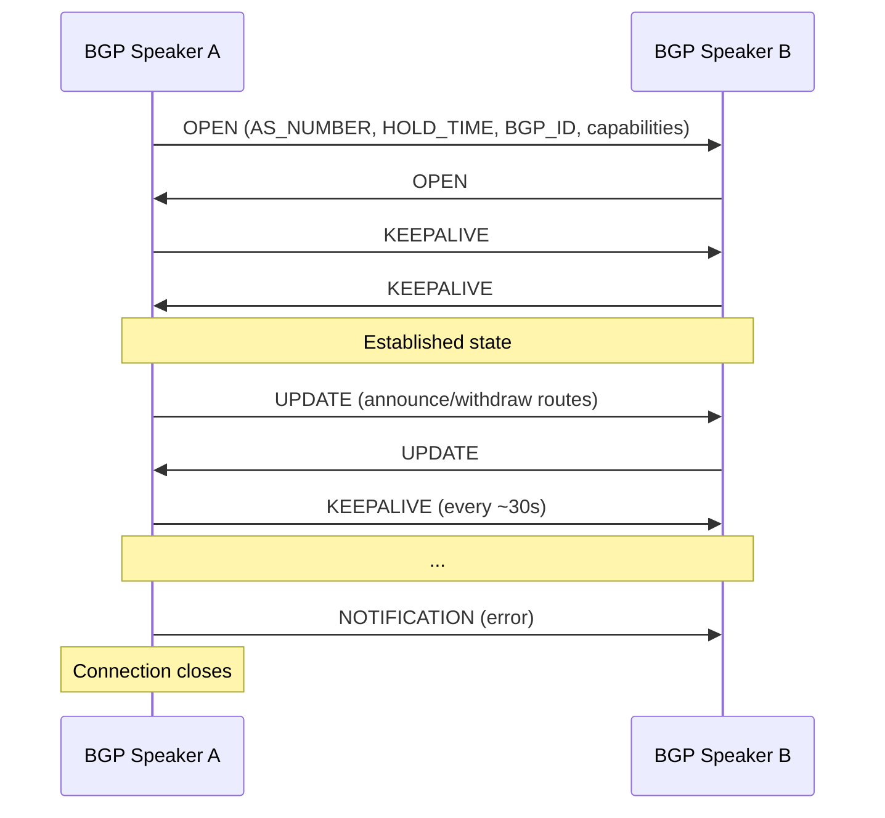
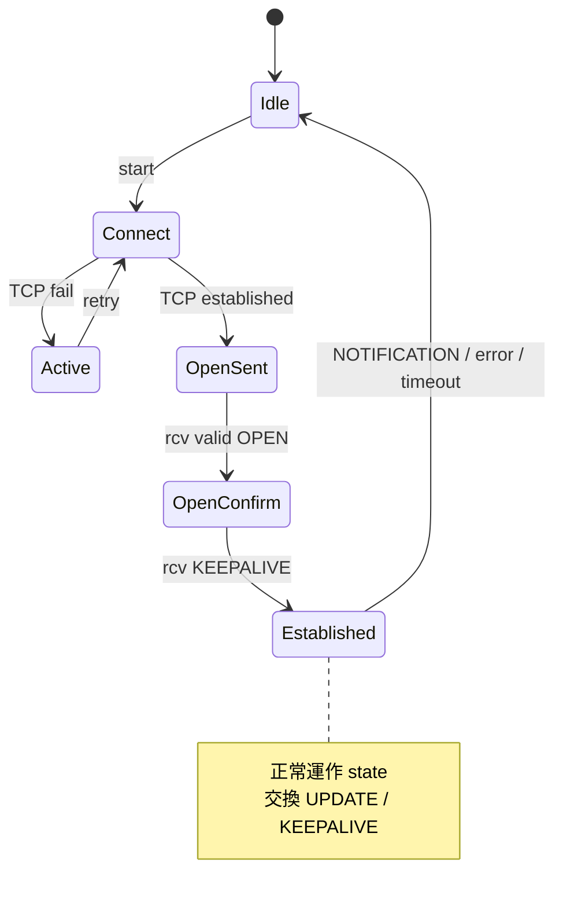

# 課堂 1.15 — BGP：「網際網路為什麼會塞」的根本原因

## 學前知道

- **前置課**：[1.4 IP 路由 + BGP 30 秒入門](./1.4-ip-routing-graph.md)、[1.7 NAT/CGNAT](./1.7-nat-taxonomy.md)
- **預計閱讀時間**：45~55 分鐘
- **必讀規格 / 論文**：
  - **RFC 4271 — A Border Gateway Protocol 4 (BGP-4)** (Rekhter, Li, Hares, 2006) ⭐
  - **RFC 4277 — Experience with the BGP-4 Protocol** (McPherson & Patel, 2006)
  - **RFC 4760 — Multiprotocol Extensions for BGP-4 (MP-BGP)** (Bates, Chandra, Katz, Rekhter, 2007)
  - **RFC 6480 — An Infrastructure to Support Secure Internet Routing (RPKI)** (Lepinski & Kent, 2012)
  - **RFC 6810 / 8210 — RPKI to Router Protocol** (Bush & Austein, 2017)
  - **RFC 8205 — BGPsec Protocol Specification** (Lepinski & Sriram, 2017) — 失敗的 RPKI 升級
  - **RFC 7908 — Problem Definition and Classification of BGP Route Leaks** (Sriram et al., 2016)
  - **RFC 9234 — Route Leak Prevention and Detection Using Roles in UPDATE and OPEN Messages** (Azimov et al., 2022)
  - **Griffin & Wilfong — An Analysis of BGP Convergence Properties** (SIGCOMM 1999) ⭐ — BGP 不收斂性證明
  - **Mahajan, Wetherall, Anderson — Understanding BGP Misconfiguration** (SIGCOMM 2002)
  - **Sermpezis, Kotronis, Gigis, Dimitropoulos, Cicalese, King, Dainotti — A Survey among Network Operators on BGP Prefix Hijacking** (CCR 2018)
  - **Cowie et al. — China's 18-Minute Mystery** (Renesys / Dyn, 2010)（[BGPmon analysis](https://www.bgpmon.net/chinese-isp-hijacked-10-of-the-internet/)）
  - **Demchak & Shavitt — China's Maxim: Leave No Access Point Unexploited** (Military Cyber Affairs 2018) — China Telecom BGP hijack 系統研究
  - **Pilosov & Kapela — Stealing The Internet** (DEFCON 2008) — BGP hijack 公開 PoC
  - **Bhardwaj et al. — Understanding the Impact of Backwall Routing on Network Resilience** (IMC 2020)
  - **Sun et al. — Bamboozling Certificate Authorities with BGP** (USENIX Security 2018) — BGP × CA 攻擊
  - **Snijders et al. — Operational Experience with RPKI** (RIPE / NANOG presentations)
- **必讀原始碼 / 工具**：
  - **BIRD2** <https://bird.network.cz/> — production BGP daemon
  - **FRRouting** <https://frrouting.org/> — Cisco-like syntax open source
  - **OpenBGPD** (OpenBSD) — security-focused
  - **bgpq4** — 從 IRR 生 prefix-list
  - **routinator / OctoRPKI / FORT** — RPKI validators
  - **BGP Looking Glass services**：bgp.he.net、bgpview.io、routeviews.org

---

## 動機

對 Proteus：

1. **Proteus server 部署的 AS / Transit 選擇直接影響 Throughput 與審查抗性**：CN2 GIA / CN2 GT / NTT / Cogent / HE.net 不同 transit 對中國 path 表現差 10 倍以上；機場圈「**BGP 加速**」、「**CN2 GIA 中轉**」這些行話的真實意義必須能精確解讀
2. **GFW 有 BGP 級封鎖能力但成本高**：理論上 GFW 可以對任意 IP prefix 注 BGP null route 全國封；實務上**幾乎不用**因為 selectivity 低（封一個 prefix = 封多用戶）；理解此邊界才能評估 Proteus 「**IP 被燒**」的恢復策略
3. **真實 BGP 事故對 Proteus 有威脅**：2010 China Telecom 18-min hijack、2008 Pakistan YouTube、2018 MyEtherWallet 都展示 BGP 攻擊面是 production reality
4. **RPKI / BGPsec / ROA** 是 BGP 安全的部分解——理解其部署率與 limits 影響 Proteus deployment 信任假設
5. **Griffin-Wilfong 1999 證明 BGP 在 expressive policy 下可能 non-convergence**——這對 Proteus control plane 設計是反面教材（**不要模仿 BGP**）
6. **Anycast 與 BGP 的耦合**：Proteus anycast deployment 直接受 BGP best-path selection 影響——一旦 IP 被 BGP 級封，全球 anycast 都受影響

教科書講 BGP 的問題：技術細節（message types, FSM）講太多——不展開 routing economic / political layer、不講「中轉節點」「BGP 加速」實際含義、不評真實 hijack 事件對 internet 治理的衝擊。本堂從 Proteus 部署視角切入。

---

## 核心概念

### 1. AS (Autonomous System) 與 internet topology

#### 1.1 AS = 同 routing policy 的網路單位

ARIN/RIPE/APNIC/AFRINIC/LACNIC 分配 AS number（ASN）。32-bit ASN (RFC 4893, 2006+) 上限 4B，**2026 已分配 ~120K active ASN**。

每個 AS：
- 有自己的 routing policy（誰是 customer、peer、transit）
- 跑 internal IGP（OSPF / IS-IS）
- 透過 eBGP 與外部 AS 交換 routing info

#### 1.2 Tier 1 / 2 / 3 分層

| Tier | 性質 | 例子 |
|---|---|---|
| **Tier 1** | 不需付任何人 transit fee；全球可達 via settlement-free peering | AT&T (AS7018)、Level3/Lumen (AS3356)、NTT (AS2914)、Telia (AS1299)、Tata (AS6453)、Verizon (AS701) 等 ~15-20 個 |
| **Tier 2** | 部分 settlement-free peering + 部分 paid transit | 多數區域大 ISP，如 Cogent (AS174)、Hurricane Electric (AS6939) 邊界 case |
| **Tier 3** | 只買 transit；無 peering | 多數本地 ISP、企業網 |

「**HE 全球 IPv6 peering 最多**」「**Cogent 與 HE 互不 peer 導致 IPv6 split**」這些圈內 trivia 都是 Tier 結構的真實後果。

#### 1.3 IXP (Internet Exchange Point)

物理 location 多 AS 互換流量。著名 IXP：
- **DE-CIX (Frankfurt)**：歐洲最大，流量 peak > 15 Tbps
- **AMS-IX (Amsterdam)**：第二
- **LINX (London)**
- **HKIX (Hong Kong)**
- **Equinix Singapore**
- **JPNAP / JPIX (Tokyo)**

對 Proteus：**部署在 IXP-rich 位置的 VPS（如 Frankfurt、Tokyo）—— peering 多 → 出口到 transit 跳數少 → latency 低**。中國方向：**Tokyo / Singapore 距離近 + IXP 大 → 優選**。

#### 1.4 中國國際出口的特殊結構

中國 internet 出口 3 個主要 backbone：
- **CN2 (China Telecom Next Generation)**：AS4134 (ChinaNet) 與 AS4809 (CN2 GIA Premium)；CN2 GIA 是商業優質線路（價格 $$$ × ChinaNet）
- **ChinaUnicom CN169**：AS4837
- **ChinaMobile CMI**：AS9808

**「機場 CN2 GIA 中轉」真實意義**：流量從用戶 ChinaTelecom 出 → CN2 GIA 國際段 → 海外 VPS → return path 同樣 CN2 GIA。比一般 transit（Cogent、HE）延遲低 + 高峰丟包小。**這就是「BGP 加速」的具體 mechanism**——其實沒「加速」，是**避開 congested transit**走 premium path。

### 2. BGP message types（RFC 4271）

#### 2.1 4 種 message



- **OPEN**：建立 BGP session，協商 AS、capabilities
- **UPDATE**：宣告新 routes 或 withdraw 舊 routes
- **KEEPALIVE**：定期心跳維持 session（default HOLD_TIME 90s, KEEPALIVE 30s）
- **NOTIFICATION**：報錯後 immediately close session

#### 2.2 BGP FSM (Finite State Machine)



6 states：Idle, Connect, Active, OpenSent, OpenConfirm, Established。

### 3. Path Attributes

UPDATE 的核心：每條 route 帶一組 **path attributes**：

| Attribute | Code | 性質 | 影響 |
|---|---|---|---|
| **ORIGIN** | 1 | well-known mandatory | route 來源（IGP/EGP/Incomplete）；best path 第 5 步 |
| **AS_PATH** | 2 | well-known mandatory | 經過的 AS list；防 loop + best path 第 3 步 |
| **NEXT_HOP** | 3 | well-known mandatory | 下一跳 IP；must be reachable |
| **MED** | 4 | optional non-transitive | Multi-Exit Discriminator；同 AS 多入口時 hint；best path 第 4 步 |
| **LOCAL_PREF** | 5 | well-known | **AS 內**全部 router 共享值；best path **第 2 步**（最高勝）；只在 iBGP 傳遞 |
| **ATOMIC_AGGREGATE** | 6 | well-known discretionary | 此 route 為聚合 |
| **AGGREGATOR** | 7 | optional transitive | 聚合者 AS + IP |
| **COMMUNITY** | 8 | optional transitive | 32-bit tag；無語意；ISP 之間 convention |
| **EXTENDED COMMUNITY** | 16 | extended | RFC 4360；VPN、route target |
| **LARGE COMMUNITY** | 32 | RFC 8092 | 64-bit；4-byte ASN 友善 |

### 4. BGP Best Path Selection（決定哪條入 FIB）

對同一 prefix 收到多條候選 path，BGP **decision process** (RFC 4271 §9.1) 依序：

```
1. Validity check (NEXT_HOP reachable, no AS loop)
2. WEIGHT (Cisco-proprietary local, highest wins)
3. LOCAL_PREF (highest wins, AS-wide)
4. Locally originated > learned
5. Shortest AS_PATH
6. Lowest ORIGIN (IGP=0 < EGP=1 < Incomplete=2)
7. Lowest MED (only among paths from same neighbor AS)
8. eBGP > iBGP
9. Lowest IGP metric to NEXT_HOP
10. eBGP-multipath: install both (ECMP)
11. Oldest path
12. Lowest router ID
13. Lowest neighbor IP address
```

13 步比較——**前 3 步（LOCAL_PREF after validity + weight）覆蓋大多 traffic engineering**。

#### 4.1 LOCAL_PREF 是 AS 內 「**outbound policy 一致化**」工具

AS 內若有多個 eBGP edge router（連不同 transit），各自決定可能不同 → 流量分割不可預期。
LOCAL_PREF **AS-wide 共享**——「**所有 router 同意**從 transit X 出（LOCAL_PREF=200）優於 transit Y（LOCAL_PREF=100）」。

#### 4.2 AS_PATH prepending：常用 traffic engineering 工具

想讓某 prefix 對某方向**少**被選——在 AS_PATH 內**重複自己 AS**：
```
原本：AS_PATH = [your AS, upstream A AS]    長度 2
prepended：AS_PATH = [your AS, your AS, your AS, upstream A]    長度 4
```

Best path 第 5 步「**shortest AS_PATH**」優先 → prepended path 被當「**遠**」，少被選。

**注意（APNIC 2019 警告）**：excessive AS_PATH prepending 是 self-inflicted vulnerability——AS_PATH 過長使 path 完全被 backup 路徑取代，反而引入更多 hijack window。**建議 prepend 不超過 5 次**。

#### 4.3 BGP Communities 是非正式 traffic engineering 工具

`AS:number` format（如 `13335:666`）。**沒語意，純粹 ISP 之間 convention**。常見：
- `64512:666` → 觸發 null route（DDoS scrubbing 共識）
- `prefer-by-100 / prefer-by-200` → ISP-specific LOCAL_PREF 調整
- `do-not-export` → 限制 prefix 範圍

**對 Proteus**：選 transit 時看其 supported communities——好 transit 給 Proteus server admin 細粒度控制。

### 5. iBGP vs eBGP + Route Reflectors

#### 5.1 iBGP 全網狀問題

AS 內 N 個 router 跑 iBGP → 必須 full mesh（n × (n-1) / 2 sessions）。100 router → ~5K sessions——不 scale。

#### 5.2 Route Reflector (RR, RFC 4456)

RR 把所有 router 連成星狀：
- 普通 router → 連 RR（client）
- RR → 反射 routes 給其他 client（違反 iBGP「**learned route 不再 forward**」rule，with proper safeguards）
- 兩層 RR 即可 scale 到 thousands of router

替代方案：**confederation**（RFC 5065）——把大 AS 拆成多個 sub-AS。實際部署 RR 多於 confederation。

### 6. RPKI / ROA / BGPsec

#### 6.1 為什麼需要

BGP 設計上**任何 AS 可宣告任何 prefix**——無認證。⇒ prefix hijack、route leak 是 production reality。

#### 6.2 RPKI（RFC 6480）

「**證明 prefix 屬於哪個 AS**」的 PKI：
- 5 RIR（ARIN/RIPE/APNIC/AFRINIC/LACNIC）作 trust anchor
- IP holder（prefix owner）發 **ROA (Route Origin Authorization)**：「**Prefix X 可由 AS Y 宣告**」
- Validator 軟體（Routinator / FORT / OctoRPKI）下載 ROA + 驗章 → 給 router 一份 valid ROA cache
- Router 在 BGP best path 之外**先**用 RPKI 驗 incoming UPDATE → invalid → reject

#### 6.3 部署現況

- **ROA 覆蓋率**：~50%+ IPv4 prefix, ~60% IPv6（2024）
- **Major ISP / IXP enforcing**：~30-50%（持續增加）
- **缺口**：仍有大量 unsigned prefix；attacker 可 hijack unsigned prefix（**RPKI 只防 已 sign 的 prefix 被 hijack**）

#### 6.4 BGPsec（RFC 8205）— 失敗

設計：把整個 AS_PATH 用 sender's private key 簽——each AS hop add signature。理論驗整條 AS_PATH 合法。

**為什麼失敗**：
- **每 UPDATE 加 signature → packet 巨大化**（典型 4-5×）
- **CPU 與 memory cost 對 router 不可接受**
- **algorithm rollover 痛苦**
- **預設未 deployed**——production 部署 ~0%

**對 Proteus**：RPKI ROA 對 Proteus server prefix 是 nice-to-have（防別人 hijack 你 prefix），但 BGPsec 不指望。

### 7. 真實 BGP 事件（必須讀）

#### 7.1 AS 7007 (1997-04-25)

Florida 小 ISP MAI Network Services 一個工程師誤把 internal 路由表 redistribute 到 BGP——突然宣告 ~75K prefix。
全 internet 對該 ASN 信任此宣告 → 數小時 internet 大規模 routing chaos。

**Lesson**：**single AS misconfiguration 可以全網影響**。後續 prefix filtering 與 max-prefix limit 部分 mitigate。

#### 7.2 Pakistan YouTube blackhole (2008-02-24)

巴基斯坦 ISP PIE 想境內封 YouTube → 宣告 `208.65.153.0/24` 到 internal BGP，但**漏出去**到 PIE 的 upstream → 全球 YouTube 流量 ~2 小時被吸到巴基斯坦然後 drop。

**Lesson**：境內封鎖意圖**洩漏 internationally** = 全球 outage。

#### 7.3 China Telecom 18-min hijack (2010-04-08) ⭐

中國電信 IDC 子公司（AS23724）誤 announce ~37K prefix（含 .gov / .mil / Dell / CNN / Amazon / Geocities 等）——10% 全球 prefix。
**影響**：~15% 全球 traffic 在 18 分鐘內被 redirect 到中國再 forward 回原 dst（**MITM 全球流量**）。

**爭議**：是「**fat finger 配置失誤**」（BGPmon 初判）還是「**故意 BGP 武器化**」（Demchak-Shavitt 2018 後續分析）至今未定論。
**對 Proteus implication**：BGP 級操控是 state-level capability——Proteus 設計**必須假設**對手有此能力，但無 protocol-layer 應對策略——靠基礎設施（RPKI、多 AS 部署、out-of-band signaling）。

#### 7.4 MyEtherWallet hijack (2018-04-24)

俄羅斯 AS 短暫 hijack Amazon Route53 用 prefix → 用戶被引去釣魚站 → ~$152K ETH 被偷。
**Lesson**：BGP hijack 對「**靠 DNS 找 server**」的服務致命——對 Proteus client bootstrap 同樣警示。

#### 7.5 Facebook 2021-10-04 全球 outage

Facebook BGP withdraw 自己所有 prefix（內部變更失誤）→ 6 小時全球 Facebook/WhatsApp/Instagram 全 unavailable。**自殺式錯誤**——但揭示 BGP-driven service availability 脆弱性。

#### 7.6 Cloudflare 2022-06-21 2-hour outage

Cloudflare BGP policy 更新 bug → 部分 IXP 互連斷掉 → ~50% 流量受影響。

⇒ 即便 Tier-1 級營運商也會 BGP 出事。

### 8. 「中轉節點 / BGP 加速」機場行話翻譯

#### 8.1 「中轉」實際意義

不是「**新增加速設備**」，而是**在合適 AS 內加一個 relay VPS**：
- 中國用戶 ↔ 中國電信 ↔ **跨 transit** ↔ 海外 VPS（直接）：延遲高、丟包多（特別 peak hour）
- 中國用戶 ↔ 中國電信 ↔ **CN2 GIA**(premium path)↔ 香港/日本中轉 VPS ↔ ...↔ 海外 VPS：CN2 GIA 段優質

**Relay 是 socks5/wireguard tunnel hop**——不修改 BGP 本身。

#### 8.2 「BGP 加速」typically 意義

商家賣 VPS 時宣稱「**BGP 加速**」——多數情況下指：
1. VPS 機房有**多 transit peering**（BGP multi-homed）
2. 機房自己**做 LOCAL_PREF tweaking**選最優 outbound transit per dst
3. **無神奇技術**——就是好機房 + 好 transit selection

**真正的 BGP-level enhancement**（如 anycast、selective announcement）多數小機房**沒能力**——大廠 like Cloudflare 才有。

#### 8.3 「直連 IP」

部分廠商提供「**直連 IP**」——這個 IP prefix 透過特定 transit（如 ChinaTelecom 自家 CTGNet 或日本 NTT 對中峰值優化路徑）—— 對中國 path latency 低 + 丟包小。**通常價格 2-3× 普通 VPS**。

### 9. 對 Proteus server 部署的具體建議

```yaml
g6_server_deployment_strategy:
  preferred_locations:
    - Tokyo (TYO-IX, JPNAP rich peering)
    - Singapore (Equinix SG-IX)
    - Seoul (KINX)
    - Hong Kong (HKIX—注意政治風險)
    - Frankfurt (DE-CIX) [for non-CN scenarios]

  transit_preference:
    high_priority: CN2 GIA, NTT (AS2914), KDDI (AS2516), Telstra Global, HKIX members
    medium: Cogent (AS174), HE (AS6939) — 對中 path 一般
    avoid: 純 Tier 3，無 Direct China peering

  bgp_announcement:
    your_own_asn: optional but recommended for serious deployment
    rpki_roa: enabled (防 hijack)
    selective_announcement: 可考慮 (eg. only announce to AS 4134/4837/9808 對中)

  multi_homing:
    minimum: 2 distinct transit
    ideal: 3+ with different geo paths

  anycast:
    use_only_if: very mature deployment, multi-instance state replication
    risk: 一個 IP 被封 = 全球 instance 全封
```

---

## 與我們協議設計的關聯

| 設計面 | BGP 知識的影響 |
|---|---|
| **11.1 威脅模型** | BGP-level adversary 必須列入；但承認協議層無對應方法 |
| **11.4 主架構** | server pool 跨多 AS 部署；client 端 multiple endpoint discovery |
| **11.6 握手** | client bootstrap 不依賴單一 endpoint；嘗試 list + fallback |
| **12.6 客戶端整合** | endpoint list 更新機制（透過 control plane） |
| **12.7 服務端** | RPKI ROA enable；transit selection 講究；考慮 BGP-aware health monitoring |
| **12.18 真實環境測試** | 必測不同 transit、不同時段（中國 peak vs off-peak）；不同 path 監測 |
| **9.x GFW** | BGP-level 封鎖 vs selective drop 邊界研究 |

---

## 動手（30 分鐘）

### 任務 1（5 min）：查自己 ASN 與 transit

```bash
# 用 bgp.he.net API
curl -s "https://api.bgpview.io/asn/<your-VPS-AS>/peers" | jq .

# 或 web UI: https://bgp.he.net/AS<number>
# 看 upstream / peers / customers
```

### 任務 2（5 min）：traceroute 看 AS_PATH

```bash
# mtr + AS-aware
mtr -nrwbz vps.example.com -c 5
# `--aslookup` (or `-z`) 顯示每 hop 對應 AS

# Linux 替代
traceroute -A vps.example.com
```

### 任務 3（10 min）：在 LG（looking glass）看實際 BGP

訪問 https://bgp.he.net/ip/your-VPS-IP

觀察：
- 你 VPS 的 prefix 是 /24？/22？
- 從多少 AS 可 reach？
- AS_PATH 長度分佈
- 是否有 RPKI valid 標記

### 任務 4（5 min）：查 China Telecom CN2 GIA path

```bash
# 從中國境內 traceroute 看是否走 CN2 GIA (AS4809)
# (這個必須在中國境內測，海外 traceroute 走不一樣 path)

# 看 BGP route 對某 prefix 的 announcement source
whois -h whois.radb.net "203.0.113.0/24"
```

### 任務 5（5 min）：實際看 RPKI

```bash
# 對任意 IP 查 RPKI status
curl -s "https://rpki-validator.ripe.net/api/v1/validity/AS<asn>/<prefix>" | jq .

# 例如 Cloudflare：
curl -s "https://rpki-validator.ripe.net/api/v1/validity/AS13335/1.1.1.0/24" | jq .
```

---

## 自我檢查

1. AS / Tier 1/2/3 / IXP 三層結構各自意義？Proteus 部署選哪些 IXP-rich 城市最有 latency 優勢？
2. BGP best path selection 13 步前 5 步是什麼？LOCAL_PREF 為何能 override AS_PATH length？對 traffic engineering 意義為何？
3. iBGP full mesh 不 scale 怎麼解？Route Reflector 與 Confederation 的取捨？
4. RPKI 部署率 ~50%——剩下 50% prefix 的 hijack 防護如何？BGPsec 為何失敗？
5. AS 7007 / Pakistan YouTube / China Telecom 2010 三個事件各自 lesson 是什麼？Proteus 部署可學到什麼？
6. 「BGP 加速 / CN2 GIA 中轉」真實技術意義是什麼？對 Proteus server 選 transit 的具體 advice？
7. anycast 與 BGP 的耦合對 Proteus anycast 部署的 advantage 與 risk 各是什麼？
8. Griffin-Wilfong 1999 BGP non-convergence 證明對 Proteus control plane 設計有什麼反面教訓？

---

## 延伸閱讀

- **Stewart — *BGP4: Inter-Domain Routing in the Internet*** — 經典書
- **Halabi — *Internet Routing Architectures*** (Cisco Press) — 工業實務
- **BIRD2 / FRRouting documentation**
- **APNIC Geoff Huston BGP 系列長文** <https://blog.apnic.net/category/routing/bgp/>
- **NANOG mailing list archives** — 北美 ISP 運維一手討論
- **RIPE Routing Working Group**
- **BGPmon / BGPstream archives** — 歷史 incident
- **routeviews.org / RIS** — 公開 BGP 資料
- **Censys / RPKIviews** — RPKI 量測

---

## 研究級補遺

### 1. 學界詞彙

- **AS / ASN / 4-byte ASN (RFC 4893)**
- **Tier 1 / Tier 2 / Tier 3 ISP**
- **IXP / peering / transit / settlement-free peering / paid peering**
- **eBGP / iBGP / RR (Route Reflector, RFC 4456) / Confederation (RFC 5065)**
- **OPEN / UPDATE / KEEPALIVE / NOTIFICATION** (BGP messages)
- **NLRI (Network Layer Reachability Information)**
- **Path attributes**: ORIGIN / AS_PATH / NEXT_HOP / MED / LOCAL_PREF / COMMUNITY / EXT_COMMUNITY / LARGE_COMMUNITY
- **Best path selection 13 steps**
- **Prefix hijack vs Route leak (RFC 7908)**
- **De-aggregation attack**
- **AS_PATH prepending**
- **MOAS (Multiple Origin AS)**
- **AS Path Poisoning** (intentional self-AS in path)
- **RPKI / ROA / TAL (Trust Anchor Locator) / SLURM**
- **BGPsec (RFC 8205) — failed**
- **BGP Roles (RFC 9234) — route leak prevention**
- **BGP Flowspec (RFC 8955) — DDoS mitigation signaling**
- **EVPN (RFC 7432) — DC fabric** (1.3 lesson)
- **MP-BGP (RFC 4760) — multiprotocol extensions**
- **VRF (Virtual Routing & Forwarding)**
- **CN2 GIA / CTGNet / CN169 / CMI** (Chinese international transit lines)
- **Anycast / Unicast**

### 2. 對手分類學

| 對手 | BGP-level 能力 |
|---|---|
| **rogue AS operator** | 宣告非己 prefix；leak routes；prepending abuse |
| **misconfigured legitimate AS** | accidental hijack (AS 7007、Pakistan、Facebook 自身) |
| **state-level adversary**（GFW、Russia AS） | 大規模 selective announcement；null route；transit interception |
| **TLS-aware attacker + BGP** | Sun 2018 USENIX Sec *Bamboozling CA* — BGP hijack + DV cert issuance |
| **transit ISP** | 可 throttle / inspect specific traffic of customers |

### 3. 形式化定義

#### 3.1 BGP best path selection 的形式化

設 AS R 收到 prefix p 的 candidate set C_p = {path_1, ..., path_n}。
**Decision function** δ: C_p → path（單一勝者）。

```
δ(C) = arg_min { (¬valid, ¬local_origin, -local_pref, as_path_len, origin, med, ¬ebgp, igp_metric, age, router_id, neighbor_ip) | path ∈ C }
```

**Property**：δ 是 total order over C —— 任意兩 path 比較有單一勝者（tie-break 到 router ID / neighbor IP 確保 deterministic）。

#### 3.2 BGP convergence（Griffin-Wilfong 1999）⭐

**Theorem (informal)**：存在 BGP policy 配置使得 BGP 動態系統**不收斂**——routes 永久 oscillation。

**證明 sketch**：構造 3 AS 互相 prefer 對方 path 的 cycle → 任一 AS 採用 path 觸發其他 AS 改變 → 永動。

**對 Proteus control plane 反面教訓**：**不要設計可表達**那種「**讓 application 自由設定 policy**」的 protocol——必須限制 expressive power 確保 termination。Raft / Paxos 等 proven algorithm 更佳。

#### 3.3 Prefix hijack 形式化

設 prefix p 的合法 origin AS = A_p（透過 RPKI ROA 確認）。Attacker AS = X。
**Hijack attempt**：X 宣告 path = [X, p]，AS_PATH 長度 1。

對 receiving AS R：
- 若 R 未 enforce RPKI：R 比較 X 的 path 與 A_p 的 path（可能多跳）—若 X path AS_PATH 短 → R 選 X path → 流量到 X
- 若 R enforce RPKI：X path invalid (no ROA for X-p) → 拒

⇒ **RPKI 對 hijack 是 partial defense**——對已簽 prefix 有效，對未簽 prefix 無效。

### 4. 必追論文 / 規格

- ✅ **RFC 4271 BGP-4 (2006)** ⭐ — 必通讀
- ✅ **RFC 6480 RPKI** + **RFC 6810 / 8210 RPKI-to-router**
- ✅ **RFC 7908 Route leak**
- ✅ **Griffin-Wilfong 1999 SIGCOMM** ⭐ — BGP non-convergence
- ✅ **Mahajan et al. 2002 SIGCOMM BGP misconfiguration**
- ✅ **Sermpezis et al. 2018 CCR BGP hijack survey** — 札記 [notes/papers/sermpezis-bgp-hijack-survey-2018.md](../../notes/papers/sermpezis-bgp-hijack-survey-2018.md)
- ✅ **Demchak-Shavitt 2018 China Telecom hijack analysis**
- **Caesar et al. 2005 NSDI RCP** — centralized routing control
- **Singh et al. 2015 SIGCOMM Jupiter Rising** — Google DC BGP
- **Sun et al. 2018 USENIX Sec Bamboozling CA**
- **Cohen et al. 2016 SIGCOMM *Jumpstarting BGP Security with Path-End Validation***
- **Snijders 2018-2024 NANOG presentations on RPKI deployment**
- **RFC 9234 BGP Roles**
- **draft-ietf-grow-rpki-as-cones / draft-ietf-sidrops-aspa**——more recent RPKI extensions

### 5. 我們協議的座標 / 設計取捨

| 設計面 | BGP 影響 |
|---|---|
| **server 部署 transit** | CN2 GIA / NTT / KDDI / Telstra Global preferred；avoid budget transit |
| **multi-AS deployment** | mandatory for resilience；client list 跨 ASN |
| **RPKI ROA** | enable for own prefix；防 hijack |
| **不模仿 BGP 設計** | Proteus control plane 用 Raft/Paxos；不開放 expressive policy |
| **anycast 評估** | 對長連線不友善；對短 lookup 友善；evaluate per use case |
| **client endpoint list** | encrypted control plane 更新；防 list 被 BGP-level intercept |
| **health monitoring** | BGP-aware（觀察 prefix 是否被異常 announce）|

### 6. 必追資源

- **IETF idr WG / sidrops WG** — BGP + RPKI 標準
- **NANOG mailing list** + meetings
- **RIPE Routing WG**
- **APNIC blog** (Geoff Huston) — 持續分析
- **bgp.he.net / bgpview.io / routeviews.org / RIS** — looking glass
- **CAIDA AS Rank** <https://asrank.caida.org/>
- **Cloudflare Radar** — public BGP/internet health
- **routinator / OctoRPKI / FORT** — RPKI validators

### 7. 開放問題

- **RPKI 全網部署的最終比例**：能達到 90%+ 嗎？2024 ~50%，慢
- **BGPsec replacement**：BGPsec 失敗後，**AS Path 完整 authentication 的可行 alternative**？AS Cone / ASPA (Autonomous System Provider Authorization) 是 active draft
- **後量子 RPKI**：當前 RSA/ECDSA——PQ migration timeline
- **AI/ML for BGP anomaly detection**：實時識別 hijack——多 vendor 部署中但 false positive 仍高
- **去中心化 routing alternative**：Yggdrasil、cjdns 等 P2P routing 在 internet scale 可行嗎？未證
- **量化 GFW BGP capability**：學界對 GFW BGP 操控的研究很少——這是 sensitive topic + 缺資料
- **anycast 在 censorship environment 的真實 efficacy**：anycast IP 被封 vs unicast IP rotation 哪個更 robust 對審查？open empirical question
- **形式化 BGP convergence in practical policy subset**：Griffin-Wilfong 是 worst case；real-world policy 子集是否可證 convergence？TLA+ / Coq 部分結果

---

下一堂：**1.16 CDN 與 Anycast**——Cloudflare 的 IP 段、CF Workers 為什麼能當免費中轉、Akamai 的選路邏輯、AWS Global Accelerator；對應 Proteus 「**CDN-fronting**」與 anycast deployment 的具體 trade-off。
