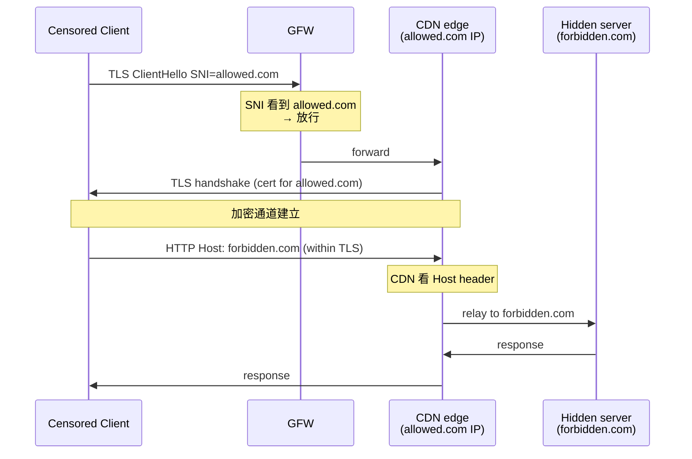

# 課堂 1.16 — CDN 與 Anycast

## 學前知道

- **前置課**：[1.4 路由](./1.4-ip-routing-graph.md)、[1.7 NAT](./1.7-nat-taxonomy.md)（anycast 與 QUIC connection migration 互動）、[1.13 IPv6](./1.13-ipv6-anatomy.md)、[1.14 DNS + ECS](./1.14-dns-anatomy.md)、[1.15 BGP](./1.15-bgp-internet-routing.md)
- **預計閱讀時間**：40~50 分鐘
- **必讀規格 / 論文**：
  - **Fifield, Lan, Hynes, Wegmann, Paxson — Blocking-resistant Communication through Domain Fronting** (PoPETs 2015) ⭐ — meek transport 的奠基論文
  - **Calder, Flavel, Katz-Bassett, Mahajan, Padhye — Analyzing the Performance of an Anycast CDN** (IMC 2015) ⭐
  - **Calder, Fan, Hu, Katz-Bassett, Heidemann, Govindan — Mapping the Expansion of Google's Serving Infrastructure** (IMC 2013)
  - **Calder, Schroeder, Yang et al. — Odin: Microsoft's Scalable Fault-Tolerant CDN Measurement System** (NSDI 2018)
  - **Wei, Heidemann — Whac-A-Mole: Six Years of DNS Spoofing** (CoNEXT 2020)
  - **Frolov, Wampler, Wustrow — Use of TLS in Censored Regions: A Replication Study** (FOCI 2020) — domain fronting 部分情況研究
  - **Bocovich, Goldberg — Slitheen** (CCS 2016) + **Conjure** (CCS 2019) — refraction networking
  - **Markwood et al. — A Closer Look at SSL/TLS Inspection: Domain Fronting in the Wild** — domain fronting alive measurement
  - **Cloudflare blog: How Cloudflare Workers work** + **Cloudflare WARP technical blog**
  - **Apple iCloud Private Relay tech overview** — 大規模 MASQUE deployment
  - **draft-ietf-masque-***（[已在 4.10 lesson 詳述](../part-4-tls-quic/4.10-http3-and-masque.md)）
- **必讀工具與資源**：
  - Cloudflare Workers <https://workers.cloudflare.com/> + cloudflared
  - AWS CloudFront / Lambda@Edge / Global Accelerator
  - Fastly Compute@Edge
  - Vercel Edge Functions
  - Bunny CDN / KeyCDN（更小但可用）
  - **bgp.he.net / radar.cloudflare.com / asrank.caida.org** — anycast 路徑量測

---

## 動機

CDN + Anycast 對 G6 是 **two-edged sword**：

1. **CDN-fronting 是 G6 抗審查的潛在強武器**：把 G6 流量 hide 在 CDN 大流量中。GFW 不能封整個 Cloudflare（會殺很多合法網站）—— 這就是 Fifield 2015 domain fronting 的核心思路
2. **Anycast 對 G6 是 deployment trade-off**：好處：同一 IP 多地宣告 → 用戶自動 routing 到最近 instance；壞處：一旦 IP 被封 → **全球 instance 全封**——無 IP rotation 餘地
3. **Cloudflare Workers 是「免費全球邊緣計算」**：G6 可用 Worker 當 control plane / endpoint discovery / 甚至 data plane 部分 hop——但 ToS 風險真實存在
4. **Apple iCloud Private Relay + Cloudflare WARP 是 production-scale 的 MASQUE-based VPN**：對 GFW 是新類型挑戰；G6 應 study 此 architecture
5. **「Domain fronting 死了」 vs 「Domain fronting 復活」之爭**：2018 Google/Amazon 官方關掉，但**Fastly、Cloudflare、Azure 部分仍可**——具體狀態必須 evidence-based 評估

教科書講 CDN 的問題：用 user perspective 講 caching benefits——不展開 anycast 機制細節、不講 CDN-fronting 對抗審查實踐、不評各家 CDN deployment trade-off。本堂從 G6 部署視角切入。

---

## 核心概念

### 1. CDN 架構基本概念

#### 1.1 CDN 解決什麼

```mermaid
flowchart LR
    O[Origin Server<br/>(in US)] --> E1[Edge node<br/>(Tokyo)]
    O --> E2[Edge node<br/>(Frankfurt)]
    O --> E3[Edge node<br/>(São Paulo)]
    UJP[Japan user] --> E1
    UDE[Germany user] --> E2
    UBR[Brazil user] --> E3
```

- **Latency**：用戶到最近 edge 1-10ms；edge 到 origin 一次後 cache
- **Bandwidth offload**：origin 負擔減 ~90-99%
- **DDoS protection**：edge 吸收攻擊流量
- **HTTPS termination**：edge 處理 TLS，origin 不必

#### 1.2 兩種選 edge 機制

**A. DNS-based redirection (Akamai pioneered)**：
- Client query `www.example.com` → DNS authoritative 看 query 來源（透過 ECS 或 resolver IP）→ 回**該 client 適合的 edge IP**
- Akamai、Google CDN、CloudFront 主用
- **Pros**：精細控制（每 client unique IP）；real-time adjustment；可看 traffic distribute
- **Cons**：依賴 DNS resolution 正確；需大規模 traffic manager 基礎設施

**B. Anycast routing (Cloudflare 主用)**：
- 同一 IP 從多個物理位置 BGP announce
- BGP best-path 自動把 client 導到最近（按 AS_PATH / IGP cost）
- **Pros**：簡單 ops；DDoS 友善（攻擊流量自動分散）；無 traffic manager
- **Cons**：對 client redirection 控制粗（依 BGP）；inter-AS path change → connection 可能切到新 edge → state 不一致

Calder 2015 IMC 量測 Bing anycast：~80% client 連到地理最近 edge，**~20% 連到較遠 edge**——這是 BGP topology 與物理距離不對齊的後果。

#### 1.3 Hybrid 方法

modern CDN（Cloudflare、Fastly）多用 **anycast + DNS hint 混合**——core 走 anycast，但對特定企業客戶可選 GeoDNS optimization。

### 2. Anycast 機制深度

#### 2.1 怎麼工作

```mermaid
flowchart TD
    P["Cloudflare 1.1.1.1/24<br/>announced from 300+ POPs"]
    P -->|BGP announce| ISP_US[ISP A (US)]
    P -->|BGP announce| ISP_EU[ISP B (EU)]
    P -->|BGP announce| ISP_AS[ISP C (Asia)]

    UserUS[US user] -->|BGP picks closest| ISP_US
    UserEU[EU user] --> ISP_EU
    UserAS[Asia user] --> ISP_AS

    ISP_US --> POP_US["Cloudflare US POP"]
    ISP_EU --> POP_EU["Cloudflare EU POP"]
    ISP_AS --> POP_AS["Cloudflare Asia POP"]
```

- Cloudflare 從 ~300+ POP 同時宣告 prefix（如 `1.1.1.0/24` 來自 AS13335）
- 每個 transit ISP 看到多條 path 到該 prefix，**選 AS_PATH 最短 / LOCAL_PREF 最高**
- 該 ISP 客戶送 packet 到 prefix → ISP forward 給其 chosen POP

#### 2.2 Anycast 的 connection state 問題

**TCP/QUIC connection 4-tuple bind**：若 BGP path 中途改變（如某 POP 故障 BGP withdraw）→ 後續 packet 走另一 POP → **該 POP 無 connection state** → 連線斷或 RST。

**Mitigations**：
- **BGP path stability**：CDN 內部不頻繁 announce/withdraw
- **State replication between POPs**：成本高，only state-of-art CDN 做（Cloudflare 對 cache 做但對 TCP socket 不做）
- **Stateless protocol**：QUIC + connection ID 設計可在 POP 間無縫切——理論上但 production 仍 challenging

#### 2.3 對 G6 anycast 部署的 implication

| 屬性 | 部署 anycast | 部署 unicast (multi-IP) |
|---|---|---|
| **用戶端** | 自動連最近，無需 list 管理 | 需要 endpoint list + Happy Eyeballs-style |
| **被封風險** | **一封全封**——無 escape | per-IP 黑名單，可逐 IP rotate |
| **長連線** | BGP shift 可能斷連線 | stable per-flow |
| **DDoS** | 自然分散 | 集中某 IP 上 |
| **延遲** | optimal for first connect | 取決 client 算法選擇 |
| **複雜度** | 需自己 ASN + BGP peering | 多 VPS 即可 |

**結論**：**baseline G6 走 unicast multi-IP**；anycast 留給「**Cloudflare Worker-fronted 部分流量**」這種特殊架構。

### 3. Cloudflare specific 深度

#### 3.1 Cloudflare 的 IP 段

Cloudflare 用 AS13335 公開 IP list at <https://www.cloudflare.com/ips/>：
- IPv4：~30 個 prefix (e.g. 104.16.0.0/13, 172.64.0.0/13, 162.158.0.0/15)
- IPv6：~10 個 prefix (e.g. 2606:4700::/32, 2a06:98c0::/29)

**所有 Cloudflare 客戶 (~30M 網站) 共用這些 IP**——GFW 不能封整段（殺太多無辜）。

#### 3.2 Cloudflare Workers

**Workers** = serverless edge compute，跑在 Cloudflare 所有 POP 上：
- **JavaScript / WASM**
- **Free tier**：100K requests/day / Worker
- **Latency**：~5ms cold start, < 1ms warm
- **Use case for G6**：
  - Endpoint discovery (Worker as API gateway)
  - Lightweight relay (TCP/WebSocket through Workers)
  - DNS-over-Worker (custom DoH)

**ToS 風險**：Cloudflare 對 VPN / proxy use 在 free tier 模糊——high traffic 可能被 throttle 或 ban。**production G6 不應主要依賴**。

#### 3.3 Cloudflare Spectrum + Tunnel

- **Spectrum**（付費）：proxy 任意 TCP/UDP through Cloudflare anycast
- **cloudflared / Tunnel**：origin server 主動建 outbound connection 到 Cloudflare（不需要 origin 公網 IP）

**對 G6**：可用 Cloudflare Tunnel 把 G6 server 「**藏**」在 Cloudflare 後——origin 無公網 IP，外部只看到 Cloudflare IP。**強力對抗 IP-based block**——但對 GFW selective drop 仍可能 vulnerable（Cloudflare 流量 GFW 可 selectivity throttle）。

#### 3.4 Cloudflare WARP

Cloudflare 自家的 consumer VPN，**基於 WireGuard + MASQUE**：
- 客戶端走 QUIC 連 Cloudflare 任意 POP（anycast）
- 內部 MASQUE CONNECT-IP 把所有 traffic relay
- ~6M+ active users globally
- 對 GFW：**部分時段可用，部分時段 selectivity throttle**

**對 G6 是直接 competitor 也是 architectural reference**——WARP 顯示「**big CDN-anycast-based VPN at scale**」是可行 model。

### 4. 其他 CDN 簡述

#### 4.1 Akamai

- 最老 CDN（1998 創）；DNS-based redirection 起家
- ~365,000 servers globally
- 對 G6 不主流——cost 過高、無 free tier、anti-circumvention 嚴格

#### 4.2 AWS CloudFront + Global Accelerator + Lambda@Edge

- **CloudFront**：DNS-based CDN，~400+ POP
- **Global Accelerator**：anycast IP + Route 53 hybrid
- **Lambda@Edge**：類似 Cloudflare Workers，但 cold start 更慢
- **對 G6**：可用，但 AWS 對 circumvention use cases**嚴格**——曾發生 (e.g. Signal CloudFront fronting 被 AWS 自己關)

#### 4.3 Fastly + Compute@Edge

- ~75 POP，全 anycast
- Compute@Edge: WASM serverless（更開放標準）
- Signal 2018 後遷到 Fastly + Google App Engine 等
- 對 G6：可選擇——比 Cloudflare 更技術中立但少 free tier

#### 4.4 Bunny CDN / KeyCDN / DigitalOcean Spaces CDN

小型，價格便宜，**對 circumvention use case 普遍不 enforce**。**G6 中小規模 deployment 可行 alternative**。

### 5. Domain Fronting：Fifield 2015 PoPETs ⭐

#### 5.1 原理



**核心**：TLS SNI（看得見）標 `allowed.com`，HTTP Host header（加密內）標 `forbidden.com`。GFW 看 SNI 放行，CDN 看 Host routing 到正確 origin。

**前提**：`allowed.com` 與 `forbidden.com` **共享同一 CDN edge**——這樣 CDN 才能根據 Host route。**Cloudflare 把所有客戶混在同 IP 段** → 完美適配。

#### 5.2 為什麼 work（早期）

- GFW 不能封整個 CDN IP（殺 Google/Amazon/Microsoft 後果嚴重）
- 加密 Host header → 看不出真實 target
- 流量看起來像 普通 HTTPS to popular site

#### 5.3 為什麼後來受限

**2018 之後**：
- **Google App Engine** 主動禁 domain fronting（Tor meek-google 被殺）
- **AWS CloudFront** 跟進
- **Azure** 一段時間後也部分限制
- **Cloudflare** 至 2024 仍**部分允許**（depending on plan / endpoint config）

**現實**：domain fronting 沒死，但 **viable 的前端越來越少 + 每家 CDN 動態變化**。**G6 不能把 fronting 當 baseline**——只能作 fallback。

#### 5.4 Fronting 替代品：SNI 加密 (ECH)

ECH（[1.14 lesson](./1.14-dns-anatomy.md)） 把 SNI 加密——**不需** fronting trick。
- **理想**：ECH 部署 → fronting obsolete
- **現實**：ECH 部署緩慢 + GFW 對 ECH 已開始 selective drop——**2024 fronting 與 ECH 並存**

### 6. CDN-fronting 設計模式（G6 角度）

#### 6.1 Mode A: CDN as data plane

```
G6 client → CDN edge (TLS+SNI 看似 allowed.com) → CDN → G6 origin server
```

- **Pros**：全程匿名於 CDN；anti-block 強
- **Cons**：CDN 流量 cost；ToS 風險；CDN 看到 plain G6 流量（信任 CDN）
- **適合**：小規模、key user

#### 6.2 Mode B: CDN as endpoint discovery

```
G6 client → CDN Worker (取得 endpoint list) → direct G6 origin
```

- **Pros**：CDN 只負擔 control plane（小流量）；不違 CDN ToS
- **Cons**：endpoint IP 仍可被封
- **適合**：baseline 推薦——control 走 CDN、data 走 unicast

#### 6.3 Mode C: WARP-style MASQUE

```
G6 client → CDN anycast POP via QUIC + MASQUE CONNECT-UDP → G6 origin
```

- **Pros**：流量加密 + tunneling；CDN 是 G6 信任邊界
- **Cons**：需 CDN 支援 MASQUE relay（Cloudflare 已支援 WARP，他人 access 限制）
- **適合**：long-term direction，但需 production maturity

### 7. 對 G6 anycast deployment 評估矩陣

| 屬性 | G6 不 anycast (multi-IP unicast) | G6 anycast |
|---|---|---|
| **deployment 複雜度** | 低 | 高 (需 ASN + BGP peering) |
| **cost** | 低 | 高 (peering + IXP) |
| **客戶端側 list 管理** | 必要 | 不需 (DNS 直接給 anycast IP) |
| **IP 被封風險** | 逐 IP rotate 容易 | 整段被封 |
| **延遲** | client-side smart selection | BGP-based, ~80% 最優 |
| **長連線 stability** | 高 | BGP shift 風險 |
| **DDoS protection** | 自己處理 | 自然分散 |
| **適合場景** | 多 user、變動 client、廣泛地理 | special use case (DNS / control plane) |

**G6 baseline 推薦**：multi-IP unicast；anycast 留給 control plane / endpoint discovery / DNS-like 小流量用例。

### 8. iCloud Private Relay：production-scale 案例研究

Apple 2021 推出，**對 G6 設計極具參考**：

#### 8.1 架構

```
iOS device → ingress proxy (Apple-operated) → egress proxy (Cloudflare/Fastly/Akamai operated)
                                                          ↓
                                                       Internet
```

- **Two-hop design**：Apple 第一跳知道你身份（iCloud account）但**不知 target**；CDN 第二跳知 target 但**不知你身份**
- **MASQUE over QUIC**：CONNECT-UDP / CONNECT-IP tunneling
- **Trust split**：兩家不同公司營運，**只有 collude 才能 deanonymize**

#### 8.2 對 G6 設計的啟示

- **Two-hop with trust split** 是 strong privacy primitive——G6 v2 可考慮
- **MASQUE over QUIC** 是 protocol baseline
- **Big CDN partnership** 給 anonymity set（千萬 user 流量混合）
- **GFW 對 iCloud Private Relay**：**完全封 by GFW**——「太強」對 censor 是 red flag——G6 baseline 不能 mimic 此 architecture 對 GFW

### 9. CDN 與 ECS 互動的隱性 implications

[1.14 lesson](./1.14-dns-anatomy.md) 提到 ECS。CDN 場景：
- **DNS-based CDN**：ECS 必需——不然 CDN 看不到 client geo → 給錯 edge
- **Anycast CDN**：ECS 不必要——BGP 自動 select

**對 G6**：
- 若 G6 用 CDN-fronting（依賴 CDN 邊緣選擇）+ user 用 1.1.1.1（不傳 ECS）→ user 拿到 random / sub-optimal edge → latency 差
- 若 user 用 8.8.8.8（傳 ECS）→ 較好 edge but 隱私洩漏 client geo

⇒ G6 client 設計：**自己做 DoH to specific resolver**，控 ECS policy。

---

## 與我們協議設計的關聯

| 設計面 | CDN/Anycast 知識的影響 |
|---|---|
| **11.1 威脅模型** | CDN-based deployment 的 trust assumption；anycast collateral damage |
| **11.4 主架構** | baseline multi-IP unicast；可選 CDN-fronted control plane |
| **11.6 握手** | endpoint discovery 可走 CDN Worker；data plane 直連 |
| **12.6 客戶端整合** | DNS-aware (ECS) + Worker-based endpoint refresh |
| **12.7 服務端** | optional Cloudflare Tunnel hiding；evaluate Fastly/Bunny 替代 |
| **12.13 真實環境** | 必測 CDN-fronted 與 direct 兩種；不同 CDN provider 對 GFW 的抗性 |

---

## 動手（30 分鐘）

### 任務 1（5 min）：Cloudflare anycast 觀察

```bash
# 從不同地點 ping 1.1.1.1 - 應該都 latency 低
# (因為走 anycast 到最近 Cloudflare POP)
ping -c 5 1.1.1.1

# 看 traceroute 路徑
mtr -nrwbz 1.1.1.1 -c 5

# 對比 Google DNS（同樣 anycast）
ping -c 5 8.8.8.8
```

### 任務 2（10 min）：domain fronting alive test

```bash
# 經 Cloudflare 對某 domain 嘗試 fronting
# 注意：可能不再 work——這是 evidence-based testing

# Test 1: SNI=allowed CDN domain, Host=test domain
curl -v -H "Host: target.example.com" \
     --resolve target.example.com:443:104.16.0.1 \
     https://allowed-domain.example.com/

# 觀察是否成功
# 對比直連 target.example.com
```

### 任務 3（5 min）：Cloudflare Worker 簡單部署

```bash
# 用 wrangler CLI
npm i -g wrangler
wrangler init my-test-worker
cd my-test-worker
# edit src/index.js
# wrangler deploy
# 拿到 *.workers.dev URL
```

```javascript
// src/index.js
export default {
  async fetch(request, env, ctx) {
    return new Response(`Hello from ${request.headers.get('cf-ipcountry')}`, {
      headers: { 'Content-Type': 'text/plain' }
    });
  }
};
```

### 任務 4（10 min）：實際 BGP-level CDN 觀察

```bash
# 對 Cloudflare 1.1.1.1 看 BGP path
# 透過 looking glass
curl -s "https://api.bgpview.io/asn/13335/prefixes" | jq '.data.ipv4_prefixes[:5]'

# 看 prefix 對應 BGP announcement source
# AS13335 = Cloudflare
```

---

## 自我檢查

1. CDN 兩種 edge selection（DNS-based vs anycast）各自 pros/cons？Calder 2015 IMC 觀察為何 anycast ~20% 子最優？
2. Cloudflare 把所有 ~30M 客戶混在 ~40 IP prefix——對 GFW 的 collateral damage 邏輯為何使其難封？
3. Domain fronting (Fifield 2015) 為何 2018 後受限？哪些 CDN 仍 viable？ECH 取代 fronting 的時程預估？
4. iCloud Private Relay two-hop trust split 設計對 G6 v2 是 architecture reference 還是反面教材？
5. G6 baseline 為何不走 anycast？什麼條件下 control plane / endpoint discovery 用 anycast 合理？
6. Cloudflare Worker / Fastly Compute@Edge 對 G6 是 opportunity 還是 ToS risk？production 部署判斷 framework？
7. ECS 與 CDN edge selection 的互動——G6 client 該如何處理 ECS 隱私 vs latency 取捨？

---

## 延伸閱讀

- **Cloudflare blog** <https://blog.cloudflare.com/> — CDN engineering 一線
- **Fastly blog** <https://www.fastly.com/blog/>
- **Apple iCloud Private Relay developer docs**
- **AWS CloudFront whitepapers**
- **BGPmon / BGPstream archives** — anycast incident history
- **Censys CDN measurement** <https://search.censys.io/>
- **Tor Project meek pluggable transport documentation**

---

## 研究級補遺

### 1. 學界詞彙

- **CDN (Content Delivery Network) / POP (Point of Presence)**
- **Anycast / Unicast / Multicast**
- **DNS-based redirection / IP-based redirection**
- **Edge / Origin / Cache / TTL / Stale-while-revalidate**
- **Domain fronting / SNI-based blocking**
- **Encrypted Client Hello (ECH)** vs **domain fronting**
- **Cloudflare Workers / Lambda@Edge / Compute@Edge / Vercel Edge Functions**
- **WAF (Web Application Firewall)**
- **DDoS mitigation / scrubbing**
- **Cloudflare Magic Transit** (DDoS protection L3)
- **Cloudflare Spectrum** (L4 TCP/UDP proxy)
- **MASQUE / CONNECT-UDP / CONNECT-IP** (already in 4.10)
- **iCloud Private Relay (Apple-Cloudflare/Fastly/Akamai trust split)**
- **WARP (Cloudflare consumer VPN)**
- **Refraction networking / Decoy routing** (Slitheen, Conjure)
- **meek pluggable transport (Tor's domain fronting)**

### 2. 對手分類學

| 對手 | CDN-relevant 能力 |
|---|---|
| **GFW** | selective drop based on flow features (不能 wholesale block CDN)；time-based throttling |
| **CDN operator 自身** | 可主動禁 fronting；可移除 user account |
| **CA + ISP 串謀** | 偽造 cert 攻擊 (但 CT log 部分 mitigate) |
| **CDN 與 censor 合作** | 直接交出 metadata（罕見但發生過 e.g. AWS handing over data） |
| **TLS-aware adversary** | even ECH 部署也可能 fingerprint based on flow pattern |

### 3. 形式化定義

#### 3.1 Anycast catchment

設 anycast prefix p 被 N 個 POP announce。對 user u，**catchment** C(u) ∈ {POP_1, ..., POP_N} = u 的 traffic 實際 reach 的 POP。

**Property**：在 stable BGP state 下，C(u) 是 deterministic（取決 BGP path computation）。
**Property（fault tolerance）**：若 POP_i 失效，C 自動 reroute 到 POP_j（依 BGP convergence time）。
**Property（calder 2015 measurement）**：對 80% user, C(u) 是 geographically closest；20% sub-optimal。

#### 3.2 Domain fronting 安全性

設 CDN edge IP I_C, allowed domain A_a, forbidden domain F_f, censor C。

**Censor 的 view**：
- DNS query: A_a → I_C
- TLS ClientHello SNI: A_a
- Encrypted body 不可見

**CDN 內部 routing**：
- Receive TLS connection at I_C
- Decrypt → see HTTP Host: F_f → route to F_f's origin

**Indistinguishability**：對 censor，到 A_a 與到 F_f 的流量 indistinguishable（都看似到 I_C 加密訪問 A_a）。
**前提**：A_a 與 F_f 同 CDN 同 edge IP；censor 不能 wholesale block A_a（collateral damage 高）。

**失效條件**：
- CDN 拒實作 host-based routing（2018 Google 之舉）
- CDN 主動 detect fronting pattern 並 disable
- TLS ECH 部署使 fronting 顯不必要（仍 future）

### 4. 必追論文 / 規格

- ✅ **Fifield 2015 PoPETs Domain Fronting** ⭐
- ✅ **Calder 2015 IMC Anycast CDN** ⭐
- ✅ **Calder 2018 NSDI Odin**
- **Calder 2013 IMC Google infrastructure**
- **Wei & Heidemann 2020 CoNEXT *Whac-A-Mole***
- **Bocovich-Goldberg 2016 CCS Slitheen / 2019 CCS Conjure** — refraction networking
- **Markwood et al. CDN-fronting in the wild**
- **Frolov 2020 FOCI TLS in Censored Regions**
- **Apple iCloud Private Relay tech overview**
- **Cloudflare research blog systematic posts**

### 5. 我們協議的座標 / 設計取捨

| 設計面 | CDN 影響 |
|---|---|
| **baseline multi-IP unicast** | server pool 多 location |
| **CDN-fronted control plane** | optional but recommended——Worker as endpoint discovery |
| **anycast for DNS or small data** | yes |
| **anycast for main G6 data plane** | no——封掉風險太集中 |
| **ECH integration** | 取代 fronting in long run |
| **trust split design** | study iCloud Private Relay—v2 evaluate two-hop |
| **anti-fingerprinting at CDN edge** | CDN sees plaintext G6 protocol——consider end-to-end encryption past CDN |

### 6. 必追資源

- **CDN 各家 engineering blog**
- **IXP / NOG （NANOG, RIPE, APRICOT, AfNOG）meetings**
- **CAIDA topology / anycast research**
- **Cloudflare Radar** — public BGP / DNS / CDN health
- **BGPmon / BGPstream**
- **APNIC blog (Geoff Huston) anycast / CDN 系列**

### 7. 開放問題

- **Domain fronting 的長期可行性**：ECH 部署後 fronting obsolete？實際 timeline 不明
- **GFW 對 CDN 的長期戰略**：selective throttle 仍是 main weapon？是否會增加 attack？
- **去中心化 CDN**：IPFS, Filecoin 等是否能取代傳統 CDN？scale 與 performance 證明仍待
- **匿名 CDN deployment**：G6 self-host CDN-like layer 跨多 small VPS 是否可行？open
- **iCloud Private Relay 在 GFW 內的真實 efficacy 量化**：systematic measurement 缺
- **CDN-level traffic fingerprinting**：CDN edge 可看 plain HTTPS（除 ECH）——是否成為 censorship 工具？
- **CDN ToS 與 circumvention 的長期 tension**：CDN 商業利益 vs anti-censorship 公益——平衡點如何？
- **量子 CDN signaling**：anycast BGP 是 cleartext routing——後量子 BGP signaling 對 CDN 影響

---

下一堂：**1.17 把所有東西串起來：「點開 google.com 的 50ms」**——real pcap frame-by-frame：從 ARP/DHCP 到 DNS（DoH）到 TCP+TLS+ECH 到 HTTP/3 到 render；對應 G6 設計時必須考慮的「**真實世界連線時序**」。
