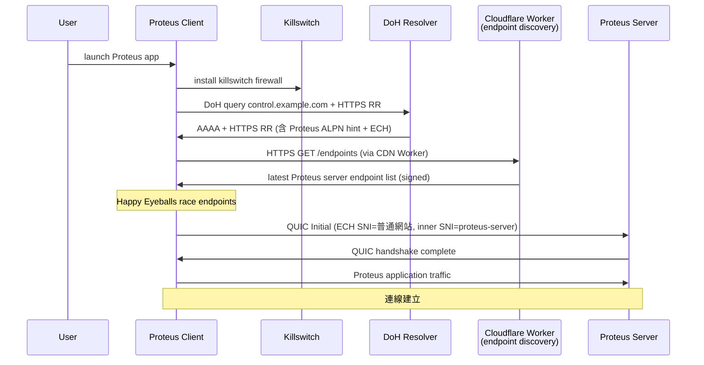

# 課堂 1.17 — 把所有東西串起來：「點開 google.com 的 50ms」

## 學前知道

- **前置課**：Part 1 的 1.1~1.16 全部
- **預計閱讀時間**：45~55 分鐘（這是 Part 1 的 capstone / synthesis lesson）
- **必讀規格**：1.1-1.16 引用的所有 RFC 與 paper——本堂不引新材料，是綜合應用
- **必讀原始碼**：建議在 Wireshark / chrome://net-export 自己抓一次完整 trace 對照

---

## 動機

過去 16 堂分別講 分層 / PHY / Ethernet / IP / ARP / ICMP / NAT / TCP×3 / UDP / IPv6 / DNS / BGP / CDN——**每堂獨立**。但**真實世界一次 HTTP request 觸發所有這些 layer 互動**——若無法把它們**整合**還原成真實時序，前 16 堂就沒到位。

本堂目標：**逐 frame 解析 「點開 google.com 到頁面 paint 完成」 的 50ms**，把 Part 1 學到的全部觀念**還原成 chronological 事件序列**，每個 frame 標明：
- 哪一層（L2 / L3 / L4 / L5+）
- 觸發哪個 RFC mechanism
- 用了 Part 1 哪一堂的知識
- 可能 fail 的點 + 對 Proteus 設計的啟示

**對 Proteus**：Proteus client 啟動時的 boot sequence **本質上就是 modified version of 這個 50ms**——把握這 50ms 的時序就把握 Proteus client design 的骨架。

教科書講「點開網頁的流程」典型只列 5 步（DNS → TCP → TLS → HTTP → render），**完全跳過**：
- DHCP / NDP / ARP 預先發生的事
- Happy Eyeballs 真實時序
- HTTPS RR / SVCB / ECH 在哪個時點 query
- HTTP/3 vs HTTP/2 怎麼決定
- 同 page 後續 100+ subrequest 的時序
- Critical Rendering Path

本堂全部展開——對應 Part 1 「**深度準繩**：能在 Wireshark 抓任何封包逐 byte 解釋」這個出口要求。

---

## 核心：50ms 的逐 frame 還原

**前提場景**：
- 客戶端：MacBook（dual-stack: WiFi 5GHz + cellular 5G）
- 已連 home WiFi 一段時間（NDP/DHCP/ARP cache 都熱）
- Chrome 瀏覽器，DoH 預設啟用（Cloudflare 1.1.1.1）
- ISP：FTTH 1Gbps，往 Google 邊緣 ~10ms RTT
- 對 google.com 是**首次訪問**（無 HTTP cache，無 connection coalescing）

```mermaid
gantt
    title 點開 google.com 的 50ms timeline
    dateFormat X
    axisFormat %s ms
    section Boot pre-req
    DHCP/NDP/ARP cache (已熱)              :done, prereq, 0, 0.1ms
    section DNS
    Chrome cache check                      :done, cache, 0, 0.5ms
    HSTS preload force HTTPS                :done, hsts, 0.5, 1ms
    DoH AAAA + HTTPS RR query               :active, doh1, 1, 6ms
    Happy Eyeballs DoH A query (delayed 50ms)  :doh2, 51, 51ms
    section Transport
    QUIC Initial to 142.x.x.x:443           :crit, quic1, 6, 11ms
    QUIC handshake complete + 0-RTT data   :quic2, 11, 22ms
    section HTTP
    HTTP/3 GET / on stream 0                :h3req, 22, 33ms
    Initial HTML chunk received             :h3resp, 33, 35ms
    section Subresource
    DNS for fonts/css/js (cached after first) :subdns, 35, 38ms
    Parallel QUIC streams for sub-resources :substreams, 35, 50ms
    section Render
    HTML parsed + CSSOM + DOM construction  :render, 35, 48ms
    First Contentful Paint                  :crit, fcp, 48, 50ms
```

### Phase 1: t = 0 ~ 1ms — Browser internal

#### 1. Chrome URL bar 接受 input

用戶輸入 `google.com` + Enter。Chrome 處理：
- **URL normalization**：`google.com` → `https://google.com/`（為什麼 https？見下）
- **HSTS preload check**：Chrome 內建 HSTS preload list（含 `google.com`）—— **強制 HTTPS**，user 即便輸入 `http://` 也升 https
- **Local cache check**：HTTP cache / disk cache 是否有對 `google.com/` 的 entry？若有 + still fresh → **skip network entirely**

**前置課**：[0.x（瀏覽器 architecture，未在 Part 1 但相關）]

**對 Proteus 啟示**：
- Proteus client 也需要 endpoint normalization（typo correction、protocol scheme defaulting）
- Proteus endpoint preload list 可借鏡 HSTS preload 機制——「**內建可信 Proteus server list**」防 DNS poisoning

#### 2. Network stack init

- 確認 NIC 已 ready (從 OS 拿 routing table) — **這預先在 OS boot 時透過 DHCP / SLAAC / DNS 配 nameserver、NTP 等**
- WiFi 已 associate 到 AP — **這在連 SSID 時 802.11 MAC layer 完成**
- ARP cache 內 gateway IP → MAC 已 cached（[1.5 lesson](./1.5-arp-ndp-dhcp.md)）
- IPv6 SLAAC 已配 stable + temporary address（[1.5 lesson, RFC 8981/7217](./1.5-arp-ndp-dhcp.md)）

**所有這些都在「點開」之前完成——典型 < 0.1ms 因 cache 熱**。

### Phase 2: t = 1 ~ 6ms — DNS resolution

#### 3. Resolver selection（DoH 而非 plain DNS）

Chrome 預設 DoH（Cloudflare 1.1.1.1 via `https://cloudflare-dns.com/dns-query`）。
若 DoH connection 已存在（previous DoH lookup） → reuse；否則 connect first。

**典型場景：DoH connection reused**（previous lookups in last 60s）。

#### 4. Parallel A + AAAA + HTTPS RR query

Chrome 同時發送（[Happy Eyeballs v2, RFC 8305](./1.13-ipv6-anatomy.md) + [SVCB, RFC 9460](./1.14-dns-anatomy.md)）：
- **AAAA** for `google.com` （v6 優先）
- **HTTPS** RR for `google.com` （拿 ALPN + ECH config + IP hints）
- **A** for `google.com` （Happy Eyeballs delay ~50ms 後若 AAAA 沒回）

```
t = 1ms:  Chrome → DoH server: query AAAA google.com
t = 1ms:  Chrome → DoH server: query HTTPS google.com
t = 4ms:  DoH server → Chrome: AAAA 2607:f8b0:4004:c08::65 (TTL=300)
t = 4ms:  DoH server → Chrome: HTTPS 1 . alpn="h3,h2" ipv4hint=142.250.x.x ipv6hint=2607:... ech=AED+...
t = 5ms:  Chrome → DoH server: query A google.com (Happy Eyeballs interleaved)
t = 6ms:  DoH server → Chrome: A 142.250.x.x (TTL=300)
```

⇒ **5ms 內拿到 dual-stack address + ALPN hint + ECH config**。

#### 5. Address selection (RFC 6724)

Chrome 拿到 4 個候選 (A, AAAA from DNS + HTTPS RR ipv4/v6 hints)。RFC 6724 排序：
- Prefer global scope match
- Prefer matching IPv6 (your address ↔ target address)
- Prefer label match
- → IPv6 first

**前置課**：[1.13 IPv6 + Happy Eyeballs](./1.13-ipv6-anatomy.md)、[1.14 DNS](./1.14-dns-anatomy.md)

**對 Proteus 啟示**：Proteus client 同樣應發 dual-stack lookup + HTTPS RR——獲取 Proteus-specific ALPN + ECH 後一次解析。

### Phase 3: t = 6 ~ 11ms — QUIC handshake initial

#### 6. QUIC Initial packet 構造

Chrome 用 HTTPS RR 的 ALPN hint：`h3` 優先。決定走 QUIC。

```
QUIC Initial packet (t=6ms):
  Version: 0x00000001 (QUIC v1, RFC 9000)
  DCID: random 8-20 byte (client choose)
  SCID: random 8-20 byte
  Token: empty (first connect, no retry)
  Payload: encrypted CRYPTO frame containing TLS 1.3 ClientHello
    - SNI: <ECH 加密後不見明文>
    - Outer SNI: cloudflare-ech.com (decoy)
    - Inner SNI (ECH-encrypted): google.com
    - ALPN: h3
    - key_share: X25519 ephemeral
    - signature_algorithms: ed25519, ecdsa_secp256r1_sha256, rsa_pss_*
    - psk_key_exchange_modes: psk_dhe_ke
    - QUIC transport parameters: max_streams, initial_max_data, ...
  PADDING: ensure packet >= 1200 byte (RFC 9000 mandate)
```

**這個 Initial packet ≥ 1200 byte 是 RFC 9000 鐵律**——避免 amplification attack + 確保 DPLPMTUD baseline。

#### 7. UDP packet 走 OS network stack

```
TLS-encrypted ClientHello (>=1200B)
  ↓
QUIC packet header + 加密 payload
  ↓
UDP datagram (port src=ephemeral, dst=443)
  ↓
IPv6 packet (src=temp address per RFC 8981, dst=google IPv6)
  ↓
Ethernet frame (src=MAC, dst=gateway MAC from ARP/NDP cache)
  ↓
WiFi 802.11 frame (with WPA3 encryption)
  ↓
Wire
```

**前置課**：[1.2 PHY/MAC](./1.2-physical-and-phy-mac.md)、[1.3 Ethernet](./1.3-ethernet-l2.md)、[1.4 IP routing](./1.4-ip-routing-graph.md)、[1.12 UDP](./1.12-udp-anatomy.md)

#### 8. ISP path

```
家 WiFi → home router → ISP CMTS/OLT → ISP backbone → IXP → Google peering
```

每跳 ~1ms。對 Google：多數 ISP 直接 peer Google（AS15169）→ 通常 3-5 跳到 edge。

#### 9. Google edge POP processing

```
Google edge (anycast IP, 多 POP 共享同 IP)：
  - BGP best-path 已把 packet 導到 closest POP
  - QUIC server endpoint 接收
  - Decrypt Initial → see ECH outer SNI → decrypt ECH → see inner SNI=google.com
  - 處理 ClientHello → 構造 ServerHello + Encrypted Extensions + Certificate + CertVerify + Finished
  - 同 Initial response 內 send back
```

#### 10. QUIC Initial response (t=11ms)

```
Server → Client (t=11ms):
  QUIC Initial: ACK + CRYPTO frame containing TLS ServerHello + ...
  QUIC Handshake: Certificate (X.509 chain) + CertificateVerify (sig) + Finished
```

⇒ **5ms RTT 內 QUIC + TLS handshake 基本完成**——比 TCP+TLS (3 RTT for first time) 快 3x。

### Phase 4: t = 11 ~ 22ms — QUIC handshake complete + 0-RTT data

#### 11. Client 收 ServerHello + Cert，完成 handshake

Client 用 server's ephemeral key + 自己 ephemeral key → DH → 算出 handshake secret + traffic secrets。

#### 12. Application data first transmission

```
Client → Server (t=12ms):
  QUIC 1-RTT packet (encrypted with application traffic secret)
    STREAM frame (stream_id=0, offset=0):
      HTTP/3 frames:
        HEADERS frame:
          :method: GET
          :scheme: https
          :authority: google.com
          :path: /
          user-agent: Mozilla/5.0...
          accept: text/html,...
          accept-encoding: gzip, br, zstd
          accept-language: zh-TW,en-US,...
```

QUIC stream 0 client-initiated bidirectional → carries HTTP/3 request.

#### 13. Server response start (t=22ms)

```
Server → Client (t=22ms):
  QUIC 1-RTT packet:
    STREAM frame (stream_id=0):
      HTTP/3 HEADERS frame:
        :status: 200
        content-type: text/html; charset=UTF-8
        content-encoding: br
        alt-svc: h3=":443"; ma=86400
        ...
      HTTP/3 DATA frame (compressed HTML body chunk 1)
```

**11ms 從第一 Initial 到 application data**——比 TCP+TLS 1.2 需要 4 RTT (~40ms)強很多。

### Phase 5: t = 22 ~ 48ms — Subresource fetch + render

#### 14. HTML parser 啟動 (t=23ms)

Browser 接到 first HTML chunk，**立即** 開始 parse（不等 full body）：
- Build DOM tree incrementally
- Discover `<link rel=stylesheet>`, `<script src>`, `` 等
- **Preload scanner** 同時掃描 head 內所有 subresource URL → 提前發 DNS + connection

#### 15. Subresource fetching

```
t = 24ms: Parse <link rel=stylesheet href="//www.google.com/...">
          → 同 connection? Connection coalescing (HTTP/3)
          → 同 host google.com → reuse existing QUIC connection
          → open new QUIC stream
          → HTTP/3 GET <css path>

t = 26ms: Parse <script src="//fonts.googleapis.com/...">
          → fonts.googleapis.com ≠ google.com
          → new DNS lookup (cached due to same DoH connection)
          → new QUIC connection or coalesce (depends on cert SAN)

t = 28ms+: Multiple parallel QUIC streams for img / script / css / json / ...
```

QUIC 多 stream 平行**無 HoL blocking**（不像 HTTP/2 over TCP 一個 packet loss 卡所有 stream）。

#### 16. CSSOM + Render Tree (t=35ms)

- CSS 接收 → 建 CSSOM
- DOM + CSSOM → Render Tree
- Layout（box positioning）
- Paint

#### 17. First Contentful Paint (t=48ms)

第一個 visible content 顯示。後續 incremental update。

### Phase 6: t = 48 ~ 50ms — Connection persistence

- QUIC connection 保持 idle，等待後續用戶 input
- Background：connection migration 探測（若 user 移動或 WiFi 變 cellular）
- 後續 navigate：connection reuse → 從第 11 步開始（0-RTT 可能 used）

### 全程使用的 RFC / mechanism 表

| 時點 | 機制 | 對應 lesson |
|---|---|---|
| t < 0 | DHCP/NDP/ARP/SLAAC | [1.5](./1.5-arp-ndp-dhcp.md) |
| t < 0 | OS routing table (LC-trie FIB) | [1.4](./1.4-ip-routing-graph.md) |
| 0-1 | HSTS preload check | [1.14 lesson 部分提及] |
| 1-6 | DoH (RFC 8484) + Happy Eyeballs (RFC 8305) + SVCB/HTTPS RR (RFC 9460) | [1.13](./1.13-ipv6-anatomy.md) / [1.14](./1.14-dns-anatomy.md) |
| 6 | RFC 6724 default address selection | [1.13](./1.13-ipv6-anatomy.md) |
| 6-11 | QUIC Initial + TLS 1.3 + ECH | [1.12 UDP base](./1.12-udp-anatomy.md) + 4.x QUIC |
| 6 | IPv6 SLAAC src address | [1.5](./1.5-arp-ndp-dhcp.md) / [1.13](./1.13-ipv6-anatomy.md) |
| 6 | DPLPMTUD baseline (≥1200 byte) | [1.6](./1.6-icmp-deep.md) / [1.12](./1.12-udp-anatomy.md) |
| 6+ | NAT mapping (if behind NAT) | [1.7](./1.7-nat-taxonomy.md) |
| 6+ | NIC offload (TSO/USO/GRO/RSS) | [1.2](./1.2-physical-and-phy-mac.md) / [1.11](./1.11-tcp-advanced.md) |
| 6+ | ECMP path selection (5-tuple hash on UDP) | [1.4](./1.4-ip-routing-graph.md) |
| 6+ | BGP-routed transit + anycast catchment (Google edge) | [1.15](./1.15-bgp-internet-routing.md) / [1.16](./1.16-cdn-anycast.md) |
| 11-22 | QUIC ACK + RACK-TLP loss detection | [1.9 (TCP RACK-TLP)](./1.9-tcp-reliable-delivery.md) / 4.x QUIC RFC 9002 |
| 11-22 | QUIC CC (BBR or CUBIC) | [1.10](./1.10-tcp-congestion-control.md) |
| 22+ | HTTP/3 (RFC 9114) with QPACK (RFC 9204) | 4.x |
| 35+ | Browser render | 不在 Part 1 |
| 48+ | Connection migration potential | [1.7 QUIC migration](./1.7-nat-taxonomy.md) |

### 失敗時序分析（每個 phase 可能 fail 的點）

#### A. DNS phase 失敗

| 失敗 | 表現 | mitigations |
|---|---|---|
| GFW DNS injection | 拿到 forged IP | DoH bypass + forged IP detection |
| DoH endpoint blocked | DoH connection 起不來 | fallback DoQ / plain DNS over Tor / IP preconfig |
| HTTPS RR not returned | ECH 與 ALPN hint 缺 | regular A/AAAA + Happy Eyeballs |
| CNAME chain too long | latency 翻倍 | CDN side limit |

#### B. Transport phase 失敗

| 失敗 | 表現 | mitigations |
|---|---|---|
| QUIC blocked by middlebox | Initial packet drop | fallback HTTPS/TLS over TCP |
| IPv6 path broken | v6 connection timeout | Happy Eyeballs delay fallback v4 |
| PMTU blackhole | large packet 後 stall | DPLPMTUD probe |
| NAT rebinding mid-flow | connection 變新 4-tuple | QUIC connection migration |
| RST injection (TCP fallback) | 連線斷 | QUIC immune; TCP need REALITY-style obfuscation |

#### C. TLS phase 失敗

| 失敗 | 表現 | mitigations |
|---|---|---|
| Cert invalid | handshake fail | OCSP stapling / CT log |
| ECH config stale | ECH decryption fail → fallback | client retry without ECH |
| SNI inspection block | TLS 1.2 retry maybe with ESNI | upgrade to TLS 1.3 with ECH |
| Time sync issue (cert validity) | rejected cert | NTP sync |

#### D. HTTP phase 失敗

| 失敗 | 表現 | mitigations |
|---|---|---|
| HTTP 5xx server error | retry or alternative endpoint | client-side retry policy |
| 302 redirect loop | infinite | browser detects |
| Large response stall | bandwidth bottleneck | DC pacing + CC |

### 對 Proteus client 啟動的 1:1 映射

Proteus client 啟動序列 **本質上是這個 50ms 的 modified version**：



**時序比 google.com 慢**（多一個 CDN endpoint discovery hop），但 architectural 同構。

---

## 與我們協議設計的關聯

這堂課**本身就是 Proteus client design 的 architectural reference**：

| google.com 50ms 環節 | Proteus 對應設計 |
|---|---|
| HSTS preload | Proteus server preload list (內建可信 endpoint) |
| DoH first | Proteus client 同 DoH baseline |
| HTTPS RR + ALPN | Proteus publish HTTPS RR 含 Proteus custom ALPN |
| ECH | Proteus baseline ECH usage |
| Happy Eyeballs v2 | Proteus across-endpoint Happy Eyeballs |
| QUIC Initial >= 1200B | Proteus 同 QUIC RFC 9000 baseline |
| Connection coalescing | Proteus 多 service 同 connection |
| Anycast/edge POP | Proteus multi-IP unicast (反 anycast) |
| Connection migration | Proteus inherit QUIC migration |

---

## 動手（45 分鐘）

### 任務 1（15 min）：抓自己 google.com 完整 trace

```bash
# 開 Chrome with net-export
# chrome://net-export/ → start logging
# 訪問 google.com (incognito 避免 cache)
# stop logging → 拿到 .json file

# 同時 tcpdump
sudo tcpdump -i en0 -nn -w /tmp/google.pcap host google.com or host cloudflare-dns.com -c 200

# 用 Wireshark 開 .pcap：
# 1. 找 first DoH HTTPS query
# 2. 找 first QUIC Initial to Google
# 3. 算 QUIC handshake total RTT
# 4. 對比本堂時序——你看到的延遲分佈跟我們預測的一致嗎？

# 對應 chrome net-export viewer：
# https://netlog-viewer.appspot.com/ - 上傳 .json 看 detailed timeline
```

### 任務 2（10 min）：發現自己的延遲拆解

```bash
# 用 curl 測各 phase
curl -w "@-" -o /dev/null -s https://www.google.com/ <<'EOF'
DNS Lookup:        %{time_namelookup}s
TCP Connect:       %{time_connect}s
TLS Handshake:     %{time_appconnect}s
Pre-transfer:      %{time_pretransfer}s
Start Transfer:    %{time_starttransfer}s
Total:             %{time_total}s
EOF

# 對 HTTP/3 (need curl with quiche)
curl --http3 -w "@-" -o /dev/null -s https://www.cloudflare.com/ <<'EOF'
Total: %{time_total}s
EOF
```

對比 HTTP/2 vs HTTP/3 你的 path 上差幾 ms。

### 任務 3（10 min）：可視化整個 50ms

把 chrome://net-export 的 .json 餵給 https://netlog-viewer.appspot.com/

逐 event 看：
- HOST_RESOLVER_IMPL_REQUEST → DoH query
- QUIC_SESSION → Initial packet
- HTTP_TRANSACTION → request/response
- URL_REQUEST 全部 timing

寫一個自己的 timeline，標明每個 ms 發生什麼。

### 任務 4（10 min）：對自己 Proteus connection 做同樣分析

```bash
# 用 Proteus client (e.g. sing-box / clash-meta) 啟動 verbose log
# 同時 tcpdump
sudo tcpdump -i en0 -nn -w /tmp/proteus.pcap host <your Proteus server>

# 連到 Proteus 後訪問任意 url
# stop tcpdump

# Wireshark 看：
# 1. DNS lookup Proteus server (if applicable)
# 2. Proteus handshake (QUIC or TLS)
# 3. Application traffic begin

# 對比 google.com 時序——你 Proteus 連線比 google.com 慢多少？哪部分最大？
```

---

## 自我檢查

1. 點開 google.com 在用戶看到 paint 之前**至少**經過幾個 RFC 機制？嘗試列出 ≥ 15 個。
2. Happy Eyeballs v2 的 DNS query 與 connection attempt 各自 delay 是多少？為何這樣設計？
3. QUIC Initial packet 為何 ≥ 1200 byte？這個下限與 path MTU 變化的關係？
4. HTTPS RR (RFC 9460) 把 4 個原本獨立的事整合：A/AAAA/ALPN/ECH config。**這個整合對 latency 與 anti-fingerprint 的雙重影響**？
5. 為什麼 QUIC + TLS 1.3 + 0-RTT 比傳統 TCP + TLS 1.2 快 ~3x？把節省的 RTT 一一對應到 protocol design 改變。
6. Connection coalescing 在 HTTP/3 比 HTTP/2 更激進——為什麼？對 Proteus server 設計有何啟示？
7. 若 google.com handshake 在 t=6ms 失敗（網路問題），browser 怎麼 recover？對 Proteus client failure handling 啟示？
8. 同 page 100+ subresource 的時序怎麼安排？preload scanner 機制對 Proteus v2 多 service deployment 啟示？

---

## 延伸閱讀

- **High Performance Browser Networking** by Ilya Grigorik <https://hpbn.co/> — 經典免費書
- **What Every Programmer Should Know About Memory** (Ulrich Drepper) — 互補
- **Web Performance in Action** (Jeremy Wagner)
- **Chrome net-internals** chrome://net-internals/#dns
- **Chrome DevTools Performance panel** — 自己 page render breakdown
- **Cloudflare blog: Speeding up TLS** 系列
- **Internet Society RPKI / DNS / IPv6 deployment tracker**

---

## 研究級補遺

### 1. 學界詞彙

- **HSTS (HTTP Strict Transport Security, RFC 6797) + HSTS preload list**
- **Connection coalescing** (HTTP/2 RFC 7540 §9.1.1, HTTP/3 RFC 9114)
- **Preload scanner** (browser-specific)
- **Critical Rendering Path / FCP / LCP / TTI / CLS** (web vitals)
- **Connection reuse** (across requests via same QUIC/TCP connection)
- **0-RTT / 1-RTT / 2-RTT handshake**
- **DNS prefetch / preconnect / prerender** (`<link rel=...>`)
- **HTTP/3 priority** (RFC 9218)
- **Origin trial / SPA / fetch API / Server-Sent Events / WebSocket / WebTransport** — modern web

### 2. 對手分類學

| 對手位置 | 對 50ms 流程的可干擾點 |
|---|---|
| **on-path passive** | 看時序 + size pattern + SNI (除 ECH) |
| **on-path active** | DNS injection、TCP RST、TLS strip、SNI block、QUIC selective drop |
| **off-path** | 仍可注 forged DNS / TCP RST 但成功率低 |
| **TLS-aware MITM** (corporate / state cert) | 偽 cert decrypt 全流量 |
| **GFW** | 對 google.com 持續 selective block；對 1.1.1.1 部分 throttle |

### 3. 形式化定義（簡略）

#### 3.1 端到端延遲分解

```
T_total = T_dns + T_connect + T_tls + T_request + T_first_byte + T_download + T_render

對 first-visit Google.com:
T_dns       ≈ 5ms   (DoH with warm connection)
T_connect   ≈ 5ms   (1 RTT to edge)
T_tls       ≈ 0ms   (合在 QUIC handshake)
T_request   ≈ 0.5ms (HTTP/3 GET)
T_first_byte ≈ 10ms (server processing + return)
T_download  ≈ 10ms  (depending on size)
T_render    ≈ 15ms  (DOM/CSSOM/layout/paint)
```

對 returning visit with 0-RTT：
- T_dns reuses cache → 0ms
- T_connect 0-RTT → application data immediately → effective 0ms
- T_request bundled with 0-RTT → 0ms
- **可達 ~10ms FCP**——這是 modern web 對 returning user 的目標

#### 3.2 安全 invariants

對整個 50ms 流程：
- **Authentication**：server cert 來自 CA chain to trust root
- **Confidentiality**：TLS 1.3 + ECH 後 application data 加密
- **Integrity**：每 QUIC packet HMAC verification
- **Forward secrecy**：ephemeral DH key exchange
- **Replay protection**：QUIC 0-RTT 透過 single-use ticket + transport parameter constraints

**Vulnerabilities**（仍存在）：
- DNS phase 仍部分可 inject（特別 ECH 未部署時 SNI 暴露）
- Cert MITM 可能（cert pinning 部分 mitigate）
- Side channel (timing, size pattern) 仍洩漏 high-level info

### 4. 必追論文 / 規格

本堂無新引用——全部已在前 16 堂涵蓋。建議重讀：
- 各 lesson 的 必讀 paper / RFC 列表

### 5. 我們協議的座標

Proteus client boot sequence:

```yaml
g6_boot_sequence:
  pre_check:
    - install killswitch firewall
    - detect captive portal (1.5)
    - sample DHCP options (rogue detect)
  dns:
    - DoH query for Proteus control endpoint
    - HTTPS RR for ALPN + ECH + IP hints
    - Happy Eyeballs v2 across endpoints
  control_plane:
    - HTTPS request to Cloudflare Worker (or similar)
    - retrieve signed endpoint list (Proteus server pool)
    - rotate based on health + geo
  data_plane:
    - QUIC handshake to selected Proteus server
    - ECH encrypted SNI (innerSNI = Proteus-specific)
    - ALPN custom = "proteus/1"
    - 0-RTT if returning + ticket valid + idempotent first op
  steady_state:
    - heartbeat 25s jittered (NAT keepalive)
    - connection migration on path change
    - silently rotate connection ID
```

### 6. 必追資源

- **Web Performance Working Group (W3C)**
- **Chrome / Firefox / Safari performance teams blogs**
- **Cloudflare Radar latency measurement**
- **Catchpoint / Pingdom / Calibre measurement services**

### 7. 開放問題

- **0-RTT replay protection 的 limit**：QUIC 0-RTT 對 idempotent op 安全；non-idempotent 是 trade-off
- **Connection migration 對 anti-fingerprint 影響**：PATH_CHALLENGE/RESPONSE pattern 可能成 fingerprint
- **CDN edge POP fingerprint**：anycast catchment 可洩漏 client geo
- **TLS 1.3 + ECH + post-quantum key exchange 的 timing impact**：PQ key exchange 增加 handshake size + CPU
- **DoH bootstrap chicken-egg**：first time DoH lookup 需要 DoH endpoint 的 IP——這個 IP 是否需要 plain DNS 先解？多數 client 預配
- **Cross-origin connection coalescing 與 anti-fingerprint**：同 cert 多 SAN 可 coalesce → 透露 visit pattern
- **HTTP/3 priority (RFC 9218) 部署率**：browser 大多支援；server 部分；對 perf 與 traffic shape 影響待量化
- **Connection migration 跨 ISP 的失敗 mode**：mobile carrier transit 與 fixed broadband 對 PATH_VALIDATION 反應不一致

---

下一堂：**1.18 Linux 網路 stack 巡禮**——skbuff 結構、netfilter hooks、qdisc、TC；一個封包從 NIC 到 socket 的完整路徑；對 Proteus server 在 Linux 上的部署位置抉擇。Part 1 finale。
