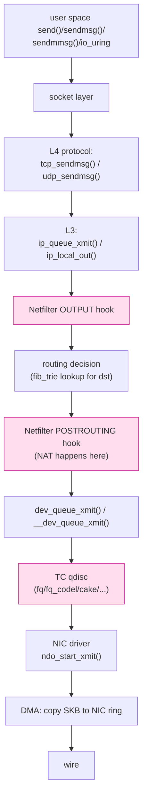
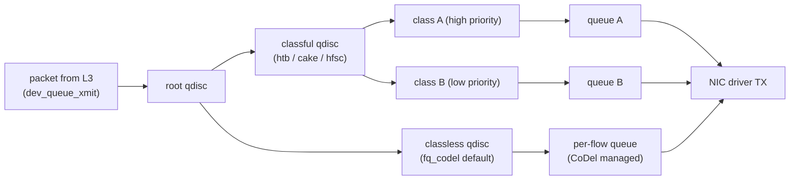

# 課堂 1.18 — Linux 網路 stack 巡禮（Part 1 finale）

## 學前知道

- **前置課**：Part 1 1.1~1.17——本堂把所有 protocol 知識落到 Linux kernel 實作
- **預計閱讀時間**：50~60 分鐘（Part 1 finale，最密一堂）
- **必讀規格 / 論文 / 文檔**：
  - **Linux Foundation Wiki — Kernel Flow** <https://wiki.linuxfoundation.org/networking/kernel_flow>
  - **Linux Kernel docs — struct sk_buff** <https://docs.kernel.org/networking/skbuff.html>
  - **Linux Kernel docs — netfilter / nftables** <https://docs.kernel.org/networking/index.html>
  - **Linux Kernel docs — Traffic Control (tc)** in `Documentation/networking/`
  - **Stephan & Wüstrich — The Path of a Packet Through the Linux Kernel** (TUM 2024) <https://www.net.in.tum.de/fileadmin/TUM/NET/NET-2024-04-1/NET-2024-04-1_16.pdf> ⭐ — 最新 walkthrough
  - **Mogul & Ramakrishnan — Receive Livelock** (TOCS 1997)（[已 precis](../../notes/papers/mogul-livelock.md)） — NAPI 起源
  - **Rizzo — netmap** (USENIX ATC 2012)（[已 precis](../../notes/papers/rizzo-netmap.md)） — kernel bypass
  - **Han et al. — MegaPipe** (OSDI 2012)（[已 precis](../../notes/papers/han-megapipe.md)） — socket API redesign
  - **Brendan Gregg — Linux Performance** <https://www.brendangregg.com/linuxperf.html>
  - **Cilium documentation** <https://docs.cilium.io/> — eBPF / XDP 工程典範
  - **Cloudflare blog 多篇 about Linux networking internals**
- **必讀原始碼**（kernel 6.x mainline）：
  - **NIC RX/TX 主路徑**：`net/core/dev.c` (`netif_rx`, `netif_receive_skb`, `__netif_receive_skb_core`, `dev_queue_xmit`)
  - **IP layer**：`net/ipv4/ip_input.c` (`ip_rcv`, `ip_local_deliver`), `net/ipv4/ip_output.c`
  - **TCP entry**：`net/ipv4/tcp_ipv4.c` (`tcp_v4_rcv`, `tcp_v4_do_rcv`)
  - **UDP entry**：`net/ipv4/udp.c` (`udp_rcv`, `__udp4_lib_rcv`)
  - **sk_buff**：`include/linux/skbuff.h` (struct sk_buff), `net/core/skbuff.c`
  - **NAPI**：`net/core/dev.c` (`napi_poll`, `__napi_schedule`)
  - **softirq**：`net/core/dev.c` (`net_rx_action`, `net_tx_action`)
  - **netfilter**：`net/netfilter/`, `include/linux/netfilter.h`
  - **TC / qdisc**：`net/sched/`
  - **eBPF / XDP**：`net/core/filter.c`, `kernel/bpf/`

---

## 動機

本堂是 Part 1 的 **finale**——把過去 17 堂的 protocol 知識**全部** map 到 Linux kernel 的具體 data structure 與 code path。為什麼必須懂這層：

1. **G6 server 跑在 Linux 上**——理解 packet 從 NIC 到 G6 process 走過哪些 code，才知道哪裡可以優化
2. **G6 可選的 packet interception 點不只一個**：
   - User space（QUIC socket）：簡單但慢
   - eBPF socket filter / cgroup-bpf：mid-level
   - TC ingress / Netfilter：lower
   - XDP：driver layer，極快 + 極受限
   - DPDK / netmap：完全 bypass kernel
   **選哪一層** depends on throughput / portability / debug / 安全 tradeoff
3. **Linux 是大多 production proxy（V2Ray、sing-box、Hysteria）的部署 host**——這些工具的效能瓶頸常在 kernel 而非 user space
4. **netfilter / nftables / TC / qdisc 是 G6 server 部署必須懂的工具**——killswitch、流量整形、DDoS 防護全要用
5. **eBPF / XDP 是 2026 SOTA**——Cilium、Katran、Hysteria-TCP-Brutal 都靠 eBPF。**理解 Linux 網路 stack 是 eBPF 上手的前提**

教科書講 Linux networking 的問題：要嘛太淺（**「socket → kernel → NIC**」 一句話）要嘛太深（純看 source code 迷失）。本堂走中道：從**一個 packet 完整路徑**出發，每個 code path 精確到檔案 + 函數名 + 主要動作——讀者可以拿 source 並對。

---

## 核心：sk_buff 是 Linux 網路 stack 的「中心」

### 1. struct sk_buff（簡稱 skb）

```c
// include/linux/skbuff.h（簡化）
struct sk_buff {
    union {
        struct {
            struct sk_buff      *next;   // doubly linked list
            struct sk_buff      *prev;
            // ...
        };
        struct rb_node          rbnode;  // for TCP out-of-order queue
        // ...
    };

    struct net_device   *dev;            // 哪個 interface
    struct sock         *sk;             // 對應 socket（若有）

    // 三個 pointer 確定 packet 邊界
    sk_buff_data_t      tail;
    sk_buff_data_t      end;
    unsigned char       *head;
    unsigned char       *data;

    // 各層 header offset
    __u16               transport_header; // TCP/UDP/ICMP header
    __u16               network_header;   // IP header
    __u16               mac_header;       // Ethernet header

    unsigned int        len;            // total len
    unsigned int        data_len;       // 含 fragment
    unsigned char       *priv;
    __be16              protocol;       // EtherType
    __u16               hash;           // RSS hash
    __u32               priority;       // QoS
    __u8                csum_complete;
    // ... + 100+ metadata fields
};
```

#### skb 的 4 個 pointer 表達 「**3 個 boundary 在線性 buffer 內滑動**」

```
buffer:    [headroom][L2 header][L3 header][L4 header][payload][tailroom]
                     ^          ^          ^         ^
                  mac_header  network_   transport_  end of data
                              header     header

head ──→ buffer start
data ──→ current "useful data" start（隨 protocol stripping 推進）
tail ──→ current "useful data" end
end ──→ buffer end
```

當 packet 從 NIC 進來：
- `head` = `data` = raw buffer 起點
- `tail` = `head + packet_len`
- 處理過 L2 → `data` += sizeof(eth_header)（往內推 14 byte）
- 處理過 L3 → `data` += sizeof(ip_header)
- 處理過 L4 → `data` += sizeof(tcp_header)
- 剩下就是 application payload

⇒ **無 memcpy**——只調整 pointer。**這就是 Linux network stack zero-copy 的核心 mechanism**。

### 2. 接收路徑 RX：從 NIC 到 socket（完整流程）

```mermaid
flowchart TD
    NIC[NIC hardware<br/>(packet 抵達)] --> DMA["DMA writes packet to<br/>NIC ring buffer slot"]
    DMA --> HWIRQ["HardIRQ: NIC fires interrupt<br/>(CPU interrupted)"]
    HWIRQ --> NAPI["NAPI: schedule SoftIRQ NET_RX<br/>+ disable HW interrupts"]
    NAPI --> SOFTIRQ["SoftIRQ NET_RX_SOFTIRQ:<br/>net_rx_action()"]
    SOFTIRQ --> POLL["napi_poll(): 從 ring buffer 拉 packet"]
    POLL --> SKB_ALLOC["分配 sk_buff,<br/>copy/map packet data"]
    SKB_ALLOC --> GRO["GRO merge:<br/>合併 small packet 成大 super-packet"]
    GRO --> XDP_INGRESS{"XDP hook attached?"}
    XDP_INGRESS -->|yes| XDP["XDP eBPF program:<br/>DROP/PASS/TX/REDIRECT"]
    XDP -->|PASS| NETIF["netif_receive_skb()"]
    XDP_INGRESS -->|no| NETIF
    NETIF --> TAP["packet taps (tcpdump):<br/>ptype_all hook"]
    TAP --> TCINGRESS["TC ingress qdisc<br/>(if attached)"]
    TCINGRESS --> PROTO_DISPATCH{"protocol type?"}
    PROTO_DISPATCH -->|IPv4| IP_RCV["ip_rcv()"]
    PROTO_DISPATCH -->|IPv6| IPV6_RCV["ipv6_rcv()"]
    PROTO_DISPATCH -->|ARP| ARP_RCV["arp_rcv()"]
    IP_RCV --> NF_PREROUTING["Netfilter PREROUTING hook<br/>(nft/iptables nat+raw+mangle)"]
    NF_PREROUTING --> ROUTE["routing decision:<br/>ip_route_input()<br/>(fib_trie lookup)"]
    ROUTE -->|local| LOCAL_DELIVER["ip_local_deliver()"]
    ROUTE -->|forward| FORWARD["ip_forward()"]
    LOCAL_DELIVER --> NF_INPUT["Netfilter LOCAL_IN hook<br/>(filter table)"]
    NF_INPUT --> PROTO_L4{"L4 protocol?"}
    PROTO_L4 -->|TCP| TCP_RCV["tcp_v4_rcv()<br/>net/ipv4/tcp_ipv4.c"]
    PROTO_L4 -->|UDP| UDP_RCV["udp_rcv()<br/>net/ipv4/udp.c"]
    PROTO_L4 -->|ICMP| ICMP_RCV["icmp_rcv()"]
    TCP_RCV --> SOCK_LOOKUP["socket lookup:<br/>hash on 4-tuple"]
    SOCK_LOOKUP --> TCP_STATE["TCP state machine"]
    TCP_STATE --> SK_QUEUE["queue to socket's<br/>sk_receive_queue"]
    SK_QUEUE --> WAKE["sk_data_ready():<br/>wake epoll/poll waiter"]
    WAKE --> USER["userspace returns from<br/>read()/recv()/epoll_wait()"]

    classDef hot fill:#fde,stroke:#c39
    classDef bypass fill:#dfd,stroke:#3c3
    class XDP_INGRESS,XDP bypass
    class NF_PREROUTING,NF_INPUT hot
    class TCP_RCV,UDP_RCV hot
```

### 3. 接收路徑 RX 細節

#### 3.1 HardIRQ + NAPI（[Mogul 1997 livelock 起源](../../notes/papers/mogul-livelock.md)）

```c
// drivers/net/ethernet/intel/ixgbe/ixgbe_main.c（範例）
static irqreturn_t ixgbe_msix_clean_rings(int irq, void *data) {
    struct ixgbe_q_vector *q_vector = data;
    if (q_vector->rx.ring || q_vector->tx.ring)
        napi_schedule_irqoff(&q_vector->napi);  // 排 NAPI
    return IRQ_HANDLED;
}
```

NAPI 把 HW interrupt 轉成 polling——避免 livelock。

#### 3.2 net_rx_action（soft IRQ context）

```c
// net/core/dev.c
static __latent_entropy void net_rx_action(struct softirq_action *h) {
    struct softnet_data *sd = this_cpu_ptr(&softnet_data);
    unsigned long time_limit = jiffies + 2;  // 2 jiffies time slice
    int budget = netdev_budget;  // default 300 packets

    while (!list_empty(&sd->poll_list)) {
        struct napi_struct *n;
        n = list_first_entry(&sd->poll_list, struct napi_struct, poll_list);
        budget -= napi_poll(n, &repoll);
        if (unlikely(budget <= 0 || time_is_before_jiffies(time_limit)))
            break;
    }
    // 若 budget 耗盡 → 退出 soft IRQ，下次再來
}
```

**`netdev_budget` 與 `netdev_budget_usecs`** sysctl 控 NAPI 一次處理上限：
- `/proc/sys/net/core/netdev_budget` default 300
- `/proc/sys/net/core/netdev_budget_usecs` default 2000 (2ms)

#### 3.3 netif_receive_skb 分派

```c
// net/core/dev.c
int __netif_receive_skb_core(struct sk_buff **pskb, bool pfmemalloc) {
    // ...
    list_for_each_entry_rcu(ptype, &ptype_all, list) {
        if (!ptype->dev || ptype->dev == skb->dev) {
            // 給 tcpdump 等 packet sniffer
            deliver_skb(skb, pt_prev, orig_dev);
        }
    }
    // TC ingress hook
    skb = sch_handle_ingress(skb, &pt_prev, &ret, orig_dev);
    // Netfilter PREROUTING
    // 然後依 protocol 分派
    type = skb->protocol;
    list_for_each_entry_rcu(ptype, &ptype_base[ntohs(type) & 15], list) {
        if (ptype->type == type)
            deliver_skb(skb, ptype, orig_dev);  // 呼叫 ip_rcv / ipv6_rcv / arp_rcv...
    }
}
```

#### 3.4 ip_rcv 與 Netfilter

```c
// net/ipv4/ip_input.c
int ip_rcv(struct sk_buff *skb, struct net_device *dev,
           struct packet_type *pt, struct net_device *orig_dev) {
    // 1. validate IP header
    // 2. checksum
    // 3. drop if too small / malformed
    return NF_HOOK(NFPROTO_IPV4, NF_INET_PRE_ROUTING,
                   ...,  ip_rcv_finish);
    // NF_HOOK macro 進 Netfilter PREROUTING hook
    // hook 跑完才 call ip_rcv_finish
}

static int ip_rcv_finish(struct net *net, struct sock *sk, struct sk_buff *skb) {
    // 1. routing: ip_route_input_noref()
    // 2. fib_trie lookup → 知道 packet 是 forward 或 local
    return dst_input(skb);  // 呼叫 dst entry 的 input handler
                            // 對 local: ip_local_deliver
                            // 對 forward: ip_forward
}
```

#### 3.5 tcp_v4_rcv socket lookup

```c
// net/ipv4/tcp_ipv4.c
int tcp_v4_rcv(struct sk_buff *skb) {
    // ...
    th = (const struct tcphdr *)skb->data;
    iph = ip_hdr(skb);
lookup:
    sk = __inet_lookup_skb(&tcp_hashinfo, ...,
                           th->source, th->dest);
    if (!sk)
        goto no_tcp_socket;

process:
    if (sk->sk_state == TCP_LISTEN) {
        ret = tcp_v4_do_rcv(sk, skb);
        goto put_and_return;
    }

    // ESTABLISHED state fast path
    if (sk->sk_state == TCP_ESTABLISHED) {
        tcp_rcv_established(sk, skb);
        // 內部 call sk_data_ready() wake user space
    }
}
```

### 4. 發送路徑 TX（reverse）



#### 4.1 dev_queue_xmit 與 qdisc

```c
// net/core/dev.c
int __dev_queue_xmit(struct sk_buff *skb, struct net_device *sb_dev) {
    struct Qdisc *q;
    // ...
    txq = netdev_pick_tx(dev, skb, sb_dev);  // pick TX queue (RSS-like)
    q = rcu_dereference_bh(txq->qdisc);

    if (q->enqueue) {
        rc = __dev_xmit_skb(skb, q, dev, txq);  // 排隊 to qdisc
    } else {
        // 沒 qdisc (loopback)
        skb = dev_hard_start_xmit(skb, dev, txq, &rc);
    }
}
```

### 5. Netfilter 5 個 hook（每個 packet 經過的決策點）

```
                   PREROUTING
                       ↓
                   routing decision
                  /            \
                local         forward
                  ↓              ↓
                INPUT         FORWARD
                  ↓              ↓
              (process)       OUTPUT
                  ↓              ↓
                local app    POSTROUTING
                  ↓              ↓
                OUTPUT         wire
                  ↓
              POSTROUTING
                  ↓
                wire
```

5 個 hook point：
- **PREROUTING**：所有 inbound packet（在 routing decision 前）
- **INPUT**：destined to local
- **FORWARD**：穿過 host
- **OUTPUT**：local 出去
- **POSTROUTING**：所有 outbound（在 routing decision 後，wire 前）

#### 5.1 iptables vs nftables vs eBPF

**iptables (legacy)**：
- 用 5 tables（filter / nat / mangle / raw / security）× 多 chain
- 每 rule 一次 linear traversal——慢
- **legacy**——Linux 5.x+ 預設換 nftables

**nftables**：
- 統一 syntax
- expression-based（更 powerful）
- 編譯成 VM bytecode——快
- modern Linux 預設

**eBPF/XDP**：
- 程式化（**任何 C 邏輯 verify 後 JIT**）
- TC ingress / XDP 兩個 hook 比 Netfilter 更早
- **比 nftables 快 5-10×**
- 用於 high-perf scenarios

#### 5.2 對 G6 server killswitch 設計

```yaml
g6_killswitch_implementation:
  preferred_tool: nftables (better than iptables)
  alternative: eBPF cgroup_skb for per-process traffic filter
  rule_set:
    - allow loopback
    - allow established (conntrack) connections initiated by G6 client
    - allow DNS to specific resolver (or DoH endpoints)
    - allow G6 control + data channels
    - drop all else (default)
  install_order: BEFORE G6 process start (avoid window)
```

### 6. Qdisc (Queueing Discipline) 概觀



#### 6.1 主要 qdisc 對 G6 的影響

| Qdisc | 適用 | G6 推薦 |
|---|---|---|
| **fq_codel** | default; 對 bufferbloat 友善；fair queue + CoDel AQM | mobile / 一般 server |
| **fq** | 純 fair queue + TCP pacing；對 BBR 必要 | BBR-using G6 server |
| **cake** | 整合 shaper + FQ + AQM + DiffServ | 對自家頻寬整形（如 home VPS） |
| **mq** | 多 hw queue NIC | multi-queue NIC 必用 |
| **netem** | network emulator (delay/loss) | 測試環境 only |

#### 6.2 BBR 與 fq 的耦合

BBR 需要 packet pacing → kernel level pacing → **必須用 fq 或 fq_codel 作 qdisc**。typical Linux 配置：
```bash
sysctl -w net.ipv4.tcp_congestion_control=bbr
sysctl -w net.core.default_qdisc=fq
```

### 7. eBPF / XDP：2026 Linux networking SOTA

#### 7.1 eBPF 三個 networking attachment point

| Hook | 位置 | 用例 |
|---|---|---|
| **XDP (eXpress Data Path)** | driver / NIC layer，**before** skb 分配 | DDoS scrubbing、line-rate filter、L4 LB（Facebook Katran） |
| **TC (Traffic Control) ingress/egress** | skb 已分配，於 Netfilter 之前 | Cilium 主用、container networking |
| **cgroup-bpf / socket-bpf** | socket layer | per-process / per-container filter；fine-grained policy |

#### 7.2 XDP modes

- **XDP_DROP**：line-rate drop（無 skb 分配，最快）
- **XDP_PASS**：交給 stack
- **XDP_TX**：echo 回原 interface（如 DDoS reflection）
- **XDP_REDIRECT**：送另一 interface 或 socket

**Facebook Katran**：基於 XDP 的 L4 LB，跑在所有 edge——~30M pps per core。
**Cilium**：CNI for K8s，TC eBPF 取代 iptables。
**Hysteria TCP-Brutal**：[1.10 lesson](./1.10-tcp-congestion-control.md) 提到——基於 eBPF + TCP socket option。

#### 7.3 對 G6 設計

- **baseline G6 走 user space socket**——portable + debug 友善
- **performance-critical G6 server 可選 eBPF/XDP**：DDoS drop + 流量 fast path
- **G6 client 不建議 eBPF**：需 root + portability 問題

### 8. 對應 Part 1 各 lesson 的 kernel mapping

| Part 1 lesson | Linux kernel 對應 |
|---|---|
| **1.2 PHY/MAC** | `drivers/net/ethernet/`, NAPI, ethtool, `ip link` |
| **1.3 Ethernet/L2** | `net/bridge/`, `net/8021q/` (VLAN), `drivers/net/vxlan.c` |
| **1.4 IP routing** | `net/ipv4/fib_trie.c`, `net/ipv4/route.c`, `ip rule / ip route` |
| **1.5 ARP/NDP/DHCP** | `net/ipv4/arp.c`, `net/ipv6/ndisc.c`, dhclient/systemd-networkd |
| **1.6 ICMP** | `net/ipv4/icmp.c`, `net/ipv6/icmp.c` |
| **1.7 NAT** | `net/netfilter/nf_nat_*.c`, conntrack |
| **1.8-1.10 TCP** | `net/ipv4/tcp_input.c`, `net/ipv4/tcp_output.c`, `net/ipv4/tcp_bbr.c`, `net/ipv4/tcp_cubic.c` |
| **1.11 TCP advanced** | `net/ipv4/tcp_offload.c`, `net/mptcp/`, `include/net/tcp.h` |
| **1.12 UDP** | `net/ipv4/udp.c`, `net/ipv4/udp_offload.c` (USO) |
| **1.13 IPv6** | `net/ipv6/`, `net/ipv6/addrconf.c` (SLAAC), `net/ipv6/exthdrs.c` |
| **1.14 DNS** | user-space (BIND/Unbound/CoreDNS); kernel handles UDP/TCP |
| **1.15 BGP** | user-space (BIRD2/FRRouting); kernel handles FIB |
| **1.16 CDN/Anycast** | user-space 配合 BGP/DNS；kernel TCP/QUIC 處理 |
| **1.17 50ms walk** | 全 stack |
| **本堂 1.18** | kernel-wide |

### 9. Linux network performance tuning 速查

```yaml
production_linux_sysctl_for_g6_server:
  # TCP general
  net.ipv4.tcp_congestion_control: bbr
  net.core.default_qdisc: fq
  net.ipv4.tcp_fastopen: 3
  net.ipv4.tcp_syncookies: 1
  net.ipv4.tcp_tw_reuse: 1
  net.ipv4.tcp_max_syn_backlog: 65535
  net.ipv4.tcp_max_tw_buckets: 1440000

  # TCP buffers (auto-tune)
  net.ipv4.tcp_rmem: "4096 87380 67108864"
  net.ipv4.tcp_wmem: "4096 65536 67108864"
  net.core.rmem_max: 67108864
  net.core.wmem_max: 67108864
  net.ipv4.tcp_adv_win_scale: 1

  # NIC
  net.core.netdev_budget: 600
  net.core.netdev_budget_usecs: 4000
  net.core.netdev_max_backlog: 16384

  # Socket
  net.core.somaxconn: 65535
  net.ipv4.ip_local_port_range: "1024 65535"

  # IPv6 privacy
  net.ipv6.conf.all.use_tempaddr: 2
  net.ipv6.conf.default.use_tempaddr: 2

  # ICMP
  net.ipv4.icmp_echo_ignore_broadcasts: 1
  net.ipv4.icmp_ignore_bogus_error_responses: 1

  # ARP / NDP
  net.ipv4.conf.all.accept_redirects: 0
  net.ipv6.conf.all.accept_redirects: 0
```

---

## 與我們協議設計的關聯

| 設計面 | Linux stack 知識的影響 |
|---|---|
| **12.4 data path** | G6 server choose: user space (baseline) vs eBPF (high-perf) vs DPDK (specialty) |
| **12.5 流量整形** | qdisc 設 fq + BBR；pacing 與 qdisc 必須對齊 |
| **12.6 客戶端** | 不依賴 kernel-level；user space 跨平台 |
| **12.7 server** | NUMA-aware、SO_REUSEPORT、io_uring；tuned sysctl |
| **12.12 throughput** | 必量化 USO / GRO / RSS / XDP 各自貢獻 |
| **G6 killswitch** | nftables baseline；eBPF cgroup-bpf 進階 |

---

## 動手（40 分鐘）

### 任務 1（5 min）：看自己 NAPI / softirq 統計

```bash
orb -m debian
# softirq 統計
cat /proc/softirqs | head

# netdev 統計
ip -s link

# 看具體 NIC ring buffer
ethtool -g eth0
```

### 任務 2（10 min）：trace packet 在 kernel 的路徑

```bash
# 用 bpftrace trace kernel 函數
sudo apt install -y bpftrace
sudo bpftrace -e 'kprobe:tcp_v4_rcv { @[comm] = count(); } interval:s:10 { exit(); }'

# 看到 10 秒內哪個 process 觸發 tcp_v4_rcv 最多
```

### 任務 3（10 min）：netfilter / nftables 實際操作

```bash
orb -m debian
# 看當前 nftables rule
sudo nft list ruleset

# G6 killswitch 範例
sudo nft -f - <<'EOF'
table inet g6_killswitch {
  chain output {
    type filter hook output priority 0; policy drop;
    # allow loopback
    oif lo accept
    # allow established
    ct state established,related accept
    # allow DNS to specific resolver
    ip daddr 1.1.1.1 udp dport 53 accept
    ip daddr 1.1.1.1 tcp dport 853 accept
    # allow G6 server
    ip daddr 203.0.113.5 accept
    # 其他全 drop（policy drop）
  }
}
EOF

# 清掉
sudo nft delete table inet g6_killswitch
```

### 任務 4（10 min）：qdisc 切換 + 效能對比

```bash
# 看當前 qdisc
tc qdisc show dev eth0

# 切到 fq + BBR
sudo modprobe tcp_bbr
sudo sysctl -w net.ipv4.tcp_congestion_control=bbr
sudo tc qdisc replace dev eth0 root fq

# 測一個下載
time curl -o /dev/null https://cachefly.cachefly.net/100mb.test

# 切回 fq_codel + CUBIC
sudo sysctl -w net.ipv4.tcp_congestion_control=cubic
sudo tc qdisc replace dev eth0 root fq_codel

# 對比
time curl -o /dev/null https://cachefly.cachefly.net/100mb.test
```

### 任務 5（5 min）：看 eBPF XDP 範例（如果 OrbStack VM 支援）

```bash
# 安裝 xdp tools
sudo apt install -y xdp-tools
sudo xdp-loader status

# 簡單 XDP_DROP filter ICMP（教學用，別在生產用）
# 寫個 xdp_drop_icmp.c，編譯 + load
```

---

## 自我檢查

1. struct sk_buff 用 4 個 pointer (head/data/tail/end) 表達線性 buffer 內 3 個 boundary——這個設計的核心優勢是什麼？
2. NAPI 把 HardIRQ + Polling 結合的根本原因（[Mogul 1997 livelock](../../notes/papers/mogul-livelock.md)）——softirq 與 NAPI budget 的具體 sysctl 是哪幾個？
3. ip_rcv 之後到底走 ip_local_deliver 還是 ip_forward？決策在哪裡（哪個函數哪個檔案）？
4. tcp_v4_rcv 內 socket lookup 用什麼 hash？對 SYN flood 與 SYN cookies fast path 有什麼意義？
5. dev_queue_xmit → qdisc → driver → wire 過程 BBR-style pacing 必須在哪個層 enforce？為何需要 fq qdisc？
6. Netfilter 5 hooks 各自時機？NAT 在哪個 hook 發生？G6 killswitch 該放哪個 hook 與哪個 chain？
7. XDP / TC eBPF / cgroup-bpf 三個 attachment point 各自適合什麼場景？G6 server production 偏好哪個？
8. Linux 6.x 預設 qdisc 為何是 fq_codel？BBR + fq vs CUBIC + fq_codel 效能差異核心原因？

---

## 延伸閱讀

- **Linux Foundation Wiki Kernel Flow** — 主圖整個 stack
- **Beej's Guide to Network Programming** — user space 入口
- **TLPI (The Linux Programming Interface)** — 經典書，Michael Kerrisk
- **Cilium documentation** — eBPF 最新工程實踐
- **Brendan Gregg's Linux Performance** <https://www.brendangregg.com/linuxperf.html>
- **Cloudflare blog Linux networking 系列**
- **LWN.net networking articles** — kernel 演化權威報導

---

## 研究級補遺

### 1. 學界詞彙

- **sk_buff (SKB) / SKB shared buffer / SKB linearization**
- **NAPI / GRO / LRO / RPS (Receive Packet Steering) / RFS (Receive Flow Steering)**
- **Hard IRQ / Soft IRQ (NET_RX_SOFTIRQ, NET_TX_SOFTIRQ)**
- **Per-CPU softnet_data**
- **netdev_budget / netdev_budget_usecs / dev_weight**
- **Netfilter hooks: PREROUTING / INPUT / FORWARD / OUTPUT / POSTROUTING**
- **Tables (filter/nat/mangle/raw/security) and chains**
- **iptables / nftables / ebtables / arptables**
- **TC qdisc (queueing discipline) / class / filter**
- **fq / fq_codel / cake / netem / htb / hfsc / mq / mqprio**
- **eBPF (extended BPF) / XDP (eXpress Data Path) / cgroup-bpf / socket-bpf**
- **AF_XDP** (kernel-bypass socket via XDP)
- **DPDK / netmap** (full kernel bypass)
- **io_uring**
- **kTLS (kernel TLS)**
- **TSO/GSO/USO/GRO/LRO/RSS/Flow Director** (already in 1.11)
- **NUMA-aware deployment**
- **SO_REUSEPORT / SO_REUSEADDR / IP_PKTINFO**

### 2. 對手分類學

| 對手能力 | 對 Linux stack 影響 |
|---|---|
| **on-host adversary**（如 container escape） | 可看 / 改 all skb；用 eBPF 反偵測 |
| **kernel-level rootkit** | 完全控制 stack |
| **process-level malware** | LSM (Linux Security Module) + cgroup-bpf 可限制 |
| **side channel via timing of NAPI polling** | 觀察 packet processing latency 推 host state |
| **DDoS attacker** | 耗盡 conntrack table / socket queue / accept queue |

### 3. 形式化定義

#### 3.1 sk_buff invariant

```
∀ skb:
  skb.head ≤ skb.data ≤ skb.tail ≤ skb.end
  skb.len = skb.tail - skb.data
  skb.data_len = sum of fragment sizes (if any)
```

#### 3.2 Packet path invariant

對任一 inbound packet P：
1. 抵達 NIC → DMA → ring buffer
2. softirq 處理 → skb 分配
3. 通過所有 attached hooks (XDP → tap → tc ingress → netfilter prerouting → IP → netfilter input → L4)
4. 抵達 socket OR forwarded

**Property（順序保證）**：對同 NIC RX queue 的 packet，softirq 處理順序 = 抵達順序。但**跨 queue** 順序不保證（RSS hash 分散）。

#### 3.3 Performance bound

**Single-core throughput upper bound** at each stage：

| Stage | Throughput limit |
|---|---|
| NAPI polling | ~1-3 Mpps |
| netif_receive_skb 內 stack 處理 | ~1 Mpps |
| Netfilter conntrack | ~500K pps |
| Full TCP/UDP stack to user | ~300-500K pps |
| XDP_DROP（line rate） | ~30 Mpps |
| AF_XDP（zero-copy socket） | ~10-20 Mpps |
| DPDK | line rate (~14.88 Mpps for 64B @ 10G) |

⇒ **G6 user space 走 standard socket：~300K pps 上限/core**；要超越必須 eBPF / AF_XDP / DPDK。

### 4. 必追論文 / 規格

- ✅ **Linux Foundation Kernel Flow Wiki** ⭐
- ✅ **kernel.org skbuff documentation**
- ✅ **Mogul 1997, Rizzo 2012, Han 2012, Neugebauer 2018**（[已 precis](../../notes/papers/) ）
- **Høiland-Jørgensen et al. 2018 CoNEXT *The eXpress Data Path (XDP)*** ⭐
- **Axboe 2019 *io_uring whitepaper***
- **Marinos et al. 2014 SIGCOMM *Network Stack Specialization for Performance*** — Sandstorm / Namestorm
- **Yasukata et al. 2016 *StackMap***
- **Brendan Gregg's *Systems Performance*** book
- **Bonelli et al. 2014 *On Multi-gigabit Packet Capturing With Multi-core Commodity Hardware***

### 5. 我們協議的座標 / 設計取捨

| 設計面 | Linux stack 影響 |
|---|---|
| **baseline = user space socket + io_uring** | portable，足夠 5+ Gbps |
| **production high-perf = AF_XDP or eBPF/XDP fast path** | 需 root，complexity 增 |
| **killswitch = nftables** | mandatory |
| **qdisc = fq + BBR** | default |
| **NUMA-aware deployment** | bind G6 process to NIC-attached socket |
| **SO_REUSEPORT** | multi-process scale |
| **tuned sysctl** | 完整列表 commit 進 repo |

### 6. 必追資源

- **kernel.org Documentation/networking/** — 一線文檔
- **netdev mailing list** — kernel 改進討論
- **LWN.net** — 高品質報導
- **Cilium / Calico / VPP / DPDK** project documentation
- **eBPF.io** — eBPF 入口
- **bpftrace one-liners** by Brendan Gregg
- **Linux Plumbers Conference networking track**

### 7. 開放問題

- **AF_XDP vs DPDK vs io_uring：2030 winner**？三個 paradigm 並行——open
- **eBPF formal verification**：verifier 是 conservative；**過嚴**會拒合法 program，**過鬆**有漏洞——active research
- **Kernel bypass 對 anti-fingerprinting 的影響**：DPDK 處理過的流量在 wire 上特徵可能與標準 stack 不同——open
- **SmartNIC offload Linux stack 整合**：P4 / Tofino / Mellanox BlueField SmartNIC 把部分 stack 推到 NIC——OS API 演化 open
- **後量子 TLS in kernel (kTLS)**：當前 kTLS 僅 AES-GCM；PQ algorithm 整合 unclear
- **量子網路 link 對 Linux stack**：QKD / quantum repeater path 完全不同 model
- **AI/ML-augmented stack tuning**：用 RL 動態調 NAPI budget、netfilter ordering—— 學術探索中
- **G6 server-side eBPF programs 的 production hardening**：verifier 嚴格但 maintenance cost 高——是否 production-ready

---

## Part 1 終結與展望

恭喜——你完成了 Part 1 的 18 堂課。

| 出口能力 | 你應該掌握 |
|---|---|
| **Wireshark 抓任何封包逐 byte 解釋** | ✅ Part 1.2-1.16 各 protocol header + 1.17 整合 |
| **能 patch Linux TCP stack 修小問題** | ✅ Part 1.8-1.10 TCP 三堂 + 1.18 stack 結構 |
| **能讀懂 Linux TCP/IP stack 任一行** | ✅ Part 1.18 提供 entry points + 各 lesson source code 指引 |

#### 下一階段：Part 2 — 高效能 I/O 與 kernel 網路（14 堂）

從 Linux **stack 知識**轉到 **stack 優化**：
- 2.1 select → poll → epoll 演化
- 2.2 io_uring：Linux I/O 未來
- 2.3 零拷貝技術全解
- 2.4 kTLS
- 2.5-2.7 eBPF / XDP / AF_XDP
- 2.8-2.10 DPDK / netmap / Phase III high-perf I/O
- 2.11-2.14 整合 + 對 G6 設計的具體 implications

**Part 1 是地基；Part 2 是把地基變高性能 server 的工程實踐**。準備好繼續。
