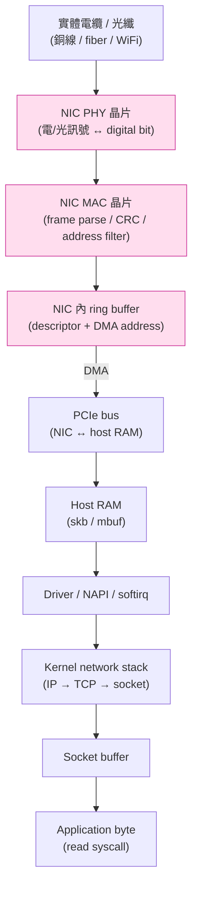
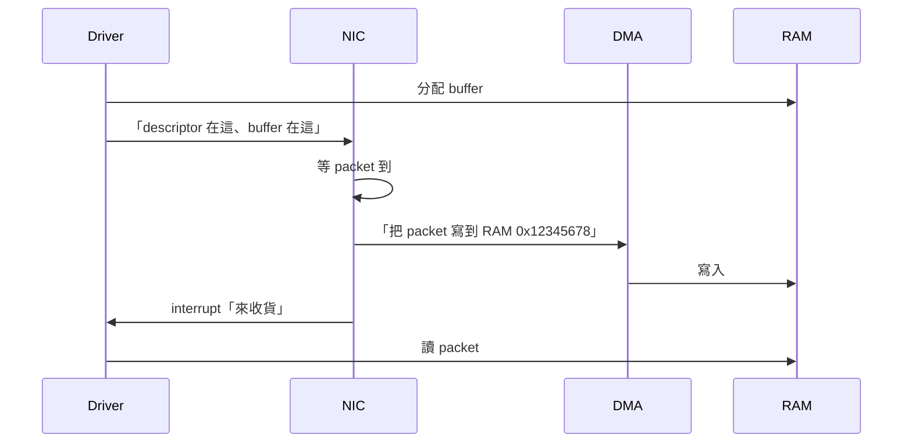
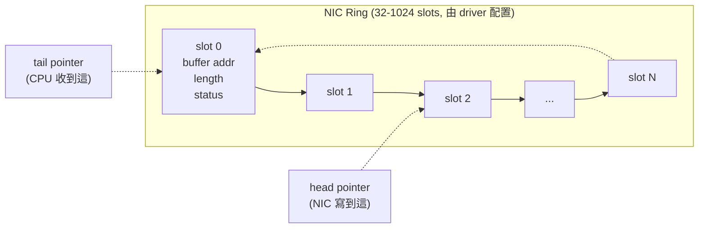
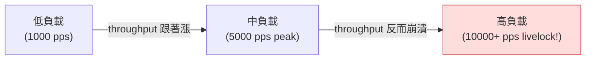
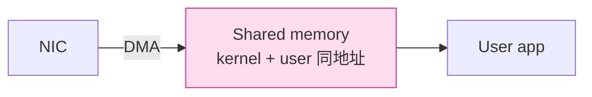
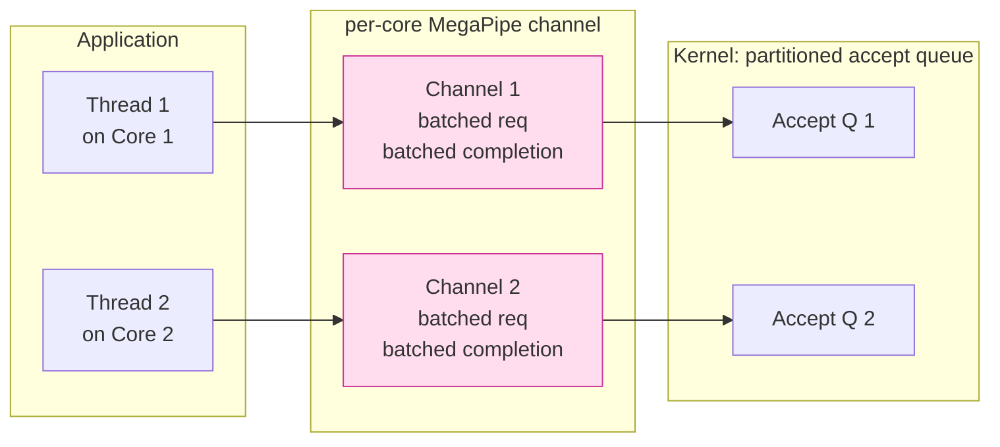

# 課堂 1.2 — 物理層：你不需要懂電壓，但要懂 PHY/MAC 介面

## 學前知道

- **前置課**：[1.1 分層的真實意義](./1.1-layering-truth.md)
- **預計閱讀時間**：35~45 分鐘
- **必讀論文**：
  - **Mogul & Ramakrishnan — Eliminating Receive Livelock in an Interrupt-driven Kernel** (USENIX ATC 1996 → TOCS 1997) ⭐
  - **Rizzo — netmap: A Novel Framework for Fast Packet I/O** (USENIX ATC 2012) ⭐
  - **Han, Marshall, Chun, Ratnasamy — MegaPipe** (OSDI 2012)
  - **Neugebauer, Antichi, Zazo, Audzevich, López-Buedo, Moore — Understanding PCIe Performance for End Host Networking** (SIGCOMM 2018)
- **必讀原始碼**：無

---

## 動機

教科書一講物理層，多數人腦中是「電壓、波形、雙絞線、5e/6 class」這些**電工知識**。對「設計新 SOTA 翻牆協議」這個目標，這些**真的沒用**。

但**有一件事必須懂**——**從應用層 byte 到實際電纜上 bit 的完整路徑**。為什麼？

1. **效能瓶頸常在 PHY/MAC/PCIe/DMA 介面**——不是在你的協議邏輯
2. **Hysteria2 / TUIC v5 之所以快**是因為他們**繞過了傳統 NIC interrupt 路徑**——你得懂這條路徑才能複製或超越
3. **零拷貝（zero-copy）設計**是 Phase III 12.4 我們協議能不能上 5 Gbps 線速的關鍵——這直接決定於 PCIe / DMA 介面理解
4. **GFW 在 NIC offload 層也做識別**（部分 ASIC NIC 可以做 line-rate DPI）——理解硬體介面才知道對手能做什麼

本堂跳過電壓波形，直接從 **NIC 收到光/電訊號之後** 講起，到 **CPU 收到 packet 結構** 為止。中間經過的所有介面、機制、效能 caveat 都會講。

---

## 核心概念

### 1. 完整路徑：從電纜到應用程式 byte

把這張圖記住——後面所有討論都圍繞它：



粉色 = 我們不能直接控制的硬體層（NIC 內部）。其他**全部都能用 software 操控**——這就是 zero-copy / DPDK / netmap / io_uring 等技術的戰場。

### 2. 三個關鍵硬體機制（不需要懂電工，但要懂這些）

#### 2.1 DMA（Direct Memory Access）

NIC 不**透過 CPU**就能把 packet 寫進 host RAM——透過 PCIe DMA。



**關鍵**：DMA 寫 RAM 不經過 CPU——所以 NIC 可以線速接收 packet 而 CPU 同時做別的事。但**寫進去之後 CPU 怎麼知道**？兩種方式：
- **Interrupt（中斷）**：NIC 寫完每個 packet 就中斷 CPU（傳統方式）
- **Polling（輪詢）**：CPU 主動定期查 NIC ring（DPDK / netmap 方式）

#### 2.2 Ring Buffer（環狀緩衝）

NIC 用環狀資料結構描述「**有哪些 buffer 我可以寫**」+「**我寫到哪了**」。



NIC 維護 `head`（自己寫到哪），CPU 維護 `tail`（自己讀到哪）。**ring 滿了** = 來不及處理 → packet 被丟。**ring 空了** = NIC 沒新 packet 進來。

#### 2.3 NIC Offload

現代 NIC（Intel X710 / Mellanox CX6 / ARM SmartNIC）能在 wire 上**直接做**這些事，不必 CPU 動手：

| Offload | 做什麼 | 對我們的意義 |
|---|---|---|
| **TSO (TCP Segmentation Offload)** | App 送 64KB → NIC 切成多個 MTU 大小 packet | 提升吞吐，但 wireshark 抓到的「super-packet」其實不是 wire 上實際樣子 |
| **GSO/GRO** | Generic Segmentation/Receive Offload，TSO 的 software fallback | 影響流量指紋（packet 大小分佈） |
| **LRO** | Large Receive Offload，把多個小 packet 合併成一個 | 同上 |
| **Checksum offload** | NIC 算 TCP/UDP/IP checksum | 不影響功能但少耗 CPU |
| **RSS (Receive Side Scaling)** | 用 packet 5-tuple hash 把 packet 分到不同 CPU core | 多核擴展性的關鍵 |
| **VXLAN/Geneve encap offload** | NIC 直接做 tunnel encap/decap | 雲端機房常用，影響我們協議在那種環境的表現 |

**對 GFW 對抗有意義的點**：
- TSO/GSO 改變 packet 大小分佈——影響 flow fingerprinting
- 如果 GFW 部署在 NIC offload 不可及的位置（ISP 中間 router），他們看到的是 wire 上的真實 packet，不是你 app 視角的「super-packet」
- 我們 Phase III 流量整形要小心：**你 app 層調 packet size 不一定是 wire 上真正的 packet size**

### 3. Receive Livelock：interrupt 的死局（Mogul 1997）⭐

這是 Phase II 高效能 I/O 必須懂的經典問題——**為什麼純 interrupt-driven 網路 stack 在高負載下會死**？

#### 問題

1990s 中後期，網路速度開始衝破 100 Mbps，packet rate 從每秒幾百飆到每秒幾萬。傳統 BSD 設計：
- NIC 收到 packet → interrupt CPU
- CPU 停手中工作 → 進 interrupt handler → 把 packet 推進 kernel queue
- Interrupt handler 結束後回 user space 繼續工作

當 packet rate 高到 **CPU 連 interrupt 都處理不完**：
- CPU 100% 時間在處理 interrupt
- 沒有時間跑 IP stack 把 packet 從 queue 拉出來
- 沒有時間給 user app 跑
- **吞吐量降到 0**——這就是 **receive livelock**

Mogul 1997 經典圖（論文 Fig 6-1）：



**注意這個反直覺現象**：負載越高 → 吞吐量**越低**（不是飽和 plateau，是**崩潰到 0**）。

#### 解法（Mogul 提出，後來變 Linux NAPI 基礎）

1. **Interrupt 只是觸發 polling**——不在 interrupt context 處理 packet
2. **Polling 處理 packet 直到 quota 用完**（不能無限處理，否則 user space 餓死）
3. **Quota 用完後**：restart polling timer，**重新啟用 interrupt**
4. **加 cycle-limit feedback**：CPU 花太多 cycles 在 packet 處理 → 暫停 input

**這就是 Linux NAPI（New API）的設計**——2003 開始替代純 interrupt-driven。今天所有現代 Linux NIC driver 都用 NAPI。

#### 對我們的意義

- **我們協議 server 跑在高負載下不會 livelock**——感謝 NAPI
- **但 packet rate 仍是吞吐量上限**——Phase III 12.4 設計時必須知道 single-core NAPI 大約能 push 多少 pps
- **理解 livelock = 理解所有 modern packet I/O 設計的起源**：DPDK / netmap / XDP 都是基於「polling 比 interrupt 更可控」這個 Mogul 1997 的洞察

### 4. netmap：用戶態零拷貝（Rizzo 2012）⭐

如果 NAPI 還是不夠快（要做 line-rate firewall / DPI / 軟體 router），怎麼辦？

#### 三大瓶頸（Rizzo 識別）

1. **Per-packet 動態記憶體配置**（sk_buff allocate/free）
2. **System call 開銷**（每個 packet 一次 syscall）
3. **記憶體複製**（kernel buffer → user buffer）

netmap 同時解決這三個：



- **Pre-allocated buffer pool**（不再 per-packet alloc）
- **Batched syscall**（一個 `ioctl` 收 N 個 packet）
- **Memory-mapped shared region**（kernel 跟 user 看同一塊 RAM，免複製）

#### Rizzo 的成果

```
配置                              吞吐量
標準 FreeBSD netsend             1.05 Mpps  (參考組)
Linux pktgen (in-kernel)         4 Mpps
netmap 1 core @ 900 MHz          14.88 Mpps  ← 10G line rate
```

**900 MHz 一個 core 跑滿 10G line rate**——這是 2012 年震驚業界的數字。

#### netmap 後來的演化

| | 出現年 | 核心思想 |
|---|---|---|
| netmap | 2012 | Shared memory + batched syscall |
| DPDK | 2012+ | Full kernel bypass + poll-mode driver |
| AF_XDP | 2018 | Linux 內建版的 netmap |
| io_uring | 2019 | Async submission queue + completion queue |

**Phase III 12.4 我們協議的資料路徑會在這個光譜上選一個位置**——影響整體吞吐極限。

### 5. MegaPipe：socket API 本身就是瓶頸（Han 2012）

netmap 走「**完全繞過 kernel stack**」路線——但你失去 TCP 自動處理。對我們協議**最關鍵的中道**是 MegaPipe 路線：**仍用 kernel TCP，但重新設計 socket API**。

#### 問題：BSD socket API 為何慢

BSD socket（1983）的設計假設：
- **少量** long-lived connection
- **大** message
- **單核** 主流

2012 數據中心場景反過來：
- **大量** short connection（HTTP 1.0 era）
- **小** message
- **多核**

導致 4 個 systemic bottleneck：

1. **Accept queue contention**（單一 listening socket 被多核搶）
2. **Lack of connection affinity**（NIC RSS 把 packet 分給 core A，但 accept() 在 core B 跑）
3. **VFS overhead per socket**（每個 socket 都建 inode / dentry / file，與 socket 語義無關但 mandatory）
4. **System call per I/O op**（不能 batch）

#### MegaPipe 的設計



四個 idea：

1. **Partitioned listening socket** — 每 core 有自己的 accept queue（NIC RSS hash 對齊）
2. **lwsocket** — 不走 VFS 的輕量 socket（無 inode、無 dentry、無 file struct）
3. **System call batching** — 一次 syscall 送 N 個 I/O 請求 + 收 N 個 completion
4. **Completion notification** — 不用 epoll 風格的 readiness，改用 IOCP 風格的 completion event

#### 成果

```
工作負載                                 改善幅度
nginx + 8-core + real HTTP trace        +75% throughput
memcached short connection              +320%
microbenchmark short connection         +582%
```

#### 對我們的意義

**Phase III 12.4 / 12.6 設計**：
- 如果 Proteus 是 long-lived connection 為主 → MegaPipe 影響小（我們可以用標準 epoll）
- 如果 Proteus 走「每 request 一個 short connection」（防 long-flow fingerprinting）→ **MegaPipe 設計直接影響可達 throughput**
- io_uring 是 MegaPipe 設計的 Linux 主流繼承者——**Proteus 應該基於 io_uring**

### 6. PCIe 是被忽視的隱形瓶頸（Neugebauer 2018）

40Gbps / 100Gbps NIC 時代，**PCIe bus 本身**開始成為瓶頸。

#### 數字震驚

```
PCIe Gen3 x8 理論頻寬：62.96 Gbps（physical layer）
PCIe 協議 overhead：剩 ~57.88 Gbps（TLP framing）
+ NIC DMA 配置 overhead：剩 ~50 Gbps（descriptor + queue update）
+ 小 packet 時 saw-tooth pattern：64 byte packet 只剩 ~10 Gbps
```

**結論**：40Gbps NIC 在 64 byte 小封包下**根本跑不滿**——不是 NIC 慢，是 PCIe 跑不過。

#### PCIe 延遲也是

```
PCIe transaction 延遲：~900 ns
+ DDIO（Intel Data Direct I/O，packet 直接進 LLC）：+70 ns
+ NUMA 跨 socket：+~100 ns
+ IOMMU miss：可達 +1000+ ns（cache 不在）
```

#### 對我們的意義

- **我們協議達不到 line rate 不一定是 software 慢**——可能是 PCIe / DMA 跑滿
- **NUMA placement 重要**——VPS 上跑 Proteus server 要把 process pin 到 NIC attached 的 socket（同 socket 0/1）
- **Phase III 12.11 baseline 評測**要明確標 PCIe gen + lane width + NUMA arrangement——否則 reproduce 不出來

---

## 與我們協議設計的關聯

對 Proteus 設計的具體影響：

1. **吞吐量 budget**：要清楚 single-core throughput 上限——NAPI 大約 1~3 Mpps、netmap/DPDK 14+ Mpps、io_uring 中等。**這決定我們能否單實例上 5 Gbps**
2. **packet pacing**：協議流控如果做得跟 NIC offload (TSO/GSO) 不對齊，wire 上的 packet 樣子會跟你預期的不一樣——影響 anti-fingerprinting
3. **NUMA / PCIe**：Phase III deployment 要對齊；Phase III 12.11 baseline 評測必須記錄硬體拓撲
4. **GFW 不在你的 NIC 內**：GFW 跑在 ISP 中間 router，看到的是 wire 上 packet——你 TSO 切出 1500B MTU，他看 1500B；你不 TSO 切，他看你的真實 size
5. **未來 P4 / SmartNIC 對抗式部署**：論文末段提到 SmartNIC 可在 NIC 內做 packet processing——若 GFW 部署 ML SmartNIC，我們協議要假設**對手能 line-rate ML inference**

---

## 動手（30 分鐘）

### 任務 1（10 min）：看自己 Mac 的 NIC offload

```bash
# macOS 看 NIC 狀態
ifconfig en0 | head -10

# Linux VM 內看（OrbStack debian VM）
orb -m debian -- ethtool -k eth0 | grep -i 'offload\|tso\|gso\|gro\|lro'
```

### 任務 2（10 min）：抓自己 Clash 流量看 TSO 痕跡

```bash
# Mac 上抓
sudo tcpdump -i en0 -nn -w /tmp/clash.pcap host vps.example.com -c 200

# Wireshark 開
# Statistics → Capture File Properties 看 "Average packet size"
# 找一個 TLS Application Data，看 length（如果 > 1500，那是被 GRO 合併過的）
```

**思考**：為什麼有些 packet 看起來「比 MTU 大」？GFW 看到的是這個合併後 size 還是 wire size？

### 任務 3（10 min）：iperf3 跑出 NAPI 對 throughput 的影響

```bash
# 在 vpn-node VPS 上裝 iperf3 server
ssh vpn-node 'iperf3 -s -p 5202 -D'

# Mac 上跑 client，看單 stream 跟 multi-stream 差別
iperf3 -c vps.example.com -p 5202 -t 10 -P 1    # 單 stream
iperf3 -c vps.example.com -p 5202 -t 10 -P 8    # 8 stream

# 跑完關掉 server
ssh vpn-node 'pkill -f "iperf3 -s"'
```

**思考**：multi-stream 為什麼快？跟 RSS / NAPI / 多核 affinity 有什麼關係？

---

## 自我檢查

1. Receive livelock 的根因是什麼？Mogul 1997 提的 polling + cycle-limit 怎麼解？
2. netmap 同時解決哪三個 per-packet 開銷？為什麼 900 MHz 一核能達 10G line rate？
3. MegaPipe 跟 netmap 哲學上的差別是？什麼場景該用哪個？
4. PCIe Gen3 x8 為什麼跑 40Gbps NIC 在 64 byte packet 下會卡？跟「physical bandwidth 60+ Gbps」矛盾嗎？
5. NIC offload（TSO/GSO/GRO/LRO）對 anti-fingerprinting 設計的影響是什麼？

---

## 延伸閱讀

- **DPDK Programmer's Guide** <https://doc.dpdk.org/guides/prog_guide/> — netmap 的後續主流選擇
- **Linux NAPI documentation** in kernel tree `Documentation/networking/napi.rst` — Mogul 1997 的 production 實作
- **AF_XDP and XDP-style packet processing** <https://www.kernel.org/doc/html/latest/networking/af_xdp.html>
- **io_uring 的網路 I/O 用法** Jens Axboe blog + LWN articles
- **Mellanox / NVIDIA Connect-X 系列文檔** — 現代 SmartNIC reference

---

## 研究級補遺

> 主體是「從電纜到 byte」的工程實務。這節升級到研究員視角的未解問題與 frontier。

### 1. 學界詞彙

- **Kernel bypass** vs **kernel offload**：bypass = 跳過 kernel（DPDK/netmap），offload = 把工作交給 NIC ASIC（TSO/RSS）。兩個正交但常被混淆
- **NAPI**（New API）= Linux 1997+ 結合 interrupt + polling 的混合模式；Mogul 1996 的工程實作
- **DDIO**（Data Direct I/O）= Intel 2012+ 把 PCIe write 直接寫進 LLC 而非 main memory，減少 cache miss
- **NUMA**（Non-Uniform Memory Access）= 多 socket 系統下不同 socket 的 RAM 存取延遲不同；對 NIC 來說「同 socket」跟「跨 socket」差 5-10%
- **IOMMU**（Input-Output MMU）= 為 DMA 設備提供 virtual address translation；安全但有 latency cost
- **TLP (Transaction Layer Packet)** = PCIe 的 protocol unit；framing overhead 10-15%
- **MPS (Maximum Payload Size)** / **MRRS (Maximum Read Request Size)** = PCIe transaction 大小協商
- **Line rate** = 物理層理論最大 packet rate（10G Ethernet 14.88 Mpps for 64B packets）
- **Polling mode driver (PMD)** = DPDK / netmap 用的——不收 interrupt，CPU 主動輪詢 NIC ring
- **Zero-copy** = packet 從 NIC 到 application 不經 memcpy（共享 memory mapping）
- **Receive Side Scaling (RSS)** = NIC 用 packet 5-tuple hash 分 packet 到不同 CPU core
- **Flow Director / RxFlow** = NIC 級的 software-configurable flow steering，比 RSS hash 精細

### 2. 對手分類學（PHY/MAC 層的 GFW）

GFW 在 PHY/MAC 介面層的能力：

| 位置 | GFW 能做什麼 | 對我們影響 |
|---|---|---|
| ISP backbone router | 看 wire 上實際 packet（TSO/GSO 切過的） | 無法用 host 層 TSO 隱藏 |
| ISP edge with SmartNIC | 可做 line-rate DPI、ML inference | 我們不能假設 GFW 算力不夠 |
| 國家 backbone (PRC scrubbing center) | 大規模 packet sampling + ML cluster offline analysis | 即使我們躲過實時，仍可能被事後識別 |

**沒被 GFW 看到的層**：
- 你 Mac 內部 NIC offload 後的 super-packet（GFW 在 ISP，看 wire）
- 你協議的 application data unit（被 TLS 加密）

### 3. 形式化定義

Packet I/O 路徑的成本模型（簡化版）：

令一個 packet 的「**處理成本**」C：

```
C = C_phy + C_pci + C_dma + C_int + C_drv + C_stack + C_sock + C_app

其中：
C_phy   ≈ 80 ns      (1500B @ 10Gbps wire time，PHY 內部)
C_pci   ≈ 50 ns      (PCIe TLP framing)
C_dma   ≈ 600 ns     (DMA transaction + descriptor RW)
C_int   ≈ 1000 ns    (interrupt handler + softirq schedule)
C_drv   ≈ 200 ns     (sk_buff alloc + driver code)
C_stack ≈ 500 ns     (IP/TCP processing)
C_sock  ≈ 200 ns     (socket buffer copy)
C_app   ≈ 100 ns     (read syscall)

Total ≈ 2700 ns/packet (single thread, modern hardware)
→ ~370 Kpps/core 上限（粗略）
```

**netmap 把 C_int + C_drv + C_stack + C_sock 砍掉**——降到 ~250 ns/packet → 4 Mpps/core。

**這就是 1 個 core 跑滿 10G line rate（14.88 Mpps for 64B）的關鍵——但 netmap 走 batch，每次 syscall 攤平 cost。**

### 4. 必追論文 / 規格

按重要性：

- ✅ **Mogul & Ramakrishnan 1997** Eliminating Receive Livelock — interrupt mitigation 奠基
- ✅ **Rizzo 2012** netmap — userspace zero-copy 第一次成功實作
- ✅ **Han et al. 2012** MegaPipe — socket API redesign
- ✅ **Neugebauer et al. 2018** Understanding PCIe — 量化 PCIe bottleneck
- **Jacobson & Felderman 2006** Speeding up Networking (Linux Conf Au) — TCP/IP fast path 史
- **Intel DPDK Programmer's Guide** — netmap 的工程後繼
- **Bonelli, Pietro, Petrarcio 2014** On Multi-gigabit Packet Capturing With Multi-core Commodity Hardware
- **Høiland-Jørgensen et al. 2018** The eXpress Data Path (XDP) (CoNEXT 2018) — AF_XDP 設計
- **Axboe 2019** Efficient IO with io_uring whitepaper
- **Marinos, Watson, Handley 2014** Network Stack Specialization for Performance — Sandstorm/Namestorm，clean-slate stack
- **Yasukata et al. 2016** StackMap — netmap + TCP stack 整合

### 5. 我們協議的座標

| Phase III 12.4 設計選擇 | 影響 |
|---|---|
| 用 epoll + read/write | 簡單但慢——基準線 |
| 用 io_uring | +30~50% throughput，需要 Linux 5.x kernel |
| 用 AF_XDP | +200% throughput，但 portability 損失 |
| 用 DPDK/netmap | 線速但完全 bypass kernel，工程量大 |

**Proteus baseline 推薦走 io_uring + io_uring_register_buffers**——這是 2026 SOTA，整合最簡單，效能足以撐 5 Gbps single instance。**Phase III 12.4 第一個 sprint 就驗證這個假設**。

### 6. 必追資源

- **Brendan Gregg 的 Linux Performance** <https://www.brendangregg.com/linuxperf.html> — kernel 內部觀察工具
- **LWN.net networking articles** — 內核 networking 領域權威報導
- **Cloudflare blog (Marek Majkowski)** — 大量低層 networking 工程文章
- **Mellanox / Intel 的 ConnectX / E810 documentation** — SmartNIC 能力 reference
- **DPDK community mailing list** — 業界最新討論

### 7. 開放問題

- **AF_XDP vs DPDK vs io_uring 哪個是 2030 winner**？AF_XDP 是 mainline kernel，DPDK 是 production-proven 但 bypass kernel，io_uring 是 general-purpose 介面。**Proteus 押哪邊**還沒共識
- **SmartNIC 普及後 anti-fingerprinting 怎麼辦**？NIC 內 ML inference 可能把我們協議識別速度提升 100x
- **PCIe Gen5 / CXL 對 Proteus 意義**？2026 主流 server 開始用 PCIe Gen5（128 Gbps x8）+ CXL（cache-coherent fabric），這改變了 "PCIe 是 bottleneck" 的假設——但伺服器端設計才適用，client（Mac）端沒這個
- **GPU-direct networking**：NVIDIA 的 GPUDirect Storage / GPUDirect RDMA 讓 GPU 直接 DMA 跟 NIC 對話——對 ML middlebox 影響大，未來會傳到 anti-fingerprinting 場景嗎？
- **量子網路 PHY**：Quantum Key Distribution（QKD）的 photon-level PHY 跟 classical NIC 完全不同——G7 / G8 世代是否考慮 QKD？開放

---

下一堂：**1.3 乙太網路與 L2：交換器內部**——MAC 學習、CAM 表、VLAN、STP 為什麼存在；為什麼資料中心改用 VXLAN / Geneve。
