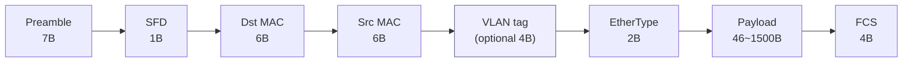
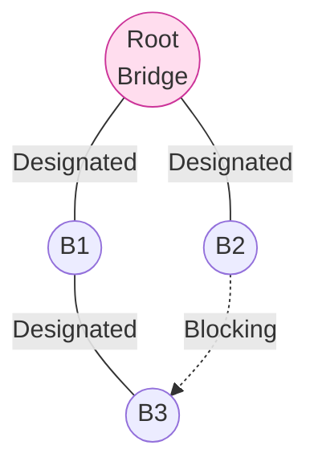
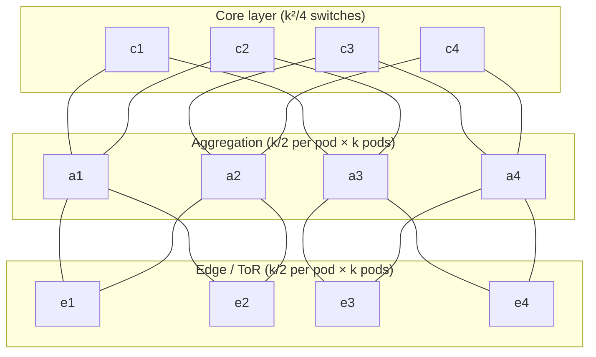

# 課堂 1.3 — 乙太網路與 L2：交換器內部

## 學前知道

- **前置課**：[1.1 分層的真實意義](./1.1-layering-truth.md)、[1.2 物理層：PHY/MAC 介面](./1.2-physical-and-phy-mac.md)
- **預計閱讀時間**：35~45 分鐘
- **必讀論文 / 規格**：
  - **Perlman — An Algorithm for Distributed Computation of a Spanning Tree in an Extended LAN** (SIGCOMM 1985, CCR 15(4):44–53) ⭐ — 整個 L2 自治世界的源頭，亦是分散式演算法經典
  - **Al-Fares, Loukissas, Vahdat — A Scalable, Commodity Data Center Network Architecture** (SIGCOMM 2008) — fat-tree，DC fabric 從 hierarchical 切到 Clos 的關鍵
  - **Greenberg et al. — VL2: A Scalable and Flexible Data Center Network** (SIGCOMM 2009) — DC 內 L2 illusion + L3 multipath，現代雲端 underlay 雛形
  - **RFC 7348 — VXLAN** (Mahalingam et al., 2014, Informational) — DC 用 UDP 包 L2 over L3 的事實標準
  - **RFC 8926 — Geneve** (Gross, Ganga, Sridhar, 2020, Standards Track) — 取代 VXLAN 的 TLV-extensible overlay encap
  - **RFC 7432 — BGP MPLS-Based Ethernet VPN (EVPN)** (Sajassi et al., 2015) — 取代 flood-and-learn 的 control plane
- **必讀原始碼**：Linux `net/bridge/br_fdb.c`（FDB / MAC 學習表），`net/bridge/br_stp_bpdu.c`（STP BPDU 處理），`drivers/net/vxlan.c`（VXLAN 資料平面）

---

## 動機

本堂是 Part 1 第一堂「我們協議幾乎不在這層工作但你還是必須懂」的內容。為什麼必須懂：

1. **MTU 預算被 DC overlay 吃掉**：你的 Proteus server 跑在 VPS 上。VPS 跑在 hyperscaler / Hetzner / Vultr / DigitalOcean 的 DC fabric 內。**這個 fabric 幾乎一定有 VXLAN 或 Geneve overlay**，每個 packet 出去前先被加 50~64 byte 的 outer encap。**你以為 1500 MTU，實際 application payload 預算 ≤ 1450**。對 QUIC initial packet 設計（必須 ≥ 1200 byte but 不能 fragment）這是**硬限制**
2. **GFW 不在 L2，但量化 GFW 部署位置需要 L2 知識**：理解 ISP backbone 是 L3 routing 而非 L2 switching，才能定位 GFW 在哪些 hop 介入
3. **理解 TUN vs TAP 的設計選擇**：WireGuard / OpenVPN / Tinc 在 L2 vs L3 的取捨；Proteus 為何走 L4 proxy 而非 L2 VPN
4. **DC fabric 已是「control plane（BGP EVPN）vs data plane（VXLAN）分離」的成熟工程**，這個 architecture 我們在 Part 11 設計 Proteus 的 control plane 時會直接參考
5. **STP（Perlman 1985）是 distributed algorithm 教學的傳家寶**：用最少 state、最少 message、convergence in O(diameter) 解 spanning tree——本身就是研究級訓練

教科書講 L2 都從「乙太網路怎麼產生 collision、CSMA/CD、HUB 為什麼被淘汰」開始。**那些知識 1995 年之後就無用**（modern Ethernet 全 switched、full-duplex、無 collision）。本堂直接從「為什麼一個 switched LAN 還需要 STP」切入，講到 modern DC 為什麼把 L2 變成 L3 over L3 overlay。

---

## 核心概念

### 1. Ethernet frame：你必須記住的 byte layout



- **Preamble + SFD（8 byte）**：PHY 同步用，**不算 frame 內**——OS 看不到、wireshark 抓不到
- **Dst / Src MAC（各 6 byte）**：3 byte OUI（IEEE 分配廠商）+ 3 byte vendor assigned。第一 byte 最低 bit = 1 表 multicast/broadcast
- **VLAN tag（optional, 4 byte）**：IEEE 802.1Q。我們等下講
- **EtherType（2 byte）**：標 payload 是什麼。常見值：
  - `0x0800` = IPv4
  - `0x86DD` = IPv6
  - `0x0806` = ARP
  - `0x8100` = 802.1Q VLAN tag（接著還有第二個 EtherType）
  - `0x88A8` = 802.1ad（QinQ）
  - `0x88CC` = LLDP
- **Payload**：46~1500 byte（Jumbo frame 可達 9000，但需 end-to-end 支援）
- **FCS（4 byte）**：CRC-32，NIC 自動驗，CPU 看不到（除非 raw socket + 特殊 mode）

**對我們協議的意義**：每個 wire 上的 Ethernet frame 最少 64 byte（含 18 byte header/trailer + 最小 46 byte payload）。**小 packet（如 ACK-only QUIC）會被 padding 到 64 byte**——影響流量分析時你算的「packet size 分佈」必須以 64 byte 為下限。

### 2. MAC learning 與 CAM / TCAM

Switch 不是 hub。Hub 是 L1 設備（電氣 repeater，所有 port 同 collision domain）。Switch 是 L2 設備，每個 port 獨立 collision domain，**用 MAC address 決定 forward 到哪個 port**。

#### MAC learning 演算法（極簡）

```
On frame arrival at port P with src=S, dst=D:
  1. FDB[S] := (P, timestamp_now())     // 學「S 在 port P」
  2. If D in FDB and FDB[D].port != P:
       forward to FDB[D].port            // 已知目標，unicast
     Else:
       flood to all ports except P       // 未知或 broadcast/multicast
```

`FDB` = **Forwarding Database**，硬體上實作為 **CAM**（Content Addressable Memory）。

#### CAM vs TCAM：硬體查表的兩種

| | 用途 | 查詢規則 | 硬體成本 |
|---|---|---|---|
| **CAM** | exact match | 「key = X 嗎？」 | 1 cycle，~1 W/Mb |
| **TCAM** | ternary match | 「key match X / mask 嗎？」（每 bit 可為 0/1/don't-care） | 1 cycle，~3-5 W/Mb（**貴 5-10×**） |

**為什麼分兩種**：
- **MAC FDB** 全 exact match → 用 CAM 即可（便宜大量）
- **ACL / route lookup（含 prefix mask）** 必須 ternary → 用 TCAM（但貴，所以 TCAM 容量小，**這就是企業級 switch ACL 條目上限的物理原因**）
- 現代資料中心 switch（Broadcom Tomahawk、Tofino）：FDB 容量 64K~512K MAC，ACL TCAM 通常 4K~16K entries

**對我們協議的意義**：
- 大型 DC 中如果一個 leaf switch 看到 > 64K MAC（VM 太多），**FDB 會溢出 → fallback 到 software path → 效能斷崖**。**這就是 DC 不再用大 L2 broadcast domain 的工程原因**
- 我們協議若要部署在 K8s + service mesh，每個 pod 都是一個 MAC——hyperscaler 的 fabric 已經被這事逼成 VXLAN overlay（L2 over L3）

#### FDB aging

FDB entry 有 TTL（典型 300 秒）。逾時自動刪除——若 MAC 移動（VM migration、laptop 換 port），舊 entry 不會永久 stick。Aging 跟 STP topology change 互動是 RSTP 主要改進點之一。

### 3. STP（Perlman 1985）⭐——一個 distributed algorithm 怎麼活了 40 年

#### 問題：為什麼 switched LAN 需要 spanning tree？

Switch flood-and-learn 在**單一無迴路拓樸**下工作完美。但工程現實是：

- 為冗餘必須**多接線**（一條 fiber 斷了還能走第二條）
- Flood 一個 unknown unicast 在**有迴路的拓樸**會無限循環（Ethernet header **沒有 TTL**！與 IP 不同）
- **一個 broadcast storm 可以在毫秒內癱瘓整個 LAN**

⇒ 需要在物理上有迴路、邏輯上構造一個無迴路的 spanning tree。

#### Perlman 1985 的演算法核心

每個 bridge（= switch）有一個 **bridge ID**（priority + MAC）。所有 bridge 跑同一個分散式演算法：

1. **Elect root**：bridge ID 最小者為 root（priority 在前，MAC 解 tie）
2. **每個 bridge 算出自己到 root 的 cost**：透過 BPDU（Bridge Protocol Data Unit）交換訊息
3. **每個 LAN 選一個 designated bridge**：到 root cost 最小，tie 解 bridge ID
4. **每個 bridge 上的 port 進入下列狀態之一**：
   - **Root port**：到 root cost 最小的那個 port（每個非 root bridge 唯一一個）
   - **Designated port**：被選為該 LAN 的 designated bridge 的 port
   - **Blocking port**：其他——**邏輯上斷開，不 forward，但仍收 BPDU**



**收斂時間**：Perlman 1985 證明 O(network diameter) 步即收斂。傳統 STP 預設**約 30~50 秒**（Listen 15s + Learn 15s + Forward），原因不是演算法慢而是各 timer 留了**很大保守 margin**（1985 LAN ≤ 10Mbps、bridge CPU 慢、不容錯 false-forward）。

#### 為什麼這是分散式演算法經典

- **每個 bridge 只需 O(1) state**（root ID、root cost、designated bridge ID）——獨立於網路規模
- **每個 LAN 只需 O(1) bandwidth**——BPDU 每 2 秒一次
- **無 central controller**——pure peer-to-peer convergence
- **無 explicit topology discovery**——bridge **不知道**整個拓樸長什麼樣
- **不需 reliable delivery**——BPDU 弄丟下次補

對比 Dijkstra（OSPF / IS-IS link-state）：那個需要每個 router 知道**整個拓樸**才能算 shortest path。Perlman 用「每個節點只知道到 root 的 cost」就構造出 spanning tree——**訊息與 state 都小很多**。代價是只給你 tree，不給你 shortest path between arbitrary pair（包繞 root 走，bandwidth utilization 差）。

#### RSTP / MSTP：1985 的 evolution

- **RSTP（IEEE 802.1w, 2001）**：收斂從 30~50s 降到 ~1~2s——通過 explicit handshake 取代 timer wait
- **MSTP（IEEE 802.1s, 2002）**：多個 VLAN 跑多個 STP instance——同一物理拓樸下不同 VLAN 走不同 tree（負載分擔）

#### Perlman 自己看 STP

Perlman 後來寫了 *Interconnections: Bridges, Routers, Switches, and Internetworking Protocols*（2nd ed., 1999），裡面她非常坦白：**bridging 整個架構是錯的，應該全 routing**。她甚至寫了一首詩 *Algorhyme* 嘲諷自己：「I think that I shall never see / A graph more lovely than a tree」——意思是 spanning tree 雖然優雅但**人為製造**了 bandwidth waste（blocking ports 完全閒置）。這個自我批判直接催生了 TRILL（IETF, 2010）和現代 DC 改走 L3 + ECMP 的方向。

### 4. VLAN（IEEE 802.1Q）

VLAN 在一條 physical link 上跑多個 logical L2 segment。Tag 格式：

```
+--------+-----+-----+-----+--------------+
| TPID   | PCP | DEI | VID | ...payload   |
| 2 byte | 3b  | 1b  |12b  |              |
| 0x8100 |     |     |     |              |
+--------+-----+-----+-----+--------------+
```

- **TPID** = `0x8100`（替代原本 EtherType 位置）
- **PCP** = Priority Code Point（3 bit，QoS 用，IEEE 802.1p）
- **DEI** = Drop Eligible Indicator（congestion 時可丟）
- **VID** = VLAN ID，**12 bit → 最多 4094 個 VLAN**（0 和 4095 保留）

#### 4094 不夠用怎辦：QinQ 與 VXLAN

- **QinQ（802.1ad, 2005）**：雙 tag。outer tag（service provider）+ inner tag（customer）→ 4094 × 4094 = ~16M。outer TPID 用 `0x88A8`
- **VXLAN（2014）**：24-bit VNI → 16M。下一節展開
- **PBB（Provider Backbone Bridges, 802.1ah）**：customer 的整個 Ethernet frame 被 MAC-in-MAC 封裝——電信級 Metro Ethernet 用

**4094 對我們協議的關聯**：你的 Proteus server 部署在 hyperscaler 上時，**hyperscaler 內部不可能用 802.1Q VLAN 隔離客戶**（4094 連一個 region 客戶數都不夠）。**所以幾乎可以斷定他們用 VXLAN/Geneve**。

### 5. L2 為什麼不 scale

把 L2 broadcast domain 開大（10K+ host）的災難：

1. **Broadcast storm 風險**：任何 misbehaving NIC 都能引爆整個 domain
2. **FDB 大小 = O(host 數量)**：CAM 容量是硬體上限
3. **STP 收斂時間 ∝ diameter**：domain 變大收斂變慢
4. **ARP 流量 O(host²)**：每個 host 上線都 ARP 廣播
5. **VLAN trunk 上 broadcast 過放大器**：一個 broadcast 沿著 trunk 進入下一個 switch 又 flood

**這就是 1990s~2000s「access ≤ 256 host, distribution ≤ 4K host, core ≤ 16K host」這種 hierarchical design 的物理理由**。

但 DC 場景把這個 model 打爆：

- **VM mobility 要求 L2 reachability**：vMotion 要 VM 的 IP/MAC 不變
- **大規模 east-west traffic**：DC 內部 server-to-server 流量遠超 north-south（用戶流量）
- **K8s pod-to-pod**：每個 pod 一個 IP/MAC，**單個 cluster 可以 100K+ pod**

⇒ **L2 設計失敗 → 走 L3 over L3 overlay**。

### 6. DC fabric：fat-tree 與 Clos topology（Al-Fares 2008、Greenberg 2009）

#### Al-Fares 2008 fat-tree



**核心想法**：用大量 commodity Ethernet switch（48-port、$5000）取代昂貴 chassis switch（768-port、$500000）。Bisection bandwidth scales as O(k³/4) for k-port switches。

但**單純 fat-tree 跑 standard L3 routing 會崩**——因為 multiple equal-cost path 不能用一般 OSPF 處理。Al-Fares 2008 的具體貢獻是**設計了 IP address scheme + two-level routing table**，讓 commodity switch 能跑滿。

#### Greenberg 2009 VL2

Microsoft 的工程實踐版。三個 idea：

1. **Valiant Load Balancing**：每個 flow 隨機選一個 intermediate switch，再走過去——統計上把流量打平
2. **Flat L2 abstraction**：上層應用看到 flat L2（VM mobility 友善），底層其實是 L3 ECMP routed fabric
3. **Directory service for ARP**：把 ARP 從 broadcast 改成 lookup（取消廣播）

#### 為什麼這兩篇是 DC networking 的分水嶺

2008 之前：DC 用 hierarchical L2 + spanning tree + chassis switch
2009 之後：DC 用 leaf-spine Clos + L3 ECMP + commodity switch + VXLAN overlay

**所有現代 hyperscaler（AWS, Azure, GCP, Cloudflare, Meta）都繼承這個 architecture**。

### 7. VXLAN（RFC 7348）：L2-over-L3 的事實標準

#### 為什麼出現

VL2 / fat-tree 的問題：**底層走 L3 但 application（VM/container）需要 L2 illusion**。要怎麼把 L2 frame 透過 L3 fabric 送過去？

⇒ **VXLAN**：把 L2 Ethernet frame 包進 UDP packet。

#### Frame layout（從外到內）

```
[Outer Eth 14B] [Outer IP 20B] [Outer UDP 8B] [VXLAN 8B] [Inner Eth 14B] [Inner payload]
└──────────────────────────────────────────────────────────┘
        50 byte overhead（IPv4，不含 outer VLAN tag）
```

- **Outer Ethernet (14B)**：在 underlay fabric 上用的真實 MAC
- **Outer IP (20B)**：source = VTEP (VXLAN Tunnel Endpoint) of sender，dst = VTEP of receiver
- **Outer UDP (8B)**：dst port 4789（IANA assigned）
- **VXLAN header (8B)**：8 bit flags + 24 bit VNI + reserved bits
- **Inner Ethernet frame**：原本 application 看到的 L2 frame

**24-bit VNI → 16M virtual networks**——比 802.1Q 多 4000×。

#### Flood-and-learn vs EVPN control plane

原始 VXLAN（RFC 7348 章節 4.2）走 **flood-and-learn**：unknown unicast 透過 IP multicast 廣播到所有 VTEP，模擬 L2 flood。**這個設計大部分 DC 不用**——因為要求 underlay 支援 multicast，且仍是 broadcast 風險。

**真實 DC 用 EVPN（RFC 7432）做 control plane**：
- 每個 VTEP 跑 BGP
- VTEP 把學到的 MAC + VNI 透過 BGP 廣播給其他 VTEP
- ⇒ MAC 學習從 data plane（flood）改成 control plane（BGP signaling）

**這就是 Cisco / Arista / Juniper 主流 DC 部署**。

#### 對我們協議的影響

| 影響面 | 細節 |
|---|---|
| **MTU 預算** | underlay MTU 1500 → overlay VM MTU = 1500 - 50 = 1450（或 1446 含 inner VLAN）。**Proteus QUIC packet 在 DC 內部最大 application payload ≤ 1450** |
| **PMTUD blackhole 風險** | underlay 若 drop fragmented packet + 不回 ICMP → 你 QUIC 探不到實際 MTU → 連線 stuck |
| **GFW 不在 DC 內** | DC overlay 對 GFW 不可見——GFW 看到的是 underlay 出 DC 之後的 L3 packet（即你 VPS 出 NIC 那個瞬間的 packet，**沒有 VXLAN tag**） |
| **流量分析 visibility** | 雲端 provider 看 underlay 流量（不是你 application）；service mesh sidecar 看 application 流量；Proteus 在這兩層之間 |

### 8. Geneve（RFC 8926）：VXLAN 2.0

#### 為什麼出現

VXLAN 設計凍結：8 byte header 全部用完（24 bit VNI + 一個 I flag + 大量 reserved）。新需求（packet metadata、in-band telemetry、service chaining）**沒地方放**。

⇒ **Geneve**：相同思路（L2 over UDP，dst port 6081），但 header 是 **8 byte 固定 + 0~252 byte TLV options**。

#### Header

```
+------+------+------+------+
| Ver  | OptL | OAM  | RFC  |   8 byte fixed
| 2bit |  6b  | 1b   | etc  |
+------+------+------+------+
| 24-bit VNI            | RR |
+-----------------------+----+
| TLV option 1 (variable)    |
+----------------------------+
| TLV option 2               |
+----------------------------+
| ...                        |
```

- **TLV option**：4 byte header + 0~124 byte data，**每 option 最大 128 byte**
- **TLV 用途**：metadata（VPC ID、tenant ID）、in-band telemetry（INT, Inband Network Telemetry）、service function chaining（NSH-equivalent）

#### Geneve vs VXLAN：誰贏？

| | VXLAN | Geneve |
|---|---|---|
| **狀態** | RFC 7348 (Informational, 2014) | RFC 8926 (Standards Track, 2020) |
| **Header** | 8 byte 固定 | 8~260 byte（base + TLV） |
| **VNI** | 24 bit | 24 bit |
| **UDP port** | 4789 | 6081 |
| **靈活性** | 凍結 | 可擴展 |
| **採用** | 廣（傳統工程） | 漸增（VMware NSX-T、Cilium、開放 SDN） |

**Cilium / Tetragon eBPF service mesh 預設用 Geneve**。Kubernetes CNI 戰場：Calico 仍多用 VXLAN，Cilium 推 Geneve。對 Proteus 部署：**你 K8s sidecar inject 進 cluster 後，packet 會被加 Geneve header**（除非你跑 native routing 模式繞過 overlay）。

### 9. TUN vs TAP：為什麼我們**不**走 TAP

| | TUN | TAP |
|---|---|---|
| **層** | L3（接 IP packet） | L2（接 Ethernet frame） |
| **看到** | 純 IP payload，無 Eth header | 完整 Ethernet frame（含 MAC、ARP） |
| **典型用途** | WireGuard、OpenVPN routing mode、Tailscale、Clash TUN | OpenVPN bridge mode、Tinc、虛擬交換器 |
| **broadcast** | 無 | 有（會傳 ARP / broadcast 過 tunnel） |

**對我們協議**：
- Proteus 是 L4/L5 proxy（接 TCP/UDP，不接 IP packet）——**根本不需要 TUN/TAP**
- 即便 Proteus 想做 transparent proxy mode，TUN 就夠用——**TAP 把 broadcast 流量過 tunnel 是純粹的 anti-feature**
- TAP mode（bridge）的歷史價值：跑 Windows file sharing over VPN（NetBIOS over broadcast）——2026 完全過時
- 結論：**Proteus 永遠不應該走 TAP**

---

## 與我們協議設計的關聯

具體影響 Part 11/12 設計的點：

| 設計面 | L2 知識的影響 |
|---|---|
| **MTU strategy（11.5）** | VXLAN 吃 50B、Geneve 吃 50~314B。我們 QUIC packet 必須走 DPLPMTUD（RFC 8899）動態探測，不能 hardcode 1450 |
| **DC 部署模型（12.7）** | 假設 Proteus server 跑在 K8s pod 內，看到的「網路」是 Cilium/Calico overlay，不是 raw Linux netns |
| **PMTUD blackhole 偵測（12.4）** | 設計時必須假設 ICMP fragmentation needed 可能被丟——這在 DC overlay 很常見 |
| **流量分析威脅模型（10.1 流量分析的數學基礎、9.1 GFW 架構）** | GFW 看 underlay 出 DC 之後的 packet，**不**看 overlay encap；DC provider 看 underlay 但不看 application；service mesh 看 application |
| **不走 TAP** | Proteus 不引入 L2 broadcast——任何 broadcast/multicast 都是流量指紋 anti-feature |

### 一個具體的「不要重蹈」案例

**WireGuard 跑在 DigitalOcean VPS 上 + 客戶端是 macOS** 的常見問題：

1. DO 內部走 VXLAN underlay（事實，DO 公開 admit）
2. 客戶端到 DO server 走公網
3. 公網 path MTU 通常 1500
4. DO underlay 看 wire 1500，內部 VM 看 1450
5. WireGuard 預設用 1420 packet size（為 50 byte WG overhead 預留）
6. **看起來沒事**——但若客戶端走 VPN 又連回 DC 內某個 K8s service，內部還有 50B Cilium overlay，total overhead 變 100B
7. WireGuard `1420 - 50（額外 Cilium）= 1370 effective`，**但 WireGuard 不知道有第二層 overlay**
8. ⇒ 部分 packet 超過內部 MTU → 被 fragment 或 drop
9. ⇒ 連線**間歇性卡死**——只在特定 path 出現

**這就是為什麼設計 Proteus 必須把「underlay 不可見的 overlay」當成 first-class threat**——不是邊緣 case。

---

## 動手（25 分鐘）

### 任務 1（5 min）：看自己 macOS 的 L2 介面

```bash
ifconfig en0 | head -5
# 你會看到 ether xx:xx:xx:xx:xx:xx — 那就是這台 Mac 的 MAC
# 看 OUI：前 3 byte，可去 https://standards-oui.ieee.org/ 查廠商

# 看 MTU
networksetup -getMTU en0

# 看 ARP table（macOS）
arp -a -i en0 | head -10
```

### 任務 2（10 min）：在 OrbStack Linux VM 內看 bridge / FDB / VLAN

```bash
# 進 OrbStack debian VM
orb -m debian

# 看現有 interface
ip link show

# 看 bridge（OrbStack 自己跑一個 docker0 bridge）
brctl show 2>/dev/null || bridge link show

# 看 FDB（MAC learning table）
bridge fdb show

# 看 VXLAN interface（如果有）
ip -d link show type vxlan

# 看 OrbStack 自己用什麼網路 model（可能 macvtap / veth pair）
sudo ethtool -i eth0 | head -3
```

**思考**：OrbStack 給 VM 的 MTU 是多少？比 Mac 的 1500 小嗎？小多少？小的那 N byte 表示這條 path 上額外有 N byte overhead——你能推測是什麼 encap 嗎？

### 任務 3（10 min）：抓自己路由器的 STP BPDU

```bash
# 在 OrbStack VM 內（macOS 抓 802.1Q 跟 BPDU 受限）
orb -m debian -- sudo tcpdump -i eth0 -nn -e -vv 'ether dst 01:80:c2:00:00:00' -c 20
```

`01:80:c2:00:00:00` 是 IEEE 802.1D 的 STP multicast MAC。家用路由器多半不發 BPDU（單 switch、無迴路），但企業環境或大樓共享 VLAN 會看到。**看不到也是有用觀察**——說明這個網路沒跑 STP（沒迴路或用 RSTP 不同 multicast）。

### 任務 4（可選 5 min）：估你 VPS 出口 MTU

```bash
# Mac 上對自己 VPS 跑 PMTUD probe
ping -D -s 1472 vps.example.com -c 3   # 1472 + 28 (IP+ICMP) = 1500
ping -D -s 1422 vps.example.com -c 3   # 1422 + 28 = 1450（VXLAN 後預期）
ping -D -s 1372 vps.example.com -c 3   # 1372 + 28 = 1400（雙層 overlay）
```

`-D` flag 設定 DF（Don't Fragment）。哪個 size 開始 work？這個 boundary 揭示了你 client → server path 上的 effective MTU。**Proteus 必須對齊到這個 boundary 之下**。

---

## 自我檢查

1. 為什麼 IP 有 TTL 但 Ethernet **沒有**？這個設計差異對 STP 有什麼必要性影響？
2. Perlman 1985 STP 用了什麼分散式技巧讓「每個 bridge 只需 O(1) state」就構造出 spanning tree？跟 Dijkstra 算 shortest path 的 OSPF / IS-IS 對比，trade-off 是什麼？
3. 為什麼 VLAN ID 是 12 bit 而 VXLAN VNI 是 24 bit？這個差別在哪個年代開始變成痛點？
4. 一個 packet 從 K8s pod 出去，經過 Cilium Geneve overlay、再過 hyperscaler underlay VXLAN、再上公網。**從外到內**有幾層 encap？Proteus packet 設計時 MTU 預算該怎麼算？
5. 為什麼 Proteus 不應走 TAP？TUN 和 TAP 各有什麼**研究級的**取捨——不只是工程方便性？
6. 為什麼 DC 不用大 L2 broadcast domain？列出 ≥ 3 個系統性原因，至少一個是硬體限制、一個是 protocol 限制、一個是 traffic pattern。

---

## 延伸閱讀

- **Perlman *Interconnections* (2nd ed., 1999)** — Perlman 自己對 bridging 的批判性回顧，極推薦
- **Cisco *Building Scalable Cisco Internetworks*** — 工業界 STP / VLAN / EVPN 大全
- **Open vSwitch documentation** <https://docs.openvswitch.org/> — VXLAN/Geneve 的 reference 開源實作
- **Cilium documentation on Geneve mode** <https://docs.cilium.io/> — K8s CNI 工程細節
- **Bruno Decraene & Stewart Bryant — *RFC 8517 (Geneve Use Cases)***
- **Greg Ferro's *Network Collective* podcast** — 工業界 DC fabric 設計訪談系列

---

## 研究級補遺

> 主體在工程實務。這節升級到研究員視角的形式化定義、學界詞彙、未解問題。

### 1. 學界詞彙

- **VTEP（VXLAN Tunnel Endpoint）/ NVE（Network Virtualization Endpoint）**：encap/decap 的 hypervisor 或物理 switch
- **EVPN（Ethernet VPN, RFC 7432）**：BGP-based control plane for L2 / L3 overlay services
- **MP-BGP（Multi-Protocol BGP）**：BGP 擴展支援多種 address family（EVPN、L3VPN、IPv4/v6 unicast、multicast）
- **NVO3（Network Virtualization Overlays, IETF working group）**：制定 VXLAN / Geneve / NVGRE 的 IETF WG
- **Clos network**：1953 年 Charles Clos 為電話交換設計的多階段拓樸；fat-tree 是其特例
- **fat-tree**：Leiserson 1985 提出的 supercomputer interconnect topology，Al-Fares 2008 移植到 DC
- **leaf-spine**：fat-tree 的 2-stage 簡化版，現代 DC 標準
- **ECMP（Equal-Cost Multi-Path）**：對相同 cost 的多條 path 做 hash-based load balancing
- **TRILL（Transparent Interconnection of Lots of Links, RFC 6325）**：IETF 2010 的 L2 multipath 嘗試，**已死**——被 VXLAN + EVPN 取代
- **SPB（Shortest Path Bridging, 802.1aq）**：IEEE 2012 版本，**亦失敗**
- **MAC-in-MAC（PBB, 802.1ah）**：Provider Backbone Bridges，電信級 metro Ethernet
- **VRF（Virtual Routing and Forwarding）**：一個 router 內多個獨立 routing table
- **NLRI（Network Layer Reachability Information）**：BGP 訊息單位
- **In-band Network Telemetry (INT)**：P4 / Geneve TLV 載 per-packet metadata 的領域
- **Aliasing / DF-Election（in EVPN）**：multi-homed CE 設備的 active-active 處理
- **DCB（Data Center Bridging, 802.1Q-2014）**：lossless Ethernet 的 IEEE 集成標準
- **PFC（Priority Flow Control, 802.1Qbb）**：DCB 子協議，per-priority lossless 機制
- **ECN（Explicit Congestion Notification）**：與 PFC 互補的 congestion signaling

### 2. 對手分類學 / 威脅模型精化

**GFW 在 L2 嗎？答：典型部署不在。**

| 部署位置 | GFW 看到什麼 | Proteus 對抗策略 |
|---|---|---|
| **客戶端家用 LAN** | 看不到——GFW 不在 |
| **ISP 都市接入 ring** | 可能 passive tap，看 L2 + L3 | 出口前 packet 加密 |
| **ISP 省級匯聚 router** | 看 L3 IP packet（無 L2 header），這是主要 GFW 部署位置 | 偽裝為合法 L7 流量 |
| **國家出口（CN2、CNNIC interconnect）** | 看 L3 + 可能 L4，做大規模 DPI | 此處對抗壓力最大 |
| **VPS 機房內 underlay** | 看不到——GFW 不在境外 |
| **VPS 機房內 overlay** | 看不到——僅 hypervisor 看，且不是 GFW |

**研究級教訓**：把對 GFW 的對抗集中在「IP packet 從你 VPS 出 NIC 之後到客戶端進 NIC 之前」這個 path。**L2 層 GFW 不存在**——但**內部 DC 流量分析（雲端 provider 的 lawful intercept、insider threat）是另一個威脅模型**，本堂不展開。

### 3. 形式化定義

#### STP 收斂的形式化

令網路 G = (V, E)，V 為 bridges，E 為 LAN segments。STP 在 G 上選一個 root r ∈ V，構造一個 spanning tree T ⊆ E。

**Property 1 (Acyclicity)**：T 無迴路。
**Property 2 (Connectivity)**：T 包含所有 v ∈ V。
**Property 3 (Optimality wrt root)**：對所有 v ∈ V，T 內 v 到 r 的 path = G 內 v 到 r 的 shortest path（cost-wise）。

**Property 4 (Convergence)**：起始任意 bridge 狀態，演算法在 O(diameter(G)) 步收斂到 stable T。

**證明（草稿）**：BPDU 訊息單調改善（每個 bridge 看到的「best BPDU」只會變更好不會變差），最壞情況訊息傳遍 diameter 步即穩定。完整證明見 Perlman 1985 §4。

**重要：這個 optimality 是 from-root only**。對任意 (u, v)，T 內 u-v path 可能比 G 內 u-v shortest path 長**很多**——這是 spanning tree 模型的本質損失，也是 modern DC 改走 L3 ECMP 的根本理由。

#### Broadcast domain 的 traffic 上界

令 broadcast domain 內有 n 個 host。
- 每個 host 每秒發 b 個 broadcast packet（ARP gratuitous、DHCP、NetBIOS 等）
- **每個 broadcast 到達所有 n 個 host**
- **總 L2 broadcast traffic = O(n × b) per node, O(n² × b) aggregate**

n = 10K, b = 1/sec → 10M packet/sec total broadcast traffic。**這就是 L2 domain 規模上界**。

### 4. 必追論文 / 規格

按重要性與本堂相關度：

- ✅ **Perlman 1985 STP** — 分散式演算法經典，必精讀
- ✅ **Al-Fares, Loukissas, Vahdat 2008 fat-tree** — DC fabric 轉折點
- ✅ **Greenberg et al. 2009 VL2** — 工業實踐版
- ✅ **Mahalingam et al. RFC 7348 VXLAN** — 不必精讀全文，但 §5 frame format 必看
- ✅ **Gross, Ganga, Sridhar RFC 8926 Geneve** — 重點看 §3 base header + §3.5 options
- ✅ **Sajassi et al. RFC 7432 EVPN** — 精讀 §7 EVPN routes（5 種 NLRI type）
- **Leiserson 1985 *Fat-Trees: Universal Networks for Hardware-Efficient Supercomputing*** (IEEE Trans. Computers) — fat-tree 起源
- **Mysore et al. 2009 PortLand** (SIGCOMM) — fat-tree 工程實作的另一條 thread
- **Niranjan Mysore et al. 2009 *Achieving Predictable Datacenter Networks***
- **Singh et al. 2015 *Jupiter Rising: A Decade of Clos Topologies and Centralized Control in Google's Datacenter Network*** (SIGCOMM 2015) — Google 自家 DC fabric 演化，11 年內 5 代設計
- **Roy et al. 2015 *Inside the Social Network's (Datacenter) Network*** (SIGCOMM) — Facebook DC 流量量測
- **Zhou et al. 2017 *Wedge / FBOSS***（Facebook openroute / OSPF on commodity ASIC）
- **Bosshart et al. 2014 *P4: Programming Protocol-Independent Packet Processors*** (CCR) — 可程式化 data plane 的奠基論文
- **Mai et al. 2014 *Debugging the Data Plane with Anteater*** — DC network formal verification
- **Khurshid et al. 2013 VeriFlow** — real-time L2/L3 network invariant checking

### 5. 我們協議的座標 / 設計取捨

L2 層幾乎全部是 Proteus 的「下方環境條件」而非「協議內設計選擇」。具體影響：

| Phase III 設計 | L2 的限制條件 |
|---|---|
| **11.5 報文格式** | packet size 設計必須假設 effective MTU 1380~1450（雙層 overlay 後）；協議裡留 DPLPMTUD 動態探測機制 |
| **12.7 服務端** | Proteus server 假設跑在 K8s pod，看到的 NIC 是 veth + overlay encap 後的視角 |
| **12.4 資料路徑（zero-copy I/O）** | 過 overlay 後 packet 不再 raw——硬體 offload（TSO/GRO）對 inner packet 不再 transparent。baseline 必須測 with / without overlay 兩種 |
| **12.11 效能 baseline** | 比較公平性：跑同樣 inner workload，不同 underlay（裸 metal vs VXLAN vs Geneve）下測 throughput |
| **Proteus control plane** | 學 EVPN 的「control plane signaling 取代 data plane flood」——比如 Proteus client-server 之間的 endpoint discovery 應該走專屬 channel 而非 broadcast/DHT |

**關鍵原則**：Proteus 設計**不應假設 L2 broadcast / multicast 可用**——overlay 環境下這些常被禁用或加 overhead。任何依賴 broadcast 的 mechanism（如 service discovery via mDNS）都是 anti-feature。

### 6. 必追資源 / 社群入口

- **IETF NVO3 WG** <https://datatracker.ietf.org/wg/nvo3/> — VXLAN/Geneve/NVGRE 制定者
- **IETF BESS WG** <https://datatracker.ietf.org/wg/bess/> — EVPN 制定者
- **ACM SIGCOMM / NSDI conferences** — DC networking 一線研究發表場
- **USENIX OSDI / EuroSys** — system-level DC networking
- **Open Compute Project (OCP) Networking** <https://www.opencompute.org/projects/networking> — Facebook/Microsoft/Google 共享開源硬體設計
- **Cilium Slack** — eBPF + Geneve 的工程社群
- **P4.org community** <https://p4.org/> — 可程式化 data plane
- **Radia Perlman 的個人 page** <https://www.linkedin.com/in/radia-perlman-/> 與 talks（她仍活躍）

### 7. 開放問題（research-level）

- **2026 hyperscaler 的 L2 abstraction 是否還需要**？K8s + Cilium native routing 模式直接走 L3 + BGP，**完全跳過 L2 illusion**——這個趨勢若繼續，VXLAN/Geneve 在 5-10 年內可能被淘汰。對 Proteus：**到底要不要假設未來 deployment 環境仍有 overlay**？
- **In-band Network Telemetry (INT) 對 anti-fingerprinting 的影響**：Geneve TLV 可以攜帶 per-packet telemetry（switch ID、queue depth、timestamps）。如果未來 ISP 部署 INT，**Proteus traffic 過 transit AS 時可能被注入 telemetry tag**——這變成新的 side channel
- **P4 可程式化 switch 對 DPI 的意義**：Barefoot Tofino + P4 讓 switch 在 line rate（6.5 Tbps）做 packet parsing。**理論上**可以做 ML-based traffic classification。GFW 若採購這個層級硬體，Proteus 對抗壓力上升。**目前公開資料未證實 GFW 用 Tofino，但無法排除**
- **CXL (Compute Express Link) + smartNIC**：CXL 2.0+ 讓 smartNIC 直接共享 host LLC——對 Proteus zero-copy 設計影響大，但這是 server-side，影響 Proteus server 而非客戶端
- **L2 mesh networks (B.A.T.M.A.N., Yggdrasil, cjdns) 對審查抗性的潛力**：完全 P2P L2/L3 mesh 沒有 ISP 中介——**理論上**對 GFW 免疫，但實際 GFW 仍可在物理層（射頻、ISP 接入）介入。**目前 SYLLABUS 未列為單獨 lesson**，但若 Phase II 9.x 或 Phase III 設計階段判斷此方向值得，可作為 syllabus 補遺主題
- **形式化證明 EVPN 收斂**：EVPN 在 multi-homing 場景下的 DF election 是否總會收斂？是否有 starvation case？**目前以工程實證為主，缺乏 formal model**——這個方向 Proteus control plane 設計值得參考

---

下一堂：**1.4 IP 層：路由是個圖論問題**——路由表為何要 trie 結構（Linux LC-trie）、FIB 設計、ECMP、policy routing、source routing；對應 Phase III Proteus server 出口路由策略。
