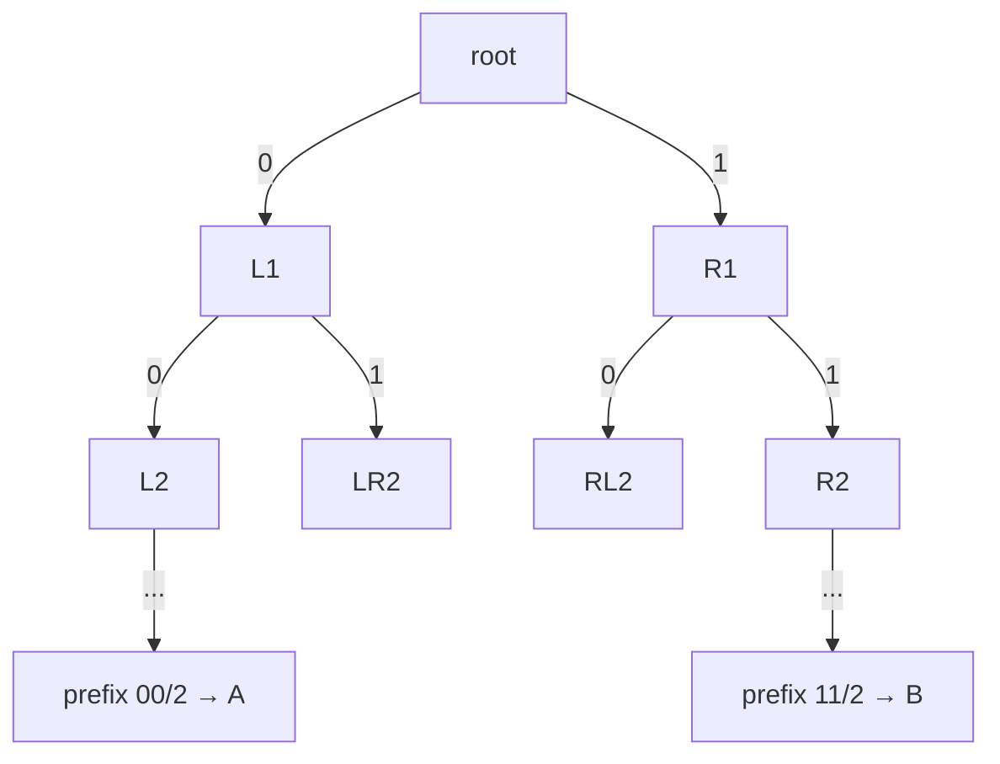
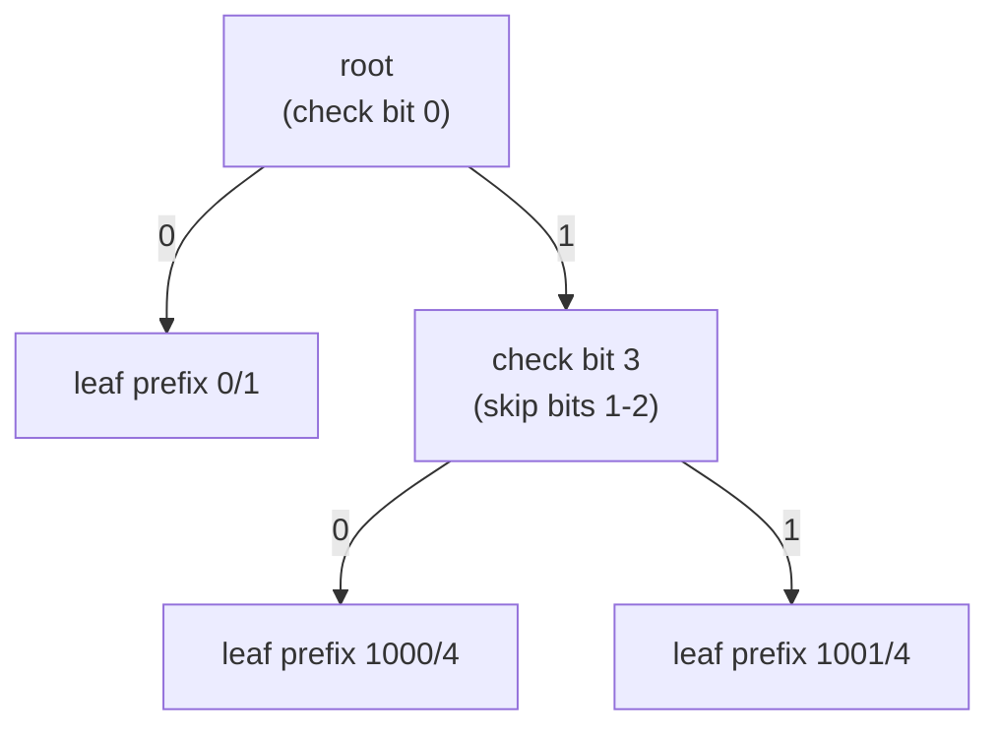
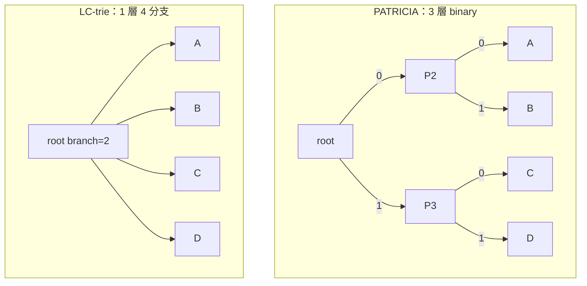
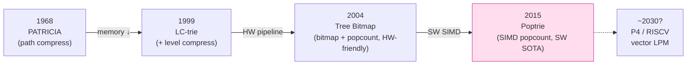
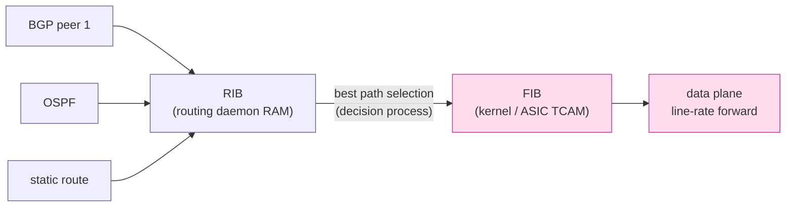
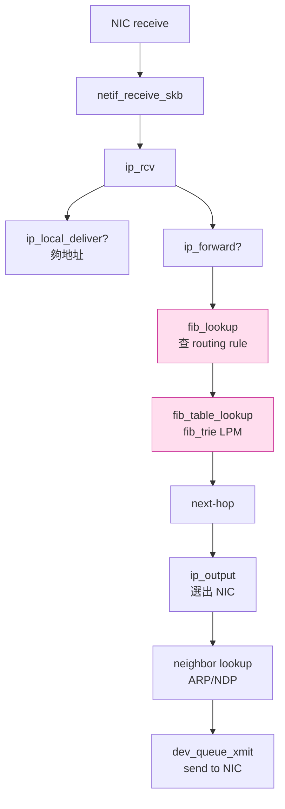

# 課堂 1.4 — IP 層：路由是個圖論問題

## 學前知道

- **前置課**：[1.1 分層的真實意義](./1.1-layering-truth.md)、[1.2 PHY/MAC 介面](./1.2-physical-and-phy-mac.md)、[1.3 乙太網路與 L2](./1.3-ethernet-l2.md)
- **預計閱讀時間**：40~50 分鐘
- **必讀論文 / 規格**：
  - **Morrison — PATRICIA: Practical Algorithm to Retrieve Information Coded in Alphanumeric** (J. ACM 15(4), 1968) — radix trie 之祖
  - **Nilsson & Karlsson — IP-Address Lookup Using LC-Tries** (IEEE JSAC 17(6):1083–1092, 1999) ⭐ — Linux `fib_trie.c` 直接祖先
  - **Eatherton, Varghese, Dittia — Tree Bitmap: Hardware/Software IP Lookups with Incremental Updates** (ACM SIGCOMM CCR 34(2), 2004) — Cisco 硬體路由器用
  - **Asai & Ohara — Poptrie: A Compressed Trie with Population Count for Fast Routing Lookup** (SIGCOMM 2015) — 2026 軟體路由器 SOTA
  - **RFC 4271 — A Border Gateway Protocol 4 (BGP-4)** (Rekhter, Li, Hares, 2006)
  - **RFC 6480 — An Infrastructure to Support Secure Internet Routing (RPKI)** (Lepinski & Kent, 2012)
  - **RFC 8754 — IPv6 Segment Routing Header (SRH)** (Filsfils et al., 2020)
- **必讀原始碼**：
  - Linux `net/ipv4/fib_trie.c`（IPv4 FIB，LC-trie 變體）
  - Linux `net/ipv4/fib_rules.c`、`net/core/fib_rules.c`（policy routing）
  - DPDK `lib/lpm/rte_lpm.c`（DIR-24-8 風格 trie，userspace 高速路由）

---

## 動機

1.3 我們講過：**GFW 不在 L2，而在 IP 層 router 上**。本堂就是「**GFW 站的那一層**」。

但路由不只是「GFW 在哪」這麼狹隘。對 G6 設計具體的影響面：

1. **VPS 出口策略決定 GFW 看到的 path**：你 VPS 上有多個網路介面（主 NIC、IPv6 NIC、可能 wg0 出口）。路由表決定**哪個流量走哪條 path**——這直接決定 GFW 在哪一段看到你的 packet
2. **客戶端 transparent proxy 全靠 policy routing**：Clash TUN mode、tun2socks、ss-redir、redsocks 的底層都是 `fwmark + ip rule + 多 routing table`——你不懂這個就 debug 不了 Clash 的怪異行為
3. **Anycast 是 G6 抗封鎖的潛在工具**：同一個 IP 在地球多個地點被宣告（BGP-level），客戶端會自動 routing 到最近 instance——但同時也意味著一旦那個 IP 被 GFW 黑名單，**全部地點都被封**
4. **BGP 是攻防雙方都用的武器**：GFW 過去用 BGP-level null route 封鎖過特定 prefix（[2010 YouTube blackhole](https://www.cidr-report.org/) 是著名公開事件；[Iran 2019 / Russia 2022 全國斷網](https://www.iorgforum.org/) 也是 BGP 操作）。理解 BGP 才能評估「協議多 robust 也救不了 IP 被全網封」這個邊界
5. **Routing 是 distributed algorithm + 圖論的教學典範**：Dijkstra（OSPF）、Bellman-Ford（RIP）、path vector（BGP）——三大演算法在 production 跑了 30+ 年，是設計 G6 control plane 的 first principle 參考

教科書講路由的問題是：花太多時間講「RIP vs OSPF」這種 1990s 工程細節，**真正關鍵的「LPM 為什麼用 trie 不用 hash」、「ECMP 怎麼跟 5-tuple hash 互動」、「BGP convergence 為何那麼脆弱」這些事**反而沒講透。本堂直接從這些問題切入。

---

## 核心概念

### 1. 路由查找的核心問題：Longest Prefix Match (LPM)

當 packet 到達 router，目標 IP `D`，路由表內可能多條 entry match：

```
路由表：
0.0.0.0/0       → next-hop A   (預設路由)
192.0.2.0/24    → next-hop B
192.0.2.128/25  → next-hop C
192.0.2.64/26   → next-hop D
```

`D = 192.0.2.130` match 哪一條？

- `0.0.0.0/0` match（任何 IP 都 match）
- `192.0.2.0/24` match
- `192.0.2.128/25` match（130 二進位 `10000010`，與 128 `10000000` 前 7 bit 同）
- `192.0.2.64/26` **不** match（64-127 範圍）

⇒ **取最長 prefix 的一條**（25 > 24 > 0）→ next-hop C。**這就是 LPM**。

#### 為什麼不能用 hash table

Hash table 解決 **exact match**：`key → value`。但 LPM 是 **range match**：「給我 longest matching prefix」。如果硬要用 hash：

- 對每個 prefix 長度 L（0~32）開一個 hash table，每張 table 內 key 是 L-bit prefix
- 查時從 L=32 開始試到 L=0 → **最壞 33 次 hash lookup**
- 加上 cache miss penalty，慢到不可接受

⇒ **LPM 需要專屬資料結構**，這催生了 30 年的演算法演化。

### 2. Trie 結構演化：四代

#### 第 1 代：Binary trie（最朴素）

每個 bit 一層樹。32 bit IP → 最深 33 層。



**問題**：路由表有 ~1M IPv4 entry（2026 internet），平均 prefix 長度 ~24-bit。每個 lookup 最多 32 次 memory access——**過慢**（每次 RAM access ~70ns → 一次 lookup ~2μs → 500K pps 上限，遠低於 line rate）。

#### 第 2 代：PATRICIA / Radix trie（Morrison 1968）

**核心想法**：把「只有一個孩子」的長串節點壓成一個——**path compression**。每個節點存「下一個要看的 bit position」+ 該位置上的子節點。



**收穫**：節點數從 O(L × N)（L=address 長度，N=entry 數）降到 O(N)。
**代價**：每節點需存 bit position（比較） + 完整 prefix（驗證）。

Morrison 1968 paper 是經典 CS 文獻——原本不是給 IP 用的（為 retrieval system 設計），但思想極通用，BSD 從 4.3 開始用 PATRICIA 作 routing table。

#### 第 3 代：LC-trie（Nilsson & Karlsson 1999）⭐ — Linux fib_trie 祖先

PATRICIA 只做 path compression。LC-trie 加上**level compression**：把連續多層 dense 的子樹**展平**成單一多分支節點。



**關鍵設計**：
- 子樹「夠 dense」（如 90%+ slot 有 entry）就展平
- 展平後一個節點看 k bit（k=branch factor），子節點是 2^k 個
- Search 變成「一次比 k bit、跳一次」而非「比 1 bit、跳 k 次」
- Nilsson & Karlsson 證明：**對真實 internet routing table 的 prefix 分佈，平均 search depth = Θ(log log n)**，n = entry 數
- **節點編碼可壓到 4 byte**：branch (5 bit) + skip (7 bit) + pointer (20 bit)

實測（1999 論文，real-world routing table ~38K entries）：
- LC-trie 搜尋深度平均 ~6 次 memory access
- PATRICIA 平均 ~26 次
- Binary trie 平均 ~25 次
- **5× 加速、≤ 700 KB 表**

#### Linux fib_trie.c 怎麼實作

Linux 2.6.13（2005）把 IPv4 FIB 從 `fib_hash`（hash on prefix length）改成 `fib_trie`（LC-trie 變體）。具體：

- **Internal node** 含 `bits` 欄位（=當前 stride，1~16）、`pos` 欄位（=從 IP 哪個 bit 開始切）、`tn_info`、`child[]`（2^bits 個 child slot）
- **Leaf node** 存 `key`（完整 prefix）+ `t_key` 鏈到 fib_alias / fib_info（next-hop 資訊）
- **動態 resize**：load factor 太低 → 縮 bits；太高 → 擴 bits。**這個 incremental update 性質是 Nilsson 1999 缺乏、Linux 自己加上的工程能力**
- 主要 lookup 入口：`fib_table_lookup()` → `trie_table_lookup()` → 沿著 trie 走，每 stride 比 `bits` bit

如果你看 Linux source 想了解一個 IPv4 packet 怎麼被 route，這就是入口。**`/proc/net/fib_trie`** 可以實時 dump 整個 trie 結構——對 debug 極有用。

#### 第 4 代：Tree Bitmap（Eatherton 2004）+ Poptrie（Asai 2015）

LC-trie 對軟體 dense。但硬體（router ASIC）需要「**memory access 次數 deterministic、可 pipeline**」——LC-trie 的 variable stride 對硬體不友善。

**Tree Bitmap（Eatherton 2004）**：固定 stride（典型 8），每節點用兩個 bitmap：
- **Internal bitmap**：標 stride 內各 prefix 是否有 entry
- **External bitmap**：標哪些子節點存在

`popcount(bitmap[0..i])` 給出第 i 個 child 在 children array 的 offset。⇒ 一次 lookup = N stride × O(1) per stride，**完全 pipeline-able**。
**Cisco CRS-1 / Trident / Tomahawk 系列硬體用 Tree Bitmap 或衍生版**。

**Poptrie（Asai & Ohara 2015）**：把 Tree Bitmap 從硬體搬回軟體 + 用 SIMD popcount + 緊湊 layout。**現代軟體路由器（如 BIRD2、VPP）跑大 BGP table 的 SOTA**。



### 3. FIB vs RIB：control plane 與 data plane 的分離

**RIB（Routing Information Base）**：control plane 持有的「所有候選路由」（從 BGP / OSPF / static 學來的）。可能 1 個 prefix 有多個來源、多條候選 path。**體積大**，~M 條 BGP table 時可達數百 MB。

**FIB（Forwarding Information Base）**：data plane 用的「**已決定的最佳路由**」。每個 prefix 只剩 1（或 ECMP 多個）next-hop。**體積小**、必須**極快查找**。



對 G6：**這個分離模式直接影響 Phase III 11.6 設計**——control（key exchange、endpoint discovery）走慢 path、可以複雜；data（封包 forward）走快 path、必須極簡。**這個 architecture 不是巧合，是 30 年 routing 工業界血淚教訓**。

### 4. ECMP（Equal-Cost Multi-Path）：multiple next-hop

當 FIB 對同一 prefix 有多條等成本 path：

```
default via 10.0.0.1 dev eth0 weight 1
default via 10.0.0.2 dev eth0 weight 1
```

router 對每個 packet **不能隨機選**——同 flow 不同 packet 走不同 path 會造成 TCP reorder → throughput 崩潰。

⇒ 用 **flow hash** 決定：`hash(src_ip, dst_ip, src_port, dst_port, proto) mod N`。同 flow 同 hash → 同 path → 不 reorder。

#### 對 G6 的隱性影響

- 你 G6 server 出 VPS 後若 hyperscaler 上行有 ECMP（幾乎必然，大型 transit 都用 ECMP），**你的單一連線只會走其中一條 path**——其他 path 對該連線不可用
- 換 src port 會換 hash → 走不同 path → **可能改善或惡化丟包**（如果某條 path 過載）
- QUIC 的 **connection migration**（改 src port / src IP）會觸發 path rehash——是 feature 也是 attack surface（**對手可主動改 hash 把你 flow 推到 lossy path**）
- **MP-TCP / MP-QUIC** 主動利用 ECMP——同時開多條 subflow 走不同 hash → 不同 path → 聚合頻寬

### 5. Policy Routing：fwmark + 多 routing table

標準 Linux 不只有一張 routing table——可以**多張**，靠 `ip rule` 決定哪個 packet 查哪張：

```bash
# 看 rule（順序執行，第一個 match 為準）
ip rule show
# 預設：
# 0:	from all lookup local
# 32766:	from all lookup main
# 32767:	from all lookup default

# 加一條：fwmark 0x1 的 packet 查 table 100
ip rule add fwmark 0x1 table 100

# 在 table 100 加路由
ip route add default via 10.8.0.1 dev wg0 table 100

# 然後用 iptables/nftables 給特定流量打 mark
iptables -t mangle -A OUTPUT -d 192.0.2.0/24 -j MARK --set-mark 0x1
```

#### Clash TUN mode / tun2socks 怎麼用這個

Clash 開 TUN mode 後：
1. 創建 `utun0`（macOS）/ `tun0`（Linux）虛擬 NIC
2. **新增 default route 指向 utun0**（搶走系統流量）
3. macOS 上額外用 PF rule，Linux 上用 `ip rule + fwmark` 把**特定流量繞回原 NIC**（不然 Clash 自己連 VPS 也會被自己接管 → 迴圈）

**Clash 「Bypass 流量」設定底層就是這個 policy routing**。理解這個你才會 debug Clash 偶爾迴圈、流量繞錯的問題。

#### sing-box 的 route 段

sing-box 的 `route.rules` 配置在 user space 重現了 `ip rule` 的概念——但 evaluation 發生在 sing-box 自己的 socket layer 而非 kernel routing。**這個重複實作是合理的設計取捨**（跨平台 portability），但**效能損失約 5-15%**——Phase III G6 設計時要決定走 kernel routing（快、Linux-only）還是 user space matcher（慢、跨平台）。

### 6. Source Routing：死掉的 LSRR/SSRR、復活的 SRv6

#### 為什麼傳統 source routing 死了

IPv4 header 有 **LSRR（Loose Source and Record Route, RFC 791）** 與 **SSRR（Strict Source Route）** option，讓 sender 指定 packet 走哪些 hop。**1990s 起所有 internet router 預設 drop 含此 option 的 packet**——理由：
- **匿名性破壞**：可被用來 bypass return-path filtering
- **DDoS 放大**：可逼 packet 反覆繞 transit
- **管理上不可控**：違反 ISP 的 traffic engineering policy

⇒ 該功能 **de facto 不可用**。RFC 7126 (2014) 正式建議全網 drop。

#### SRv6（RFC 8754, 2020）的復活

但 source routing 思想沒死——**IPv6 + MPLS-SR + SDN 把它復活**，叫 **Segment Routing**。
- 在 IPv6 packet 加 **SRH（Segment Routing Header）**，內含一串「segment list」
- 每個 segment = 一個 IPv6 address（代表 node、link 或 service function）
- Packet 沿 list 走，每經過一個 segment 把 pointer 推進

```
Outer IPv6: dst = segment[0]
+ SRH: [segment[0], segment[1], ..., segment[n]]
       pointer → 0
```

**為什麼這次成功**：
- 只在「**信任域內**」用（單一 AS、單一 DC）——不暴露外部
- 與 SDN controller 配合：controller 算 path、注入 SRH
- 用於 traffic engineering、service chaining、SD-WAN

**對 G6 的影響**：
- 短期：無——G6 不在 SR 域內
- 中長期：若 ISP / hyperscaler 把 SRv6 推到 customer edge（Cloudflare Magic Transit 已在做），**G6 packet 可能被 ISP 主動 inject SRH**——這變成新的 metadata side channel
- **SRv6 + INT（Inband Network Telemetry）**：每個 transit hop 可往 packet 加 trace metadata——若 GFW 部署這個技術，可拿到極詳細 path info

### 7. BGP 30 秒：你必須知道但 1.15 才精講

BGP 是 internet 唯一的 inter-AS routing protocol。完整 BGP 是 **Part 1.15「BGP：網際網路為什麼會塞」**（同 Part 1 後續單獨一堂）會精講。本堂只給最小可用知識：

| 概念 | 速記 |
|---|---|
| **AS（Autonomous System）** | 一個 routing policy 自主單位（ISP、大型企業、Cloudflare 等）。全球 ~110K active AS（2026） |
| **eBGP** | AS 之間跑的 BGP |
| **iBGP** | 同一 AS 內 router 之間跑的 BGP |
| **AS path** | 一條路由經過的 AS 序列（防迴路 = 自己 AS 出現過就拒絕） |
| **BGP best path selection** | 一個 8-step 演算法決定多條候選 path 哪條入 FIB（LOCAL_PREF、AS path 長度、MED、IGP cost、router ID...） |
| **BGP communities** | 32-bit tag，**沒語義**，純粹 ISP 之間約定（如「`64512:666` = 觸發 null route」是 DDoS scrubbing 共識） |
| **RPKI（RFC 6480）** | 用 PKI 證明 prefix → AS 映射，緩解 BGP hijack |
| **ROA（Route Origin Authorization）** | RPKI 的具體 record 類型 |
| **BGP convergence** | **慢**——典型 prefix 加減 30~60 秒收斂；極端情況分鐘級。**這就是 anycast 切換不能依賴 BGP 做 real-time failover 的原因** |

#### BGP hijack 與審查

歷史事件：
- **2008 Pakistan YouTube blackhole**：巴基斯坦 ISP 試圖境內封 YouTube，AS path 漏出去，全球 YouTube 流量 ~2 小時被吸到巴國然後丟掉
- **2018 MyEtherWallet hijack**：俄羅斯 AS 短暫 hijack Amazon Route53 DNS 用的 prefix，用戶被引去釣魚站
- **2022 Russia/Ukraine**：多次 BGP-level packet steering 與封鎖

**對 G6**：
- GFW 在境內 backbone 有 BGP 控制權——**理論上可以對任何 prefix 注入 null route**。這意味著「**只要 IP 被識別，BGP 級封鎖可在 1 分鐘內全國生效**」
- 但 GFW **典型不用** BGP 封——因為 GFW 更喜歡 selective drop（讓特定協議死、其他活）而非 BGP null route（一刀切）
- **anycast IP 一旦被 BGP 級封 → 全球地點都 unreachable**（GFW 看 src IP，不看你 announcement 在哪）——這是 anycast 部署的根本風險

### 8. 一個 packet 在 Linux kernel 內走完的路（重點 routing 部分）



**熱點**：`fib_lookup` + `fib_table_lookup` 是每個 forwarded packet 必經。Linux 在 `fib_trie.c` 用 LC-trie 變體加速。**如果你想 patch Linux TCP stack 修小問題（Part 1 deep bar）**，這個檔案是你必看的。

---

## 與我們協議設計的關聯

| Phase III 設計 | 路由知識的影響 |
|---|---|
| **11.4 主架構決策** | control plane / data plane 分離 → 模仿 RIB / FIB 的成熟模式 |
| **11.6 握手與狀態機** | 握手走「control channel」邏輯上獨立於 data channel，類比 BGP signaling vs IP forwarding |
| **12.6 客戶端整合** | 客戶端必須懂 policy routing + fwmark 才能做 transparent proxy；G6 client SDK 要提供原生支援 |
| **12.7 服務端** | server 出口策略：是否走多上行（多 ISP）做 ECMP-style failover？是否 anycast 部署？ |
| **12.13 高丟包鏈路** | ECMP hash 把流量推到 lossy path 是真實威脅——測試時要模擬 |
| **9.x GFW 對抗** | BGP-level 封鎖是 GFW 的「終極殺器」但代價大、selectivity 低——理解此邊界才能評估 G6 對「IP 被燒」的恢復策略 |

### Anycast 對 G6：誘人但有刺

優點：
- 同一 G6 IP 在全球多地宣告 → 客戶端自動連到最近 instance → **延遲降低 + 抗區域性網路問題**
- **若一地 instance 故障，BGP 自動把流量導去另一地**（典型 30-60 秒收斂）

刺：
- **GFW 一旦封 IP**，所有地點同時被封——不像 unicast 部署可逐 IP 輪換
- **連線一致性問題**：BGP 路由若中途切換，TCP/QUIC 連線可能被切到另一 instance → state 不一致。**對 TCP 致命，對 QUIC 連線遷移友善但仍需 server 端 state replication**
- **anycast 不適合 long-lived connection**——G6 若走長連線模型，anycast 風險大於收益

**初步判斷（待 Part 11 review）**：G6 baseline 不走 anycast，但留設計空間給未來「短連線 + multi-IP DNS」模式。

---

## 動手（30 分鐘）

### 任務 1（5 min）：看自己 Mac / Linux 路由表

```bash
# macOS
netstat -rn -f inet | head -20    # IPv4 routing table
netstat -rn -f inet6 | head -20   # IPv6

# Linux VM 內
orb -m debian -- ip -4 route show
orb -m debian -- ip -6 route show
orb -m debian -- ip rule show     # routing rule（多 table）
```

**思考**：你的 default route 經過哪個介面？你 Mac 開啟 Clash TUN mode 後 default route 變什麼？多了什麼 rule？

### 任務 2（10 min）：用 traceroute / mtr 看實際 path

```bash
# 看到你 VPS 走幾跳
mtr -nrwbz vps.example.com -c 10

# 對比，看到 Google
mtr -nrwbz 8.8.8.8 -c 10

# IPv6 path
mtr -6 -nrwbz 2001:4860:4860::8888 -c 10
```

**思考**：第一跳是誰（你 ISP / OrbStack NAT）？哪一跳開始進入 transit AS？AS_PATH 換了幾次？查每個 IP 屬於哪個 AS（用 [bgp.he.net](https://bgp.he.net/) lookup 或 `whois IP | grep -i origin`）。

### 任務 3（10 min）：在 Linux VM 內 dump fib_trie

```bash
# 進 VM
orb -m debian

# 看 IPv4 FIB 內部結構（Linux 把 LC-trie 直接 expose 出來）
sudo cat /proc/net/fib_trie | head -50

# 你會看到節點型態（Internal vs Leaf）、bit position、prefix
# 對比 ip route show，理解 trie 怎麼編碼 routing table
```

**思考**：trie 深度多少？最大 stride（一節點 branch factor）多少？如果你的 routing table 只有 5 個 entry，trie 是否退化成幾乎 binary？

### 任務 4（5 min）：玩 policy routing 自己加一條

```bash
orb -m debian
# 加一條 rule + 新 table
sudo ip rule add from 192.168.222.0/24 table 200 priority 1000
sudo ip route add default via 10.0.0.99 dev eth0 table 200
sudo ip rule show     # 看到你的 rule
sudo ip route show table 200

# 清掉
sudo ip rule del from 192.168.222.0/24 table 200
sudo ip route flush table 200
```

**思考**：rule 的 priority 順序很重要——若你加的 rule priority 是 99（< default 100），就會搶在 main table 前——任何 src=192.168.222.x 的 packet 都走你新 table。Clash TUN mode 用什麼 priority？（提示：通常 < 1000）

### 任務 5（可選 10 min）：trace 一個 packet 的 routing 決策

```bash
# 在 Linux VM 內用 perf 抓 fib_lookup
sudo perf probe -a 'fib_table_lookup'
sudo perf record -e probe:fib_table_lookup -aR -- sleep 5 &
ping -c 100 1.1.1.1
sudo perf script | head -20
```

看每次 lookup 進入 trie 的位置、走了幾層。**這是「研究員觀察 kernel 內部」的標準技法**。

---

## 自我檢查

1. 為什麼 IP 路由查找不能用 hash table？hash table 與 trie 在 query 語義上的差別是？
2. LC-trie 比 PATRICIA 多了什麼？為什麼這個多出來的東西讓 search depth 從 O(log n) 降到 Θ(log log n)？
3. Tree Bitmap 為什麼比 LC-trie 適合硬體？兩個 bitmap 各自的作用是？
4. RIB 與 FIB 為什麼要分離？舉一個如果不分離會發生的具體災難。
5. ECMP 為什麼用 flow hash 而不是 per-packet round robin？這個設計對 QUIC connection migration 的影響是？
6. Clash TUN mode 改了哪些 routing table / rule？為什麼 Clash 自己連 VPS 不會被自己接管？
7. 為什麼 LSRR 死了但 SRv6 活了？兩者本質都是 source routing，差別在哪？
8. GFW 用 BGP-level 封鎖的代價是什麼？為什麼他們**典型不用**這招？

---

## 延伸閱讀

- **Varghese — *Network Algorithmics* (Morgan Kaufmann, 2005)** — LPM / classification 演算法權威教材；2026 仍是 reference 標準
- **Linux source tree `Documentation/networking/`** — `fib_trie.txt`、`ip-sysctl.rst` 等
- **BIRD2 documentation** <https://bird.network.cz/> — 開源 BGP daemon，看真實 production-grade RIB 實作
- **VPP (Vector Packet Processing) documentation** <https://fd.io/> — 軟體路由器 SOTA，跑 Poptrie + DPDK
- **RIPE Atlas / RIPE Stat / bgp.he.net** — 觀察真實 BGP 狀態的標準工具
- **Cisco *BGP Design and Implementation*** — 工業界 BGP 設計實務
- **Lou Berger / Adrian Farrel — *MPLS: Next Steps*** — SR / SRv6 起源與演化

---

## 研究級補遺

> 主體在工程與演算法。本節升級到形式化定義、學界詞彙、未解問題。

### 1. 學界詞彙

- **LPM（Longest Prefix Match）**：路由查找核心問題
- **FIB / RIB（Forwarding / Routing Information Base）**：data plane vs control plane 表
- **AdjRIBIn / LocRIB / AdjRIBOut**：BGP 內部分階段表（接收 / 決策 / 通告）
- **CIDR（Classless Inter-Domain Routing, RFC 4632）**：1993 終結 class A/B/C，prefix 變 variable length
- **Aggregation / Disaggregation**：把多 prefix 合併成一條 supernet，或反之拆出多 longer prefix
- **De-aggregation as attack**：BGP hijack 常用——攻擊者通告 longer prefix 強制吸引流量
- **Controlled Prefix Expansion (CPE)**：把 LPM 轉為固定 stride 多 exact match 的技術
- **DIR-24-8 / DIR-24-8-BASIC**：Gupta-Lin-McKeown 1998 風格的兩階 lookup（24-bit + 8-bit），用於高速軟體實作
- **PATRICIA trie**：path-compressed binary trie
- **LC-trie**：level + path compressed trie
- **Tree Bitmap**：bitmap-encoded fixed-stride trie
- **Poptrie**：population-count Tree Bitmap variant
- **ECMP（Equal-Cost Multi-Path）** vs **WCMP（Weighted-Cost Multi-Path）**：等成本 vs 加權成本多徑
- **Flowlet switching**：DC 用——burst 內 packet 走同 path，burst 間可切換 path
- **PBR（Policy-Based Routing）**：基於非 dst-IP 的 routing 決策
- **VRF（Virtual Routing and Forwarding）**：一 router 內多獨立 routing instance
- **MPLS / Segment Routing / SRv6**：traffic engineering 三代
- **AS Path Poisoning**：通告含「自己 AS」的 path 強迫被特定 AS reject
- **MOAS (Multiple Origin AS)**：一 prefix 由多 AS 通告——RPKI 之前是常見正常狀態，之後變異常
- **RPKI / ROA**：BGP prefix origin 認證
- **BGPsec (RFC 8205)**：認證整個 AS path（更強但部署率極低）
- **PCE (Path Computation Element, RFC 4655)**：centralized path 計算單元（SDN 前身）
- **SDN (Software Defined Networking)**：control plane 中心化，OpenFlow 1.0 (2009) 為標誌

### 2. 對手分類學 / 威脅模型精化

| 對手能力 | 影響 G6 |
|---|---|
| **被動 passive on-path（典型 GFW）** | 看 packet header（src/dst IP、TCP/UDP port）、L7 payload；不改變 packet | G6 偽裝 + 加密足以對抗 |
| **主動 active on-path** | inject TCP RST、selective drop、SNI-based block | 需 anti-RST、QUIC over UDP |
| **AS-level BGP control** | hijack prefix、null-route prefix、prefix-level rate limit | **無法在協議層對抗**——須運維層應對（多 IP、anycast 風險評估） |
| **transit-level packet steering（如 ISP DPI）** | redirect 特定流量到 inspection middlebox | 端到端加密 + 流量混淆 |
| **下游 ISP 限速 / 限 port** | UDP / 443 限速（GFW 對 QUIC 常用） | 多 fallback transport |

**研究級重點**：G6 的 threat model 必須**明確包含 BGP-level 對手能力但承認協議層無法應對**——這個邊界要寫進 11.1。試圖在協議內對抗 BGP hijack 是錯誤的設計方向（**抗 BGP hijack 是基礎設施層問題，要靠 RPKI / BGPsec / 多 IP 部署**）。

### 3. 形式化定義

#### LPM problem

**Input**：prefix set P = { (p_1, l_1, v_1), ..., (p_n, l_n, v_n) }，每 entry 是 (prefix bits, length, next-hop value)。Query IP D。
**Output**：max-length prefix p_i 使得 p_i 是 D 的前 l_i bit。回傳對應 v_i。若多 entry tied → undefined（實作通常後加入者勝，或 explicit tie-break）。

**複雜度下界**：information-theoretic lower bound for LPM on n entries with W-bit address is **Ω(log n)** in comparison-based model，**Ω(W / log W)** in word-RAM model. LC-trie 達到 **Θ(log log n) expected** 在某些 distribution assumption 下，是針對 internet routing table 的 prefix 分佈特化的結果（不是 worst case）。

#### FIB consistency under update

**Property（atomic update）**：對 prefix p 的 update（add/del/modify），任何 in-flight lookup 要嘛看到 update 前狀態、要嘛看到後狀態，不能看到中間 inconsistent 狀態（如「prefix exists but next-hop NULL」）。

**Linux fib_trie 滿足 atomic update**：透過 RCU（Read-Copy-Update）——updater 構造新 subtree，atomic swap pointer。**這是 Linux kernel 廣泛使用的 lock-free 技術，對 G6 control plane 設計有參考價值**（state 更新 vs 讀流量並發）。

#### BGP convergence

形式化結果**負面為主**：
- **Griffin & Wilfong 1999** 證明 BGP（在 expressive policy 下）**可能不收斂**——存在 oscillation 情境
- **Real-world convergence time**：~30 sec（best）到 ~10 min（worst）
- **目前缺乏實用的 termination 證明**——production BGP 靠 dampening + 經驗 policy 避免 pathology

對 G6 control plane：**不要試圖模仿 BGP**。借助 Raft / Paxos 等 proven consensus algorithm 設計協調 layer。

### 4. 必追論文 / 規格

按重要性：

- ✅ **Nilsson & Karlsson 1999 LC-tries** — Linux 直接祖先
- ✅ **Eatherton, Varghese, Dittia 2004 Tree Bitmap** — 硬體標準
- ✅ **Asai & Ohara 2015 Poptrie** — 2026 軟體 SOTA
- ✅ **Morrison 1968 PATRICIA** — radix trie 起源
- ✅ **RFC 4271 BGP-4** — 必須通讀章節 5 (path attributes) + 9 (UPDATE message handling)
- ✅ **RFC 6480 + 8210 + 6482 RPKI 家族** — 必看
- **Gupta, Lin, McKeown 1998 *Routing Lookups in Hardware at Memory Access Speeds*** (SIGCOMM) — DIR-24-8 原型
- **Crescenzi, Dardini, Grossi 1999 *IP Address Lookup Made Fast and Simple***
- **Degermark et al. 1997 *Small Forwarding Tables for Fast Routing Lookups*** (SIGCOMM) — Lulea 算法
- **Sundström & Larzon 2005 *High-Performance Longest Prefix Matching Supporting High-Speed Incremental Updates and Guaranteed Compression***
- **Griffin & Wilfong 1999 *An Analysis of BGP Convergence Properties*** (SIGCOMM) — BGP 不收斂性
- **Mahajan, Wetherall, Anderson 2002 *Understanding BGP Misconfiguration*** (SIGCOMM) — production 觀察
- **Caesar et al. 2005 *Design and Implementation of a Routing Control Platform*** (NSDI) — control plane 中心化先驅
- **Casado et al. 2007 *Ethane: Taking Control of the Enterprise*** (SIGCOMM) — SDN 雛形
- **McKeown et al. 2008 *OpenFlow: Enabling Innovation in Campus Networks*** (CCR) — SDN 標誌論文
- **Singh et al. 2015 Jupiter Rising** (SIGCOMM) — Google DC SDN 演化
- **Filsfils et al. 2015 *Segment Routing Architecture***
- **Sermpezis et al. 2018 *A Survey among Network Operators on BGP Prefix Hijacking*** — 真實 hijack 量化

### 5. 我們協議的座標 / 設計取捨

| 設計面 | 路由知識的具體影響 |
|---|---|
| **G6 出口策略** | server 端要不要支援 fwmark-based 多 ISP 出口？若 yes，必須在 Linux-only deployment 假設下設計 |
| **客戶端 client SDK** | 必須原生支援 policy routing 操作（Linux: ip rule；macOS: PF table；Windows: routing table API）——這是 Clash 客戶端龐大複雜的原因 |
| **anycast 部署選項** | baseline 不走，但 spec 留 connection ID 設計空間給未來 server-side state replication（QUIC connection migration 友好的） |
| **control plane 架構** | 學 RIB/FIB 分離；學 BGP 「best path selection」這種多輸入決策模式；**不**學 BGP 的 expressive policy（會招來 non-convergence） |
| **trace metadata 對抗** | SRv6 + INT 可能在未來給 GFW 提供路徑側信息——G6 不能假設 packet header 之外的 metadata 不存在 |
| **measurement 基礎設施** | RIPE Atlas / RouteViews 是評估 G6 部署 reach 的標準工具——Part 12.18 真實環境測試會用 |

### 6. 必追資源 / 社群入口

- **RouteViews project** <http://www.routeviews.org/> — Oregon 大學維護的全球 BGP 觀測點
- **RIPE RIS（Routing Information Service）** <https://ris.ripe.net/> — RIPE 的同類
- **bgp.he.net** — Hurricane Electric 的 BGP 可視化 / lookup
- **bgpview.io** — modern BGP looking glass
- **RPKI Dashboard（NLnetLabs）** <https://rpki-validator.ripe.net/> — RPKI 部署狀態
- **CIDR Report** <https://www.cidr-report.org/> — IPv4/v6 routing table 大小趨勢
- **NANOG mailing list** — 北美網路運維社群，BGP / DDoS / hijack 事件首發地
- **APNIC blog** — Asia Pacific NIC 技術部落格，Geoff Huston 長文
- **RFC Editor's Future of Networking 系列** — IETF 對未來 routing 的 SoK

### 7. 開放問題（research-level）

- **可程式化 line-rate LPM**：P4 可程式化 switch 上實作 LC-trie / Tree Bitmap 變體，最近 Tofino 2 (6.5 Tbps) 已可。**但記憶體 budget 是 100 MB 級 BGP table 的物理瓶頸**——open
- **BGP convergence 的形式化**：production BGP 30 年無嚴格 convergence 證明。**TLA+ / Coq 化 BGP policy 一段子集**是 ongoing research，但完整建模尚遠
- **anycast 對審查抗性的真實量化**：anycast IP 一旦被封是否真比 unicast 容易恢復？**目前無公開大規模實證**——Part 9 GFW 研究中應該設計實驗
- **post-quantum BGP**：BGPsec 用 ECDSA，量子來臨需切到 PQC。**目前 IETF 進度緩慢**
- **路由 vs 流量分析的耦合**：GFW 部署位置決定它能看到的 path 子集。若 G6 能**主動 steer 流量繞過 GFW 部署 hot path**（透過 SRv6 / ISP 合作的 policy routing），是否可以做到「對 GFW 不可見」？這是非常激進的研究方向
- **去中心化路由（Yggdrasil、cjdns、Hyperboria）的可行性**：完全 P2P 路由能否在審查環境穩定運行？**密碼學 addressing + DHT-based routing 是新方向，但 scaling 未證**——若可行，G6 v2 可考慮整合
- **AI-assisted routing (RL for traffic engineering)**：Google B4、Microsoft SWAN 用 RL 做 WAN TE，但仍封閉。**對 G6 server 多上行的 path selection 是否有用**？open

---

下一堂：**1.5 ARP / NDP / DHCP：「啟動時的兩三件事」**——為什麼這些「啟動時 boring」協議的設計缺陷會變成永恆攻擊面（ARP spoofing 在 2026 仍活躍）；對應 G6 客戶端 boot 時的 trust establishment。
