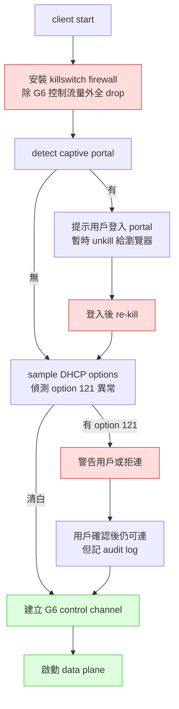

# 課堂 1.5 — ARP / NDP / DHCP：「啟動時的兩三件事」

## 學前知道

- **前置課**：[1.3 乙太網路與 L2](./1.3-ethernet-l2.md)（broadcast domain、MAC learning）、[1.4 IP 路由](./1.4-ip-routing-graph.md)（routing table、policy routing）
- **預計閱讀時間**：40~55 分鐘
- **必讀規格 / 論文**：
  - **RFC 826 — An Ethernet Address Resolution Protocol** (Plummer, 1982) — ARP 全文 47 段，半小時可讀完，現代 networking 起點
  - **RFC 2131 — Dynamic Host Configuration Protocol** (Droms, 1997) — DHCPv4
  - **RFC 3315 → RFC 8415 — DHCPv6** (Mrugalski et al., 2018) — DHCPv6 整合版
  - **RFC 3442 — The Classless Static Route Option for DHCPv4** (Lemon, Cheshire, Volz, 2002) — **TunnelVision 攻擊的根源**
  - **RFC 4861 — Neighbor Discovery for IP version 6 (IPv6)** (Narten, Nordmark, Simpson, Soliman, 2007) — NDP
  - **RFC 4862 — IPv6 Stateless Address Autoconfiguration** (Thomson, Narten, Jinmei, 2007) — SLAAC
  - **RFC 3971 — SEcure Neighbor Discovery (SEND)** (Arkko, Kempf, Zill, Nikander, 2005) — **失敗的標準**
  - **RFC 6105 / RFC 7113 — IPv6 RA-Guard** (Levy-Abegnoli et al., 2011/2014)
  - **RFC 7217 — A Method for Generating Semantically Opaque Interface Identifiers** (Gont, 2014) — 穩定但偽隨機的 IPv6 IID
  - **RFC 8981 — Temporary Address Extensions for SLAAC** (Gont, Krishnan, Narten, Draves, 2021) — IPv6 privacy（取代 RFC 4941）
  - **RFC 7710 / RFC 8910 — Captive-Portal Identification using DHCP/RA** (Kumari et al., 2017/2020)
  - **Vanhoef, Matte, Cunche, Cardoso, Piessens — Why MAC Address Randomization is not Enough** (ASIA CCS 2016) ⭐
  - **Matte, Cunche, Rousseau, Vanhoef — Defeating MAC Address Randomization Through Timing Attacks** (ACM WiSec 2016)
  - **Cronce & Moratti — TunnelVision (CVE-2024-3661)** (Leviathan Security, 2024-05-06) ⭐ — DHCP option 121 繞過所有 routing-based VPN
- **必讀原始碼**：Linux `net/ipv4/arp.c`、`net/ipv6/ndisc.c`、ISC dhclient or systemd-networkd 的 DHCP option parser

---

## 動機

ARP / NDP / DHCP 是「**設備一上線**」就跑的協議。教科書把它們當「無聊的 boilerplate」一筆帶過——這是錯的。對我們的 G6 設計：

1. **客戶端啟動時的信任建立完全靠這三個協議**——而**這三個都無認證**。任何**接到同 L2 / 同 WiFi 的對手**都能：
   - 劫持你的 default gateway（ARP spoofing / RA injection）
   - 注入惡意路由把 VPN 流量導出 tunnel（**TunnelVision, 2024**）
   - 偽造 DNS server 讓你查到中間人控制的解析結果
   - 偽造 SLAAC prefix 強制配 IPv6 並接管 IPv6 流量
2. **TunnelVision (CVE-2024-3661) 是 2024 年最重要的 VPN 安全事件**——一招 DHCP option 121 注入路由，繞過 WireGuard / OpenVPN / IPsec 所有 routing-based VPN。**這直接界定 G6「kill switch」的設計要求**——不是 nice-to-have 是 mandatory
3. **MAC randomization 是 client privacy 的最後防線**——但 Vanhoef 2016 系列證明**目前實作普遍有洞**（probe-request 殘留資訊、scrambler seed 洩漏、timing fingerprint），對 G6 客戶端設計**「即便系統開了 MAC randomization，仍有 LAN 級 tracking 風險**」這個假設要寫進 threat model
4. **Captive portal 偵測**是任何 G6 client 啟動流程必須處理的（飯店 WiFi、機場 WiFi、辦公室 WiFi 都常見）——做錯的話客戶會反覆失敗看不到 captive portal 登入頁，直接歸咎於「你的 VPN 壞掉」
5. **ARP / NDP / DHCP 是 distributed system 設計的反面教材**——「**broadcast + 信任 + 無認證**」這個原始 trio 在 1982 年合理，2026 年是漏洞工廠。讀懂這三個的故事 = 知道**為什麼任何協議的 trust establishment 必須走密碼學**

教科書講這三個的問題：堆 packet format 細節、忽略攻擊面與 2020+ 修補（RA-Guard、DHCP snooping、RFC 8910 captive portal、TunnelVision）。本堂直接從攻擊面切入，反向理解協議設計的歷史包袱。

---

## 核心概念

### 1. ARP（RFC 826, 1982）——「Who has 192.0.2.1? Tell me.」

#### 1.1 為什麼需要 ARP

你 host 拿到一個 IPv4 packet 要送出去。**Routing table** 告訴你 next-hop IP（如 default gateway 10.0.0.1）。但**送出去到 wire 上**需要 destination MAC——**這個 mapping (IP → MAC) 不在 routing table**。

⇒ ARP 解決 **「同一 L2 segment 內 IP → MAC 解析」**。

#### 1.2 Frame 結構（28 byte ARP payload）

```
+----------------+---+---+---+---+---+---+---+---+
| Hardware Type  | Protocol Type | HLen | PLen   |
|     (2B)       |     (2B)      | (1B) | (1B)   |
+----------------+---+---+---+---+---+---+---+---+
| Opcode (1=request, 2=reply)  (2B)              |
+------------------------------------------------+
| Sender HW Address (6B for Ethernet)            |
+------------------------------------------------+
| Sender Protocol Address (4B for IPv4)          |
+------------------------------------------------+
| Target HW Address (6B, 0 in request)           |
+------------------------------------------------+
| Target Protocol Address (4B)                   |
+------------------------------------------------+
```

- **Hardware Type** = 1（Ethernet）
- **Protocol Type** = `0x0800`（IPv4，與 Ethernet EtherType 共用編碼空間，非巧合）
- **Opcode** = 1（request）/ 2（reply）；後續 RARP / InARP / 動態 ARP 加入 3-25
- **L2 broadcast** by destination MAC `ff:ff:ff:ff:ff:ff`——所有 host 都收到

#### 1.3 演算法（RFC 826 §4）

```
On ARP request received:
  1. Insert (sender_proto_addr, sender_hw_addr) into cache  // 學習！
  2. If target_proto_addr == my IP:
       Send ARP reply (Opcode=2, swap fields)
  3. Else:
       Ignore  // 但 cache 已經更新

On ARP reply received:
  1. Insert (sender_proto_addr, sender_hw_addr) into cache
  2. Match pending packets queued on this IP
```

**注意 step 1 of request handler**：即便該 ARP request 不是問你，**只要你看到它，就學它的 sender mapping**——這是 **gratuitous learning**。**這就是 ARP spoofing 的根因**。

#### 1.4 Gratuitous ARP（無償 ARP）

`opcode=request, sender_proto = target_proto = self IP, sender_hw = self MAC`——「我宣告我是 IP X」。合法用途：
- **Duplicate Address Detection (DAD)**：新拿到 IP，發 gratuitous ARP；若有人回 → IP 已佔
- **IP 變更通知**：HA failover 把 VIP 從 server A 飄到 B，B 發 gratuitous ARP 通知整個 L2

**攻擊用途**：「我是 default gateway 10.0.0.1」——所有 host 把流量送到攻擊者。**這就是 ARP spoofing 一行版**。

#### 1.5 Proxy ARP

Router 替別的網段 host 回 ARP——「你問 10.0.0.5 (在另一網段)？我（router）替它回答，把你的 packet 送來給我，我再幫忙轉。」 1990s 用來糊弄不知道有子網的舊 host，2026 仍有 legacy use case 但**主流被視為設計失敗**——它違反 routing table 的「明確 next-hop」原則，且**對 G6 場景是噪音來源**（會造成 server 看到不該看的 ARP 流量）。

### 2. ARP 攻擊面（為什麼 2026 仍活躍）

#### 2.1 ARP spoofing / poisoning

**最簡單版**：
```
attacker → gratuitous ARP: 「I am 10.0.0.1 (gateway)」
victim → ARP cache 更新 → default gateway MAC = attacker's MAC
victim → 把所有 outbound traffic 送給 attacker
attacker → forward 給真 gateway（or 不 forward = DoS）
```

**結果**：man-in-the-middle (MITM) — 攻擊者看到 victim 所有 IP 流量。

#### 2.2 為什麼 RFC 826 沒設計認證

1982 LAN 是 **「物理上信任」** 的——你進得了那條同軸電纜就是可信內部人。當時 Ethernet 連 switch 都沒有，是 shared 10BASE5/10BASE2 同軸——10K 米內所有設備聽同一條線。**「broadcast 上信任聲明」是當時的合理假設**。

40 年後的 2026，你連的咖啡店 WiFi 就是 shared L2——背景**沒變**，但攻擊者進入門檻變零。**這就是「過時設計變永恆攻擊面」的教科書案例**。

#### 2.3 Mitigation：DHCP snooping + Dynamic ARP Inspection (DAI)

**Cisco / Juniper / Arista 企業級 switch 標配**：
- **DHCP snooping**：switch 監聽 DHCP 流量，建立 (port, MAC, IP) binding table
- **DAI**：每個 ARP packet 檢查是否符合 snooping table；不符 → drop + alarm

**WiFi AP** 上的對應功能：**Client Isolation** + **L2 firewall**。家用 router 多半不開、企業 AP 通常開。

**對 G6**：**不能假設 LAN 是受信任的**。任何 client 啟動流程必須做「**獨立驗證 gateway 身份**」——通常透過 DNS-over-HTTPS 到已知 IP，繞過 LAN-level 信任。

### 3. NDP（RFC 4861, 2007）—— ARP 在 IPv6 的繼承者

IPv6 把 ARP 砍掉，**用 ICMPv6 重寫**——叫 NDP。設計上「比 ARP 好」，但**仍無認證**——歷史包袱換湯不換藥。

#### 3.1 NDP 五種 ICMPv6 訊息

| Type | 名字 | 對應 IPv4 | 用途 |
|---|---|---|---|
| **133 Router Solicitation (RS)** | router 找你來 | 無 | host 上線時詢問 router 在哪 |
| **134 Router Advertisement (RA)** | router 通告 | 部分像 DHCP | router 廣播「我在這、我管 prefix X、預設 hop limit Y、可用 SLAAC」 |
| **135 Neighbor Solicitation (NS)** | 我問 X 的 MAC | ARP request | host 解析鄰居 IP→MAC |
| **136 Neighbor Advertisement (NA)** | 我是 X，MAC = Y | ARP reply | 回 NS |
| **137 Redirect** | 「你下次走 X 比較快」 | ICMP Redirect | router 提示 host 換 next-hop |

#### 3.2 與 ARP 的關鍵差別

1. **不走 L2 broadcast**，走 **IPv6 multicast**（solicited-node multicast `ff02::1:ffXX:XXXX/104`）——只有可能是該 IP 的 host 才收，理論上更高效
2. **NS/NA 走 ICMPv6**——可被 IPsec 保護（理論上；實務從未部署）
3. **RA 可帶 prefix info**——host 收到 RA 後**直接 SLAAC 配 IPv6 address**，不需 DHCPv6
4. **DAD 內建**——配 IP 前對該 IP 發 NS，等若干秒；若有 NA 回 → 衝突

#### 3.3 SLAAC（RFC 4862）—— RA 起作用的地方

收到 RA：
```
RA: prefix=2001:db8:1::/64, autonomous=1, valid_lifetime=86400
host:
  1. 拿自己的 EUI-64（從 MAC 轉，含 ff:fe 中綴）→ IID
  2. 拼成 2001:db8:1::EUI-64
  3. DAD 確認後設成 self address
  4. 加 default route via RA sender's link-local
```

**問題**：EUI-64 含 MAC——**全球唯一、不變、可跨網路追蹤**。⇒ 隱私災難。

#### 3.4 RFC 8981 Privacy Extensions（取代 RFC 4941）

針對 SLAAC 隱私問題的解：
- **Temporary address**：用 random IID 取代 EUI-64
- **生命期短**（preferred lifetime ~1 day, valid ~2 day）
- **與 stable address 並存**：stable 用於 inbound、temporary 用於 outbound
- **每 prefix 各自 random**：不能從 prefix-A 的 IID 推 prefix-B 的 IID

**Linux** 控制：`sysctl net.ipv6.conf.<iface>.use_tempaddr` = 2（建議值，prefer temp）。
**iOS/macOS/Windows**：預設開啟。
**Linux distro 預設**：**多半關**——這是個常見漏洞。

#### 3.5 RFC 7217 Semantically Opaque IID

8981 解決「**跨時間追蹤**」，但每次重連同 prefix 仍是同一 EUI-64-based stable address（除非每次 reboot）。RFC 7217 補：**用 PRF(secret, prefix, iface, dad_counter, ...) 產生 stable-but-opaque IID**——同 prefix 重連得同位址（reachability 友好），但**換 prefix 後位址完全變**——跨網路無法追蹤。

**Linux 4.x+ 支援**：`sysctl net.ipv6.conf.<iface>.stable_secret`。

### 4. NDP 攻擊面

#### 4.1 Rogue RA / RA poisoning

「我是 router，prefix = 2001:db8:bad::/64」——所有 host SLAAC 配上攻擊者控制的 prefix，default route 指向攻擊者。**IPv6 版的 ARP spoofing，但更強**：
- 一次 RA 可覆蓋整個 L2 segment（IPv4 ARP 要對每個 victim 各送一次）
- 可指定 RDNSS option (RFC 8106) **同時劫持 DNS**
- 可指定 route 注入

**真實事件**：Windows 7+ 預設 IPv6 優先，**很多 dual-stack 環境只是 IPv4 上線、IPv6 沒部署——攻擊者注入 IPv6 RA 即可全部接管**。這在 2010s 是 pentest 標配。

#### 4.2 RA-Guard（RFC 6105）與其繞過（RFC 7113）

**RA-Guard**：switch 在 access port 上 drop 所有 RA（理論上只 trunk port 才該收 RA）。

但 **RFC 7113 (2014)** 揭露：攻擊者用 **IPv6 fragmentation + extension header** 把 ICMPv6 header 推到後續 fragment——switch 的 stateless 過濾看不到 ICMPv6 type → RA 過關。

⇒ RFC 7113 要求 RA-Guard 實作必須：
- 解析整條 IPv6 header chain
- 若任何 fragment / unknown next-header 阻礙識別，**drop**

**現實**：多數 commodity switch 仍只實作 RFC 6105 stateless 版，**對 fragmented RA 仍漏**。

#### 4.3 SEND（RFC 3971）—— 失敗的標準

設計：**每個 NDP message 簽章** with CGA（Cryptographically Generated Address，把 public key hash 進 IPv6 IID）。理論上完美。

**為什麼失敗**：
- **CGA 限定 SHA-1 hash → 後量子破口**
- **每個 NA/NS 需要驗 signature** → CPU cost 大、不 scale
- **PKI deployment 不存在**——誰簽 router's certificate？
- **沒有 host OS 預設啟用**——iOS/macOS/Windows/Linux 主流分支都沒實作

⇒ 2026 SEND 是 **「正確設計但無人部署」** 的典型 case。**RA-Guard（L2 filter）是 pragmatic 替代品但不完全**。

### 5. DHCP（RFC 2131 IPv4, RFC 8415 IPv6）

#### 5.1 DHCP 四步握手（DORA）

```
Client                                  Server(s)
  |                                         |
  |--DISCOVER (broadcast, xid=R)----------->|
  |                                         |  (multiple servers may exist)
  |<--OFFER (your_ip=192.0.2.50, ...)-------|
  |   (broadcast or unicast)                |
  |--REQUEST (server=10.0.0.1, ...)-------->|
  |                                         |
  |<--ACK (your_ip=192.0.2.50, options)-----|
  |                                         |
```

- **DISCOVER**：client → broadcast，「我要 IP」
- **OFFER**：server → client，「給你 192.0.2.50」
- **REQUEST**：client → broadcast，「我選 server X 的 offer」（broadcast 讓其他 server 知道）
- **ACK**：選中 server → client，「確認，這是 lease 與 options」

#### 5.2 DHCP options 大全（部分）

| Option | 名字 | 內容 |
|---|---|---|
| **1** | Subnet Mask | `/24` 之類 |
| **3** | Router | default gateway IP |
| **6** | DNS | DNS server IP(s) |
| **15** | Domain Name | search domain |
| **42** | NTP Server | 時間 server |
| **51** | Lease Time | 租期（秒） |
| **66/67** | TFTP Server / Filename | PXE boot |
| **82** | Relay Agent Information | switch port info（DHCP snooping 用） |
| **114** | Captive Portal URL | RFC 8910 |
| **121** | **Classless Static Route** | **TunnelVision 攻擊向量** |

⇒ **DHCP 是「config 注入機制」而非「IP 配置協議」**——它可以推 100+ 種設定到 client，**全部無認證**。

### 6. TunnelVision (CVE-2024-3661, 2024)：DHCP option 121 一招繞所有 VPN ⭐

#### 6.1 攻擊概要

Leviathan Security 的 Cronce & Moratti 2024-05-06 公開。

**前提**：攻擊者跟 victim 同 LAN（咖啡店 WiFi、飯店 WiFi、會議網路、家用 router 被入侵等）。

**步驟**：
1. 攻擊者在同網路跑 rogue DHCP server
2. 透過 DHCP starvation（耗盡合法 server 的 IP pool）、ARP spoofing 截斷合法 server 回應、或 **race-condition 搶先回 DHCPOFFER**
3. 在自己的 OFFER 內塞 **option 121 classless static route**：`0.0.0.0/1 via attacker, 128.0.0.0/1 via attacker`（兩條 /1 路由「覆蓋」整個 IPv4 空間且 prefix 比 default route /0 長，**LPM 優先**）
4. Victim 安裝這兩條路由，**所有 IPv4 流量送給攻擊者**
5. **VPN tunnel 仍存在**——VPN client 看自己 tunnel up——但流量在 OS routing 層**先被 /1 route 攔截**送出去，**根本沒進 VPN tunnel**

#### 6.2 為什麼影響所有 routing-based VPN

WireGuard、OpenVPN（routing mode）、IPsec（tunnel mode）、Tailscale 等都靠：
- 在 OS routing table 加 `0.0.0.0/0 dev wg0`（或類似）搶走 default route
- 假設「沒有比 /0 更長 prefix 的 route 存在」

⇒ **攻擊者注入 /1 prefix 比 /0 長 → LPM 永遠勝 default route → 全部流量先走 attacker**。VPN client 看不到任何異常，因為**這發生在 OS routing 層，VPN 應用層感知不到**。

#### 6.3 受影響系統

- **Windows、macOS、iOS、Linux**：全部受影響（都實作 option 121）
- **Android**：**唯一不受影響**——Google 從未實作 option 121（其他原因，但意外免疫）
- **VPN 廠商**：Mullvad（桌面 firewall rules 擋了，iOS 版漏；後修）、ProtonVPN、NordVPN、ExpressVPN、IVPN 等均承認漏；OpenVPN/WireGuard 官方均承認

#### 6.4 緩解（不完美）

| 緩解 | 機制 | 限制 |
|---|---|---|
| **Network namespace** | Linux 把 VPN process 鎖進 netns，看不到 host routing | 只 Linux；增加複雜度 |
| **Firewall rules（killswitch）** | iptables/nftables 限制：流量必須出 `wg0`，否則 drop | 必須在 VPN 起來前就 install；reboot/crash 邊界仍有窗口 |
| **DHCP snooping on LAN switch** | switch 阻擋非 trusted port 的 DHCP server | 需要管 LAN——咖啡店 / 飯店做不到 |
| **忽略 option 121** | client 直接拒 option 121 | 會破壞合法 enterprise 部署；Android 因此沒實作 |
| **Hotspot / VM bridge** | 把自己跑在自有 hotspot 或 VM nat 後面 | 增加 latency、battery；不可 scale |

#### 6.5 對 G6 設計的硬性要求

**G6 client SDK 必須**：
1. **不依賴 OS routing table 做 traffic capture**——走 socket-layer interception（類似 sing-box）或 explicit netns / pf rule
2. **內建 killswitch**：firewall rule 在 G6 起來前就 install；任何不該外漏的流量必須 drop
3. **明確 detect rogue DHCP**：啟動時 sample 多次 DHCP，比對前後 option set 是否一致；異常 → 警告或拒連
4. **支援 hotspot mode**：行動裝置開自己 hotspot 給其他裝置用，避開不可信 LAN
5. **威脅模型必須寫明**：「同 LAN 對手能繞過 G6 tunnel」**不是漏洞而是物理限制**，G6 用上述緩解但不保證完全免疫

### 7. DHCP 其他攻擊向量（給研究員的 checklist）

| 攻擊 | 機制 | 影響 |
|---|---|---|
| **DHCP starvation** | 偽造大量 client 耗盡 IP pool | 後續真 client 無法上線 |
| **Rogue DHCP** | 自己當 DHCP server | 注入任意 config (option 3/6/121) |
| **DHCP option 6 (DNS) hijack** | 推自己的 DNS server | 解析劫持 |
| **DHCP option 252 (WPAD)** | 推 Web Proxy Autodiscovery URL | HTTP MITM |
| **DHCP DECLINE flood** | 反覆 DECLINE 合法 OFFER | server 把 IP 標 bad，pool 枯竭 |
| **DHCP option 114 (RFC 7710/8910)** | 推假 captive portal URL | 釣魚 |
| **Server-side Reconfigure injection (DHCPv6)** | 假裝 server 推 reconfigure 給已連 client | 改 lease 與 config（但 RFC 8415 要求 Reconfigure Auth，多數 client 沒實作） |
| **Information request poisoning (DHCPv6 stateless mode)** | 只走 stateless DHCPv6 配 DNS 時的 race | DNS server 變攻擊者 |

### 8. MAC Randomization：Client privacy 的最後防線

#### 8.1 為什麼需要

WiFi probe request（device 上線前找 SSID）含 source MAC——**沒接上任何網路就在廣播自己 MAC**。
- **商場 BLE/WiFi 客流分析**：透過 probe request 追蹤手機在商場停留時間、回頭率
- **企業/政府 long-term tracking**：跨時間關聯同一 MAC

iOS 14+、Android 10+、Windows 10+、macOS 14+ 預設**對每個 SSID 用不同 random MAC** + 定期 rotate。

#### 8.2 Vanhoef 2016 「Why MAC Address Randomization is not Enough」⭐

主要發現：
1. **probe request 帶 IE (Information Elements)**：vendor-specific tags（Apple、HTC、Samsung 各家不同）+ supported rates + HT capabilities 等 → **裝置指紋**
2. **scrambler seed**（802.11 PHY layer 一個 field）**可預測** → 跨 random MAC 串連
3. **被動觀察 probe 即可去匿名化**——不需主動攻擊

#### 8.3 Matte et al. 2016 timing attack

probe request 在每個 channel 上的 burst 間距是裝置特有——同一裝置不同 random MAC 之間 timing 一致——**75% 場景可正確 group**。

#### 8.4 對 G6 的意義

**「即使作業系統開了 MAC randomization，LAN 級對手仍可能 fingerprint 客戶端裝置」**——這個假設**必須**寫進 threat model：
- G6 client 不應依賴「我的 MAC 是 random 所以對方不知道我是同一人」
- 跨 session 的 client identifier 必須走密碼學 channel binding（unique key per session, ratchet 等）

### 9. Captive Portal Detection（RFC 8910）

#### 9.1 場景

飯店/咖啡店/機場 WiFi：連上後**所有 HTTP 流量被 redirect 到 portal 登入頁**。沒登入前任何協議都不通——包括 G6 / VPN。

#### 9.2 客戶端常用 detection 方法

| 方法 | 機制 | OS |
|---|---|---|
| **HTTP probe to canary URL** | curl `http://captive.apple.com/hotspot-detect.html`；不是預期 response → 推測 captive | Apple 系（自家 server） |
| **Microsoft NCSI** | `http://www.msftconnecttest.com/connecttest.txt`；查指定字串 | Windows |
| **Google generate_204** | `http://connectivitycheck.gstatic.com/generate_204`；預期 204 No Content | Android |
| **RFC 7710 (DHCP option 114)** | DHCP option 直接告知 portal URL | 規範化但部署率低 |
| **RFC 8910** | DHCP + RA option，更新 7710 | 2020 標準，IETF push 中 |

#### 9.3 對 G6 client 的設計要求

G6 client 啟動流程必須：
1. **先嘗試 captive portal detection**（用上述 OS 方法之一）
2. **若 captive portal active → 提示用戶開瀏覽器登入**，**不**急著拉 VPN（拉不起來）
3. **登入完成後再啟動 G6**——這時候 OS 才有真實 internet reachability
4. **避免在 captive portal 期間洩漏 G6 server IP**——典型 captive portal 會 sinkhole 所有 DNS，**G6 client 此時不該瘋狂 retry 解析 server domain**（會泡 log）

---

## 與我們協議設計的關聯

| 設計面 | ARP/NDP/DHCP 知識的影響 |
|---|---|
| **11.1 威脅模型** | 必須把「同 LAN 對手」當 first-class adversary（不是邊緣 case）；明確列出 TunnelVision-class 攻擊在 mitigations 內 |
| **11.5 報文格式** | client identifier 走密碼學 channel binding 而非 MAC—— 假設 MAC 可被 fingerprint |
| **12.6 客戶端整合** | 必須實作：captive portal detection、kill switch、rogue DHCP detection 三件套；安裝順序：先 firewall 後 routing |
| **12.7 服務端** | server 可以信任「自己 LAN 環境」（VPS 機房有 DHCP snooping）但**不能假設 client 端 LAN 安全** |
| **12.18 真實環境測試** | 必測 hotspot 場景、飯店 WiFi 場景、惡意 DHCP 場景（TunnelVision 復現） |

### G6 client 啟動的安全 boot sequence（提案）



---

## 動手（35 分鐘）

### 任務 1（5 min）：看自己 Mac / Linux 的 ARP / NDP cache

```bash
# macOS ARP cache
arp -a -i en0

# macOS NDP cache（IPv6 neighbor）
ndp -a -n

# Linux（VM 內）
orb -m debian -- ip neigh show           # 統一 IPv4/IPv6
orb -m debian -- ip -4 neigh show
orb -m debian -- ip -6 neigh show
```

**思考**：state 欄位（REACHABLE / STALE / DELAY / PROBE / FAILED）各是什麼意思？對應 RFC 4861 §7.3.2 state machine。

### 任務 2（10 min）：抓自己的 DHCP request / RA / NS

```bash
# 在 Linux VM 內抓 DHCP（先觸發新一輪：renew lease）
orb -m debian -- sudo tcpdump -i eth0 -nn -e -vv 'udp port 67 or udp port 68' -c 20 &
orb -m debian -- sudo dhclient -r eth0 && sudo dhclient eth0

# 抓 IPv6 RA（在 VM 內，但 OrbStack 可能 IPv6 未開）
orb -m debian -- sudo tcpdump -i eth0 -nn -e -vv 'icmp6 and ip6[40] == 134' -c 5

# 抓 ARP（Mac 上）
sudo tcpdump -i en0 -nn -e 'arp' -c 20
```

**思考**：你的 DHCP server IP 是誰？OFFER 含哪些 options（看 option 121 是否存在）？你 home router 提供的 DNS 是誰？

### 任務 3（10 min）：復現 TunnelVision 觀察（在 OrbStack VM 內，僅本地）

```bash
# 在 VM 內手動加一條 /1 路由模擬攻擊效果
orb -m debian
ip route show              # 看當前狀態
sudo ip route add 0.0.0.0/1 via 192.168.222.1 metric 50
sudo ip route add 128.0.0.0/1 via 192.168.222.1 metric 50
ip route show              # /1 route 出現
# 現在所有 IPv4 流量會先試 /1 route（LPM 勝 default /0）

# 清掉
sudo ip route del 0.0.0.0/1 via 192.168.222.1
sudo ip route del 128.0.0.0/1 via 192.168.222.1
```

**思考**：若這條 /1 路由是 DHCP option 121 推下來的，OS 視為「合法配置」，VPN client 看 wg0 tunnel up 但**不知道流量被攔截**。**這就是 TunnelVision 的核心**。

### 任務 4（5 min）：看 MAC randomization 狀態

```bash
# macOS — 看當前 interface 是否用 random MAC
ifconfig en0 | grep -i ether
# 比對 System Settings → Wi-Fi → SSID → Details → "Private Wi-Fi address"

# 列已存 SSID 與其 random MAC（macOS）
defaults read /Library/Preferences/com.apple.airport.preferences | grep -A2 randomization
# (可能需 sudo 並注意此檔案路徑變動)
```

### 任務 5（可選 5 min）：手動觀察 IPv6 SLAAC

```bash
orb -m debian
ip -6 addr show eth0
# 觀察：有幾個 IPv6 address？哪些是 temporary (RFC 8981)？哪些是 stable？
# state: tentative / preferred / deprecated 各代表什麼？

sysctl net.ipv6.conf.eth0.use_tempaddr
# 0=off, 1=on prefer public, 2=on prefer temp（建議）
```

---

## 自我檢查

1. RFC 826 ARP 為什麼沒設計認證？這個設計在 1982 vs 2026 的環境差異是什麼？
2. NDP 比 ARP「進步」在哪？哪些方面**仍未進步**？SEND 為什麼失敗？
3. TunnelVision (CVE-2024-3661) 為什麼能繞過 WireGuard / OpenVPN / IPsec？根因是 OS routing 層而非 VPN 協議層——這個 layer-misalignment 對 G6 設計有什麼啟示？
4. 為什麼 Android 不受 TunnelVision 影響？這個 trade-off（拒實作 option 121 → 部分企業網不通）你如何評價？G6 client 應該 mimic Android 還是補洞 mimic 其他 OS？
5. RFC 8981 與 RFC 7217 解決 SLAAC 隱私的兩個不同維度是什麼？G6 應該依賴 OS 開啟這些 feature 嗎？
6. Vanhoef 2016「MAC randomization is not enough」的 3 個 fingerprint 維度（probe IE、scrambler seed、timing）對 G6 client identifier 設計有什麼直接影響？
7. Captive portal detection 的 5 種方法各有什麼權衡？G6 client 應該自己實作還是依賴 OS hint？

---

## 延伸閱讀

- **Hubert, Graf et al. — *Linux Advanced Routing & Traffic Control HOWTO*** <https://lartc.org/> — Linux networking 經典
- **Cisco — *Configuring DHCP Snooping*** <https://www.cisco.com/c/en/us/td/docs/switches/lan/catalyst9300/software/release/16-12/configuration_guide/sec/b_1612_sec_9300_cg/configuring_dhcp_snooping.html>
- **THC IPv6 attack toolkit** <https://github.com/vanhauser-thc/thc-ipv6> — IPv6 攻擊工具集（教育用）
- **Bishop Fox — *Pillage the Village: Exploiting RFC 8910 Captive Portal***
- **Fernando Gont 的個人 site** <https://www.gont.com.ar/> — IPv6 security 領域權威
- **Leviathan Security TunnelVision PoC** <https://www.leviathansecurity.com/blog/tunnelvision> — 含完整 PoC 與緩解討論

---

## 研究級補遺

### 1. 學界詞彙

- **L2 first-hop security**：含 DHCP snooping、DAI、IPv6 RA-Guard、IPv6 ND inspection、Port Security 五件套
- **SLAAC (Stateless Address Auto-Configuration)** vs **stateful DHCPv6**：兩種 IPv6 address 配發方式
- **DAD (Duplicate Address Detection)**：RFC 4862 §5.4 與 RFC 7527
- **NUD (Neighbor Unreachability Detection)**：RFC 4861 §7.3
- **CGA (Cryptographically Generated Address)**：RFC 3972，SEND 的基礎
- **EUI-64**：以 MAC 為基礎的 IID 生成（RFC 4291 Appendix A）
- **RA Throttling**：限速 RA 防止 flood
- **DHCP Snooping Binding Table**：switch 維護的 (port, MAC, IP, lease) 表
- **DHCP Relay Agent (RFC 3046, option 82)**：跨 subnet relay 並注入 port info
- **Rogue DHCP / Rogue RA**
- **Wi-Fi MAC randomization** vs **scrambler seed fingerprinting**
- **IE (Information Element)**：802.11 probe request 內的廠商標記
- **Captive Portal API (RFC 8908)**：portal 跟 client 之間的 JSON API
- **CPN (Captive Portal Network)**
- **TunnelVision (CVE-2024-3661)** / **TunnelCrack** (Vanhoef 2023, related but different VPN attacks)
- **PvD (Provisioning Domain, RFC 7556)**：IPv6 multi-network 場景的 config 隔離單位
- **RDNSS (Recursive DNS Server option, RFC 8106)** in RA
- **DNSSL (DNS Search List option)**

### 2. 對手分類學 / 威脅模型精化

| 對手位置 | 能力 | G6 應對 |
|---|---|---|
| **同 L2 segment（家用 / 商場 / 飯店 WiFi）** | ARP/NDP/DHCP 全面操控；TunnelVision-class 路由注入 | killswitch + netns + rogue detect + hotspot fallback |
| **同 SSID 但不同 BSS（企業 WiFi**） | 受 client isolation 限制；多半無 L2 access | 仍受 RA injection 可能（若 WiFi controller 漏）；DHCP 經 controller relay |
| **AP 本身被入侵** | 看 + 改所有 client 流量；TLS 仍保護應用層 | TLS pinning + 端到端加密 |
| **ISP 內部** | 看 outgoing packet；DHCP/PPPoE 由 ISP 控；GFW 在此層介入 | 加密 + 流量混淆 |
| **VPS 機房內** | DC fabric 可信（VPS provider 不算對手）；同機房其他租戶被 hypervisor 隔離 | 信任邊界明確 |

**研究級分類**（依 Khattak SoK 2016 採用的 censorship model）：
- **passive monitoring**（看 ARP/DHCP/NDP 流量推 fingerprint）
- **active spoofing**（注入 RA / DHCP）
- **selective injection**（DHCP starve + race + reply）
- **persistent infrastructure compromise**（AP/router 入侵）

### 3. 形式化定義

#### 3.1 ARP / NDP 信任假設

ARP cache update rule (RFC 826 §4) 可以形式化為：

```
state = mapping: IP → MAC × timestamp
on receive(ARP):
    if ARP.opcode in {request, reply}:
        state[ARP.sender_proto] := (ARP.sender_hw, now)
```

**安全性質（想要的）**：對任何 IP `I`，state[I].MAC 應等於「實際擁有 I 的 host」的 MAC。
**現實**：協議**沒提供任何 mechanism** 驗證「實際擁有」——任何聲明都被接受。
**結論**：state[I] 在 **adversarial L2** 下對 attacker 是 totally controllable。

#### 3.2 LPM + DHCP option 121 = TunnelVision 必然性

設 routing table R 含 default `0.0.0.0/0 → wg0`。
攻擊者插入兩條 R' = `0.0.0.0/1 → attacker, 128.0.0.0/1 → attacker`。

對 ∀ packet dst D：
```
LPM(R ∪ R', D) = argmax{l | (p, l) match D in R ∪ R'}
              = 1 if D matches /1 entry  (always true: /1 covers all IPv4)
              > 0 from default /0
```

⇒ **所有 packet 不走 wg0**。VPN tunnel up 但 routing layer 攔截。**這不是 bug，是 LPM 規則 + DHCP 信任假設 + VPN 設計三方互動的湧現**。

修補必須在**至少一方**動：
- LPM 不變（不能改，這是 IP 路由根本）
- DHCP 加認證（RFC 8415 試過，部署失敗）
- VPN 改用 non-routing 機制（netns、socket interception）—— **G6 走這條**

#### 3.3 SLAAC privacy 形式化

設 ε 為 host 在 prefix `P` 上配置 address `A_P` 的「**可追蹤性**」：
- ε = 0（完美 unlinkable）：給定多個 prefix P_1, P_2, ...，配出的 A_{P_1}, A_{P_2}, ... 無 information-theoretic correlation
- ε = 1（完全 linkable）：任兩個 A 可被計算對應同一 host

| 模式 | ε |
|---|---|
| EUI-64 SLAAC | 1（MAC 暴露） |
| RFC 8981 純 random | ≈ 0 cross-prefix；time-correlated within prefix |
| RFC 7217 PRF(secret, prefix, ...) | 0 cross-prefix；but stable within prefix（reachability 友好但暴露「同 host 連同 prefix」） |
| **8981 + 7217 並用** | 取兩者優點 |

**G6 設計借鏡**：client connection identifier 應該滿足「同 server 多次連線 unlinkable」（cross-session privacy）+「server 端可 reidentify 為授權使用者」（authenticated session），這跟 7217 + 8981 並用的設計思想等價。

### 4. 必追論文 / 規格

按重要性：

- ✅ **RFC 826 ARP** (1982) — 必讀全文，47 段
- ✅ **RFC 4861 NDP** (2007) — 重點 §6 (RA processing), §7 (NS/NA)
- ✅ **RFC 4862 SLAAC** (2007)
- ✅ **RFC 8415 DHCPv6** (2018) — 整合版
- ✅ **RFC 8981 / RFC 7217 IPv6 privacy** (2021/2014)
- ✅ **RFC 6105 / RFC 7113 RA-Guard** (2011/2014)
- ✅ **TunnelVision CVE-2024-3661 disclosure** (2024) — Leviathan blog post
- ✅ **Vanhoef et al. 2016 MAC randomization** (ASIA CCS) — 必精讀
- **Vanhoef 2023 TunnelCrack** (USENIX Security) — VPN 路由洩漏的更全面研究
- **Gont 2014 *Recent Advances in IPv6 Security*** — Gont 的 IPv6 security 講義集
- **Bagaria, Pinto 2018 *Beyond IPv6: A Practitioner's Guide to Network Identity*** (NDSS) — Network identity 全景
- **Heuse 2017 *IPv6 Insecurity: Two Decades of Slow*** — IPv6 安全部署率調查
- **Cheshire 2014 *Multicast DNS RFC 6762***——mDNS 也是 boot-time 廣播協議
- **Lee, Choi, Lee 2020 *MAC Layer Spoofing Detection***（comprehensive ML detection survey）
- **Schinazi et al. 2020 *Captive Portal API RFC 8908***
- **Plummer 1982 RFC 826** 本身——研究分散式系統的人應該讀

### 5. 我們協議的座標 / 設計取捨

| 設計面 | 取捨 |
|---|---|
| **client identifier** | 學 7217 (stable opaque) + 8981 (rotating)；不要直接用 MAC / UUID / device-id |
| **kill switch 實作層** | 桌面用 nftables/iptables/pf；行動端走 OS-level VPN-extension API（iOS Network Extension、Android VpnService）；**絕不依賴 OS routing 假設** |
| **rogue DHCP detection** | startup 時對比 DHCP options 與 historical baseline；異常標記但不必拒連（false positive 風險高） |
| **captive portal hook** | mimic Apple/Microsoft canary URL pattern；但 canary 本身可被 sinkhole——必要時 fallback DoH probe |
| **MAC fingerprint 防禦** | client 應該在每個 session 用新的密碼學 identifier；server 端不能依賴 MAC/IP 做 authentication |
| **L2 mesh / no-LAN deployment** | 長期：G6 v2 可考慮支援「不經傳統 LAN」的 transport（Bluetooth/USB tethering）對抗 LAN 級 adversary |

### 6. 必追資源 / 社群入口

- **IETF v6ops WG** <https://datatracker.ietf.org/wg/v6ops/> — IPv6 部署實務
- **IETF dnsop / dhc WG** — DNS/DHCP 標準制定
- **NIST CVE database** <https://nvd.nist.gov/> — TunnelVision 之類事件
- **Leviathan Security blog** — 高品質網路安全研究發表處
- **Mathy Vanhoef's page** <https://www.mathyvanhoef.com/> — WiFi/VPN security 一線研究者
- **Fernando Gont's page** <https://www.gont.com.ar/> — IPv6 security
- **iOS / Android security disclosures**（Apple platform security guide, Android security bulletins）
- **OpenWrt forum** — 自建 home router 的安全討論
- **WiFi Alliance Specifications** — 802.11 standards（含 MAC randomization spec drafts）

### 7. 開放問題（research-level）

- **TunnelVision-resistant VPN architecture**：用 netns / socket-layer interception 已知可緩解但有 portability cost；**有沒有 OS-agnostic 解法**？這是 active research direction（NDSS 2025 有後續論文）
- **後量子 ARP/NDP**：當前 SEND 用 RSA/ECDSA + SHA-1，PQ-secure 需切到 ML-DSA / SLH-DSA——但 SEND 本來就部署失敗，更新動機薄
- **形式化驗證 IPv6 SLAAC**：DAD + RA + RDNSS 互動的 state space 龐大；目前有 SPIN / TLA+ 部分建模但未涵蓋 adversarial 場景
- **MAC randomization 的 information-theoretic 下界**：理想 random MAC 加上 timing/IE/scrambler 等 side channel，**理論上能達到的最佳 anonymity 是多少**？這個問題沒有 closed-form 答案
- **量子網路下的 ARP/NDP 取代品**：QKD / quantum repeater 場景下 link-layer trust 怎麼 bootstrap？open
- **AI-augmented LAN attack**：GAN 生成「看起來合法但有惡意 payload」的 DHCP option 序列、ML 預測哪個 client 對 TunnelVision 漏洞最高——這個方向**還沒**系統研究
- **decentralized DHCP / NDP**：基於 DHT 的 host config 取代 broadcast——學術已有提案（Yggdrasil 部分實作），實用化未證
- **Captive portal 完整自動化**：RFC 8908 captive portal API + OAuth 等讓 G6 client 完全自動穿越 portal——目前 partial 部署，IETF 持續推

---

下一堂：**1.6 ICMP 深度：不只是 ping**——ICMP type/code 全表、Path MTU Discovery 的細節（PMTUD blackhole 是真實災難）、為什麼 GFW 用 ICMP 做 active probing；對應 G6 探測抵抗。
