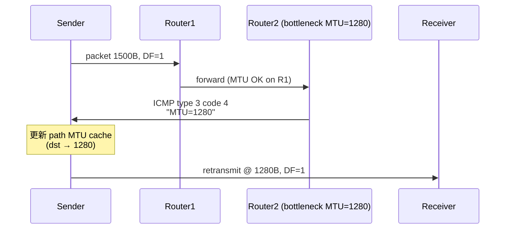

# 課堂 1.6 — ICMP 深度：不只是 ping

## 學前知道

- **前置課**：[1.4 IP 路由](./1.4-ip-routing-graph.md)、[1.5 ARP/NDP/DHCP](./1.5-arp-ndp-dhcp.md)（NDP 本身就是 ICMPv6 子集）
- **預計閱讀時間**：40~50 分鐘
- **必讀規格 / 論文**：
  - **RFC 792 — Internet Control Message Protocol** (Postel, 1981) — ICMPv4 原文，僅 21 頁，半小時讀完
  - **RFC 4443 — ICMPv6 for the Internet Protocol Version 6** (Conta, Deering, Gupta, 2006) — ICMPv6 standards-track
  - **RFC 1191 — Path MTU Discovery** (Mogul & Deering, 1990) — Classical PMTUD
  - **RFC 4821 — Packetization Layer Path MTU Discovery** (Mathis & Heffner, 2007) — PLPMTUD for TCP
  - **RFC 8899 — Packetization Layer Path MTU Discovery for Datagram Transports (DPLPMTUD)** (Fairhurst, Jones, Tüxen, Rüngeler, Völker, 2020) ⭐ — QUIC 與所有 datagram protocol 的現代標準
  - **RFC 4884 — Extended ICMP to Support Multi-Part Messages** (Bonica et al., 2007)
  - **RFC 5927 — ICMP Attacks against TCP** (Gont, 2010)
  - **RFC 6864 — Updated Specification of the IPv4 ID Field** (Touch, 2013) — fragmentation reasoning
  - **Ensafi, Fifield, Winter, Feamster, Weaver, Paxson — Examining How the Great Firewall Discovers Hidden Circumvention Servers** (IMC 2015) ⭐ — GFW active probing 體系研究
  - **Ensafi, Winter, Mueen, Crandall — Analyzing the Great Firewall of China Over Space and Time** (PoPETs 2015) — 用 ICMP / IPID side channel 量測 GFW
  - **Houmansadr, Brubaker, Shmatikov — The Parrot is Dead** (IEEE S&P 2013)（in [precis](../../notes/papers/houmansadr-parrot-is-dead.md)） — 偽裝必須完整對抗 active probing 否則無用
  - **Wu et al. — Towards Effective Detection of Recent DNS-over-HTTPS Adoptions** & **GFW FEP detection** (USENIX Security 2023)（in [precis](../../notes/papers/wu-fep-detection.md)） — 主動探測延伸
  - **Smurf Amplifier Registry**（歷史記錄）— smurf attack 仍是 SoK 起點
- **必讀原始碼**：Linux `net/ipv4/icmp.c`、`net/ipv6/icmp.c`、`net/ipv4/icmp_socket.c`、`net/ipv4/icmp_input` 與 `net/ipv4/route.c` 內 PMTU 處理（`update_pmtu` family）

---

## 動機

ICMP 在大多數人腦中等於 `ping`。但對 G6 設計，ICMP 是**至少 5 件大事**的交集：

1. **PMTUD blackhole 是真實災難**：絕大多數 internet path 上 ICMP type 3 code 4 (Fragmentation Needed) 被防火牆 drop，**classical PMTUD (RFC 1191) 直接失效**——導致大 packet 被 silently 丟、連線卡在 handshake 之後第一個大 message。**QUIC 0-RTT 失敗常見根因**
2. **ICMP 是 GFW 的工具**：Ensafi et al. 2015 證實 GFW 不只 passive DPI——還用 **active probing**（含 ICMP / TCP SYN / TLS ClientHello replay）主動連接可疑 server 判斷是否 circumvention service。**G6 server 必須能識別並抵抗這類 probe**
3. **ICMP error 訊息含原始 packet 28 byte**：對 QUIC connection migration、TCP RST injection 偵測都極關鍵；但**也是 side channel**——洩漏內部 socket state
4. **ICMP redirect / smurf / quench 的歷史包袱**：ICMP redirect (type 5) 是另一個 LAN-level MITM 工具；smurf attack (1990s) 用 ICMP 放大反射雖已死但思想活在 NTP / DNS reflection attack。**理解這部分 = 理解「無認證控制協議」的反覆失敗模式**
5. **QUIC RFC 9000 與 ICMP 的微妙互動**：QUIC 設計上 **DPLPMTUD-first、ICMP-optional**——但仍**接受並利用** ICMP PTB（packet too big）作 fast hint。**G6 QUIC fork 設計必須明確此處取捨**

教科書講 ICMP 的問題：把它當「control message 雜物箱」介紹，未說清「**為什麼這個雜物箱的設計缺陷推動了過去 30 年 transport 演化的一半**」。本堂從 PMTUD blackhole + GFW active probing 兩個主軸切入，反向理解 ICMP 的角色。

---

## 核心概念

### 1. ICMP 是什麼層的協議？

形式上 ICMP 是 **L3 control plane**——跑在 IP 上（protocol number 1 for ICMPv4、58 for ICMPv6）但不傳 user data。功能：
- 報錯（不可達、TTL 到期、fragment 需求）
- 診斷（echo、timestamp）
- 路由 hint（redirect）
- IPv6 內：取代 ARP（NDP, type 133-137）+ 取代 IGMP（MLD, type 130-132）

**設計哲學矛盾**：ICMP 是 **IP 自己的 control protocol**，但 IP 是 connectionless、unauthenticated——所以 ICMP 也 inherit 這些缺陷。任何「**控制平面**」應該有的安全性質（authenticated、confidential、replay-resistant）ICMP 都沒有。

### 2. ICMP type / code 全表（你必須能背的部分）

#### 2.1 ICMPv4（RFC 792 起 + 後續擴增）

| Type | Code | Name | 是否 active |
|---|---|---|---|
| **0** | 0 | Echo Reply | ✅ ping 回 |
| **3** | 0 | Net Unreachable | ✅ |
| **3** | 1 | Host Unreachable | ✅ |
| **3** | 2 | Protocol Unreachable | ✅ 罕用 |
| **3** | 3 | Port Unreachable | ✅ **traceroute UDP 模式靠此** |
| **3** | 4 | **Fragmentation Needed and DF set** | ✅ ⭐ **PMTUD 命脈** |
| **3** | 5 | Source Route Failed | ⚠️ 多半 drop |
| **3** | 6-15 | Various (Admin Filtered 等) | ✅ |
| **4** | 0 | **Source Quench** | ❌ **RFC 6633 deprecated** (2012) |
| **5** | 0-3 | Redirect (Net/Host/TOS Net/TOS Host) | ⚠️ host 多半忽略 |
| **8** | 0 | Echo Request | ✅ ping 來 |
| **9-10** | - | Router Adv/Solicitation (IPv4) | ⚠️ 罕用，RFC 1256 |
| **11** | 0 | **Time Exceeded in Transit (TTL=0)** | ✅ ⭐ **traceroute 命脈** |
| **11** | 1 | Fragment Reassembly Time Exceeded | ✅ |
| **12** | 0 | Parameter Problem | ✅ |
| **13/14** | - | Timestamp Request/Reply | ⚠️ 多半 disabled |
| **15/16** | - | Information Request/Reply | ❌ obsolete |
| **17/18** | - | Address Mask Request/Reply | ❌ deprecated, RFC 6918 |
| **30** | - | Traceroute (RFC 1393) | ❌ never widely deployed |
| **40** | - | Photuris (RFC 2521) | ❌ obsolete |

#### 2.2 ICMPv6（RFC 4443 + RFC 4861 NDP + RFC 3810 MLD）

| Type | Name | 對應 ICMPv4 |
|---|---|---|
| **1** | Destination Unreachable | 3 |
| **2** | **Packet Too Big** | 3/4 |
| **3** | Time Exceeded | 11 |
| **4** | Parameter Problem | 12 |
| **128** | Echo Request | 8 |
| **129** | Echo Reply | 0 |
| **130** | MLD Listener Query | (IGMP) |
| **131** | MLD Listener Report | (IGMP) |
| **132** | MLD Listener Done | (IGMP) |
| **133** | Router Solicitation (RS) | (ARP 部分) |
| **134** | Router Advertisement (RA) | 9/10 (擴展) |
| **135** | Neighbor Solicitation (NS) | ARP request |
| **136** | Neighbor Advertisement (NA) | ARP reply |
| **137** | Redirect | 5 |
| **143** | MLDv2 Listener Report | (IGMPv3) |

**注意 IPv6 改名**：「Fragmentation Needed」變「**Packet Too Big**」（type 2），且**只有 source 能 fragment**——IPv6 router 從不 fragment。

#### 2.3 ICMP error message payload 結構

```
+-----------+-----------+-----------+----+----+
|   Type    |   Code    |  Checksum (2B)  |
+-----------+-----------+-----------------+
|        Type-specific fields (4B)        |
+-----------------------------------------+
|  Original IP header + first 8 bytes of  |
|  original IP payload (= 28 byte typical)|
|  RFC 1812 建議擴展到 full packet         |
+-----------------------------------------+
```

**「原始 packet 的 IP header + 8 byte」這 28 byte** 讓 sender 知道「**哪個 packet 出問題**」。對 TCP 來說 8 byte 含 src/dst port + seq num——足以定位 socket。**這 28 byte 是 ICMP 唯一「back-link」機制**，也是後續所有 ICMP-based attack 的 leverage 點。

RFC 4884 之後可擴展到更大（multi-part ICMP，含 MPLS label stack 等 metadata）但**多數 internet 仍只回 28 byte**。

### 3. Path MTU Discovery（PMTUD）：三代演化

#### 3.1 為什麼需要 PMTUD

路徑上某 hop MTU = 1280（如 IPv6 tunnel over IPv4 with 額外 encap）但 sender 用 1500 byte packet 送 → router 必須 fragment 或回 ICMP。

兩個選擇：
1. **IPv4 default**：router fragment（DF=0）→ overhead、亂序、ID wraparound 等問題（RFC 6864 詳述為何 IPv4 ID 不該被信任）
2. **設 DF=1**（Don't Fragment）：router 不 fragment，**回 ICMP type 3 code 4** 帶建議 MTU → sender 縮小 packet 重送

PMTUD（RFC 1191）= 策略 2。**讓 sender 主動探出 path MTU、不依賴 router fragment**。

#### 3.2 Classical PMTUD（RFC 1191, 1990）



**問題**：依賴 ICMP type 3 code 4 能順利到達 sender。**現實**：絕大多數 internet：
- 中間 firewall drop 所有 ICMP（簡單粗暴 policy）
- NAT 不 forward ICMP（很多 home router）
- DDoS 防禦規則 drop high-rate ICMP
- ⇒ **classical PMTUD 在公網 ~30-50% 場景失敗**

⇒ **PMTUD blackhole**：sender 送 1500B 後 silently 被丟，等不到 ICMP，等不到 ACK，retry 仍 1500B → 永遠卡。**TCP 連線常見「handshake OK，第一個 large message 後 stall」根因**。

#### 3.3 PLPMTUD（RFC 4821, 2007）— TCP 自救

Mathis & Heffner 提出：**不依賴 ICMP**，在 TCP 自己的 ACK 機制上探測 MTU：

1. 從 BASE_PLPMTU（如 1024）開始
2. 試 PROBED_SIZE > current，送一個探測 packet
3. 若 ACK 收到 → MTU 上限 ≥ PROBED_SIZE，提升 current
4. 若超時未 ACK → drop PROBED_SIZE，回到較小值
5. binary search / exponential probing 到上界

**好處**：完全在 transport layer，不依賴 ICMP。
**壞處**：要花幾個 RTT 才收斂；探測 packet 失敗時付出 retx cost。

#### 3.4 DPLPMTUD（RFC 8899, 2020）⭐ — QUIC 與所有 datagram protocol 的標準

Fairhurst 等延伸 PLPMTUD 到 datagram（SCTP、QUIC、DCCP）：

**QUIC RFC 9000 §14 直接 reference DPLPMTUD**。QUIC 用 PADDING frame 把 probe packet 塞到目標 size，回 ACK 則表示 MTU OK。

**關鍵設計**：
- **base = 1200 byte**（QUIC initial packet 最小 size，幾乎所有 path 通）
- **max = 配置上限**（通常 1452 或 1500）
- **probe 失敗不會破壞連線**——只是 PROBED_SIZE 不被採用
- **支援 ICMP PTB 作為 hint 但不必須**——若收到 PTB 可加速搜尋
- **black hole detection**：若送 N 個當前 MTU 的 packet 都未 ACK → 推測 black hole 發生 → 縮回 base

#### 3.5 對 G6 的影響

G6 baseline 走 QUIC → 必須實作 DPLPMTUD。具體：
- **連線初期用 1200 byte**——保證能通
- **連線穩定後嘗試 probe 到 1452**（IPv4，扣除 outer Ethernet 14 + IP 20 + UDP 8 + QUIC overhead ~6）
- **DC overlay 環境**（[1.3 lesson](./1.3-ethernet-l2.md)）需扣 VXLAN 50B → MTU 預算 1402 或更低
- **probe 失敗不重試太頻繁**——這在 GFW 場景容易被識別成 PMTUD probe pattern

### 4. PMTUD blackhole 的真實規模

**Custura, Fairhurst, McQuistin 2018** 用 RIPE Atlas 量測：
- IPv4 PMTUD blackhole 率 **~28%** end-to-end
- IPv6 PMTUD blackhole 率 **~18%**
- ICMPv6 type 2 (Packet Too Big) 比 ICMPv4 type 3/4 略不易被 drop（IPv6 太依賴 ICMP，admin 較不敢全 drop）

**根因**：
1. 大量 enterprise / ISP firewall 預設 drop ICMP
2. NAT box（特別是 CGNAT）對 ICMP error 的 stateful tracking 困難
3. DDoS 防禦過度 drop
4. Anycast 場景 ICMP 回到錯的 anycast instance（return path asymmetry）
5. Stateless cloud LB 看 ICMP 不知該回給哪 backend

⇒ **PMTUD「成功」是例外，blackhole 才是常態**。**G6 設計必須假設 blackhole**——DPLPMTUD 是 mandatory，不是 nice-to-have。

### 5. ICMP 在 GFW 中的角色（Ensafi et al. 2015）⭐

#### 5.1 Active probing 是什麼

GFW 不只 passive 看流量——它**主動連接你的 server 做 protocol fingerprinting**。

**Ensafi 2015 IMC paper** 系統研究：
- 用戶在中國連可疑 server（如 Tor bridge、VPN endpoint、Shadowsocks server）
- 流量觸發 GFW 的「**這個 server 可能是 circumvention service**」 heuristic
- GFW backend 啟動「probe queue」，數秒到數天內**從中國境內 IP** 主動連那個 server
- 用多種 protocol replay（Tor handshake、Shadowsocks 加密 challenge、TLS ClientHello variations）
- 若 server 回應「**像** circumvention service 的樣子」→ 加 blacklist 永久封 IP+port

#### 5.2 ICMP 在 probe 中的角色

雖然主要 probe 是 TCP/UDP-based，**ICMP 用於**：
- **預掃描 reachability**：先 ping 確認 host alive 才送 expensive probe
- **PMTUD-as-side-channel**：故意送大 packet，看 server 是否回 ICMP PTB → 推測 OS 與 firewall 配置
- **timing fingerprint**：ICMP echo timing 可指紋 OS（Linux/Windows/BSD 各有不同 ping reply 模式）

#### 5.3 對 G6 server 的影響

**G6 server 必須處理 active probing**：

| Strategy | Trade-off |
|---|---|
| **回 ICMP echo (`/proc/sys/net/ipv4/icmp_echo_ignore_all=0`)** | 正常 user 友善（mtr/ping debug 可用）+ 暴露 host alive |
| **不回 echo** | 隱蔽 + debug 困難 + 部分 monitor 失敗 |
| **rate-limit echo（如 `1/s`）** | 折衷 |
| **selectively 回**（如僅對特定 ASN 回） | 更精細 |

**G6 baseline 建議**：rate-limit ICMP echo（防 ping flood、避免成為 amplification）+ 不主動回 ICMP error（**就算 packet 真的 too big，也不回 PTB——讓 client DPLPMTUD 自己探**）。代價：debug 困難——必須有 out-of-band debug channel。

### 6. ICMP 攻擊面總覽

#### 6.1 Smurf attack（1996, 史前史）

```
attacker → ICMP echo request to broadcast address 192.0.2.255
          src spoofed to victim
all hosts on 192.0.2.0/24 → ICMP echo reply to victim
                            (放大 N 倍, N = 該 subnet host 數)
```

**現代狀態**：所有 modern OS 預設不回 broadcast echo（`net.ipv4.icmp_echo_ignore_broadcasts=1`）+ ISP 過濾 directed broadcast。Smurf 死了。**但 amplification attack 思想活在 DNS/NTP/Memcached reflection**——這條歷史線值得追。

#### 6.2 ICMP Source Quench（RFC 6633 deprecated）

1980s 想法：router 發 quench 給 sender 「**慢下來**」做 congestion control。**死因**：
- 無認證 → 任何人可送 quench 強迫 victim 慢
- TCP 自己的 congestion control 更好（不依賴 router cooperation）
- Router 也懶得算「該 quench 誰」

2012 正式 deprecate。Linux/BSD/Windows 都不再處理。

#### 6.3 ICMP Redirect（type 5）

「**你下次走 X 比較快**」——router 提示 host 換 next-hop。攻擊版：**LAN 內 attacker 偽造 redirect 給 victim**，把 victim 的 default route 改向 attacker。

**Mitigation**：
- Linux：`net.ipv4.conf.all.accept_redirects=0`（**安全建議值**）
- macOS/Windows：類似可關
- Cisco：access port 預設不發 redirect

**現實**：許多家用 OS 預設 `accept_redirects=1`——攻擊面仍存在。

#### 6.4 ICMP RST injection / off-path attack（Gont, RFC 5927）

複雜的 attack：透過注入 ICMP type 3 code 4 強迫 victim 重設 path MTU，**間接觸發 TCP 重傳模式**——可結合 timing 做盲打。Linux 已加 mitigation（rate-limit + connection state check）但**老 OS / embedded device 仍漏**。

#### 6.5 ICMP tunneling（covert channel）

把 data 塞進 ICMP echo request/reply 的 payload（64 byte default 但可達 ~1500）→ **covert channel 跨防火牆**。
- 工具：`ptunnel`、`icmptx`、Metasploit 的 ICMP channel
- 對 G6 **不適合用作 baseline**：ICMP throughput 極低（10-100 KB/s）、被 IDS 識別容易
- 但作為**逃生 fallback channel** 設計上值得思考——當所有其他 transport 都被封，ICMP 可能仍通

### 7. ICMP 在 QUIC RFC 9000 內的角色

#### 7.1 ICMP 對 QUIC connection 的兩個用途

1. **Path MTU hint**：收到 ICMPv4 type 3 code 4 或 ICMPv6 type 2 → 通知 DPLPMTUD 加速搜尋
2. **Stateless reset 替代品**：QUIC 自己有 Stateless Reset packet，但 ICMP unreachable 在某些場景也可作 hint

#### 7.2 QUIC 對 ICMP 的不信任設計

RFC 9000 §10.2.4 明文要求：
- ICMP message 只可作 **hint**，不可作為 **authoritative** signal
- Sender 必須驗證 ICMP error message 內含的 28-byte echo 確實對應 self 之前送過的 packet
- 即便 ICMP 看起來合法，**只用來 trigger 探測**，不用來直接斷連線

**為什麼**：對抗 off-path attacker 偽造 ICMP——若 QUIC 信 ICMP 連線會死，attacker 一個 forged ICMP 就能 DoS 任意 QUIC 連線。

#### 7.3 對 G6 設計的啟示

**「ICMP 是 hint 不是 truth」**——這個原則對 G6 所有控制訊號設計都該適用：
- 不信任 ICMP 來判定「server 死了」（attacker 可偽造）
- 不信任 ICMP 來判定「path 不通」（drop 可能是 firewall policy 非真不通）
- 用 ICMP 當 **fast hint 加速 DPLPMTUD / failover 探測**，但**真正決策依然走 application-layer ACK 機制**

### 8. ICMP 在 traceroute 的精妙利用

#### 8.1 Three flavors

1. **ICMP traceroute（Windows tracert）**：送 ICMP echo with TTL=1,2,3,...；每跳 router 回 ICMP type 11 code 0
2. **UDP traceroute（traditional Unix traceroute）**：送 UDP 到 high port (33434+)；最後一跳回 ICMP type 3 code 3 (port unreachable)
3. **TCP traceroute（modern tcptraceroute / Paris-traceroute）**：送 TCP SYN to port 80/443 with TTL=1,2,3,...；中間 router 回 type 11，目標回 SYN-ACK

**為什麼有 3 種**：很多 firewall 對 ICMP echo / UDP 高端口都 drop——TCP 80/443 是「企業 friendly」最容易通的方法。

#### 8.2 Paris-traceroute（Augustin et al. 2006）

傳統 traceroute 對 ECMP path 不友善——不同 TTL 的 probe 可能走不同 path → 結果矛盾。**Paris-traceroute** fix：保持 5-tuple 內影響 ECMP hash 的部分（src/dst port、protocol）一致，**所有 probe 走同一 path**。

對 G6：**了解 traceroute 機制 = 了解網路 visibility 的邊界**。從外部 traceroute 你 server 能看到什麼？**到 server 前一跳通常就停**（很多 hyperscaler 把 final hop 設為 not reply ICMP）。**這對 G6 server 隱蔽性是好事**。

---

## 與我們協議設計的關聯

| 設計面 | ICMP 知識的影響 |
|---|---|
| **11.1 威脅模型** | active probing（GFW）必須列入；ICMP RST injection 必須考慮（雖然 G6 走 UDP 不直接受 RST，但類似 off-path 攻擊存在） |
| **11.5 packet format** | base packet size = 1200 byte（QUIC initial）；DPLPMTUD 探測上限可配置；ICMP PTB 處理規則明確 |
| **12.4 data path** | DPLPMTUD 必須實作；ICMP error 解析（驗證 echo back 那 28B 對應 self packet）必須嚴格 |
| **12.7 server** | 預設 rate-limit echo + 不主動回 ICMP error；提供 `--debug-icmp` flag 開放給授權測試 |
| **12.13 高丟包鏈路** | PMTUD blackhole 模擬必測；對抗 GFW probing 行為要驗證 server 在 probe 下不洩漏指紋 |
| **9.x GFW 對抗** | active probing identification 與 mitigation 是核心戰場 |

### G6 server 對 ICMP 的具體 policy 提案

```yaml
icmp_policy:
  echo_request:
    accept: rate_limited
    rate: 1/s
    burst: 5
    response_jitter_ms: [0, 50]  # 避免 timing fingerprint OS
  destination_unreachable:
    send: false                   # 不主動回——讓 client DPLPMTUD 自己探
    accept_as_hint: true          # 收到時用作 fast hint
    validate_echo_28b: strict     # 嚴格驗 28-byte echo
  time_exceeded:
    send_on_ttl_zero: false       # traceroute 看不到 G6 server
    accept_as_hint: true
  redirect:
    accept: never                 # 永遠不收 redirect
    send: never
```

---

## 動手（35 分鐘）

### 任務 1（5 min）：看自己 OS 的 ICMP 配置

```bash
# Linux（OrbStack VM）
orb -m debian
sysctl net.ipv4.icmp_echo_ignore_all
sysctl net.ipv4.icmp_echo_ignore_broadcasts
sysctl net.ipv4.icmp_ratelimit
sysctl net.ipv4.icmp_ratemask
sysctl net.ipv4.conf.all.accept_redirects
sysctl net.ipv4.conf.all.send_redirects

# macOS
sysctl net.inet.icmp.icmplim
sysctl net.inet.icmp.bmcastecho
```

**思考**：你的 host 預設是否 accept redirect？rate limit 是多少？對 G6 server 應該怎麼調？

### 任務 2（10 min）：實際觀察 PMTUD blackhole

```bash
# Mac 上設定 DF + 大 packet 去 ping
ping -D -s 1472 vps.example.com -c 3   # 1500 byte total
ping -D -s 1372 vps.example.com -c 3   # 1400 byte total
ping -D -s 1272 vps.example.com -c 3   # 1300 byte total

# 如果 1472 失敗、1372 成功——path MTU 在 1300-1400 之間
# 此時應該看到 ICMP "needs fragmentation" 回來
# 但很可能你**看不到**——blackhole 證據
```

### 任務 3（10 min）：用 tcpdump 看 ICMP error 結構

```bash
# 在 Linux VM 內
orb -m debian -- sudo tcpdump -i eth0 -nn -vv -X 'icmp[icmptype] == icmp-unreach' -c 5 &
ping -s 9000 -M do 8.8.8.8     # 故意送過大 packet 觸發 ICMP
```

**思考**：看 hex dump 出來的 ICMP payload——是否真的含 28 byte 原始 IP header + 8 byte？是否有 RFC 4884 multi-part 擴展？

### 任務 4（5 min）：用三種 traceroute 對比

```bash
# ICMP traceroute（Windows 風格）
sudo mtr --report --report-cycles 3 --icmp 8.8.8.8

# UDP traceroute（傳統 Unix）
sudo mtr --report --report-cycles 3 --udp 8.8.8.8

# TCP traceroute to 443
sudo mtr --report --report-cycles 3 --tcp --port 443 8.8.8.8
```

**思考**：三種看到的 path 是否一致？哪幾跳 router 不回？這代表什麼？

### 任務 5（10 min）：用 hping3 模擬 GFW-style probe

```bash
orb -m debian -- sudo apt install -y hping3

# ICMP echo
sudo hping3 -1 -c 5 vps.example.com

# TCP SYN to 443
sudo hping3 -S -p 443 -c 5 vps.example.com

# UDP probe
sudo hping3 -2 -p 8888 -c 5 vps.example.com

# 同時抓包看 server 怎麼回應
sudo tcpdump -i eth0 -nn 'host vps.example.com' &
```

**思考**：你的 VPS 怎麼回？對 ICMP 8 回 echo reply 嗎？對 closed port 回 ICMP type 3 code 3 嗎？這些 response pattern 是 server fingerprint，GFW probe 看的就是這些。

---

## 自我檢查

1. ICMP type 3 code 4 在 PMTUD 中的角色是什麼？為什麼 classical PMTUD (RFC 1191) 在公網 30%+ 場景失敗？
2. PLPMTUD vs Classical PMTUD vs DPLPMTUD 三代演化的關鍵突破各是什麼？為什麼 DPLPMTUD 成為 QUIC standard？
3. ICMP error message 為什麼必須含「原始 packet 的 IP header + 8 byte」？這 28 byte 對 sender 而言用途是什麼？對 attacker 而言是什麼 side channel？
4. RFC 6633 為何 deprecate ICMP Source Quench？這個 deprecation 對「協議內 congestion control vs router-driven congestion control」哲學差別揭示了什麼？
5. Ensafi et al. 2015 IMC 顯示 GFW active probing 的 trigger 機制是什麼？G6 server 應該怎麼配置 ICMP 來最小化指紋暴露但仍維持運維可調試性？
6. QUIC RFC 9000 §10.2.4 為何要求「ICMP 只能作 hint 不能作 authoritative signal」？這個原則對 G6 control plane 設計有什麼推廣價值？
7. Smurf attack 死了，但 amplification attack 思想活在哪些後續攻擊（DNS / NTP / Memcached）？這條 evolution 對「無認證控制協議的反覆失敗模式」說明了什麼？

---

## 延伸閱讀

- **Stevens — *TCP/IP Illustrated Volume 1*** ch.6-7 — ICMP 經典講解
- **Gont — *Security Assessment of IETF Specifications: ICMP*** (RFC 5927) — 必讀的 ICMP 攻擊全景 SoK
- **Custura, Fairhurst, McQuistin 2018 *Exploring USB connectivity using PMTU***（IFIP Networking） — PMTUD blackhole 量化
- **Augustin et al. 2006 Paris-Traceroute** (IMC) — ECMP-aware traceroute
- **Linux source `net/ipv4/icmp.c`** — production ICMP handler
- **NetSurg blog** <https://blog.litespeedtech.com/2020/10/19/improve-performance-with-dplpmtud/> — DPLPMTUD 工程文
- **Cloudflare blog** 多篇關於 ICMP、PMTUD、anycast 互動的文章

---

## 研究級補遺

### 1. 學界詞彙

- **PMTUD** classical (RFC 1191) / **PLPMTUD** (RFC 4821) / **DPLPMTUD** (RFC 8899)
- **PMTU blackhole**：ICMP 被 drop 導致 PMTUD 失敗的場景
- **PTB (Packet Too Big)**：ICMPv6 type 2，IPv6 對應 ICMPv4 type 3 code 4
- **PL (Packetization Layer)**：放 transport message 進 IP packet 的層
- **PLPMTU**：PL 探出的 MTU
- **EMTU_S / EMTU_R**：Effective MTU for Sending / Receiving (RFC 1122)
- **DF (Don't Fragment) bit**：IPv4 header flag
- **IPID**：IPv4 header 的 16-bit identifier，Ensafi 2015 利用作 side channel
- **Idle scan / Zombie scan**：用第三方 host 的 IPID 推斷 connectivity（Antirez 1998, RFC 5961 mitigation）
- **Active probing**（GFW context）：對端主動連被監視 server 做 protocol replay
- **Off-path attacker**：不在 packet 路徑上但能注入仿造 packet 的對手
- **Backscatter**：spoofed-src attack 引發的 ICMP/RST 反向流量，學界用於量測 DoS
- **ICMP suppression**：firewall drop ICMP 的 policy
- **Smurf / Fraggle**：1990s 反射放大攻擊（ICMP / UDP echo）
- **Path asymmetry**：forward path 與 return path 不同
- **Stateless reflection**：server 不維持狀態被用作 amplifier

### 2. 對手分類學

| 對手能力 | ICMP-related |
|---|---|
| **on-path passive** | 看所有 ICMP 流量；無法注入 |
| **on-path active** | 可注入 ICMP（如 RST injection、PMTUD blackhole 強迫） |
| **off-path blind injection** | 必須猜 IPID / source port / seq；ICMP error 內 28B 提供「驗證」線索（攻擊者必須 reproduce 該 28B）|
| **active probing**（GFW） | 主動連目標 server 觀察行為，不只看 ICMP；ICMP 用於 reachability 預掃 |
| **amplifier abuse** | 用 victim's IP 作 src spoofing，誘導 server 反射放大流量到 victim |
| **stateful flood** | ICMP flood 耗盡 firewall stateful table |

### 3. 形式化定義

#### 3.1 PMTUD 收斂條件

設 path P = (h_1, h_2, ..., h_n)，每跳 MTU 為 m_i。**真 path MTU = min{m_i}**。

PMTUD 探得的值 `pmtu_estimate` 滿足以下條件之一即收斂：
- `pmtu_estimate ≤ min{m_i}`（保守，永不 drop）—— acceptable
- `pmtu_estimate = min{m_i}`（最優）—— ideal
- `pmtu_estimate > min{m_i}` —— **blackhole**

**Classical PMTUD 收斂時間**：O(number of distinct PTB messages received)；每次 PTB 後嘗試的 size 嚴格遞減。
**DPLPMTUD 收斂時間**：O(log(max_mtu/min_mtu) × RTT)；binary search 探。

#### 3.2 GFW active probing 的形式化模型

設 `T` 為 trigger function：T(flow) ∈ {0, 1}（passive 觀察決定是否觸發 active probe）。
設 `P` 為 probe set：對該 server 發出的 probe sequence。
設 `D` 為 detector：D(server response to P) ∈ {circumvention, normal}。

**Server 對抗 strategy**：
- **Reduce trigger surface**：流量看起來像 normal HTTPS，使 T(flow) = 0
- **Indistinguishable response**：給定 D 可區分的 probe，response distribution 與 normal HTTPS server 無法區分
- **Trap & alarm**：偵測到 probe pattern 後改變策略（風險：被偵測到「我發現自己被偵測」）

**Houmansadr 2013 "Parrot is Dead" 的核心 message**：obfuscation protocols（如 SkypeMorph 模仿 Skype）對抗 active probing **全部失敗**——任何 imperfection 都會被 D 抓到。**G6 設計必須假設「完全模仿不可能」，走另一條路：cryptographic indistinguishability 而非 protocol mimicry**。

### 4. 必追論文 / 規格

- ✅ **RFC 792 ICMPv4** + **RFC 4443 ICMPv6** — 21 + 23 頁，必通讀
- ✅ **RFC 1191 / 4821 / 8899 三代 PMTUD** — DPLPMTUD 必精讀，QUIC 直接依賴
- ✅ **RFC 5927 ICMP attacks against TCP** — Gont 系統 SoK
- ✅ **Ensafi 2015 IMC active probing** ⭐ — Part 9 GFW 研究必讀
- ✅ **Ensafi 2015 PETS idle scan** — 量測技術經典
- ✅ **Houmansadr 2013 "Parrot is Dead"** — obfuscation vs active probing
- ✅ **Wu 2023 USENIX FEP detection** — 主動探測延伸
- **Antirez 1998 "Idle Scan via TCP SYN packets"** — IPID side channel 起源
- **Marczak et al. 2015 "China's Great Cannon"** (FOCI) — 主動 packet injection 範例
- **Custura et al. 2018 PMTUD measurement** — blackhole 量化
- **Augustin et al. 2006 Paris-Traceroute** (IMC) — ECMP-aware traceroute
- **Beverly 2010 "Measuring Packet Reordering"** (IMC)
- **Padhye, Firoiu, Towsley, Kurose 1998 "Modeling TCP throughput"** — TCP throughput 公式（為何 PMTU 影響大）

### 5. 我們協議的座標

| 設計面 | ICMP 影響 |
|---|---|
| **packet 大小規劃** | base 1200B；DPLPMTUD probe 到 1452B（去 outer 48B），DC overlay 內降至 1402 |
| **server ICMP policy** | rate-limit echo / 不主動回 PTB / 嚴格驗 28B / 避免 timing-fingerprint OS |
| **client error handling** | ICMP error 視為 hint，不作 authoritative；用 application-layer ACK 為 truth |
| **active probing 對抗** | server 偵測 probe pattern + 不留下 protocol-distinguishing response；遵守 Parrot is Dead 教訓——不走 mimicry |
| **fallback transport（極端場景）** | ICMP tunneling 作為 last-resort fallback channel（極低 throughput 但可能仍通）；不應作為 baseline |

### 6. 必追資源

- **RIPE Atlas** <https://atlas.ripe.net/> — 全球 PMTUD / latency / blackhole 量測探針
- **CAIDA** <https://www.caida.org/> — 網路量測學界
- **Censored Planet** <https://censoredplanet.org/> — Roya Ensafi 之 lab，GFW / Iran / Russia censorship 持續量測
- **OONI (Open Observatory of Network Interference)** <https://ooni.org/> — Tor Project 的 censorship 量測
- **NetAlytics / Internet Health Report** — 網路健康度量
- **IETF MAPRG (Measurement and Analysis for Protocols)** — IETF 量測社群
- **Mathy Vanhoef / Fernando Gont / Roya Ensafi / Vern Paxson / Nick Feamster** 個人 page

### 7. 開放問題

- **end-to-end PMTUD blackhole 全球率正在變動**：2018 ~28%，2023 部分量測顯示降到 ~20%（IPv6 推動 + cloud 改善），但無持續監測 framework
- **DPLPMTUD probe pattern 是否成為 fingerprint**：DPLPMTUD 的 padding probe 在 wire 上有特定 size sequence，**GFW 是否將其 weaponize 識別 QUIC-VPN**？open
- **ICMP-based covert channel 在 2026 的可行性**：GFW 對 ICMP throughput 似乎已限速 + 部分 drop；**穩定 covert channel 能 sustain 多少 bps**？無 recent 系統量測
- **GFW active probing 進化**：Ensafi 2015 後 10 年，**probing strategy 是否升級到 ML-based behavioral probing**？最近 Wu 2023 FEP 顯示 entropy-based passive detection 已可達極高準確率，**active probing 變得 less necessary**——但這意味著 server side defense 必須 shift focus
- **後量子 ICMP authentication**：SEND-style 簽 ICMP 從未部署成功；**有 PQ-friendly minimal-cost ICMP auth 嗎**？開放
- **形式化驗證 PMTUD state machine**：DPLPMTUD state 有 ~7 個 state、多個 transitions、與 ICMP/timeout/ACK 互動——適合 TLA+ / Coq 化但**完整 mechanized proof 尚未存在**
- **跨 anycast site 的 ICMP coherence**：anycast prefix 上不同 site 對同一 client 回 ICMP 可能 inconsistent（return path differs）——對 PMTUD 有未量化影響

---

下一堂：**1.7 NAT 完整分類學**——Full Cone / Restricted / Symmetric / CGNAT 與 hole-punching、STUN/TURN/ICE；對應 G6 P2P 假設與 CGNAT 環境下的部署現實。
