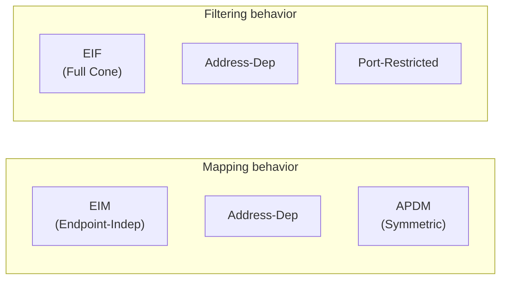
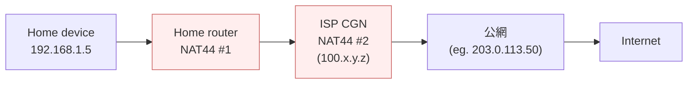
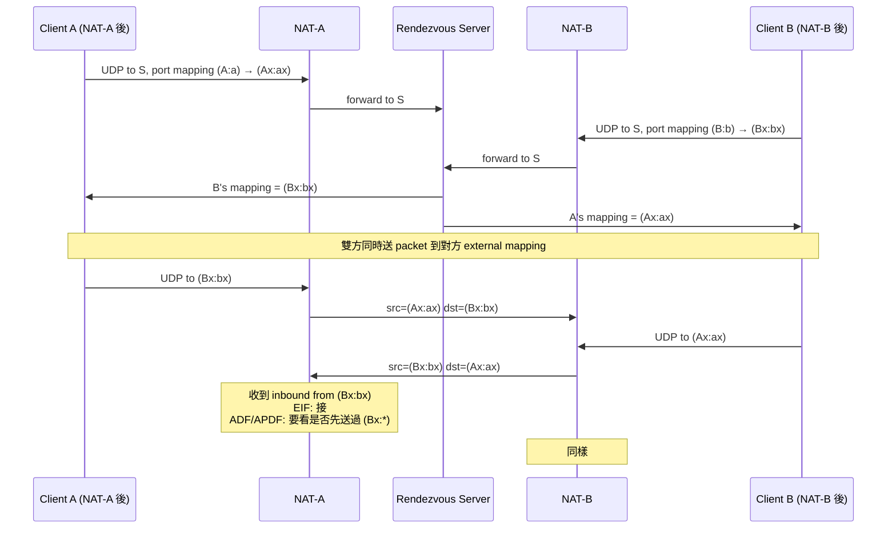

# 課堂 1.7 — NAT 完整分類學

## 學前知道

- **前置課**：[1.4 IP 路由](./1.4-ip-routing-graph.md)、[1.5 ARP/NDP/DHCP](./1.5-arp-ndp-dhcp.md)、[1.6 ICMP](./1.6-icmp-deep.md)
- **預計閱讀時間**：40~50 分鐘
- **必讀規格 / 論文**：
  - **RFC 3022 — Traditional IP Network Address Translator (Traditional NAT)** (Srisuresh, Egevang, 2001) — NAT 工程化奠基
  - **RFC 3489 — STUN (Simple Traversal of UDP Through NATs)** (Rosenberg et al., 2003) ⚠️ **已過時但 4-class「Cone」術語仍流通**
  - **RFC 4787 — NAT Behavioral Requirements for Unicast UDP** (Audet & Jennings, 2007, BCP 127) ⭐ — 取代 3489，2D 分類
  - **RFC 5382 — NAT Behavioral Requirements for TCP** (Guha et al., 2008, BCP 142)
  - **RFC 5128 — State of Peer-to-Peer (P2P) Communication across NATs** (Srisuresh, Ford, Kegel, 2008)
  - **RFC 6888 — Common Requirements for CGN (Carrier-Grade NAT)** (Perreault et al., 2013, BCP 152)
  - **RFC 6146 — Stateful NAT64** (Bagnulo, Matthews, van Beijnum, 2011)
  - **RFC 7050 — Discovery of the IPv6 Prefix Used for IPv6 NAT64** (Savolainen, Korhonen, Wing, 2013)
  - **RFC 8445 — Interactive Connectivity Establishment (ICE)** (Keränen, Holmberg, Rosenberg, 2018)
  - **RFC 8489 — Session Traversal Utilities for NAT (STUN)** (Petit-Huguenin et al., 2020)
  - **RFC 8656 — Traversal Using Relays around NAT (TURN)** (Reddy.K et al., 2020)
  - **Ford, Srisuresh, Kegel — Peer-to-Peer Communication Across Network Address Translators** (USENIX ATC 2005) ⭐ — hole punching 學術奠基
  - **Mao, Zhang, Wang 2014 *NATSeeing: Measuring NAT Topologies in the Wild*** (PoPETs)
- **必讀原始碼**：Linux `net/netfilter/nf_nat_*.c`（特別是 `nf_nat_core.c`、`nf_nat_proto_*.c`）；libnice (ICE 實作)、coturn (TURN server)；QUIC quiche/quinn 的 path migration handling

---

## 動機

NAT 看似「**IPv4 不夠用的補丁**」，實際上**它定義了現代網路最關鍵的 4 個工程現實**：

1. **沒有純粹的端到端可達性**：100% 的 home / mobile client、99% 的 enterprise client 都在 NAT 後面。**「server 必須有公網 IP」** 不是設計選擇而是物理必然
2. **NAT 是 stateful middlebox**——是 e2e 原則 (1.1 lesson) 的最大破口；任何「end-to-end 加密就足夠」的設計都得**搭配 NAT 行為理解**才實際可用
3. **CGNAT 把單純 NAT 升級到 N 層級**：你不只在自家 router 後，而是在 ISP CGN + 你自家 router 雙層。對 G6 部署：**很多 user 看到的 client public IP 是 100M+ 個 user 共用一個 /32**——任何「IP 黑名單」防禦對 GFW 級對手都失效（封一個 IP = 封 100M user）
4. **P2P / hole punching 從 STUN/TURN/ICE 到 WebRTC** 30 年的累積工程經驗，對 G6 「可選 P2P 模式」設計有直接 reference
5. **QUIC connection migration**（QUIC RFC 9000 §9）內建處理 NAT rebinding——這是 QUIC 比 TCP 在 mobile 場景優越的關鍵之一，G6 baseline 繼承

教科書講 NAT 的問題：
- 用過時的 RFC 3489 「Full Cone / Restricted / Port-Restricted / Symmetric」四分類
- 不講 RFC 4787 把這個簡化術語拆成「mapping × filtering」**二維**正確分類
- 不講 CGNAT 是當代主流（特別 mobile network）
- 不講 QUIC 怎麼活下 NAT rebinding

本堂直接走 RFC 4787 二維分類 + CGNAT 現實 + hole punching 完整 stack + QUIC migration 互動。

---

## 核心概念

### 1. NAT 的工程實作（每個 NAT 表都長這樣）

NAT 維護一張表：

```
(internal_IP, internal_port, dst_IP, dst_port, protocol)
  → (external_IP, external_port, expire_time)
```

當內部 packet 出去：
1. 查表是否已有對應 mapping
2. 若無 → 分配新 (external_IP, external_port)，建 entry
3. 改寫 packet：src 從 (internal_IP, internal_port) → (external_IP, external_port)
4. 送出

當外部 packet 進來：
1. 查表反查 (external_IP, external_port) → 內部
2. 若無對應 entry → drop（或回 ICMP unreachable）
3. 改寫 packet：dst → (internal_IP, internal_port)
4. 送進去

**關鍵問題**：當「**已有 mapping 但外部 packet 來源不同**」時，**接受還是 drop**？這個決策定義了 NAT 「**filtering behavior**」。

**另一個關鍵問題**：當「**同一 (internal_IP, internal_port) 連不同外部目標**」時，**外部 port 用同一個還是換新的**？這定義了 NAT 「**mapping behavior**」。

⇒ RFC 4787 把 NAT 行為**正確地**拆成這兩個獨立維度。

### 2. RFC 4787 二維分類（**忘記 RFC 3489 那 4 class，用這個**）⭐

#### 2.1 Mapping behavior（NAT 對 internal→external 的 port 分配）

設內部 host `X:x` 連外部 `Y1:y1` 拿到 mapping `X1':x1'`，再連 `Y2:y2` 拿到 `X2':x2'`。三種 mapping behavior：

| Mapping | 條件 | 結果 |
|---|---|---|
| **Endpoint-Independent Mapping (EIM)** | 對任意 Y2:y2 | X1':x1' = X2':x2' （**用同一 external 端口**） |
| **Address-Dependent Mapping** | Y2 = Y1 但 y2 ≠ y1 | 同 → 同；不同 IP → 不同 |
| **Address-and-Port-Dependent Mapping (APDM)** | Y2:y2 = Y1:y1 | 完全相同才同；任何不同 → 不同 (= 經典「Symmetric」) |

**RFC 4787 REQ-1**：NAT **MUST** 用 EIM。⇒ 後續所有 STUN/ICE 的可行性都依賴此 REQ-1。
**現實**：很多企業 firewall、CGNAT、老式 router 仍是 APDM（不符 RFC）——這就是「**Symmetric NAT**」常被罵的原因。

#### 2.2 Filtering behavior（NAT 對外部→internal 的 packet 過濾）

設內部 `X:x` 之前送 packet 給外部 `Y:y` 後產生 mapping，現在外部 `Z:z` 想送回 `X:x` 的 mapping。三種 filter：

| Filtering | 接受 packet 條件 |
|---|---|
| **Endpoint-Independent Filtering (EIF)** | 任何 Z:z 都接受（**最開放**）— 「Cone」 |
| **Address-Dependent Filtering** | Z = Y 才接 |
| **Address-and-Port-Dependent Filtering** | Z:z = Y:y 才接（**最嚴**）|

**RFC 4787 REQ-8**：若 application transparency 重要，**SHOULD 用 EIF**。但很多企業 security policy 不接受 EIF。

#### 2.3 Mapping × Filtering = 9 combinations，但只有 4 在實務常見



對應到 RFC 3489 過時術語：

| RFC 4787 二維 | RFC 3489 (過時) |
|---|---|
| EIM + EIF | **Full Cone** |
| EIM + Address-Dependent Filtering | **Address-Restricted Cone** |
| EIM + APDF | **Port-Restricted Cone** |
| APDM + (任何 filter) | **Symmetric NAT** |

⇒ 「Symmetric」 = APDM；其他三個是 EIM 配不同 filter。

#### 2.4 為什麼 Symmetric 對 P2P 致命

P2P hole punching 仰賴「**先送 packet 開洞，對方就能回來**」。**這只在 EIM 下成立**：你連 server `S` 拿 mapping `(X', x')`，告訴 peer `P` 「我 external port 是 x'」，P 送過來 packet → NAT 看 src 是 P（不是 S）→ Address-Dependent 或 APDF 下會被 drop（因 X:x 沒先送過 P）。

但若 NAT 是 EIM + EIF（Full Cone），任何外部都可送進來——直接通。
EIM + Address-Dependent：你必須先送 packet 到 P 開洞——hole punching 仍可行。

**APDM 的災難**：你連 `S` 拿 `(X', x'1)`、連 `P` 拿 `(X', x'2)`——**兩個 mapping 是不同 external port**。Peer 跟 server 拿到的「我的 port」**根本不一樣**。傳統 STUN 完全失效。**唯一解：用 TURN relay 全程中繼**。

### 3. Hairpinning（REQ-9）

設 NAT 後有 client A 和 server B，A 想連 B 的 **external IP (= NAT 公網 IP) + external port**。**NAT 該怎麼處理**？

- **不支援 hairpin**：drop（很多 SOHO router）
- **支援 hairpin**：把 packet「掉頭」送回 LAN 內 B（**正確行為**）

RFC 4787 REQ-9 強制要求支援 hairpinning，且 hairpinned packet **MUST** 用外部 source IP（不是 internal）——所以 B 看起來 client 是公網 IP 連過來（不會混淆內外）。

**對 G6**：若 G6 server 部署在客戶家內網（self-hosted）、client 走客戶 hotspot 上線——很可能觸發 hairpin。**家用 router 不支援 hairpin 是真實常見問題**——G6 client 偵測到 hairpin 失敗時應 fallback 到 LAN-local discovery（mDNS、ZeroTier-style relay）。

### 4. CGNAT (Carrier-Grade NAT, RFC 6888)

#### 4.1 為什麼存在

IPv4 用完了。Mobile carrier、ISP 大規模分配 `100.64.0.0/10`（CGN private space, RFC 6598）給用戶，**用戶看到的「公網 IP」其實是 CGN 私網 IP**。對外通訊全部過 CGN 公網 IP 池做 PAT (Port Address Translation)。

#### 4.2 雙層 NAT 拓樸



**兩層 NAT** 都做 source IP/port 改寫。
**Mapping & Filtering behaviors 在兩層上各自有定義**——effective behavior 是兩層 stacking 後的結果（通常表現最嚴的一層）。

#### 4.3 CGNAT 的 G6 影響

1. **Public IP 被 ~100~1000 戶共用**：一個 GFW IP 封禁 → 一片人受傷；但反過來，你 G6 client 從 CGNAT 出來看起來跟其他 normal user 一樣——**這是天然的 anonymity set**
2. **Port 數有限**：CGN 公網 IP 上每個 outbound flow 佔一個 port，**65535 port × IP 數 / user 數 = 每 user ~100-1000 port**。重連線多次可能 port 耗盡 → 連不上
3. **Connection limit**：許多 mobile CGN 對 long-lived connection 設定 timeout 短（30~60 秒 UDP, 5~30 分 TCP）——QUIC connection migration 必須處理 NAT rebinding
4. **P2P 完全不可行**：CGNAT 加家用 NAT 雙層 + 多戶共享 + 通常 APDM → **hole punching 失敗率極高**。**P2P G6 在 CGNAT 用戶上必須走 TURN-style relay**
5. **GFW 不在 CGN 出口前看你 packet**：CGN 通常是 ISP 邊界——GFW 在那之後。所以 GFW 看到的 src IP 是 CGN 公網 IP，跟其他人共享

#### 4.4 CGNAT 量測現實

- **印度**：超過 80% mobile 客戶在 CGNAT 下
- **中國 mobile carrier**：~70%+
- **歐美 broadband**：~10-30%
- **企業 / 政府網路**：通常單層 NAT 但有 corporate firewall

⇒ **G6 必須假設大量 client 在 CGNAT**。

### 5. Hole Punching：學術奠基（Ford, Srisuresh, Kegel 2005）⭐

#### 5.1 UDP hole punching（最簡單，假設 EIM）



**核心**：雙方 simultaneously 送 packet 到對方的 external mapping——**對自己 NAT 而言這是 outbound，會建立 mapping**；對方 NAT 看到 inbound 時若 filter 允許 → 進去。**雙向同時送可繞過 ADF / APDF**（因為 outbound 已開洞給對方）。

#### 5.2 TCP hole punching（更難）

TCP 必須**三次握手成功**：

- 雙方 simultaneous SYN → 兩個 NAT 各自把出去的 SYN 看作合法 outbound → 對方 SYN 看似 inbound but mapping 已存在 → forward 進來
- 兩端**幾乎同時**收到對方 SYN → 都進入 SYN_RECV → 互回 SYN+ACK → 連線建立

**現實**：TCP hole punching 比 UDP 難**很多倍**：
- timing 必須極精確
- NAT 對「outbound SYN + 沒看到 ACK」的處理 inconsistent
- 有些 NAT drop unsolicited SYN（即便有 mapping）
- 經典實驗成功率 ~60% UDP vs ~30-40% TCP

⇒ **modern P2P stack 偏好 UDP**（WebRTC、QUIC、libp2p 都 UDP-first）。

### 6. STUN / TURN / ICE 完整 stack

#### 6.1 STUN (RFC 8489)

「**告訴我你看到的我的 IP/port**」——server 回 client 的 public mapping。

```
Client → STUN: Binding Request
STUN → Client: Binding Response (your address = Ax:ax)
```

Client 拿到自己 external mapping 後可：
- 告訴 peer「我在 Ax:ax」
- 推測 NAT 類型（送多個 request 到不同 STUN server，比對 mapping 變不變）

**現實 STUN servers**：Google `stun.l.google.com:19302`、Cloudflare `stun.cloudflare.com:3478`、各種 public deploy。

#### 6.2 TURN (RFC 8656)

當 hole punching 失敗（APDM、極嚴 firewall），**走 TURN relay**：所有 P2P 流量過 TURN server 中繼。**代價**：頻寬與延遲 cost、TURN server 運營成本（流量大）。

**TURN over UDP / TCP / TLS** 都有；最近 **TURN over QUIC**（draft）正在 IETF 推動，與 G6 baseline 同方向。

#### 6.3 ICE (RFC 8445)

**Interactive Connectivity Establishment** = STUN + TURN + 候選路徑探測 + 優先級排序的完整 framework。WebRTC 完全依賴 ICE。

ICE 步驟：

1. **Gather candidates**：
   - **host**：本機網卡 IP
   - **server-reflexive (srflx)**：STUN 得到的 external mapping
   - **peer-reflexive (prflx)**：在 connectivity check 中發現的新 mapping
   - **relayed**：TURN allocated address
2. **Exchange candidates**：兩端透過 signaling channel 交換 candidate list
3. **Connectivity checks**：對所有 candidate pair 跑 STUN-based ping，看哪些通
4. **Nominate pair**：選優先級最高且通的 pair 作正式連線

#### 6.4 對 G6 的啟示

G6 baseline 是 **client-server**（client 主動連 server，server 公網 IP）——**不需 ICE**。但**如果**未來 G6 支援 P2P 模式（client-to-client 直連繞過 server，更去中心化）：
- 必須整套 ICE-like stack
- 必須有 fallback TURN relay
- 必須處理 NAT discovery（**且不洩漏自己在做 P2P**——這是審查場景下 ICE 的挑戰）

### 7. NAT 與 QUIC connection migration

#### 7.1 NAT rebinding 問題

NAT 對 UDP flow 的 mapping 有 timeout（典型 30 秒）。Mobile device 切換 WiFi/cellular、進電梯、長時間閒置都可能：
- NAT 把舊 mapping flush
- 重新傳輸 packet 拿到**新 external port**
- 對 server 來說，**「同一 client」看起來變成「新 client」**

TCP 對 NAT rebinding 致命（4-tuple 任一變化就斷連）。QUIC 設計上**內建 connection migration** 處理：

#### 7.2 QUIC RFC 9000 §9 Connection Migration

**Connection ID** 取代 4-tuple 作為連線識別：
- QUIC packet header 含 connection ID（client/server 各自選的 opaque value）
- Source IP/port 變 → server 用 connection ID 認出仍是同連線
- **Path validation**：server 對新 path 送 PATH_CHALLENGE，client 回 PATH_RESPONSE 確認 path reachable，避免被 attacker 偽造 packet 移到惡意 path

#### 7.3 對 G6 影響

G6 baseline 走 QUIC → **自然繼承 connection migration**。**but**：
- **Connection ID 設計必須謹慎**：太穩定可被流量分析串連；太頻繁變要 server 端維持 mapping
- **QUIC RFC 9000 建議 connection ID rotation**（透過 NEW_CONNECTION_ID frame）—— G6 必須實作以對抗 cross-session linkability
- **Path validation 的 timing 是 fingerprint**：PATH_CHALLENGE/RESPONSE pattern 可被識別為「QUIC migration」—— G6 可考慮 fake migration（**故意觸發**做 cover traffic）

### 8. NAT64 / DNS64 / 464XLAT

#### 8.1 為什麼需要

IPv6-only network（如某些 mobile carrier 開始 IPv6-only 部署）的 device 仍需訪問 IPv4-only server。需要中間翻譯機制。

#### 8.2 NAT64（RFC 6146）

- IPv6 host 把 IPv4-only server 的「IPv4 address」嵌進 IPv6 prefix（`64:ff9b::/96` 是預設）
- packet 走 IPv6 → 到達 NAT64 gateway → 翻譯成 IPv4 → 出去
- 回包反向翻譯

#### 8.3 DNS64（RFC 6147）

- IPv6 host 查 `example.com` 拿 AAAA record
- 若 `example.com` 沒有 AAAA → DNS64 server **合成** AAAA：把 IPv4 A record 嵌進 `64:ff9b::` prefix
- host 收到 synthetic AAAA → IP-level packet 走 NAT64

#### 8.4 464XLAT（RFC 6877）

更激進：**client-side 也加 stateless translation**——讓 IPv4-only app 在 IPv6-only network 正常工作。Apple iOS / Android 都實作。

#### 8.5 對 G6 的影響

- 部署在 IPv6-only network 的 client 走 NAT64 連 IPv4 G6 server
- **G6 server 應該 dual-stack**——同時聽 IPv4 與 IPv6，避免被 NAT64 翻譯 layer 影響
- **DNS resolution 在 IPv6-only client 上的 fallback path 必須測試**

### 9. NAT 攻擊面（防禦者視角）

| 攻擊 | 描述 | 對 G6 影響 |
|---|---|---|
| **Port prediction attack on APDM** | 對 APDM NAT，攻擊者預測下一個 external port 假冒 | G6 不依賴 P2P → 影響小 |
| **NAT slipstream (Kamkar 2020)** | 用 SIP/H.323 ALG 引導 victim 開洞讓外部對手連 internal | 提醒 G6 client 啟用時應 disable OS ALG |
| **TCP simultaneous open NAT punch** | 結合 timing 主動探測 NAT state | 不影響 G6 baseline |
| **CGN port exhaustion DoS** | 大量同 IP 連線把 CGN port pool 耗盡 | 影響整個 CGN 內所有 user |
| **NAT pinning** | malicious site 引導 browser 持續送 UDP 把 NAT mapping 留住 | 一般場景無關 |

### 10. NAT timeout values（實務參考）

| Carrier / 設備 | UDP timeout | TCP timeout |
|---|---|---|
| 中國移動 mobile CGN | ~30 sec | ~5 min |
| 歐美 broadband home router | ~3 min | ~2 hr |
| 企業 firewall | ~1-3 min | ~1 hr |
| AWS NAT Gateway | 350 sec UDP | 350 sec idle TCP |
| Cloudflare WARP | varied (their own infra) | varied |

**對 G6**：UDP-based G6 必須 **keep-alive 頻率 < NAT UDP timeout**。**建議 25 秒一次 PING frame**（保險，5 秒 margin）。但這也是 fingerprint——可考慮 jittered keep-alive。

---

## 與我們協議設計的關聯

| 設計面 | NAT 知識的影響 |
|---|---|
| **11.1 威脅模型** | 必須假設 client 在 NAT 後（甚至雙層 CGNAT）；server 必須有公網 IP |
| **11.4 主架構** | baseline 走 client-server（不需 ICE）；P2P 模式延後到 v2 考慮 |
| **11.6 握手** | 第一 packet 必須 ≥ 1200 byte（QUIC initial）但 ≤ path MTU；考慮 NAT rebinding 後的 0-RTT 恢復 |
| **12.4 data path** | QUIC connection migration 必須完整實作；connection ID rotation 策略明確 |
| **12.5 流量整形** | keep-alive 間隔策略；jittered keep-alive 對抗 fingerprint |
| **12.6 客戶端** | 必須探測 NAT 類型（簡化版 STUN）以判斷是否走 fallback 模式；OS ALG disable 提示 |
| **12.13 高丟包鏈路** | CGNAT 環境下 packet reorder / drop 率高於 native；測試集必含 CGN 場景 |

### 為什麼 G6 baseline 不走 P2P

trade-off matrix：

| 屬性 | client-server | P2P + TURN fallback |
|---|---|---|
| **去中心化** | 低（依賴 server pool） | 高 |
| **NAT 友善** | 高（server 公網 IP） | 低（APDM/CGN 失敗率高） |
| **GFW 對抗** | 中（server IP 是固定目標） | **可能更好**（流量 inside ASN，難封） |
| **延遲** | 低（單跳） | 視 path（多跳可能慢） |
| **頻寬 cost** | server 付 | TURN relay 付（昂貴）或 P2P 直連（無 cost） |
| **設計複雜度** | 低 | **極高**（ICE + 異常 NAT 處理） |
| **deployment** | 容易（一個 server） | 難（需多 STUN/TURN）|

⇒ **baseline 選 client-server**。P2P 留 v2 evaluate（可能 G7 / 學術論文方向）。

---

## 動手（30 分鐘）

### 任務 1（5 min）：判斷自己 NAT 類型

```bash
# 用 STUN 看 mapping
brew install stuntman           # macOS
stunclient stun.l.google.com 19302

# 重複幾次看 mapping 是否變
for i in {1..3}; do stunclient stun.l.google.com 19302; sleep 2; done
# external IP / port 變不變？
# 對不同 STUN server 測 (stun.cloudflare.com, stun.voipgate.com)
# 對不同 STUN 拿到不同 port → APDM；同 port → EIM
```

### 任務 2（10 min）：在 OrbStack VM 看 conntrack（NAT 表本身）

```bash
orb -m debian
sudo apt install -y conntrack
# 看當前 conntrack 表（VM 內部 NAT）
sudo conntrack -L | head -20

# 連個 UDP 流量觀察
nc -u 8.8.8.8 53 &
sleep 1
sudo conntrack -L -p udp | grep 8.8.8.8

# 觀察 timeout 倒數
sudo sysctl net.netfilter.nf_conntrack_udp_timeout
sudo sysctl net.netfilter.nf_conntrack_udp_timeout_stream
```

### 任務 3（10 min）：實際 UDP hole punching demo

```bash
# 兩台 VM 模擬 P2P
# Terminal 1 (VM A)：
orb -m debian -- nc -u -l -p 12345

# Terminal 2 (VM B)：
orb -m debian-2 -- nc -u <VM-A-public-IP> 12345

# 用 tcpdump 觀察 SYN/handshake-equivalent UDP 流
sudo tcpdump -i eth0 -nn 'udp port 12345' -c 10
```

OrbStack 本身在 NAT 後，VM 之間可能無法直接 punch——這個練習在實際 P2P 環境（兩個不同 LAN）才有意義。可用 ngrok / Cloudflare Tunnel 模擬。

### 任務 4（5 min）：看 QUIC connection migration 實際發生

```bash
# 用 curl + HTTP/3 連 Cloudflare（支援 QUIC migration）
curl --http3 -v https://cloudflare-quic.com/ 2>&1 | grep -i "connection id\|migration"

# 開兩個網路（WiFi → cellular），觀察 connection 是否續存
# macOS: 設定 ENV NET_INT 切換主要 NIC
```

---

## 自我檢查

1. RFC 4787 的 2D（mapping × filtering）分類比 RFC 3489 的 4 class 進步在哪？舉一個 RFC 3489 描述不清而 RFC 4787 清楚的 NAT 行為例。
2. 為什麼 APDM (Symmetric NAT) 對 P2P hole punching 致命？對 EIM + APDF (Port-Restricted Cone) 來說 hole punching 為何可行？
3. CGNAT 對 G6 設計的 4 個 first-order 影響各是什麼？哪個是 opportunity、哪個是 threat？
4. ICE 的 4 種 candidate（host / srflx / prflx / relayed）各對應什麼 NAT scenario？G6 若未來支援 P2P，哪些 candidate 必須有？
5. QUIC connection migration 如何用 connection ID 解 NAT rebinding？這個機制對 GFW 是 feature 還是 bug——為什麼？
6. NAT64 + DNS64 對 IPv6-only client 上的 G6 server 部署有什麼隱含要求？G6 是否該優先支援 dual-stack 部署？
7. NAT timeout 值決定 keep-alive 頻率。考慮中國 mobile（30 秒）vs 歐美 broadband（3 分鐘）——G6 應該用統一 25 秒、自適應、或 server-hint？

---

## 延伸閱讀

- **Phil Karn — *NAT considered harmful*** 系列 — 早期 e2e 派批判
- **Cisco Press *NAT Reference Manual*** — 工業實務
- **WebRTC for the Curious** <https://webrtcforthecurious.com/> — ICE/STUN/TURN 工程入門書
- **libnice / coturn / Pion** — 開源實作
- **APNIC blog NAT measurement 系列** — Geoff Huston 長文
- **Tailscale blog How NAT traversal works** <https://tailscale.com/blog/how-nat-traversal-works> — 工業界深度

---

## 研究級補遺

### 1. 學界詞彙

- **NAT44 / NAT64 / NAT46 / NAT66**：4 種翻譯方向
- **NAPT (Network Address and Port Translation)**：技術上 NAT44 with port translation 是 NAPT
- **PAT (Port Address Translation)**：Cisco 術語，與 NAPT 同義
- **CGN / CGNAT / LSN (Large Scale NAT)**：carrier 級 NAT
- **NAT-PT** (RFC 2766, deprecated)：早期 v4↔v6 翻譯，失敗
- **AFTR (Address Family Transition Router)**：DS-Lite 場景中的 IPv4-in-IPv6 解封裝端點
- **DS-Lite (RFC 6333)**：Dual-Stack Lite，IPv4-over-IPv6 tunnel
- **A+P / MAP-T / MAP-E (RFC 7596/7597/7599)**：stateless address sharing 方案
- **EIM / Address-Dependent / APDM** = mapping behaviors
- **EIF / Address-Dependent / APDF** = filtering behaviors
- **Hairpinning / Hairpin NAT** (REQ-9)
- **ALG (Application Layer Gateway)**：NAT 內對 SIP/H.323/FTP 等做 deep inspect 改寫 payload
- **REQ-10 says ALG MUST be turn-off-able**——因 ALG 多半 buggy 且妨礙 NAT traversal 機制
- **STUN binding / allocation / channel**：STUN/TURN 內部不同概念
- **ICE candidate (host / srflx / prflx / relayed)**
- **ICE-Lite**：server 端簡化版（不發 STUN check 只 respond）
- **NAT slipstream (Kamkar 2020)**：用 ALG 引導開洞攻擊
- **NAT pinning**：把 mapping 持續 keep alive 的技術
- **Concurrent NAT users (CGN 場景的 user-per-IP)**

### 2. 對手分類學

| 對手位置 | 對 NAT 行為的能力 |
|---|---|
| **client LAN 內** | 看 NAT internal table；可 ARP poison NAT；TunnelVision (1.5 lesson) 也適用 |
| **同 CGN（同 ISP 客戶）** | 共享 public IP；可能透過 port prediction / NAT collision 干擾 |
| **ISP / CGN operator** | 完整看 mapping table；logging 可追蹤每個 user |
| **公網 attacker** | 黑盒 view；只能透過 outbound mapping 探測（STUN 風格） |
| **GFW** | 看 CGN 出口流量；**無法 distinguish 同 CGN 內不同 user**——天然 anonymity set |

### 3. 形式化定義

#### 3.1 NAT 行為形式化

設 NAT 狀態空間 S = (internal_IP × internal_port × ext_IP × ext_port × proto) → (mapped_IP × mapped_port × timestamp)

**Mapping function** M：
- EIM：M(x, x_p, y, y_p) = M(x, x_p, *, *)（only depends on internal endpoint）
- Address-Dep：M(x, x_p, y, y_p) = M(x, x_p, y, *)
- APDM：full 4-tuple dependency

**Filtering function** F：output ∈ {accept, drop} given (Z, Z_p, X', X_p')。形式類似 mapping，但**作用域 inverse**。

**RFC 4787 REQ-1**：NAT MUST satisfy: ∀x, x_p, y1, y_p1, y2, y_p2: M(x, x_p, y1, y_p1) = M(x, x_p, y2, y_p2)
**REQ-11 (deterministic)**：對相同 input M 與 F 應給相同 output 無時序依賴

#### 3.2 Hole punching 可行性條件

設 client A 與 client B 各自在 NAT-A、NAT-B 後。設 A → S 拿 mapping (Ax, Ax_p)，B → S 拿 (Bx, Bx_p)。設 A 想送 packet 到 B，B 同時送 packet 到 A。

**可行性**：
- 若 NAT-A 是 EIM：A 用同一 internal port 送給 B，external 仍是 (Ax, Ax_p)
- 若 NAT-A filter 允許 inbound from (Bx, Bx_p)（取決於先送了 outbound）：通
- 對稱條件 for NAT-B

**Hole-punchable** iff：
- NAT-A and NAT-B both EIM
- For each NAT: filter ≤ APDF（Port-Restricted Cone 或更寬鬆）

**Symmetric NAT (APDM) hole-punching = 不可行**（除非走 TURN）

#### 3.3 CGN port exhaustion 數學

設 CGN 公網 IP 數 = N，每 IP port 數 ~64K（typical），用戶數 = U。**Average ports per user** = N × 64K / U。

對中國 mobile CGN：N ~10K 公網 IP，U ~100M user → **~6 port per user**——**這是現實**。任何 user 同時 active connection 數 > 6 → port 耗盡 → mapping reuse / drop。

**對 G6**：在 mobile CGN 場景，client 應**主動限制 outbound connection 數**——多路復用而非開多連線。QUIC 內建 stream multiplexing 對此有利。

### 4. 必追論文 / 規格

- ✅ **RFC 4787 / 5382 NAT behavioral requirements** — 必通讀
- ✅ **RFC 5128 P2P across NAT** — 完整 P2P NAT survey
- ✅ **Ford, Srisuresh, Kegel 2005 USENIX ATC** — hole punching 學術奠基
- ✅ **RFC 8445 ICE / 8489 STUN / 8656 TURN** — connectivity establishment 完整 stack
- ✅ **RFC 6888 CGN requirements** — CGN 設計準則
- **Maier et al. 2011 *NAT Usage in Residential Broadband Networks***（PAM）
- **Wang et al. 2017 *An End-to-End, Large-Scale Measurement of DNS over Encryption***（IMC）
- **Müller et al. 2017 *Mind the Gap: Detecting and Locating IPv6 Tunnels***（PAM）
- **Mahaffey et al. 2022 *On the Decentralization of P2P Networks via NAT Hole Punching*** — 較新量測
- **Kamkar 2020 *NAT Slipstreaming***（DEF CON / blog） — 攻擊面 SoK
- **Tailscale engineering blog** 系列——工業界 P2P NAT 工程教訓
- **WebRTC mailing list IETF MMUSIC / RTCWEB WG** 歷史討論
- **APNIC LinkedIn / blog (Geoff Huston)** — CGNAT 長期觀察

### 5. 我們協議的座標 / 設計取捨

| 設計面 | NAT 影響 |
|---|---|
| **baseline 走 client-server** | 避開 ICE 複雜度；server 必須 public IP；P2P 留 v2 |
| **keep-alive 策略** | 25 sec UDP（保守於中國 mobile 30 sec）；可選 jittered |
| **connection ID rotation** | mandatory；對抗 cross-session linkability |
| **NAT type detection** | client 啟動時 lightweight 探測（不必全套 STUN），用於 UX hint（「您可能在嚴格 NAT 後」） |
| **QUIC migration policy** | full migration support；server 維持 mapping table 含舊 path |
| **TURN fallback for v2 P2P mode** | 預留 architecture——但 v1 不實作 |

### 6. 必追資源

- **IETF BEHAVE WG（已結束但 archive 仍是 reference）**
- **IETF NVO3 / NAT64 WG（後續）**
- **APNIC labs measurement** <https://stats.labs.apnic.net/>
- **CAIDA NAT measurement** — 跨 ISP NAT 大規模量測
- **RIPE NCC measurement** — 歐洲視角
- **Tailscale, ZeroTier, Nebula, Yggdrasil 工程 blog** — production P2P 經驗
- **Pion WebRTC** GitHub — 開源 WebRTC Go 實作
- **WebRTC for the Curious 開源書**

### 7. 開放問題

- **2030 IPv6-only mobile network 普及率**：若 v6-only 變主流，CGN 概念消失但 NAT64 升上來——對 G6 設計重點如何 shift？
- **CGN 內 user 量化 anonymity set 的 information-theoretic 下界**：N 個 user 共享同 public IP，**actual unlinkability** 是 log(N) 嗎？還有 port 序、timing 等 side channel 減低 anonymity——open
- **NAT 行為的 formal verification**：給定 NAT 實作（如 Linux netfilter），能否**form ally prove** 符合 RFC 4787 REQ-1~11？目前是 empirical test only
- **後量子 STUN / TURN authentication**：STUN/TURN 用 MD5 / SHA-1 / HMAC-SHA1——PQ migration path 未清晰
- **跨 IPv4/IPv6 dual-stack ICE 與 anti-fingerprinting 的張力**：dual-stack client 暴露兩條 path，**這本身是 fingerprint feature**——open question
- **QUIC migration 與 anti-fingerprinting**：path validation 的 PATH_CHALLENGE/RESPONSE 是已知 fingerprint signature——如何 obfuscate 而不破壞功能性？
- **eBPF-based programmable NAT**：Linux XDP/eBPF 允許 user space 定義 NAT 行為——**可程式化 NAT** 對 G6 server-side 是否有利？open
- **NAT slipstream-style attack 在 2026 是否仍生效**：Kamkar 2020 之後 browser vendor 加 mitigation，但底層 ALG 漏洞仍可能——**system measurement 缺**

---

下一堂：**1.8 TCP 完整解剖（一）：連線管理**——三次握手狀態機完整圖（含所有邊界 SYN_RECV/TIME_WAIT/FIN_WAIT_2）、TCP Fast Open (RFC 7413)、SYN cookies、防 DoS；對應 G6 連線建立階段的時序與抵抗。
