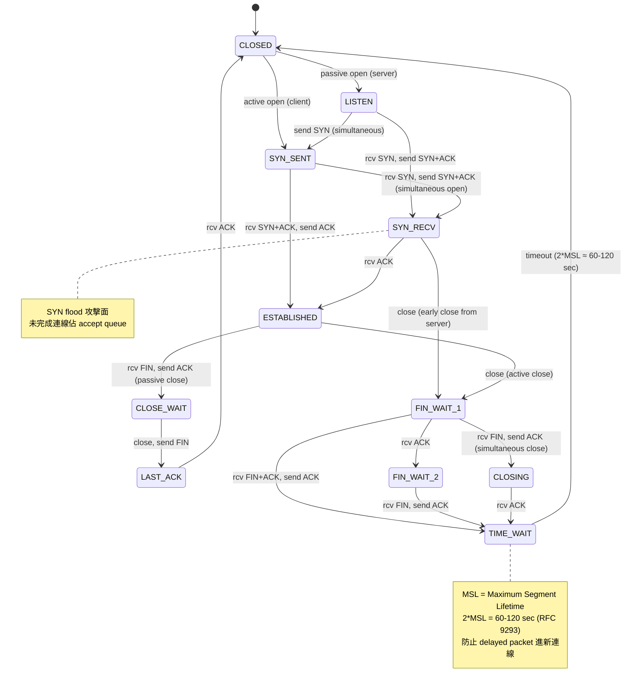
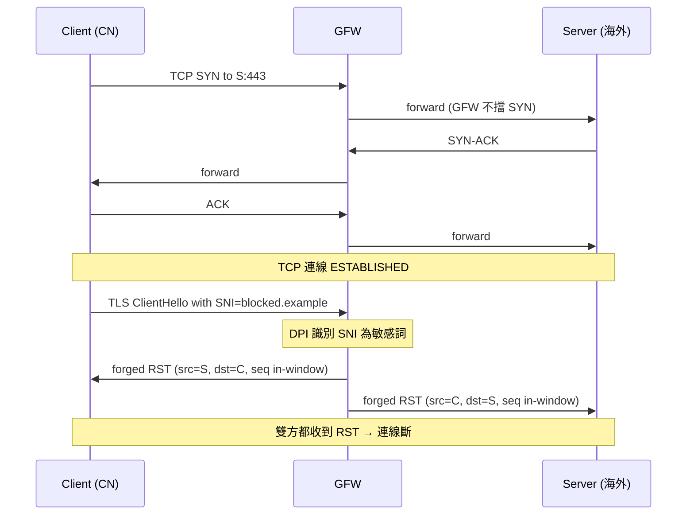

# 課堂 1.8 — TCP 完整解剖（一）：連線管理

## 學前知道

- **前置課**：[1.4 IP 路由](./1.4-ip-routing-graph.md)、[1.6 ICMP](./1.6-icmp-deep.md)（PMTUD 與 TCP 互動）、[1.7 NAT](./1.7-nat-taxonomy.md)（NAT 對 TCP state 的影響）
- **預計閱讀時間**：50~60 分鐘（這堂與 1.9 / 1.10 是 Part 1 最密的三堂）
- **必讀規格 / 論文**：
  - **RFC 9293 — Transmission Control Protocol (TCP)** (Eddy, August 2022, STD 7) ⭐ **2026 TCP 的權威 spec**——consolidated RFC 793 + 28 個後續更新
  - **RFC 1122 — Requirements for Internet Hosts** (Braden, 1989) — TCP 部分被 RFC 9293 取代但仍有歷史價值
  - **RFC 5961 — Improving TCP's Robustness to Blind In-Window Attacks** (Ramaiah, Stewart, Dalal, 2010) — challenge ACK 機制
  - **RFC 7413 — TCP Fast Open** (Cheng, Chu, Radhakrishnan, Jain, 2014) ⭐ — 0-RTT TCP
  - **RFC 6191 — Reducing the TIME-WAIT State Using TCP Timestamps** (Gont, 2011)
  - **RFC 6093 — On the Implementation of the TCP Urgent Mechanism** (Gont & Yourtchenko, 2011)
  - **RFC 6528 — Defending against Sequence Number Attacks** (Gont & Bellovin, 2012)
  - **Bernstein — *SYN cookies*** (informal note, 1996, deployed in Linux 1996+)
  - **Watson — Slipping in the Window: TCP Reset Attacks** (CanSecWest 2004) — RFC 5961 起源
  - **Cao, Qian, Wang, Dao, Krishnamurthy, Marvel — Off-Path TCP Exploits: Global Rate Limit Considered Dangerous** (USENIX Security 2016) ⭐ CVE-2016-5696 — RFC 5961 mitigation 反成 side channel
  - **Cao et al. 2018 *Off-Path TCP Exploits of the Challenge ACK Global Rate Limit*** (TNET) — 後續完整版
  - **Feng et al. 2020 *Off-Path TCP Exploits of the Mixed IPID Assignment*** (CCS 2020) — IPID 側信道
  - **Wang et al. 2020 *SymTCP: Eluding Stateful Deep Packet Inspection with Automated Discrepancy Discovery*** (NDSS 2020) — TCP DPI evasion 自動化發現
- **必讀原始碼**：
  - Linux `net/ipv4/tcp_ipv4.c`（IPv4 連線入口）、`net/ipv4/tcp_input.c`（state machine 主體）、`net/ipv4/syncookies.c`
  - `include/net/tcp_states.h`（state enum）
  - `net/ipv4/inet_connection_sock.c`（accept queue）

---

## 動機

G6 baseline 走 UDP/QUIC，**理論上**不用 TCP。但你**必須**精通 TCP 連線管理，因為：

1. **GFW 的主要工具是 TCP RST injection**：絕大多數翻牆協議在中國被斷的根因是 RST。**理解 TCP state machine 才能設計抗 RST 機制**（QUIC 對此天然免疫，但 G6 fallback transport 走 TCP 時必須處理）
2. **REALITY / VLESS+TLS / Trojan-Go 全部走 TCP**：當前 SOTA 翻牆協議 70% 跑 TCP。Part 6 / 7 會精講這些協議，**前提是你懂 TCP state machine 與其攻擊面**
3. **TCP Fast Open (RFC 7413) 是 0-RTT 概念的 TCP 版**：QUIC 0-RTT 設計 inherit TFO 的思路與安全教訓。**TFO 為何沒成功，QUIC 0-RTT 為何（部分）成功**——這是 Part 8 QUIC 章節的關鍵討論
4. **TCP 連線狀態管理是分散式系統 state machine 設計範本**：CLOSED → LISTEN → SYN_SENT → SYN_RECV → ESTABLISHED → FIN_WAIT 系列 + TIME_WAIT 邊界 case——這個 ~11 state 的 FSM 是 distributed system 教學的「**寶藏**」（同 Perlman STP 1985）
5. **SYN flood / SYN cookies / challenge ACK 三個攻防回合** 揭示「**任何 stateful 中間設備在公網都是潛在 DoS target**」——對 G6 server-side 設計極關鍵
6. **Cao 2016 CVE-2016-5696 是 side channel 經典案例**：增加安全性的 mechanism（RFC 5961 challenge ACK rate limit）反而**成為更強的 side channel**。**這個教訓對 G6 任何 rate-limit 設計都適用**

教科書講 TCP 連線管理的問題：把 RFC 793（1981）那個簡化 FSM 畫一遍就完——不講為什麼 SYN cookies 是必要的、不講 RFC 5961 的反向漏洞、不講 GFW 怎麼把 RST 武器化、不講 TFO 失敗原因。本堂從攻防回合切入，state machine 不是死板背誦而是攻擊面地圖。

---

## 核心概念

### 1. TCP header 必須知道的部分

```
 0                   1                   2                   3
 0 1 2 3 4 5 6 7 8 9 0 1 2 3 4 5 6 7 8 9 0 1 2 3 4 5 6 7 8 9 0 1
+-+-+-+-+-+-+-+-+-+-+-+-+-+-+-+-+-+-+-+-+-+-+-+-+-+-+-+-+-+-+-+-+
|          Source Port          |       Destination Port        |
+-+-+-+-+-+-+-+-+-+-+-+-+-+-+-+-+-+-+-+-+-+-+-+-+-+-+-+-+-+-+-+-+
|                        Sequence Number (32 bit)               |
+-+-+-+-+-+-+-+-+-+-+-+-+-+-+-+-+-+-+-+-+-+-+-+-+-+-+-+-+-+-+-+-+
|                    Acknowledgment Number (32 bit)             |
+-+-+-+-+-+-+-+-+-+-+-+-+-+-+-+-+-+-+-+-+-+-+-+-+-+-+-+-+-+-+-+-+
| Data |          |C|E|U|A|P|R|S|F|                             |
|Offset|   Rsvd   |W|C|R|C|S|S|Y|I|         Window (16 bit)     |
| (4b) |          |R|E|G|K|H|T|N|N|                             |
+-+-+-+-+-+-+-+-+-+-+-+-+-+-+-+-+-+-+-+-+-+-+-+-+-+-+-+-+-+-+-+-+
|         Checksum (16 bit)     |    Urgent Pointer (16 bit)    |
+-+-+-+-+-+-+-+-+-+-+-+-+-+-+-+-+-+-+-+-+-+-+-+-+-+-+-+-+-+-+-+-+
|                    Options (variable, 0-40 byte)              |
+-+-+-+-+-+-+-+-+-+-+-+-+-+-+-+-+-+-+-+-+-+-+-+-+-+-+-+-+-+-+-+-+
|                             Data                              |
```

**8 個 control flag**（RFC 793 原始 6 + RFC 3168 增 ECN 2）：
- **CWR (Congestion Window Reduced)**, RFC 3168
- **ECE (ECN Echo)**, RFC 3168
- **URG (Urgent)** — RFC 6093 強烈建議**不再用**（routing/middlebox 處理 inconsistent）
- **ACK (Acknowledgment)**
- **PSH (Push)** — 通知對方「立即把 data 送 app」（現代 OS 多忽略）
- **RST (Reset)** — **本堂主角之一**
- **SYN (Synchronize)** — 三次握手
- **FIN (Finish)** — 四次揮手

**常用 Options**：
- **MSS (Maximum Segment Size, kind=2)**：SYN/SYN-ACK 內，宣告自己接收能力
- **Window Scale (kind=3, RFC 7323)**：擴展 window 從 16-bit 到 30-bit
- **SACK Permitted (kind=4, RFC 2018)** + **SACK (kind=5)**
- **Timestamps (kind=8, RFC 7323)**：RTT 量測 + PAWS (Protection Against Wrapped Sequences)
- **MD5 / TCP-AO (kind=19/29)**：BGP / 重要 session 認證
- **Fast Open Cookie (kind=34, RFC 7413)**

### 2. TCP 連線狀態機（RFC 9293 §3.6）



**11 個 state**（不算 CLOSED 是 12 個含起點）。學界稱「TCP 是工程界最被頻繁實作的 state machine」——任何寫網路 stack 的人都要面對全部 11 state。

#### 2.1 SYN_RECV：accept queue 與 SYN flood

當 server 收到 SYN 但還未收到最後 ACK，socket 處於 SYN_RECV state。Linux 維護兩個 queue：
- **SYN queue**（半連線 queue）：SYN_RECV state 的 socket，等 ACK
- **Accept queue**（完成連線 queue）：ESTABLISHED 且等 app `accept()`

**SYN flood 攻擊**：attacker 大量送 SYN（用 spoofed src IP），server 對每個 SYN 回 SYN+ACK + 進入 SYN_RECV，**但永遠收不到 ACK**（src 是 spoof 的）。**SYN queue 被填滿** → 合法 SYN 無法進 → server 拒服務。

#### 2.2 SYN cookies（Bernstein 1996）

防 SYN flood 的關鍵技巧。**核心想法**：server 收到 SYN 時**不分配 state**，把所有必要 state 編進 SYN+ACK 的 Initial Sequence Number (ISN)。

```
ISN = MAC(secret, src_IP, src_port, dst_IP, dst_port, timestamp, MSS_index)
```

當對方回 ACK，server 驗證 `ack_num - 1 == 該 5-tuple 應產生的 ISN`，若 yes → 合法（recreate state）。**無 ACK = 無 state 分配 = 攻擊者徒勞**。

**代價**：SYN cookies 限制可表達的 option（TCP Timestamps、SACK permitted 等只能存在 ISN bit 中），所以**非首選**——僅在 SYN queue 將滿時啟用。Linux：`net.ipv4.tcp_syncookies=1` (default)。

#### 2.3 TIME_WAIT 風暴與 port exhaustion

主動 close 那端進 TIME_WAIT，**持續 2×MSL（typical 60-120 sec）**。原因：
- 防止 delayed packet 被誤認為新連線一部分
- 確保對方收到最後 ACK（若對方沒收，會 retx FIN，自己仍能正確回 ACK）

**問題**：高並發 server（HTTP server、proxy）累積大量 TIME_WAIT 連線（每秒 1000 連線 × 60s = 60000 條 TIME_WAIT）→ **ephemeral port 耗盡** → 新連線出不去。

**Mitigations**：
- `tcp_tw_reuse=1`（Linux）：對 outgoing connection 安全 reuse TIME_WAIT entry（需要 TCP Timestamp option）
- `SO_REUSEADDR`：應用層立即 reuse 同一 src port
- `tcp_tw_recycle=1` **⚠️ DEPRECATED in Linux 4.12** (2017)：曾被廣泛使用，但在 NAT 環境下會 corrupt connections——**絕對不要開**
- 增大 `net.ipv4.ip_local_port_range` 與 `tcp_max_tw_buckets`

#### 2.4 半開連線（half-open）

- **Server crash → reboot**：server 不知道有 old connection；client 仍以為連線在
- **Client send data**：server 不認識這個 connection → **回 RST**
- **Client receive RST** → 應用層感知連線失效

**Race condition / data loss 風險**：server crash 那瞬間 unACKed data 永遠丟。**對 G6 設計**：data plane 必須能 detect server restart（透過 control plane heartbeat），不能依賴純 transport-level 連通性。

### 3. TCP Fast Open (RFC 7413) — 0-RTT 嘗試 ⭐

#### 3.1 為什麼需要

正常 TCP：3-way handshake 完成才能送 data。**第一個 application byte 等 1 RTT**。對 short-lived flow（HTTP request）這 1 RTT 佔總時間 50%+。

**TFO 想法**：客戶端**在 SYN 同時夾帶 application data**，server 直接處理 → 0-RTT。

#### 3.2 機制

**第一次連線**（cold path）：
1. Client SYN → Server
2. Server 回 SYN-ACK + **TFO Cookie option**（含 server-side secret 派生的 cookie，bound to client IP）
3. 後續正常握手

**第二次連線**（hot path, 0-RTT）：
1. Client SYN + TFO Cookie + **data** → Server
2. Server 驗 cookie → 若 valid → 立即傳給 app → 同時送 SYN-ACK
3. Application byte 在 1 RTT 內到達 ✓

#### 3.3 為什麼 TFO 失敗（在公網）

- **Middlebox 處理混亂**：很多 firewall / IDS 看到 SYN with data 視為異常 → drop。**RFC 7413 §6.2.1 列出 known issues**
- **GFW 對 TFO 敏感**：早期 GFW 對 SYN-with-payload 採取 DROP 策略，使 TFO 在中國場景**直接失敗**
- **0-RTT 重放攻擊**：cookie 不過期 → attacker 複製 SYN+data → server 重複執行 idempotent operation
- **採用率低**：~5-10% public web，大多數 enterprise 環境 disabled
- **QUIC 0-RTT 接手**：QUIC 設計時 inherit TFO 教訓，做得更穩——TFO 在 2026 已**事實淘汰**

#### 3.4 對 G6 設計的啟示

TFO 失敗的 4 個教訓對 QUIC 0-RTT / G6 0-RTT 全適用：
1. **任何 0-RTT 都必須能 detect replay**：用 single-use ticket、time-bounded nonce、application-layer idempotency
2. **不能依賴 middlebox 守規矩**：必須有 fallback 到 1-RTT
3. **0-RTT 流量必須 indistinguishable** from 1-RTT cold start——否則 GFW 看 size pattern 就識別
4. **0-RTT 只用在 idempotent operation**：GET request OK，POST/PUT 危險

### 4. TCP RST：GFW 的瑞士軍刀

#### 4.1 RST 在 RFC 9293 中的合法用途

- 收到對 unknown socket 的 packet（沒 LISTEN，又非 ESTABLISHED）
- 應用層 `close(fd)` 加 `SO_LINGER=0`
- TCP 探測到 invalid state（seq number 不對、option 異常）

#### 4.2 GFW 怎麼用 RST 武器化

**核心攻擊**：GFW DPI 看到「**可疑 flow**」（SNI 含敏感詞、TLS ClientHello 像 Tor、特定 byte pattern）→ 對該 flow 兩端**雙向**送偽造 RST。雙方 OS 收到 RST → 連線直接斷。

**為什麼有效**：
- RST 不需 in-window seq number（**任何 in-window seq 即接受**——`((seg.seq >= rcv.nxt) && (seg.seq < rcv.nxt + rcv.wnd))`）
- attacker on-path 知道 4-tuple + 大致 seq 範圍 → 容易構造
- 大多 OS 對 RST 反應極快——一個 RST 就斷

**對抗**：
- **忽略 RST**（unsafe，會錯過合法 RST）
- **加 firewall rule drop incoming RST**（Tor 早期做過，但 GFW 改用 selectivity）
- **改走 UDP/QUIC**（RFC 9000 內無 RST 概念；QUIC stateless reset 走密碼學）—— **G6 baseline 走此路**
- **走加密 transport like REALITY + 流量混淆**：讓 GFW 看不出 ClientHello pattern——**這是當前主流**

#### 4.3 為什麼 QUIC 對 RST injection 免疫

- 沒有 RST 概念
- QUIC stateless reset 需要 **secret token** —— attacker 不知 → 無法偽造
- 每 packet 加密 → middlebox 看不到 connection state

**G6 baseline 走 QUIC = 天然免疫 RST injection**——這是設計選擇的核心理由之一。

### 5. Watson 2004 + RFC 5961 + Cao 2016 三個回合 ⭐

#### 5.1 Watson 2004 「Slipping in the Window」

提出 off-path RST injection：attacker **不在 path 上**，盲打 RST。原始 TCP（pre-RFC 5961）接受任何 in-window seq → attacker 用 (2^32 / window_size) 次嘗試可命中。對大 window（典型 64KB）→ ~65536 次嘗試 = 數秒內可斷任意 TCP 連線。

#### 5.2 RFC 5961 (2010) — challenge ACK

修補：RST 只在 **seq 精確等於 rcv.nxt** 時直接接受；in-window 但不精確時，**回 challenge ACK**（告訴對方「**這不是 valid RST**」），對方若是合法則繼續，attacker 不知道結果。

**Challenge ACK 全局 rate limit**：每秒最多 N 個 challenge ACK（防自己被 DoS）。Linux default `tcp_challenge_ack_limit=1000`/sec。

#### 5.3 Cao 2016 CVE-2016-5696 — Challenge ACK 反成 side channel

**Cao et al. 2016 USENIX Security** 揭示：**全局 rate limit 是 shared state**——任何 attacker 可以「**消耗**」這個 limit 來探測：

1. Attacker 對 victim server 大量送無效 packet → 觸發 challenge ACK 用完 N 個
2. Attacker 對 target connection（4-tuple 已知）送 RST with random seq
3. 觀察 server 是否回 challenge ACK（透過時序或某種 side channel）：
   - 若回 → 該 4-tuple 不是 active connection（無效 RST 觸發 challenge）
   - 若不回 → connection exists，且 seq is in-window（精確 RST 直接接受）—— **attacker 確認 connection 存在**
4. **二分搜尋 valid seq** → 注入 RST 或 data

**影響**：Linux kernel 3.6+ (2012) 受影響——數百萬 device。**修補**：Linux 4.7 起 challenge ACK rate limit per-socket 不再 global。

#### 5.4 教訓對 G6

**「shared state for security」 = 可能的 side channel**。G6 設計：
- 任何 rate limit 必須**per-flow / per-connection**，不能 global
- 任何 token bucket 必須**密碼學 binding** 到特定 client，避免 cross-flow inference
- 對 rate-limited reject 與 silently drop 應該**timing-indistinguishable**

### 6. Cao 之後的延伸：IPID 側信道（Feng 2020）

Linux 對 IPv4 header 的 ID field 在不同 socket 有不同 policy（per-socket counter vs global counter）。**Feng et al. 2020 CCS** 利用 mixed assignment 做 off-path TCP attack——再次證實 **shared state 易被 weaponize**。

對 G6：**IPID 對 QUIC 不直接適用**（QUIC over UDP，UDP header 也有 fragmentation ID 但 entropy 略不同），但**思想直接適用**：避免 cross-flow state sharing。

### 7. GFW 對 TCP 的具體攻擊鏈



**關鍵時序**：GFW 在 ClientHello 之後才動手——不是 SYN 階段。**因為 GFW 等 SNI 拿到再決定是否封**。

**對 G6**：若走 TLS+TCP，SNI 必須加密（**ESNI / ECH, Encrypted Client Hello, draft-ietf-tls-esni-current**）——或走完全不暴露 SNI 的 transport（**REALITY 借用真實 server 的 ClientHello**）。

---

## 與我們協議設計的關聯

| 設計面 | TCP 連線管理知識的影響 |
|---|---|
| **11.1 威脅模型** | GFW 的 RST injection 必須列為已知能力；off-path TCP attack 對 fallback TCP transport 適用 |
| **11.4 主架構** | baseline 走 QUIC 主要動機之一就是免疫 RST；TCP fallback 必須有加密保護（REALITY-style） |
| **11.6 握手** | 不走 TFO 風格 0-RTT（教訓太多）；學 QUIC 0-RTT 的 anti-replay + 1-RTT fallback |
| **12.4 data path** | TCP fallback 必須處理 RST / half-open / TIME_WAIT |
| **12.7 server** | SYN cookies enabled；不依賴 global rate limit；per-socket 或 per-flow rate limit |
| **12.13 高丟包/抗審查** | TCP fallback 抗 RST injection 測試集；驗證 RST drop firewall rule 有效 |

---

## 動手（35 分鐘）

### 任務 1（5 min）：看自己 OS 的 TCP 配置

```bash
# Linux VM
orb -m debian
sysctl net.ipv4.tcp_syncookies
sysctl net.ipv4.tcp_max_syn_backlog
sysctl net.ipv4.tcp_synack_retries
sysctl net.ipv4.tcp_fin_timeout
sysctl net.ipv4.tcp_tw_reuse
sysctl net.ipv4.tcp_fastopen           # 0=disabled, 1=client, 2=server, 3=both
sysctl net.ipv4.tcp_challenge_ack_limit # Cao 2016 mitigation
sysctl net.ipv4.ip_local_port_range
sysctl net.ipv4.tcp_max_tw_buckets
```

### 任務 2（10 min）：觀察完整 TCP state transition

```bash
# 在 VM 內開 server
nc -l -p 12345 &
SERVER_PID=$!

# 開連線
nc 127.0.0.1 12345 &
CLIENT_PID=$!

# 看 socket state
ss -nt | grep 12345

# 對話一下
echo "hello" | nc -q 1 127.0.0.1 12345

# 觀察 close 過程
kill $CLIENT_PID
sleep 1
ss -nt state time-wait | grep 12345 | head
```

### 任務 3（10 min）：實際看 TFO 行為

```bash
# 看 client 端 TFO 狀態
curl --tcp-fastopen https://www.cloudflare.com/ -v 2>&1 | grep -i fastopen

# Linux server 啟用 TFO（需 root）
# echo 3 > /proc/sys/net/ipv4/tcp_fastopen
# 用 nc 配 -O 看實際 TFO traffic（注意 nc 版本要新）
```

### 任務 4（10 min）：抓 GFW-style RST injection（在自己 VM 模擬）

```bash
# 一邊建連線
ssh -o ConnectTimeout=10 vps.example.com &

# 另一邊用 hping3 偽造 RST 模擬 GFW
orb -m debian
sudo apt install -y hping3
# 注意 src/dst/seq 都要對才能斷
sudo hping3 -R -p 22 -s <client_port> -M <approx_seq> -k vps.example.com -c 1
```

實際成功需要精確 seq number——這個動手主要 demonstrate「**如何思考 RST injection**」，不一定能真斷自己的合法連線。

---

## 自我檢查

1. 從 CLOSED 走到 ESTABLISHED 經過哪些 state？反向 close 過程經過哪些？TIME_WAIT 的 2×MSL 等待目的是什麼？
2. SYN flood 的根因為何 SYN cookies 能解？SYN cookies 為何**不是預設啟用**而是 SYN queue 將滿時觸發？
3. TFO 為什麼失敗？學到的 4 個教訓對 QUIC 0-RTT / G6 0-RTT 各對應什麼設計決策？
4. GFW RST injection 在 RFC 9293 TCP state machine 中為什麼可行？QUIC 為什麼免疫？這個免疫性是 G6 baseline 走 QUIC 的核心理由之一——還有哪些理由？
5. RFC 5961 challenge ACK 試圖修補什麼 Watson 2004 的攻擊？Cao 2016 怎麼把 mitigation 反成 side channel？「shared state 為安全」這個 anti-pattern 的普遍教訓是什麼？
6. TIME_WAIT 對高並發 server 為什麼是 port exhaustion 災難？`tcp_tw_recycle` 為何在 Linux 4.12 被 deprecate？對 G6 server 部署有什麼具體配置建議？

---

## 延伸閱讀

- **Eddy — RFC 9293 全文** — 必通讀，98 頁但 dense；2026 TCP 的權威 spec
- **Stevens — *TCP/IP Illustrated Volume 1*** ch.18-24 — 經典
- **Wright & Stevens — *TCP/IP Illustrated Volume 2*** — 4.4BSD 實作（仍有教學價值）
- **Linux kernel `Documentation/networking/ip-sysctl.rst`** — 每個 sysctl 含義
- **Pekka Savola — RFC 4953 *Defending TCP Against Spoofing Attacks*** — TCP security SoK
- **Cao 2016 USENIX paper full PDF** <https://www.usenix.org/system/files/conference/usenixsecurity16/sec16_paper_cao.pdf>
- **Cloudflare blog 多篇 TCP-deep** — 工業實踐
- **Linux Plumbers Conference networking track** — kernel hacker 一手經驗

---

## 研究級補遺

### 1. 學界詞彙

- **ISN (Initial Sequence Number) generation**：RFC 6528 規範，避免 1985 Morris 攻擊
- **SYN cookies** (Bernstein 1996)
- **MSL (Maximum Segment Lifetime)**：120 sec 是 RFC 默認，Linux default 60 sec
- **2MSL TIME_WAIT** = 防 delayed-segment misassociation
- **TCP segment vs TCP packet**：segment = TCP layer 概念，packet = IP layer
- **PAWS (Protection Against Wrapped Sequences, RFC 7323)**：用 timestamp 防 seq wraparound
- **Window scaling** (RFC 7323)
- **TCP Authentication Option (TCP-AO, RFC 5925)**：取代 TCP-MD5（RFC 2385）；BGP 等場景用
- **Challenge ACK** (RFC 5961)
- **TFO Cookie** (RFC 7413)
- **Half-open / Half-close connection**
- **Simultaneous open / simultaneous close**：罕見但 RFC 9293 §3.6 涵蓋
- **Off-path / on-path / in-path attacker**
- **Slipping in the window** (Watson 2004)
- **Mixed IPID side channel** (Feng 2020)
- **SymTCP** (Wang 2020) — DPI evasion via state divergence
- **TCP-MD5 / TCP-AO**：BGP 安全 option
- **TCP urgent mechanism**：RFC 6093 建議廢棄

### 2. 對手分類學

| 對手 | 對 TCP 連線的能力 |
|---|---|
| **on-path passive** | 看所有 segment；無法注入 |
| **on-path active**（典型 GFW） | RST / data 注入；selective drop；TLS ClientHello DPI |
| **off-path blind injection** | 必須猜 4-tuple + seq；Cao 2016 顯示 challenge ACK rate limit 是泄漏 channel |
| **off-path with side channel**（如 IPID, Cao 2016） | 透過 shared global state 推斷 sequence number / connection existence |
| **NAT operator** | 看 mapping table；可隨意 drop / fingerprint |
| **DPI middlebox**（企業 / ISP） | 可重組 TCP stream 做 application-layer inspection |
| **PEP middlebox**（衛星 link） | 主動 split TCP 連線改善 perf；違反 e2e |

### 3. 形式化定義

#### 3.1 TCP state machine 形式化

設 S = {CLOSED, LISTEN, SYN_SENT, SYN_RECV, ESTABLISHED, FIN_WAIT_1, FIN_WAIT_2, CLOSE_WAIT, CLOSING, LAST_ACK, TIME_WAIT}。
轉移 transition function δ：S × Event → S，Event ∈ {SYN, ACK, FIN, RST, APP_CLOSE, TIMEOUT}。

**Safety property（RFC 9293 隱含）**：
- 任何 ESTABLISHED state 必須經 SYN/SYN-ACK/ACK 三 step
- TIME_WAIT 之後必經 timeout 才回 CLOSED（不能跳）
- 任意 state 收 RST → 進 CLOSED（除 LISTEN / TIME_WAIT 視 RFC 變體）

**Liveness property**：
- ∀ state ≠ {CLOSED, ESTABLISHED, LISTEN}: 有限時間內進 CLOSED 或 ESTABLISHED
- TIME_WAIT 在 2×MSL 後保證進 CLOSED

#### 3.2 SYN cookies 形式化安全性

設 ISN = MAC_k(src_IP || src_port || dst_IP || dst_port || timestamp || MSS_index)，其中 k 是 server secret。

**Property**：若 MAC 為 PRF，attacker（無 k）若沒收到 SYN+ACK 就猜中 valid ISN 之機率 ≤ 1/2^32。**Attacker 構造合法 ACK = 必須先看到對應 SYN+ACK**（on-path）→ 對 spoofed-src attacker 不可能。

**代價**：限制可表達 option，僅在 SYN queue 即將溢出時啟用。

#### 3.3 Off-path RST injection 可行性

設 victim 連線 4-tuple = (src_IP, src_port, dst_IP, dst_port)。Attacker 知 dst_IP, dst_port（well-known）；猜 src_IP（or 用 spoofed src=dst_IP for reverse direction）；猜 src_port（典型 ephemeral range，~32768~60999, 28K 可能）。

**Pre-RFC 5961**：RST 接受條件 = seq ∈ [rcv.nxt, rcv.nxt + rcv.wnd)。Window 64 KB → 2^16 種 seq、4 種 port → **~28K × 1 = 28K attempts 預期命中**（spoof src=dst）。實測秒級可斷。

**RFC 5961**：RST 接受條件 = seq == rcv.nxt（精確匹配）。其他 → challenge ACK。Attacker 必須**精確猜 seq**——不可行的 brute force。

**Cao 2016 之後**：但 challenge ACK rate limit 是 global → attacker 用 timing 探測，**重新獲得 sequence inference 能力**。

### 4. 必追論文 / 規格

- ✅ **RFC 9293 (2022)** ⭐ — 必通讀
- ✅ **RFC 7413 TFO** — 0-RTT 經典
- ✅ **RFC 5961** — challenge ACK
- ✅ **Bernstein 1996 SYN cookies** (informal but historically critical)
- ✅ **Watson 2004 *Slipping in the Window***
- ✅ **Cao et al. 2016 USENIX Security** ⭐ — side channel 教科書級 — 札記 [notes/papers/cao-tcp-side-channel.md](../../notes/papers/cao-tcp-side-channel.md)
- **Morris 1985 *A Weakness in the 4.2BSD Unix TCP/IP Software***（first ISN attack）
- **Bellovin 1989 *Security Problems in the TCP/IP Protocol Suite***
- **Postel 1981 RFC 793**（歷史 reference）
- **Feng et al. 2020 CCS *Off-Path TCP Exploits of the Mixed IPID Assignment***
- **Wang et al. 2020 NDSS *SymTCP: Eluding Stateful DPI with Automated Discrepancy Discovery*** — 札記 [notes/papers/wang-symtcp-2020.md](../../notes/papers/wang-symtcp-2020.md)
- **Pearce et al. 2017 NDSS *Augur: Internet-Wide Detection of Connectivity Disruptions***
- **Sherry, Lan, Popa, Ratnasamy 2015 SIGCOMM *BlindBox***（middlebox + encryption 互動）

### 5. 我們協議的座標 / 設計取捨

| 設計面 | TCP 知識影響 |
|---|---|
| **baseline = QUIC** | 主要動機之一：免疫 RST injection；其他理由：multiplexing、0-RTT、connection migration |
| **TCP fallback (when QUIC blocked)** | 必須有；但加密層必須 indistinguishable from HTTPS（REALITY-style） |
| **不走 TFO** | 教訓太多，採用率低；QUIC 0-RTT 取代 |
| **不依賴 global rate limit** | server-side 任何 rate limit per-flow / per-connection / per-source-IP，避免 Cao 2016 教訓 |
| **TIME_WAIT 管理** | 設定 tcp_tw_reuse=1 (safe with Timestamp)；不開 tcp_tw_recycle |
| **抗 RST 設計** | QUIC 內無 RST；TCP fallback 加 firewall rule drop unexpected RST |
| **0-RTT replay protection** | single-use ticket；application-layer idempotency；time-bounded nonce |

### 6. 必追資源

- **IETF tcpm WG** — TCP 標準 maintenance
- **Linux netdev mailing list** — kernel TCP 演化
- **Cloudflare blog**, **Tailscale blog**, **Mozilla networking** — 工業 TCP 深度文
- **APNIC blog (Geoff Huston)** — TCP 量測與分析
- **CAIDA / Censored Planet** — TCP 在 censorship 場景的研究
- **USENIX Security / NDSS / CCS proceedings** — TCP 攻防論文一線發表處
- **Vint Cerf, Bob Kahn 1974 TCP 原始論文** — 歷史 reference

### 7. 開放問題

- **Post-quantum TCP**：TCP-AO 仍用 HMAC-SHA-1/256；PQ migration path 未明確
- **TCP 在 2030 是否會被 QUIC 完全取代**？Geoff Huston 預測「TCP 還會活 20 年」——但 web 與 video 已大量 QUIC 化。**長尾 protocol (SSH, SMTP, IRC) 何時遷移**？open
- **形式化驗證 TCP state machine**：part of TCP 已有 TLA+ / Coq 建模，**完整 mechanized proof** 含所有 corner case 尚未完成
- **TFO 復活的可能性**：若 middlebox 環境改善，TFO 是否重新適用？無動力，因 QUIC 更好
- **Cao 2016 之後類似 side channel 是否還有**：Wang 2020 SymTCP 自動化發現 TCP DPI discrepancy——**等價技術用於 OS-level shared state 揭露**？open
- **TCP 在 5G mmWave / LEO satellite 的不適用性**：高 BDP、高變動延遲——**TCP CC 演算法是否需 fundamental rethink**？BBR 是 partial answer 但非完整解
- **GFW 在 2026 對 TCP 的具體策略**：已從純 RST injection 進化到 SNI selective drop、QUIC blocking、entropy-based detection——**未來方向**？無公開 strategic study

---

下一堂：**1.9 TCP 完整解剖（二）：可靠傳輸**——sequence number、ACK、SACK/DSACK、RTO 計算（Karn's algorithm）、快速重傳、F-RTO、ER、Linux `tcp_input.c` 精讀；對應 G6 reliable delivery 設計。
