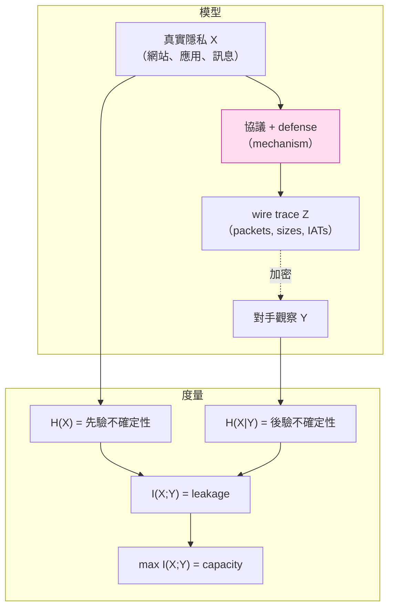

# 課堂 10.1 — 流量分析的數學基礎：資訊理論視角

## 學前知道
- 前置課：Part 3.1（Shannon 1948 的資訊量定義）、Part 4 全（TLS/QUIC 握手結構）、Part 5.1（safety / liveness 性質）
- 預計閱讀時間：35–50 分鐘
- 必讀論文：
  - Shannon (1948), *A Mathematical Theory of Communication*, BSTJ
  - Serjantov & Danezis (2002), *Towards an Information Theoretic Metric for Anonymity*, PETS
  - Díaz, Seys, Claessens, Preneel (2002), *Towards measuring anonymity*, PETS
  - Smith (2009), *On the Foundations of Quantitative Information Flow*, FoSSaCS
  - Chatzikokolakis, Chothia, Guha (2010), *Statistical Measurement of Information Leakage*, TACAS
- 必讀原始碼：無（純理論）

## 動機

Part 10 的核心命題：**「即使 payload 被現代密碼學完全加密、即使連線兩端的 metadata 都被 Tor / proxy 隱藏，仍存在『側通道（side channel）』讓對手能以高準確率推斷你在做什麼。」**

這個命題聽起來像玄學。但它有嚴格的數學基礎——Shannon 1948 給出的 entropy / mutual information / channel capacity，加上 Serjantov–Danezis 與 Smith 二十年後的 quantitative information flow 框架。**Part 10 整章都是在這個數學框架下做攻防。**

對我們設計 SOTA 協議的意義：

1. 「我把資料加密就安全了」**是錯的**。加密保護的是 confidentiality of payload，**不是** confidentiality of the fact that you sent payload。後者要靠 traffic engineering 達成。
2. 任何 traffic-shaping defense 都有 information-theoretic lower bound——你不可能既不犧牲頻寬、又不犧牲延遲，還達到完美的 unobservability。**設計取捨是定理級的，不是工程哲學。**
3. 「不可區分性（indistinguishability）」這個密碼學概念，在 traffic analysis 場景下要重寫成 **statistical indistinguishability under bounded adversary**，且要明確指定對手的觀測能力與計算能力。

這堂課把工具備齊；之後 10.2–10.12 都是這套工具在不同場景的展開。

## 核心概念

### 一、Shannon entropy：不確定性的度量

設 $X$ 是離散隨機變數，取值於 $\mathcal{X}$，分布為 $p(x) = \Pr[X = x]$。則 $X$ 的 **Shannon entropy** 定義為：

$$H(X) = -\sum_{x \in \mathcal{X}} p(x) \log_2 p(x)$$

單位：bit（以 2 為底時）。直覺：$H(X)$ 是「平均要花幾個 yes/no 問題才能猜出 $X$」。

**極值性質**：
- $H(X) \geq 0$，等號 iff $X$ 是 deterministic（某個 $x$ 機率為 1）。
- $H(X) \leq \log_2 |\mathcal{X}|$，等號 iff $X$ 在 $\mathcal{X}$ 上均勻分布。
- 對所有 $f$：$H(f(X)) \leq H(X)$（data processing inequality 的特例）。

**例子（流量分析場景）**：
- 假設你訪問的網站取自 Alexa Top 1000，均勻分布。則 $H(\text{website}) = \log_2 1000 \approx 9.97$ bits。
- 對手要把這 9.97 bits 全套出來才能 100% 確定你在看哪個網站。**Part 10 全部的 WF (website fingerprinting) 攻擊論文都在量化「對手能從觀察中套出多少 bits」。**

### 二、條件熵與互資訊

設 $Y$ 是對手觀察到的隨機變數（在 WF 場景：封包序列、大小、IAT），$X$ 是你想保護的隱私（網站、應用、訊息類型）。

**條件熵** $H(X|Y)$：給定觀察 $Y$ 後，$X$ 剩餘的不確定性。

$$H(X|Y) = -\sum_{x,y} p(x,y) \log_2 p(x|y)$$

**互資訊** $I(X;Y)$：觀察 $Y$ 替對手 reveal 了關於 $X$ 的多少資訊。

$$I(X;Y) = H(X) - H(X|Y) = H(Y) - H(Y|X)$$

性質：
- $I(X;Y) \geq 0$，等號 iff $X \perp Y$（獨立）。
- $I(X;Y) = I(Y;X)$（對稱）。
- $I(X;Y) \leq \min(H(X), H(Y))$。

**對流量分析的意義**：
- 「完美 unobservability」≡ $I(X;Y) = 0$，即觀察與隱私統計獨立。實務上不可能達到（除非你不發任何封包），但可以追求 $I(X;Y) \to 0$。
- WF 攻擊論文都在量化或下界估計 $I(\text{site}; \text{trace})$。
- WF 防禦論文都在用 padding / morphing 強行壓低 $I(\text{site}; \text{trace})$。

### 三、Kullback–Leibler divergence

$$D_{KL}(p \| q) = \sum_x p(x) \log_2 \frac{p(x)}{q(x)}$$

直覺：「假設真實分布是 $p$，但我們用 $q$ 來建模，所付出的『多餘 bits』」。性質：$D_{KL} \geq 0$，等號 iff $p \equiv q$。**非對稱**。

**對流量分析的意義**：
- 兩個 traffic class（如「訪問 Facebook」vs「訪問 Twitter」）的可區分性 ≈ $D_{KL}(p_{FB} \| p_{TW})$ 或對稱版本 Jensen–Shannon divergence。
- Walkie-Talkie（Wang & Goldberg 2017）的防禦目標：讓兩個 site 的 trace 分布變得有相同的 $p$，即 $D_{KL} = 0$。

### 四、Jensen–Shannon divergence 與 total variation distance

KL 不對稱、無上界、$p(x) = 0$ 但 $q(x) > 0$ 時爆掉。**Jensen–Shannon (JS)** 修這些問題：

$$JSD(p, q) = \frac{1}{2} D_{KL}(p \| m) + \frac{1}{2} D_{KL}(q \| m), \quad m = \frac{p+q}{2}$$

$JSD \in [0, 1]$（以 2 為底），對稱。

**Total variation distance**：

$$\delta(p, q) = \frac{1}{2} \sum_x |p(x) - q(x)|$$

對流量分析最有用——直接連到 **最佳區分器（optimal distinguisher）** 的成功機率：

> 對任意（無界算力）區分器 $D$：$\Pr[D \text{ 正確}] \leq \frac{1}{2} + \frac{1}{2} \delta(p, q)$。

這就是密碼學裡 distinguishing advantage 的 information-theoretic 上界。意思是：**如果你能把兩個 traffic class 的 $\delta$ 壓到 0，沒有任何 classifier 能做得比拋硬幣好。** 但代價（padding / delay）通常爆炸——這是 Part 10.10–10.12 的核心張力。

### 五、Anonymity set 與 anonymity entropy（Serjantov–Danezis / Díaz 2002）

PETS 2002 兩篇平行論文同時提出：把 entropy 應用到 anonymity 度量。

**Anonymity set** $\mathcal{S}$：對手認為「有可能是發送者」的集合。古典 metric 是 $|\mathcal{S}|$（越大越匿名）。

**問題**：$|\mathcal{S}|$ 忽略了對手對集合內元素的機率分布不均。如果對手認為「99% 是 Alice、1% 平均分給其他 999 人」，$|\mathcal{S}| = 1000$ 但實際匿名性接近 0。

**修正**：用對手後驗分布的 entropy：

$$\mathcal{A}(\mathcal{S}) = -\sum_{u \in \mathcal{S}} p(u) \log_2 p(u)$$

$\mathcal{A}$ 等於 $\log_2 |\mathcal{S}|$ iff 分布均勻。**這個 metric 是 Part 10 所有 mix-net / Tor anonymity 證明的基礎。**

### 六、Min-entropy 與 Smith 2009 的 g-leakage

Shannon entropy 度量「平均」——但對手不一定平均。攻擊者通常只關心 **single best guess**。**Min-entropy** $H_\infty(X) = -\log_2 \max_x p(x)$ 度量這個。

$$\text{Bayes vulnerability} = \max_x p(x) = 2^{-H_\infty(X)}$$

Smith FoSSaCS 2009 把這推廣為 **quantitative information flow (QIF)** 框架：給定 gain function $g$（對手「贏」的條件），求 $V_g(X) = E[g(\text{guess}, X)]$ 的最大值與最小值之比，得到 leakage。

**對流量分析的精確意義**：傳統 ML accuracy 給出的是 single-guess 成功率，對應 min-entropy。如果論文宣稱「DF 達 95% accuracy on 95 monitored sites」（Sirinam 2018），這對應 $H_\infty(\text{site}|\text{trace}) \leq -\log_2 0.95 \approx 0.074$ bits——對手猜一次就能對。

### 七、Channel capacity 與防禦的 fundamental limit

從 Shannon 1948 channel coding theorem 來看，**真實 traffic-shaping defense 是一個 noisy channel**。對手觀察 $Y$，真實 input $X$ 經過 padding/morphing 變成 $Z$，channel 是 $X \to Z$ 的隨機 mapping。

**Channel capacity**：

$$C = \max_{p(x)} I(X; Y)$$

意思是：**對於一個 defense 函數**，存在一個資訊洩漏上限 $C$ bits/use。即使用最強對手（無限算力、最佳統計推斷），平均一個 trace 也只能洩漏 $C$ bits。

**重要洞見**：
- $C = 0$ 等價於 perfect unobservability，要求 input 與 output 在統計上完全獨立。對 traffic 而言要求 constant-rate channel（不論你傳什麼，channel output 都一樣）。
- $C$ 越小越好，但任何 $C > 0$ 都意味著：對手只要觀察夠多 traces（$\geq H(X) / C$ 個），就能 reliably 猜出 $X$。**這是 repeated-visit attacks 為什麼那麼強的根因。**
- Chatzikokolakis–Chothia–Guha TACAS 2010 給出統計估計 $C$ 的方法，被 Cherubin（PoPETs 2017）用在估計實際 WF 系統的洩漏 capacity。

### 八、Differential privacy 的關聯

DP 形式 $(\varepsilon, \delta)$：任意兩個 adjacent input $D, D'$，$\Pr[\mathcal{M}(D) \in S] \leq e^\varepsilon \Pr[\mathcal{M}(D') \in S] + \delta$。

**Pure DP 在 traffic-analysis 上的解讀**：$\mathcal{M}$ 是「把網站訪問映射為 traffic trace」的 randomized mechanism。$\varepsilon$ 越小越好。Pulls 等人（PETS 等場合）嘗試用 DP-style 證明來 bound WF defense 的洩漏，但實務上 $\varepsilon$ 通常巨大（>10），缺乏意義。**研究級 open problem：DP-style bound 適用 traffic shaping 嗎？** Part 10.12 會回頭談。

### 九、把上面所有東西放回 traffic analysis 的座標系



### 十、最重要的不等式：data processing inequality

> 若 $X \to Y \to Z$ 是 Markov 鏈，則 $I(X; Z) \leq I(X; Y)$。

直白意思：**任何對 $Y$ 的後續處理都不會增加關於 $X$ 的資訊**。

**對攻防的意義**：
- 防禦端：如果我們能讓 $Z$（wire trace）與 $X$（網站）有低 mutual info，那不論對手怎麼處理（ML、DL、人類分析），都無法獲得更多。**這給出 fundamental security guarantee。**
- 攻擊端：在資料前處理階段就盡可能保留 raw signal——任何過早的 quantization / aggregation 都可能扔掉 bits（這是為什麼 Tik-Tok 2020 改用 raw timing 而非 burst-level features 並打敗了之前的 SOTA）。

## 與我們協議設計的關聯

1. **威脅模型量化**：Part 11.1 寫 threat model 時，要把對手的 observation power 用 mutual info / channel capacity 形式化。比「對手是 GFW」這種口語精準十倍。
2. **defense 的數學目標**：Part 11.5 的 padding/timing module 不能用工程直覺挑參數——要選一個 $(C, \text{overhead})$ Pareto front 上的點，並把 $C$ 用數據估計出來。Cherubin 2017 的方法可重複利用。
3. **lower-bound proof**：Part 11.10 的 ProVerif / Tamarin 不擅長處理 traffic-shaping 的統計性質；要另外用 information-theoretic argument 證明 leakage bound。**Proteus 設計目標：能用 QIF 框架報告「per-connection leakage ≤ X bits」**，這在 SOTA 文獻中尚未有人做過 end-to-end（Part 10.12 回頭談）。
4. **「不可區分性」要寫成 game-based**：Part 11.4 會把 indistinguishability 落到具體的 IND-OBS（indistinguishability under observation）game，由本堂的 $\delta(p, q)$ 直接 instantiate。

## 動手（可選）

### 實驗 A：估計真實 trace 的 marginal entropy

用 Tor 的 published trace（如 Wang 14 dataset，後續 lesson 會詳介）抽樣 1000 traces，把 packet size 量化為固定 buckets（如 ±50 bytes per bucket），計算 marginal $H(\text{packet size})$ 與 $H(\text{IAT})$。

```python
import numpy as np
sizes = np.array([...])
hist, _ = np.histogram(sizes, bins=50)
p = hist / hist.sum()
H = -np.sum(p[p > 0] * np.log2(p[p > 0]))
print(f"H(size) = {H:.2f} bits")
```

接著用 sklearn 訓一個 simple classifier 看 accuracy 推回 leakage upper bound（Fano 不等式：$H(X|Y) \leq H_b(P_e) + P_e \log_2 (|\mathcal{X}|-1)$，反推 $I(X;Y)$ 下界）。

### 實驗 B：Fano 不等式驗證

從你訓練的 classifier 拿 confusion matrix，計算 empirical error rate $P_e$，套 Fano 給出 $I(X;Y)$ 下界。**注意這個下界與你訓練的特定分類器無關**——它是所有分類器都至少能達到的下界。對應到 attacker model：對手至少有 Fano-bound 那麼強。

## 自我檢查

1. 為什麼 single-best-guess 的 attack 對應 min-entropy 而非 Shannon entropy？舉一個具體 traffic-analysis 場景說明兩者差別會帶來什麼結論差異。
2. 寫出 Walkie-Talkie 設計目標的 information-theoretic 形式（用 $D_{KL}$ 或 $\delta(p, q)$ 表達）。
3. 對於一個 channel capacity $C = 0.5$ bits/trace 的 defense，對手要觀察多少 traces 才能可靠分辨 1000 個網站？（提示：$\log_2 1000 / 0.5$。但這是 information-theoretic 下界，實際攻擊可能需要更多。）
4. Smith 2009 的 g-leakage 框架與 Shannon mutual info 有什麼關係？哪個更適合描述「對手有多種不同目標（找到網站 vs 找到時間段 vs 找到使用者身份）」的場景？
5. 為什麼 data processing inequality 對 defense 端是 **好** 消息？對 attacker 端為什麼是 **壞** 消息但 actionable 的指引？

## 延伸閱讀

- Cover & Thomas, *Elements of Information Theory* (2nd ed.), Wiley 2006——標準教科書，章 2、章 4、章 7。
- Smith Q.I.F. survey (2015 PoST)。
- Chatzikokolakis 等人系列：probabilistic noninterference (2008, 2010) 為 QIF 奠基。
- Wagner & Eckhoff (2018), *Technical Privacy Metrics: A Systematic Survey*, ACM CSUR——把所有 privacy metrics 整理在一起，是入門地圖。

---

## 研究級補遺

### 1. 學界詞彙

| 中文（口語） | 正式術語 / 縮寫 | 出處 / 慣用語境 |
|---|---|---|
| 不確定性 | Shannon entropy $H$ | Shannon 1948 |
| 資訊洩漏 | Information leakage / mutual information $I(X;Y)$ | QIF 框架 |
| 最佳對手 | Optimal Bayes adversary / posterior vulnerability | Smith 2009 |
| 匿名集大小 | Anonymity set size $\lvert\mathcal{S}\rvert$ | Pfitzmann–Hansen terminology, 2010 |
| 匿名度（修正版） | Anonymity entropy $\mathcal{A}$ | Serjantov–Danezis 2002 / Díaz 2002 |
| 不可區分性 advantage | Indistinguishability advantage | 密碼學 game-based |
| 通道容量 | Channel capacity $C$ | Shannon 1948 |
| 流量側通道 | Side channel via metadata | Song-Wagner-Tian 2001（SSH timing） |

### 2. 對手分類學（traffic analysis 專屬）

不要再用「passive / active」二分。Part 10 用以下精細分類：

- **觀測位置**：local（client 端 NIC） / on-path（ISP）/ external（cloud probe）/ global passive adversary (GPA)。
- **觀測精度**：packet-level / byte-level / netflow（5-tuple aggregate）/ statistical sampling。
- **干擾能力**：read-only / drop / inject / modify / connection-reset / TCP-RST injection。
- **長期能力**：one-shot / repeated-visit / chronic（GPA 多月觀測）。
- **prior knowledge**：closed-world（已知監控的網站清單） / open-world（任意網站） / concept drift adaptable。

我們的 Proteus protocol 預設對手：**on-path, packet-level, can inject/drop, repeated-visit, prior = closed-world Alexa Top 10k**。較強模型留作 Part 10.11 / 11.1 討論。

### 3. 形式化定義

**完美不可觀測性 (Perfect unobservability)** — Pfitzmann–Hansen 定義：

> For all $x_1, x_2 \in \mathcal{X}$ and all observation $y$: $\Pr[Y = y | X = x_1] = \Pr[Y = y | X = x_2]$。

等價於 $I(X; Y) = 0$。實務上達不到——所有現實 defense 都有非零洩漏。

**$\varepsilon$-unobservability** — relaxed 版：

$$\forall x_1, x_2, y: \frac{\Pr[Y=y|X=x_1]}{\Pr[Y=y|X=x_2]} \leq e^\varepsilon$$

形式上與 differential privacy 一致。Part 10.12 會討論這對 traffic shaping 能不能用。

**IND-OBS game** — game-based 指紋抵抗：對手選兩個 traffic patterns $X_0, X_1$，挑戰者隨機選 $b$ 跑 defense 給對手 $Y_b$，對手猜 $b$。defense $\Pi$ 是 IND-OBS-secure 如果對手 advantage $\leq \mathsf{negl}$。**Part 11 會把 Proteus 的 traffic profile 寫成這個 game 的具體 instantiation。**

### 4. 領域的關鍵論文（之後逐堂精讀）

- **Shannon 1948**：理論基礎。Part 10 所有論文的引用源頭。
- **Serjantov–Danezis 2002 + Díaz 2002**：anonymity = entropy 範式建立。**Part 10.10** 精讀。
- **Smith 2009 FoSSaCS**：QIF 框架。**Part 10.12** 在討論 provable defense 時回頭。
- **Chatzikokolakis et al. 2010 TACAS**：怎麼從樣本估 capacity。**Part 10.3** 講 statistical estimators 時用到。
- **Cherubin 2017 PoPETs**：把 Smith QIF 應用到 WF（Bayes-optimal upper bound on classifier accuracy）。**Part 10.3 / 10.10** 精讀。

### 5. 我們協議的座標 / 設計取捨

| 維度 | 現有 SOTA 選擇 | Proteus 設計空間 |
|---|---|---|
| 是否報 leakage capacity? | 幾乎沒有協議報——只報 accuracy@k | **Proteus 計畫 report formal $C$ bound** |
| 對手 model 精細度 | 多數論文用「global passive」黑箱 | **Proteus 用 5-dim 分類，分情境給 leakage bound** |
| 防禦目標 | 通常是 minimize empirical attack accuracy | **Proteus 用 IND-OBS game**，accuracy 只是次要 metric |

### 6. 必追資源

- **PoPETs (Proceedings on Privacy Enhancing Technologies)**：traffic analysis 主要會議。每期看一遍標題（quarterly）。
- **USENIX Security & CCS**：稍 macro，WF 大論文常在這。
- **Tor Tech Reports**（research.torproject.org/techreports/）：許多 WF 防禦的工程細節在這。
- **Tor PT working group / Pluggable Transports v2 spec**：obfs / meek / Snowflake 的標準化現場。
- 個人 blog：Roger Dingledine（arma）/ Mike Perry（mikeperry-tor）/ Tariq Elahi。

### 7. 開放問題

1. **Tight upper bound on $C$ for any concrete WF defense.** Cherubin 2017 給的是 empirical bound，缺乏 closed-form。
2. **DP-style guarantees for traffic shaping**：能不能設計一個 defense，給出 $(\varepsilon, \delta)$-unobservability 的 closed-form proof？目前還沒有令人信服的構造。
3. **Channel capacity 對 ML adversary**：information-theoretic bound 假設無限算力 Bayes-optimal classifier。但真實 attacker 是 finite-compute neural net。**有沒有 computational version of $C$？** 這是 Cherubin 等人 2021 PETS / 2022 USENIX Security 的方向。
4. **Multi-shot composition**：repeated visits 的 leakage 是 single-visit leakage 線性疊加嗎？non-IID 情境（user 用一陣子才換網站）怎麼分析？
