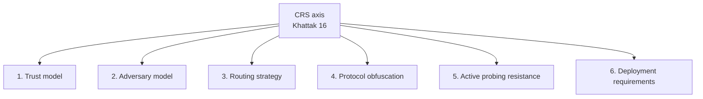
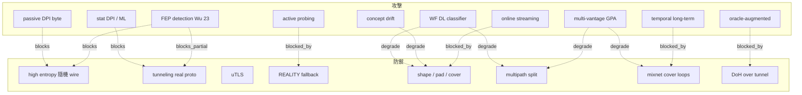

# 課堂 10.10 — SoK 精讀：Khattak et al. 與 Tschantz et al. 的 censorship resistance 系統化

## 學前知道
- 前置課：10.1–10.9（完整背景）
- 預計閱讀時間：60–80 分鐘
- 必讀論文：
  - **Khattak, Elahi, Simon, Swanson, Murdoch, Goldberg (2016)**, *SoK: Making Sense of Censorship Resistance Systems*, PoPETs（**已有 precis: `khattak-sok-resistance.md`**）
  - **Tschantz, Afroz, Anonymous, Paxson (2016)**, *SoK: Towards Grounding Censorship Circumvention in Empiricism*, IEEE S&P（**已有 precis: `tschantz-sok-circumvention.md`**）
  - Wang & Goldberg (2016), *On Realistically Attacking Tor with Website Fingerprinting*, IEEE S&P
  - Juarez, Afroz, Acar, Diaz, Greenstadt (2014), *A Critical Evaluation of Website Fingerprinting Attacks*, CCS
  - Pulls, Dahlberg (2020), *Website Fingerprinting with Website Oracles*, PoPETs — 新型 attack model
  - Cherubin, Jansen, Troncoso (2022), *Online Website Fingerprinting: Evaluating Website Fingerprinting Attacks on Tor in the Real World*, USENIX Security
  - Wails et al. (2024), *Measuring Anti-Censorship Tool Effectiveness with Real Users*, PoPETs
- 必讀原始碼：略

## 動機

本堂是 Part 10 的 **「全景視角」**——把前 9 堂的攻防整理成 Khattak 16 + Tschantz 16 兩篇 SoK 的框架。**這兩篇是申請 PhD program / 投 USENIX Sec / NDSS 必 cite 的「圈內默契」**。讀完它們，整個 censorship resistance 領域的座標系建立。

對 G6：

1. 用 Khattak 16 的 6-axis taxonomy 把 G6 設計座標清楚定位。
2. 用 Tschantz 16 的 **empiricism mandate** 規劃 G6 evaluation methodology。
3. 用 Pulls 20 / Cherubin 22 的「現實 attack」結果調整 G6 threat model。

## 核心概念

### 一、Khattak 16 SoK 結構

Khattak 等人把 censorship resistance system 沿 **6 軸** 分類：

#### Axis 1: Trust model

- Single-party trusted (簡單 proxy)
- Distributed trust (Tor 三 hop)
- Threshold trust (mix-net)
- Verifiable / accountable (zero-knowledge proofs in some designs)

G6 規劃：distributed trust（多 bridge fallback）。

#### Axis 2: Adversary model

詳細到 Khattak 用：

- Censor capabilities (passive, active, multi-vantage, ML-enabled)
- Information available to censor (whitelist? blacklist? AI-trained model?)
- Adversary resources (CDN policy influence, BGP route influence)
- Time horizon (one-shot vs long-term)

G6 預設：state-level adversary, multi-vantage, ML, long-term, can pressure CDN（部分）。

#### Axis 3: Routing strategy

- Single-proxy (Shadowsocks, Trojan)
- Onion routing (Tor)
- Decoy routing (Conjure, TapDance)
- Multi-path (TrafficSliver, Multipath QUIC)

G6 規劃：single-bridge default + optional MPQUIC multipath。

#### Axis 4: Protocol obfuscation

- Random-look (obfs4)
- Mimicry (FTE, Marionette)
- Tunneling / real-protocol (meek, REALITY, MASQUE)
- Steganography (DNS tunneling, image hosting)

G6 規劃：tunneling 經由 H3/MASQUE。

#### Axis 5: Active probing resistance

- None
- Shared secret + silence (obfs4)
- Fallback to real (REALITY)
- Decoy IP not associated (Conjure)

G6 規劃：REALITY-style fallback。

#### Axis 6: Deployment requirements

- Self-hosted (VPS only)
- CDN-dependent (meek)
- ISP-dependent (Conjure, TapDance)
- Volunteer pool (Snowflake)

G6 規劃：self-hosted VPS default + optional CDN-dependent fallback。

### 二、Khattak 16 的「現有系統 score table」（簡化版）

| System | Trust | Adversary level | Routing | Obfuscation | Probing res. | Deployment |
|---|---|---|---|---|---|---|
| Tor + obfs4 | distributed | state-level | onion | random | shared-secret | self-host |
| meek | central-CDN | state-level | onion | tunneling | CDN | CDN |
| Snowflake | volunteer | state-level | onion | tunneling | n/a (NAT) | broker+volunteer |
| Shadowsocks | single | passive DPI | direct | random | none | self-host |
| Trojan | single | DPI | direct | tunneling | TLS fallback | self-host |
| V2Ray VMess | single | DPI | direct | random | none | self-host |
| VLESS+REALITY | single | state-level | direct | tunneling | REALITY fallback | self-host |
| Hysteria2 | single | state-level | direct | random+QUIC | partial | self-host |
| **G6 計畫** | distributed-optional | state-level | direct + opt. MP | tunneling H3 | REALITY-style | self-host + opt. CDN |

### 三、Tschantz 16 的方法論 mandate

Tschantz et al. IEEE S&P 16 對 CRS 領域的 **方法論批判**：

#### Tschantz 的指控

1. **多數 CRS 論文未誠實 evaluation against real censors.** 用合成 dataset，假設 toy adversary。
2. **「Threat model 含混」**：每篇論文用自己定義的 censor。
3. **「沒有對抗對手研究」**：論文常 evaluate 自身設計，鮮少 systematically 評對手 capabilities。

#### Tschantz 的 4 個 mandate

1. **Empirical evaluation against real censors.** 不能只 simulate。
2. **Define adversary precisely.** Capability matrix。
3. **Compare with existing systems.** 不能孤立 evaluate。
4. **Report deployment data.** 真實使用者 reach / usage / time-to-block。

對 G6：**Part 12 的 evaluation 必須符合這 4 條**。否則 reviewer (especially Tschantz / Houmansadr camp) 直接 reject。

### 四、Wang–Goldberg 16 IEEE S&P：「真實 Tor user」 WF

#### 設計

之前 WF eval 都假設「user 連續 visit 100 個 monitored sites」。Wang–Goldberg 用真實 Tor user 行為（mouse / scroll / multi-tab）：

- **Multi-tab attack**: user 同時開多 page，trace boundary 模糊。
- **Concept drift**: 訓練 vs 測試間隔 3+ 月。
- **Outliers**: 真實 user 有 「奇怪」 訪問 pattern。

#### 結果

- 之前 95% accuracy 的 attack → 在真實 user 上 ~60–70%。
- **「WF threat in practice is overestimated」**。

#### 對 G6 的啟示

- 不要被「論文 99% accuracy」嚇到——真實環境下大幅 degrade。
- 但**真實環境 60–70% 還是太高**——足夠 GFW 「flag 後人工 review」。
- G6 設計 still 需 robust 防護。

### 五、Pulls–Dahlberg 20 PoPETs："Website Fingerprinting with Website Oracles"

#### 新攻擊 model

對手不再只看 trace——同時 query **「website oracle」** （public service 告訴對手某網站是否在某時間被 visit）。

- **Oracle 來源**: DNS resolver logs（如 public DNS）、CDN logs、CT (Certificate Transparency) logs。
- 對手用 trace 縮小候選 set，再用 oracle 確認。

#### 結果

- Trace accuracy 70% + oracle → 99%+ confirmed。
- **WF threat 又被 boost up**。

#### 對 G6 的啟示

- **G6 應 anticipate oracle-attacker**——避免讓 client 直接 DNS-resolve target site。
- Use **DoH over G6 tunnel** for inner-app DNS。
- 避免使用 public DNS。

### 六、Cherubin–Jansen–Troncoso 22 USENIX Sec："Online WF"

#### 設定

把 WF eval 改為 「online / streaming」 模式：

- Attacker 即時收到 packets，每 N packet 重新分類。
- 與 「offline complete trace」 對比。

#### 結果

- Online attack 在 「receiving 第一個 burst」 時可達 60% accuracy。
- 「page load 結束時」 90%。
- **意味著「等 page 完全加載再分類」不是 attacker 必需**——對手能 streaming 攻擊。

#### 對 G6 的啟示

- G6 的 defense **必須從 first packet 就 active**——不能依賴 「整個 trace 結束才 shape」。
- 對應 Part 10.5 RegulaTor / FRONT 設計——它們 from-start 就 inject pattern。

### 七、Wails 24 PoPETs：實際 user 測

Wails et al. 在 OONI / volunteer 網路上跑大規模 deployment-data 測量：

- 各 PT 在實際中國網路下的 reachability。
- Time-to-block per PT。
- Latency / throughput 真實統計。

#### 結論摘要

- **obfs4 in China**: < 50% reachability in 2024（受 FEP detection 嚴重影響）。
- **meek**: ~60%（CDN policy 依賴）。
- **Snowflake**: ~70%（變動大）。
- **VLESS+REALITY**: ~85%（自部署，比 Tor 派靠近）。
- **Hysteria2**: ~80%。

對 G6：reachability target 應 ≥ 85% (VLESS+REALITY baseline) 或更高。

### 八、把所有 attack 與 defense 放回 Khattak 6 軸

### 九、G6 在 Khattak 6 軸的座標

| Axis | Value | rationale |
|---|---|---|
| Trust model | distributed-optional | client-bridge 1 hop default; multi-bridge fallback |
| Adversary model | state-level multi-vantage ML | GFW 為 baseline |
| Routing | direct + opt. MPQUIC | low latency; opt. split for stronger threats |
| Obfuscation | tunneling H3 + uTLS Chrome | regularization-driven |
| Active probing | REALITY-style fallback | unauth → real CDN proxy |
| Deployment | self-host VPS + opt. CDN | flexible deployment |

### 十、Tschantz mandate → G6 evaluation plan

| Mandate | G6 plan |
|---|---|
| Empirical against real censor | OONI integration, GFW probe testing from VPS pair (CN-inside + CN-outside) |
| Define adversary precisely | 5-axis adversary spec in Part 11.1 |
| Compare with existing | head-to-head vs obfs4/meek/Snowflake/VLESS+REALITY/Hysteria2 |
| Report deployment data | OONI public dataset + own measurement studies |

## 與我們協議設計的關聯

1. **Khattak 6 軸 = G6 spec sheet 欄位**。Part 11 寫 spec 時直接套這 6 軸。
2. **Tschantz mandate = G6 paper evaluation methodology**。Part 12.20 完整實施。
3. **Pulls 20 oracle attack = G6 必須處理 DNS**：DoH-over-tunnel + cache 機制。
4. **Cherubin 22 online attack = G6 defense from-first-packet**：對應 RegulaTor / FRONT 設計。
5. **Wails 24 baseline = G6 reachability target**：>= 85%。

## 動手（可選）

### 實驗 A：閱讀 Khattak 16 全文，把表中所有 system 標 6 軸值

預期：1 小時。**完成後對 PT 領域有完整地圖。**

### 實驗 B：跑 Pulls 20 oracle attack reproducer

論文有 supplementary code（Github）。在 your Tor traces 上 augment with DNS oracle data—看 acc 是否大幅上升。

### 實驗 C：實作簡單 online WF classifier

`stream_classifier(packets, threshold)`: 每收 50 packets 重訓 model，輸出 current best guess。
測你的真實 Tor browsing trace。觀察 「何時開始確定」。

## 自我檢查

1. Khattak 6 軸中，哪兩個 對 G6 是「最 contentious」（即不同選擇 trade-off 巨大）？
2. Tschantz 4 mandate 中，哪一個是 G6 最難達到？為什麼？
3. Pulls 20 的 oracle attack 對 G6 設計 implications 哪三條？
4. Online WF (Cherubin 22) 為什麼 implies defense from first packet 必要？streaming attack 在哪一個 milestone 開始有 60% accuracy？
5. Wails 24 的 deployment metric 包含 reachability 與 time-to-block——這兩個 metric 之間 trade-off 是？

## 延伸閱讀

- Diffie-Hellman Tor PT v2 spec
- IETF MASQUE WG → CONNECT-UDP RFC 9298 / CONNECT-IP draft

---

## 研究級補遺

### 1. 學界詞彙

- **CRS**: Censorship Resistance System
- **SoK**: Systematization of Knowledge (academic paper genre)
- **Pluggable Transport (PT)**: Tor 的 obfuscation layer
- **Reachability**: 真實 user 在受審查網路下能連到的比例
- **Time-to-block (TTB)**: PT 部署後到被 censor block 的時間
- **Oracle attack** (Pulls 20): augment trace with external data source
- **Online vs offline WF** (Cherubin 22): streaming vs full-trace

### 2. 對手分類學

完整版（綜合 Khattak / Tschantz 兩者）：

- **Capability**: passive / active / both
- **Knowledge**: blacklist / whitelist / ML model / oracle access
- **Vantage**: single / multi / global
- **Resources**: bandwidth / compute / CDN influence / BGP influence
- **Time**: one-shot / repeated / long-term
- **Adaptation**: static / adaptive / strategic
- **Goal**: identify / link / disrupt / suppress

### 3. 形式化定義

**CRS 性質 (Khattak 16 sec III)**：

> Available: 真實 user 能 connect
> Unobservable: censor 無法 detect CRS 使用
> Unblockable: censor 無法 stop CRS use without high collateral

G6 的 design 目標：optimize all three.

### 4. 領域的關鍵論文

- Khattak16 / Tschantz16 (SoK)
- Wang-Goldberg16 (real Tor)
- Juarez14 (CCS critical eval)
- Pulls20 (oracle)
- Cherubin22 (online WF)
- Wails24 (deployment data)
- Mathews 24 (PETS, new SoK)
- 加 Karunanayake et al. 21 (S&P PT survey)

### 5. 我們協議的座標

| Khattak axis | G6 value | rationale |
|---|---|---|
| Trust | distributed-optional | minimal trust for default; multi-bridge for highest assurance |
| Adversary | state ML multi-vantage | most challenging current threat |
| Routing | direct + opt MP | latency primary; MP optional |
| Obfuscation | tunneling H3 uTLS | regularization |
| Probing res. | REALITY fallback | proven approach |
| Deployment | self-host opt CDN | flexibility |

### 6. 必追資源

- OONI Explorer (explorer.ooni.org)
- censoredplanet.org
- gfw.report
- Tor 安全 board: research.torproject.org/safetyboard

### 7. 開放問題

1. **Unified threat model spec language**：能否設計一個 DSL describing CRS adversary，自動 generate evaluation suite？目前都 manual。
2. **Real-world reachability prediction**：能否從 protocol design predict reachability under GFW？沒人成功。
3. **Time-to-block 最佳化**：哪些 design choice 延長 TTB？實證研究稀少。
4. **CRS economics**: cost to censor vs cost to circumventer 的 game-theoretic analysis 缺。
5. **Multi-CRS interoperability**: 多個 CRS 同時 run（user 自動切換）— architecture & UX 未深入。
