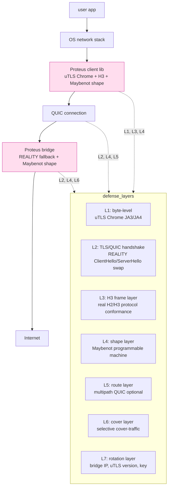

# 課堂 10.11 — 我們協議的反制設計：威脅 → 防禦對應表

## 學前知道
- 前置課：Part 9（GFW 完整研究 — 雖未寫，本堂引用其結論）、10.1–10.10
- 預計閱讀時間：60–80 分鐘
- 必讀論文：見 10.1–10.10 引用之合集，再加：
  - Frolov, Wustrow (2020), *Detecting Probe-resistant Proxies*, NDSS
  - GFW.report 2023+ FEP posts
  - Wu et al. 23 USENIX Sec FEP detection（已有 precis）
- 必讀原始碼：略

## 動機

10.10 給出全景。本堂把所有 attack 與 defense **配對成 matrix**——對每個 known threat，列 Proteus 用什麼 mechanism 應對、什麼層級覆蓋、什麼 residual risk。

這份 matrix **直接成為 Part 11.1 的 threat model 與 11.2 的 spec rationale 的草稿**。**它必須被 audited 過——任何空格意味著 Proteus 在該 threat 上 vulnerability。**

## 核心概念

### 一、Threat 分類（從 GFW 觀察 + 學界研究）

```mermaid
flowchart TD
    A[GFW + state-level adv] --> B[Wire / byte level]
    A --> C[Connection / lifetime]
    A --> D[Behavioral / probing]
    A --> E[Statistical / ML]
    A --> F[Inter-flow correlation]
    A --> G[Long-term / oracle]
    
    B --> B1[Entropy / printable ratio]
    B --> B2[Protocol header peculiarity]
    B --> B3[Cipher suite / TLS fingerprint]
    
    C --> C1[Connection lifetime]
    C --> C2[Idle gap]
    C --> C3[Failed RST behavior]
    
    D --> D1[Active prober]
    D --> D2[Connection reuse]
    D --> D3[Adaptive prober]
    
    E --> E1[WF DL classifier]
    E --> E2[FEP rules]
    E --> E3[Packet-size ML]
    
    F --> F1[DeepCorr flow-corr]
    F --> F2[Watermarking]
    
    G --> G1[Oracle DNS]
    G --> G2[Tempest daily]
    G --> G3[BGP influence]
    
    classDef ours fill:#fde,stroke:#c39
```



### 二、Wire / byte-level threats

| Threat | 攻擊細節 | Proteus mechanism | Residual risk |
|---|---|---|---|
| Entropy detection (Wu 23) | 首 6 packets 高 entropy + 低 printable ratio | wire 完全是 H2 frames (real header + framing) | 內部 payload 仍 encrypted (high entropy); H2 frame 開頭已 sufficient mask |
| TLS ClientHello fingerprint (JA3/JA4) | 唯一可識別之 client | **uTLS Chrome current version (auto-sync)** | uTLS 與 Chrome 之版本落後即被識別 |
| TLS extension order | Chrome 有特定 extension order | uTLS-Chrome 已照辦 | 同上 |
| GREASE values | Chrome 用 GREASE，wire 看得到 | uTLS includes GREASE | – |
| TLS record size pattern | 特定大小序列 | H2 record 切分為固定大小 (max ~ MTU) | TLS-in-TLS detection vulnerable; Proteus 不 nest TLS |
| SNI string | 直接明碼 | **uTLS + REALITY**: SNI = some-real-cdn-host | 若 SNI 被 GFW 直接 blocklist，需 fallback domain pool |
| Cipher suite preference | Chrome 有固定 cipher list | uTLS-Chrome 同 | – |
| Heartbeat / keepalive | TLS keepalive 模式 | H3 PING frame, Chrome-like cadence | – |

### 三、Connection / lifetime threats

| Threat | 攻擊細節 | Proteus mechanism | Residual risk |
|---|---|---|---|
| Long-lived connection | TCP/QUIC 連線過久 | session timeout + reconnect every ~3min 與 Chrome H2 idle close 對齊 | 長 streaming session 仍超出 web baseline |
| Idle connection ratio | 長 idle 但保持 connect | timeout idle > 30s; close gracefully | idle 短時間 cover-traffic 維持 |
| Packet count anomaly | 過多 small packet 或過少 | shape per-window rate to web baseline | – |
| Connection reuse pattern | 反覆連同 IP | bridge IP rotation (multi-IP per VPS) | bridge IP pool 增加 deploy 成本 |
| TCP RST handling | abnormal RST acceptance | mimic real H3 (UDP-only); no TCP RST attack surface | – |

### 四、Behavioral / probing threats

| Threat | 攻擊細節 | Proteus mechanism | Residual risk |
|---|---|---|---|
| Active probing (random) | GFW connect to bridge, send random data | bridge silent OR fallback | – |
| Active probing (TLS) | Probe with valid TLS handshake | **REALITY-style**: relay to real CDN, return real cert | If REALITY target down, fail gracefully |
| Connection reuse probing | repeated connects observe behavior | REALITY consistent fallback | – |
| Adaptive probing | probe based on past behavior | per-probe consistent response | – |
| Half-open probe (Frolov 20) | SYN+ACK alone | bridge UDP-only; TCP not used | – |

### 五、Statistical / ML threats

| Threat | 攻擊細節 | Proteus mechanism | Residual risk |
|---|---|---|---|
| FEP detection rules (Wu 23) | first packets entropy + printable + protocol | H2/H3 frame wire ensures protocol-conformant | – |
| WF DL classifier (DF/Tik-Tok) | learned classifier on direction+timing | Surakav-style decoy + RegulaTor envelope + Maybenot | accuracy 隨 attacker compute 增加; Proteus 必須 publish own eval |
| Packet-size distribution | uneven distribution | regularization to H3 frame size dist | – |
| Inter-arrival time anomaly | non-natural IAT | Chrome-like H2 IAT shaping | – |
| Burst pattern | burst structure idiosyncratic | sequence-level shaping (Maybenot) | – |
| Concept drift exploit (Wang 16) | model retrains | Proteus protocol versioning encourages defender retraining; client rotates uTLS profile periodically | – |

### 六、Inter-flow / correlation threats

| Threat | 攻擊細節 | Proteus mechanism | Residual risk |
|---|---|---|---|
| DeepCorr flow correlation (Nasr 18) | 跨 hop 流量對應 | timing jitter (±25ms) + per-burst random padding | Proteus latency overhead +10–25ms |
| Watermarking attack | active inject pattern | random rate-jitter in client | – |
| Co-occurrence multi-flow (Holland 21) | 同時 multiple flows pattern | Proteus multipath disperses | – |
| Cross-protocol fingerprint | Proteus client signature in non-Proteus 流量 | Proteus client only routes Proteus traffic over tunnel | rest of host network traffic 是 user 責任 |

### 七、Long-term / oracle threats

| Threat | 攻擊細節 | Proteus mechanism | Residual risk |
|---|---|---|---|
| Oracle DNS (Pulls 20) | 對手用 DNS log confirm 訪問 | DoH inside Proteus tunnel | system DNS leak 仍可能（OS level 保護） |
| CT log oracle | 對手用 CT 看 client cert | Proteus client 不 issue per-session cert | – |
| Tempest temporal (Wails 18) | daily/weekly user pattern | cover-traffic + connection rotation | low-cost user behavior protection 需 application 配合 |
| BGP route influence | 對手影響 routing | multi-bridge geographic fallback | global infra issue, beyond Proteus spec |
| User cookie / login link | inner app login | Proteus 不負責 application-layer privacy | scope-out, document in threat model |

### 八、Proteus layered defense architecture



### 九、Threat coverage 校驗 checklist

每個 component 必須能 trace 到至少一個 threat：

```
[uTLS Chrome] → JA3/JA4, TLS extension order, cipher list
[REALITY] → active probing, SNI blocklist (fallback), TLS cert chain
[H3 frame conformance] → FEP, protocol-conformance DPI
[Maybenot] → WF DL, burst pattern, IAT shaping
[MPQUIC opt] → flow correlation, multi-vantage
[Selective cover] → long-term capacity, DeepCorr remnants
[Bridge IP rotation] → connection-reuse probing
[DoH inside tunnel] → oracle DNS
[Session timeout] → long-lived connection anomaly
[uTLS version sync] → concept drift, Chrome version evolution
```

### 十、Residual threats (Proteus 不主張保護)

明確 **scope out**：

1. **Inner application traffic analysis** (Bahramali 20 messaging WF)：Proteus 不 protect 「user 跑哪個 app」。是 application responsibility。
2. **User behavioral pattern (Tempest)**：daily activity pattern leakage 需 application 配合。
3. **Endpoint compromise**: client / bridge 被 malware 攻擊。
4. **OS-level DNS leak**: 若 OS bypass Proteus DNS routing。
5. **Side-channel from local network (LAN sniffing)**: 假設 user 端網路安全。
6. **Physical layer attack** (cable tap)：超出 protocol scope。

**Part 11.1 threat model 必須明確列這 6 條 scope-out。**

### 十一、Defense overlap & redundancy 分析

設計原則：**多層 defense overlap 為佳——single layer 失效時其他仍 functional。**

| Threat | Primary defense | Secondary | Tertiary |
|---|---|---|---|
| Entropy detection | H3 frame conformance | Maybenot shape | uTLS JA3 (顯示 是 TLS not raw) |
| Active probing | REALITY fallback | bridge IP rotation | reseatured shared key |
| WF DL | Maybenot + selective decoy | MPQUIC opt | uTLS Chrome current |
| Flow correlation | timing jitter | MPQUIC | session rotation |
| Concept drift | Maybenot rotation | uTLS rotation | Proteus version bump |

### 十二、Quantitative leakage report (Part 12 evaluation 必交)

Proteus 在 evaluation 階段 produces：

| Metric | Target | Measurement |
|---|---|---|
| WF DF accuracy on Proteus | < 20% | 1000 sites closed, 100k unmonitored open, 30-day drift |
| Tik-Tok accuracy | < 25% | 同上 |
| Surakav-aware | < 30% | with retrained adversary |
| FEP detection FPR (against Proteus) | < 1% | replicate Wu 23 rule set |
| Active-prober detection rate | < 0.1% (proxy detection) | run obfs-probe-detect tool |
| DeepCorr correlation accuracy | < 50% | with timing jitter ±25ms |
| Reachability in CN (OONI) | ≥ 85% | OONI integration |
| TTB after deployment | ≥ 90 days | longitudinal study |

### 十三、Backward compatibility / migration

Proteus 不是替代 VLESS+REALITY / Hysteria2，而是 **next-step**：
- Proteus server 應能同 host 上 fallback to VLESS+REALITY (port 不同)。
- Proteus client 自動 try Proteus, then VLESS, then Hysteria2 fallback。
- Common shared API for app integration。

**對部署 friction 是 Proteus 採用率關鍵**。

## 與我們協議設計的關聯

本堂內容直接 → Part 11.1 threat model & Part 11.2 design rationale。**Part 11 不需重新發明這份 matrix，直接 import 並擴充。**

## 動手（可選）

### 實驗 A：把 matrix 跑 dry-run 對 VLESS+REALITY

填同樣 matrix 對 VLESS+REALITY 看哪些 cell 是空的（vulnerable）—得到 Proteus 在哪些 threat 上能超 VLESS+REALITY。

### 實驗 B：寫 threat-coverage linter

Python script 讀 Proteus spec (yaml)，自動 detect 哪些 threat 沒被 mapping 到 mechanism。**這是 ongoing 設計工具，Part 11 寫 spec 時不斷跑。**

### 實驗 C：reachability self-test

部署 Proteus prototype，從 5 個不同地理位置 probe（用 VPN proxy 模擬不同 ASN），測 connection success rate / latency。

## 自我檢查

1. 對 FEP entropy detection，Proteus 用什麼機制？為什麼 internal payload 仍 high entropy 不違反？
2. 如何避免 TLS-in-TLS detection？Proteus 設計 implications？
3. REALITY 如果 target CDN down，fallback 怎麼處理？bridge 在 degraded mode 下還能保證 indistinguishability 嗎？
4. concept drift attack 對 Proteus 是什麼樣的 threat？Proteus 哪三個 layer 主動 mitigate？
5. Inner app traffic analysis 為什麼 scope-out？這個界線合理嗎？

## 延伸閱讀

- VLESS+REALITY spec & repo
- Hysteria2 spec
- MASQUE CONNECT-UDP RFC 9298
- IETF draft-ietf-tls-esni-17

---

## 研究級補遺

### 1. 學界詞彙

無新術語——本堂是 integration & reference。

### 2. 對手分類學

完整列出在 10.10. Proteus 預設 adversary：

> State-level, multi-vantage, ML-equipped, repeated-visit, has CDN influence (partial), has BGP influence (limited), can issue advisories to ISPs, can pressure CDNs partially.

### 3. 形式化定義

**Threat coverage**：

> Proteus spec $\Sigma$ covers threat $T$ if exists mechanism $m \in \Sigma$ such that $T$ is mitigated to acceptable residual risk per quantitative target.

**Defense in depth**：

> Each threat $T$ should have ≥ 2 independent mechanisms in $\Sigma$.

### 4. 領域的關鍵論文

10.10 全集，加：
- Frolov 20 NDSS (probe-resistant proxy detection)
- Wails 24 PoPETs (deployment)
- Sherry et al. (BlindBox / DPI literature) — 反面 reading

### 5. 我們協議的座標

本堂自身就是座標 — Proteus 防禦座標表。

### 6. 必追資源

OONI / Censored Planet / GFW.report — 真實 deployment data。

### 7. 開放問題

1. **Threat enumeration completeness**：本堂列的 threat 完整嗎？尤其對 emerging adversary（如 ML-augmented multi-vantage）。
2. **Quantitative leakage report 標準化**：怎麼讓 Proteus 的 leakage report comparable to 其他 protocol？需要 community standardization。
3. **Threat / mechanism 1-to-many mapping 自動驗證**：static analysis 能否從 spec 推 coverage？目前 manual。
4. **「Cost-to-censor」量化**：每個 Proteus mechanism 對 censor 的 cost 多少？沒人量化。
5. **「Strategy proof」**：如果 censor 改變策略（如改用 ML 替代 rule-based）Proteus 自動 adapt 嗎？暫無。
