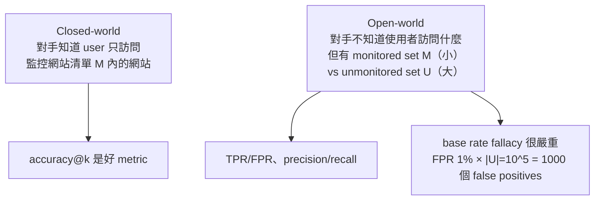
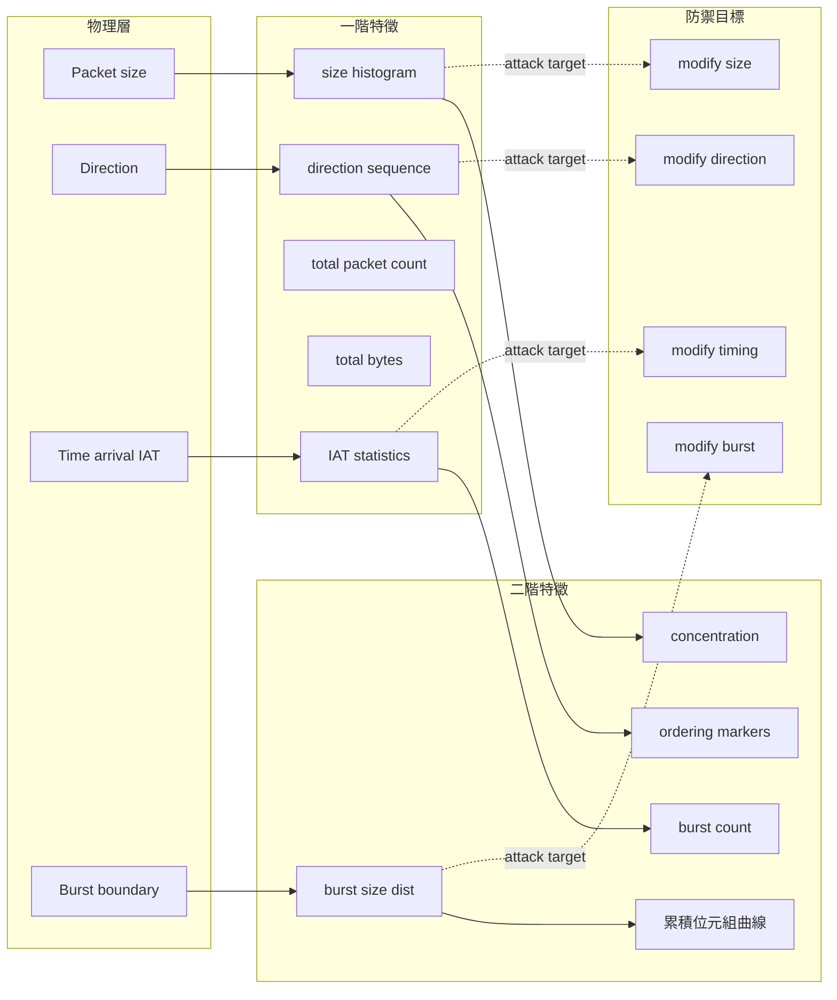

# 課堂 10.2 — 經典統計指紋：從 Hintz 2002 到 k-NN / CUMUL / k-FP

## 學前知道
- 前置課：10.1（資訊理論基礎）、Part 1.8–1.12（TCP/UDP packet 結構）、Part 4 全
- 預計閱讀時間：50–70 分鐘
- 必讀論文：
  - Hintz (2002), *Fingerprinting Websites Using Traffic Analysis*, PET Workshop
  - Liberatore & Levine (2006), *Inferring the Source of Encrypted HTTP Connections*, CCS
  - Herrmann, Wendolsky, Federrath (2009), *Website Fingerprinting: Attacking Popular Privacy Enhancing Technologies with the Multinomial Naïve-Bayes Classifier*, CCSW
  - Panchenko, Niessen, Zinnen, Engel (2011), *Website Fingerprinting in Onion Routing Based Anonymization Networks*, WPES
  - Cai, Zhang, Joshi, Johnson (2012), *Touching from a Distance: Website Fingerprinting Attacks and Defenses*, CCS
  - Wang & Goldberg (2013), *Improved Website Fingerprinting on Tor*, WPES
  - Wang, Cai, Nithyanand, Johnson, Goldberg (2014), *Effective Attacks and Provable Defenses for Website Fingerprinting*, USENIX Security
  - Panchenko, Lanze, Pennekamp, Engel, Zinnen, Henze, Wehrle (2016), *Website Fingerprinting at Internet Scale*, NDSS（CUMUL）
  - Hayes & Danezis (2016), *k-fingerprinting: A Robust Scalable Website Fingerprinting Technique*, USENIX Security（k-FP）
- 必讀原始碼：
  - https://github.com/kpdyer/website-fingerprinting（Wang 14 data + features）
  - https://github.com/jhayes14/k-FP（k-FP reference impl）

## 動機

10.1 給了「為什麼會洩漏」的數學框架。本堂要回答：**「具體洩漏什麼？對手怎麼提？」**

WF 攻擊在 2002–2016 這 14 年從 0% → 90%+ 的成功率。每一篇代表論文都是「新 feature + 新 classifier」的組合：

- Hintz 2002：packet size histogram + Naïve Bayes，五個網站。
- Liberatore–Levine 2006：packet size 序列 + multinomial NB，~3000 網站 closed-world 約 75%。
- Herrmann 2009：應用到 Tor，accuracy 大幅下降（~3%）→ 證明 Tor cell-padding 在當時是有效防禦。
- Panchenko 2011：手工 feature 集 + SVM，把 Tor closed-world 拉回 55%。
- Cai 2012：edit distance kernel SVM，70%+，並第一次系統性討論 defense。
- Wang 2013/2014：cell-level features + k-NN，**首次把 closed-world acc 拉破 90%**。
- Panchenko 2016 NDSS（CUMUL）：累積統計 feature，~10⁶ Tor 流量，open-world 維持 acc。
- Hayes–Danezis 2016 USENIX Sec（k-FP）：random forest + feature importance scoring，把 k-NN 拉到 95%+。

**為什麼要逐一精讀？** 因為每一篇都揭示了一個「物理層面的洩漏管道」，理解這些洩漏管道是設計防禦的前提。**Proteus 設計表的每一列 = 一篇論文揭示的洩漏管道。**

## 核心概念

### 一、Threat model：closed-world vs open-world



**Juarez et al. 2014 CCS** "A Critical Evaluation of WF Attacks" 強烈質疑 closed-world 結果——指出真實 user 是 open-world，95% closed-world acc 在 open-world 下實際可能很差。**Part 10.3** 詳論。

### 二、Cell vs packet：Tor 的特殊結構

Tor 把 TCP 字節流切成固定大小的 **cell**（512 bytes），加密後在 TLS 上傳輸。**WF 攻擊者觀察到的是 TLS record，但能從 record size 反推 cell 數量。** 從 Wang 2013 開始，所有 Tor WF 攻擊都用 cell sequence 作為原始 representation：

```
trace = [(direction, count), (direction, count), ...]
e.g.   [(+, 3), (-, 12), (+, 1), (-, 8), ...]
```

`+` = client→server, `-` = server→client。**一個 trace 就是 cells 的有向序列**。

對 non-Tor（如 OpenSSL TLS、QUIC）攻擊：直接用 TLS record sizes 或 QUIC packet sizes，sequence 結構相同。**這個 abstraction 在過去十年沒換過——所有 feature engineering 都在這個序列上做。**

### 三、Hintz 2002：起點

| 步驟 | 動作 |
|---|---|
| Data | 5 個 https sites，每個 100 次訪問 |
| Feature | 每個訪問用 packet size histogram（25 buckets） |
| Classifier | Naïve Bayes |
| Accuracy | ~50–60% |

**洞見**：「即使加密，packet size 也洩漏」。但 5 sites 太小，當時學界沒人重視。

### 四、Liberatore–Levine 2006 CCS

把規模拉到 1000–2000 個 site：

- Feature：`{packet size at position i in trace}`——每個 trace 投影成 size sequence。
- Classifier：Multinomial Naïve Bayes / Jaccard coefficient。
- Accuracy：closed-world ~75%。

**洞見之一**：HTTP/1.1 keep-alive 影響很大——它讓資源在同一 TCP 連線複用，trace 變短但更可預測。

**洞見之二**：用普通 SSH/VPN 並沒擋住 WF——VPN 不改 packet size 與順序。

### 五、Herrmann 2009 CCSW：Tor 的 padding 暫時奏效

把 Liberatore–Levine 套到 Tor。Tor 把所有東西切到 512 byte cells——packet size 變成幾乎常數。結果：**accuracy 從 75% 掉到 ~3%**。當時樂觀地認為「Tor 的 cell padding 解決了 WF」。

**但這是錯的**。Tor 的 cell 雖然定長，cell **數量** 與 **順序** 並沒變。Panchenko 2011 用更聰明的 feature 把這個假象打破。

### 六、Panchenko 2011 WPES：手工 feature 拿回 Tor

設計了一組「人類能看出的特徵」：

- Total transmitted bytes (each direction)
- Number of packets each direction
- Packet ordering (HTML response is usually first big burst)
- Size markers: position of each "big" packet
- HTML markers: occurrence patterns
- Number of incoming/outgoing packets in fixed-size windows

加 SVM (RBF kernel)：closed-world accuracy ~55%（從 3% 起）。**證明「定長 cell」不夠——sequence 結構自身洩漏巨量資訊。**

### 七、Cai 2012 CCS：edit distance kernel 與第一個系統 defense

Cai et al. 想直接比較兩個 trace 像不像——用 **edit distance**（Damerau–Levenshtein）的 string kernel SVM。把 trace 看成 cells 的 string（每個 cell 是一個 alphabet 字母，標 direction），算 string kernel。

- Accuracy：在 800 sites closed-world ~70%。
- **更重要**：本文同時提出 BuFLO defense（buffered fixed-length obfuscation）：constant-rate channel + total time padding。**首次把 WF 攻防做成「攻擊 + 防禦」對子論文範式。**

### 八、Wang & Goldberg 2013 / 2014：k-NN 革命

#### 2013 WPES 版

Wang–Goldberg 改寫 Tor 的 instrumentation——直接在 Tor client 抓 cell sequence 而非 TLS record，得到「ground-truth cell trace」。發現原來的 features 充滿噪聲；用乾淨 trace 後簡單 k-NN（k=1, weighted）就達 80%+。

#### 2014 USENIX Security 版

升級到 **feature scaling weighted k-NN**：

- Feature vector（>3000 dims）：含 packet ordering 數值、burst 統計、累積位元組、子序列 markers。
- Distance：weighted L1，weight 由 RFE (recursive feature elimination) 預先學出。
- **Accuracy: 91% closed-world, 100 sites**——超越所有當時 baseline。

**還引入了 provable defense 概念**：證明在 fixed-cells-per-burst defense 下，attacker accuracy 有理論上限（雖然 bound 很鬆）。**這是 WF 領域第一次出現 "provable"。Part 10.12 會回頭談這個 proof。**

### 九、Panchenko 2016 NDSS：CUMUL

Wang 2014 漂亮但 features 太多（3000+），對 large dataset 訓不起來。Panchenko 16 用 **cumulative trace representation**：

- 把 trace `[+1, -1, +1, -1, ...]` 轉成累積和序列；
- 對累積和重新採樣到固定長度 100；
- 100 維 feature vector，丟 SVM。

簡單、scalable——能跑 **100,000 sites** 的 open-world，TPR ~93% / FPR 0.4%。**規模上的突破。**

### 十、Hayes & Danezis 2016 USENIX Sec：k-FP

#### Feature 工程
175 manually-designed features，分組：
- Packet count features (number incoming/outgoing/total)
- Time-based features (transmission time, average IAT)
- Concentration / 局部統計（前 30/60/...% 的 in/out packet 比例）
- Size-based features
- Bursts features
- 「Alternative concentration」(packet 在 trace 不同位置的分布)

#### Classifier：random forest with hamming-distance k-NN

訓練 RF → leaf 編碼 → 用 leaf 編碼做 Hamming distance k-NN。
- 為什麼這個雙層架構？RF leaf 編碼是 supervised representation，k-NN 在這個 space 比歐氏更敏感於 site 邊界。
- Accuracy：closed-world 95%+，open-world TPR 88% / FPR 0.5%。

**重要副產品：feature importance ranking**——告訴防禦端「最該打的是哪些特徵」。Part 10.5 設計 defense 時直接用這個 ranking 來挑要打哪些 channel。

### 十一、把這些 feature 整理成「洩漏管道清單」



### 十二、closed-world 數字的「不誠實」之處

| 論文 | closed-world acc | 真實 open-world TPR/FPR | 數字落差原因 |
|---|---|---|---|
| Wang 14 | 91% | 在 5000 unmonitored 下 TPR~85%/FPR~2% | 訓練集 / 測試集很「乾淨」 |
| Panchenko 16 | 92% | 9×10⁴ open-world FPR~0.4% | 大數據集 + cumulative feature 比較魯棒 |
| Hayes–Danezis 16 | 95% | open-world TPR 88% / FPR 0.5% | 同上 |

Juarez 2014 CCS 把這些 caveats 整理成 SoK，列出 4 大假設陷阱：closed-world 假設、replicability 假設、staleness 假設、parsing 假設。**Part 10.3** 會詳細精讀 Juarez。

## 與我們協議設計的關聯

1. **Proteus 必須對抗的 baseline = k-FP（feature importance ranking 公開可用）**。Part 10.5 padding/timing 設計直接用 Hayes–Danezis 給的 ranking。
2. **CUMUL 的累積位元組曲線是強信號**：Proteus 必須讓累積位元組曲線在 ≥2 個 candidate site 上看起來像。Walkie-Talkie / Surakav 的策略可借鑑（Part 10.7）。
3. **Burst-level signal 是死穴**：HTML 主回應通常是大 burst，這幾乎所有 WF feature 都依賴。**Proteus 的 burst-shaping 必須是 first-class concern**。
4. **不要相信 closed-world 數字**：Part 12.20 的對抗評估必須用 open-world ≥10⁵ unmonitored sites，否則 reviewer 會直接 reject。

## 動手（可選）

### 實驗 A：用 Wang 14 dataset 跑 k-NN

```bash
git clone https://github.com/kpdyer/website-fingerprinting
cd website-fingerprinting
# 跑 Wang 14 features
python features/wang14.py --dataset path/to/wang14 --out feat.npy
python classifiers/knn.py --feat feat.npy --k 5 --metric weighted-l1
```

預期 closed-world accuracy ~88–92%。對著 confusion matrix 看哪幾個 site 互相混。

### 實驗 B：feature ablation

選兩組 features：(a) 只用 direction sequence (b) 只用 size histogram。比較 accuracy。觀察哪一個 channel 攜帶 bits 多——這直接告訴你 Proteus padding 該優先打哪。

### 實驗 C：把 cell trace 變成累積位元組曲線

實作 CUMUL 的 representation：用 numpy 把 +1/-1 trace 累積，再 piecewise-linear resample 到 100 維。比較兩個 site 的累積曲線——肉眼能看出差別嗎？

## 自我檢查

1. 為什麼 Tor 把 cell 切到 512 bytes，但 WF 攻擊仍然 90%+？哪些 channel 被忽略了？
2. CUMUL feature 是怎麼把可變長 trace 變成固定 100 維的？這個 resampling 在什麼情況下會丟失重要訊息？
3. k-FP 為什麼用 RF leaf 編碼 + Hamming k-NN，而不是直接 RF predict？提示：RF leaf 編碼是 supervised similarity。
4. Wang–Goldberg 2014 的「provable defense」其 lower bound 為什麼鬆？哪些假設限制了 bound 的緊度？
5. 假設你只能改 packet sizes、不能改 IATs，你能讓 k-FP 失敗嗎？提示：k-FP 175 features 裡 size/burst/concentration 占主導。

## 延伸閱讀

- Tor padding spec：https://github.com/torproject/torspec/blob/main/proposals/254-padding-negotiation.txt
- Juarez et al. 2014 (CCS) — critical evaluation，Part 10.3 精讀。
- WeFDE (Li, Guan, Zhang 2018 NDSS)——用 Shannon mutual info 算每個 feature 洩漏多少 bits。

---

## 研究級補遺

### 1. 學界詞彙

| 中文 | 正式術語 | 出處 |
|---|---|---|
| 網站指紋攻擊 | Website fingerprinting (WF) attack | Hintz 2002 |
| 監控集 / 未監控集 | Monitored set / Unmonitored set | Wang 14 |
| 封閉世界 / 開放世界 | Closed-world / Open-world | Juarez 14 |
| Tor cell | Tor fixed-size cell (512 bytes pre-Tor 0.4.5; 514 after) | Tor spec |
| Burst | 連續同向 cells 區段 | Panchenko 11 |
| Cumulative trace | 把 ±1 序列累加成 cum-sum | CUMUL 2016 |
| Feature importance | Mean decrease in impurity in RF | Breiman 01 |

### 2. 對手分類學

- **對手定位 (vantage)**：本堂預設 Tor middle relay 或客戶端與 guard 之間 ISP。Tor 與「Global Passive Adversary (GPA)」之差別在 Part 10.10 詳論。
- **對手 prior**：closed-world / open-world / concept drift（Wang–Goldberg 2016 IEEE S&P "On Realistically Attacking Tor with Website Fingerprinting"）。

### 3. 形式化定義

**WF closed-world attack**：

> 給 $\mathcal{X} = \{x_1, ..., x_N\}$ (monitored sites)，trace 分布 $T(x_i)$，攻擊者學到 classifier $f: T \to \mathcal{X}$。Accuracy = $\Pr_{x \sim \mathcal{U}(\mathcal{X})}[f(T(x)) = x]$.

**WF open-world attack**：

> 對手有 monitored set $M$, unmonitored $U$. 學到 $f: T \to M \cup \{\bot\}$。指標：TPR = $\Pr[f(T) = x | x \in M, x = \text{true label}]$；FPR = $\Pr[f(T) \neq \bot | x \in U]$。

### 4. 領域的關鍵論文

- Hintz 02 → Liberatore–Levine 06 → Herrmann 09 → Panchenko 11 → Cai 12 → Wang 13/14 → Panchenko 16 → Hayes–Danezis 16。**這是 WF 的「正典」**，每一篇都精讀。
- 反面：Juarez 14（critical eval）、Wang 16 IEEE S&P（real-world attack）、Cherubin 17 PoPETs（QIF bound）。
- 攻擊 evolution 第二波：deep learning。Rimmer 2018 NDSS（AWF）、Sirinam 2018 CCS（DF）、Bhat 2019 PoPETs（Var-CNN）、Rahman 2020 PoPETs（Tik-Tok）→ Part 10.3 精讀。

### 5. 我們協議的座標

| Feature family | 是否 Proteus 必須對抗 | 對抗策略 |
|---|---|---|
| packet size histogram | 必須 | 統一 padding 到 cell-size + 隨機性 |
| direction sequence | 必須 | inject cover-cells（client-side） |
| total bytes / packets | 重要 | 固定 quanta（rounded to bins） |
| burst size dist | 必須 | 在 burst level 強制重塑 |
| burst count | 重要 | 隨機切割大 burst 為多 small burst |
| IAT statistics | 重要 | timing 雜訊 + min-rate 維持 |
| cumulative bytes curve | 必須 | 設計成 multi-site indistinguishable（Walkie-Talkie idea） |
| concentration | 必須 | 結合 padding 與 burst shaping |
| ordering markers | 重要 | HTML 主回應 burst 隨機嵌入 cover |

### 6. 必追資源 / 社群入口

- Tor 的 trac issue tracker（gitlab.torproject.org）裡的 "padding" / "wf" labels。
- Tariq Elahi、Marc Juarez、Tao Wang 的 Google Scholar pages。
- IETF "MASQUE" working group: traffic shaping 在 transport layer 的標準化嘗試。
- Github: kpdyer/website-fingerprinting、jhayes14/k-FP、kpdyer/fteproxy（FTE）、jpcsmith/wf-tools。

### 7. 開放問題

1. **Feature engineering 是否到天花板？** 2016–2018 之間 hand-crafted features 沒大進步——之後全部讓位給 deep learning。但 deep features 的可解釋性差，**能否找到一組 features 把 mutual info 推到 H(site) 上限？**
2. **What does Hayes–Danezis feature ranking miss?** RF importance 是 marginal，不衡量 feature interaction。可能存在 jointly informative 但 individually unimportant 的 feature pair。
3. **Concept drift quantification**: Wang–Goldberg 2016 S&P 指出 trained model 在幾天後就 staleness。但 drift rate 與 H(t) 的關係沒嚴格量化。**Proteus 該不該 build temporal indistinguishability assumption?**
