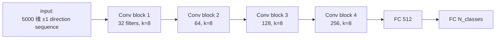

# 課堂 10.3 — Deep Learning 分類器：DF / Var-CNN / Tik-Tok / Transformer

## 學前知道
- 前置課：10.1（資訊理論）、10.2（手工 features 的歷史）
- 預計閱讀時間：60–80 分鐘
- 必讀論文：
  - Abe & Goto (2016), *Fingerprinting Attack on Tor Anonymity using Deep Learning*, APAN
  - Rimmer, Preuveneers, Juarez, Van Goethem, Joosen (2018), *Automated Website Fingerprinting through Deep Learning*, NDSS（AWF）
  - **Sirinam, Imani, Juarez, Wright (2018), *Deep Fingerprinting: Undermining Website Fingerprinting Defenses with Deep Learning*, CCS（DF）** — 本堂主軸
  - Bhat, Lu, Kwon, Devadas (2019), *Var-CNN: A Data-Efficient Website Fingerprinting Attack Based on Deep Learning*, PoPETs
  - Rahman, Sirinam, Mathews, Gangadhara, Wright (2020), *Tik-Tok: The Utility of Packet Timing in Website Fingerprinting Attacks*, PoPETs
  - Sirinam, Mathews, Rahman, Wright (2019), *Triplet Fingerprinting: More Practical and Portable Website Fingerprinting with N-Shot Learning*, CCS（TF）
  - Oh, Sunkam, Hopper (2021), *p1-FP: Extraction, Classification, and Prediction of Website Fingerprints with Deep Learning*, PoPETs（fka GANDaLF refinements）
  - Jansen, Juarez, Galvez, Elahi, Diaz (2018), *Inside Job: Applying Traffic Analysis to Measure Tor from Within*, NDSS — 真實 Tor 流量上做 WF 的關鍵 dataset paper
  - Wang & Goldberg (2016), *On Realistically Attacking Tor with Website Fingerprinting*, IEEE S&P（concept drift / staleness 分析）
  - Juarez, Afroz, Acar, Diaz, Greenstadt (2014), *A Critical Evaluation of Website Fingerprinting Attacks*, CCS — 必讀的「冷水」論文
- 必讀原始碼：
  - https://github.com/deep-fingerprinting/df （DF 原作 TensorFlow 1.x impl）
  - https://github.com/sanjit-bhat/Var-CNN
  - https://github.com/msrocean/Tik_Tok
  - https://github.com/notem/reWF（PyTorch 重寫 AWF/DF/Var-CNN/Tik-Tok）

## 動機

10.2 結尾，hand-crafted feature 在 95% 左右見頂。**2018 年起整個 WF 領域被 deep learning 接管**：

- 不再需要 feature engineering——CNN 自動從 raw direction sequence 學表示。
- 跟既有 defense（WTF-PAD、Walkie-Talkie）對抗時，**DF accuracy 從 hand-crafted 的 ≤60% 拉到 ≥90%**——基本上宣告早一代 defense 全部死亡。
- Tik-Tok 進一步加入精確 timing → packet sequence 已經不能擋。
- Triplet/few-shot：把 WF 變成 metric learning 問題，**幾個樣本就能擴展到新 site**——concept drift 的剋星。

對 G6 設計者而言，這堂課的結論很硬：**「假裝 deep learning 不存在」的 defense 必死。我們必須對 SOTA DL adversary 給出 leakage bound。**

## 核心概念

### 一、Abe & Goto 2016（APAN）：第一次嘗試

- 把 trace 投影為 fixed-length direction-only vector（一般 5000 個 cells）。
- Stacked Denoising Autoencoder (SDAE) + softmax。
- 100 sites closed-world ~88%。

意義：證明 NN 在 WF 上「能跑通」，但作者沒 hyperparam tuning，遠未達後續 SOTA。

### 二、Rimmer 2018 NDSS（AWF）：規模化

- 公開 "AWF" dataset：900 sites × 2500 traces，後續成為 WF benchmark。
- 三種模型：SDAE、CNN、LSTM。
- closed-world acc：CNN ~97%、LSTM ~96%、SDAE ~94%。
- **重點**：「不需 feature engineering」第一次被廣泛 cite。

### 三、Sirinam 2018 CCS（DF）：本堂主軸

#### 架構



每個 Conv block：
- 2 個 Conv1D + BatchNorm + ELU activation
- MaxPool stride 4 → 序列長度被連續壓縮 4×4×4×4 = 256 倍
- Dropout 0.1–0.5

#### 訓練

- Adamax optimizer, lr 0.002
- batch size 128, 30 epochs
- categorical cross-entropy

#### 結果（震撼學界）

| 場景 | DF | 之前 SOTA (k-FP/CUMUL) |
|---|---|---|
| Undefended closed-world | **98.3%** | ~95% |
| WTF-PAD defended | **90.7%** | ~60% |
| Walkie-Talkie defended | **49.7%** | <20% (W-T 是 "designed-against-DF") |
| Open-world (TPR/FPR) | **0.98 / 0.02** | ~0.88 / 0.05 |

**WTF-PAD 是當時被認為「實用」的 Tor padding。DF 一夜之間讓它失效。**

#### 為什麼 DF 比 hand-crafted feature 強？

1. **End-to-end learning**：CNN learn 的 representation 直接針對 distinguishability 最佳化；hand-crafted feature 只是「人類覺得 informative」。
2. **Hierarchical convolution**：底層 filter 抓 local pattern（如 「3 個 outgoing 後 1 個 incoming」這種 micro-burst），高層 combine 為 site-level pattern。
3. **MaxPool 的 translation invariance**：對「同一個 site 在不同網路條件下產生的稍移位 trace」有 robustness。

### 四、Bhat et al. 2019 PoPETs（Var-CNN）：data-efficient

DF 訓練要 1000 trace/site。Var-CNN 用 ResNet + dilated convolutions，可以用 100 trace/site 達 95%+。

#### 關鍵技術

- **Dilated convolution**：擴大 receptive field 不增加參數，捕捉 long-range pattern。
- **Multi-input**: direction + timing 兩個 sub-network，後期 fusion。
- **ResNet-style skip connections**：訓練更穩定。

#### 結果

- 100 trace/site closed-world: 95.0%（DF 在同樣資料 90.6%）。
- Open-world ROC AUC 0.99。

**對 G6 的意義**：data efficiency 改變了 attacker model——對手不需要長期蒐集即可上線新 site。

### 五、Rahman 2020 PoPETs（Tik-Tok）：timing 終於被 exploit

DF / Var-CNN 主要用 direction sequence。Tik-Tok 把 IAT 加進來，並做了一個關鍵設計：**用 (direction × log(time))** 而非 raw direction。

#### Representation

對每個 cell $i$，新 feature 是 $d_i \cdot \log(t_i + 1)$，其中 $d_i \in \{+1, -1\}$、$t_i$ 是與第一個 cell 的時間差。**這個 representation 同時編碼 direction 與 timing**，且 log scaling 讓不同 RTT 環境的 feature 可比。

#### 結果

- closed-world: **99.5%**（DF 98.3%）
- 對 WTF-PAD：**98.4%**（DF 90.7%）
- 對 Front (Gong–Wang 2020): **88.2%**（DF 79.1%）
- 對 Walkie-Talkie: **81.0%**（DF 49.7%）

**意義**：Walkie-Talkie 用了 supersequence 假設「兩 site 看起來一樣」——但這是在 direction 上；timing 沒被覆蓋。Tik-Tok 用 timing 一招殺穿。**所有不處理 timing 的 defense 都 vulnerable。** G6 的 timing module 必須是 first-class。

### 六、Triplet Fingerprinting（Sirinam 19 CCS）：metric learning

訓練一個 embedding 而非 classifier：
- input: trace
- output: 1024-D embedding
- objective: triplet loss——同 site embedding 距離小，異 site 距離大。

訓練完，新 site 只需 ≤5 樣本就能加入——k-NN 直接在 embedding 空間做。**Concept drift 與新 site 上線的部署成本被打破。**

### 七、Transformer 與 self-attention 系（2022–2024）

- **TMWF / Trans-WF**：直接 Transformer encoder，attention 在 cell 序列上。
- **RobustFingerprint**（Sirinam 2022 system papers）：multi-task learning + augmentation。
- **SOTA accuracy on undefended Tor: ~99.8%。基本可視為飽和。**

**Open question (Part 10.4)**：DL 模型在 adversarial example 下穩定嗎？這引出 10.4 的對抗式樣本主題。

### 八、Juarez 2014 CCS：critical evaluation

本堂必須讀的「冷水」。Juarez 指出所有 WF accuracy 數字有 4 大不誠實之處：

1. **Closed-world fallacy**：真實 user 訪問的網站幾乎都不在 monitor set 內。
2. **Replicability fallacy**：訓練資料是同一機器、同一網路、同一 Tor circuit 蒐集；測試也一樣。實際攻擊者拿不到這些。
3. **Staleness**：訓練 → 測試之間幾小時。Wang–Goldberg 16 後續證明訓練後 ≥3 天 accuracy 暴跌。
4. **Parsing**：實驗假設 attacker 能 cleanly 切割每個 page visit。真實連續上網 trace 邊界模糊。

**對 G6 評估的意義**：Part 12 的 evaluation 必須避開所有四個陷阱，否則 reviewer 直接 reject。

### 九、Wang–Goldberg 2016 IEEE S&P：concept drift

把 Juarez 的 staleness 量化：

- 訓練 / 測試間隔 0 天：acc 95%
- 間隔 3 天：acc 90%
- 間隔 10 天：acc 80%
- 間隔 90 天：acc 60%

**根本原因**：網站內容變、CDN 變、JS bundle 變 → trace 自然漂移。

對手對應策略：continuous retraining。但這需要 fresh ground-truth trace。

**對 G6 的意義**：對手 retraining 成本是真實 friction。G6 可以利用——例如刻意製造高頻 page variation（如 client-side random padding pattern 每 N 天輪換），人為加大 drift rate。

### 十、Information-theoretic upper bound on DL accuracy（Cherubin 17）

Cherubin PoPETs 2017 用 Bayes-optimal estimator 估計：**任何 classifier 在某個 dataset 上最高能達多少 accuracy**。這個 bound 與具體 model 無關——告訴你 DF/Tik-Tok 是否已接近 ceiling。

**結論**：在 Wang14 dataset 上 Bayes-optimal ~98–99%。Tik-Tok 99.5% 等於說「已經到天花板」。**進一步提升 DL 已沒空間——攻擊端的紅利結束。Defense 端的紅利還在。** G6 是站在 defense 紅利這側。

### 十一、攻擊家族對比表

| 攻擊 | 年份 | Repr | 模型 | data/site | undef acc | WTF-PAD acc | W-T acc |
|---|---|---|---|---|---|---|---|
| k-NN (Wang 14) | 2014 | hand | weighted L1 k-NN | 90 | 91% | 60% | 20% |
| CUMUL | 2016 | hand (cumulative) | SVM-RBF | 25 | 93% | 60% | 25% |
| k-FP | 2016 | hand (175 feats) | RF + Hamming k-NN | 50 | 95% | 65% | 20% |
| AWF (CNN) | 2018 | direction | CNN | 2500 | 97% | 75% | 30% |
| **DF** | 2018 | direction | deep CNN | 1000 | 98.3% | 90.7% | 49.7% |
| Var-CNN | 2019 | direction+time | ResNet | 100 | 95% | 88% | 40% |
| **Tik-Tok** | 2020 | dir × log(time) | DF-style CNN | 800 | 99.5% | 98.4% | 81.0% |
| Triplet (TF) | 2019 | direction | metric (triplet) | 5 (per site) | 95% | n/a | n/a |
| RF+DL ensemble (2022+) | 2022 | mixed | various | 1000 | 99.8% | 99% | 90%+ |

## 與我們協議設計的關聯

1. **Tik-Tok 是 baseline**：G6 的 evaluation 必須對 Tik-Tok。對 DF / AWF 已不足以 publish。
2. **Direction × time 是核心 channel**：G6 的 padding 不能只 reshape sizes/burst——必須同時打 timing。對應 Part 10.5 的 timing morphing。
3. **W-T 失敗給的教訓**：靠「supersequence 兩兩相同」只覆蓋 direction，留 timing 漏洞。G6 必須是 cross-channel 一致。
4. **Triplet → 新 site 快速擴展**：對手的 retraining 成本變低；但這也允許 defender 自己用 triplet embed 找「哪些 site pair 在當前 defense 下還很可區分」，反向指引 padding。
5. **Bayes-optimal ceiling 給 evaluation 落地**：在 G6 evaluation 中，目標應是把 attacker accuracy 壓到接近 random guess (1/N)，而非「比 DF 差一點」。

## 動手（可選）

### 實驗 A：跑 DF on AWF dataset

```bash
git clone https://github.com/deep-fingerprinting/df
# 用提供的 docker：包含 keras 2.x + python 3.6
docker build -t df .
# AWF dataset 從 NDSS 18 補充材料下載
python src/train.py --dataset awf-closed-world-95 --epochs 30
```

預期 closed-world ~98%。

### 實驗 B：在 timing channel 上做 ablation

把 trace 的 timing 隨機 jitter ±50ms，重訓 Tik-Tok：accuracy 應顯著下降。量化「timing precision → leakage bits」的曲線，這直接給 G6 timing module 的設計參數。

### 實驗 C：跑 Triplet, 觀察 embedding

訓練 triplet model，把 1024-D embedding 用 t-SNE 投到 2D。觀察哪些 site cluster 緊、哪些散。**Defense 設計時應該瞄準的是 clustered site——把它們「攤開」即可顯著降 acc。**

## 自我檢查

1. 為什麼 DF 對 WTF-PAD 從 60% 拉到 90%？WTF-PAD 沒擋什麼？
2. Tik-Tok 的 `direction × log(time)` representation 為什麼比 raw `(direction, time)` 兩通道更強？提示：1D CNN filter 看 single channel。
3. Var-CNN 用 dilated conv 的好處是什麼？為什麼 ResNet skip 對 WF 訓練特別有幫助？
4. Triplet Fingerprinting 跟 classifier 的根本差別是什麼？對手部署成本省在哪？
5. Cherubin Bayes-optimal bound 給 99% 的天花板，但 Tik-Tok 達 99.5%——這是矛盾嗎？提示：Bayes optimal 是對特定 representation 而言。

## 延伸閱讀

- 「Realistic Website Fingerprinting By Augmenting Network Traces」 (Mathews et al. 2023 PETS)：data augmentation for WF。
- Pulls & Witwer 2023 PETS, "Maybenot": padding spec for Tor padding v2.
- SoK paper: De La Cadena et al. (2024 PETS?) — modern WF survey。
- Github: notem/reWF — 多模型統一 PyTorch impl。

---

## 研究級補遺

### 1. 學界詞彙

- **WF**: Website Fingerprinting
- **AWF**: Automated Website Fingerprinting (also dataset name)
- **DF**: Deep Fingerprinting (Sirinam 18)
- **TF**: Triplet Fingerprinting
- **Tik-Tok**: 不是縮寫——梗來自於本攻擊強調 timing channel
- **DL-WF**: 統稱 deep-learning WF
- **Concept drift**: 訓練 vs 測試分布不一致
- **Open-world / closed-world**: 同 10.2
- **N-shot learning**: 每類僅 N 樣本的學習

### 2. 對手分類學

- **Static adversary**：訓練後不更新。容易受 concept drift 打敗。
- **Adaptive adversary**：持續訓練（continuous retraining）。WF 攻擊面顯著上升。
- **Multi-vantage adversary**：在多個位置同時觀察（GFW 之類超大對手）。Part 10.10 詳論。

### 3. 形式化定義

**DL classifier 在 WF 上的 mutual info 估計**

$$\hat{I}(X; Y) = \log_2 N - H(P_e) - P_e \log_2 (N-1)$$

其中 $P_e$ 為 measured error rate。**Fano 不等式給的下界**。攻擊端 DL accuracy 高 ⇒ $\hat{I}(X;Y)$ 大 ⇒ leakage 大。

**Bayes optimal accuracy**

$$\text{acc}^* = E_{Y}[\max_x p(x|y)]$$

對任意 classifier 都是上界。Cherubin 17 用 kernel density estimator 估這個。

### 4. 領域的關鍵論文

- 主軸：Abe16 → Rimmer18 → Sirinam18 → Bhat19 → Rahman20 → Sirinam19(TF)。
- Critical eval：Juarez14 → Wang16-S&P → Pulls 2020 PoPETs（critical critical eval）→ Cherubin–Jansen–Troncoso 22 USENIX Security（再 critical）。
- 攻擊在「fully encrypted」協議（如 Shadowsocks / FEP）上的演化：Wu 23 USENIX Sec（已有 precis：`wu-fep-detection.md`），主要靠 entropy + 統計特徵而非 DL。
- Concept drift：Wang–Goldberg 16 S&P。**Part 10.3** 引用，並 forward 到 **Part 10.4** 對抗式樣本與 **Part 10.10** SoK。

### 5. 我們協議的座標

| 維度 | Wang14/CUMUL/k-FP | DF/Tik-Tok | G6 規劃 |
|---|---|---|---|
| Adversary representation | hand-crafted | learned | **assume DL with full timing** |
| Concept drift assumption | static dataset | static dataset | **assume continuous retraining** |
| Open-world realism | 限制重重 | 限制重重 | **eval w/ 100k unmonitored sites, ≥30-day drift** |
| Leakage metric | accuracy | accuracy | **+ Bayes-bound + ε-unobs report** |

### 6. 必追資源

- **PETS WF benchmark dataset BigEnough**（Mathews 2023）：包含 95 monitored × 200 trace + 19,000 unmonitored，已成 modern benchmark。
- **NDSS 18 AWF data release**（Rimmer）：原始 900 sites × 2500 traces。
- **Tor research-safety board (research.torproject.org/safetyboard)**：跑 Tor 上的 measurement / WF experiment 前的 ethics 審核。
- Twitter/Mastodon：@msrocean (Rahman), @mjuarezm (Juarez), @robust-fingerprinting accounts.

### 7. 開放問題

1. **Adversarial robustness of WF DL**：DF / Tik-Tok 對 L_∞ ε-bounded perturbation 多 robust？沒人系統研究。**10.4 深入**。
2. **Cross-domain transfer**：在 Tor traces 訓的 DF 對 VLESS / Hysteria2 流量有多大遷移性？沒 systematic study。
3. **Calibration**：DF/Tik-Tok 給的 softmax confidence 校準嗎？對 open-world 決策很關鍵（FPR/TPR 的 threshold tuning）。
4. **Online / streaming WF**：所有 SOTA 假設 attacker 拿到完整 trace 才分類。**streaming** 設定下能不能即時分類？這是「實時審查」場景的關鍵。
5. **Generative defense vs discriminative defense**：能否用 GAN 學「site A 的 trace 跟 site B 看起來一樣」的 generator？Hou19 (Mockingbird) 開始，但 robust 程度不夠。**10.4 / 10.7 詳論**。
