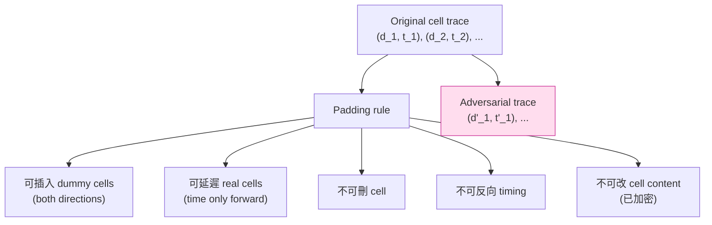

# 課堂 10.4 — 對抗式樣本在流量上：從 Mockingbird 到 Surakav

## 學前知道
- 前置課：10.1（資訊理論）、10.3（DL classifiers）
- 預計閱讀時間：50–70 分鐘
- 必讀論文：
  - Goodfellow, Shlens, Szegedy (2015), *Explaining and Harnessing Adversarial Examples*, ICLR — 基礎
  - Carlini & Wagner (2017), *Towards Evaluating the Robustness of Neural Networks*, IEEE S&P
  - Madry, Makelov, Schmidt, Tsipras, Vladu (2018), *Towards Deep Learning Models Resistant to Adversarial Attacks*, ICLR（PGD adversarial training）
  - Hou, Wright, Goldberg (2019), *Mockingbird: Defending Against Deep-Learning-Based Website Fingerprinting Attacks with Adversarial Traces*, IEEE TIFS（arXiv 1902）
  - Nasr, Bahramali, Houmansadr (2021), *Defeating DNN-Based Traffic Analysis Systems in Real-Time With Blind Adversarial Perturbations*, USENIX Security
  - Sadeghzadeh, Shiravi, Dehghantanha (2021), *AWA: Adversarial Website Adaptation*, IEEE TIFS
  - Gong, Zhang, Wang, Wang (2022), *Surakav: Generating Realistic Traces for a Strong Website Fingerprinting Defense*, IEEE S&P
  - Sheffey, Adler, Bird (2024), *On the Robustness of Domain Adaptation against Adversarial Attacks*, PoPETs（如有 access）
- 必讀原始碼：
  - https://github.com/msrocean/Mockingbird
  - https://github.com/SPIN-UMass/BLANKET — blind adversarial perturbation
  - https://github.com/websitefingerprinting/Surakav

## 動機

10.3 結尾留了個問題：**deep classifier 容易被 adversarial example 騙嗎？** 視覺領域早就 yes——但 traffic domain 有兩個不同 constraint：

1. **只能修改 「discrete + causally-ordered」 sequence**——你能加 cell 但不能 delete sent cell，只能延遲不能反向 timing。
2. **必須真實 deployable**——不像影像可以離線生成 perturbation，traffic perturbation 必須在 client side 即時生成且符合 protocol 規則。

這兩個 constraint 讓「adversarial examples」在 traffic 上變成獨立研究主題。本堂梳理 2019–2024 的演化，並用結果回頭評 Proteus 設計：**對抗式 padding 是否可作為主要防禦？**

## 核心概念

### 一、Goodfellow 2015 對抗樣本的基本 framework

設 classifier $f: \mathcal{X} \to \mathcal{Y}$，loss $\ell$，原樣本 $x$ 真標 $y$。**對抗樣本**：

$$x' = x + \delta, \quad \|\delta\|_p \leq \varepsilon, \quad f(x') \neq y$$

兩種 attack：
- **Untargeted**：$f(x') \neq y$ 即可。
- **Targeted**：$f(x') = y^*$ for chosen $y^*$。

兩種 access：
- **White-box**：對手有 $f$ 的完整參數，能 gradient descent。FGSM、PGD、C&W 算法皆 white-box。
- **Black-box**：只能 query $f$ output。需要 transfer attack 或 query-based。

在 WF defense 場景，**防禦者是 client，需要把 attacker classifier $f$ 反向操作生成 perturbation**。防禦者一般 **不知** $f$ 的參數——所以實務都是 transfer attack（在 surrogate model 上 craft perturbation）。

### 二、Traffic 上的 constraint



**這些 constraint 用 optimization 語言寫**：

$$\min_{\delta} \|\delta\|_{\text{overhead}} \quad \text{s.t.} \quad f(x + \delta) = y^*, \delta \in \mathcal{C}$$

其中 $\mathcal{C}$ 是「插入 dummy + 延遲 only」的合法集合。這個集合 **不是 L_p 球**，所以視覺領域的 PGD 不能直接搬。

### 三、Mockingbird（Hou 19 IEEE TIFS）：第一個 adversarial WF defense

#### 思路

不直接 attack target classifier，而是**讓 source site 的 trace 朝 target site 的 trace「靠近」**。具體：

1. Source trace $x_s$ (網站 A)、target trace $x_t$ (網站 B)。
2. 在 cell representation 上做 perturbation：插入 dummies、延遲 timing，讓 $x_s$ 的 DF embedding 靠近 $x_t$。
3. **不需要 white-box 知識**——只要 surrogate model（W-T 攻擊作者預訓的 DF）。

#### 算法

```
def mockingbird(source_trace, target_trace, surrogate_DF):
    x = source_trace
    for iteration in 1..N:
        # 在合法 perturbation set 內，挑使 surrogate_DF embedding(x) 最靠近 target 的修改
        candidates = generate_legal_perturbations(x)
        best = argmin(candidates, key=lambda c: distance(surrogate_DF.embed(c), target_embed))
        x = best
    return x
```

#### 結果

- Defended trace 的 bandwidth overhead ~50–60%
- 對 DF 把 closed-world accuracy 從 98% 拉到 ~30%
- 對 k-FP 拉到 ~15%

#### 弱點（後續論文戳的）

1. **Static target choice**：在訓練時挑 target；attacker 在線時若知道 mockingbird 規則可反向。
2. **Surrogate transfer 弱**：攻擊者用更強 DL（Tik-Tok）時，Mockingbird 提供的保護下降至 ~50% accuracy。
3. **Real-time deployment cost**：每個 trace 要 iterative optimization（10+ 秒），client 上跑不動。

### 四、BLANKET / Blind Adversarial Perturbation（Nasr 21 USENIX Security）

#### 動機

修 Mockingbird 的 real-time 問題。Nasr 等人提出 **universal perturbation**：訓練一次得一個通用 padding pattern $\delta^*$，套到任意 trace 都有 high attack success。

#### 算法

```
# 訓練階段（offline）
δ = init small perturbation
for batch x in trace_dataset:
    loss = ℓ(f(x + δ), y_target) + α · ||δ||
    δ -= lr · ∇_δ loss

# 部署階段（online，per-trace）
def defend(x):
    return x + δ  # constant overhead，O(1)
```

#### 結果

- 對 DF / Var-CNN / Tik-Tok 都有效
- attacker accuracy ↓ 50–80 個百分點
- overhead 比 Mockingbird 低（~20–30%）

#### 弱點

- universal perturbation 一旦被攻擊者拿到（reverse engineering），整個 defense 廢。
- **形式上和 「rotating shared secret」 一致**——需要 key rotation 機制，但 attacker 通常能離線 sniff defense traffic 來重訓 surrogate。

### 五、AWA: Adversarial Website Adaptation（Sadeghzadeh 21 TIFS）

把 mockingbird 改成 GAN-style 生成 perturbation：

- Generator $G$：input trace + target, output perturbation pattern。
- Discriminator $D$：模仿 attacker 的 WF classifier。
- Min-max：$\min_G \max_D \ell(D(x + G(x, t)), y_{x})$。

訓練後 $G$ 可即時跑（前饋一次），解決 Mockingbird real-time 問題。

#### 結果

- 對抗 DF：accuracy ↓ 到 ~20%
- overhead ~25%

#### 弱點

- Generator overfits 到 discriminator——當 attacker model 改變時（e.g. Tik-Tok），保護驟降。
- **Black-box adaptive attack**（attacker 把 defense 視為 oracle 重訓）能恢復 ~70% accuracy。

### 六、Surakav（Gong 22 IEEE S&P）：state-of-the-art

#### 主要創新

1. **目標不是 fool classifier，是 generate realistic decoy traces**。Discriminator 不是 WF model 而是「real-vs-fake trace」classifier。
2. **GAN with sequence-level discriminator**——LSTM-based，能捕捉 burst pattern。
3. **Replayable trace pairs**：generator 在 client 與 server 同步生成 decoy trace pair (`A_real, B_decoy`)，使 attacker 永遠看到「兩個 site 候選之一」。

#### 結果

- vs DF: 24% accuracy（vs ~98% 無防禦）
- vs Tik-Tok: 36% accuracy
- vs k-FP: 19% accuracy
- Bandwidth overhead ~70%
- Latency overhead ~50% (中等)

**Surakav 是目前 publication 中對 strong DL adversary 最 robust 的 defense。但 70% 頻寬 overhead 對日常網頁瀏覽勉強，對 streaming 不行。**

### 七、Sheffey 2024 PoPETs：反向研究 adversarial defense 的 robustness

Sheffey et al. 質問：「**adaptive attacker** 對 adversarial WF defense 有多 effective?」

#### 關鍵發現

1. **大部分 adversarial defense 在 surrogate-aware adaptive attacker 下大幅 degrade**。
   - Mockingbird 在 adaptive DF 下從 30% 升到 ~70% accuracy。
   - BLANKET 也類似。
   - **Surakav 是少數例外**：adaptive attacker 仍只能到 40%。
2. **Defense robustness 取決於 generator generalization**，而非具體 perturbation pattern。
3. **「真實 decoy trace」概念是關鍵**——Surakav 不是讓 trace 「不像任何 site」，而是讓 trace 「同時像兩 site」，從根本上消除可區分性。

### 八、Adversarial 思路與 「pure traffic shaping」 的對比

| 維度 | Pure shaping (Tamaraw, BuFLO) | Adversarial (Mockingbird, BLANKET) | Hybrid (Surakav, RegulaTor) |
|---|---|---|---|
| Defense 機制 | Constant-rate / fixed-pattern | gradient-based perturbation | mode generation + pattern |
| 對 hand-crafted 攻擊 | 強 | 中 | 強 |
| 對 DL 攻擊 | 弱（DF 仍 80%） | 中 | 強 |
| 對 adaptive 攻擊 | 強（沒 surrogate dependency） | 弱 | 中 |
| Bandwidth overhead | 100%+（BuFLO） | 25–50% | 50–80% |
| Latency overhead | 高（BuFLO 7×） | 低 | 中 |
| Deployability (real-time) | 易 | 難（除 BLANKET） | 中 |
| 形式化保證 | 弱（無 closed-form） | 無 | 弱 |

**Proteus 取捨**：純 shaping overhead 太大；純 adversarial 容易被 adaptive attacker 打敗。**Hybrid 是研究主線。**

### 九、一個被忽略的關鍵：**threat-model 配對**

不論哪種 adversarial defense，**威脅模型必須誠實**。常見不誠實：

1. 用 fixed surrogate 訓 attacker → 真實 attacker 用 fresh data 訓更強的。
2. 假設 attacker 不知道 defense 演算法 → 違反 Kerckhoffs 原則。
3. Evaluation 只在 small dataset → adaptive attacker 用更大資料能 break。

**Proteus 的 evaluation 必須**：

- 對手用 latest DL（Tik-Tok / RobustFingerprint / Transformer SOTA）。
- 對手知道 Proteus 演算法與 protocol spec（Kerckhoffs）。
- 對手可 retrain on 30+ days fresh data。
- 在 ≥10⁵ site open-world、≥3 月時間跨度上 eval。

### 十、Adversarial defense 的 information-theoretic 限制

回到 10.1：任何 defense 都受 $I(X; Y) > 0$ bound。Adversarial perturbation 只能 **重排 feature space**——不能根本消除 information。**長期觀察下 adversarial defense 必然失敗**（除非 perturbation 與 input 真正獨立，但這就退化為 cover-traffic）。

**結論**：Adversarial defense 是 **buy time** 策略，不是根本解。**Proteus 應該結合 adversarial (短期) + shaping (長期) + cover-traffic (capacity hard limit)**，三層縱深。

## 與我們協議設計的關聯

1. **Proteus 的核心 defense = Surakav-style hybrid + 形式化 capacity bound**。
2. **Generator 需要 client / server 同步**——這是 Proteus protocol-level design decision，要在 handshake 階段協商 generator seed。Part 11.7 詳論。
3. **Adversarial loss 在 Proteus 訓練中作為 auxiliary objective**，主目標仍是 IND-OBS game。
4. **不假設攻擊者用具體 DL**——只要假設 attacker 是 Bayes-optimal（capacity bound）。

## 動手（可選）

### 實驗 A：複現 Mockingbird

```bash
git clone https://github.com/msrocean/Mockingbird
# 跑在 Wang14 data 上，用提供的 DF surrogate
python mockingbird.py --source path/to/source --target path/to/target
# 量 overhead 與 transfer attack accuracy
```

### 實驗 B：自己訓 BLANKET 風格 universal perturbation

從 PGD-style optimization 開始：
```python
delta = torch.zeros_like(traces).requires_grad_()
for epoch in range(100):
    for x, y in loader:
        out = surrogate_model(x + delta)
        loss = F.cross_entropy(out, target_y) + 0.01 * delta.abs().mean()
        loss.backward()
        with torch.no_grad():
            delta -= lr * delta.grad
            delta = project_to_legal(delta)  # 確保只插不刪
```

觀察 overhead vs accuracy trade-off。

### 實驗 C：Surakav 的 generator-discriminator dance

跑 Surakav repo，觀察訓練 loss curve：generator loss 與 discriminator loss 的振盪。生成 fake trace 與 real trace 用 t-SNE 可視化——確認 generator 已產生 realistic-looking trace。

## 自我檢查

1. 視覺對抗樣本與 traffic 對抗樣本的 constraint 差別有哪些？至少列三個。
2. 為什麼 universal perturbation 比 per-trace optimization 適合 real-time defense？它的安全代價是什麼？
3. Surakav 與 Mockingbird 的根本架構差異是什麼？為什麼 Surakav 對 adaptive attacker 更 robust？
4. Adversarial defense 為什麼是 「buy time」 而非根本解？哪些 protocol 設計能與 adversarial defense 互補？
5. 假設 Proteus 用 universal perturbation，attacker 拿到 perturbation pattern 後能多 reliably 反向？提示：perturbation 是 deterministic 加法，能直接減回去。

## 延伸閱讀

- Carlini & Wagner 17 IEEE S&P：robust C&W attack。閱讀方法論部分。
- Papernot et al. 16 USENIX Security：black-box adversarial via transfer。
- Tramèr et al. 20 NeurIPS, "Adaptive attacks to adversarial example defenses"——揭穿大量「fake robustness」defense。對 WF 領域有同樣警示意義。
- Cherubin–Jansen–Troncoso 22 USENIX Security: WF defense online realism evaluation。

---

## 研究級補遺

### 1. 學界詞彙

- **AE (Adversarial Example)**: input $x' = x + \delta$ s.t. $f(x') \neq f(x)$
- **PGD (Projected Gradient Descent)**: standard white-box attack (Madry 18)
- **FGSM (Fast Gradient Sign Method)**: one-step PGD (Goodfellow 15)
- **C&W attack**: Carlini–Wagner 17 strong attack
- **Universal perturbation**: data-agnostic $\delta$ (Moosavi-Dezfooli 17)
- **Targeted vs untargeted**: 改到特定 label vs 隨便改錯
- **Transfer attack**: 從 surrogate model 算 $\delta$，套到 target model
- **Adaptive attacker**: 知道 defense 演算法的攻擊者
- **GAN-based defense**: generator–discriminator min-max for shaping

### 2. 對手分類學（adversarial 場景專屬）

- **Oblivious adversary**：完全不知道 defense 存在。Mockingbird 原文假設。
- **Algorithm-aware adversary**：知道 defense 演算法但不知具體參數。Kerckhoffs 級。
- **Parameter-aware adversary**：知道 defense 與當前參數（如 generator weights）。
- **Adaptive adversary**：上述 + 用 fresh data 持續 retrain。Sheffey 24 必假設。

實作中 Proteus 應預設 **algorithm-aware + adaptive**——這對應現實 GFW（協議文件公開、長期 data collection）。

### 3. 形式化定義

**Adversarial defense 的安全 game (IND-AE-OBS)**

```
Setup: defender 選 defense parameters θ
Challenge: adversary 出 (x_0, x_1) 兩個 traces
defender: 隨機選 b, return Defended(x_b; θ)
adversary 猜 b'
Adversary advantage = |Pr[b'=b] - 1/2|
Defense 是 IND-AE-OBS-secure if advantage ≤ negl
```

**目前所有實用 adversarial defense 在 advantage > 0.3 的層級**——遠不到 negligible。**Part 11.4** 會把 Proteus 的 game 寫到此格式。

### 4. 領域的關鍵論文

- Mockingbird (Hou 19) → BLANKET (Nasr 21) → AWA (Sadeghzadeh 21) → Surakav (Gong 22) → Sheffey 24 — 必追主線。
- 視覺 AE 基礎：Goodfellow 15, Madry 18, Carlini-Wagner 17, Tramèr 20。
- Adaptive attack methodology：Tramèr 20「On Evaluation of Adversarial Robustness」是必讀方法論。

### 5. 我們協議的座標

| 屬性 | Mockingbird | BLANKET | Surakav | **Proteus 計畫** |
|---|---|---|---|---|
| Defense type | gradient-based | universal | GAN | **GAN + capacity-bounded** |
| Real-time | 否 | 是 | 是 | **是** |
| Overhead | ~50% | ~25% | ~70% | **目標 ≤ 60%** |
| Adaptive resistance | 弱 | 弱 | 中 | **強（IND-OBS proof）** |
| 形式化保證 | 無 | 無 | 無 | **capacity bound + game-based** |

### 6. 必追資源

- **CleverHans / Foolbox / TorchAttacks**: 三大 AE library，研究 traffic AE 時可借 framework。
- Sheffey 24 PoPETs supplementary code (TBD release)。
- Github: SPIN-UMass/BLANKET, msrocean/Mockingbird, websitefingerprinting/Surakav。

### 7. 開放問題

1. **AE defense 有 closed-form capacity bound 嗎？** 目前都是 empirical。
2. **Cross-protocol AE transfer**：在 Tor 訓的 perturbation pattern 對 VLESS 流量有效嗎？沒人研究。
3. **AE + cover traffic 結合**：能否設計一個 hybrid 讓 AE 提供短期混淆，cover-traffic 提供長期 capacity bound？這是 Proteus 核心 hypothesis。
4. **Game-theoretic equilibrium**：defender / attacker 在無限長期下的 Stackelberg equilibrium 是什麼？目前沒人 analytically solve。
