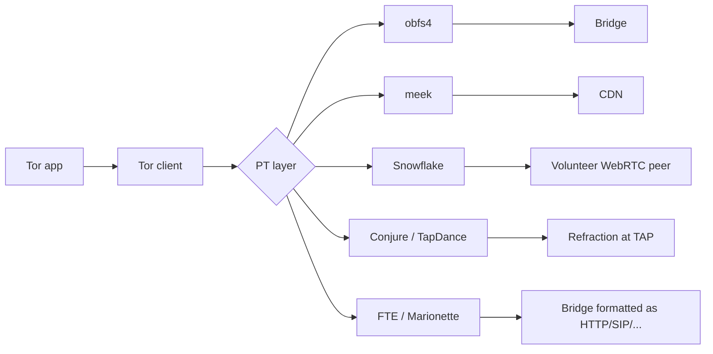
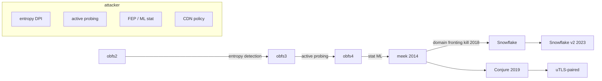

# 課堂 10.6 — Pluggable Transports 精讀：obfs2 / obfs3 / obfs4 / ScrambleSuit / meek / Snowflake / FTE / Marionette / Conjure

## 學前知道
- 前置課：Part 4（TLS / QUIC）、10.2–10.5
- 預計閱讀時間：80–100 分鐘
- 必讀規格 / 論文：
  - **obfs2 spec** (2011, Brandon Wiley): `obfsproxy-spec.txt`
  - **obfs3 spec** (2013): `obfs3-protocol-spec.txt` —— DH-based handshake
  - **obfs4 spec** (Yawning Angel, 2014): `obfs4-spec.txt` —— ntor + ScrambleSuit-style shaping
  - **ScrambleSuit** Winter, Pulls, Fuß (2013), *ScrambleSuit: A Polymorphic Network Protocol to Circumvent Censorship*, WPES
  - **FTE** Dyer, Coull, Ristenpart, Shrimpton (2013), *Protocol Misidentification Made Easy with Format-Transforming Encryption*, CCS
  - **Marionette** Dyer, Coull, Shrimpton (2015), *Marionette: A Programmable Network Traffic Obfuscation System*, USENIX Security
  - **meek** Fifield, Lan, Hynes, Wegmann, Paxson (2015), *Blocking-resistant communication through domain fronting*, PoPETs
  - **Snowflake** Bocovich, Fifield et al. (Tor blog + spec): WebRTC-based PT
  - **Format-Transforming Encryption** primary source: Dyer-Coull-Ristenpart-Shrimpton 13 CCS
  - **Conjure** Frolov, Wampler, Tan, Halderman, Borisov, Wustrow (2019), *Conjure: Summoning Proxies from Unused Address Space*, CCS
  - **Refraction Networking / Decoy Routing** Karlin, Ellard, Jackson, Jones, Lauer, Mankins, Strayer (2011), Wustrow, Wolchok, Goldberg, Halderman (2011), Houmansadr, Nguyen, Caesar, Borisov (2011)
  - **uTLS** Frolov & Wustrow (2019), *The use of TLS in Censorship Circumvention*, NDSS
  - **Khattak et al. (2016) PoPETs SoK on PT** — 統整論文
  - **Wang, Dittrich, Ling, Lu (2015), Seeing through Network-Protocol Obfuscation, CCS** —— PT 攻擊論文
  - **Wang, Wang, Yao (2015)** Censorship Resistance Survey
  - **Wails et al. (2024) PoPETs**: Tor PT 現狀調查
- 必讀原始碼：
  - https://gitlab.torproject.org/tpo/anti-censorship/pluggable-transports/lyrebird （obfs4 reference Go impl，原 yawning/obfs4proxy fork）
  - https://gitlab.torproject.org/tpo/anti-censorship/pluggable-transports/snowflake
  - https://gitlab.torproject.org/tpo/anti-censorship/pluggable-transports/meek
  - https://github.com/kpdyer/fteproxy
  - https://github.com/refraction-networking/conjure
  - https://github.com/refraction-networking/utls

## 動機

Tor 把 PT (Pluggable Transports) 設計為「transport-agnostic obfuscation layer」——Tor 流量被裹進別的「看起來不像 Tor」的協議。**這是 censorship circumvention 的工程主軸**，過去 14 年累積了一個完整的 PT 家族。

對 Proteus 設計者，這堂課三個收穫：

1. **PT 演化史 = 對抗 GFW 演化的化石記錄**。obfs2 死於 entropy detection、obfs3 死於 DH 公鑰特徵、obfs4 死於 GFW active probing → meek（domain fronting）→ Snowflake → Conjure（domain fronting 政治壓力後的轉向）。
2. **每個 PT 都是「choose your own poison」的點**：不同 PT 取不同 tradeoff，可比較。
3. **PT spec 是公開的——所有設計細節都可學**。我們的 Proteus 必須能在 PT 框架下作為 transport 註冊，否則無法 leverage Tor 生態。

## 核心概念

### 一、Pluggable Transport 的位置



**PT 不改 Tor circuit semantics，只改 wire-format**。client 啟動 PT process，Tor 與 PT 之間用 SOCKS5 + 環境變數溝通（pt-spec v2）。

### 二、obfs2 → obfs3 → obfs4 演化

#### obfs2（2011）

- 設計目標：把 Tor 流量 XOR 一個 PRG，看起來像「random binary stream」。
- Key derivation: client 與 bridge 用 shared static key，handshake 期間用 4-byte salt + counter 衍生 stream key。
- **致命缺陷**：所有 bytes high-entropy → GFW 用 byte distribution test 直接 detect。
- 死於 2012 GFW probing campaign。

#### obfs3（2013）

- 修 entropy 問題：用 **ephemeral Diffie–Hellman** 取代靜態 key。DH public values **使用 UniformDH**（uniform mod p 而非 standard DH form）讓 wire 看起來像 random。
- **致命缺陷**：handshake 第一個 packet 仍是 192 byte 的「peculiar high-entropy chunk」——可被 entropy + size 統計 detect。
- 死於 2013 active probing：GFW 看到 obfs3 wire form → 探一探 bridge → bridge ack → 加入黑名單。

#### obfs4（2014）

- **Active probing resistance** 是核心目標。引入：
  - **ntor handshake** (Tor 標準）做 forward secrecy。
  - **Client identity proof**：handshake 第一個 packet 含 HMAC(bridge_pubkey, ...)；bridge 沒見過 client pubkey 不 reply。
  - **Inter-arrival timing obfuscation** (IAT mode)：可選的 timing jitter，模仿 ScrambleSuit。
- 仍然 high-entropy，但 attacker 無法 active probe（沒對應 HMAC 回答不了）。
- 死於 2020+ GFW 部署的 ML-based fingerprinting（時間、size、connection lifetime）。

#### ScrambleSuit（2013）

obfs4 的前身。Winter–Pulls–Fuß WPES 13 提出：
- 為每個 bridge 客戶端 pair 派 unique session key（無 active probing 漏洞）。
- 隨機 packet size + IAT，使 wire stat 多樣化。
- 被 obfs4 直接繼承。

### 三、obfs4 wire 細節（重要）

```
Frame format:
[ 16-byte MAC | 2-byte length | payload | padding ]

Handshake:
client → bridge: [ 32-byte X25519 PK | 32-byte mark | 16-byte HMAC | random padding 0..8192 ]
bridge → client: [ 32-byte X25519 PK | 32-byte AUTH | 32-byte mark | 16-byte HMAC | random padding ]
```

**Mark** = HMAC(node_id || bridge_pubkey, client_pk) ——bridge 收到 client request 後 scan stream 找 mark，沒找到就 silent ignore（active probing 防禦）。

**Active probing 防禦關鍵**：bridge 沒 client static identity 不會反應。GFW probe 給 bridge 是無回應的——bridge 看起來像「啥也沒提供的 random server」。

### 四、obfs4 的 known weakness（2024 view）

1. **High-entropy bytes**：每個 byte 都接近均勻分布，與 HTTP / TLS / 一般網路流量差很多。GFW 用 statistical test 可 flag。
2. **Long-lived connection**：Tor circuit 通常分鐘級。一般 HTTPS 短得多。
3. **Packet size pattern**：random padding 不代表「像 TLS record」——TLS record size 有特定模式（client hello ~ 500 bytes, etc.）。
4. **GFW 用 ML classifier 把 1+2+3 結合**——這是 2023+ 「fully encrypted traffic detection」(FEP) 的核心，Wu 23 USENIX Sec 已詳論（見 `notes/papers/wu-fep-detection.md`）。

**結論**：obfs4 在 2024 已 deprecated。Tor 社群轉向 meek / Snowflake / Conjure。

### 五、FTE（Dyer 13 CCS）

#### 思路

把加密 ciphertext **format-transform** 成符合特定 regex / DFA 的字串。例：HTTP/1.1 GET request、SIP packet、SSH banner。

#### 算法

- 定義 DFA $A$ 接受「合法 HTTP」strings。
- 計算 $A$ 接受長度 $n$ 的 strings 數 $|L_n(A)|$，用 rank-unrank algorithm 在 [0, $|L_n(A)|$) 與合法 strings 1-to-1 雙射。
- 把 ciphertext interpreted as integer，unrank 出 string。
- bridge 接收後 rank 回 integer → decrypt。

#### 結果

- wire format 為 valid HTTP/SIP/etc., regex-based DPI 無法 flag。
- 對基於 protocol-conformance 的 DPI（如老式 nDPI）有效。

#### 弱點

- 高層 stateful DPI（如 nDPI 進階版）看到 HTTP-shaped 但 sequence/timing 不正常仍能 flag。
- **Wang–Dittrich–Ling–Lu 2015 CCS** "Seeing through Network-Protocol Obfuscation" 顯示 FTE 在 statistical attack 下不太抗。

### 六、Marionette（Dyer 15 USENIX Security）

#### 思路

FTE 的高級版：用 **programmable state machine** 描述目標 protocol，不只 single regex。

- 一個 marionette 程式描述：states + transitions + actions。
- Actions 包含「send X bytes of FTE-encoded data shaped like HTTP request」。
- Client / bridge 共享 program → wire sequence 看起來像 specific protocol session（如完整 HTTP/2 連線）。

#### 強處 / 弱處

- 強：複雜協議模仿（如 SMB、SSH session）能高度像。
- 弱：實作複雜、context-sensitive bugs 多。**從未廣泛 deployed**。

**對 Proteus 的意義**：programmable shaping 是好概念，Maybenot 是後續落地版（Part 10.5）。

### 七、meek（Fifield 15 PoPETs）—— domain fronting

#### 核心 trick

- TLS SNI 為 allowed.example.com（如 ajax.googleapis.com）；
- HTTP Host header 為 hidden bridge.example.com；
- CDN（如 Cloudflare、Google App Engine、Azure）routes request 到 Host header → 把流量轉到實際 bridge。

**對 censor (GFW)**：看到 SNI = google → 沒法 block 整個 google.com。

#### 部署過程

- Tor meek-google / meek-amazon / meek-azure 在 2014–2018 是主要 reachable PT。
- **2018 Google + Amazon 撤掉 domain fronting**（policy decision）。**Tor meek 大幅 degrade**。
- 2024 仍可在某些 CDN 用，但 fragility 高。

#### 對手如何反擊

- GFW 不能 block CDN host（會傷及合法流量）。但**長時間連線到 same SNI** + Tor-like sub-traffic 可被 detect。
- 2022 GFW 開始用 SNI + TLS fingerprint 組合 detection（即使 SNI 是 cdn，TLS handshake 細節仍洩 Tor 用戶）。

### 八、Snowflake (Tor PT)

#### 思路

- 用 **WebRTC** 透過志願者瀏覽器當 Tor proxy。
- Client 與志願者透過 STUN/TURN（NAT traversal）建立 WebRTC datachannel。
- 流量看起來是 WebRTC——音訊/視訊通話的同類別流量，難一刀 block。

#### 強處

- WebRTC 為主流（Google Meet、Zoom 等都用），block WebRTC = block 視訊通話。
- 志願 proxy pool 大（瀏覽器擴充 + cupcake.is）。

#### 弱處

- WebRTC 在 NAT 困難網路下不穩。
- GFW 開始 fingerprint WebRTC handshake（特定 DTLS 參數）。
- Performance 不如 obfs4——latency 高、頻寬不穩。

#### 2023+ 演化

- Snowflake v2 加上 broker rendezvous 隱蔽性提升。
- 仍是 Tor 在中國的主要 reachable PT 之一（另一個是 Conjure）。

### 九、Refraction Networking / TapDance / Conjure

#### 概念

- 中間 ISP 部署 **TAP**（traffic analysis point）。
- Client 對外連到任意 「decoy site」（如 Google）。
- TAP 識別 client 的 special signal（如 TLS extension 中的 hidden flag），把流量 redirect 到實際 bridge。
- Censor 看到的 destination 是 decoy site——blocking decoy 代價巨大。

#### 主要實現

- **TapDance** (Wustrow 14): one-side decoy routing，client 在 TLS handshake 嵌入 signal。
- **Conjure** (Frolov 19 CCS): 改良版——bridge 用 unused IP space 假裝是 「dark」 站點，client 直接連 dark IP（不需 TAP redirect）。dark IP 上 TAP 啟動 fake server。

#### 部署狀況

- 需要 ISP 配合（在主幹網部署 TAP）——只有少數網路提供（如 Merit、I2 在美國）。
- **不是普通使用者能自己部署的 PT**。生態狹小。

#### 對 Proteus 的意義

- Decoy routing concept 太重——Proteus 不打算走 ISP-cooperation 路線。但 Conjure 「dark IP」概念可借鑑：bridge IP 看起來像 unused 但響應 protocol。

### 十、uTLS (Frolov-Wustrow 19 NDSS)

#### 動機

Tor / proxy 客戶端如果用 Go 標準 `crypto/tls`，TLS ClientHello 是「Go-specific fingerprint」——一看就知道不是 Chrome。**JA3/JA4 fingerprint** 把這個一秒看穿。

#### 解法

uTLS（micro-TLS）：fork Go crypto/tls，提供「parrot」mode，逐 byte 模仿 Chrome/Firefox ClientHello。

#### 重要性

- **VLESS+REALITY、Hysteria2 都用 uTLS**——這是 modern proxy 的 building block。
- Proteus 必須用 uTLS（或同類 library），否則 client side TLS fingerprint 直接洩。

**Part 7 / Part 8 與 Proteus 設計**：uTLS 是 Proteus client transport library 的 baseline。

### 十一、PT 對手對抗演化



### 十二、所有 PT 屬性對比

| PT | 加密 | wire 樣貌 | active-probing 抵抗 | DPI 抵抗 | CDN 依賴 | 2024 status |
|---|---|---|---|---|---|---|
| obfs2 | XOR-PRG | 高熵 random | 弱 | 弱 | 否 | EOL |
| obfs3 | DH-derived | 高熵 random | 弱 | 中 | 否 | EOL |
| obfs4 | ntor + AES | 高熵 random | 強 | 弱（vs ML） | 否 | partly EOL |
| ScrambleSuit | 客製 | 高熵 random | 強 | 中 | 否 | replaced by obfs4 |
| FTE | regex format | 像 HTTP | 中 | 中 | 否 | deprecated |
| Marionette | program | mimic protocol | 中 | 強 | 否 | research only |
| meek | TLS + HTTP | 像 CDN traffic | 強 | 強 | **是** | survives where CDN allows |
| Snowflake | WebRTC | 像 WebRTC | 強 | 強 | 部分（broker） | active |
| TapDance / Conjure | TLS + hidden flag | 像 normal TLS | 強 | 強（需 TAP 配合） | **TAP** | niche |
| **Proteus 計畫** | hybrid | 多 profile | 強 | 強 | optional | – |

### 十三、PT 設計的「教訓清單」

1. **隨機 bytes ≠ 安全**：obfs2/3/4 的 high entropy 是死穴。FEP attack（Wu 23）只看 entropy 就能 flag。
2. **Active-probing resistance 必要**：obfs4 ntor trick 必須複製。
3. **Domain fronting 是 fragile**：政治壓力可瞬間 kill（2018 Google/Amazon）。
4. **WebRTC / 主流流量 piggyback** 比 「假裝看起來像」 更可靠。GFW 不會 kill WebRTC。
5. **TLS fingerprint = JA3/JA4** 是必修：uTLS 是 mandatory。
6. **Programmable shaping (Marionette / Maybenot)** 比 hard-coded shape 有 longevity。
7. **「Look like nothing」（FTE 走的路）** 與 **「Look like everything benign」（meek/Snowflake 走的）** 是兩條哲學路線。Proteus 走後者。

## 與我們協議設計的關聯

1. **Proteus 必須能作為 Tor PT 註冊**：寫 pt-spec v2 compliant binary，Tor 用戶能 plug-in。
2. **wire profile 多選一**：類 meek（CDN HTTP/2）+ 類 Snowflake（WebRTC）+ uTLS-Chrome（純 TLS bridge）—三個 profile，user 按環境選。
3. **handshake 學 obfs4 ntor + REALITY**：active probing 防禦 + TLS-mimic SNI。
4. **wire shaping 學 Maybenot**：programmable state machine，可隨對手調整。
5. **不依賴 ISP-level TAP**：Conjure 路線太窄。

## 動手（可選）

### 實驗 A：跑 obfs4 bridge

```bash
# 在 VPS（境外）裝 lyrebird
sudo apt install lyrebird tor
# tor torrc：
BridgeRelay 1
PublishServerDescriptor 0
ExtORPort auto
ServerTransportPlugin obfs4 exec /usr/bin/lyrebird
ServerTransportListenAddr obfs4 0.0.0.0:443
ContactInfo your-email@example.com
```

抓 obfs4 wire，wireshark 看 high-entropy + handshake 結構。

### 實驗 B：跑 meek 模擬 CDN

用 Cloudflare Workers 寫 echo server，配 Tor meek client 連到 Workers。觀察 SNI vs Host header。

### 實驗 C：跑 Snowflake

`pip install snowflake-cli`（或從 Tor browser 跑）。觀察 WebRTC datachannel 流量 vs 真實 Google Meet。

## 自我檢查

1. obfs2 vs obfs4 兩個核心防禦差異是什麼？為什麼 obfs2 死於 entropy detection 而 obfs4 不？
2. domain fronting 為什麼在 2018 大幅倒台？這啟示我們對 「依賴 CDN 政策」的 design 風險。
3. FTE 與 Marionette 的設計目標重疊但差別在哪？為什麼 Marionette 沒廣泛部署？
4. uTLS 為什麼是 mandatory 而非 optional？JA3 fingerprint 怎麼形成的？
5. Conjure 與 meek 都用 「decoy host」概念，但運作機制完全不同。比較兩者的 censor cost。

## 延伸閱讀

- Khattak et al. 2016 PoPETs, "SoK: Making Sense of Censorship Resistance Systems"（**已有 precis: `khattak-sok-resistance.md`**）。
- Wails et al. 2024 PoPETs, "How Effective is Multiple-Vantage-Point Domain Classification-Based Fingerprinting?"
- Frolov 20 PoPETs, "Detecting Probe-resistant Proxies"——active probing 的進化。

---

## 研究級補遺

### 1. 學界詞彙

- **PT (Pluggable Transport)**: Tor 的 transport-agnostic obfuscation layer
- **obfs2/3/4**: obfuscation family，數字代版
- **FTE (Format-Transforming Encryption)**: 把 ciphertext 變 formatted text
- **Active probing**: censor 主動連 bridge 看回應的攻擊
- **Domain fronting**: SNI 與 Host header 不一致，靠 CDN routing
- **Decoy routing / Refraction networking**: ISP-cooperated middlebox redirect
- **uTLS**: micro-TLS, fingerprint-parrot 庫
- **JA3 / JA4**: TLS ClientHello fingerprint hash

### 2. 對手分類學

- **Passive DPI**: 看 wire 樣貌（obfs2/3 直接死）
- **Active prober**: 連 bridge 探回應（obfs4 / ScrambleSuit 防禦）
- **Statistical / ML DPI**: 結合 wire + 時間 + 大小（FEP-style，殺 obfs4）
- **CDN policy adversary**: 影響 domain-fronting 可用性（2018 Google 殺 meek）
- **State adversary**: 結合上述 + 國家級 ML（GFW 2023+）

### 3. 形式化定義

**Active-probing resistance**

> PT $\Pi$ 是 PR-secure if 對任意 probe $p$ 由 censor 發給 bridge: $\Pr[\text{bridge ACKs } p] \leq \text{negl}$.

obfs4 用 client-known shared secret + HMAC mark 來 enforce。

**Wire indistinguishability from benign protocol**

> PT $\Pi$ 是 $\delta$-mimic of benign protocol $\mathcal{B}$ if total variation distance of wire trace ≤ $\delta$。

實務上 $\delta$ 難量化；evaluations 用 attacker-classifier accuracy 作 proxy。

### 4. 領域的關鍵論文

- obfs2/3/4 specs（**必精讀 spec！**）。Tor gitlab 上。
- ScrambleSuit (WPES 13)、FTE (CCS 13)、Marionette (USENIX Sec 15)。
- meek (PoPETs 15)、Snowflake (Tor blog 2017+ + PoPETs)、Conjure (CCS 19)。
- Refraction Networking 系：TapDance (Wustrow CCS 14)、Slitheen (Bocovich CCS 16)。
- uTLS (Frolov NDSS 19) → REALITY (Xray 2023, Part 7 詳論)。
- Khattak16 SoK / Wails24 — survey level。

### 5. 我們協議的座標

| Profile | 對應 PT | Proteus 取捨 |
|---|---|---|
| 純 TLS 「look like Chrome to bridge」 | uTLS + REALITY-like | **default profile** |
| HTTP/2 over CDN | meek-style | optional fall-back |
| WebRTC | Snowflake-style | optional for hostile networks |
| Programmable shaping | Maybenot machine | **mandatory** |
| Active probing 防禦 | obfs4 ntor + REALITY SNI | **mandatory** |

### 6. 必追資源

- Tor PT working group: gitlab.torproject.org/tpo/anti-censorship/pluggable-transports
- pt-spec v2: gitlab.torproject.org/tpo/anti-censorship/team/-/wikis/Pluggable-Transports
- GFW.report posts on PT detection（如 2023 obfs4 fingerprint 報告）
- IETF MASQUE / OHTTP 工作組

### 7. 開放問題

1. **Post-meek future of CDN-based PT**：CDN 政治壓力下，能否設計不依賴 single CDN policy 的 fronting alternative？(Wails et al 提到 multi-CDN sharding)
2. **WebRTC fingerprinting 抵抗**：Snowflake 的 DTLS handshake 多 distinguishable？是否需 stunable parameters？
3. **PT spec 自動化攻擊評估**：能否從 PT spec 自動推導對手 detection cost？目前 evaluation 都 manual。
4. **PT performance vs covertness trade-off**：obfs4 fast but unsafe (2024); Snowflake covert but slow. 能否同時兼具？Proteus 中心命題。
5. **Programmable PT (Maybenot) 對 GFW ML adversary 的最壞情況**：理論 bound 仍未建立。
