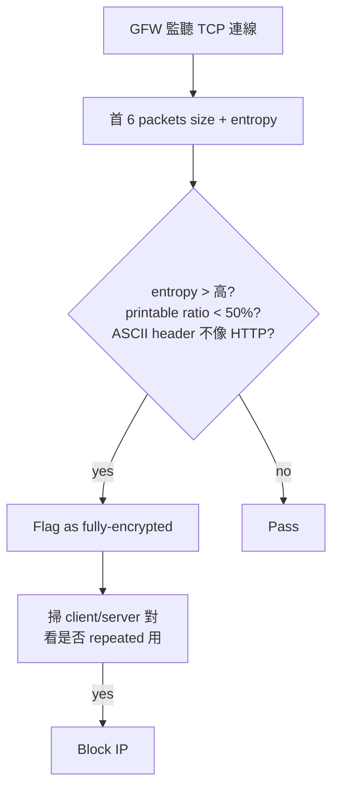

# 課堂 10.7 — Regularization disruption：讓「沒有規律」本身不成為特徵

## 學前知道
- 前置課：10.1（資訊理論）、10.3（DL）、10.5（defense 家族）
- 預計閱讀時間：50–70 分鐘
- 必讀論文：
  - Bahramali, Houmansadr, Goldberg, Borisov (2020), *Practical Traffic Analysis Attacks on Secure Messaging Applications*, NDSS
  - Bahramali, Bordbar, Houmansadr (2021), *Robust Adversarial-Resilient Traffic Analysis*, IEEE TIFS
  - Wu, Liu, Liu, Hu (2023), *How the Great Firewall of China Detects and Blocks Fully Encrypted Traffic*, USENIX Security（precis: `wu-fep-detection.md`）
  - Wang et al. (2020), *High Precision Detection of Business Email Compromise*, USENIX Security — 雖然非 PT 主題，但 entropy-based detection 是同一原理
  - Frolov, Wustrow (2020), *Detecting Probe-resistant Proxies*, NDSS
  - Frolov, Douglas, Scott, McDonald, VanderSloot, Hynes, Kruger, Kallitsis, Robinson, Schultze, Borisov, Halderman, Wustrow (2020), *An ISP-Scale Deployment of TapDance*, FOCI
  - Iacovazzi & Elovici (2017), *Network flow watermarking: A survey*, IEEE Communications Surveys
  - Jansen, Galvez (2017), *Online Website Fingerprinting: Evaluating Website Fingerprinting Attacks on Tor in the Real World*, USENIX Security – 有實際 streaming 場景討論
  - Wails, Sun, Johnson, Chiang, Borisov (2018), *Tempest: Temporal Dynamics in Anonymity Systems*, PoPETs
  - Lin, Diao, Wang, Zhang, Cao, Borisov, Zhao (2022), *Bleach: A Multi-Round Anti-Adversarial Defense Framework for Website Fingerprinting*, S&P/SecureComm
- 必讀原始碼：略（多在 academic supplementary）

## 動機

10.5/10.6 的所有 defense 都在做 **「shape into specific pattern」** 或 **「shape into another protocol」**。但 GFW 2023+ 真的不一樣——它不再 detect 「特定協議」，而是 detect 「**任何隨機加密流量**」（fully encrypted protocol detection, FEP）。

換句話說，當你在 wire 上「太隨機、太沒有規律」時，這個「無規律」本身變成了你的特徵——因為**正常 internet traffic 是高度規律的**（HTTP request 有 cookie、TLS record 有特定 size 階梯、DNS 有 query/response 配對）。

本堂的 thesis：**對抗 FEP-style adversary，defense 必須走「regularization disruption」路線——主動把流量 disguise 成有規律的某種 benign protocol**，而非追求「random」。**這對「無形」的設計直覺是反直覺的——但這是現實。**

## 核心概念

### 一、FEP attack 回顧（Wu 23 USENIX Sec 重點）



Wu 23 揭示 GFW 用 4 個簡單 rule 一次篩 95% Shadowsocks / VMess / Trojan 流量：

1. 首 packet 內 printable ASCII byte ratio < 50%
2. 首 6 packets 內無 「HTTP-like」 keywords
3. byte entropy > threshold
4. 不符合任何 known protocol prefix（TLS handshake, SSH banner, etc.）

**這四條 rule 對 「look like random」 的 PT family 是 instant kill**。obfs4 / Shadowsocks 原版 / VMess 都死。

### 二、Regularization：「規律性」是流量的正常狀態

**「regularization disruption」是混淆策略的反轉**：

- 舊思路：「我要 hide pattern → 讓 trace look random」
- 新思路：「我要 hide pattern → 讓 trace look like another well-defined pattern (e.g. HTTP/2)」

**為什麼 random 是錯的**：
- 正常網路流量都有極強規律（協議 header、TCP control 包、TLS record 結構）。
- 真 「random」 wire 在 GFW 視角下 **比 obfs4 還顯眼**。
- 隨機性自身是特徵（max-entropy 流量在 Internet 上極稀有）。

**正確思路（regularization）**：
- TLS 1.3 + HTTP/2 是 modern web baseline；VLESS+REALITY 走這條。
- Snowflake 走 WebRTC；DTLS handshake 有特定模式。
- meek 走 CDN HTTPS；TLS+HTTP fingerprint 來自 Chrome。
- **Proteus 必須屬於某個 「benign protocol family」**，不要走 「無協議的 random pipe」 路線。

### 三、Mimicry vs Tunneling 兩條路線

| 路線 | 例子 | 強處 | 弱處 |
|---|---|---|---|
| **Mimicry** (look like X) | FTE/Marionette（mimic HTTP）、obfs4 (random) | 自由設計 wire | mimicry 不完整 = 死 (Houmansadr 13) |
| **Tunneling** (be X) | meek (real CDN HTTPS)、Snowflake (real WebRTC)、VLESS+REALITY (真正 TLS to bridge) | 真協議——天然有完整 pattern | 必須真的能跑 X 協議 |

**Houmansadr et al. 2013 IEEE S&P "The Parrot is Dead"** 已證明：mimicry 不完整 = 必死。理由：

- 真協議有 control plane（如 SSH 的 keep-alive）、error handling、protocol negotiation。
- mimicry 只 copy data plane。
- adversary 故意 trigger control plane（如 send malformed SSH packet）→ mimicry 不對 → flagged。

**結論**：除非你能 implement 完整協議，否則別走 mimicry。**Tunneling 是 Proteus 路線。**

### 四、Tunneling 的「真實 X 流量」概念

Proteus 設計目標：**透過真正的 HTTP/2 over TLS 1.3 with uTLS-Chrome fingerprint 跑流量**。對手看到的：

1. TLS Handshake：完整 Chrome 117 ClientHello (uTLS parroted)。
2. SNI = legitimate-looking domain.
3. ALPN = `h2`.
4. TLS record sizes / sequence: HTTP/2 conformant frames（HEADERS, DATA, etc.）.
5. Stream multiplexing pattern: 模仿真實 web 行為。

**這需要 protocol-level effort**：不是把 byte 包進 TLS record 就完事——HTTP/2 stream IDs、frame types 必須符合 H2 spec。VLESS+REALITY 的 server side 直接 reflect 真實 TLS server——是這個概念的極致實現。

### 五、What 「being natural」 looks like：H2 example

```
real Chrome → cloudflare.com:
[TLS ClientHello 540B]    GFW sees Chrome JA3
[ServerHello 80B]          
[Certificate 4500B]        
[Finished 80B]
[H2 SETTINGS frame 50B]   ALPN=h2
[H2 HEADERS frame 250B]   :method GET, :path /
[H2 DATA frame 1300B]     response body chunk 1
...
[H2 PING frame 40B]       Chrome keep-alive
[H2 GOAWAY 40B]
[TLS Alert]
[TCP FIN]

Total ~30 packets, ~7s duration, ~5KB outgoing, ~50KB incoming
```

**Proteus 必須產生與此 structurally 相同的 wire trace**——packet count、size 分布、timing pattern 都接近。**這比簡單 "random pad to MTU" 難 10×，但這是 the way。**

### 六、Bahramali 2020 NDSS：messaging app traffic analysis

#### 思路

證明 Signal/WhatsApp/Telegram 的「加密 messaging」也可以被 packet-pattern 攻擊：

- 不需要解密
- 只觀察 packet size + IAT
- 用 deep learning 區分「message text/image/voice/video」
- accuracy 80–95%

#### 對 Proteus 意義

提醒：**即使 Proteus 包成 HTTPS，也可能被次層分析**——「在加密 channel 內，使用者做什麼」。**Proteus 不必 protect 這個層級**（這是 application 責任），但要明確 scope 界定。

### 七、Bahramali 2021 TIFS：Robust Adversarial-Resilient Traffic Analysis (RATA)

#### 設計目標

設計 deep classifier 對 adversarial defense（如 Mockingbird / BLANKET / Surakav）有 robust。

#### 思路

- 加入 randomized smoothing：訓練時對 input 加 gaussian noise → 對 attacker perturbation robust。
- 加入 multi-feature ensemble：同時用 direction / size / timing channels。

#### 結果

- 對 Mockingbird defense：accuracy 從 30% → 65%
- 對 Surakav：35% → 55%

**意義**：**defense 不能假設 attacker 是 standard DF**。Robustness-aware attacker 已存在，會 systematically degrade adversarial defense。

### 八、Frolov 2020 NDSS：Detecting Probe-resistant Proxies

#### 思路

Active probing 又進化了：censor 不再用 「sends garbage, see if reply」這種粗暴方法。改用：

- **Connection reuse**：嘗試對同一 IP 反覆連線，看 server 反應 entropy 是否異常。
- **Timing-based probe**：故意製造 RST、SYN flood，看 server 行為。
- **Adaptive probing**：根據 server 上 「known protocols」 (HTTPS, SSH) 判斷其是否「應該 reply」。

#### 對 obfs4 / REALITY 影響

- obfs4 bridge 在 unknown HMAC 下完全 silent → 看起來像「dead host」。但 dead host 在 Alexa Top 1M 中比例極低。
- REALITY 用 「proxy 到真實 TLS server」 解這個——對 unknown client 真的 fallback 到 cdn 處理請求，看起來完全正常。

**Proteus 必須走 REALITY-style fallback**：對 unauthenticated probe 完全像 「真實 web server」。

### 九、Iacovazzi & Elovici 2017 watermarking survey

#### 概念

**Watermarking** 是 traffic-analysis 的姊妹技術：對手主動 inject specific pattern 到 trace 中，下游觀察是否出現該 pattern → confirm 同一連線 across Tor circuit。

#### 對 Proteus 的意義

Proteus 必須抗 watermarking：
- **Active flow correlation defense**：在 padding 中加入 random jitter，使 attacker injected pattern 在 client/server 之間 not preserved。
- **DeepCorr (Nasr 18 CCS)** 證明：在 Tor 上 90%+ correlation accuracy。即使加密，flow timing 仍 correlate。**Proteus timing module 必須打 correlation channel。**

### 十、Wails 2018 PoPETs Tempest：long-term temporal dynamics

#### 思路

不在「一個 trace」內找特徵，而在 **「使用者 daily activity pattern」** 內找：

- 早 8 點開始 connect、5 分鐘 burst、然後 idle。
- 晚 11 點 sleep。
- 週末 pattern 不同。

這些 temporal pattern 個別化，可作為使用者 identity。**Proteus 不打算 protect 這個層級**（屬於 user behavior，需 application 配合）；但要 document 在 threat model 中。

### 十一、Lin 2022 Bleach：multi-round anti-adversarial defense

#### 思路

對 adaptive attacker 的對應：

- defender 維護多個 generator
- 偵測到 attacker 似乎 retrain 後，rotate generator
- 攻擊者需重新蒐集資料，buy time

對應 Sheffey 2024 PoPETs 結論：defender adaption 是 robust 的關鍵。

### 十二、把「regularization」設計成 protocol-level 原則

Proteus 的 「regularization mandate」 落地為四條 protocol rule：

1. **Wire 必須 fit 某個 well-defined protocol family** (HTTP/2 over TLS 1.3 with uTLS-Chrome)。
2. **Statistical properties (entropy, ASCII ratio, byte freq) 必須 match the family**——不要做 「pure random data inside TLS payload」。可以用 base64-like encoding 或 protocol-conformant framing。
3. **Control plane behavior (PING, SETTINGS, GOAWAY) 必須跟真 Chrome 一致**。
4. **Fallback：對 unauthenticated probe，真的 serve real web content**（REALITY 機制）。

## 與我們協議設計的關聯

1. **Proteus 走 tunneling not mimicry**：真實 HTTP/2 over TLS 1.3，不是 fake HTTP-shaped random bytes。
2. **uTLS-Chrome fingerprint mandatory**：JA3/JA4 必須 = current Chrome。
3. **HTTP/2 frame conformance**：不只 wrap byte，而是真正生成 valid H2 frames。
4. **fallback proxy**：對 probe 流量真的回應 real web content（REALITY-style）。
5. **timing module 打 correlation**：對抗 DeepCorr 類 watermark/correlation。

## 動手（可選）

### 實驗 A：跑 Wu 23 FEP detection rules 自家流量

```python
def fep_detect(first_6_packets):
    payload = b''.join(p.payload for p in first_6_packets)
    printable_ratio = sum(1 for b in payload if 32 <= b < 127) / len(payload)
    has_http_keyword = any(kw in payload for kw in [b'HTTP/', b'GET ', b'POST '])
    has_tls_hdr = payload[0:3] == b'\x16\x03\x01' or payload[0:3] == b'\x16\x03\x03'
    return (printable_ratio < 0.5 and not has_http_keyword and not has_tls_hdr)
```

跑在 obfs4 / Shadowsocks / TLS 流量上對比。

### 實驗 B：DeepCorr 對 Proteus timing module

寫一個 「對 outgoing burst 加 ±10ms jitter」 的 timing module。跑 DeepCorr correlation——觀察 accuracy 下降。**找出 jitter magnitude vs latency overhead 的 Pareto。**

### 實驗 C：跑 REALITY fallback 測試

在 VPS 啟動 REALITY server，target = `www.microsoft.com`。用 unauthorized client probe（不帶 REALITY uuid），確認 server 返回 microsoft 的真實 content。對比 obfs4 在同情境下「silent ignore」的表現。

## 自我檢查

1. 為什麼 「look random」 在 2024 是死路？哪些 attribute 暴露 randomness？
2. Mimicry 與 Tunneling 的根本差異是什麼？為什麼 「parrot is dead」 對 mimicry 是 fatal 而對 tunneling 不是？
3. REALITY 怎麼解 「active probing 看起來 dead host」 的問題？
4. Watermarking attack 與 fingerprinting attack 的差別在哪？Proteus 的 timing module 同時需要對抗兩者嗎？
5. 「regularization」 mandate 對 Proteus 設計引入哪些 cost？哪些技術是 enabler？

## 延伸閱讀

- Houmansadr 13 IEEE S&P "The Parrot is Dead"——mimicry 死刑令。
- Bauer et al. 2019 PoPETs "Anti-Censorship for Tor Bridges"。
- Frolov 19 NDSS uTLS。
- Wails 2024 PoPETs：multi-vantage classification。

---

## 研究級補遺

### 1. 學界詞彙

- **FEP detection**: Fully-Encrypted Protocol detection (Wu 23)
- **Mimicry vs Tunneling**: 假裝 X vs 真實是 X
- **Active probing**: censor 主動連、看反應
- **Connection reuse probing**: 反覆連同 IP 看 entropy
- **Domain fronting**: SNI vs Host 不一致 + CDN routing
- **REALITY**: Xray 提出的 「proxy 到真實 TLS server」 trick
- **DeepCorr**: Tor 流量 cross-flow correlation attack
- **Watermarking**: 主動 inject pattern 做 confirm-same-flow
- **Tempest attack**: 長期 daily activity 個性化

### 2. 對手分類學（regularization-aware adversary）

- **Statistical DPI**：byte / entropy / printable ratio（Wu 23 FEP）。
- **Behavioral probing**：active probing + connection reuse + adaptive。
- **Protocol-conformance DPI**：檢查 H2/H3 frame 正確性。
- **Multi-vantage adversary**：多點觀察 cross-correlation（DeepCorr）。
- **Long-term temporal adversary**：daily / weekly pattern (Tempest)。

### 3. 形式化定義

**Tunneling-conformant wire**

> 對協議 $\mathcal{B}$，wire trace $w$ 是 $\mathcal{B}$-conformant 若：(a) $w$ 通過 $\mathcal{B}$ 的 protocol parser； (b) 所有 $\mathcal{B}$ control plane behavior 出現於 $w$；(c) byte-level statistics 落在 $\mathcal{B}$ population 的 confidence interval 內。

對 Proteus 而言，$\mathcal{B}$ = HTTP/2 over TLS 1.3 with Chrome fingerprint。

### 4. 領域的關鍵論文

- Wu 23 (USENIX Sec) — FEP detection 必讀
- Houmansadr 13 (S&P) — mimicry 死刑令
- Frolov 19 (NDSS) — uTLS
- Frolov 20 (NDSS) — probe-resistant proxy detection
- Bahramali 20 (NDSS) — messaging traffic analysis
- Wang–Dittrich 15 (CCS) — seeing through obfuscation
- DeepCorr (Nasr CCS 18) — flow correlation
- Iacovazzi 17 (IEEE CST) — watermarking survey
- Tempest (Wails PoPETs 18) — temporal dynamics

### 5. 我們協議的座標

| 設計選擇 | mimicry 風險 | tunneling 解 |
|---|---|---|
| Wire 看起來像 | HTTP-shaped random | 真實 HTTP/2 frames |
| TLS fingerprint | Go default | uTLS Chrome |
| Server 對 probe | silent | real CDN proxy (REALITY) |
| Byte entropy | high | regularized via H2 framing |
| Control plane | none | real H2 SETTINGS/PING/GOAWAY |
| Long-term pattern | bursty | shaped via session-level Maybenot |

### 6. 必追資源

- IETF MASQUE / OHTTP working groups
- Cloudflare research blog: TLS / HTTP/2 fingerprinting
- GFW.report: posts on FEP / probing
- Frolov, Wustrow, Houmansadr 個人 blogs

### 7. 開放問題

1. **完整 H2-conformance generation**: 寫出 wire 上絕對符合 RFC 7540 與 Chrome 行為的 generator——目前沒有開源完整方案。
2. **Cross-flow correlation defense bound**: DeepCorr 90% 在 random jitter ±25ms 下降到多少？沒有 closed-form。
3. **Regularization vs application latency 的 Pareto**: 即時通訊（如 Signal）的 latency-critical use case 下，regularization 強度上限是？
4. **GFW 新 detection rule 預測**：FEP 之後下一波 detection 會是什麼？是否能 anticipate 並提前 defend？
5. **Forensics of detection-rule extraction**: 能否從觀察 GFW 行為 reverse engineer 它的 detection rules？Wu 23 是個範本，但 systematized methodology 缺。
