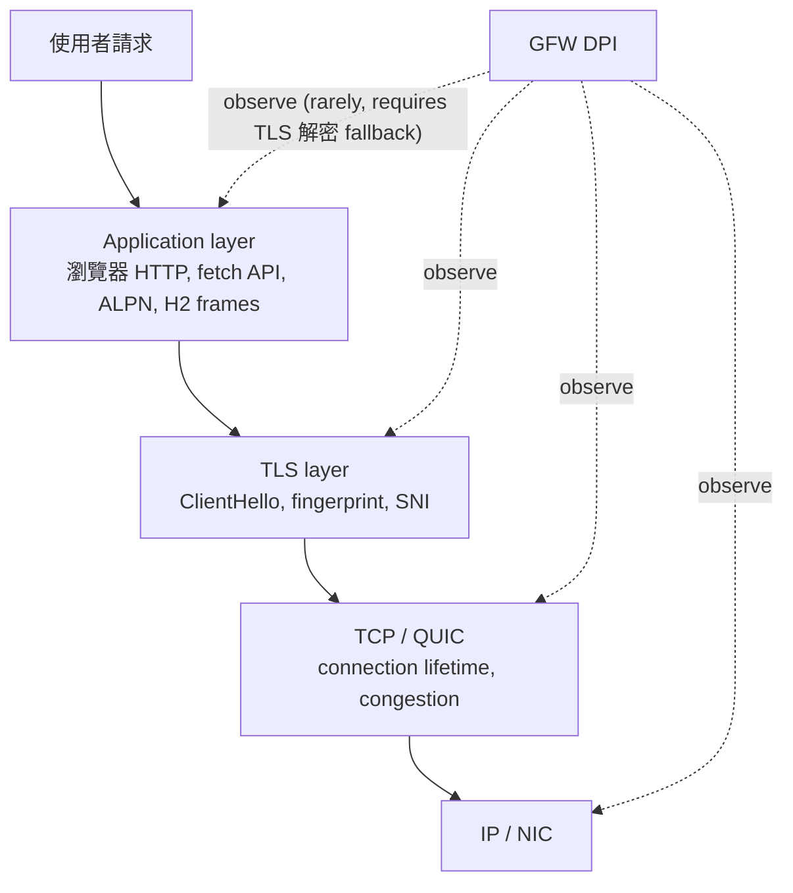
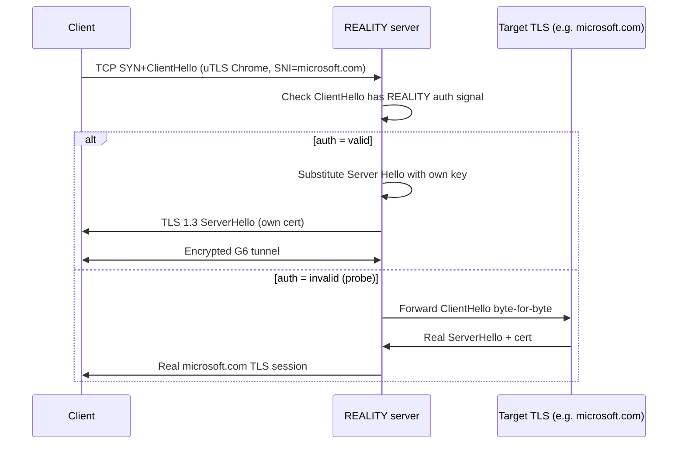
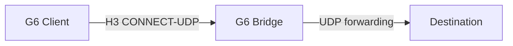

# 課堂 10.8 — 連線級偽裝 vs 應用級偽裝：HTTPS / 瀏覽器 / 合法應用

## 學前知道
- 前置課：10.6（PT）、10.7（regularization）、Part 4（TLS/QUIC handshake）
- 預計閱讀時間：50–70 分鐘
- 必讀論文 / spec：
  - Frolov & Wustrow (2019), *The use of TLS in Censorship Circumvention*, NDSS — uTLS
  - Xray-core REALITY spec (2023): `transport/internet/reality/` 原始碼 + Xray 官方 docs
  - Trojan-GFW spec: `trojan-gfw/trojan` README + protocol.md
  - VLESS protocol spec: Xray-core docs
  - **TLS-in-TLS detection** (2023): Wu et al. 24 (PETS or Internet Measurement) — TLS encapsulated inside TLS 的指紋
  - Wails, Sun, Johnson, Chiang, Borisov (2018), *Tempest: Temporal Dynamics in Anonymity Systems*, PoPETs
  - Holland et al. 2021 PoPETs, *New Directions in Automated Traffic Analysis* — application-aware classifier
  - Taylor, Spolaor, Conti, Martinovic (2016), *AppScanner: Automatic Fingerprinting of Smartphone Apps from Encrypted Network Traffic*, IEEE EuroS&P
  - Van Ede, Bortolameotti, Continella, Ren, Dubois, Lindorfer, Choffnes, van Steen, Peter (2020), *FlowPrint: Semi-Supervised Mobile-App Fingerprinting on Encrypted Network Traffic*, NDSS
  - Liu, He, Liu, Chen, Sheng, Sun, Zhu, Li (2019), *FS-Net: A Flow Sequence Network For Encrypted Traffic Classification*, INFOCOM
- 必讀原始碼：
  - https://github.com/XTLS/Xray-core/tree/main/transport/internet/reality
  - https://github.com/refraction-networking/utls
  - https://github.com/trojan-gfw/trojan

## 動機

10.6 把「整條連線」級的 PT 整理過——把 Tor 流量包成 obfs4 / meek / Snowflake / Conjure。本堂要把焦點細化：**連線級 (transport) 偽裝 vs 應用級 (application) 偽裝**——這兩條路在 SOTA 翻牆協議中是並用的，但概念上要分開。

對 G6 重要：

- 連線級：TLS / QUIC handshake、SNI、ALPN、cipher suite、JA3/JA4 fingerprint。
- 應用級：HTTP/2 frame、CONNECT proxy、CDN behavior、JavaScript fetch pattern。
- **GFW 的 detection rule 同時打兩層**——所以兩層都要做。

## 核心概念

### 一、為什麼分兩層



- GFW **不能直接看 application layer**（TLS 加密保護）。但能透過 sequence/timing 推斷。
- GFW **能看 TLS-layer fingerprint**（ClientHello、SNI、SAN）。
- GFW **能看 connection-level**（lifetime, packet sizes）。

VLESS+REALITY 主要打前兩層；Hysteria2 主要打 connection-level（QUIC）。**這是兩條 design philosophy 的代表。**

### 二、Connection-level 偽裝：JA3 / JA4 與 uTLS

#### JA3 fingerprint

```
JA3 = MD5( TLSVersion + Cipher + Extensions + EllipticCurves + ECPointFormats )
```

每個 client TLS implementation 的 fingerprint 不同：
- Chrome 117: `f4febc55ea12b31ae17cfb7e614afda8`
- Firefox 120: 不同
- Go default crypto/tls: 完全不同（GFW 一眼看穿）
- Python requests: 不同

**JA4** 是 2023 後出的更精準版本（FoxIO 提出），包含更多 contextual info：
```
JA4 = "t13d1516h2_8daaf6152771_b186095e22b6"
        ^^^^^   ^^                  ^^
        TLS 版本 ALPN              Extensions hash
```

#### uTLS 的作用

Go / Rust 的標準 crypto library JA3 唯一可識別。**uTLS** 讓 client 程式可以選 「parrot」 某個瀏覽器 fingerprint（Chrome 117, Firefox 119, Safari 16 等）。

```go
import "github.com/refraction-networking/utls"
conn := utls.UClient(rawConn, &utls.Config{...}, utls.HelloChrome_120)
conn.Handshake()  // ClientHello 看起來與 Chrome 120 一樣
```

**G6 必須用 uTLS 或同類庫**。直接用 Go std lib 等於自殺。

#### JA3 / JA4 偽裝的細節 pitfall

1. **Cipher suite order**：必須完全與目標瀏覽器一致。
2. **Extension order**：同上。
3. **GREASE values**（RFC 8701）：Chrome 用 GREASE 隨機填入「保留」cipher。uTLS parrot 必須含 GREASE。
4. **ALPN**：Chrome 主要 `h2, http/1.1`。
5. **Padding extension**：Chrome 加 padding 讓 ClientHello = 512 bytes（為了 buggy middleboxes）。

**uTLS Chrome 120 ≠ Chrome 121**——版本必須跟著最新瀏覽器升級。**這是 G6 的 maintenance burden。**

### 三、SNI 偽裝：domain fronting / ESNI / ECH / REALITY

#### Domain fronting（已死）

SNI = allowed.com、Host header = blocked.com。CDN 路由按 Host。**已被 Google/Amazon 在 2018 政策性關閉。**

#### Encrypted SNI (ESNI) / Encrypted Client Hello (ECH)

ESNI 是 ECH 的前身（draft，2018–2020）。ECH 是 RFC 9180-based 的 SNI 加密提案，2024 仍在 IETF TLS WG。

**運作**：
- DNS HTTPS record 提供 ECH config (含 public key)。
- Client 用該 key 加密真 SNI，包進 ClientHello 的 ECH extension。
- 外層 ClientHello 含 outer SNI = "公開的 cdn host"。
- Server 解外層後 fwd to 真實 service。

**ECH 部署**：Cloudflare 2024 已 enable；Chrome 116+ 支援。**但 GFW 已開始 block ECH-enabled ClientHello**（detect ECH extension 即 block）。**ECH 在中國 ineffective**。

#### REALITY（Xray 2023）

**設計：** 不依賴 ECH。直接「proxy 到真實 TLS server」。



**核心特性**：
- For un-authenticated probe：bridge 真的 serve `microsoft.com` traffic（active probing 失效）。
- For authenticated client：bridge 用自己 key 替換 ServerHello，建立 G6 tunnel。
- **Client/server 用 X25519 short-term key 配對**——所以同一 client probe 兩次能得到不同 server cert（不洩 bridge identity）。
- **不依賴 CDN 或 ISP cooperation**。

**REALITY 的弱點**：
- ServerHello 的 cert 是 「self-substituted」——它不是真 microsoft cert，所以 TLS verification 由 client side bypass。client side 必須 know REALITY public key。
- 對手若能 monitor real microsoft.com 流量分布 + 比對 bridge 流量，**仍可能用 stat correlation detect** —— 但代價極高（要 monitor 整個 Internet）。
- **TLS-in-TLS detection (Wu 24)** 是 emerging concern：REALITY tunnel 內部仍跑 TLS（如果 G6 tunnel 上有 TLS）→ 內外 TLS 可被 nested fingerprint 偵測。**G6 設計時要避免 「真 TLS over REALITY TLS」 這種 stack**——本身就提供 inner TLS 線索。

### 四、Application-level 偽裝：HTTP/2 over CONNECT

#### 基本想法

不只 wrap byte——而是 **真的跑 HTTP/2 with CONNECT method** 來建立 proxy tunnel。

```http
:method = CONNECT
:authority = bridge.example.com:443
:protocol = (optional, RFC 8441 for WS over H2)

(server returns 200)
... bidirectional DATA frames carry tunneled bytes ...
```

**好處**：
- HTTP/2 frame structure 是 standardised，DPI 完全認識。
- CONNECT 在 H2 是 standard method（用於 forward proxy）。
- 真實 Chrome 透過 system proxy 設定可以發 CONNECT request。

**這是 MASQUE WG（IETF）的核心方向**——CONNECT-UDP、CONNECT-IP、CONNECT-Ethernet 系列 RFC。

#### MASQUE 的 G6 應用



- 用 HTTP/3 (QUIC) CONNECT-UDP/IP 隧道。
- Wire 上看起來完全是 H3 流量。
- 對 GFW：跟 Cloudflare H3 traffic 同類。

**G6 拿 MASQUE 作為 transport baseline 是強選擇**——標準化、有 multi-implementation（quiche、quinn、msquic、ngtcp2）、攻擊面隨 IETF 演化共享。

### 五、TLS-in-TLS detection（emerging threat）

#### 概念

如果你的協議在 TLS-on-TLS 結構上（外層 TLS to bridge + 內層 TLS to real destination），GFW 可看到：

1. 外層 TLS handshake 結束後立刻有 「TLS record 包著 TLS handshake」 pattern。
2. 內層 TLS handshake 的 record size 序列有 specific signature（即使外層加密，size pattern 不變）。
3. 用 deep classifier 可 detect nested TLS。

#### Wu et al. 2024 (preprint/PETS)

提出 「TLS-in-TLS detection rule」：
- ClientHello-size record 出現於 connection 開頭後 ~50ms（建外層 TLS 後）。
- 5 個連續 TLS handshake-size pattern 內部疊現。

**對 G6**：
- 如果 G6 外層 = REALITY TLS，內層 G6 應用 = 純 binary stream（不再 TLS），可避開 TLS-in-TLS pattern。
- 如果 user end-to-end 是 HTTPS（例：browser → G6 client → G6 bridge → real-https-server），這個 stack 天然有 TLS-in-TLS。**這是必然存在的 deployment scenario**。
- G6 must shape internal TLS handshake to **不像 internal TLS handshake**——或用 inner non-TLS protocol（如 H2 plaintext over TLS）。

**Open research question**：能不能 「破除」 TLS-in-TLS 簽名而不犧牲 end-to-end security？

### 六、App-level fingerprinting：AppScanner / FlowPrint

#### AppScanner (Taylor 16 EuroS&P)

從加密流量 fingerprint **手機 app**：
- 流量切成 flow（5-tuple）
- 每個 flow 提 size/time features
- RF classifier → app ID
- 110 apps，accuracy 70–90%

#### FlowPrint (van Ede 20 NDSS)

進階版：
- semi-supervised → 不需所有 app pre-labeled
- 多 flow 同時 cluster
- 對 unknown app robust
- 200+ apps，accuracy 88%+

#### 對 G6 的意義

App-level fingerprinting 表明：**「即使你 wrap 整個 traffic 進 G6 tunnel，inner app 仍可能 fingerprint」**——例如 Telegram 與 WeChat 的 inner traffic shape 不同，從 G6 tunnel 外仍可區分。

**G6 必須在 inner-payload 層做 normalization**（如 padding 到 fixed-rate），或 explicitly scope out（threat model 中標明 「不 protect inner app fingerprinting」）。

### 七、Holland 21 PoPETs "New Directions in Automated Traffic Analysis"

#### 思路

從多個並行 flows 用 graph 結構建模——比 single flow 更強。具體：
- node = flow
- edge = co-occurrence in same TCP session / same time window
- GNN-based classifier

對 G6：multi-flow correlation 是 next-gen attack。G6 應在 client 端避免「同時多 flow 都明顯 G6 標識」。

### 八、Liu 19 FS-Net (INFOCOM)

純 attack：deep flow-sequence network，把每個 flow size sequence 餵 RNN，classifier。
- 對 encrypted traffic 90%+ accuracy categorize for app type。
- 對抗：必須 normalize 「flow-level size sequence」。

### 九、Connection-level vs application-level 設計取捨

| 層 | 防禦工具 | Cost | Coverage |
|---|---|---|---|
| TCP/QUIC | constant-rate, multipath | high lat/bw | 連線生命週期、IP-level |
| TLS handshake | uTLS, REALITY | small (一次性) | JA3/JA4 fingerprint |
| TLS record | padding to record-size boundary | small bw | record size pattern |
| HTTP/2 frame | proper SETTINGS/PING | small | H2 protocol conformance |
| App data | end-to-end normalize | varies | inner app fingerprinting |

**G6 設計：TLS 用 REALITY + uTLS；HTTP/2 用 proper conformance；TCP-level 用 Maybenot shaping；inner payload 用 G6 own framing（不 nest TLS）。**

## 與我們協議設計的關聯

1. **G6 transport = MASQUE-based H3** ；handshake 走 uTLS Chrome；inner 用 G6 framing（不 nest TLS）。
2. **Bridge auth = REALITY-style**：unauthenticated 流量 fallback 到 real CDN proxy。
3. **TLS-in-TLS-aware**：G6 不在 G6 tunnel 內 nest 第二層 TLS；user app TLS 由 user 自己負責。
4. **No mimicry**：所有 wire bytes 必須是 real H3 frames，不只 H3-shaped random。
5. **Maintenance burden**：uTLS Chrome 版本要每 6 個月 sync 一次。

## 動手（可選）

### 實驗 A：跑 JA3 fingerprint scanner

```bash
git clone https://github.com/salesforce/ja3
python ja3.py -i your.pcap
```

對比 Chrome、Go default、uTLS-Chrome、curl 的 JA3 hash。

### 實驗 B：跑 REALITY server

Xray docs 提供完整步驟：
```bash
xray run -c reality-config.json
# probe (without auth)
curl https://your-bridge.example.com  # 應該返回 microsoft.com content
# auth client
xray run -c reality-client.json  # 應該建立 G6 tunnel
```

### 實驗 C：跑 TLS-in-TLS detection rule on G6

寫 detector 找 「TLS record size + handshake-like sub-record sequence」。在 G6 流量上跑——確認 inner 不 nest TLS 後 detector 失效。

## 自我檢查

1. JA3 與 JA4 差別在哪？為什麼 JA4 更難 spoof？
2. ESNI、ECH、REALITY 三條路為什麼是「平行而非串行」演化？哪些 GFW 都 block 了？
3. MASQUE 的 CONNECT-UDP 在 G6 中扮演什麼角色？比直接用 IPSec 好在哪？
4. TLS-in-TLS detection 為什麼是 emerging threat？G6 怎麼設計能避免？
5. AppScanner / FlowPrint 對 G6 提供哪些 inner-app protection 需求？G6 該負責這層嗎？

## 延伸閱讀

- IETF MASQUE WG charter
- ECH draft（draft-ietf-tls-esni）
- Xray-core REALITY 原始碼（必讀）
- FoxIO JA4 spec

---

## 研究級補遺

### 1. 學界詞彙

- **JA3 / JA4**: TLS ClientHello fingerprint
- **uTLS**: micro-TLS, parrot-able fingerprint library
- **REALITY**: Xray's proxy-to-real-TLS-server trick
- **ECH / ESNI**: Encrypted Client Hello / Server Name Indication
- **Domain fronting**: SNI vs Host mismatch via CDN
- **MASQUE**: IETF WG for tunneling over HTTP
- **CONNECT-UDP/IP/Ethernet**: H2/H3 method extensions for tunnelling
- **TLS-in-TLS**: nested TLS, detectable via record-size pattern
- **AppScanner / FlowPrint**: app-level traffic fingerprinting
- **GREASE values**: TLS reserved random values (RFC 8701)

### 2. 對手分類學

- **DPI box**：看 SNI / ClientHello bytes
- **Stat ML DPI**：byte distribution + timing
- **Active probing**：obfs4 / REALITY 各有 defense
- **TLS-in-TLS detector** (Wu 24+)：emerging
- **Multi-flow correlation** (Holland 21, FS-Net)：next-gen
- **Long-term temporal** (Tempest)

### 3. 形式化定義

**TLS fingerprint indistinguishability**

> Client TLS impl $\Pi$ is JA-indist from browser $B$ if $JA3(\Pi) = JA3(B)$ 且 $JA4(\Pi) = JA4(B)$ 在當前 $B$ 版本下。

注意：**這是 byte-equality**，不是 statistical。一個 byte 差就破局。

**Active-probing fallback consistency**

> REALITY-style server $S$ for target $T$ is fallback-consistent if for any unauthenticated client query $q$: $\Pr[S(q) \approx T(q)] \geq 1 - \mathsf{negl}$ on every observable measure (response cert, response timing, response body).

### 4. 領域的關鍵論文

- uTLS (NDSS 19, Frolov–Wustrow) — **必讀**
- REALITY spec (Xray 2023) — **必讀**，Part 7 詳論
- MASQUE drafts: draft-ietf-masque-connect-udp, draft-ietf-masque-connect-ip
- ECH: draft-ietf-tls-esni
- Wu 24 TLS-in-TLS detection — **必讀**（如有 publication）
- AppScanner (EuroS&P 16), FlowPrint (NDSS 20), FS-Net (INFOCOM 19)
- Tempest (PoPETs 18)

### 5. 我們協議的座標

| 屬性 | obfs4 | meek | VLESS+REALITY | **G6 計畫** |
|---|---|---|---|---|
| Transport | TCP custom | TLS to CDN | TLS-mimic to bridge | **H3 over QUIC (MASQUE)** |
| Handshake fingerprint | own | Chrome via real CDN | uTLS Chrome | **uTLS Chrome (auto-sync)** |
| Active probing | HMAC silent | CDN fallback | REALITY fallback | **REALITY-style fallback** |
| SNI strategy | own | real CDN host | mimicked domain | **uTLS + REALITY + ECH if available** |
| Application data | binary | HTTP | binary inside H2 | **H3 frame conformant** |
| TLS-in-TLS risk | none | low | medium | **handled by avoiding inner TLS** |

### 6. 必追資源

- IETF MASQUE / TLS WG mailing lists
- FoxIO JA4 GitHub: https://github.com/FoxIO-LLC/ja4
- Cloudflare Research blog
- Xray-core / sing-box code reviews
- GFW.report: SNI / TLS detection posts

### 7. 開放問題

1. **ECH 在中國的可用性**：是否能設計 「自帶 ECH server」 不依賴公 DNS 的方案？
2. **MASQUE 大規模部署的 fingerprintability**：當 H3 流量還少，G6 H3 可能是 「outlier」；該如何 anticipate？
3. **TLS-in-TLS 的 fundamental detection limit**：sized-based pattern 能多 reliably 提取？是否能完全 mask？
4. **uTLS maintenance cost amortization**：能否自動 generate uTLS profile from real Chrome traffic dumps？
5. **Application-layer fingerprint 對 G6 的 scope 界定**：使用者 inside G6 跑哪些 app 應該被 protect？或這是 user responsibility？
