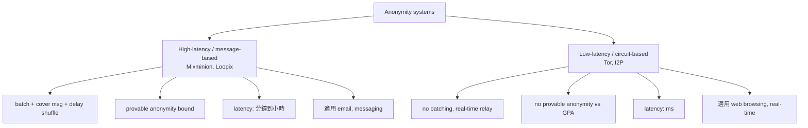
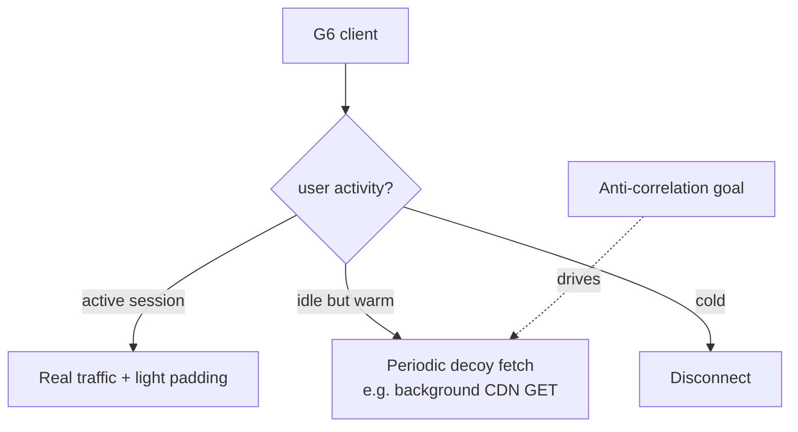

# 課堂 10.9 — Probabilistic decoy traffic：cover-traffic 的設計取捨

## 學前知道
- 前置課：10.1（capacity）、10.5（defense）、10.7（regularization）
- 預計閱讀時間：40–60 分鐘
- 必讀論文：
  - Chaum (1981), *Untraceable electronic mail, return addresses, and digital pseudonyms*, CACM
  - Danezis, Dingledine, Mathewson (2003), *Mixminion: Design of a Type III Anonymous Remailer Protocol*, IEEE S&P
  - Piotrowska, Hayes, Elahi, Meiser, Danezis (2017), *The Loopix Anonymity System*, USENIX Security
  - Diaz, Murdoch, Troncoso (2010), *Impact of Network Topology on Anonymity and Overhead in Low-Latency Anonymity Networks*, PETS
  - Wails, Sun, Johnson, Chiang, Borisov (2018), *Tempest: Temporal Dynamics in Anonymity Systems*, PoPETs
  - Shmatikov & Wang (2006), *Timing Analysis in Low-Latency Mix Networks: Attacks and Defenses*, ESORICS
  - **Cover traffic 經典分析**：Levine, Reiter, Wang, Wright (2004), *Timing Attacks in Low-Latency Mix Systems*, FC
  - **Sphinx packet format** Danezis, Goldberg (2009), *Sphinx: A Compact and Provably Secure Mix Format*, IEEE S&P
  - Gellert et al. (2024) PoPETs — modern padding analysis
  - **Karaoke / Vuvuzela / Atom 系**: messaging system with formal anonymity
  - Lazar, Gilad, Zeldovich (2017), *Karaoke: Distributed Private Messaging Immune to Passive Traffic Analysis*, OSDI
  - Van den Hooff, Lazar, Zaharia, Zeldovich (2015), *Vuvuzela: Scalable Private Messaging Resistant to Traffic Analysis*, SOSP
  - Hsiao, Kim, Perrig (2015), *On Traffic Camouflage with Constant Rate Channel*, IEEE Comm
- 必讀原始碼：
  - https://github.com/nymtech/nym （Loopix-derived production mixnet）
  - https://github.com/dedis/onet
  - https://github.com/karaoke-messaging

## 動機

之前 lessons 講的 defense（padding, splitting, morphing）都是 「對既存 user traffic 做變形」。本堂講 **「主動生成假流量 (cover traffic / decoy)」**——這是達成 capacity bound 的最後手段。

關鍵概念：

> Any defense without cover traffic has capacity bound bounded by H(real traffic pattern). 只有引入 cover traffic 才能用「無 user activity 時的常駐流量」把 capacity 真正壓低。

但 cover traffic 有極大代價：

- **頻寬 overhead 100%+**（一直跑 dummy）
- **能耗（mobile 場景致命）**
- **CDN/伺服器資源**

本堂梳理 cover-traffic 設計空間，並評估 G6 是否可採用部分 cover-traffic（"selective cover"）。

## 核心概念

### 一、Cover traffic 的根源：Chaum 1981 mix-net

**Chaum 1981 CACM** 提出 anonymous email 設計：mix 接收 message，shuffle 後送出。若所有 mix 入站/出站 batch 大小固定，則對手無法 link in-out。

**這需要**：batch 內若有真實 message 不足，**mix 自己 generate 假 message**——即 cover traffic。

**核心命題**：**cover traffic 是 anonymity 的必要條件**（在「對手能觀察 mix in/out」場景下）。

### 二、低延遲 vs 高延遲 anonymity systems



- **High-latency systems**: cover-traffic 自然嵌入 batch 機制，可達 formal anonymity bound。
- **Low-latency systems (Tor-like)**: cover-traffic 用於混淆 timing，但 effect 弱。

**G6 屬於 low-latency**——但要研究能不能引入 partial cover traffic 提升保證。

### 三、Loopix（Piotrowska 17 USENIX Sec）

#### 設計

continuous-time mix network：
- 每個 user 持續發 messages（loops）—— 真實 message + cover loops 不可區分。
- Cover loops 從 user 自己發回自己（self-addressed），純為混淆。
- mix server 用 exponential delay 隨機 hold 每個 packet。

#### Formal guarantee

- 給對手 observation budget B（觀察到 B 個 packets），匿名性下界以 $H_\infty$ 形式給出。
- **第一個 low-latency-ish system 同時有 formal anonymity proof**。
- 部署於 Nym (nymtech.net)。

#### 對 G6 啟示

- **Cover loops 概念可借鑑**——G6 client 在 idle 時持續發 cover packets 到 G6 server（或 self-loop）。
- **但 cost：頻寬 overhead 100%+**。對 web/streaming 太貴。
- **可作為 「opt-in 安全模式」**：使用者在高敏感場景時 enable。

### 四、Vuvuzela & Karaoke：messaging cover-traffic 系

#### Vuvuzela (SOSP 15)

- N 個 user，每個 round 都發一個 fixed-size message（真實或 cover）。
- Server 在 round 內 shuffle 所有 message，用 differential privacy noise 模糊 「誰跟誰通訊」。
- $(\varepsilon, \delta)$-DP anonymity guarantee.

#### Karaoke (OSDI 17)

Vuvuzela 進化版：
- 加入「mix chain」結構降低 single mix server 信任需求。
- Cover traffic 跟 real message 在 size + timing 完全一致。

#### 對 G6 啟示

- DP-style anonymity bound 在 messaging 場景下 reasonable（latency 容忍高）。
- 對 web 場景過貴。

### 五、Tor 的 cover traffic 嘗試

Tor 歷史上嘗試過幾種 cover traffic：

- **circuit-level padding**：兩個 connected hops 之間 inject dummy cells。實作於 padding-spec proposal 254。
- **意義小**：對抗 long-time correlation 略有效，但對 single-trace WF 無感。
- **Tor 主要 padding 是 connection-level**（IPC-style），不是 user-level cover loops。

**結論**：Tor 沒走 Loopix 路。Tor 是 low-latency anonymity，cover traffic 的 cost-benefit 對 web 不划算。

### 六、Cover-traffic 的設計參數

| 參數 | 範圍 | trade-off |
|---|---|---|
| Cover packet size | fixed (cell-like) vs random | fixed 易設計 game-theoretic |
| Cover rate (idle) | 0 (no cover) 到 等同 real | 線性 cost |
| Cover destination | self-loop vs decoy-real-website vs mix-server | 影響 traffic stats |
| Cover schedule | poisson / deterministic / batched | poisson 最好 plausible-looking |
| Trigger | always-on vs only-when-suspicious | adaptive 可降 cost |
| Coordinator | client-only vs client/server-synced | synced 可生成 indist pair |

### 七、selective cover：G6 可採的妥協方案

**完整 cover (Loopix-style) 太貴**。G6 可採 **selective cover**：



- 在 user idle 期間，G6 client 在 background 對 「decoy real CDN」（如 fetch JSON 從 ajax.googleapis.com）做 periodic fetch。
- 這些 decoy fetch 看起來像「web browser 在後台 keep-alive」。
- 對手無法區分「真有 traffic」與「無 traffic 但 cover」。

**Cost 估算**：~5–10 KB/min cover traffic ≈ 10MB/day。可接受。

### 八、Constant-rate cover 與 G6 capacity bound

回到 10.1：**Channel capacity = 0 ⟺ output 與 input 統計獨立**。**Constant-rate channel (input-independent output)** 是達到 $C = 0$ 的唯一方法。

**典型 constant-rate 設計**：
- Rate $\rho$ (packets/sec) 全程固定。
- 每個 slot：若有 real data 則填；無則填 dummy。
- 對手看到的 trace size = $\rho \cdot T$，與 user 真實活動完全獨立。

**Cost**：bw overhead = 100% (real ≪ rate) ~ 0% (real ≈ rate)。
**典型 use-case**: 已知 user 一直在做 voice call 等 continuous activity。

**G6 模式 B "high-assurance mode"**：constant-rate 36 kbps，模擬 VoIP session。對 voice/messaging 用例適合，對 web 不適合。

### 九、Cover traffic 的攻擊面

#### 攻擊 1: "real vs cover" 區分

如果 cover packet 與 real packet 在某 metric 上有 distinguishable distribution（如 size、timing 細節），對手可 separate cover from real，**只在 real 上做 WF**。**Loopix 的 cover loops 必須與 real packet 同 format + 同 destination distribution**。

#### 攻擊 2: cover schedule 反向推 user activity

如果 cover 用 「user idle 才發」 mode，對手能觀察到 「cover 發 ⇔ user 真實 inactive」。**這反洩 user 行為**。**選 always-on 才安全**。

#### 攻擊 3: cover destination 推 user

如果 cover loop 都送到 G6 server，對手見到 「持續流到 G6 server」 itself 是 signature。**Cover destination 應多樣化**（多 CDN、多 endpoint）。

#### 攻擊 4: long-term aggregation

即使 cover 在 single-trace 完美 mask，多 trace 對手仍能 aggregate。**Cover-traffic 不是 silver bullet，要與其他 defense (shaping, splitting) 組合。**

### 十、形式化：cover traffic 的 capacity argument

Setup: input $X$ (user activity), defense $D$, output $Y$. Without cover: $Y = D(X)$. With cover $Z$ (independent of $X$): $Y = D(X) + Z$（疊加，channel model）.

**Mutual info change**:

$$I(X; D(X) + Z) \leq I(X; D(X))$$

若 $Z$ 是 high entropy 且 independent，**lhs 顯著下降**。Cover traffic 是 noise channel，按 Shannon noisy-channel 理論減 mutual info。

**極限**：當 $Z$ 的 entropy $\to \infty$，$I(X; Y) \to 0$。**對應 Loopix 的 「dummy traffic dominates」 設計**。

**對 G6**：cover-traffic 帶來的 capacity 下降是 quantifiable。Part 11 設計 G6 時，evaluate cover rate $\rho_z$ → 量 $I$ 下降，挑 Pareto-optimal $\rho_z$。

## 與我們協議設計的關聯

1. **G6 default mode = light selective cover**：~5–10 KB/min，destination 多樣化。
2. **G6 high-assurance mode = constant-rate 36 kbps**：voice/messaging 用，capacity $\approx 0$。
3. **Cover packet 必須 indist from real**：size、timing、destination 全 match。
4. **Avoid 「cover only when idle」陷阱**：always-on。
5. **形式化 capacity report**：在 G6 evaluation 中給 $(\rho_z, \hat{C})$ 表。

## 動手（可選）

### 實驗 A：跑 Loopix simulator

```bash
git clone https://github.com/nymtech/nym
cargo run --example simple-mix-network
```

觀察 dummy loop 數量與 anonymity bound 之間關係。

### 實驗 B：實作 selective cover 概念

寫 Python client：
- 每 60–120s 隨機向 List of decoy CDN URLs 做 HTTPS GET (size 隨機 5–50 KB)。
- 並行跑 Tor browsing 流量。
- 跑 DF on 結合 trace——觀察 accuracy 變化。

### 實驗 C：constant-rate channel 模擬

寫一個 36 kbps fixed-rate channel：
```python
import time
slot_interval = 1.0 / 60  # 60 packets/s
packet_size = 75  # bytes ≈ 36 kbps
while True:
    if has_real_data():
        send(real_data())
    else:
        send(dummy(packet_size))
    time.sleep(slot_interval)
```

對 idle 時 wire trace 用 DF 跑——應該無法區分 「user idle」 vs 「user active」。

## 自我檢查

1. 為什麼 Tor 沒走 Loopix 路？哪個 trade-off 對 web browsing 致命？
2. Loopix 的 cover loops 與 Vuvuzela 的 cover msg 設計差異是？哪個更適合 messaging？
3. Selective cover (G6 default) 與 always-on cover 的安全差異？什麼 attack 是 selective 無法 cover 的？
4. Constant-rate channel 為什麼能達到 $I(X; Y) = 0$（理論上）？實務上達不到的原因？
5. Cover destination 若集中在 G6 server，會洩什麼資訊？G6 design 怎麼避免？

## 延伸閱讀

- Sphinx packet format (Danezis-Goldberg 09): mixnet 加密 envelope 標準。
- Mathewson & Dingledine 04: Mixminion design.
- Nym: production Loopix
- Anytrust (Atom) by Dissent project

---

## 研究級補遺

### 1. 學界詞彙

- **Cover traffic / decoy / dummy**: 同義
- **Loop traffic**: client-to-self cover (Loopix terminology)
- **Mix-net**: Chaum 1981 anonymity system
- **Constant-rate channel**: input-independent output rate
- **Sphinx packet**: fixed-size mixnet packet format
- **Poisson cover schedule**: exponential-IAT cover packet
- **Selective cover**: 只在 specific condition 發 cover
- **Cover indistinguishability**: cover ≈ real distribution

### 2. 對手分類學

- **Global Passive Adversary (GPA)**: 觀察整網。Mixnet 的目標威脅。
- **On-path local adversary**: 只看 user-bridge link。本堂主要 target。
- **N-server compromise**: mixnet 中 N 個 server 被 compromise（Loopix 公式有對應 bound）。
- **Long-term aggregator**: 多 trace 跨時段。Cover 對應策略需要 always-on。

### 3. 形式化定義

**Anonymity entropy** (Serjantov-Danezis 02, 已在 10.1)：$\mathcal{A}(\mathcal{S}) = -\sum_u p(u) \log_2 p(u)$.

**Loopix anonymity bound**：

> For each message, anonymity set entropy ≥ $\log_2(N \cdot \lambda_L \cdot \mu / \lambda_P)$，where $N$ = active users, $\lambda_L$ = loop rate, $\mu$ = mean mix delay, $\lambda_P$ = payload rate.

公式給出：**cover rate $\lambda_L$ 越高，匿名性越強**（線性）。

**Constant-rate channel capacity**：

> Channel $D$ outputs at constant rate $\rho$ ⟹ $I(X; D(X)) \leq H(\text{dummy distribution})$, with equality when dummies 與 real packet 不 distinguishable.

實務上 inequality 是 strict（dummies 在 implementation level 與 real 有 subtle 差別）—— **這是 G6 testing 的關鍵 audit point**。

### 4. 領域的關鍵論文

- **Chaum 1981**：mixnet 起點
- **Mixminion (S&P 03)**, **Sphinx (S&P 09)**：高延遲 mixnet 主軸
- **Loopix (USENIX Sec 17)**：modern continuous-time mixnet
- **Vuvuzela (SOSP 15) / Karaoke (OSDI 17) / Atom (OSDI 18)**：metadata-private messaging
- **Diaz et al. PETS 02**：anonymity entropy 定義
- **Wails 18 PoPETs Tempest**：long-term temporal dynamics

### 5. 我們協議的座標

| Mode | Cover strategy | Cost | Capacity bound |
|---|---|---|---|
| G6 light (default) | Selective ~5KB/min, multi-CDN decoy fetch | <2% bw | medium |
| G6 medium | Always-on cover loops to multi destinations | ~30% bw | low |
| G6 high | Constant-rate 36kbps | 100%+ bw | ~0 |
| G6 messaging | Vuvuzela-style batched (future) | round-trip latency | DP bound |

### 6. 必追資源

- Nym Tech blog & papers
- PoPETs anonymity-system tracks
- Loopix paper supplementary code

### 7. 開放問題

1. **G6 selective cover 的 capacity formula**：sparse cover 到底 reduce 多少 $I$？沒 closed-form。
2. **Cover-traffic 與 streaming use case**：能否設計與 streaming pattern 相容的 cover scheme？streaming 已 high bw，cover 較好嵌入。
3. **Cover-traffic 與 mobile energy**：mobile device 一直發 dummy 對電池傷害大。**energy-aware cover** 是 open problem。
4. **DP-style anonymity bound for low-latency systems**：Tor / G6 是否能給出 DP-form 保證？目前 high-latency systems 才有。
5. **Cover destination strategy formal optimization**：cover 該分散到多少 endpoints？distribution 該怎麼選？理論未深入。
