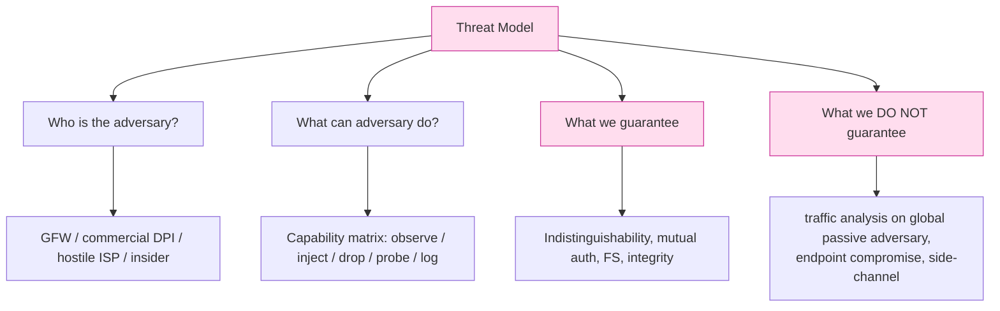
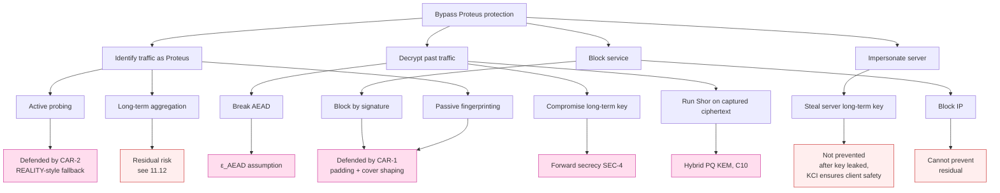

# 課堂 11.1 — 威脅模型完整撰寫

## 學前知道
- 前置課：Part 3（密碼學基底）、Part 4（TLS/QUIC），尤其是 4.3「TLS 1.3 security goals」。Part 5.1「為什麼要 formalize」。
- 前置論文（必讀）：
  - **Dolev & Yao**. *On the Security of Public Key Protocols*. IEEE TIT 1983. precis: [`notes/papers/dolev-yao-1983.md`](../../notes/papers/dolev-yao-1983.md)
  - **Saltzer & Schroeder**. *The Protection of Information in Computer Systems*. Proc. IEEE 1975. — 8 大設計原則的奠基論文（fail-safe defaults, least privilege, complete mediation, separation of privilege, psychological acceptability...）。
  - **Shostack**. *Threat Modeling: Designing for Security*. Wiley 2014. — STRIDE 框架的標準教科書。
  - **Ensafi, Park, Kapur, Crandall**. *Idle Scans through Side Channels*. USENIX Security 2010 + *Examining How the Great Firewall Discovers Hidden Circumvention Servers* (IMC 2015). precis: [`notes/papers/ensafi-gfw-probing.md`](../../notes/papers/ensafi-gfw-probing.md)
  - **Hoang et al.**. *How Great is the Great Firewall? Measuring China's DNS Censorship*. USENIX Security 2021. precis: [`notes/papers/hoang-gfwatch.md`](../../notes/papers/hoang-gfwatch.md)
  - **Wu, Cao, Houmansadr et al.**. *FEP: Fingerprinting Encrypted Proxy Traffic via Statistical Features*. USENIX Security 2023. precis: [`notes/papers/wu-fep-detection.md`](../../notes/papers/wu-fep-detection.md)
- 預計閱讀時間：60 分鐘
- 必讀原始碼：無（本堂為純文檔）

## 動機

設計階段的第一筆字就是寫**威脅模型**。

絕大多數安全失敗的根因，不是密碼學 broken、不是實作 bug——而是**對手能做的事比你假設的多**。Shadowsocks 在 2017–2019 被 GFW 大規模 detect，根因不是 AEAD 弱，而是設計者沒在威脅模型裡寫進「對手會做大規模流量統計與主動探測（active probing）」。Trojan、VLESS+TLS、REALITY 的迭代史，就是威脅模型逐次加強的歷史（Frolov et al., FOCI 2020；Bock et al., USENIX Security 2020）。

寫威脅模型不是公文，是**護身符**：

1. **它定義了你的安全宣稱（claims）。** 沒寫進威脅模型的攻擊，你就不必證明擋得住——但要明說「我們不保證」。
2. **它讓 formal verification 變得可能。** ProVerif / Tamarin 的輸入就是 channel model + adversary capabilities，等同於 Dolev-Yao 級威脅模型（Blanchet 2001；Meier et al. 2013）。
3. **它讓 review 變得可能。** 沒有 explicit threat model，review 者只能憑感覺；有了，每條 claim 都能逐項打勾或反駁。

本堂的產出是一份**可以單獨存在、可以拿給領域研究者 review** 的威脅模型文件（最終會 in-line 進 spec 的 Security Considerations，見 11.7）。

---

## 核心概念

### 1. 威脅模型由四部分組成

一份完整威脅模型必須回答：

1. **誰是對手？** 給對手畫像（身份、動機、資源）。
2. **對手能做什麼？** 列出對手的觀察能力與行動能力（capability matrix）。
3. **我們承諾保證什麼？** 用密碼學/網路屬性精確陳述（security goals）。
4. **我們明確不保證什麼？** Out-of-scope threats，直接寫出。

四項缺一不可。最容易被省略的是第 4 項——但它是 review 者第一個會質疑的部分。



### 2. 對手分類學：標準座標系

學界把網路對手沿三個軸切分（Cohn-Gordon, Cremers, Garratt; Krawczyk et al. 的 SIGMA 系列、Marlinspike X3DH paper 都採用此座標系）：

| 軸 | 端點 | 含義 |
|---|---|---|
| **位置** | on-path / off-path | 是否在受害者數據路徑上 |
| **動作能力** | passive / active | 是否能注入、修改、丟棄 packet |
| **時間延展** | snapshot / long-term | 一次性還是長期累積 |

衍生組合：

- **Off-path passive (OPP)**：旁聽公開介面（如 IXP mirror）。不能影響流量。最弱的網路對手。
- **On-path passive**：在路徑上能讀，但不改。傳統 Dolev-Yao 的「被動 adversary」即此。
- **On-path active (Dolev-Yao 完整版)**：能讀、能改、能丟、能注入、能延遲、能 replay。**標準 Dolev-Yao 對手**。GFW 即此。
- **Adaptive active**：在 active 基礎上能 query oracles（如 IND-CCA2 中的 decryption oracle）。密碼學常用。
- **Compromised insider**：對手控制至少一個合法 endpoint 或長期金鑰。觸發 forward secrecy、post-compromise security 等屬性。
- **Global passive adversary (GPA)**：能同時觀察「世界上每一條鏈路」。NSA 級。流量分析的 worst-case model（Tor 設計文件 Dingledine et al. 2004 即假設此）。

GFW 的具體座標（Ensafi 2015, Hoang 2021, Bock 2020）：

- **位置**：on-path（IXP 級 inline DPI 設備分布於全國 backbone）。
- **動作能力**：active（已知能 inject TCP RST、注 DNS response、發起 active probing 試探可疑服務端、selectively drop UDP 包）。
- **時間延展**：long-term（保留至少數月的 flow 級 metadata；對「曾經 active-probe 過、且確認為 proxy」的 IP 採取 long-term blacklist；可能對 SNI 做 multi-month aggregation）。
- **覆蓋**：sub-national 級 partial GPA（境內鏈路幾乎完整覆蓋，跨境出口集中於少數 entry point，等同於 entry-side 100% visibility）。

這給出 Proteus 設計的「實際對手」座標：on-path active + long-term + sub-national GPA。

### 3. STRIDE：對手「想幹什麼」的分類

Shostack 的 STRIDE 模型對應 6 種威脅類別（Shostack 2014, ch.3）：

| 縮寫 | 全稱 | 對 Proteus 的具體化 |
|---|---|---|
| **S**poofing | 假冒身份 | 對手偽裝成合法服務端（active probing 引你連線） / 偽裝成合法 ISP DNS |
| **T**ampering | 篡改資料 | 改 packet 內容、注 RST、改 SNI |
| **R**epudiation | 否認動作 | 不適用（Proteus 是 p2p，不需 audit log） |
| **I**nformation disclosure | 機密外洩 | 對手知道你連的網站、看出你在用 proxy、辨識協議 |
| **D**enial of service | 阻斷服務 | drop SYN、限速、強制 reconnect、IP 封鎖 |
| **E**levation of privilege | 提權 | 不適用（Proteus 是 transport，無 RBAC） |

對 anti-censorship transport，最關鍵是 **I（Information disclosure → protocol identification）** 與 **D（DoS via fingerprint-based blocking）**。S 是 active probing 的本質。T 直接導致 downgrade。R/E 在 transport 層不適用。

### 4. 對手能力 Matrix（Proteus 對手畫像）

下表是 Proteus 設計時假設對手具備的全部能力。每一條都要對應一個防禦點（11.12 會逐項驗證）。

| ID | 能力 | 來源證據 | 對應防禦設計位置 |
|---|---|---|---|
| **C1** | Inline read of full packet（含 payload）at sub-national IXP | Ensafi 2015；Bock 2020 §4 | AEAD 加密所有 payload；handshake 0-th byte randomized |
| **C2** | Inline modify / drop / inject TCP RST | Clayton-Murdoch-Watson 2006「Ignoring the Great Firewall of China」 | KCP/QUIC over UDP 路徑；TCP 路徑必含 RST-resilient retransmit |
| **C3** | Inject DNS responses（off-path also possible via residue path） | Anonymous, *Triplet Censors* IMC 2018；Hoang 2021 | DoH / DoQ + IP-literal bootstrap；DNS 不在威脅範圍假設可用 |
| **C4** | Active probing：對「可疑 IP:port」發起 TLS handshake、HTTP request、custom-protocol probe | Ensafi 2015；Frolov FOCI 2020「How China Detects and Blocks Shadowsocks」 | REALITY-style SNI 借用 / fallback to real cover server when handshake fails auth |
| **C5** | Flow-level fingerprinting：packet size histogram、IAT distribution、Markov chain、DL classifier | Wang-Goldberg 2013；Wu et al. FEP 2023 | Fixed-rate padding budget；mimic distribution from observed cover protocol |
| **C6** | Long-term passive aggregation：對 IP 累積 month-level flow stats，判 entropy | Wang et al. (Yale), IMC 2022 *Bypassing tunnels* | Per-session re-key、stable cover-server linking、rotate sub-IP |
| **C7** | Sub-national GPA：在 entry IXP 同時看到 client side 與 (claimed) cover server side | Houmansadr-Brubaker-Shmatikov 2013（Parrot is dead）的 entry-side discrimination 啟示 | REALITY 借的是「能 dial 進來的」cover server，entry IXP 看不到 server 對 cover 的 outgoing；要求 cover-server 須是 globally popular destination |
| **C8** | Endpoint compromise（client-side malware / RAM dump） | 一般 OS-level 對手 | **out of scope** — 由 host OS 提供保護 |
| **C9** | Long-term key compromise（伺服器 long-term static key 洩） | 一般運維風險 | **forward secrecy 保證**：被洩前的 session 不可解；KCI resistance |
| **C10** | Post-quantum capable adversary（將來能跑 Shor on captured ciphertext） | NIST PQC; Mosca's theorem (Mosca 2018) | Hybrid X25519 + ML-KEM-768 key exchange（Part 11.6 詳述） |
| **C11** | TLS-in-TLS detection via TCP-level metadata（即使 inner 全加密） | Xue et al. *TLS-in-TLS attack* USENIX 2024 | 不採用 TLS-in-TLS 結構；如必要走 MASQUE-CONNECT-UDP，inner 改 QUIC-on-QUIC |
| **C12** | DDoS / connection-rate flood from probing fleet | 一般 botnet | rate-limit；SPA-style port knocking 可選 |
| **C13** | Side channel: timing / cache / power on shared cloud host | Kocher 1996；Spectre 2018 | constant-time crypto；不假設能擋 hypervisor-level cache attacks（out of scope） |

> **注解**：C8、C13 列入 out-of-scope 是**有意的設計選擇**，不是漏寫。寫進矩陣是為了 review 者一目了然「為什麼不防」。

### 5. 我們保證什麼（formal security goals）

以下用「對 capability matrix 中某 subset 的 reduction」表達。所有 game 都按 IND-style / authentication-game-style 規範化（Bellare-Rogaway 1993；Krawczyk-SIGMA 2003）。

#### 5.1 機密性與完整性（against on-path active, C1+C2+C9 except long-term key not yet compromised）

```
Goal SEC-1 (Confidentiality):
  ∀ PPT adversary A controlling C1+C2,
    Adv^{IND-CCA2}_{Proteus.AEAD}(A) ≤ ε_AEAD(λ) + ε_KEM(λ) + negl(λ)
```

- AEAD：ChaCha20-Poly1305 或 AES-256-GCM。Adv 從 Bellare-Namprempre 2000、McGrew-Viega 2004 已知。
- KEM：hybrid X25519 + ML-KEM-768。Adv 為兩個獨立分支 IND-CCA security 取較小者（Bindel-Brendel-Fischlin-Goncalves-Stebila 2019 對 hybrid 的 reduction）。

```
Goal SEC-2 (Integrity / authenticated channel):
  Channel 為 INT-CTXT secure（Bellare-Namprempre 定義）。
```

#### 5.2 雙向認證（against impersonation, KCI, C4）

```
Goal SEC-3 (Mutual auth):
  Session 結束時雙方對 peer identity 達成一致；
  且即使 attacker 持 A 的 long-term static private key（A 的金鑰已洩）,
  A 仍對 honest B 的 identity 確認正確（KCI resistance, Krawczyk HMQV 2005）。
```

KCI 是 anti-censorship 特別重要的屬性：服務端 long-term key 洩後，attacker 可冒充 client 連 server，但**不該能反過來冒充 server 對 client 通信**。Noise IK / WireGuard 已驗證滿足此性質（Donenfeld-Milner 2018；Lipp-Blanchet-Bhargavan 2019）。Proteus 採同類設計。

#### 5.3 前向保密（against C9 future key compromise）

```
Goal SEC-4 (Forward secrecy):
  對任一已結束 session s，long-term key 在 s 結束之後洩露，
  不能 reveal s 的 traffic key。
```

由於每 session 用 ephemeral DH，trivially 滿足。

#### 5.4 抗區分（against C5+C6+C11 traffic analysis）

```
Goal CAR-1 (Censorship resistance / indistinguishability):
  ∀ classifier f trained on (Proteus traffic, cover-protocol traffic):
    | Pr[f(Proteus) = "Proteus"] - Pr[f(cover) = "Proteus"] | ≤ ε_CAR
  where cover-protocol = TLS 1.3-over-TCP-443 to (Cloudflare / popular CDN).
```

- ε_CAR 的具體目標見 11.2（精確量化版）。
- 注意這是 **distinguishing advantage**，不是 ROC/AUC 直觀讀法。Tschantz-Afroz-Paxson「SoK: Towards Grounding Censorship Circumvention in Empiricism」FOCI 2016 已論證該 metric 是 anti-censorship 領域唯一可比較指標。
- 必然 ε_CAR > 0：long-term aggregator + low padding budget 下，**完全 indistinguishability 不可能**。設計目標是 ε_CAR 在 attacker 的 false-positive budget 下「不划算開封鎖」。

#### 5.5 抗主動探測（against C4 active probing）

```
Goal CAR-2 (Active probing resistance):
  ∀ probe q from adversary not holding handshake secret,
    Proteus server's response to q is indistinguishable from
    real cover server's response to q.
```

由 REALITY-style 設計達成：server 若 handshake 認證失敗，**轉 forward 給真 cover server**，回應由 cover server 產生，attacker 看到的是 cover server 的真實 TLS certificate、真實 response time、真實 close behaviour。

### 6. 我們不保證什麼（out-of-scope）

明白列出。Review 第一步就會問到。

| Out-of-scope 屬性 | 為何排除 | 替代防禦或建議 |
|---|---|---|
| Global passive adversary 下的 unlinkability | 跨大陸的 packet-level correlation 已被多次 demo（Wang-Goldberg 2013 等）；任何低延遲 proxy 都做不到 | 用 Tor over Proteus if 需 unlinkability |
| Endpoint compromise (C8) | host OS 已被入侵時 transport 無能為力 | full-disk encryption + sandboxing |
| Cache / power side-channel (C13 部分) | shared cloud 假設不可信則整個 deployment model 不可行 | dedicated host or bare metal for high-risk deployments |
| Anti-tracing of human-level identity | proxy 只匿名 transport，不匿名行為 metadata | application-level anonymization |
| Spam / abuse on cover server | Proteus 是 transport，不是反濫用層 | 上游服務自行 rate-limit |
| 抗 future post-quantum cryptanalysis of symmetric primitives | AES-256/ChaCha20 對 Grover 仍提供 128-bit security；視為足夠 | 若 NIST 將來廢棄則升級 |
| Censor 採取「斷網/封鎖整段 IP」的粗暴 DoS | 是不對稱對抗，無 transport-level 解法 | 多 entry / circumvention via decoy routing |

### 7. 信任假設（trust model）

威脅模型還包含「**我們相信誰**」。下列每條為 axiom，若 invalid 則 SEC/CAR goals 全部失效——透明列出：

1. **Client 持有正確的 server long-term public key**（透過帶外可信通道分發）。
2. **TLS PKI 在 cover-server 端 work**——即 cover server 真有合法 cert，不是 attacker 偽造的。
3. **AEAD primitive 不存在 polynomial-time break**（ChaCha20-Poly1305 / AES-GCM）。
4. **Hash function H 在 random oracle 下 collision-resistant**（BLAKE3 / SHA-3）。
5. **DH group 上的 CDH/DDH assumption** 對 X25519 成立。
6. **ML-KEM-768** 滿足 IND-CCA2，符合 NIST PQC FIPS-203 (2024) 標準。
7. **Endpoint OS 為 honest**（C8 out-of-scope 的具體化）。
8. **建模時假設 server 端 host 的 outgoing path 到 cover server 不可被 censor 觀察**——即 REALITY 的 trust anchor。

### 8. 攻擊樹（Attack tree）：把 SEC/CAR goal 反過來想

對 Proteus 的主要攻擊路徑（goal → 攻擊手段 → 對應前置條件 → 防禦點）：



每個 **residual risk** (R*) 都必須在 11.12 design review 時列出，並決定是否接受。

---

## 與我們協議設計的關聯

威脅模型驅動之後每一堂課：

- **11.2** 把 ε_CAR 變成可量化的數字。
- **11.3** 在 capability matrix 之上探索設計空間（每個維度要對抗哪幾條 capability）。
- **11.5–11.8** Spec 撰寫直接依照本堂的 SEC/CAR goals 編號交叉引用。
- **11.9 (TLA+)** 對狀態機驗 SEC-3 (mutual auth) 與 SEC-4 (no deadlock + key uniqueness) 的時間屬性。
- **11.10 (ProVerif)** 對 SEC-1/2/3/4、CAR-2 用 applied pi-calculus 機械化驗證。
- **11.11 (Tamarin)** 處理 ProVerif 力不能逮的 stateful 屬性（padding budget, post-compromise security）。
- **11.12** 把每條 capability ↔ 防禦點 ↔ residual risk 全表交叉檢查。
- **Part 12** 實作時，每個 module 的 unit test 必須以本堂的 capability 為輸入產生 negative test case。

簡言之：**本堂是後續所有設計與驗證活動的合約。**

---

## 動手

1. 拿 Shadowsocks 原始 spec（https://shadowsocks.org/doc/what-is-shadowsocks.html）。逐項對 capability matrix 打 ✅/❌，列出它「沒寫進威脅模型卻被 GFW 利用」的 capability。預期答案：C5 (flow fingerprinting)、C6 (long-term aggregation)、C4 (active probing) 全部沒寫，全部被 Frolov FOCI 2020 利用。
2. 拿 WireGuard whitepaper（Donenfeld NDSS 2017）的 §6 Security Considerations。把它 mapped to 本堂的 SEC/CAR 編號。會發現 WireGuard 沒有 CAR-* 屬性（不是 anti-censorship 設計）——這是設計取捨，不是缺陷。
3. 拿 Hysteria2 protocol spec（https://v2.hysteria.network/docs/）。對其威脅模型挑刺：它假設了什麼？沒假設什麼？是否假設了 C7 (sub-national GPA)？

---

## 自我檢查

1. 為什麼 KCI resistance 對 anti-censorship 比一般 VPN 更重要？提示：active probing。
2. 為什麼 CAR-1 不能要求 ε_CAR = 0？提供至少兩個獨立的論證。
3. 在 Tschantz-Afroz-Paxson 的 FOCI 2016 框架下，什麼叫做「對 attacker 的 false-positive budget 不划算開封鎖」？給出一個 GFW 真實 case 的 FPR 上限估算。
4. 如果我們把 C7 (sub-national GPA) 從 in-scope 移到 out-of-scope，Proteus 的設計能簡化多少？簡化的代價是什麼？
5. 為什麼 endpoint compromise（C8）必須 out-of-scope，但 long-term key compromise（C9）必須 in-scope？

---

## 延伸閱讀

- **Krawczyk**. *SIGMA: The "SIGn-and-MAc" Approach to Authenticated Diffie-Hellman and Its Use in the IKE Protocols*. CRYPTO 2003. — 對 mutual-auth DH 的 game-based 定義鼻祖。
- **Schneier**. *Attack Trees*. Dr. Dobb's Journal 1999. — 攻擊樹起源。
- **Houmansadr, Brubaker, Shmatikov**. *The Parrot is Dead: Observing Unobservable Network Communications*. IEEE S&P 2013. — anti-censorship 威脅建模的範本論文，論證「mimicry without semantics is fragile」。
- **Frolov, Wampler, Wustrow**. *How China Detects and Blocks Shadowsocks*. FOCI 2020. — 案例研究：threat model 漏掉一條 capability 的代價。
- **NIST SP 800-30 Rev.1**. *Guide for Conducting Risk Assessments*. — 工業界 threat modeling 流程的 reference。

---

## 研究級補遺

### 1. 學界詞彙

| 中文/口語 | 學術術語 | 主要定義出處 |
|---|---|---|
| 對手能讀能改 | Dolev–Yao adversary | Dolev & Yao TIT 1983 |
| 對手後來才有 key | Post-compromise security (PCS) | Cohn-Gordon, Cremers, Garratt, JoC 2016 |
| 對手未來有量子電腦 | Harvest-now-decrypt-later / store-now-decrypt-later (SNDL) | Mosca, IEEE S&P 2018 |
| 觀察整個世界的 attacker | Global passive adversary (GPA) | Tor design paper, Dingledine et al. USENIX 2004 |
| 把流量塗裝成另一個協議 | Protocol mimicry / parrot | Houmansadr et al. S&P 2013 |
| 對 suspected proxy IP 主動測 | Active probing | Ensafi et al. USENIX Security 2015 |
| Anti-censorship 設計的可區分度 | Distinguishing advantage, ε_CAR | Tschantz et al. FOCI 2016 |
| 6 類威脅 | STRIDE | Microsoft / Shostack 2014 |
| 機密性遊戲 | IND-CPA / IND-CCA1 / IND-CCA2 | Bellare-Rogaway 1993; BDPR 1998 |
| 完整性遊戲 | INT-PTXT / INT-CTXT | Bellare-Namprempre Asiacrypt 2000 |

### 2. 對手分類學進階

完整 anti-censorship 威脅建模常用 5 維 tuple：

```
A = (Position × Activity × Time × Adaptivity × Coverage)
   = on-path/off-path
   × passive/active
   × snapshot/long-term
   × oblivious/adaptive
   × local/regional/national/sub-global/global
```

**Adaptivity** 軸：對手能否根據觀察動態調整策略。GFW 是 **adaptive**（已知會根據短期觀察結果決定要不要對某 IP 啟動 active probe；Bock et al. 2020 §5）。

**Coverage** 軸：在 anti-censorship 場景比一般 crypto 更關鍵。一個 attacker 對全球可見 ≠ 對本國境內可見 ≠ 對單一 ISP 可見。SOTA 設計通常假設 **sub-national GPA**，因為這是 GFW 的真實能力。

學界對「adversary classes」的工作：
- **Mittal-Borisov 2008** *Information leaks in structured peer-to-peer anonymous communication systems* CCS — 攻擊面比威脅模型先發現。
- **Edman-Yener 2009** *On anonymity in an electronic society: A survey of anonymous communication systems* — anonymity 系統的對手分類學綜述。

### 3. 形式化定義

**Dolev-Yao adversary（informal → formal）**：對手是一個 polynomial-time process A，可訪問所有 network message，可呼叫所有 honest party 的 message-passing oracle（modulo 加密保護的 plaintext），但不可破解 underlying primitive（"perfect cryptography assumption"）。在 applied pi-calculus 中即 ProVerif 預設的 attacker process。

**IND-CCA2 game（Bellare-Desai-Pointcheval-Rogaway 1998）**：
```
1. Challenger generates (pk, sk)
2. Adversary A queries decryption oracle D_sk on any c
3. A submits (m0, m1) of equal length
4. Challenger flips b ∈ {0,1}, returns c* = Enc_pk(m_b)
5. A continues to query D_sk on any c ≠ c*
6. A outputs b'
7. A wins if b' = b
8. Adv = |Pr[b' = b] - 1/2|
```
SEC-1 對應 IND-CCA2 + KEM-DEM composition theorem (Cramer-Shoup 2003)。

**Anti-censorship distinguishing game（Tschantz et al. 2016 形式化）**：
```
1. Adversary A holds classifier f
2. Challenger flips b ∈ {0,1}; samples
     - if b = 0: trace ~ Proteus distribution
     - if b = 1: trace ~ cover distribution
3. A receives trace, outputs b'
4. Adv_CAR = |Pr[b'=0|b=0] - Pr[b'=0|b=1]|
            = TPR - FPR
```
這把 anti-censorship security 還原到一個與 IND game 同構的物件。整篇課程都以這個 game 作為 CAR 屬性的 formal anchor。

### 4. 領域的關鍵論文 / 規格 / 原始碼

| 文獻 | 為什麼追 | 之後在哪一堂精讀 |
|---|---|---|
| Dolev-Yao 1983 | 標準對手模型 | 已 fetched，本堂用 |
| Tschantz-Afroz-Paxson FOCI 2016 | anti-censorship metric 定義 | 11.2 ε_CAR 量化 |
| Houmansadr S&P 2013 (Parrot is dead) | mimicry vs polymorphism 的設計觀 | 11.3 設計空間 |
| Ensafi USENIX Security 2015 | active probing 唯一系統量測 | 11.7 抗 probing 設計細節 |
| Frolov FOCI 2020 (SS detection) | threat model 漏項代價案例 | 11.12 design review |
| Wang-Goldberg WPES 2013 | website fingerprinting 範本 | 11.3 padding 設計 |
| Cohn-Gordon-Cremers-Garratt JoC 2016 | post-compromise security 定義 | 11.6 key schedule |
| Bindel et al. PQCrypto 2019 | hybrid KEM security reduction | 11.4 / 11.6 hybrid PQ |
| Krawczyk SIGMA CRYPTO 2003 | mutual auth + KCI baseline | 11.6 handshake |
| Bock USENIX Security 2020 (GFW DPI) | GFW 探測自動化證據 | 11.12 review |

### 5. 我們協議的座標 / 設計取捨

本堂收窄的設計選擇（不能反悔的部分）：

- **必須 mutual auth + KCI**：active probing 對手存在，無 mutual auth 等於不設防。
- **必須 forward secrecy**：long-term key 在多月部署下注定洩。
- **必須 hybrid PQ KEM**：SNDL 對手已 in-scope。
- **必須 anti-active-probing 機制**：C4 in scope。

仍 open 的選擇：
- ε_CAR 的具體 budget（11.2 決）
- handshake 使用 Noise pattern 還是 TLS 1.3 借殼或 custom Sigma（11.3 決）
- 報文格式偽裝為 TLS 還是 QUIC 還是 HTTP/3（11.3 決）
- padding 採 fixed-rate / Markov / cover-distribution-conditioned（11.3、11.7 決）

### 6. 必追資源 / 社群入口

- **GFW.report**（https://gfw.report）— 唯一公開、持續更新的 GFW 行為實測來源。RSS 訂閱必開。
- **IETF MASQUE WG**（https://datatracker.ietf.org/wg/masque/）— CONNECT-UDP/IP/HTTP-3 草案。
- **IRTF PEARG**（Privacy Enhancements and Assessments Research Group）— anti-censorship & anonymity 系統設計 RG。
- **FOCI Workshop**（Free and Open Communications on the Internet, USENIX 共辦）— anti-censorship 唯一專題場。
- **NDSS / S&P / USENIX Security / CCS** 四大 tier-1 — 量測與 detection 論文主要場。
- **PoPETs / PETS**（Privacy Enhancing Technologies Symposium）— anonymity / privacy 側。
- **IACR ePrint** — 密碼學進展第一線。
- **GitHub: net4people/bbs** — 領域內社群討論集散地。

### 7. 開放問題（research-level open problems）

1. **Sub-national GPA + adaptive 對手的 formal model**：學界對 sub-national GPA + adaptive 同時開啟的場景沒有 well-accepted 形式定義。Dolev-Yao + adaptive corruption 是相近但未專為 anti-censorship 對齊的物件。若能定義並證明「在此 model 下若 ε_CAR < δ 則 attacker rational-cost ≥ X」，是 IEEE S&P / USENIX Security 級貢獻。
2. **ε_CAR 與 false-positive cost 的 game-theoretic equilibrium**：censor 的 FPR 上限不是天頂——它是 censor 內部 incident cost / political cost 的函數。把它建模成 Stackelberg game（censor commits, defender responds）是 PETS 級題目。
3. **Long-term aggregation 的 unavoidable lower bound**：在已知的所有 protocol（任何 padding 策略）下，long-term 累積 N 月後 detection 的 false positive rate 是否有 lower bound > 0？目前學界共識傾向「yes」但無嚴格 proof。
4. **Hybrid PQ handshake 的 anti-fingerprinting**：PQ key share 比 X25519 大兩個量級，hybrid handshake 的 size 與 timing fingerprint 是否會成為新 leak？尚無公開量測。
5. **Threat model 自身的 verifiability**：能否 formalize 一個「threat model 是 well-formed」的判定器？例如自動證明「out-of-scope 集合與 in-scope 集合不衝突」「capability matrix 與 security goal 之間無漏洞」？

---

> **本堂結語**：威脅模型不是文書工作，是 anti-censorship 工程裡密度最高的設計動作。寫完一份能挑得起來的威脅模型，Proteus 的所有後續設計就是「對著這張清單一條一條兌現」。下一堂 11.2 我們把 CAR-1 從 ε_CAR 變成可量化的 budget。
