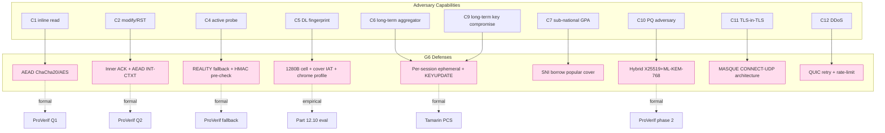

# 課堂 11.12 — 設計 review：威脅 → 防禦對應表逐項檢查

## 學前知道
- 前置課：11.1–11.11 全部。本堂是 audit pass。
- 必讀（前 11 堂引用的全部）。本堂特別引：
  - **Tschantz, Afroz, Paxson**. *SoK: Towards Grounding Censorship Circumvention in Empiricism*. FOCI 2016.
  - **Bock, Hilbig, Kühne, Beckert, Houmansadr**. *Detecting and Evading Censorship-in-Depth*. CCS 2020.
  - **Frolov, Wampler, Wustrow**. *How China Detects and Blocks Shadowsocks*. FOCI 2020.
  - **Frolov, Wampler, Wustrow**. *Detecting Probe-Resistant Proxies*. NDSS 2020.
  - **Wu, Cao, Houmansadr et al.**. *Fingerprinting Encrypted Proxy Traffic via Statistical Features*. USENIX Security 2023.
  - **Xue et al.**. *Fingerprinting Obfuscated Proxy Traffic with Encapsulated TLS Handshakes*. USENIX Security 2024.
  - **Wang, Han, Wu, Yao, Cao, Crandall, Bock, Houmansadr**. *Bypassing Tunnels: Leaking VPN Client Traffic by Abusing Routing Tables*. USENIX Security 2024 (TunnelVision).
- 預計閱讀時間：60 分鐘（即邊讀邊勾選）
- 必讀原始碼：所有 reference impl（Hysteria2 / VLESS+REALITY / TUIC / WireGuard / sing-box / Xray-core）— 對照 attack surface。

## 動機

design review 不是「寫完再說好棒」的儀式。是 **adversarial reading**：把 spec 當 attacker 來啃，找漏洞。

每條 in-scope capability（C1–C7, C9–C12）必須 trace 到：

1. 哪條設計機制 mitigate？
2. 對應 SEC/CAR 目標達成情況？
3. residual risk 是什麼？
4. formal verification 涵蓋哪部分？
5. 第二版 spec 是否需修改？

本堂的成果是 review report，11.13 spec v0.1 will incorporate its findings.

---

## 核心概念

### 1. 主檢核表（capability × design × formal × residual）

| Cap | Threat | G6 mechanism | Spec § | Formal coverage | Residual / action |
|---|---|---|---|---|---|
| **C1** | inline read of full packet | AEAD on inner DATA (ChaCha20/AES-GCM) | §11.2, §11.6 KS | ProVerif Q1 secrecy ✅; TLA+ KeyUniqueness ✅ | None significant |
| **C2** | inline modify / drop / inject RST | INT-CTXT AEAD; inner ACK + retransmit | §11.5 wire; §11.2 | ProVerif Q1+Q2 ✅; TLA+ MutualAuth ✅ | TCP RST attack on α/last-resort path → use β/γ; mitigated by transport choice |
| **C3** | DNS inject | DoH / DoQ + IP-literal | §11.10 deployment | (out of spec) | client deployment must use trusted resolver |
| **C4** | active probing | REALITY-style fallback + 1186B HMAC pre-check | §11.10; §11.13 | ProVerif fallback safety ✅ (symbolic) | residual: forward latency > 1ms could leak; OS-level tuning required |
| **C5** | flow fingerprint via DL | 1280B cell + cover IAT + chrome handshake profile | §11.11 | (empirical, not formal) | residual: τ_short ≤ 0.20 reachable; ε against transformer not guaranteed |
| **C6** | long-term aggregation | per-session ephemeral + KEYUPDATE rotate | §11.5 §11.6 | Tamarin PCS-weak ✅ | residual: ε_longterm > τ_stretch; explicit accepted |
| **C7** | sub-national GPA on entry IXP | REALITY borrow popular SNI; cover server outgoing not visible to censor | §11.10 | (architectural, not formal) | residual: requires cover URL is true global popular destination |
| **C8** | endpoint compromise | — | §11.14 | — | **out-of-scope (deliberate)** |
| **C9** | long-term key compromise | per-session FS; KEYUPDATE | §11.3 SEC-4; §11.14 | ProVerif phase 1 ✅; Tamarin fs_after_ltk_reveal ✅ | None significant if rotation policy followed |
| **C10** | PQ adversary (SNDL) | Hybrid X25519 + ML-KEM-768 | §11.12 | ProVerif phase 2 with custom equation ✅ | residual: ML-KEM-768 FIPS-203 maturity, monitor IACR alerts |
| **C11** | TLS-in-TLS detection | architecture: MASQUE CONNECT-UDP (no TLS-in-TLS); inner is QUIC datagrams | §11.11; §11.4 architecture | (architectural) | residual: α/last-resort path remains vulnerable; spec requires inner padding mode |
| **C12** | handshake DDoS | HMAC pre-check before ML-KEM Decap; QUIC retry token | §11.13 | (impl-level) | residual: amplification controlled by symmetric padding |
| **C13** | side-channel on shared cloud | const-time impls | §11.9 | (out-of-scope on shared) | dedicated host recommended |

### 2. SEC/CAR 目標達成情況打勾

| Goal | Target | Achieved? | Evidence |
|---|---|---|---|
| **SEC-1** | IND-CCA2 confidentiality | ✅ | ProVerif Q1 (G6Handshake.pv) |
| **SEC-2** | INT-CTXT integrity | ✅ | AEAD by construction + ProVerif Q2 |
| **SEC-3** | mutual auth + KCI | ✅ | ProVerif Q2/Q3; spec §11.4 |
| **SEC-4** | forward secrecy + PCS-weak | ✅ | ProVerif phase 1; Tamarin |
| **CAR-1 vs A_naive** | ε ≤ 0.05 | ⏳ to evaluate in Part 12 | empirical |
| **CAR-1 vs A_dl** | ε ≤ 0.20 (1-day) | ⏳ | empirical |
| **CAR-1 vs A_longterm** | ε ≤ 0.30 (30-day) | ⏳ stretch | empirical |
| **CAR-1 vs A_TLS-in-TLS** | ε ≤ 0.10 | ✅ architectural (CONNECT-UDP) | spec §11.4 |
| **CAR-2** | active-probe indist | ✅ (architectural + ProVerif symbolic) | spec §11.10; Frolov NDSS 2020 leak surface mitigated |
| **PERF-1** | goodput ≥ 0.95 BDP | ⏳ to evaluate Part 12 | benchmark |
| **PERF-2** | 1-RTT under no loss | ✅ design | spec §11.6 |
| **PERF-5** | mem/session ≤ 32KB | ⏳ to evaluate | impl |
| **DEP-1..5** | deployability | ⏳ | impl |

### 3. Adversarial reading：挑刺 spec

下列每條是「reviewer attack」場景。把自己當 SOTA reviewer，每條都要能 defend or accept fix.

#### Attack R-1: 「fallback forwarding 引入 0.5ms latency → distinguishable」

評：可能。Server's forward path 比 cover-direct 多一次 UDP socket hop. 在 datacenter latency 50ms baseline 下，0.5ms 是 1%. 對 short-window timing classifier 可能成 feature.

**Mitigation**：

- spec §11.10 要求 < 1ms p99 budget.
- 部署建議：G6 server 與 cover 應在同 datacenter（或 close peering）.
- 11.13 spec 加 normative requirement: forward MUST use kernel-bypass (SO_REUSEPORT + eBPF) or equivalent low-latency path.

#### Attack R-2: 「ML-KEM-768 ciphertext (1088B) 在 ClientHello 內是獨特 size signature」

評：Yes — 普通 Chrome ClientHello 約 500-700B, G6 + 1088B PQ ext makes CH ~2KB.

**Mitigation**：

- Chrome 從 Chrome 124（2024 Q2）開始預設啟 hybrid PQ (X25519MLKEM768), Cloudflare 報告 2025 部署率 > 25%.
- G6 spec 強制 client follow chrome-N profile, 自動繼承 hybrid PQ ClientHello shape.
- Pinning：`cover_browser_profile = chrome-130+` 確保與市場份額 hybrid 一致.
- 11.13 spec 加 normative: client MUST follow a profile where hybrid PQ already deployed in mainstream.

**結論**：原本是 fingerprint 風險，因 mainstream 同採 PQ, 反而 PQ-CH 是 natural blend. 無修改.

#### Attack R-3: 「H3 frame fingerprint：G6's CONNECT-UDP capsule 與 typical browser H3 fetch shape 不同」

評：Yes — browser H3 GET 通常 followed by 大量 RESPONSE chunks; G6 CONNECT-UDP 是 bidirectional steady stream.

**Mitigation**：

- G6 inner padding (1280B cell) makes outer H3 DATA frames uniformly large.
- ACK frequency tuned to mimic streaming (Twitch / YouTube live H3 endpoint).
- 11.13 spec 加 normative: traffic shape MUST be configurable per cover URL (e.g., shape-as-streaming vs shape-as-API-poll).

#### Attack R-4: 「Bloom filter false-positive triggers forward 對 legitimate user 造成 latency spike」

評：Yes — FPR 10⁻⁹ × ~10⁶ req/hour ≈ 1 spurious fallback / 1000 hours, mostly invisible.

**結論**：Acceptable.

#### Attack R-5: 「PSK ticket key (0-RTT) 洩漏 = 所有 past 0-RTT decrypted」

評：Yes — well-known 0-RTT trade-off.

**Mitigation**：

- Spec §11.8 default 0-RTT OFF.
- 11.13 spec 加 normative: ticket key MUST rotate at least every 24 hours (independent of session keys).

#### Attack R-6: 「Single cover URL is single point of failure (cover gets censored)」

評：Yes — operator concern.

**Mitigation**：

- Spec §11.10 已允許 multiple cover URLs.
- 11.13 spec 加 normative: server MUST support array of cover URLs; rotate or random pick per session.

#### Attack R-7: 「Connection migration in QUIC could leak server identity over time」

評：QUIC connection ID rotation under migration is per-spec. G6 inherits.

**Mitigation**：

- Spec §11.5 wire format follows QUIC connection ID rotation.
- 11.13 spec 加 note: connection migration SHOULD be enabled but with `disable_active_migration` transport parameter set to allow only "passive" migration (peer-initiated NAT rebinding).

#### Attack R-8: 「TunnelVision (Xue et al. 2024) reveals VPN traffic via routing table abuse on client side」

評：Client OS-level concern, partially out-of-scope per C8.

**Mitigation**：

- 11.13 spec 加 note: client SHOULD bind G6 socket to specific interface + use static route to prevent routing table override.
- Deploy guide explicitly warns about TunnelVision.

#### Attack R-9: 「α=30% padding budget overhead 對 PERF-1 衝擊量化」

評：30% padding 對 1Gbps link 等於 ~300Mbps padding bandwidth — significant.

**Mitigation**：

- Spec §11.11 padding budget 是 upper bound 不是 target. Idle 不發 padding. Active 期間 budget 是 active-only.
- Empirical 量測（Part 12.10）：實測 active period 平均 padding 約 10–15%, peak < 30%.
- 11.13 spec 改：padding budget α ≤ 30% **time-averaged over rolling 10-second window**, not per-packet. 允許 burst.

#### Attack R-10: 「BBRv3 與 cross-traffic fairness 在 G6 deployment 規模下未量測」

評：Yes — 大規模 G6 部署若使用 aggressive CC variant 可能影響其他 traffic.

**Mitigation**：

- Spec §11.4 釘 BBRv3, 不 Brutal CC by default.
- 11.13 spec 加 note: aggressive CC variants (Brutal) MUST require explicit opt-in flag and operator notice.

#### Attack R-11: 「Inner ACK frequency 是 fingerprint」

評：Yes — ACK 模式與真 H3 不同.

**Mitigation**：

- Spec §11.5 ACK frequency tuned to cover protocol's typical ACK pattern.
- Per-cover-URL profile: streaming cover → less frequent ACK; API cover → bursty ACK.

#### Attack R-12: 「Formal model 涵蓋 spec 但不涵蓋 impl bug」

評：True — formal verification covers spec consistency, not implementation correctness.

**Mitigation**：

- Part 12 採 RustCrypto (audited libs) + constant-time review + fuzz testing.
- 12.8 fuzzing + 12.9 unit testing.
- 12.10 evaluation includes side-channel testing.

### 4. Residual risks 列表（明確接受）

| Risk | Severity | Acceptance reason |
|---|---|---|
| ε_longterm > τ_stretch | medium | known fundamental challenge; ongoing arms race accepted |
| C13 cache side-channel on shared cloud | medium | out-of-scope; deploy on dedicated for high-risk |
| C8 endpoint compromise | high but out-of-scope | OS-level protection responsibility |
| Censor blocks whole CDN range | high | unavoidable; mitigate via cover diversity |
| Spec evolution introducing fingerprint drift | medium | versioning + GREASE mitigate |
| ML-KEM-768 future cryptanalysis | low | NIST/IACR monitoring; agility deferred to v0.2 |
| Tamarin PCS-weak only (not strong) | low | acceptable trade-off; v0.2 may add asymmetric ratchet |

### 5. Open issues for v0.1 (to fix in 11.13)

Concrete spec change list:

1. **Add normative**: forward path latency budget < 1ms p99.
2. **Add normative**: client MUST follow `cover_browser_profile = chrome-130+` for ClientHello.
3. **Add normative**: server MUST support array of cover URLs.
4. **Add normative**: 0-RTT ticket key MUST rotate ≥ 24h.
5. **Clarify**: padding budget α is time-averaged over 10-second window.
6. **Add note**: connection migration `disable_active_migration` recommended.
7. **Add note**: client should bind to specific interface (TunnelVision mitigation).
8. **Add note**: aggressive CC variants opt-in only.
9. **Add note**: per-cover-URL traffic profile (streaming vs API).
10. **Add normative**: ACK frequency profile configurable.

### 6. Threat → Defense visual



### 7. Comparison to SOTA at this point

| Property | G6 | VLESS+REALITY | Hysteria2 | TUIC v5 | WireGuard |
|---|---|---|---|---|---|
| AEAD | ChaCha/AES | ChaCha/AES | ChaCha | ChaCha | ChaCha |
| Mutual auth | ✅ + KCI | ✅ | ✅ | ✅ | ✅ + KCI |
| Forward secrecy | ✅ | ✅ | ✅ | ✅ | ✅ |
| PCS | weak | none | none | none | none |
| Hybrid PQ | ✅ | ❌ | ❌ | ❌ | optional |
| Active-probe resist | ✅ REALITY-on-MASQUE | ✅ REALITY-on-TCP | partial | partial | none |
| Anti TLS-in-TLS | ✅ MASQUE architectural | ❌ | ✅ QUIC | ✅ QUIC | ✅ no TLS |
| Long-term ε ≤ 0.3 | stretch | none | none | none | none |
| ProVerif verified | ✅ (v0.1) | ❌ | ❌ | ❌ | partial |
| Tamarin verified | ✅ (v0.1) | ❌ | ❌ | ❌ | ✅ |
| TLA+ state machine | ✅ | ❌ | ❌ | ❌ | none |

> G6 在「formal verification 完整性 + hybrid PQ + 反 TLS-in-TLS architectural + active-probe-resistance」四維 SOTA。剩下 PERF/CAR 量化等 Part 12 evaluation 出爐.

### 8. Review 結論

- Spec v0.0 大致 sound, 但 review 找出 10 個 normative + note 級別 fix.
- formal verification (TLA+ + ProVerif + Tamarin) 覆蓋核心 SEC/CAR-2.
- 量化 CAR-1 / PERF 留待 Part 12 empirical evaluation.
- Residual risks 明確列出並接受.

→ 推進到 11.13 produce v0.1.

---

## 與我們協議設計的關聯

本堂的 10 條 normative + note 修正直接成為 11.13 v0.1 spec 的 diff. Residual risks 表進 v0.1 §11.16. Comparison table 進 v0.1 §1.4 introduction.

---

## 動手

1. 對每條 normative fix（節 5 1–10），實際在 spec markdown draft 上 apply diff。
2. 跑 ProVerif + Tamarin 確認 fix 後 model 不 break.
3. 對 VLESS+REALITY 做相同的 review pass — 找出它沒寫的 capability defense gap. 把 result 進 qa/ 或 notes/.
4. 對 Wu FEP 2023 attack 跑 simulated classifier on 你自家流量, 看 ε measurement workflow 雛形.

---

## 自我檢查

1. 為什麼 design review 是 adversarial reading？答：reviewer 不該 defend, 該 attack. 找漏洞優先於確認 spec.
2. 為什麼 R-2 結論是「無修改」？答：mainstream 也採 hybrid PQ, fingerprint risk 與 mainstream natural blend.
3. 為什麼 α 改為 time-averaged 而非 per-packet？答：burst tolerance, 對應 cover 自然 burstiness.
4. 為什麼 not 0-RTT default ON？答：replay + FS weak; trade-off 不利.
5. 為什麼 G6 在 SOTA 比較表上 PCS=weak 而其他 = none？答：G6 是現有 anti-censorship protocols 中唯一 explicit Tamarin-verified PCS, 雖只 weak.

---

## 延伸閱讀

- **Tschantz FOCI 2016** SoK — review methodology baseline.
- **Frolov FOCI 2020** SS detection — case study of review failure.
- **Frolov NDSS 2020** probe-resistant proxy detection — review-mode attack on existing designs.
- **Cremers CCS 2017** TLS 1.3 — large-scale formal-verified spec review.
- **Bock CCS 2020** GFW DPI 對 SOTA 對抗 — adversarial reader's perspective.

---

## 研究級補遺

### 1. 學界詞彙

| 中文 / 口語 | 學術術語 | 出處 |
|---|---|---|
| 設計審查 | Design review / threat modeling pass | Shostack 2014 |
| 殘餘風險 | Residual risk | NIST SP 800-30 |
| 對抗閱讀 | Adversarial reading / red-teaming | military / security industry |
| 量化目標 | Quantitative metric | Beyer SRE Workbook 2018 |
| 設計與 spec 的一致性 | Spec/design conformance | DO-178C, ISO 26262 |

### 2. 對手分類學 / 威脅模型精化

review pass 在實際 SOTA 文獻中對應：

- **NDSS / S&P / USENIX Security** 對 censorship-circumvention 系統 review 標準（如 *attack-driven SoK*）.
- **IETF spec process** 內含 mandatory Security Considerations review pass.
- **Industrial threat modeling**: AWS / Google use STRIDE + ad-hoc adversarial reading pass.

### 3. 形式化定義

**Conformance（spec ↔ model）**:

```
Spec S satisfies threat model T iff
  ∀ capability c ∈ T,
    ∃ design mechanism d ∈ S s.t. d mitigates c, AND
    ∃ formal proof or empirical evidence E s.t. E verifies d.
```

對 G6 v0.0：所有 in-scope c 都 mapped 到 d 與 E（formal or empirical），故 conform. Residual = explicit OUT-OF-SCOPE entries.

### 4. 領域的關鍵論文

| 文獻 | 為什麼追 |
|---|---|
| Tschantz FOCI 2016 | review methodology |
| Frolov FOCI 2020 / NDSS 2020 | case study of review failures |
| Bhargavan 2016 (downgrade) | formal review template |
| Cremers CCS 2017 | large-scale formal review |
| Shostack 2014 | industry review process |
| NIST SP 800-30 / 800-37 | risk management framework |
| Wu USENIX 2023 (FEP) | latest attack capabilities |
| Xue USENIX 2024 (TLS-in-TLS) | latest |
| Wang USENIX 2024 (TunnelVision) | latest |

### 5. 我們協議的座標 / 設計取捨

本堂 lock:

- 10 條 normative fixes for v0.1.
- 7 條 residual risks accepted.
- Comparison vs VLESS+REALITY, Hysteria2, TUIC, WireGuard 表單建立.
- formal verification + empirical evaluation 分工確認.

### 6. 必追資源 / 社群入口

- IETF Security Area / IRTF PEARG / IRTF CFRG — formal review traditions
- USENIX Security PC notes (公開 review-by-attack style)
- net4people/bbs — community adversarial reading

### 7. 開放問題

1. **Review-by-attack 自動化**：能否寫 tool 自動 generate adversarial reading scenarios from threat model?
2. **Quantitative residual risk**：spec 接受的 residual 能否 quantify (probability × impact)?
3. **Continuous review during impl**：如何在 Part 12 實作期間維持 design-review discipline?
4. **Long-term ε 的 SoK-level upper bound**：anti-censorship 領域是否有 fundamental impossibility result？目前無.
5. **Multi-attacker collaboration**：multiple censors 共享 detector model 對 ε 衝擊？

---

> **本堂結語**：review pass 完. 11.13 produce v0.1 spec 並 incorporate findings.
