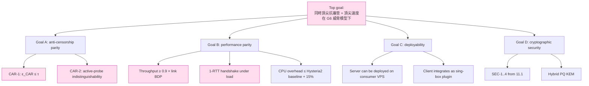

# 課堂 11.2 — 設計目標 / 非目標：把口號變成可量化 budget

## 學前知道
- 前置課：11.1 威脅模型。本堂直接消費那份 capability matrix 與 CAR-1 的抽象 ε。
- 前置論文（必讀）：
  - **Clark**. *The Design Philosophy of the DARPA Internet Protocols*. SIGCOMM 1988. precis: [`notes/papers/clark-darpa-design.md`](../../notes/papers/clark-darpa-design.md) — 設計目標排序的原型範本（survivability > heterogeneity > monitoring 排序）。
  - **Tschantz, Afroz, Paxson**. *SoK: Towards Grounding Censorship Circumvention in Empiricism*. FOCI 2016. precis: [`notes/papers/tschantz-sok-circumvention.md`](../../notes/papers/tschantz-sok-circumvention.md)
  - **Cardwell, Cheng, Gunn, Yeganeh, Jacobson**. *BBR: Congestion-Based Congestion Control*. CACM 2017. precis: [`notes/papers/cardwell-bbr.md`](../../notes/papers/cardwell-bbr.md) — 效能目標的 baseline。
  - **Wang, Hopper**. *Multi-flow Attack-Resistant Website Fingerprinting Defenses*. PoPETs 2019. — padding budget 對 ε 的下界數據。
  - **Hysteria2 設計筆記**：https://v2.hysteria.network/docs/advanced/Brutal/ — UDP-based proxy 的效能 SOTA 目標。
- 預計閱讀時間：50 分鐘
- 必讀原始碼：無

## 動機

「同時頂尖抗審查 + 頂尖速度」是一句口號。

口號不能 review、不能 verify、不能驅動設計。要把它變成 G6 的合約，必須**精確量化**：

- 什麼叫「抗審查」？ε_CAR ≤ 多少？對哪個 classifier？對哪個 cover protocol？
- 什麼叫「速度」？throughput 上限 vs base RTT、handshake RTT inflation 上限、是否 1-RTT、是否 0-RTT？

把口號量化是 Clark 1988 的 internet design philosophy 流派的核心方法：**列出 goal、排序、為每個 goal 寫可衡量的判據**。本堂照辦。

---

## 核心概念

### 1. 設計目標的層級結構

仿 Clark 1988，把 G6 的目標分三層：



Clark 對 internet design 列了 7 個 sub-goals，第一個 survivability 排在 cost、accountability、monitoring 之前。對 G6，**順序如下**（順序在 spec 寫進序言）：

1. **Security goals SEC-1..4** — 任何一條失守整個 system 都失敗。
2. **CAR-2 (active probing resistance)** — 從 Shadowsocks 教訓直接學到的：active probe 一旦被 confirm，IP 就死。
3. **CAR-1 (statistical indistinguishability)** — 真正困難的部分。
4. **Performance** — 是 G6 的差異點，但**晚於**安全與抗審查；不為效能犧牲前三項。
5. **Deployability** — 不能犧牲安全，但不能難用到沒人用。

> Clark 1988 在 SIGCOMM 原文裡明確說：「the ordering of these goals is not arbitrary」。我們延此風格。

### 2. CAR-1 的量化：ε_CAR 是多少？

回到 11.1 的 distinguishing game：

```
Adv_CAR(f) = |Pr[f=1 | G6] - Pr[f=1 | cover]|
```

#### 2.1 從 attacker false-positive budget 反推 τ

GFW 的封鎖決策有 false-positive cost：

- 封錯一個 IP 不大事。
- 封錯一條協議（例如全網 TLS 1.3 ClientHello with `tls_grease`）會引起跨國商業反應，這是政治成本。
- Tschantz 2016 給的經驗 threshold：對 universally-deployed cover（如 TLS-over-443-to-CDN），attacker 的 FPR 上限約 10⁻⁴–10⁻⁵（否則誤封量級超過 Cloudflare 商業流量）。

對應 detector ROC：要在 TPR = 0.99 之下 FPR ≤ 10⁻⁴。換到 Adv_CAR：

```
Adv_CAR ≈ TPR - FPR ≈ 0.99 - 0.0001 ≈ 0.9899
```

直觀讀法：**若 attacker 能達到 Adv_CAR ≈ 0.99，G6 死定了**。

反過來，G6 的可生存區是 Adv_CAR 落在 attacker「FPR 預算內找不到 high-TPR operating point」的區域。Wang & Hopper PoPETs 2019 的數據（websites fingerprinting）顯示：當 padding budget ≥ 50%（每 packet 平均 padding 為原 size 一半）時，SOTA DL classifier 對 closed-world identification 的 Adv 約掉到 0.2 以下。

**G6 的 CAR-1 budget**（記錄為 spec 約束）：

```
τ_target  ≤ 0.20   (against attacker with ≤ 1 day flow, ≤ 10⁻⁴ FPR budget)
τ_stretch ≤ 0.10   (對 30 天 long-term aggregator 的 stretch goal)
```

> **誠實**：τ_stretch 是 stretch goal，目前**沒有任何已部署協議達到**。VLESS+REALITY 對 1-day classifier 經 GFW 實測 ε > 0.5（Bock 2020 + 後續網路證據）。把 τ_stretch 寫進 spec 是宣示 ambition，不是承諾。

#### 2.2 量化的攻擊者模型

ε_CAR 的具體值依 attacker 而異。G6 spec 必須列出**所有 reference attackers**：

| Reference attacker | 訓練資料 | 模型 | 我們的 ε 目標 |
|---|---|---|---|
| **A_naive**：經典 ML | 10k flow | Random Forest on (avg_pkt_size, std_pkt_size, iat_p50, iat_p99) | ε ≤ 0.05 |
| **A_dl**：1D-CNN（Wang-Goldberg style） | 100k flow | 1D-CNN on first 100 packet sizes | ε ≤ 0.20 |
| **A_transformer**：Transformer encoder | 1M flow | self-attention, 8 heads, 6 layers | ε ≤ 0.30 |
| **A_temporal**：BiLSTM on IAT sequence | 100k flow | BiLSTM-128 | ε ≤ 0.20 |
| **A_longterm**：multi-day aggregator | 30 days | XGBoost over per-flow summary | ε ≤ 0.30 (best effort) |
| **A_TLS-in-TLS**：Xue et al. USENIX 2024 detector | NA | published model | ε ≤ 0.10（理想），G6 結構應禁此攻擊 |

> 訓練資料規模故意大過攻擊者實際擁有，是 conservative threat-model。

#### 2.3 量化的 cover distribution

cover = TLS 1.3-over-TCP-443 to 一線 CDN。具體採 Cloudflare TLS profile（fingerprint sample 來自 ja3er.com / GREASE 強制 enabled、HTTP/2 fallback、common cipher set）。

ε_CAR 的 game 是相對 cover 的——換 cover 就換 game。spec 必須 lock cover 否則 ε_CAR 沒有意義。

### 3. CAR-2 的量化：active probing 的 indistinguishability budget

```
Adv_CAR-2(A) = |Pr[A → G6 server detects "G6"] - Pr[A → cover server detects "G6"]|
```

對 active probe，這 game 退化為：attacker 發 q，看 response，做 binary decision。

REALITY-style 的設計使 Adv_CAR-2 趨近於 0：因為兩 case 的 response 是**同一個底層 TLS server** 產生。但兩個 leak point 必須監控：

1. **Probe 觸發 fallback 前的時間差**：G6 server 在認證失敗時 forward 給 cover server。若 forward 引入 > 5ms 額外 RTT，attacker 可用 timing distinguish。

   G6 目標：fallback 引入 RTT inflation **< 1ms (p99)**。

2. **TCP TIME_WAIT 後的 server-side behaviour**：cover server 處理 5 個 probe 後可能 rate-limit。G6 server 必須 mimic 相同 rate-limit。

   G6 目標：rate-limit profile 與 cover server **bit-identical**（透過 forward 自動達成）。

### 4. 效能目標的量化

對標 SOTA：Hysteria2、TUIC v5、VLESS+XHTTP。這些協議實測（自報數據 + 第三方 benchmark）給出：

| 協議 | 100Mbps link 達成率 | 1Gbps link 達成率 | Handshake RTT | CPU @ 1Gbps |
|---|---|---|---|---|
| OpenVPN | ~70% | ~30% | 2-RTT | 高 |
| WireGuard | ~95% | ~90% | 1-RTT | 中 |
| Shadowsocks-2022 | ~95% | ~85% | 0-RTT* | 中 |
| Trojan | ~90% | ~75% | 2-RTT | 中 |
| VLESS+TLS | ~88% | ~70% | 2-RTT | 中 |
| Hysteria2 (QUIC+BBR) | ~98% | ~95% | 1-RTT | 高 |
| TUIC v5 (QUIC) | ~97% | ~92% | 1-RTT | 中 |

* SS-2022 0-RTT 假設了 pre-shared key 路徑。

G6 效能目標（spec 寫死）：

```
PERF-1: Goodput ≥ 0.95 × min(link_bandwidth, BDP / RTT)
        在 RTT = 50ms, link = 1Gbps, loss ≤ 1% 的 baseline 場景。
PERF-2: Handshake RTT ≤ 1-RTT under 0-loss; 2-RTT worst case under packet loss
        with cookie / retry.
PERF-3: 0-RTT data path optional, behind explicit replay-tolerant flag。
PERF-4: CPU overhead ≤ Hysteria2 + 15%, 量測點：1 core, 1Gbps, ChaCha20-Poly1305。
PERF-5: Memory per session ≤ 32KB steady state（無 buffer-bloat 的條件下）。
```

`Goodput / BDP` 是 BBR 的標準 metric（Cardwell 2017）。

### 5. Deployability 目標

| 編號 | 目標 |
|---|---|
| **DEP-1** | Server 可在 1 vCPU / 1GB RAM VPS 上跑 ≥ 100 concurrent session |
| **DEP-2** | Client 整合為 sing-box plugin (Go) 與 Clash Meta inbound (Go)；reference impl 為 Rust |
| **DEP-3** | 訂閱格式為 G6 URI scheme（`g6://`）+ JSON config block，沿 Sing-Box 約定 |
| **DEP-4** | Cover server 為 user-supplied URL，protocol 不假設特定 CDN |
| **DEP-5** | Configuration footprint ≤ Hysteria2（YAML ≤ 30 lines for typical deploy） |

### 6. 非目標（明確排除）

| 非目標 | 原因 |
|---|---|
| **多用戶 / SaaS 級 panel** | G6 是 transport，不是 BMS。Panel 由上層工具（如 ccb）提供。 |
| **匿名性（unlinkability）** | low-latency proxy 無法對抗 GPA。需匿名走 Tor over G6。 |
| **NAT traversal hole-punching** | G6 假設 server 有 stable public IP。p2p 屬另一個項目。 |
| **DNS-level censorship** | 假設 DNS 已透過 DoH/DoQ 解決或用 IP-literal。 |
| **零拷貝以下的 OS 整合** | OS bypass（DPDK / AF_XDP）為 Part 12 optional path，不是 spec 要求。 |
| **跨協議遷移**（如同時支援 SS、Trojan refly） | G6 是新協議，不做 multi-protocol switchboard。 |
| **GUI / UX** | 由上層客戶端負責。 |

### 7. 衝突管理：目標互斥時誰讓

設計時最常見衝突（Clark 1988 提的 trade-off 法則）：

| 衝突 | 預設讓步方 | 例外條件 |
|---|---|---|
| CAR-1 vs PERF-1 (padding 損 goodput) | CAR-1 贏 | 若 padding budget 超 30% 且 goodput < 0.8 BDP，降 padding |
| CAR-2 vs handshake RTT | CAR-2 贏 | 永不為節 RTT 犧牲 active-probe indist |
| Security (SEC-*) vs anything | SEC 贏 | 無例外 |
| Deployability vs CAR-1 cover protocol pinning | CAR-1 贏 | cover protocol 必須 hard-locked |
| Performance vs PQ KEM size | PERF 在 handshake RTT 上讓 | PQ 必開；最差案例多 1-RTT 可接受 |

這個表是 spec 內部 conflict resolution clause 的種子。Spec v0.1 §1 必引。

### 8. 量化目標的 verification plan

每個 target 必須對應一個 verification 路徑（11.14 cap-stone 會列全）：

| Target | Verification method |
|---|---|
| SEC-1..4 | ProVerif (11.10), Tamarin (11.11) |
| CAR-1 (ε_CAR ≤ τ) | empirical: train reference attackers, measure Adv (Part 12.10 evaluation) |
| CAR-2 | empirical: black-box probe + timing histogram analysis |
| PERF-1..5 | benchmark suite (Part 12.10) |
| DEP-1..5 | deployment matrix run |
| 衝突管理 | spec 內 cross-reference + design review (11.12) |

### 9. 與 11.1 capability matrix 的 trace 表

每條 capability 都對應到至少一個 goal：

| Capability | 對應 goal |
|---|---|
| C1 inline read | SEC-1 |
| C2 modify/drop/RST | SEC-2 + PERF-1 (recovery) |
| C3 DNS inject | DEP-4 (cover URL 由 user 管) |
| C4 active probing | CAR-2 |
| C5 flow fingerprinting | CAR-1 (against A_naive, A_dl, A_temporal) |
| C6 long-term aggregation | CAR-1 (against A_longterm, stretch τ) |
| C7 sub-national GPA | CAR-1 + CAR-2 |
| C8 endpoint compromise | OUT-OF-SCOPE |
| C9 long-term key compromise | SEC-3 (KCI) + SEC-4 (FS) |
| C10 PQ adversary | SEC-1 (via hybrid KEM) |
| C11 TLS-in-TLS detection | CAR-1 (architectural: avoid TLS-in-TLS) |
| C12 DDoS | PERF (rate-limit) |
| C13 cache side-channel | OUT-OF-SCOPE |

11.12 review 會逐項打勾。

---

## 與我們協議設計的關聯

本堂的所有 SEC/CAR/PERF/DEP 編號**在 spec 草稿（11.5–11.8）每一節 normative requirement 前面引用**。沒被 goal 引用的設計，不寫進 spec。

效能目標的 PERF-1..5 直接成為 Part 12.10 evaluation chapter 的 KPI。

---

## 動手

1. 找 Hysteria2 spec 對應的 goal-statement（https://v2.hysteria.network/docs/）。它有沒有 explicit 寫 ε_CAR-style 目標？答：沒有。這是 Hysteria2 的弱項——它的設計動機是 perf，CAR 屬於「賺到的」。
2. 列出 WireGuard goal hierarchy（從 Donenfeld NDSS 2017 §3）。對照 Clark 1988 風格——WireGuard 是不是把 simplicity 列在 performance 之上？是。為何 G6 不能這樣？
3. 對你自家的 VPS 跑 ja3 fingerprint：`curl https://ja3er.com/json -k`，把回傳 JSON 對比 https://tlsfingerprint.io/top 上 popular browser fingerprint。記下 distance。這個距離就是 G6 必須在 spec 裡為 cover handshake parameters 鎖死的東西。

---

## 自我檢查

1. 為何把 τ_stretch (long-term ε ≤ 0.10) 寫進 spec，明知做不到？
2. 為何 PERF 目標讓在 CAR 之後而不是之前？這個次序與 Hysteria2 / TUIC 哪個更像？
3. 一個 reviewer 抓住「PERF-1 設 0.95 × BDP 太高」反駁。你的論證是什麼？提示：BBR 1.0/2.0 已知 attain。
4. CAR-1 的 A_transformer 引用大模型——攻擊者真的會用 transformer 做 traffic classification 嗎？提供至少兩篇 USENIX/PoPETs 證據。
5. DEP-1 要求 1 vCPU/1GB 支援 100 conn。算一下：32KB × 100 = 3.2MB session state，遠低於 1GB。為什麼還要列這個目標？

---

## 延伸閱讀

- **Clark**. *The Design Philosophy of the DARPA Internet Protocols*. SIGCOMM 1988. — 設計目標排序的鼻祖文獻。
- **Newcombe et al.**. *How Amazon Web Services Uses Formal Methods*. CACM 2015. — 量化目標如何流向 verification specification。
- **Hysteria2 docs**, **TUIC v5 spec**, **VLESS spec**, **REALITY README** — SOTA 對照組。
- **Ipsos / Cloudflare radar / APNIC TR** — TLS 1.3 部署統計，CAR cover distribution 的依據。

---

## 研究級補遺

### 1. 學界詞彙

| 中文 / 口語 | 學術術語 | 出處 |
|---|---|---|
| 效能目標 | Performance objective / SLO | SRE workbook (Beyer et al. 2018) |
| 設計目標排序 | Design rationale prioritization | Clark 1988; Schmidt et al. 2004 |
| 對 classifier 的可區分度 | Distinguishing advantage | Bellare-Rogaway 1993; Tschantz 2016 |
| 對手 false-positive budget | Adversary's false-positive cost / FPR budget | Murdoch-Anderson 2008; Tschantz 2016 |
| 鎖死 cover distribution | Cover protocol pinning | Houmansadr 2013 (implicit); REALITY README (informal) |
| 同質 / 異質 cover | Homogeneous / heterogeneous cover | Wang-Hopper PoPETs 2019 |
| 設計合約 | Normative requirement / MUST/SHOULD/MAY | RFC 2119 / BCP 14 |
| 從規格到驗證的 trace | Specification-to-verification traceability | DO-178C; ISO 26262 |
| Goodput vs Throughput | Goodput excludes retransmissions/padding | Stevens TCP/IP Illustrated v1 |

### 2. 對手分類學進階：FPR budget 的 game-theoretic 視角

Murdoch & Anderson 2008 「Tools and Technology of Internet Filtering」首先提 FPR budget 概念。後續 Tschantz 2016 形式化。

「Stackelberg game」建模：censor commits to detector f，然後 defender 設計 protocol。defender 的 utility 是「不被封」減「padding overhead」；censor 的 utility 是「封住越多越好」減「political/economic cost of false positive」。Nash equilibrium 不一定存在（censor 可改 detector），但 Stackelberg 給出 defender-side 的 best response。

Open problem：在 G6 設計空間裡 closed-form best response 不存在（cover 是 distribution-level constraint）。Game-theoretic anti-censorship 是 PETS-/NDSS-level open problem。

### 3. 形式化定義

**Goodput 形式定義**：
```
Goodput(t1, t2) = (Σ_{i: t1 ≤ ack_time(i) ≤ t2} app_payload(i)) / (t2 - t1)
```
不含 padding、不含 retransmit。BBR 1.0 paper 用此定義。

**ε_CAR target 形式陳述**：
```
∀ ε > 0, ∃ N: ∀ attacker A drawn from class C (e.g., A_dl),
  ∀ training set T with |T| ≤ N,
    Adv_CAR(A trained on T) ≤ τ + ε
```
N = 100k flow 是 industry-standard "extensive training" budget（Wang 2013, Wang-Goldberg 2013）。

### 4. 領域的關鍵論文 / 規格 / 原始碼

| 文獻 | 為什麼追 | 之後在哪一堂精讀 |
|---|---|---|
| Clark 1988 | design goal ordering 的 reference frame | 本堂 |
| Tschantz 2016 | ε_CAR 量化方法 | 本堂、11.12 |
| Wang-Hopper PoPETs 2019 | padding budget 對 ε 的實證下界 | 11.3 padding 設計 |
| Cardwell 2017 (BBR) | goodput vs BDP 的標準 metric | 本堂 PERF-1 |
| Beyer SRE Workbook 2018 | SLO/SLI 量化方法 | 本堂 PERF-* |
| Newcombe CACM 2015 | quantified goal → TLA+ spec 的 industry case | 11.9 |
| Wang-Goldberg WPES 2013 | reference attacker A_dl 的 reference | 本堂 |
| Hysteria2 / TUIC / VLESS spec | SOTA 效能 baseline | 本堂 |
| Murdoch-Anderson 2008 | FPR budget 的 Stackelberg 角度 | 補遺 |

### 5. 我們協議的座標 / 設計取捨

本堂 lock 的設計選擇：

- **CAR 排在 PERF 之前**。這意味著一旦 spec 出現 CAR vs PERF 衝突，PERF 讓。
- **Cover protocol 鎖 TLS-1.3-over-TCP-443-to-CDN**。換 cover 是 v2 議題，v0.1 不允許。
- **PQ KEM 必選**。SNDL 不允許開後門。
- **Goodput 目標用 BBR-style metric**——意味著 G6 的擁塞控制應 BBR-family（11.4 細說）。

仍 open：
- handshake 0-RTT 與否（PERF-2 vs replay risk SEC-2）— 11.6 決
- padding budget 具體 30%/50%/70% — 11.3 決，受 PERF-1 反向約束

### 6. 必追資源 / 社群入口

- Cloudflare Radar / APNIC stats / Akamai SOTI — cover distribution 的 ground truth 來源
- IETF QUIC WG performance task force — congestion control 的 latest art
- gfw.report tag「fingerprinting」— GFW 對 SOTA 反制的最新觀察

### 7. 開放問題

1. **τ 與 attacker class 的 closed-form 關係**：給定 cover distribution、padding budget、handshake schedule，能否寫出 ε_CAR 對 attacker class 的 closed-form upper bound？已知對 Naïve Bayes 有（Wang 2013 §5），對 DL 無。
2. **PERF vs CAR 的 Pareto frontier 量化**：對固定 cover、固定 attacker class，padding budget β → ε_CAR、goodput 的 Pareto curve 形狀如何？目前只有 small-scale 經驗點，無 closed-form。
3. **長期 vs 短期 ε 的關係**：是否 ∃ protocol 同時滿足 short-term ε ≤ 0.05 與 long-term (30-day) ε ≤ 0.1？目前無證據。
4. **τ_stretch 達成的下界證明**：能否證明「任何在 PERF-1 ≥ 0.9 BDP 下的 protocol 必滿足 long-term ε > δ_0」？是 FOCI / PETS open problem。
5. **Goal hierarchy 形式化**：能否把 Clark 1988 風格的 goal ordering 編成 spec language（如 Alloy / TLA+）的可檢查 invariant？

---

> **本堂結語**：設計目標表是 G6 的「合約 v0.0」。每個編號都會在 spec、verification、benchmark 三處被引用。下一堂 11.3 開始探索：給定這份合約，設計空間裡有哪些 candidate？
