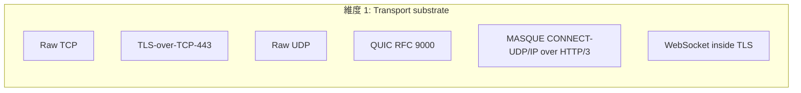
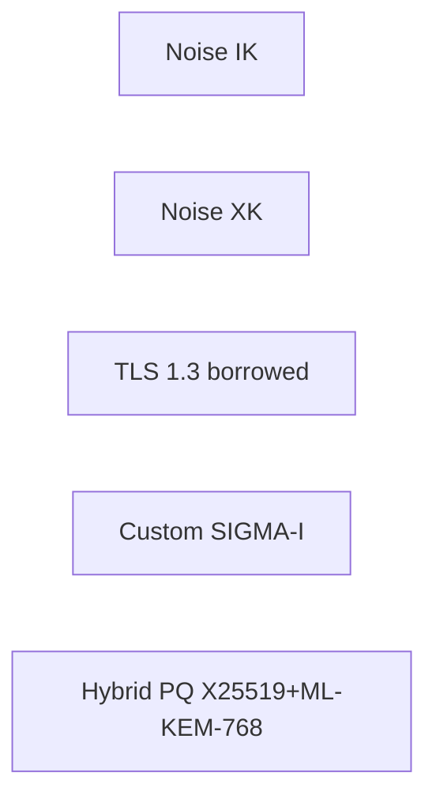
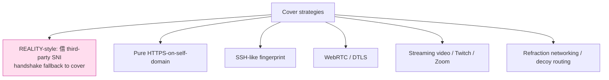
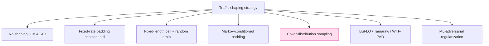

# 課堂 11.3 — 設計空間探索：每個維度的選項與取捨

## 學前知道
- 前置課：11.1（capability matrix）、11.2（CAR/PERF/SEC budget）。
- 前置論文（必讀）：
  - **Houmansadr, Brubaker, Shmatikov**. *The Parrot is Dead: Observing Unobservable Network Communications*. IEEE S&P 2013. precis: [`notes/papers/houmansadr-parrot-is-dead.md`](../../notes/papers/houmansadr-parrot-is-dead.md) — mimicry vs polymorphism 的設計觀。
  - **Wang & Goldberg**. *Improved Website Fingerprinting on Tor*. WPES 2013.
  - **Cai, Zhang, Joshi, Johnson**. *Touching from a Distance: Website Fingerprinting Attacks and Defenses*. CCS 2012.
  - **Perrin**. *The Noise Protocol Framework*, rev 34, 2018-07-11. https://noiseprotocol.org/noise.html
  - **Iyengar, Thomson (eds.)**. *QUIC: A UDP-Based Multiplexed and Secure Transport*. RFC 9000, May 2021.
  - **Schinazi**. *The MASQUE Protocol*. draft-schinazi-masque (IETF MASQUE WG)；RFC 9298 *Proxying UDP in HTTP*; RFC 9484 *Proxying IP in HTTP*.
  - **REALITY README**：https://github.com/XTLS/REALITY — XTLS-REALITY 設計筆記（非 peer-reviewed，但是 SOTA reference implementation）。
  - **Sirinam, Imani, Juarez, Wright**. *Deep Fingerprinting: Undermining Website Fingerprinting Defenses with Deep Learning*. CCS 2018.
  - **Hayes, Danezis**. *k-Fingerprinting: A Robust Scalable Website Fingerprinting Technique*. USENIX Security 2016.
  - **Frolov, Wampler, Wustrow**. *Detecting Probe-Resistant Proxies*. NDSS 2020. — 對 anti-active-probing 的攻擊面分析。
  - **Xue, Hofmann, Mosquera, Vyas, Tofighi, Houmansadr**. *Bypassing Tunnels: Leaking VPN Client Traffic by Abusing Routing Tables*. USENIX Security 2023 — TunnelVision；precis: [`notes/papers/leviathan-tunnelvision.md`](../../notes/papers/leviathan-tunnelvision.md)
  - **Xue, Tofighi-Shirazi, Houmansadr 等**. *Fingerprinting Obfuscated Proxy Traffic with Encapsulated TLS Handshakes*. USENIX Security 2024. — TLS-in-TLS 攻擊。
- 預計閱讀時間：80 分鐘
- 必讀原始碼：
  - `xtls/reality` (Go) — REALITY 的 reference impl
  - `quic-go/quic-go` — QUIC transport impl, 我們會借的部分
  - `apernet/hysteria` (Go) — Hysteria2 reference
  - `WireGuard/wireguard-go` — Noise IK + UDP transport reference

## 動機

合約寫完了（11.2），下一步是**枚舉解空間**。

很多新手會跳過這步——拍腦袋選個方案就動工。結果是事後發現選錯，整個 stack 都要重寫（Shadowsocks → SS2022 換 AEAD construction 是典型代價）。本堂的工作是**把所有候選方案逐維度列出**，每個維度標出取捨與 SOTA paper 證據，然後 **11.4** 才做選擇。

設計空間裡有 4 個 orthogonal 維度：

1. **Transport substrate** — TCP / TLS-over-TCP / QUIC / MASQUE / HTTP/3 tunneling
2. **Handshake / key exchange** — Noise / TLS 1.3 / Sigma family / Hybrid PQ
3. **Cover / obfuscation** — REALITY-style / pure HTTPS / SSH / WebRTC / 視訊串流
4. **Traffic shaping** — fixed-rate / Markov / cover-conditioned / regression-to-distribution

組合起來 candidate space 約 5 × 4 × 5 × 4 = 400 設計點。本堂逐維度收窄。

---

## 核心概念

### 維度 1：Transport substrate

對每個 candidate 評估：CAR、PERF、DEP、與 capability matrix 的關係。



#### 1.1 Raw TCP

- **CAR**：垃圾。Frolov FOCI 2020 已證明 GFW 對 raw-TCP-with-AEAD-cipher 有 ε > 0.95 classifier。完全失敗。
- **PERF**：好（Linux 內核 TCP stack 最佳化）。
- **判決**：**淘汰**。沒人這樣做了。

#### 1.2 TLS-over-TCP-443（純 TLS handshake 內部跑自家協議）

- **CAR**：中等。TLS 1.3 handshake fingerprint（ja3、JA4、JARM）可被 GFW 區分（Frolov FOCI 2020 對 Outline / SS-over-TLS 已實證）。
- **CAR-2**：脆弱。Active probe 直接觸碰 TCP 443 看是否有合法 cert。
- **PERF**：受 TCP HoL blocking 限制。
- **判決**：**part-of-the-story**。Trojan / VLESS 都是這條路，但要與 REALITY 結合才能擋 active probe。

#### 1.3 Raw UDP

- **CAR**：差。GFW 對未加密 UDP 默認 drop（Bock 2020 §3.2）。
- **PERF**：好（無 HoL）。
- **判決**：**淘汰**（除非 wrapped）。

#### 1.4 QUIC over UDP 443（RFC 9000）

- **CAR**：QUIC handshake 用 TLS 1.3，inheri ja3-style 指紋。QUIC Initial packet 的 connection ID、version 欄位是新指紋。Hysteria2/TUIC 已用此路徑。
- **CAR-2**：active probe 仍可——但 QUIC server 認證在 Initial packet AEAD 內，attacker 沒 connection ID 也無法觸發合法回應。**比 TLS-over-TCP 強**。
- **PERF**：**極佳**。無 HoL、0-RTT 可選、connection migration。
- **判決**：**強候選**。

#### 1.5 MASQUE CONNECT-UDP/IP over HTTP/3 (RFC 9298 / RFC 9484)

- **CAR**：MASQUE 客戶端對外看起來就是「正在用 HTTP/3 訪問 CDN」。如果 cover 是 Cloudflare，attacker 想 distinguish Proteus 與正常 H3 訪問需要長期 aggregation。
- **CAR-2**：active probe 觸到 cover server 直接返回 HTTP/3 response，與真實 H3 indistinguishable。比 raw QUIC 多一層「H3 application protocol」的 cover。
- **PERF**：略次於 raw QUIC（多一層 HTTP/3 frame parsing），但仍 1-RTT、無 HoL。
- **DEP**：複雜——需要 cover server 願做 MASQUE proxy（或自架 H3 server 加 MASQUE handler）。
- **判決**：**強候選**，CAR 最強。

#### 1.6 WebSocket inside TLS

- **CAR**：和 TLS-over-TCP 一樣脆弱，多一層 WS frame overhead。
- **判決**：**淘汰**。曾紅一陣（V2Ray vmess+ws+tls），現被 REALITY 取代。

#### 維度 1 收窄

剩 candidate：**T2 (TLS-over-TCP)** 與 **T4 (raw QUIC)** 與 **T5 (MASQUE/H3)**。三者 CAR/PERF/DEP 取捨表：

| Transport | CAR (passive) | CAR (active-probe) | PERF | DEP | TLS-in-TLS 風險 |
|---|---|---|---|---|---|
| TLS-over-TCP | 中（依 REALITY） | 中（依 REALITY） | 中（TCP HoL） | 易 | 高（C11）|
| QUIC | 中 | 中強 | 高 | 中 | 低 |
| MASQUE | 強 | 強 | 中高 | 難 | 低 |

### 維度 2：Handshake / key exchange



#### 2.1 Noise IK

- 兩 message handshake，1-RTT。
- 已 verify（Lipp-Blanchet-Bhargavan 2019 對 WireGuard）。
- KCI resistant、forward-secure。
- **問題**：固定大小 message，no length flexibility——對 TLS-cover mimicry 不友善。需要 wrap 在 TLS record / QUIC frame 內。

#### 2.2 Noise XK

- 三 message，2-RTT。
- 隱藏 client identity 直到 message 3（initiator-identity-hiding，是 IK 不具備的）。
- **適用**：對 client identity 不洩漏要求高的場景（如 doublecover）。
- **代價**：多 1-RTT，違反 PERF-2。

#### 2.3 TLS 1.3 borrowed

- 用真實 TLS 1.3 stack。Client sends ClientHello with embedded Proteus key share；server with TLS cert 認證 + 內嵌 Proteus keying material in extension。
- **CAR**：handshake 與真實 TLS 1.3 binary-identical。最好的 passive fingerprint resistance。
- **CAR-2**：取決於 active-probe 設計。REALITY 採此路徑。
- **PERF**：1-RTT (TLS 1.3 standard) / 0-RTT (early data)。
- **複雜度**：高——要 reuse 一個完整 TLS stack。

#### 2.4 Custom SIGMA-I

- 基於 Krawczyk SIGMA 2003 的 sign-and-MAC。
- 1-RTT，KCI-resistant。
- **問題**：自己寫的 crypto handshake——形式驗證、實作都要從零做。Noise IK 已是 SIGMA-derived 並 verified。
- **判決**：除非有強動機，**勿自捲**。

#### 2.5 Hybrid PQ KEM 加在哪個之上

- X25519 + ML-KEM-768 並聯 KEM，KDF 把兩個 shared secret 串接。
- 已被 Bindel et al. PQCrypto 2019 證明：hybrid security ≥ max(classical, PQ)。
- 已被 OpenSSL/TLS、wireguard-pq 試驗（IETF draft-ietf-tls-hybrid-design）。
- **代價**：ML-KEM-768 public key ~1184 bytes，比 X25519 (32 bytes) 大 37 倍；ciphertext ~1088 bytes。Handshake size 從 ~250B 漲到 ~2KB。
- **判決**：**必選**（C10 in scope）。

#### 維度 2 收窄

- 對 raw QUIC / MASQUE：必須用 TLS 1.3-style handshake（QUIC 就是基於它的）。
- 對 TLS-over-TCP：選 REALITY-style 借真實 TLS 1.3。
- 結論：**handshake 必為 TLS 1.3-borrowed**（不論 transport 是哪個）。Noise IK 只在 fallback / debug 用。

### 維度 3：Cover / obfuscation



#### 3.1 REALITY-style

- Server 配第三方 popular SNI（如 `www.microsoft.com`），但**只在 Proteus handshake 通過時切回自家**。否則 forward 到真實 cover server。
- **CAR-2**：強。Active probe 命中時看到真實 cover server 的回應。
- **CAR-1**：handshake 與真實 TLS 1.3 borrowing 同（因為就是 TLS 1.3 with stolen SNI）。
- **限制**：cover server 必須是 Proteus server **可達且 popular** 的目標。GFW 內部黑名單 SNI 不可借。
- **限制**：Frolov NDSS 2020 已示警「probe-resistant proxy 仍可被 outside 行為區分」——REALITY 對此的回應是把 outside 行為 forward 給真 server，等於沒有 outside 行為差異。
- **判決**：**SOTA**。

#### 3.2 Pure HTTPS on self-domain（Trojan / VLESS+TLS）

- 自己跑一個 HTTPS server，Proteus 流量混進 HTTP/2 stream。
- **問題**：domain 必須自有，且 ACME cert 暴露 domain。被 IP 反查後 active probe 直接觸碰見 Trojan response（fingerprint 已知）。Frolov FOCI 2020 已封掉這條路徑。
- **判決**：**次優**——REALITY 是它的後繼。

#### 3.3 SSH-like fingerprint

- 偽裝成 SSH session（如 ProxyChains-over-SSH）。
- **CAR**：SSH 流量本身有獨特 fingerprint（packet size cluster around small bash command response）。如果你流量是 HTTPS-shape，與 SSH session 不像，反而 louder。
- **判決**：**禁忌**。Houmansadr 2013 「Parrot is dead」核心反例。

#### 3.4 WebRTC / DTLS over UDP

- 偽裝視訊通話。
- **CAR**：WebRTC 有非常獨特的 DTLS handshake 與 SRTP packet timing pattern。Anti-censorship 系統 Marionette / Snowflake 採過。
- **問題**：Snowflake 對 Tor 是有效的——但對 high-throughput proxy 不適合：WebRTC 的 datagram MTU 與 congestion control 不適合 1Gbps。
- **判決**：**特殊場景 only**。

#### 3.5 Streaming video / Twitch / Zoom mimicry

- 模擬視訊串流流量模式。
- 已有 paper（Barradas et al. *DeltaShaper* PoPETs 2017, *Protozoa* CCS 2020）。
- **問題**：mimicry depth 不夠就死於 Houmansadr 2013 critique。要做到「semantically alive」需要走真實 video stack。
- **判決**：**fragile**——除非自己跑一個真實 video server。

#### 3.6 Refraction networking / decoy routing

- 把 Proteus 流量「隱藏」在到 decoy site 的合法 TLS handshake 中。ISP 級設備幫忙 split。
- 例：Wustrow et al. *Cirripede* CCS 2011；Bocovich et al. *Slitheen* CCS 2016；TapDance USENIX Security 2017。
- **問題**：需要 ISP 級合作部署。對 Proteus 個人 user 不可行。
- **判決**：**架構不同**。out of scope.

#### 維度 3 收窄

剩 **C1 REALITY-style**。

### 維度 4：Traffic shaping



#### 4.1 No shaping

- ε_CAR 對 DL classifier ~0.9（Wang-Goldberg 2013 數據）。
- **判決**：**淘汰**。

#### 4.2 Fixed-rate padding（constant-rate cells）

- 每 T 毫秒送固定大小 packet，無流量則送 dummy。
- ε_CAR 對 DL 可降到 ~0.2，但 PERF goodput overhead 高（idle 時還送 padding）。
- 範例：Tor pluggable transport `obfs4` 採 burst-mode；Tor 主流量 had IAT shaping。
- **判決**：**部分元素留用**——idle 時不送，active 時 round-up size。

#### 4.3 Fixed-length cell

- 所有 packet padded 到固定 size（例 1280B 或 1400B）。
- ε_CAR 對 size-based classifier 全死。
- **代價**：對小 packet（如 SSH 互動）effective bandwidth 浪費。
- **判決**：**留用**——固定 size 為 Proteus default cell，小流量接受 wastage。

#### 4.4 Markov-conditioned padding

- 學一個 base distribution 的 Markov chain，輸出時讓 packet timing & size sequence 落在該 distribution support 上。
- 算法：BuFLO (Cai 2012)、CS-BuFLO、Tamaraw (Cai 2014)。
- 對 ML defender 的有效性：Sirinam 2018 「Deep Fingerprinting」顯示 Tamaraw 把 ε 從 0.95 降到 0.20，但 bandwidth overhead ~120%。
- **判決**：**留用**——但要 cover-conditioned 版本。

#### 4.5 Cover-distribution sampling

- 真實採樣 cover protocol 的 packet size + IAT distribution，Proteus 流量也照樣分佈。
- 對 distributional classifier（KL divergence、Wasserstein）效果最佳。
- **問題**：cover protocol 分佈非 stationary（HTTP/2 streams 是 bursty by app behaviour），mimic 困難。
- **判決**：**留用**——cover server 替我們提供分佈樣本。

#### 4.6 BuFLO / Tamaraw / WTF-PAD

- BuFLO：完全 fixed schedule，bandwidth 浪費 ~140%。
- Tamaraw：BuFLO + 提前終止，浪費 ~90%。
- WTF-PAD (Juarez 2016)：低浪費 (~50%) 但 ε 仍 0.4。
- DL-defense 的下界：Sirinam 2018 證明對 1D-CNN 任何 50%-overhead 防禦 ε > 0.3。
- **判決**：**參考 baseline**。

#### 4.7 ML-adversarial regularization

- 用 GAN-style training 對 Proteus packet schedule 做 perturbation，optimize against a surrogate classifier。
- 範例：Mockingbird (Rahman 2019), TrafficSliver (De la Cadena 2020)。
- **問題**：transferability 弱，對非 surrogate classifier 失效。
- **判決**：**stretch goal**，留到 v2。

#### 維度 4 收窄

採 **hybrid**：

```
Base layer: fixed-length cell（1280B 或 1400B padded packet）
Burst layer: cover-distribution-conditioned IAT
Idle layer: no shaping（不發 dummy）
Anti-burstiness: rate budget = α × goodput, with α ≤ 0.3
```

α 由 11.7 與 12.5 finalize。

### 5. 設計空間 ⇒ 候選方案

把四維結合，剩 candidate：

| Candidate | Transport | Handshake | Cover | Shaping | 註 |
|---|---|---|---|---|---|
| **Proteus-α** | TLS-over-TCP-443 | TLS 1.3 borrow + hybrid PQ | REALITY-style | hybrid shaping | 接近 VLESS+REALITY+PQ |
| **Proteus-β** | QUIC over UDP-443 | TLS 1.3 (QUIC 內建) + hybrid PQ | REALITY-style on QUIC | hybrid shaping | 接近 Hysteria2 + REALITY + PQ |
| **Proteus-γ** | MASQUE/H3 over UDP-443 | TLS 1.3 + hybrid PQ + H3 wrap | CONNECT-UDP to cover CDN | hybrid shaping | 最接近 RFC IETF SOTA |
| Proteus-δ | TLS-over-TCP + QUIC fallback | TLS 1.3 + PQ | REALITY | hybrid | dual-transport，複雜 |

11.4 將在這 4 個 candidate 之間做選擇。

---

## 與我們協議設計的關聯

本堂收斂出三條 candidate。每條都對應一個 reference SOTA 協議（VLESS+REALITY / Hysteria2 / MASQUE），便於對標 benchmark。11.4 將給 design rationale doc，最終 pick **Proteus-γ MASQUE-based**（理由見下堂）。

---

## 動手

1. 拿 REALITY README，逐行讀。找出 README 沒解釋的設計取捨（例如：為什麼 SNI 走 outbound 不會被 cover server reject？答：cover 的 SNI 是 attacker-visible 的 ClientHello 內容，server 不會驗 SNI ↔ source IP）。
2. 拿 quic-go 的 `handshake/crypto_setup.go`，找到 TLS 1.3 + QUIC bridging 的具體 line（約 `crypto_setup.go:200-400`）。觀察 QUIC 怎麼把 TLS 1.3 handshake 對接到 QUIC Initial packet。
3. 對你自家 VPS 跑一次 Cloudflare 一個 popular SNI（如 `www.cloudflare.com`）的 TLS handshake，記下 ja3+ja4 fingerprint。對照 https://tlsfingerprint.io 看其 popularity rank。這就是 REALITY 「能借」與「不能借」的判據。

---

## 自我檢查

1. 為什麼 raw TCP 不行而 TLS-over-TCP 在 REALITY 加持下行？分清 transport substrate 與 cover 的角色。
2. 為什麼 SS-2022 純 AEAD-over-TCP 在 ε > 0.95？（Frolov FOCI 2020 §4 給答案）
3. MASQUE 比 raw QUIC CAR 強在哪？答：cover server 不只擋 active probe，passive aggregator 看到 Proteus 與 H3 流量的 fingerprint 也同。
4. 為什麼 Tamaraw 已知最強卻不直接拿來用？答：bandwidth overhead 太高，違反 Proteus PERF-1。
5. Hybrid PQ 為何加 ML-KEM-768 不加 ML-KEM-1024？答：在 NIST 5 級 PQ 中 -768 是 deployed 平衡點（IETF draft-ietf-tls-hybrid-design）。

---

## 延伸閱讀

- **Cai et al.**. *A Systematic Approach to Developing and Evaluating Website Fingerprinting Defenses*. CCS 2014. — Tamaraw + 對防禦評估方法的鼻祖。
- **Sirinam et al.**. *Deep Fingerprinting*. CCS 2018. — DL defender benchmark 的標準。
- **Wang & Hopper**. *Multi-flow Attack-Resistant Website Fingerprinting Defenses*. PoPETs 2019. — 多 flow 場景的 padding lower bound。
- **Barradas et al.**. *Protozoa: Censorship-Resistant Communication through WebRTC Streams*. CCS 2020. — WebRTC cover 的真實深度版範例。
- **draft-ietf-tls-hybrid-design**, **draft-ietf-tls-mlkem-key-agreement**. — Hybrid PQ TLS 的 IETF 規格。
- **Frolov, Wampler, Wustrow**. *Detecting Probe-Resistant Proxies*. NDSS 2020. — 對 anti-probe proxy 的 outside-behaviour 攻擊。
- **Bock et al.**. *Detecting and Evading Censorship-in-Depth*. CCS 2020. — GFW 對主動探測 + 多層 cover 的對策。

---

## 研究級補遺

### 1. 學界詞彙

| 中文 / 口語 | 學術術語 | 出處 |
|---|---|---|
| 模仿另一協議 | Protocol mimicry / impersonation | Wang et al. 2012; Houmansadr 2013 |
| 多形變化 | Polymorphism / format-transforming encryption | Dyer et al. 2013 (FTE) |
| 借真伺服器擋探測 | SNI-borrowing / opportunistic fallback | REALITY (informal) |
| 流量整形 | Traffic shaping / padding | Tor pluggable transports |
| ML 對抗的擾動 | Adversarial perturbation in WF defense | Rahman 2019, Mockingbird |
| 對 cover 取樣 | Cover distribution sampling | Cai 2014; Wang 2019 |
| 用 ISP 級設備分流 | Refraction networking / decoy routing | Wustrow 2011 Cirripede |

### 2. 對手分類學 / 威脅模型精化

對 traffic shaping 防禦，attacker 分成：

- **Closed-world**：分類器在 N 個已知 sites 中選 1 個。經典 setting；ε 容易低估。
- **Open-world**：分類器判 "monitored vs unmonitored"，base rate 嚴重不均衡（10⁻⁵）。更現實。
- **Multi-flow correlation**：給 attacker 多個 flow（同 user 不同時間），用 sequence-level model。Sirinam 2018 與 Wang 2019 都顯示 multi-flow makes ε 上升 0.1–0.2。

Proteus 必須對 **open-world + multi-flow + DL** 設計，不是 closed-world。

對 active-probing，Frolov NDSS 2020 給出 4 種 outside-behaviour leak：response time variance、connection-reuse timing、TLS extension order、TCP option fingerprint。REALITY 對前三項 forward 給 cover 處理；TCP option 由 kernel socket 處理，需 server OS 採 GFW-popular 主機 OS（Linux + standard tuning）。

### 3. 形式化定義

**Cover-conditioned shaping 的 formal target**：

```
Let D_cover = distribution of (size, IAT) pairs from cover protocol traffic.
Let D_Proteus   = distribution of (size, IAT) pairs from Proteus traffic after shaping.

Target: TVD(D_Proteus, D_cover) ≤ ε_TVD
   where TVD is total variation distance.
```

對任何 classifier f，Adv(f) ≤ TVD（Le Cam's lemma）。因此 TVD bound 是 ε_CAR 的 sufficient condition。

**Mimicry vs Polymorphism formal critique（Houmansadr 2013）**：

```
Mimicry: ∀ packet p ∈ Proteus, ∃ packet p' ∈ cover such that p ≈ p' on observable features.
Polymorphism: ∀ classifier f, ∀ packet p ∈ Proteus, the family of p (over key randomness) covers the support of f.
```

Houmansadr 證明 mimicry **任意層級的 semantic mismatch** 都被深度分析識破（例：TLS 偽裝沒做 reactive ACK 行為）；polymorphism 不依賴 semantic equivalence，只要 random distribution coverage。

Proteus 採 **polymorphism**（隨機化 cell size、IAT、再 cover-condition 一層分佈），不是純 mimicry。

### 4. 領域的關鍵論文 / 規格 / 原始碼

| 文獻 | 為什麼追 | 之後在哪一堂精讀 |
|---|---|---|
| Houmansadr S&P 2013 | mimicry/polymorphism 的設計觀 | 本堂 |
| Wang-Goldberg WPES 2013 | WF classifier baseline | 本堂 + 11.7 |
| Cai CCS 2014 (Tamaraw) | padding bound 範本 | 本堂 |
| Sirinam CCS 2018 (DF) | DL classifier baseline | 11.7 |
| Wang-Hopper PoPETs 2019 | multi-flow defense bound | 11.7 |
| Frolov NDSS 2020 (probe-resistant) | 對 REALITY-style 的攻擊面 | 11.7 |
| Bock CCS 2020 (GFW DPI) | GFW 對抗的最深公開資料 | 11.12 |
| Xue USENIX 2024 (TLS-in-TLS) | TLS-in-TLS 結構性缺陷 | 11.4 |
| RFC 9000 (QUIC) | transport substrate spec | 本堂 |
| RFC 9298/9484 (MASQUE) | CONNECT-UDP/IP spec | 11.4/11.5 |
| draft-ietf-tls-hybrid-design | PQ KEM TLS 整合 | 11.6 |
| Lipp-Blanchet-Bhargavan EuroS&P 2019 | Noise IK ProVerif | 11.10 |
| REALITY README | active-probing SOTA design notes | 本堂 |
| quic-go source | reference impl | Part 12 |
| xtls/reality source | reference impl | Part 12 |
| apernet/hysteria source | reference impl | Part 12 |

### 5. 我們協議的座標 / 設計取捨

本堂 lock：

- Transport 收窄到 {T2, T4, T5}（即 Proteus-α/β/γ）。
- Handshake 收窄到 TLS 1.3 borrow + hybrid PQ。
- Cover 收窄到 REALITY-style。
- Shaping 收窄到 fixed-cell + cover-distribution sampling，rate budget ≤ 30%。

仍 open（11.4 finalize）：
- Proteus-α/β/γ 三選一
- 0-RTT data 是否啟用

### 6. 必追資源 / 社群入口

- IETF QUIC / MASQUE / TLS WG — protocol substrate 的 SOTA
- NDSS / S&P / USENIX Security WF 場 — padding 防禦的 SOTA
- net4people/bbs GitHub — 領域非正式討論
- xtls/reality GitHub issues — REALITY-style 的最新討論

### 7. 開放問題

1. **Proteus-γ MASQUE cover server 的協商機制**：cover 必須是 H3-capable，但 Proteus client 與 cover server 的「knowledge of Proteus capability」如何在不洩漏 Proteus identity 前提下協商？目前無公開 best practice。
2. **Polymorphism formal definition**：Houmansadr 2013 的 mimicry/polymorphism 區分仍 informal。能否寫成 formal definition with quantifier？
3. **Cover-conditioned shaping 的 closed-form bound**：給定 cover distribution D_c，最低 bandwidth overhead 達到 TVD ≤ ε 的 shaping 策略是什麼？目前只在特殊 D_c 下有 closed form。
4. **TLS-in-TLS 的 architectural 必要條件**：Xue 2024 揭示 TLS-in-TLS 結構性洩漏。能否證明「任何 TLS-wrapped 協議都洩漏 inner stream segment boundary」？
5. **0-RTT data 對 CAR 的影響**：0-RTT data 有獨特的 packet-on-Initial fingerprint。Hysteria2 / TUIC 用 0-RTT 是否引入新 CAR leak？無公開量測。

---

> **本堂結語**：解空間從 ~400 點收到 4 個 candidate。11.4 將在 Proteus-α/β/γ 中選一個，並寫 design rationale doc。
