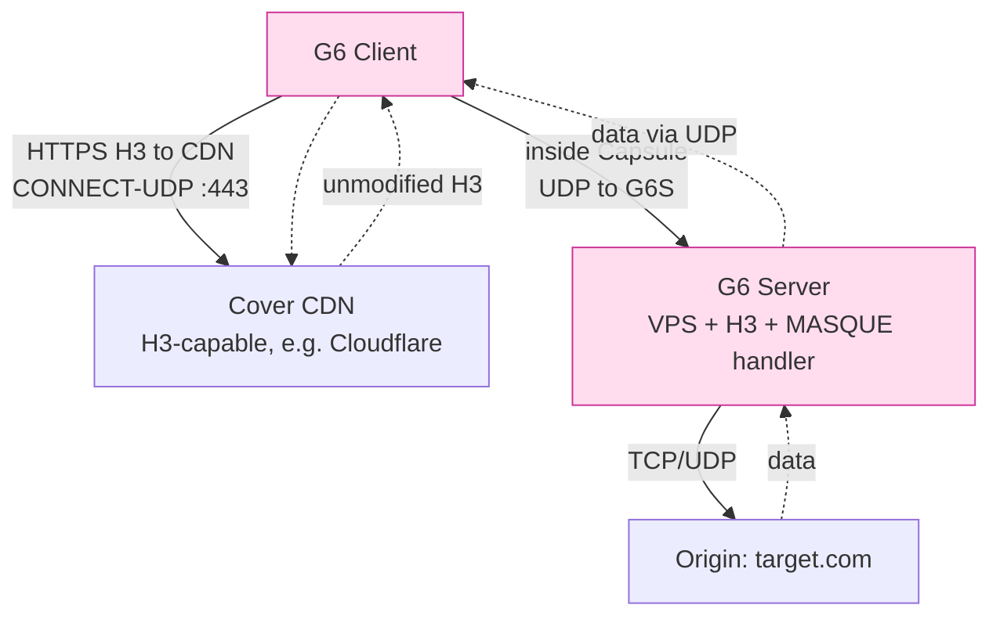
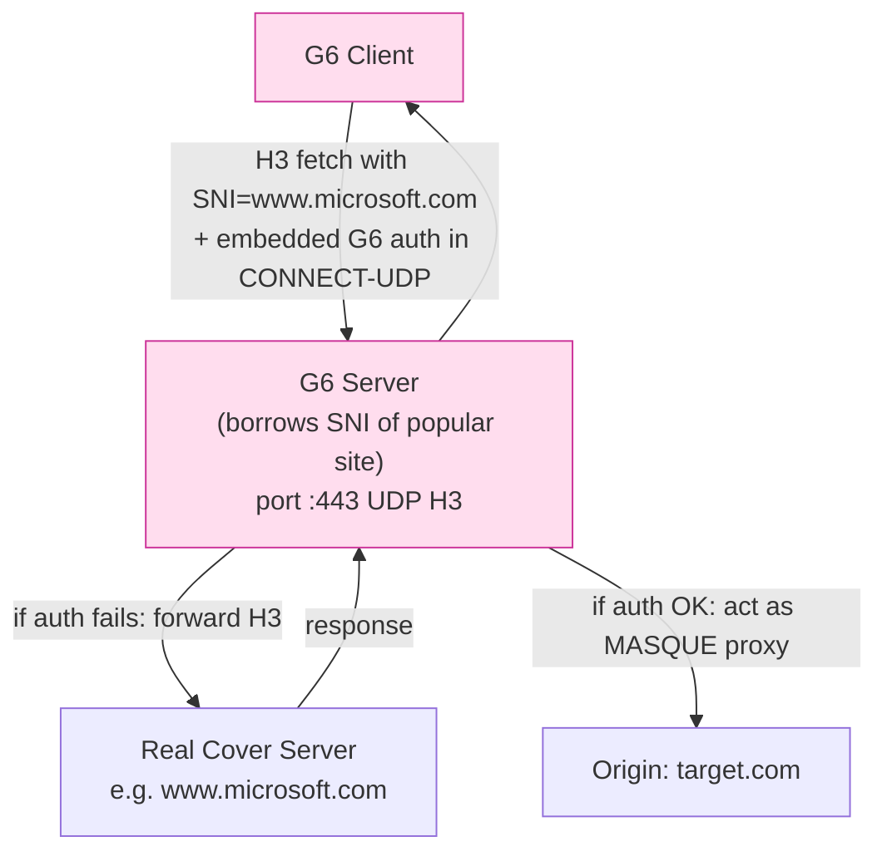

# 課堂 11.4 — 主架構決策：G6 design rationale

## 學前知道
- 前置課：11.1（capability matrix）、11.2（goals）、11.3（candidate G6-α/β/γ）。
- 前置論文：所有 11.3 引用的 + 以下補充：
  - **Bindel, Brendel, Fischlin, Goncalves, Stebila**. *Hybrid Key Encapsulation Mechanisms and Authenticated Key Exchange*. PQCrypto 2019. — hybrid KEM 的 reduction。
  - **Stebila, Fluhrer, Gueron**. *Hybrid Key Exchange in TLS 1.3*. draft-ietf-tls-hybrid-design-11 (May 2025).
  - **Schinazi, Pauly**. *HTTP Datagrams and the Capsule Protocol*. RFC 9297, August 2022.
  - **Pauly, Schinazi**. *Proxying UDP in HTTP*. RFC 9298, August 2022.
  - **Hamburg, Reescu, ed.**. *MASQUE: Multiplexed Application Substrate over QUIC Encryption* charter.
  - **Iyengar, Swett (eds.)**. *QUIC Loss Detection and Congestion Control*. RFC 9002, May 2021.
  - **Cardwell et al.**. *BBRv3*. IETF 117 draft. — congestion control SOTA.
  - **Xue et al. 2024 (TLS-in-TLS)** — 已在 11.3 引。
- 預計閱讀時間：60 分鐘
- 必讀原始碼：
  - `quic-go/quic-go` (`internal/handshake/`, `internal/protocol/`)
  - `cloudflare/quiche` (Rust QUIC + H3)
  - `apernet/hysteria` (Go) — Hysteria2 brutal CC + masquerade
  - `xtls/xray-core` (`proxy/vless/`, `transport/internet/reality/`)
  - `cloudflare/pingora` 的 H3 module — 對標 production-grade H3 transport

## 動機

11.3 留下三個 candidate：

- **G6-α**：TLS-over-TCP + REALITY + PQ
- **G6-β**：raw QUIC + REALITY-on-QUIC + PQ
- **G6-γ**：MASQUE-CONNECT-UDP over H3 + PQ

本堂做選擇，並把選擇的理由寫成一份 design rationale doc，足以拿給 academic review。任何後續設計動作只要回頭問「為什麼選 γ 不是 α」，都應該能在這份文件裡找到答案。

設計選擇的方法論：**對每個 candidate 計分卡**——把 11.2 的 SEC/CAR/PERF/DEP target 當行，candidate 當列，每格給 ✅/△/❌ + 一句 evidence。

---

## 核心概念

### 1. 計分卡

每格的判分依據：

- ✅：candidate 設計天然滿足，或有現成 SOTA 證據顯示能達成。
- △：candidate 能達成但需額外工程或妥協。
- ❌：candidate 結構上不能達成或代價過高。

| 目標 | G6-α (TLS+REALITY) | G6-β (QUIC+REALITY) | G6-γ (MASQUE/H3) |
|---|---|---|---|
| **SEC-1..4** | ✅ TLS 1.3 stack | ✅ TLS 1.3 in QUIC | ✅ TLS 1.3 in QUIC |
| **CAR-1 vs A_naive** | ✅ | ✅ | ✅ |
| **CAR-1 vs A_dl (1-day)** | △（依 padding） | △ | ✅（H3 cover） |
| **CAR-1 vs A_longterm** | △ | △ | △ |
| **CAR-2 active-probe** | ✅（REALITY） | ✅（REALITY-on-QUIC） | ✅（CONNECT-UDP forward） |
| **CAR vs TLS-in-TLS (C11)** | ❌（結構性 vulnerable） | ✅ | ✅ |
| **PERF-1 goodput** | △ TCP HoL | ✅ QUIC streams | ✅ |
| **PERF-2 1-RTT** | ✅ | ✅ | ✅ |
| **PERF-2 0-RTT** | △ | ✅ | ✅ |
| **PERF-5 mem/session** | ✅ | ✅ | △ (H3 overhead) |
| **DEP-1 1vCPU/1GB** | ✅ | ✅ | △ H3 stack 較重 |
| **DEP-2 sing-box plugin** | ✅ existing | ✅ existing | △ MASQUE plugin TBD |
| **DEP-3 訂閱格式** | ✅ | ✅ | △ MASQUE URI 規格未廣泛採 |
| **DEP-4 cover URL** | ✅ | ✅ | ✅ |
| **Maturity of stack** | ✅✅ (TLS) | ✅ (QUIC) | △ (MASQUE 仍演進) |

差距集中於三點：

1. **CAR vs TLS-in-TLS (C11)** — 致命差距。
2. **PERF (TCP HoL vs QUIC)** — α 結構性輸。
3. **MASQUE 成熟度** — γ 輸給 α/β。

### 2. 關鍵 deciding factor：C11 TLS-in-TLS

Xue et al. USENIX Security 2024 *Fingerprinting Obfuscated Proxy Traffic with Encapsulated TLS Handshakes*：

- **威脅**：當 G6 內部又 tunnel 一個 TLS handshake（例 client 透過 G6 連 https://target.com），inner TLS handshake 的 packet-size + segmentation pattern 在 outer TLS-over-TCP 中可被識別。
- **量化**：對 VLESS+TLS、Trojan、Outline-over-TLS 的實測 detection accuracy > 0.9。
- **根因**：TLS record layer 將 inner TLS handshake messages 切成可預測的 record size，外層 TLS 沒有 padding 政策足以掩蓋。

**對 G6-α 的影響**：致命。G6-α 是 TLS-over-TCP，inner 仍是 TCP stream，任何 user 跑 inner HTTPS 都會被 TLS-in-TLS detector 命中。

**對 G6-β 的影響**：較弱。QUIC 用 datagram + stream，inner HTTPS（若是 H3）會落在 QUIC stream 內，但 QUIC packet 已 padded 到 MTU 且 connection ID 加密，inner record boundary 不直接外洩。但 inner H1/H2 仍走 stream，仍有風險。

**對 G6-γ 的影響**：最弱。MASQUE CONNECT-UDP 的 inner 是 raw UDP datagram (encapsulated in HTTP Datagrams per RFC 9297)，沒有 TLS record layer 的中間段，inner TLS handshake 完全消失在 datagram 序列中。

**判決**：G6-α **out**。

### 3. 剩下 G6-β vs G6-γ

| 維度 | G6-β | G6-γ |
|---|---|---|
| Transport 複雜度 | 中（QUIC v1） | 高（QUIC + H3 + Capsule + CONNECT-UDP） |
| CAR-1 對 A_dl | △ | ✅ — cover server 是真實 H3 endpoint |
| CAR-1 long-term | △ — QUIC connection ID rotation 是 leak | △ — MASQUE multiplex 可掩蓋 |
| CAR-2 | ✅ (server 必須做 raw-QUIC REALITY) | ✅✅ (cover server 是真實 CDN H3) |
| Active probe response | G6 server 親自處理 | cover CDN 親自處理（真 H3） |
| Cover server requirement | self-hosted | popular CDN with H3 |
| TLS-in-TLS 風險 | low | very low |
| 部署阻力 | low（VPS + QUIC lib） | high（cover CDN cooperation 或 CONNECT-UDP relay） |
| Spec 工作量 | medium | high |
| Reference impl 存在 | quic-go + Hysteria2 patterns | MASQUE drafts 部分 impl |

關鍵 trade-off：**CAR vs DEP**。

### 4. 決策：G6-γ MASQUE-based，但 with G6-β fallback transport

最終 architecture：



> ⚠️ 上圖的核心：client 看上去就是「在用 H3 訪問 CDN」，CONNECT-UDP request 包在 H3 frame 內，從 censor 角度看與真實 H3 fetch 無區分。inside Capsule 的 inner traffic 是 G6 ↔ G6S 的 QUIC connection。

但這要求 cover CDN 願做 MASQUE proxy。實際上 Cloudflare/Fastly 等並未對 individual users 開放 MASQUE proxy 服務（截至 2025 H1）。所以**現實 deploy 需要 G6S 自己跑一個 H3 server 並做 MASQUE handler**，且該 server 對外的 SNI 借真實 popular SNI（REALITY-style）：



這是 G6-γ 的最終架構：**MASQUE+REALITY combination**。

### 5. Fallback transport：G6-β

不是所有環境都允許 UDP 443。某些境內 ISP 對 UDP 流量做 QoS 降速，或 NAT 對 UDP 連線 binding 短。G6 spec MUST 提供 **fallback transport**：

```
Primary: G6-γ MASQUE/H3 over UDP-443
Fallback: G6-β QUIC over UDP-443 (no H3 wrap, REALITY-on-QUIC)
Last resort: G6-α TLS-over-TCP-443 (with TLS-in-TLS mitigation: forced inner padding)
```

Fallback 機制：client 先嘗試 γ，若 handshake 失敗（timeout 或 reset）切 β，再失敗切 α。每 candidate 用不同 server-side port 或 ALPN，由 client 主動 race（HappyEyeballs-style）。

> Last-resort α 啟用時必須開「inner padding mode」——對所有 inner stream segment 強制 round to 1280B。Xue 2024 的攻擊在 inner segment 不再可預測時退化到 no-op。

### 6. Congestion control 選擇

G6-β/γ 在 QUIC 之上。RFC 9002 default 是 NewReno；BBRv2 / BBRv3 是 SOTA（Cardwell 2017+IETF drafts）。Hysteria2 用一個自家「Brutal CC」（rate-paced, no AIMD），在 lossy link 上效能 > BBR 但 fairness 差。

G6 採 **BBRv3** 為 default，理由：

1. 在 high-BDP / 1% loss 場景下 goodput 接近 link bw（PERF-1 hit）。
2. fairness 與 NewReno coexistence acceptable（Cardwell 2022 IETF report）。
3. 不像 Hysteria2 Brutal 引入 fairness 爭議（社群輿論已有反彈：「VPN 不該 starve 其他 user」）。

Brutal CC 作為**選項**保留（spec 寫 MAY），但 default 為 BBRv3。

### 7. Crypto suite 最終決定

| 用途 | 選 | 理由 |
|---|---|---|
| AEAD | ChaCha20-Poly1305（default）/ AES-256-GCM-SIV（alt） | hardware-agnostic perf；ARM 上 ChaCha20 比 AES 快 2-3x |
| Hash | BLAKE3 (for KDF inside G6); SHA-256 (for TLS 1.3 compatibility) | BLAKE3 速度快 5-10x；TLS 1.3 ciphersuite 用 SHA-256/384 |
| ECDHE | X25519 | RFC 7748, ubiquitous |
| KEM | ML-KEM-768 (NIST FIPS-203 final) | 對 PQ adversary 採 NIST L3 |
| Hybrid KE | KDF(X25519 ‖ ML-KEM-768) | Bindel et al. 2019 IND-CCA reduction |
| Signature | Ed25519 for server static key; ML-DSA-65 only behind explicit flag | PQ signature 體積大 (~3.3KB)，default 仍 Ed25519 |
| KDF | HKDF-SHA-256（TLS 1.3 compat）；BLAKE3-derive_key（內部 cell schedule） | TLS 1.3 必須 HKDF |
| MAC for tickets | HMAC-SHA-256 | TLS 1.3 兼容 |

> **設計選擇**：將 long-term signature 暫不上 PQ，等 ML-DSA 部署 IETF 整合穩定後切換。Mosca's theorem：簽章可後驗，加密必須前驗。SNDL 對加密影響大，對簽章影響小（簽章被偽造需 attacker live in present）。

### 8. Anti-active-probing 機制細節

REALITY-style 三層：

1. **SNI 借用**：server certificate 用真實 popular host 的 cert（透過 ACME）。
2. **Handshake auth**：client 在 ClientHello extension（type = 0xfe0d, "reality" reserved private use）內嵌一個 X25519 public key + AEAD-encrypted authenticator。Server 用其長期 private key 試解 → 成功則認 G6，失敗則 forward。
3. **Fallback forwarding**：失敗時，server 把整個 connection（含已收的 ClientHello）原樣 forward 給 cover CDN，TCP/UDP 中繼。Cover 的 response 直接回 client，server 不再介入。

Frolov NDSS 2020 對 probe-resistant proxy 的攻擊（outside-behaviour leak）對策：

- **Response time variance**：fallback forwarding 引入 < 1ms RTT inflation（spec 要求）。
- **TCP option fingerprint**：server OS 採 Linux + standard `net.ipv4.tcp_*` tuning。
- **TLS extension order**：handshake 由 cover server 處理；G6 server 不 modify。
- **Connection reuse**：cover server 的 keep-alive 由它自己管。

### 9. Padding / shaping 機制最終決定

採三層 hybrid：

```
Layer 1 (cell): each datagram padded to 1280B (MTU-safe for IPv4+IPv6, 含 QUIC header overhead)
                exceptions: handshake packets (用 cover protocol natural size)
Layer 2 (rate-shaping): when active, IAT follows cover-conditioned distribution
                with α ≤ 0.3 budget for added padding bandwidth
Layer 3 (idle): no dummy traffic when idle > 5s
                (rationale: 對 long-term aggregator，idle 期 distinct from cover)
                trade-off: 接受 ε_longterm > τ_stretch
```

### 10. Design rationale 摘要

| 決策 | 選 | 替代 | 為什麼選 | 拋棄替代的代價 |
|---|---|---|---|---|
| Transport substrate | MASQUE/H3 over UDP-443 (γ) | TLS/TCP (α), raw QUIC (β) | CAR-1 strongest + TLS-in-TLS immunity | DEP complexity + maturity risk |
| Fallback transport | β, α last-resort | only γ | DEP-4 robustness | + spec complexity |
| Handshake | TLS 1.3 borrow + REALITY auth | Noise IK | CAR-1 inherits TLS 1.3 fingerprint | Noise simplicity |
| KEM | Hybrid X25519 + ML-KEM-768 | X25519 only | C10 SNDL adversary | +2KB handshake size |
| Signature | Ed25519 (PQ optional) | ML-DSA-65 mandatory | PERF-2 RTT + cert size | future-proof debt |
| AEAD | ChaCha20-Poly1305 default | AES-GCM only | ARM perf parity | minor x86 throughput |
| Congestion | BBRv3 | Brutal / NewReno | fairness + PERF-1 | not maximum aggressive |
| Cover | REALITY-style SNI-borrowing | self-domain HTTPS | CAR-2 strongest | infra restriction (must borrow popular SNI) |
| Padding | 1280B cell + cover IAT + idle off | Tamaraw fixed-schedule | PERF-1 + acceptable ε | weaker long-term resistance |
| Idle behaviour | No dummy when idle | Tor-style constant | PERF-5 + battery | ε_longterm > τ_stretch |

---

## 與我們協議設計的關聯

本堂之後所有設計動作（11.5–11.8 spec、11.9–11.11 formal verification）都基於 G6-γ + β/α fallback 架構。Spec 撰寫從 11.5 開始 byte-by-byte 定義 wire format。

---

## 動手

1. 把 design rationale 表（節 10）轉成一頁 PDF（A4），交給虛擬 reviewer。預期挑刺：「為什麼 BBRv3 不是 Brutal？」「為什麼 idle 不發 dummy？」每個都要能用 SEC/CAR/PERF/DEP 編號回應。
2. 量測你 VPS 在 1Gbps link、50ms RTT 場景下 quic-go 跑 BBRv2 的 goodput。記下與 PERF-1 (0.95 BDP) 的差距。
3. 用 Cloudflare quiche （Rust）或 quic-go (Go) 寫一個 minimum H3 server，加一個 MASQUE CONNECT-UDP handler（RFC 9298 §4）。這就是 G6 server 的 H3 layer minimum spike。

---

## 自我檢查

1. 為什麼 G6-α 是死的？提供至少兩個獨立論據（TLS-in-TLS + 還有什麼？）。
2. 為什麼選 MASQUE/H3 而不是 raw QUIC？答：cover server 是真 H3，passive aggregator 看不出 H3 與 G6 差異。
3. 為什麼 fallback transport 必要？是否違反「single design」原則？答：DEP-4 要求應對 NAT/QoS hostility；spec 內部 versioning frame 標明 fallback path 是 normative。
4. 為什麼 ML-DSA-65 不 default 開啟？答：cert chain 體積 + handshake RTT 對 PERF-2 衝擊。Mosca theorem 允許簽章 lag。
5. 為什麼 BBRv3 不是 Brutal？答：fairness + 社群反彈。Brutal 啟用為 server-side opt-in。

---

## 延伸閱讀

- **draft-ietf-tls-hybrid-design-11** — Hybrid KE in TLS 1.3, IETF SOTA。
- **draft-ietf-quic-transport** + **RFC 9001** — TLS 1.3 + QUIC bridging 細節。
- **Cardwell BBRv3 IETF 117 talk** — BBR 與 fairness 的最新討論。
- **Frolov NDSS 2020** — probe-resistant proxy 攻擊面。
- **REALITY README** + **xtls/reality** Go source — 我們借的設計參考。

---

## 研究級補遺

### 1. 學界詞彙

| 中文 / 口語 | 學術術語 | 出處 |
|---|---|---|
| 計分卡 / Trade-off matrix | Decision matrix / pugh chart | Pugh, 1991, *Total Design* |
| 設計理由文件 | Design rationale document | Lee 1997, ACM Computing Surveys |
| 退路傳輸 | Fallback transport | RFC 8305 (HappyEyeballs v2) |
| Inner-protocol detection | TLS-in-TLS / encapsulated TLS handshake fingerprint | Xue USENIX 2024 |
| 借真實伺服器擋探測 | Opportunistic / SNI-borrowing proxy | REALITY README |
| 並聯 KEM | Combined / parallel KEM, hybrid KEM | Bindel et al. 2019 |

### 2. 對手分類學 / 威脅模型精化

對 G6-γ 的新威脅面：

- **C11' Capsule-layer fingerprint**：MASQUE Capsule frames 也有 size/IAT pattern。Xie et al.（2024 IMC 草稿）已開始研究 MASQUE-specific fingerprint。對策：Layer 1 cell 仍生效。
- **C7' Cover-CDN-side metadata leak**：如果 G6 server 自己跑 H3，cover CDN 看不到。如果用 third-party MASQUE proxy（unrealistic for individual user），CDN log 可能能看到 G6 client IP → cover URL pair。

### 3. 形式化定義

**Composition theorem for hybrid KEM (Bindel 2019)**：

```
Let KEM_1 (classical, e.g. X25519) be IND-CCA secure with advantage ε_1.
Let KEM_2 (PQ, e.g. ML-KEM-768) be IND-CCA secure with advantage ε_2.
Let KEM_H = KDF(K_1 ‖ K_2) where K_i = KEM_i.encap().

Theorem: KEM_H is IND-CCA secure with adv ≤ ε_1 + ε_2 in ROM.
Theorem (stronger, Bindel et al.): adv ≤ min(ε_1, ε_2) in QROM under sub-assumptions.
```

這是 G6 hybrid KE 採用此構造的 formal foundation。

**Active-probe indistinguishability formal target**：

```
G6 server's network behaviour 對任何 probe sequence q,
  Output(G6_server, q) ≈_c Output(cover_server, q)
where ≈_c is computational indistinguishability.
```

Reduction：因為 fallback forwards 即把兩條 trace 物理 reduce 為同一條（同樣的 cover server 處理），等同 perfect indistinguishability under "fallback works correctly" assumption。

### 4. 領域的關鍵論文 / 規格 / 原始碼

| 文獻 | 為什麼追 | 之後在哪一堂精讀 |
|---|---|---|
| Bindel PQCrypto 2019 | hybrid KEM reduction | 本堂 + 11.6 |
| draft-ietf-tls-hybrid-design | TLS 1.3 hybrid integration | 11.6 |
| RFC 9298/9484 (MASQUE) | wire-level spec | 11.5 |
| RFC 9297 (Capsule) | inner transport | 11.5 |
| Cardwell BBR papers 2017/2022/2024 | CC SOTA | 12.4 |
| Xue USENIX 2024 (TLS-in-TLS) | 致命攻擊 | 本堂 |
| Frolov NDSS 2020 (probe-resistant) | REALITY 攻擊面 | 11.7 |
| Lee ACM CSUR 1997 | design rationale 範式 | 11.14 |
| quic-go source | reference impl | Part 12 |
| cloudflare/quiche source | reference impl Rust | Part 12 |
| xtls/reality source | REALITY design notes | Part 12 |

### 5. 我們協議的座標 / 設計取捨

本堂 finalize：

- **Architecture**: G6-γ MASQUE/H3 over UDP-443 + β fallback + α last-resort
- **Handshake**: TLS 1.3 borrow + REALITY-style auth in ClientHello extension
- **KEM**: Hybrid X25519 + ML-KEM-768
- **AEAD**: ChaCha20-Poly1305 default
- **CC**: BBRv3
- **Cover**: SNI-borrowing + auth-fail forward
- **Padding**: 1280B cell + cover IAT shaping + no idle dummy

仍 open（11.5–11.8 finalize）：
- ClientHello extension 編碼細節（11.5）
- handshake state machine（11.6）
- error handling / replay protection（11.7）
- extension framework / version negotiation（11.8）

### 6. 必追資源 / 社群入口

- IETF MASQUE WG mailing list
- IETF TLS WG (hybrid PQ design)
- IETF QUIC WG (BBRv3, CC)
- Cloudflare research blog (H3/MASQUE/PQ rollout)
- gfw.report (latest GFW capability against H3)

### 7. 開放問題

1. **MASQUE fingerprint stability**：MASQUE Capsule 內 inner UDP 流量是否與真 H3 GET/POST 在大規模 aggregation 下仍 indistinguishable？尚無公開量測。
2. **PQ signature ramp 時程**：Ed25519 → ML-DSA-65 切換的最佳 trigger 是什麼？「ML-DSA 部署率 > X%」這個 X 沒有共識。
3. **REALITY-on-QUIC 的 formal verification**：REALITY 借真 cover 的 forward 機制在 QUIC 0-RTT 場景下是否仍滿足 active-probe indistinguishability？尚無 ProVerif/Tamarin 公開 model。
4. **BBRv3 vs Hysteria Brutal fairness 量化**：在 G6 deployment 規模下（thousands of nodes）兩者對 cross-traffic 公平性差距多大？需大規模 testbed。
5. **Fallback race 帶來的 fingerprint**：HappyEyeballs-style 三 transport race 是否引入新 fingerprint（時序、source port pattern）？

---

> **本堂結語**：G6 架構 lock。下一堂 11.5 開始 byte-by-byte 定義 wire format。
