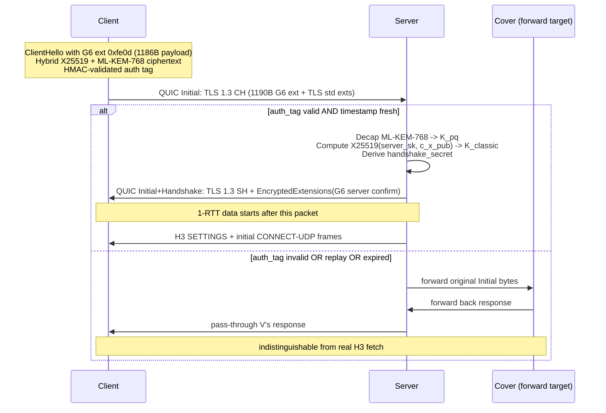
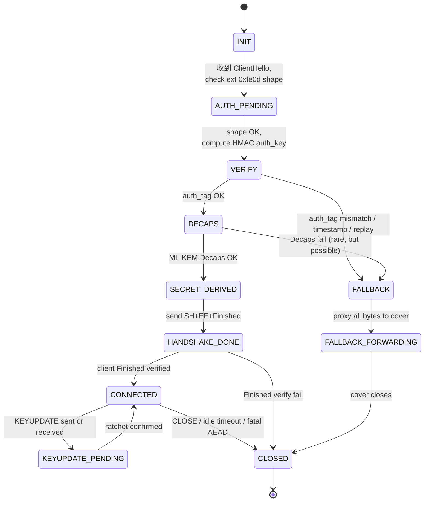
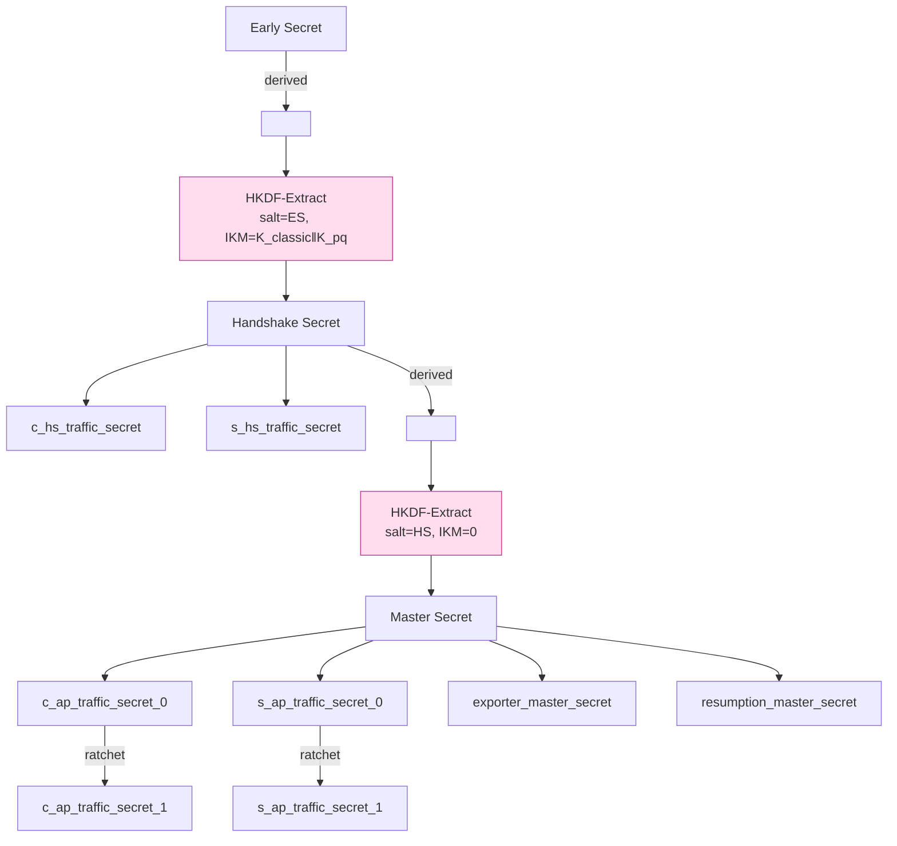

# 課堂 11.6 — Spec（二）：握手與狀態機

## 學前知道
- 前置課：11.5 wire format。本堂在那些 bytes 之上建立 protocol semantics。
- 必讀規格與論文：
  - **Krawczyk**. *SIGMA: The "SIGn-and-MAc" Approach to Authenticated Diffie-Hellman and Its Use in the IKE Protocols*. CRYPTO 2003. precis: [`notes/papers/krawczyk-sigma-2003.md`](../../notes/papers/krawczyk-sigma-2003.md)
  - **Krawczyk**. *HMQV: A High-Performance Secure Diffie-Hellman Protocol*. CRYPTO 2005. precis: [`notes/papers/krawczyk-hmqv-2005.md`](../../notes/papers/krawczyk-hmqv-2005.md)
  - **Perrin**. *The Noise Protocol Framework*, rev 34. — Noise IK reference handshake。
  - **Krawczyk & Eronen**. *HMAC-based Extract-and-Expand Key Derivation Function (HKDF)*. RFC 5869.
  - **Rescorla**. *The Transport Layer Security (TLS) Protocol Version 1.3*. RFC 8446. — TLS 1.3 key schedule 模板。
  - **Cohn-Gordon, Cremers, Garratt**. *On Post-Compromise Security*. JoC 2016. precis: [`notes/papers/cohn-gordon-pcs-2016.md`](../../notes/papers/cohn-gordon-pcs-2016.md)
  - **Donenfeld**. *WireGuard*. NDSS 2017. precis: [`notes/papers/donenfeld-wireguard-2017.md`](../../notes/papers/donenfeld-wireguard-2017.md)
  - **Fischlin, Günther**. *Multi-Stage Key Exchange and the Case of Google's QUIC Protocol*. CCS 2014. precis: [`notes/papers/fischlin-gunther-zero-rtt.md`](../../notes/papers/fischlin-gunther-zero-rtt.md)
  - **Bindel et al.**. *Hybrid KEM in TLS 1.3*. — hybrid integration。
- 預計閱讀時間：90 分鐘
- 必讀原始碼：
  - `wireguard-go/device/noise-protocol.go` — Noise IK reference handshake
  - `quic-go/internal/handshake/crypto_setup.go` — TLS 1.3 + QUIC key schedule bridging
  - `cloudflare/quiche src/crypto.rs` — QUIC AEAD key derivation
  - `xtls/reality reality.go:300-700` — REALITY handshake

## 動機

握手是協議裡安全屬性最密集的一段。

- **若狀態機有漏洞**：mutual auth 失效（如 SSL 2.0 對 ChangeCipherSpec 順序的縱容）；
- **若 key schedule 有依賴錯**：forward secrecy 失效；
- **若 transcript binding 弱**：downgrade attack 成功（FREAK、LogJam 是經典）。

本堂用兩種形式 specify 握手：

1. **State machine** — Mermaid stateDiagram-v2 + state transition table。
2. **Pseudocode** — client/server 雙端的 `handshake()` 函數。

外加 key schedule 圖（仿 TLS 1.3）。

> Spec v0.0 全部寫進 `assets/spec/g6-v0.0-handshake.md`。

---

## 核心概念

### 1. Handshake high-level flow



### 2. State machine



State transition table（server-side）：

| Current State | Event | Action | Next State |
|---|---|---|---|
| INIT | recv QUIC Initial with TLS CH | parse ext 0xfe0d | AUTH_PENDING (if present), FALLBACK (if absent) |
| AUTH_PENDING | shape OK | compute HMAC auth_key | VERIFY |
| AUTH_PENDING | shape malformed | start forward | FALLBACK |
| VERIFY | HMAC OK + ts fresh + nonce unseen | run ML-KEM Decaps | DECAPS |
| VERIFY | HMAC OK + ts stale | log + forward | FALLBACK |
| VERIFY | HMAC OK + nonce seen | log replay event + forward | FALLBACK |
| VERIFY | HMAC fail | forward | FALLBACK |
| DECAPS | success | derive ES,HS,MS | SECRET_DERIVED |
| DECAPS | fail | forward | FALLBACK |
| SECRET_DERIVED | — | send SH + EE + ServerFinished | HANDSHAKE_DONE |
| HANDSHAKE_DONE | recv ClientFinished OK | open H3 stream | CONNECTED |
| HANDSHAKE_DONE | recv ClientFinished fail | abort | CLOSED |
| CONNECTED | recv KEYUPDATE | apply ratchet | KEYUPDATE_PENDING |
| KEYUPDATE_PENDING | confirm received/sent | install new key | CONNECTED |
| CONNECTED | recv CLOSE | flush | CLOSED |
| CONNECTED | idle > 60s | send CLOSE | CLOSED |
| CONNECTED | AEAD tag fail in DATA | silent drop（不要轉 CLOSED） | CONNECTED |

> **AEAD fail 不關閉連線**——因為對手在 wire 注 garbage 可觸發大量 close，是 DoS oracle。RFC 9001 對 QUIC 也是同樣處理（AEAD fail in DATA 是 drop，only handshake AEAD fail 是 fatal）。

### 3. Key schedule（hybrid KDF tree）

仿 TLS 1.3 §7.1 key schedule，加 hybrid KEM 步驟：

```
                    0
                    |
                    v
client_nonce  ->  HKDF-Extract = Early Secret (ES)
       |
       +-> Derive-Secret(ES, "ext binder" | "res binder", "") = binder_key
       +-> Derive-Secret(ES, "c e traffic", ClientHello) = c_early_traffic
       +-> Derive-Secret(ES, "e exp master", ClientHello) = early_exporter_secret
       v
       Derive-Secret(ES, "derived", "") <-- input salt for next stage

                    +-- K_classic  := X25519(c_x_pub, s_x_sk)        (32 bytes)
                    +-- K_pq       := ML-KEM-768 Decaps(c_mlkem_ct)  (32 bytes)
DH_input := K_classic || K_pq   (64 bytes total)

                    v
HKDF-Extract(salt=derived(ES), IKM=DH_input) = Handshake Secret (HS)
       |
       +-> Derive-Secret(HS, "c hs traffic", CH..SH) = c_hs_traffic_secret
       +-> Derive-Secret(HS, "s hs traffic", CH..SH) = s_hs_traffic_secret
       v
       Derive-Secret(HS, "derived", "")

                    v
HKDF-Extract(salt=derived(HS), IKM=0) = Master Secret (MS)
       |
       +-> Derive-Secret(MS, "c ap traffic", CH..SF) = c_ap_traffic_secret_0
       +-> Derive-Secret(MS, "s ap traffic", CH..SF) = s_ap_traffic_secret_0
       +-> Derive-Secret(MS, "exp master",    CH..SF) = exporter_master_secret
       +-> Derive-Secret(MS, "res master",    CH..CF) = resumption_master_secret

每個 *_traffic_secret 之上：
  key  = HKDF-Expand-Label(secret, "key", "", AEAD_key_length)
  iv   = HKDF-Expand-Label(secret, "iv",  "", 12)
```

Ratchet (KEYUPDATE)：

```
new_c_ap_traffic_secret = HKDF-Expand-Label(old_c_ap_traffic_secret,
                                            "g6 ratchet", "", Hash.length)
```



> 與 RFC 8446 完全 align，除了 HKDF-Extract IKM 改為 `K_classic ‖ K_pq` 而非單一 ECDH output。draft-ietf-tls-hybrid-design 採此構造（"concatenation hybrid"），Bindel 2019 已給 IND-CCA reduction。

### 4. Transcript hash（防 downgrade）

```
CH    = ClientHello bytes (含 0xfe0d ext)
SH    = ServerHello bytes
EE    = EncryptedExtensions
SF    = ServerFinished
CF    = ClientFinished

transcript_hash_after(X) = SHA-256( ... bytes up to and including X )
```

`Derive-Secret(secret, label, msgs)` 內 `msgs` 是相應 transcript prefix。任何中間消息被改 → hash 變 → key 不同 → AEAD 解失敗。

**Hybrid 下的 transcript binding**：

```
TLS 1.3 std transcript 已包含 client_key_share + server_key_share (即 X25519 部分).
G6 ext 0xfe0d 在 CH 內，故 transcript 自動覆蓋 PQ ciphertext.
ServerFinished MAC 對 transcript 計算，攻擊者改任何 byte 都會被 detect.
```

### 5. KEYUPDATE / ratchet

對應 SEC-4 (forward secrecy) 強化與 post-compromise security (PCS, Cohn-Gordon 2016)。

#### 5.1 Trigger

任一條件：

- 從上次 ratchet 起累積發送 ≥ 2³² packets；
- 從上次 ratchet 起經過 ≥ 24 hours；
- 應用層 explicit request（client may set spec config）；
- 對方先發 KEYUPDATE。

#### 5.2 流程

1. Sender 計算 `new_secret = HKDF-Expand-Label(old_secret, "g6 ratchet", "", 32)`.
2. Sender 派生 new key/iv.
3. Sender 發 KEYUPDATE packet（type=0x06），payload 內含 `next_epoch = old_epoch + 1` + transcript hash of CONNECTED state.
4. Sender 用 **new key** 加密 KEYUPDATE 後的下一個 DATA packet.
5. Receiver 收到 epoch 變更，比對 transcript hash，install new key.
6. Old key 在 `2 × max_retransmit_window` 後 zeroized.

#### 5.3 Concurrent ratchet

雙方各自管自家方向 secret，互不干擾。所以 `c_ap_traffic_secret_N` 與 `s_ap_traffic_secret_N'` 的 N 不必相同。

#### 5.4 Post-compromise security

若 attacker 在 N 時點獲得 `*_traffic_secret_N`，但在 N+k 時點未獲 secret：

- attacker 可解 N..N+k-1 之間 traffic。
- N+k 之後 ratchet 後 attacker 不能解，因為 `HKDF-Expand-Label` 是 forward-only computation。

這對應 Cohn-Gordon 2016 的 "PCS strong" 屬性。

> 注：true PCS-strong 要求 ratchet 引入 **fresh randomness**（即不只是 HKDF derive，要 mix in 新 DH 或 KEM）。我們的 ratchet 是 KDF-only（unidirectional ratchet），介於 PCS-weak 與 PCS-strong 之間。若要 PCS-strong，KEYUPDATE 內可選 attach a fresh X25519 share——v0.2 extension，v0.1 暫不啟。

### 6. 0-RTT data path

採 TLS 1.3 0-RTT 機制，但**只允許 idempotent 應用**（HTTP GET-like）：

#### 6.1 Resumption ticket

- Server 在 first session 結束時可發 resumption ticket（NewSessionTicket message）.
- Ticket 內含 `psk_identity = AEAD(server_psk_key, n=fresh, ad="g6_psk", pt=client_id || expiry)`.
- Client store ticket，下次 connect 可用。

#### 6.2 0-RTT key

```
psk = derived from previous session's resumption_master_secret
early_secret = HKDF-Extract(salt=0, IKM=psk)
c_early_traffic_secret = Derive-Secret(early_secret, "c e traffic", ClientHello)
```

#### 6.3 Anti-replay

- Server 對每個 ticket 強制 `single use within validity window`。
- 維護一個 Bloom filter（or trie）of seen `(psk_identity, client_nonce)` pairs.
- Replay → drop early data, fall back to 1-RTT.

#### 6.4 應用層限制

只開放給 `safe_for_replay` 流量（spec 內 stream creation 時 client 標 flag）。

> 0-RTT 的 forward secrecy 比 1-RTT 弱：early data 用的 key 從 ticket derive，若 server 的 long-term ticket-decryption key 洩，所有先前 0-RTT data 可解。對應 Fischlin-Günther CCS 2014 multi-stage analysis。

### 7. Identity hiding

**Initiator identity hiding** = 對 on-path attacker，看不出 client 是哪個 user。

G6 透過 `client_id = AEAD(server_PK_kdf, ad=nonce, pt="user_id")` 達成：

- 對 attacker，每次 client_id ciphertext 不同（nonce 變）→ 看似隨機。
- 對 server，可解 client_id → 知用戶。

> 與 Noise IK 對比：Noise IK 把 initiator static public key 在第一條 message 內以 chaining key 加密發送，attacker 不能識別 initiator。G6 借同一思路。

**Responder identity hiding** = 對 on-path attacker，看不出 server 是 G6 還是 cover？由 REALITY-style + cover forward 達成（11.7 詳述）。

### 8. Pseudocode：client side

```python
def g6_client_handshake(server_static_pk, server_cover_url, user_id):
    # === precompute (offline) ===
    client_id_ct = aead_encrypt(
        key=hkdf(server_static_pk, "g6 cid key"),
        nonce=urandom(12),
        ad="g6_cid",
        pt=user_id
    )  # 16-byte tag, deterministic 4-byte length truncate or similar

    # === fresh per handshake ===
    nonce = urandom(16)
    c_x_sk, c_x_pub = x25519_keygen()
    K_pq, mlkem_ct = mlkem768_encaps(server_static_pk.pq)
    timestamp = (time.time() // 60) % 65536

    auth_key = hkdf_extract(salt=fingerprint(server_static_pk),
                            ikm=c_x_pub + nonce)
    auth_tag = hmac_sha256(auth_key,
        nonce + c_x_pub + mlkem_ct + client_id_ct + i2b(timestamp, 2))

    g6_ext_payload = nonce + c_x_pub + mlkem_ct + client_id_ct + i2b(timestamp, 2) + auth_tag

    # build TLS 1.3 ClientHello with cover_browser_profile=chrome-130
    ch = build_chrome_clientHello(
        sni=server_cover_url,
        key_share_x25519=c_x_pub,
        extra_extensions={0xfe0d: g6_ext_payload},
    )

    # send QUIC Initial with ch in CRYPTO frame
    quic_send_initial(ch)

    # === recv SH ===
    sh, ee = quic_recv_handshake()
    if sh.is_real_server_hello():
        # Decode hybrid: K_classic = X25519(c_x_sk, s_x_pub)
        s_x_pub = sh.extensions[0x33].key_shares[X25519]
        K_classic = x25519(c_x_sk, s_x_pub)
        dh_input = K_classic + K_pq
        # derive secrets per §3
        ES = hkdf_extract(salt=0, ikm=nonce)  # or PSK if 0-RTT
        HS = hkdf_extract(salt=derive(ES, "derived", ""), ikm=dh_input)
        c_hs = derive(HS, "c hs traffic", transcript(ch, sh))
        s_hs = derive(HS, "s hs traffic", transcript(ch, sh))
        ... # finish SF, CF, install MS-derived keys

    elif sh.is_normal_TLS():
        # fallback: G6 auth failed, but TLS is real H3 from cover
        # client should retry with different transport or give up
        raise G6AuthFallback()
```

### 9. Pseudocode：server side

```python
def g6_server_handle_initial(initial_packet):
    ch = parse_client_hello(initial_packet)
    g6_ext = ch.extensions.get(0xfe0d)
    if g6_ext is None or len(g6_ext) != 1186:
        forward_to_cover(initial_packet); return

    (nonce, c_x_pub, mlkem_ct, client_id_ct, ts_bytes, auth_tag) = parse_g6_ext(g6_ext)

    auth_key = hkdf_extract(salt=fingerprint(server_static_pk),
                            ikm=c_x_pub + nonce)
    expected = hmac_sha256(auth_key,
        nonce + c_x_pub + mlkem_ct + client_id_ct + ts_bytes)
    if not constant_time_eq(expected, auth_tag):
        forward_to_cover(initial_packet); return

    ts = b2i(ts_bytes)
    now = (time.time() // 60) % 65536
    if abs((now - ts) % 65536) > 30 and abs((now - ts) % 65536) < 65506:
        forward_to_cover(initial_packet); return  # skew too large

    if replay_filter.check_and_add(nonce):
        forward_to_cover(initial_packet); return

    user_id = aead_decrypt(...)  # check client_id_ct
    if user_id is None:
        forward_to_cover(initial_packet); return

    # === auth passes ===
    K_classic = x25519(server_sk, c_x_pub)
    K_pq = mlkem768_decaps(server_pq_sk, mlkem_ct)
    dh_input = K_classic + K_pq

    ES = hkdf_extract(salt=0, ikm=nonce)
    HS = hkdf_extract(salt=derive(ES, "derived", ""), ikm=dh_input)
    s_hs = derive(HS, "s hs traffic", transcript(ch, sh_to_send))
    c_hs = derive(HS, "c hs traffic", transcript(ch, sh_to_send))
    ... # send SH+EE+SF, await CF
```

### 10. Replay-protection 細節

- nonce window：server 維護 sliding bloom（or per-minute Counting Bloom）of size 2²⁰，per minute 重設。
- 與 timestamp 配合：ts ± 30 minutes 才接受 → bloom 只需保 60 minutes 視窗 = ~10⁶ slots，~125KB memory。
- 與 cover forwarding 配合：replay 失敗 → forward，不洩漏 G6 是否存在。

### 11. Failure cases 表

| Scenario | Server action | Wire-level effect |
|---|---|---|
| auth_tag wrong | forward all bytes to cover | cover handles, real H3 response |
| timestamp out of range | forward to cover | same |
| replay (nonce seen) | forward to cover | same |
| Decaps fail | forward to cover | same |
| user_id decrypt fail | forward to cover | same |
| ClientFinished fail | reset QUIC connection with code 0x01 | abnormal close（rare; only authenticated peer can reach here） |
| Idle timeout (60s) | send CLOSE 0x00 | normal close |
| AEAD tag fail in DATA | silent drop | nothing |
| KEYUPDATE transcript mismatch | send CLOSE 0x10 | error close |

---

## 與我們協議設計的關聯

本堂狀態機 + key schedule 是 ProVerif / Tamarin model（11.10/11.11）的 source。所有 transition + key-derivation step 都會被 1:1 translated 進形式模型。

握手 pseudocode 是 Part 12.3 實作 chapter 的 source。

---

## 動手

1. 拿 RFC 8446 §7.1 key schedule diagram，把它與 §3 of this lesson diff（找出 hybrid KEM 改了哪幾個 input）。
2. 用 `liboqs` (Open Quantum Safe) 寫個 ML-KEM-768 keygen + Encaps + Decaps test，量測 server-side Decaps latency。看是否在 50μs 預算內。
3. 把 §3 key schedule 與 WireGuard noise IK 的 chaining key schedule 對比。注意 WireGuard 是純對稱 chaining，G6 沿 TLS 1.3 是 multi-secret derived。

---

## 自我檢查

1. 為什麼 ratchet 是 KDF-only 而非每次 mix-in 新 DH？答：cost vs PCS-strong trade-off；新 DH 又是 1 RTT，違 PERF-2。
2. 為什麼 `auth_tag` 用 HMAC 而非 KEM Decap 後再驗？答：anti-DDoS，server CPU 預算。
3. 為什麼 fallback 是 "forward bytes"，不是「server 假裝 cover 自己回」？答：indistinguishability 從 cover server 的 outgoing fingerprint 角度看才真正成立。Server 自己 mimic 早被 Houmansadr 2013 證 fragile。
4. 為什麼 client_id 用 server's KDF 加密而非 server's static pubkey 直接加密？答：簡化——server 不需做 X25519 才能解 client_id（DDoS resistance）。
5. KEYUPDATE 為何 包括 transcript hash？答：confirm 雙方對 ratchet 之前的 state 一致，防 middle-attack inserted ratchet。

---

## 延伸閱讀

- **Krawczyk SIGMA 2003** — mutual auth DH protocol 的 game-based 範本。
- **Cohn-Gordon-Cremers-Garratt JoC 2016** — PCS formal definition。
- **Fischlin-Günther CCS 2014** — multi-stage key exchange（0-RTT analysis）。
- **Bhargavan, Brzuska, Fournet, Green, Kohlweiss, Zanella-Béguelin**. *Downgrade Resilience in Key-Exchange Protocols*. S&P 2016.
- **RFC 9001** TLS 1.3 + QUIC bridging — production impl 範本。

---

## 研究級補遺

### 1. 學界詞彙

| 中文 / 口語 | 學術術語 | 出處 |
|---|---|---|
| 雙向認證 | Mutual authentication / mutual entity authentication | ISO/IEC 9798-1 |
| 密鑰確認 | Key confirmation | Krawczyk SIGMA 2003 |
| 抗 KCI | Key Compromise Impersonation resistance | Krawczyk HMQV 2005 |
| 多階段密鑰交換 | Multi-stage key exchange | Fischlin-Günther 2014 |
| 解構 / KDF tree | Hierarchical KDF, key schedule | Bellare-Rogaway 2006 |
| Ratchet (forward-only) | Symmetric ratchet | Marlinspike X3DH 2016 |
| Mix-in DH ratchet | Asymmetric ratchet | Cohn-Gordon et al. 2016 (Signal analysis) |
| 後妥協安全 | Post-Compromise Security (PCS) | Cohn-Gordon-Cremers-Garratt 2016 |
| 轉錄綁定 | Transcript binding / handshake hash | TLS 1.3, RFC 8446 §4.4.1 |

### 2. 對手分類學 / 威脅模型精化

對 handshake 的 attacker：

- **C9 long-term key compromise (replay window scenario)**：attacker 拿 server static SK，攻擊 0-RTT data。spec 對策：0-RTT 限 idempotent。
- **C10 PQ adversary in present (impossible today but model)**：attacker 拿 Shor-capable quantum + classical CDH。Hybrid KEM 對策：security reduces to PQ side ε_PQ.
- **C-handshake-ddos**：attacker 大量發 invalid auth → server 浪費 Decap CPU。HMAC pre-check 對策。

### 3. 形式化定義

**Mutual auth (Bellare-Rogaway 1993, modernized by Krawczyk)**：

```
Game M-Auth:
  Adversary A interacts with multiple (Client, Server) parties.
  A may query Send(id, msg), Reveal(id), Corrupt(id) oracles.
  A wins if a non-corrupted client outputs "accepted" with peer = honest_server,
    but honest_server has no matching session.
  Adv^MA ≤ negl(λ).
```

G6 由 Finished message + transcript hash 達到該屬性。

**KCI resistance (Krawczyk HMQV 2005)**：

```
Game KCI:
  A holds Client's long-term sk_C.
  A acts as a different impersonator pretending to be honest Server B.
  A wins if Client accepts with peer=B.
  Adv^KCI ≤ negl(λ).
```

對 G6：handshake 的 server 對 client 的認證來自 server's TLS cert + handshake signature；attacker 持 client sk 不能偽造 server cert.

### 4. 領域的關鍵論文 / 規格 / 原始碼

| 文獻 | 為什麼追 |
|---|---|
| Krawczyk SIGMA 2003 | mutual auth DH baseline |
| Krawczyk HMQV 2005 | KCI 定義 |
| RFC 8446 §7.1 | TLS 1.3 key schedule（G6 借完） |
| Bindel PQCrypto 2019 | hybrid KEM reduction |
| Cohn-Gordon-Cremers-Garratt JoC 2016 | PCS formal |
| Fischlin-Günther CCS 2014 | multi-stage 0-RTT |
| Marlinspike X3DH 2016 | ratchet design |
| Donenfeld NDSS 2017 | WireGuard handshake 設計 |
| Lipp-Blanchet-Bhargavan EuroS&P 2019 | WireGuard ProVerif/CryptoVerif |
| Cremers TLS 1.3 Tamarin 2017 | TLS 1.3 handshake formal model |

### 5. 我們協議的座標 / 設計取捨

本堂 lock：

- 1-RTT handshake (TLS 1.3 borrow)
- Hybrid KEM in TLS key_share + 0xfe0d ext
- Sliding-window replay protection by client_nonce + timestamp
- KDF-only forward ratchet (PCS-weak/medium)
- 0-RTT optional, restricted to idempotent

仍 open（11.7 finalize）：
- error code 命名空間 final
- AEAD 對 packet number 的 nonce derivation 具體 endian/XOR scheme（仿 RFC 9001）

### 6. 必追資源 / 社群入口

- IETF TLS WG mailing list（hybrid KEM, 0-RTT replay 話題）
- IACR ePrint 2023+「post-compromise security」標籤
- Signal protocol papers (Marlinspike, WhatsApp E2EE analysis)

### 7. 開放問題

1. **PCS-strong without RTT cost**：能否在 1-RTT total cost 下達 PCS-strong？目前 Signal-style 需要每訊息 DH，引入 latency cost。
2. **Hybrid 0-RTT replay window 的 bound**：Bloom filter false positive 與 replay window 的 trade-off 嚴格上限？
3. **Transcript binding 對 cover-borrowed CH 的形式驗證**：當 server fallbacks to cover, 此時 G6 authentication is aborted, the transcript binding 是否仍 sound？需 ProVerif model 涵蓋 fallback path（11.10 to handle）。
4. **Pre-shared key vs 全新 hybrid KEM 對 PERF-2 影響量化**：對 N=10⁶ session/day deployment, 預算約多少 CPU 用於 ML-KEM vs HKDF chains？
5. **PQ signature 引入時程**：CA 與 cert chain 何時切 ML-DSA？G6 是否需要支援 chain-mixed cert（intermediate ECDSA + leaf ML-DSA）？

---

> **本堂結語**：state machine + key schedule 完成。下一堂 11.7 定義 error handling 與 Security Considerations 全章節（仿 RFC 8446 §11）。
