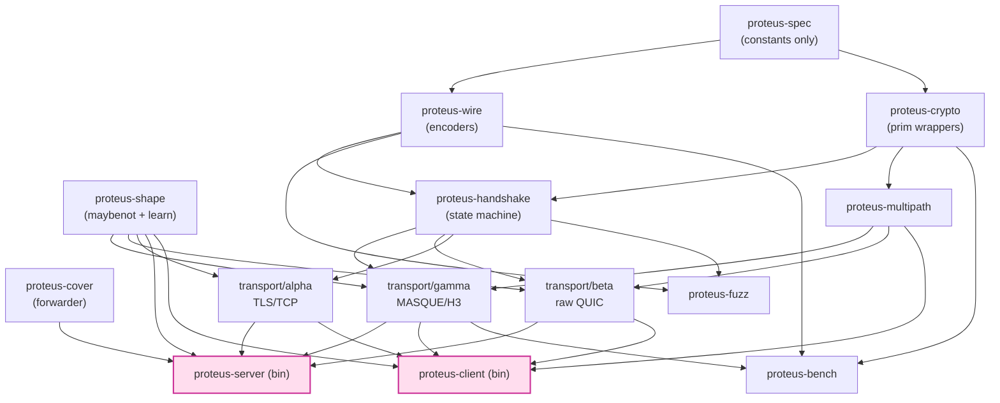

# 課堂 12.0 — Proteus v1.0 實作藍圖

## 學前知道
- 前置課：[11.15 Proteus v1.0 演化](../part-11-design/11.15-proteus-v1-evolution.md)、[11.14 v0.1 capstone](../part-11-design/11.14-design-capstone.md)、整 Part 11.
- 必讀規格：[`assets/spec/proteus-v1.0.md`](../../assets/spec/proteus-v1.0.md) 完整全文.
- 預計閱讀時間：**45 分鐘**（含 cargo workspace skeleton 預覽）
- 必讀原始碼（為 12.1+ 章預備）：
  - `quinn` v0.11.x [quinn-rs/quinn](https://github.com/quinn-rs/quinn) — QUIC v1 + DATAGRAM + 早期 multipath patches
  - `rustls` v0.23.x — TLS 1.3 with extension hook
  - `tokio-uring` v0.5.x — Linux io_uring
  - `RustCrypto/ml-kem`、`RustCrypto/ml-dsa`、`RustCrypto/chacha20poly1305`
  - `maybenot` crate（Pulls 2023 ref impl）

## 動機

Part 12 在 v0.1 設計下原本 24 堂依序鋪 implementation → eval → paper。但 v1.0 spec 引入了 v0.1 沒有的能力（asymmetric ratchet、multipath、shape-shift、cover-IAT 學習、proof-of-puzzle 等），**Part 12 必須對齊 v1.0 而非 v0.1**。

本堂的作用：

1. **總覽**：12.1–12.24 每堂對應 v1.0 spec 哪些 section？
2. **Cargo workspace layout**：把 spec §16 的 layout 落到具體目錄結構與 crate 依賴圖。
3. **Milestone 序列**：分 6 個 phase（M0–M5），每 phase 有 demo / test gate / formal-model link。
4. **依賴關係圖**：哪些 crate 可以平行做、哪些必須 serial？
5. **CI / fuzz / soak 策略**：每個 milestone 對應的自動化驗證。
6. **Risk register**：v1.0 設計 → impl 的 5 大 risk 與 mitigation。

> **Failure framing**：v1.0 spec 是 lock 後設計；impl 過程**會發現 spec bug**。Part 12 第一原則：**impl 撞到 spec 問題時，停下來改 spec 並回 11 update**，不繞過。spec ↔ impl 是互相驗證的，這是 Donenfeld 寫 WireGuard 的方法論（whitepaper 與 wireguard-go 同步迭代）。

---

## 核心概念

### 1. v1.0 spec → 12.x lesson 對應表

| Spec section | 12.x lesson | 動作 |
|---|---|---|
| §4 wire format | 12.4 data path | 編碼器/解碼器 + zero-copy framing |
| §4.1 0xfe0d auth ext | 12.3 handshake | extension parser/builder |
| §4.5 inner packet | 12.4 data path | bincode-style + AEAD wrap |
| §5 handshake & key schedule | 12.3 handshake | rustls hook + hybrid KEX + ratchet |
| §5.4 asymmetric DH ratchet | 12.3 handshake (sub) | X25519 ratchet state machine |
| §5.6 0-RTT | 12.3 handshake (sub) | ticket cache + bloom |
| §6 crypto suite | 12.2 crypto primitives | RustCrypto/aws-lc-rs wrapper |
| §7 cover protocol pinning | 12.7 server | reverse-proxy splice + ASN tagging |
| §7.2 forward latency ≤1ms | 12.7 server | eBPF / io_uring SQE_SPLICE |
| §8 anti-replay | 12.7 server | Bloom + timestamp guard |
| §8.3 proof-of-puzzle | 12.3 handshake (sub) | SHA-256 puzzle verify |
| §9 padding & shaping | 12.5 traffic shaping | Maybenot integration |
| §10.2 multipath | 12.4 data path + 12.6 client | path manager + scheduler |
| §10.3 transport agility | 12.6 client | profile ladder probe |
| §11 security considerations | 12.8 fuzzing + 12.16 active probing eval | impl 對齊 + 對抗測試 |
| §12 extensibility | 12.20 documentation | extension framework |
| §17 performance | 12.11–12.14 eval | benchmark harness |
| §18 telemetry | 12.7 server + 12.20 docs | OTLP exporter |
| §19 capability matrix | 12.15–12.18 eval | 對抗 evaluation 對應 |
| §20 cover-IAT learning | 12.5 + 12.7 server | sampler daemon + distribution wire |
| §21 multipath scheduler | 12.4 data path (sub) | scheduler algorithms |
| §22 active shape-shifting | 12.5 + 12.6 client | shape PRG + transition |

### 2. Cargo workspace 結構

對齊 spec §16.1。建立於 `projects/proteus/`：

```
projects/proteus/
├── Cargo.toml                       # workspace root
├── rust-toolchain.toml             # pinned stable
├── README.md
├── crates/
│   ├── proteus-spec/                # constants, codepoints, version tables
│   │   ├── src/lib.rs
│   │   └── tests/                   # parses test vectors from spec §25
│   ├── proteus-wire/                # bytes encoders / decoders
│   │   ├── src/auth_ext.rs          # §4.1
│   │   ├── src/inner_packet.rs      # §4.5
│   │   ├── src/alpha_record.rs      # §4.2
│   │   ├── src/cell_padding.rs      # §4.6
│   │   └── tests/round_trip.rs
│   ├── proteus-crypto/              # crypto primitives wrapper
│   │   ├── src/hybrid_kex.rs        # X25519 + ML-KEM-768
│   │   ├── src/hybrid_sig.rs        # Ed25519 + truncated ML-DSA-65
│   │   ├── src/ratchet.rs           # asymmetric DH ratchet (§5.4)
│   │   ├── src/aead.rs              # ChaCha20-Poly1305, AES-256-GCM
│   │   ├── src/kdf.rs               # HKDF wrapper with labels
│   │   ├── src/puzzle.rs            # §8.3 proof-of-puzzle verify
│   │   └── tests/                   # known answer tests, RFC vectors
│   ├── proteus-handshake/
│   │   ├── src/state_machine.rs     # §5.1
│   │   ├── src/client.rs
│   │   ├── src/server.rs
│   │   ├── src/key_schedule.rs      # §5.2
│   │   ├── src/zero_rtt.rs          # §5.6
│   │   └── src/anti_replay.rs       # §8
│   ├── proteus-shape/               # shaping engine
│   │   ├── src/maybenot_adapter.rs  # wraps maybenot crate
│   │   ├── src/cover_iat_learn.rs   # §20 sampler
│   │   ├── src/shape_shift.rs       # §22 PRG + transition
│   │   ├── src/budget.rs            # §9.4 padding budget
│   │   └── src/profile.rs           # 5 baseline shapes
│   ├── proteus-transport/
│   │   ├── profile-gamma/
│   │   │   ├── src/lib.rs           # MASQUE/H3 binding
│   │   │   ├── src/connect_udp.rs
│   │   │   └── src/capsule.rs
│   │   ├── profile-beta/
│   │   │   ├── src/lib.rs           # raw QUIC + datagram
│   │   │   ├── src/alpn.rs
│   │   │   └── src/ech_bind.rs      # §7.4
│   │   └── profile-alpha/
│   │       ├── src/lib.rs           # TLS 1.3 over TCP
│   │       └── src/record_shim.rs   # §4.2
│   ├── proteus-multipath/
│   │   ├── src/manager.rs           # path lifecycle
│   │   ├── src/scheduler.rs         # §21
│   │   ├── src/path_secret.rs       # per-path key derivation
│   │   └── src/path_challenge.rs
│   ├── proteus-cover/               # cover forwarder
│   │   ├── src/forwarder.rs         # splice / io_uring SQE_SPLICE
│   │   ├── src/asn_tag.rs           # §7.1, §10.3.4
│   │   ├── src/rotation.rs          # §7.3
│   │   └── src/ebpf.rs              # cilium/ebpf bindings (optional)
│   ├── proteus-server/              # binary
│   │   ├── src/main.rs
│   │   ├── src/config.rs
│   │   └── src/admin.rs             # CLI tools (keygen, status)
│   ├── proteus-client/              # binary
│   │   ├── src/main.rs
│   │   ├── src/socks.rs             # SOCKS5 inbound
│   │   └── src/profile_ladder.rs    # §10.3
│   ├── proteus-fuzz/                # cargo-fuzz harnesses
│   │   ├── fuzz_targets/auth_ext.rs
│   │   ├── fuzz_targets/inner_packet.rs
│   │   └── fuzz_targets/state_machine.rs
│   └── proteus-bench/               # criterion benchmarks
│       ├── benches/crypto.rs
│       ├── benches/wire.rs
│       └── benches/throughput.rs
├── singbox-plugin/                  # Go FFI wrapper
│   ├── go.mod
│   ├── proteus.go
│   └── cgo_wrap.c
└── evaluation/                      # Part 12.11–12.18 test harness
    ├── netem-scenarios/             # tc qdisc configs
    ├── ml-classifiers/              # PyTorch CNN/Transformer
    ├── active-probe/                # zmap-based scripts
    └── benchmarks/                  # iperf3, oha drivers
```

### 3. 依賴關係圖（crate-level）



**並行性**：

- **Parallel-friendly**：`proteus-spec` / `proteus-wire` / `proteus-crypto` / `proteus-shape` / `proteus-cover` 五個 crate **彼此獨立**，可同時開工（不同 lesson 並行）。
- **Strict sequential**：
  - `proteus-handshake` 需 `wire` + `crypto` 完成。
  - `proteus-transport/*` 需 `handshake` + `shape`.
  - `proteus-server` / `proteus-client` 是 sink crate。
- **Late-bind**：`proteus-multipath` 設計上獨立，但 production 整合需 transport 完成。

### 4. Milestone 序列（M0–M5）

#### M0: Spec test vector 通過（target Part 12.2）

- 完成 `proteus-spec` 常數表
- 完成 `proteus-wire` encoder/decoder + round-trip 測試
- 完成 `proteus-crypto` 基本 prim wrapper + RFC KAT 測試
- Demo: `cargo test -p proteus-wire` / `-p proteus-crypto` 全 pass

#### M1: Single-profile handshake 通過（target Part 12.3）

- 完成 `proteus-handshake` 對 profile-α（最簡單，TLS 1.3 + TCP）
- 完成 anti-replay Bloom + timestamp guard
- 完成 hybrid KEX + 經典 ratchet（asymmetric ratchet 留 M2）
- Demo: client 連 server，1-RTT 完成，1 個 stream 跑 100MB echo

#### M2: PCS-strong ratchet + multi-profile（target Part 12.4）

- `proteus-crypto::ratchet` 完成 asymmetric DH ratchet
- 三 profile（γ/β/α）全部完成 handshake + data path
- Tamarin model `ProteusRatchet.spthy` 編譯通過（spec §11.7 lemma）
- Demo: 三 profile 任一條跑通；KEYUPDATE 5MB-rule 觸發驗證

#### M3: Shape engine + cover learn + shape-shift（target Part 12.5）

- `proteus-shape::maybenot_adapter` 完成
- `proteus-shape::cover_iat_learn` sampler 在 server 跑
- `proteus-shape::shape_shift` 5-shape + PRG 同步
- Demo: 4-hour client session, ε_TVD ≤ 0.10 (vs cover real fetch) 量測

#### M4: Multipath + transport agility（target Part 12.4 + 12.6）

- `proteus-multipath::manager` + scheduler 完成
- `proteus-client::profile_ladder` 對 blanket-block P95 ≤ 5s
- Demo:
  - 模擬 γ 失敗 → β 接管，P95 ≤ 5s
  - 多 path scheduler lowest-srtt 對 5% loss + 200ms RTT goodput ≥ 0.95 BDP

#### M5: SOTA evaluation（Part 12.11–12.18）

- 全套對抗評測：被動 DPI / 主動探測 / ML 分類 / 真實境內節點
- Performance benchmark：vs Hy2 / TUIC / VLESS+REALITY (同 testbed)
- 論文初稿 outline
- Demo: 對 nDPI / Zeek / Beauty / FlowPrint 上 Adv ≤ §11.11 SLO

### 5. CI / fuzz / soak 策略

#### 5.1 CI per-PR

```yaml
# .github/workflows/ci.yml outline
- name: rustfmt
- name: clippy -- -D warnings
- name: cargo test --workspace
- name: cargo nextest run --workspace  # parallel testing
- name: cargo audit
- name: cargo deny check
- name: cargo bench --no-run            # smoke compile
```

#### 5.2 Fuzz (per-PR if touched)

Targets:
- `proteus-wire::auth_ext::decode` —— libFuzzer + arbitrary on bytes
- `proteus-wire::inner_packet::decode` —— same
- `proteus-handshake::state_machine::transition` —— quickcheck-style state-machine fuzz
- `proteus-crypto::ratchet::recv_keyupdate` —— ensure no nonce reuse

Run: `cargo fuzz run auth_ext --fuzz-time=10m` for PR; `--fuzz-time=24h` nightly.

#### 5.3 Soak (nightly)

- `proteus-server` + `proteus-client` pair 跑 24-hour session
- Verify:
  - 至少 1 個 KEYUPDATE 觸發（24h trigger §5.5）
  - 至少 1 個 shape-shift（§22 ~30min × 4=8 切換）
  - 至少 1 個 cover-IAT 學習 broadcast（§20 6h × 4=4 broadcast）
  - 無 panic, AEAD failure, ratchet desync
  - p99 RTT < target

#### 5.4 Spec drift detection

Per-PR check:

```python
# scripts/spec-drift.py
# Parse spec §4 byte layouts; compare with crates/proteus-spec/ constants
# Fail PR if drift detected
```

### 6. Risk register

5 大 v1.0 設計 → impl risk：

| # | Risk | Impact | Likelihood | Mitigation |
|---|---|---|---|---|
| R1 | **Asymmetric ratchet 與 quinn API mismatch**（quinn 不暴露 KeyUpdate hook） | 中 | 高 | fork quinn for v1.0；upstream patch attempt |
| R2 | **ML-DSA-65 truncation 在 RustCrypto 不支援** | 中 | 中 | impl custom truncation wrapper; coordinate with crate maintainer |
| R3 | **MASQUE CONNECT-UDP H3 generic reverse-proxy 路徑損 latency**（spec §7.2 p99 ≤ 1ms 違反） | 高 | 中 | eBPF socket redirect fast path; benchmark early in M1 |
| R4 | **uTLS chrome-stable profile 隨 Chrome 升級漂移** | 中 | 確定 | signed weekly profile auto-update（spec §16.5）；fallback profile cache |
| R5 | **Maybenot crate compatibility / API churn** | 低 | 中 | pin specific version; vendor critical paths |

### 7. Spec ↔ impl 同步紀律

對齊 Donenfeld WireGuard 方法論：

1. **如 impl 發現 spec ambiguous**，在 PR 中 amend spec **首先**，然後實作對齊。
2. **如 spec 有 bug**，回到 Part 11 對應 lesson，加 erratum 註腳，下次 spec rev bump 到 v1.0.1。
3. **如 impl 必須偏離 spec**，spec 必須 mark "Implementation note" 解釋偏離。
4. **Formal model 與 spec 必須 syncronized**：每次 spec section §5 / §11 改，相應 ProVerif / Tamarin / TLA+ 必須 re-run 驗證。

### 8. 開發環境 (Apple Silicon macOS + Linux VPS)

對齊 user 環境（mise + bun + Rust toolchain）：

```bash
# Rust toolchain (via mise)
mise use rust@stable
rustup component add clippy rustfmt

# cargo tooling
cargo install cargo-nextest cargo-fuzz cargo-audit cargo-deny cargo-criterion bacon

# macOS specific
brew install llvm openssl@3 cmake

# Linux VPS specific (Ubuntu 24.04 LTS)
sudo apt install build-essential pkg-config libssl-dev linux-tools-$(uname -r)
# For AF_XDP / eBPF: linux-headers, libbpf-dev, clang-15+
sudo apt install linux-headers-$(uname -r) libbpf-dev clang-19
```

### 9. 第一個 Working Demo（M0 closing gate）

```bash
# Day 1 of M0:
cd projects
mkdir -p proteus
cd proteus
cargo init --bin --name proteus-workspace .
# Edit Cargo.toml to workspace layout (above)

# Day 2-5:
# Implement proteus-spec
# Implement proteus-wire auth_ext.rs
# Round-trip test against spec §4.1 byte layout

# Day 6-7:
# Implement proteus-crypto hybrid_kex.rs
# RFC 7748 test vector for X25519
# FIPS 203 test vector for ML-KEM-768

# M0 gate: cargo test -p proteus-wire -p proteus-crypto passes 100%
```

### 10. 12.x lessons re-alignment（從 v0.1 升 v1.0）

由於 v1.0 spec 是設計演化，原 12.1–12.24 lesson 的內容**多數仍 valid**，但 cross-reference 需更新：

| 12.x | Status | 需要 update 的部分 |
|---|---|---|
| 12.1 implementation choice | OK | 加 v1.0 PQ-sig truncation 對 Rust crate 影響 |
| 12.2 crypto primitives | needs update | 加 §5.4 asymmetric ratchet impl + §5.3 ML-DSA truncation |
| 12.3 handshake | needs update | 加 §5.6 single-use ticket; §8.3 proof-of-puzzle |
| 12.4 data path | needs update | 加 §10.2 multipath scheduler; §4.5 path_id 欄位 |
| 12.5 traffic shaping | needs update | 加 §20 cover-IAT online; §22 shape-shift |
| 12.6 client integration | needs update | 加 §10.3 profile ladder; multi-profile resumption ticket |
| 12.7 server panel | needs update | 加 §20 cover-IAT sampler; §8.3 puzzle difficulty |
| 12.8–12.10 | OK | spec section update 自動 propagate |
| 12.11–12.14 perf eval | needs update | baseline 換 v1.0 multipath + shape config |
| 12.15–12.18 anti-censorship eval | needs update | 對 §11 全部 17 條 considerations 對抗 |
| 12.19 results iteration | OK | |
| 12.20 docs | needs update | 加 spec §16 implementation notes 對應 |
| 12.21 release | OK | |
| 12.22–12.23 paper | needs update | 加 v1.0 SOTA-claim 表 + 三柱 framework |
| 12.24 capstone | needs update | 對齊 v1.0 deliverables list |

> Backfill 動作不在本堂 in-line 做；以 12.x update 的 batch PR 在 Part 12 開工後展開。

---

## 與我們協議設計的關聯

本堂是 **Part 12 開工的 anchor**。後續所有 12.x impl lesson 必須 cross-reference 本堂的：
- crate workspace layout
- milestone gate criteria
- spec section ↔ lesson 對應

如果 impl 過程發現 spec 問題：回 Part 11 對應 lesson amend + bump spec to v1.0.1（不要 silent diverge）。

---

## 動手

### 任務 1：建立 Cargo workspace skeleton

```bash
cd /Users/liuzetfung/code/vpn/learn/projects
mkdir -p proteus/crates
cd proteus
cargo init --name proteus-workspace
# Edit Cargo.toml to workspace + members
for c in proteus-spec proteus-wire proteus-crypto proteus-handshake \
         proteus-shape proteus-multipath proteus-cover \
         proteus-server proteus-client proteus-fuzz proteus-bench; do
  cargo new --lib crates/$c
done
cargo new --bin crates/proteus-server
cargo new --bin crates/proteus-client
```

確認 `cargo check --workspace` 通過（empty crate）。

### 任務 2：寫 first proteus-spec 常數表

對齊 spec §4 + §6：

```rust
// crates/proteus-spec/src/lib.rs
pub const PROTEUS_VERSION_V10: u8 = 0x10;
pub const PROFILE_HINT_GAMMA: u8 = 0x03;
pub const PROFILE_HINT_BETA: u8 = 0x02;
pub const PROFILE_HINT_ALPHA: u8 = 0x01;

pub const AUTH_EXT_TYPE: u16 = 0xfe0d;
pub const AUTH_EXT_LEN_V10: usize = 1378;

pub const CLIENT_NONCE_LEN: usize = 16;
pub const X25519_PUB_LEN: usize = 32;
pub const ML_KEM_768_CT_LEN: usize = 1088;
pub const CLIENT_ID_LEN: usize = 24;
pub const ED25519_SIG_LEN: usize = 64;
pub const ML_DSA_65_SIG_TRUNCATED_LEN: usize = 96;
pub const HMAC_TAG_LEN: usize = 32;

pub const CELL_SIZES_GAMMA: &[u16] = &[1252, 1280, 1452];
pub const CELL_SIZES_BETA: &[u16] = &[1200, 1252, 1280];
pub const CELL_SIZES_ALPHA: &[u16] = &[1372, 1448];

pub const COVER_PROFILE_STREAMING: u16 = 0;
pub const COVER_PROFILE_API_POLL: u16 = 1;
pub const COVER_PROFILE_VIDEO_CALL: u16 = 2;
pub const COVER_PROFILE_FILE_DL: u16 = 3;
pub const COVER_PROFILE_WEB_BROWSE: u16 = 4;
// ...
```

### 任務 3：profile-α handshake state-machine sketch

對著 spec §5.1 state diagram，在紙上 / Mermaid 畫出對應 Rust `enum HandshakeState` + transition fn 簽名。不要實作，只 sketch type signatures.

### 任務 4：寫 dependency graph

對 spec §16.1 + 本堂 §2 layout 寫 `Cargo.toml` workspace members 與每 crate 的 `dependencies` section。確認沒有 cycle（cargo metadata check）。

### 任務 5：fuzz harness placeholder

```bash
cd projects/proteus/crates/proteus-fuzz
cargo fuzz init --target auth_ext
# 寫 placeholder harness, 確認 cargo fuzz check 通過
```

---

## 自我檢查

1. **為何 12.0 是新 lesson 而不直接寫在 12.1？**
   - 答：12.0 是 Part 12 整體 anchor，包含 v0.1 → v1.0 spec re-alignment。如果 12.1 起就 dive 進 implementation language choice，會錯失「全 part 對 v1.0 spec 對齊」的 review window。

2. **M0–M5 milestone 各對應 spec 哪些章節？**
   - M0: §6 crypto suite + §4 wire format (subset)
   - M1: §5.1 + §5.2 + §8 (subset, no asymmetric ratchet)
   - M2: §5.4 + §10.3 transport agility (subset)
   - M3: §9 + §20 + §22
   - M4: §10.2 multipath + §10.3 full
   - M5: §11 + §17 + §19

3. **R3（MASQUE p99 latency）如果無法達成怎麼辦？**
   - 答：兩個 fallback：(a) 把 spec §7.2 budget 從 ≤1ms 放寬到 ≤5ms 並文件化（spec amendment），或 (b) MASQUE profile 默認用 eBPF fast path，純 Rust impl 列為「reference only, not production」。決定要在 M3 之前定。

4. **如果 Maybenot crate 在 stable Rust 上 break，怎麼處理？**
   - 答：spec §13.2 把 cover-IAT online learning 列為 SHOULD-conformant；fallback 是用固定的 `iat_distribution.bin`（spec §20.4 仍有效，只是不 rotate）。Maybenot 是 ε-bound 的 enhancer 不是必需。

5. **多 path scheduler 設計取決於什麼參數？我們的 default 是？**
   - 答：取決於 (a) 應用類型（latency-sensitive 用 redundant, throughput-bound 用 lowest-srtt）、(b) link asymmetry、(c) user 配置。Default = lowest-srtt（spec §21.1）。

6. **為何 Tamarin model `ProteusRatchet.spthy` 必須在 M2 编譯通過？**
   - 答：M2 引入 asymmetric ratchet。如果 spec §5.4 的 mechanism 連 Tamarin 都驗不過，impl 等於建在 unproven 設計上。spec ↔ impl ↔ formal model 三者必須在每個 milestone end 同步。

7. **如果 IETF MULTIPATH draft 在 M4 之前發 breaking change 怎麼辦？**
   - 答：pin 到 specific draft version（draft-ietf-quic-multipath-08 為 v1.0 reference）。spec 升 v1.0.1 / v1.1 時可 bump。對外 IETF-track 提交時 align latest。

---

## 延伸閱讀

- **quinn-rs/quinn** documentation — 是 Proteus 的主 QUIC stack
- **rustls** v0.23.x — 0xfe0d hook patch 必須
- **maybenot** crate docs — shape engine API
- **Donenfeld, *WireGuard*, NDSS 2017** — spec ↔ impl 同步紀律參考
- **Cloudflare blog 2025-XX** — Quiche optimizations - 對齊 UDP_SEGMENT/UDP_GRO 經驗

---

## 研究級補遺

### 1. 學界詞彙

| 中文 / 我們口語 | 學界術語 |
|---|---|
| 實作藍圖 | Implementation blueprint / engineering roadmap |
| Milestone gate | Phase-gate review / staged delivery |
| Spec drift | Specification drift / spec-implementation divergence |
| Risk register | Risk register / risk-impact matrix |
| Fuzz harness | Fuzz target / coverage-guided fuzzing |
| Soak test | Soak / endurance / longevity testing |
| Crate workspace | Cargo workspace / monorepo crate layout |

### 2. 形式化定義

**Milestone gate 判據**：

```
A milestone M is "passed" iff:
  ∀ delivery item in M's scope:
    - Code merged to main + CI green
    - Tests covering >= 80% LoC
    - Formal model (TLA+/ProVerif/Tamarin) for any new mechanism re-verified
    - Demo runnable end-to-end without manual intervention
    - Risk register updated (closing / opening risks)
```

每個 milestone closing 必執行此判據。

### 3. 我們協議的座標 / 設計取捨

本堂 lock：

- Workspace = `projects/proteus/`，內部 17 個 crate
- 6 個 milestone (M0–M5)
- 開發語言 = Rust primary, Go secondary (sing-box plugin)
- Maybenot 為 shape engine reference impl
- Quinn 為 QUIC stack (fork for v1.0 hooks)
- Spec ↔ impl ↔ formal model 必須同步

仍 open（M0 開工前 finalize）：

- 是否 fork rustls 或 patch 提 upstream (R2)
- macOS dev / Linux prod 的 dual-build infrastructure
- IDE / docs 標準化（rustdoc + mdbook?）

### 4. 開放問題（impl-driven）

1. **OP-1 (engineering)**：MASQUE forward path p99 ≤ 1ms 是否可在無 eBPF 環境達成？社群關注。
2. **OP-2 (engineering)**：truncated ML-DSA-65 96-byte prefix 的 unforgeability 在 standard signature game 中是否仍 sound？未在 paper 看到 truncation analysis。
3. **OP-3 (engineering)**：multi-profile resumption ticket 對 cipher / KEM 同步如何處理？跨 profile rekey 可能需 careful 設計。
4. **OP-4 (research)**：spec ↔ impl drift 的自動檢測。理想是 single source of truth 自動生成 spec / impl / formal model。Cryspen hax / Project Everest 是參考。

---

## 本輪產出（lesson summary）

| Deliverable | 位置 |
|---|---|
| 本 lesson（Part 12 anchor + workspace skeleton + milestone）| [`lessons/part-12-implement-evaluate/12.0-proteus-implementation-blueprint.md`](./12.0-proteus-implementation-blueprint.md) |
| `projects/proteus/` workspace skeleton（任務 1 創建） | `projects/proteus/Cargo.toml`（pending impl, this lesson sets the recipe） |

> 下一站：12.1 implementation language choice，但需先 update 對齊 v1.0 spec（spec §16.1）。從本堂起 Part 12 lesson 內所有 spec-cross-reference 都指 `proteus-v1.0.md`。
