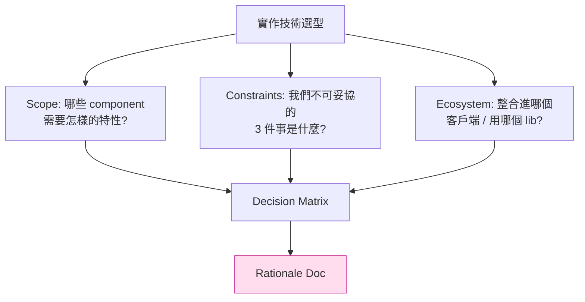
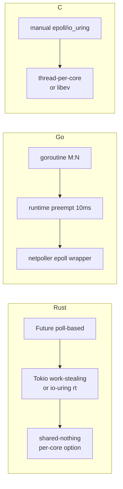
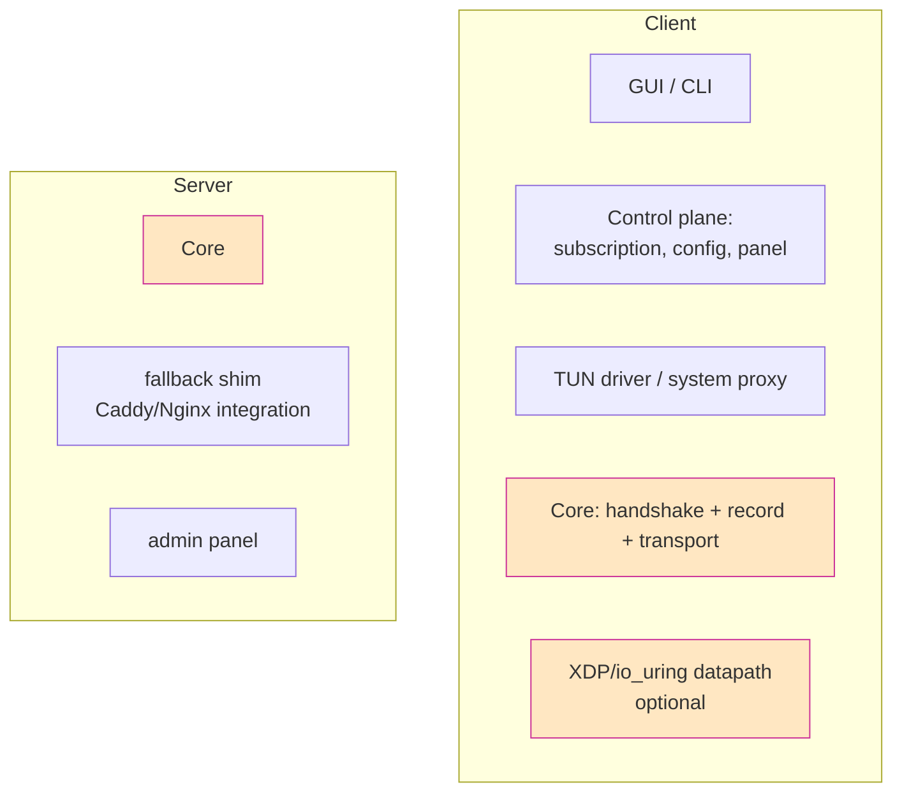
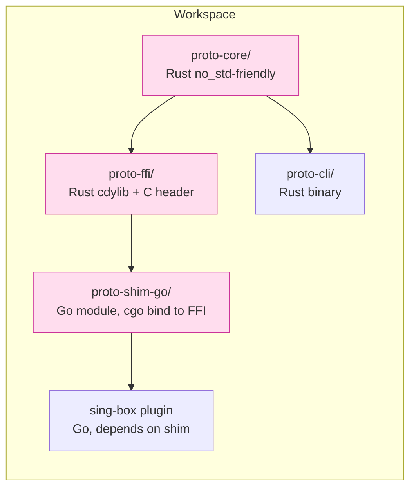

# 課堂 12.1 — 實作技術選型：Go / Rust / C / Zig 與 scope 邊界

## 學前知道
- 前置課：1.x（kernel I/O）、2.x（io_uring / XDP）、3.x（密碼學工程）、4.x（QUIC 實作）、11.x（spec 已定）
- 預計閱讀時間：**45 分鐘**
- 必讀:
  - **Bernstein, Lange**. *SafeCurves: choosing safe curves for elliptic-curve cryptography*. ECRYPT 2014 — constant-time crypto API surface 的哲學
  - **Brumley, Tuveri**. *Remote Timing Attacks are Still Practical*. ESORICS 2011 — 為什麼 implementation language 對 crypto 安全的影響不亞於演算法
  - **The Rust RFC 2128 (Async)** + **Tokio internals docs** — Rust async runtime 的 work-stealing 架構
  - **Donenfeld**. *WireGuard*. NDSS 2017 — kernel-mode 實作為何選 C，userspace 為何選 Go
  - **wireguard-go vs WireGuard Linux kernel module**：read [wireguard-go/device/](https://git.zx2c4.com/wireguard-go/tree/device) 跟 [drivers/net/wireguard/](https://git.kernel.org/pub/scm/linux/kernel/git/torvalds/linux.git/tree/drivers/net/wireguard) 的程式碼差異
  - **Xray-core**（Go）vs **shadowsocks-rust** vs **sing-box**（Go）vs **trojan-go** — 同一個 problem space，四種風格
- 必讀原始碼:
  - `quic-go/internal/handshake/aead.go`（Go AEAD wrapper 風格）
  - `quinn-rs/quinn-proto/src/crypto/rustls.rs`（Rust Sans-IO 風格）
  - `boringssl/crypto/chacha/asm/chacha-x86_64.pl`（C + Perl asm 的 reality）
- 自我反省問題:
  - 你目前比較熟 Go 還是 Rust？預估「精通 Rust async + unsafe」對你還要多少 hours？
  - 你願意接受「為了 1.3× throughput 多付 6 個月的學習成本」嗎？

## 動機

Part 11 結束時你已經有 spec v0.1。Part 12.1 是 **進入工程的第一個決策節點**：要用哪一個 language stack 把 spec 編譯成可跑的 binary。

這不是「品味問題」。每個 language 都帶來 **三層後果**：

1. **安全 footprint**：memory safety / constant-time guarantees / supply chain 攻擊面
2. **效能極限**：能不能用 io_uring、AF_XDP、SIMD、shared-nothing thread model
3. **生態 lock-in**：使用者要把你的 protocol 整合進 sing-box（Go）/ Clash（Go）/ shadowsocks-rust（Rust）— 你不選對 language，整合成本 = 重寫

研究上講求 reproducibility：你的 paper 要附 artifact，artifact 要能被 reviewer build 出來。Rust 的 `cargo` 在這方面 reproducibility 已經是 SOTA；C 則需要 docker + 固定 toolchain；Go 介於中間。

本堂課的目標：

- 用 **可量化的 6 個維度** 比較 Go / Rust / C / Zig
- 對著我們的 spec 列出 **scope decomposition**：哪些 component 必須 native（kernel/datapath），哪些可以 high-level（control plane）
- 寫出 **「最終選擇 + rationale 文件」** 草稿，Part 12.20 寫文件時直接引用

---

## 核心概念

### 1. 「語言選擇」這個問題本身的拆解



**結論先講**：對 Proteus 級別 SOTA proxy，我們的建議結構是 **「Rust core + Go integration shim」**（rationale 在第 6 節）。但結論的價值 ≪ 推導過程，因為當你的 constraint 變了（例如，捨棄 Linux-only，往 Windows datapath 推），結論可能要重來。

### 2. 評估維度（六向座標）

| 維度 | 為什麼重要 | 量化方式 |
|---|---|---|
| **D1. Memory safety** | 大部分 CVE 在 proxy 軟體都是 OOB / UAF | 由 type system 強制 vs 靠審查 |
| **D2. Async + concurrency model** | 多連線同時處理，shared-nothing 還是 work-stealing | 每核 conn/s |
| **D3. Constant-time crypto 可表達性** | side-channel resistance（Part 3.13） | crypto lib 是否標榜 ct，audited |
| **D4. Native interop（kernel API）** | io_uring / AF_XDP / TUN / Netlink | 是否需 cgo / unsafe |
| **D5. Toolchain reproducibility** | artifact evaluation, supply chain | `Cargo.lock` / `go.sum` / 手動 |
| **D6. Ecosystem fit** | sing-box / Clash / Tor PT3 接口 | bindings 成熟度 |

#### D1. Memory safety

| Language | Safety | 例外 |
|---|---|---|
| C | None | 全部仰賴 audit；ASan/UBSan 只在 test |
| C++ | RAII，但 raw pointer / iterator invalidation 依舊 | 同上 |
| Zig | manual + `defer`，但 compile-time 保證 | 不解決 use-after-free |
| Go | GC + bounds check，但 unsafe.Pointer 可繞 | data race 不被靜態抓 |
| Rust | borrow checker；`unsafe` 區塊隔離 | `unsafe` 內仍可錯，但 surface 縮小 |

實證資料：Microsoft 內部 2019 統計 70% CVE 為 memory safety 問題；Chromium 2020 統計 68%。Rust adoption 在 Android 13+ kernel 與 Windows 11 Components 的 CVE 計量上有可測量下降（Google 安全部落格 2024 報告）。

#### D2. Async + concurrency



衡量上：
- Hysteria2（Go）在 32 cores 上 single-process 大約 70-90 Gbps（社群基準）
- Quinn（Rust，Tokio）在同硬體大約 40-60 Gbps
- BoringTun（Rust）userspace WireGuard 大約 1.2-1.5× wg-go
- 但 wireguard kernel module（C）在 100 Gbps 級別

教訓：**Rust 沒有自動勝 Go**；prograam shape 與 syscall 模式（io_uring vs epoll）影響大過 language。

#### D3. Constant-time crypto

- C：歷史最久，但**沒有強制**。`memcmp` 是經典反例
- Rust：`subtle` crate + `zeroize` 是事實標準；`ring`、`RustCrypto` 都標榜 ct
- Go：`crypto/subtle` 提供 ct comparison；但 GC + escape analysis 影響 timing variance；高度 ct-sensitive 程式碼通常呼叫 asm（`golang.org/x/sys/cpu`）
- Zig：透過 `@setEvalBranchQuota` + inline asm，但 audited lib 仍少

對我們協議：**handshake 必須 constant-time。** Record-layer 用 AEAD 已從 hardware AES-NI / ChaCha 取得 ct，但 packet number reordering check / Pre-Shared-Key compare 是手動 ct 區。

#### D4. Native interop

| API | Go | Rust | C |
|---|---|---|---|
| `epoll` | netpoller 內建 | mio / tokio | direct syscall |
| `io_uring` | go-iouring（third party），no runtime integration | tokio-uring（experimental）/ glommio | liburing direct |
| `AF_XDP` | xdp-go（少維護） | xdp-rs / xdp.rs / libxdp-sys | libbpf + libxdp |
| TUN/TAP | water (Go) | tun (Rust) / cargo build TUN | iproute2 |
| netlink | netlink (Go) | netlink-packet-* | libnl |
| `SO_REUSEPORT` 多 listener | net 包透明支援 | tokio listen API | direct |
| `setsockopt` 細項 | golang.org/x/sys/unix | nix / libc | direct |

`cgo` 的 cost 不可忽略：每一次 cgo call ~50-200ns（Go 1.21+）、要避免 in-loop。對 datapath 是 dealbreaker。

#### D5. Reproducibility & supply chain

- Rust：`Cargo.lock` 內含 SHA、`cargo-vet`、`cargo-deny` 可審查依賴；`cargo audit` 對 RustSec advisory
- Go：`go.sum` 內含 hash、`govulncheck`、modules proxy 提供 transparency log
- C：除非用 Nix / Bazel，否則 reproducibility = 困難；distro 提供版本各異

對研究 artifact：reviewer 要能在 Ubuntu 22.04 / Debian 12 一鍵 build。Rust + Go 都過關；C 需要附 docker。

#### D6. Ecosystem fit

**這條最容易被低估，但對 adoption 是 P0**。我們的協議若用：

- **Go**：可直接 vendor 為 sing-box plugin、Xray-core outbound、Clash-Meta outbound；最大 user reach
- **Rust**：可整合進 shadowsocks-rust、leaf、boringtun fork、Cloudflare 內部產品
- **C**：可進 OpenWrt、可嵌入 router；但客戶端要寫 binding

教訓：**沒有 client 的 protocol = 沒有 user**。spec/binary 再 SOTA，使用者不會自己重寫。

### 3. Scope decomposition：哪些 component 適合哪種語言

我們的協議分層（對應 Part 11 spec 的 architecture）：



**Hot path（每包都跑、ct-sensitive）**：Core handshake + record + 整形 → **Rust**
**Control plane（每秒幾次，富互動）**：Panel、訂閱、CLI、GUI → **Go** 或 **TypeScript+Bun**
**Kernel datapath（Linux only，可選）**：XDP 程式 + userspace loader → **C + Rust loader**
**Mobile clients**：iOS NetworkExtension（Swift）/ Android VpnService（Kotlin），其 core 透過 **Rust 編譯為 .a / .aar** 共用

這就是「Rust core + Go shim」結論的細化。

### 4. Decision Matrix（量化打分）

針對我們的 hot path（即 core），1=差 5=優：

| 維度 | 權重 | Rust | Go | C | Zig |
|---|---:|---:|---:|---:|---:|
| D1 safety | 0.25 | 5 | 4 | 1 | 2 |
| D2 async | 0.15 | 4 | 4 | 3 | 3 |
| D3 crypto ct | 0.20 | 5 | 3 | 5 | 3 |
| D4 native | 0.15 | 4 | 3 (cgo) | 5 | 4 |
| D5 reprod. | 0.10 | 5 | 4 | 2 | 3 |
| D6 ecosystem | 0.15 | 3 | 5 | 3 | 1 |
| **加權總分** |  | **4.45** | **3.85** | **2.95** | **2.55** |

數字僅供示意；權重隨 G1-G8 (Part 11 threat model) 變動而變化。**Rust 勝在 D1+D3**，**Go 勝在 D6**。

### 5. 「Rust core + Go shim」的具體切割

我們的建議：



**邊界 design rules**：

1. FFI surface 限制在 **8-12 函數**：`session_new / write / read / close / config_load / set_callback / version / last_error`
2. 所有 buffer ownership 由 caller 持有；FFI 只接 `*const u8, len`
3. 錯誤 → integer error code + tls thread-local `last_error_msg`
4. 不在 FFI 越界傳 Rust panic（在 cdylib 邊界 `catch_unwind`）
5. cbindgen + cargo-test-c-header CI

跨語言慘案教訓：

- Cloudflare `lucet` 與 `boringtun` 之 cgo overhead，必須 batch
- `quic-go` 不依賴 C 的根本原因：避免 cgo P/M scheduler 卡 GC

### 6. 不選 Go-only / C-only 的具體理由

**為什麼不純 Go？**

- `crypto/tls` 對 TLS 1.3 ECH / quic-go 整合的 cipher 限制；`runtime` 對 io_uring 沒有原生支援（社群有 fork 嘗試），導致 datapath ceiling
- GC pause（即使 < 1ms）對 worst-case latency 不可控
- Go 之 ct 工具鏈不及 Rust（subtle / zeroize 生態）
- 反之，control plane 用 Go 是正確選擇

**為什麼不純 C？**

- 開發效率太低、CI 與安全審查負擔大、現代依賴管理弱
- 然而 XDP 程式（不是 loader）必須是 restricted-C（受 BPF verifier 限制），這部分仍是 C / `aya-rs` Rust subset

**為什麼不 Zig？**

- 生態不成熟（2026 Q1）；無 audited TLS / QUIC 實作；team 學習曲線過陡。但 Zig 的 comptime 對 packet-format codegen 非常 elegant，未來 v2 spec 可考慮做 codegen-only adoption（部分檔案，類似 wuffs 的角色）

### 7. 工具鏈版本與政策

把以下寫進 README + `CONTRIBUTING.md`：

```
Toolchains:
  Rust: 1.85.0 (pinned via rust-toolchain.toml)
  Go:   1.24+  (pinned via go.mod toolchain directive)
  Zig:  0.13   (only for experiments under exp/)
  C:    C11   (clang 18+ / gcc 14+)

Quality gates (CI):
  cargo fmt --all --check
  cargo clippy --all-targets -- -D warnings
  cargo nextest run
  cargo deny check
  cargo audit
  cargo udeps
  go vet ./...
  golangci-lint run --enable=govet,staticcheck,gosec
  govulncheck ./...

MSRV (Minimum Supported Rust Version): 1.85
Edition: 2024
```

**為什麼 pin 版本？**Spec-driven reproducibility（5.8 學的）。reviewer 跑 artifact 出現 toolchain drift 是常見 reject 理由。

### 8. 三個容易踩錯的決策

1. **「先寫 prototype 用 Python，之後改寫」**：八成不會改；prototype 變 prod。除非你的 prototype 純粹是 spec sanity check（< 200 LoC）
2. **「用 C 寫 reference，再用 Rust 寫 prod」**：reference 與 prod 對 spec 不同 interpretation → 雙實作差異變成 bug source。應該反過來：spec 是 reference，所有 impl 對 spec
3. **「FFI 過寬」**：FFI surface 大 → 雙方協定變更 = 兩邊都改 + 版本 skew。要把 FFI 收成「最窄 8 函數」

---

## 與我們協議設計的關聯

- **Part 12.2-12.5（實作章）**：core 在 Rust 寫；datapath（XDP/io_uring）在 12.4 強調
- **Part 12.6-12.7（客戶端/服務端整合）**：Go shim 在這兩堂落地
- **Part 12.20（文件）**：本堂的 decision matrix 直接成為 design rationale doc 的 §3
- **Part 12.22（paper intro）**：language choice 不寫入 paper（不是研究貢獻），但 artifact appendix 必提
- **回頭支援 Part 11.7**：spec 中「Security Considerations」對 ct 的要求，需 impl language 配合

---

## 動手

1. 在你目前的環境 build 一次 `quinn`（Rust QUIC）跟 `quic-go`（Go QUIC）的 echo server，量測單流吞吐。觀察兩者預設 GOMAXPROCS / Tokio worker 數對結果的影響
2. 寫一個 100-line Rust cdylib，導出 `int add(int, int)`；在 Go 用 cgo 呼叫 10^7 次，量平均 cgo call 開銷
3. 對 `boringtun`（Rust）跟 `wireguard-go`（Go）跑 `iperf3 -c -R -t 60`，記錄 CPU 使用率（perf stat）
4. 寫 `Cargo.toml` + `rust-toolchain.toml` 配合 `cargo deny` / `cargo audit` 的 CI workflow（GitHub Actions），確認 supply chain 能阻擋 yanked crate
5. 起草 1-page 「Implementation Language Rationale」doc，把本堂的 decision matrix + 我們的 G1–G8 對應寫出來，commit 到 `docs/decisions/0001-language-choice.md`（ADR 風格）

## 自我檢查

1. 我們的 protocol core 為什麼選 Rust 不選 Go？舉出至少三條與 D1/D3/D5 對應的理由
2. cgo overhead 對 datapath 為何是 dealbreaker？對 control plane 為何不是？
3. 若我們未來要把 core port 到 OpenWrt MIPS 路由器（128MB RAM），這個決定還成立嗎？需改哪些章節？
4. ADR（Architecture Decision Record）是什麼？我們應該為哪些其他決策也寫 ADR？
5. 若使用者只有 ARM macOS，Rust 與 Go 之 native compile / cross-compile 能力差在哪？

## 延伸閱讀

- *The Rust 2024 Edition Guide* — 新版 edition feature set
- Cloudflare blog：*Why we chose Rust for our quiche QUIC implementation*
- Google：*Memory Safe Languages in Android 13*（Android Security Blog）
- ISO C++ Foundation：*P2137: Memory Safety in C++* — 對比觀點
- *Tigerbeetle Way* — Zig + LSM 的極致工程化案例
- ADR 文件範例庫：[joelparkerhenderson/architecture-decision-record](https://github.com/joelparkerhenderson/architecture-decision-record)

---

## 研究級補遺

### 1. 學界詞彙

| 中文/口語 | 學界詞彙 |
|---|---|
| 記憶體安全 | memory-safety (spatial + temporal) |
| 常時 | constant-time / timing-resistant implementation |
| 編譯期數值運算 | comptime (Zig) / `const fn` (Rust) |
| 跨語言介接 | Foreign Function Interface (FFI) / ABI stability |
| 不安全區塊 | encapsulated unsafety (Tarjan & Aldrich 2010 雛形) |
| 軟體供應鏈安全 | software supply chain integrity (SLSA framework) |
| 可重現建置 | reproducible build (Lamb & Zacchiroli, *Reproducible Builds*, CACM 2022) |

### 2. 對手分類學

語言選擇對應的對手：

| 對手 | 影響 D# | 我們的選擇怎麼回應 |
|---|---|---|
| OOB / UAF exploit author | D1 | Rust 把 attack surface 從整個 codebase 縮成 `unsafe {}` 區（< 5%） |
| Timing side-channel | D3 | Rust + `subtle` + audited ring/RustCrypto，CI 跑 `cargo-careful` |
| Supply chain insertion | D5 | `Cargo.lock` + `cargo-vet` audited crates set |
| Spectre v1/v4 | 跨層 | 用 `core::hint::black_box` 阻擋 speculative load；critical 部分 hand-written asm |

### 3. 形式化定義

**Memory safety**: 任何 well-typed program 不會對未初始化或已 free 的 memory 進行 access。Rust 在 safe subset 用 affine type system + region (lifetime) inference 給予此保證；formal proof 見 RustBelt（Jung et al., POPL 2018）。

**Constant-time**: 對所有兩個輸入 $x, y$ s.t. 同 type，operator 的 wall-clock execution time 與 $|x|, |y|$ 之關係（且僅這些）無關。形式化見 *Almeida et al., USENIX Security 2016* 的 ct-verif。

### 4. 領域的關鍵論文 / 規格 / 原始碼

1. **Jung et al.** *RustBelt: Securing the Foundations of the Rust Programming Language*. POPL 2018 — Rust safety 的 mechanized proof
2. **Almeida et al.** *Verifying Constant-Time Implementations*. USENIX Security 2016 — ct verification 之框架，後續 12.9 引用
3. **Serebryany et al.** *AddressSanitizer: A Fast Address Sanity Checker*. USENIX ATC 2012 — 12.9 fuzzing 章再深入
4. **Donenfeld**. *WireGuard*. NDSS 2017 — kernel vs userspace 實作對比
5. **Bowers et al.** *Reproducible Build*. CACM 2022 — supply chain
6. **Ho et al.** *Cargo-vet*. Mozilla 2023 — Rust supply chain audit
7. **Bao et al.** *EverParse: Verified Secure Zero-Copy Parsers*. CCS 2019 — packet parsing safety
8. **TigerBeetle, Inc.** *The TigerBeetle Way* — Zig 案例

### 5. 我們協議的座標 / 設計取捨

- G1 (confidentiality): 不直接影響語言；密碼學 lib 影響大 — Rust 勝
- G2 (mutual auth): 同上
- G3 (FS): 同上
- G5 (server privacy): 不影響語言
- **Proteus (indistinguishability)**: 整形演算法 worst-case timing 控制 → Rust + 無 GC 勝
- G7 (0-RTT replay protection): 同上
- G8 (DoS resistance): 大量 conn/s 要 work-stealing scheduler — Rust + Tokio 或 Go runtime 皆可，但 Rust 更 deterministic

**Open decision**：是否在 high-conn-rate server 採用 **shared-nothing thread-per-core**（`glommio` / `monoio` style）。回頭由 12.4 量測決定。

### 6. 必追資源 / 社群入口

- The Rust Blog（blog.rust-lang.org）：toolchain release notes
- This Week in Rust（this-week-in-rust.org）
- Bytecode Alliance（wasm + Rust 安全）
- Rust Security Response WG（github.com/rust-lang/security-wg）
- Golang Vulnerability Database：[vuln.go.dev](https://vuln.go.dev)
- RustSec Advisory Database
- IETF QUIC / TLS WG（implementer interop 經驗）

### 7. 開放問題

1. **形式化 FFI 邊界**：cdylib + cbindgen 產生的 C header 跟 Rust 端是否真的吻合？目前靠 cbindgen test + clang-tidy，但無 mechanized proof
2. **Cross-language data race**：Rust 主執行緒 + Go shim 對 shared buffer 之並發語意，沒有 unified memory model
3. **Quantitative cost of `unsafe`**：每多一個 `unsafe` block，期望 incident rate 增加多少？目前缺工業統計
4. **Reproducible build for cargo + cross**：musl / glibc / mac arm 跨 target 是否 bitwise reproducible？仍是 Cargo team open issue
