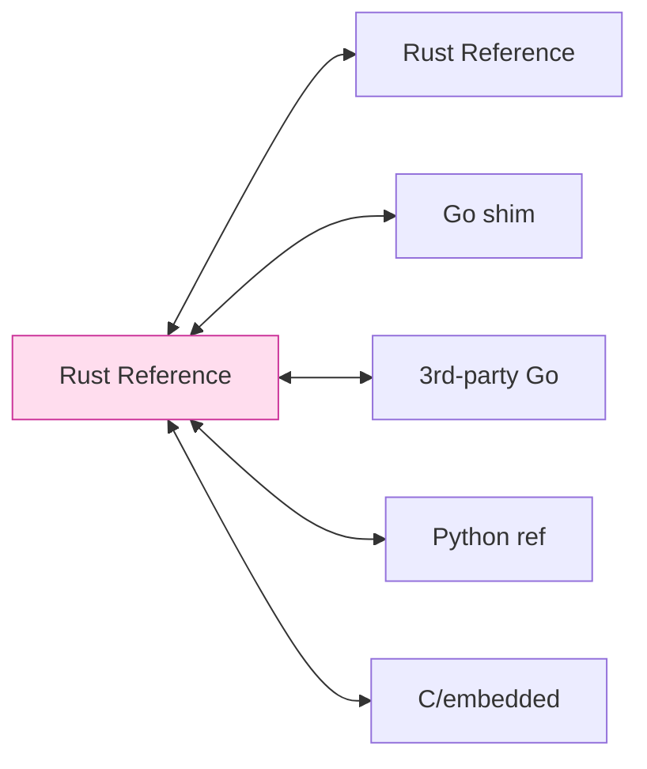
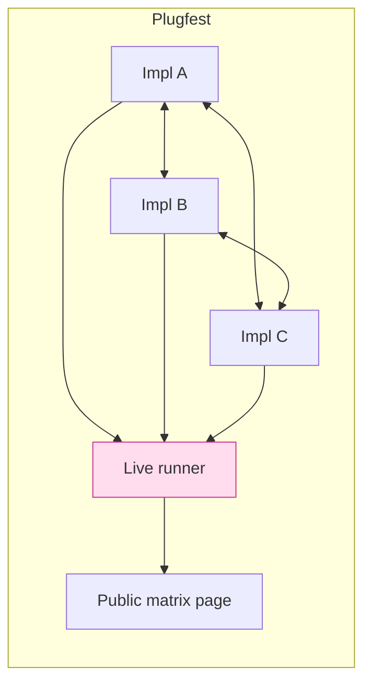

# 課堂 12.10 — 互通性測試（Interoperability Testing）

## 學前知道
- 前置課：11.x spec, 12.3 (handshake), 12.9 (testing)
- 預計閱讀時間：**40 分鐘**
- 必讀:
  - **IETF QUIC interop runner**：[quic-interop-runner.github.io](https://quic-interop-runner.github.io) — 多 impl 跑 matrix 測試的範例
  - **Iyengar, Bishop, Thomson**. *QUIC Interop Runner* 設計文件
  - **Postel's Robustness Principle**（RFC 1122 §1.2.2） — 「be conservative in what you send, liberal in what you accept」與其爭議（Postel's Law 反對派 Sambasivan & McGuire 2009）
  - **Iqbal, Reineke**. *Software-Defined Networks and the Internet's End-to-End Argument*. CCR 2022 — protocol divergence cost
- 必讀原始碼:
  - `quic-interop/quic-interop-runner` 整套
  - `tlsfuzzer/tlsfuzzer` — TLS interop fuzz framework
- 自我反省問題:
  - 你裝過兩個 v2ray 版本，互相連不通的經驗嗎？通常是哪邊的鍋？
  - 「我能跟自己連」和「我能跟別人連」差在哪？

## 動機

協議成 SOTA 的條件之一是 **多 impl 互通**：只有一個 impl 的協議事實上 = 一個 codebase 而非協議。互通性 test 是 spec 落地的最終 stress test。

可能的 implementer：

1. **我們自己的 Rust core**（reference impl）
2. **我們的 Go shim**（透過 cgo，邏輯應等同 (1)）
3. **第三方 Go impl**（未來社群可能寫；對 sing-box 原生）
4. **第三方 Python impl**（pedagogical / academic）
5. **第三方 C impl**（OpenWrt embed）



Test matrix 大小 = N²（pair-wise）；對 5 impl 為 25 個 combination。對每 combination 跑多種 scenario：

- handshake_completes
- 1mb_transfer
- key_update
- 0rtt（v0.2）
- resume_session
- abrupt_close
- network_loss_5p
- multiple_streams

---

## 核心概念

### 1. Interop runner 架構

模仿 quic-interop-runner：

```mermaid
flowchart TD
    DRV[interop driver<br/>Python]
    DRV --> NS[Network namespace<br/>(netns / docker)]
    NS --> S[(server image)]
    NS --> C[(client image)]
    NS --> SHAPE[tc qdisc<br/>(loss/delay)]
    DRV --> RES[result aggregator]
    RES --> WEB[HTML matrix]
    classDef ours fill:#fde,stroke:#c39;
    class DRV,WEB ours;
```

每 impl 提供 Docker image，符合介面：
- `IMAGE_NAME:latest` 內含 `/usr/local/bin/proto-server` + `/usr/local/bin/proto-client`
- env vars：`PROTOXX_SERVER_PORT`, `PROTOXX_CONFIG_JSON`, `PROTOXX_TESTCASE=transfer1mb`
- log 寫 stderr，artifact 寫 `/output`
- 退出 code 0 = success；非 0 = fail

Driver：
```python
for impl_s in IMPLS:
    for impl_c in IMPLS:
        for tc in TESTCASES:
            run_scenario(server=impl_s, client=impl_c, tc=tc)
```

### 2. Testcase 定義

```yaml
- name: handshake_completes
  description: client and server complete handshake within 5s
  pre:
    - tc qdisc add dev eth0 root netem delay 50ms
  client_cmd: proto-client connect ${SERVER}:${PORT} --psk-file /test/psk
  server_cmd: proto-server listen 0.0.0.0:${PORT} --psk-file /test/psk
  success_when:
    client_stdout_contains: "HANDSHAKE_OK"
    duration_max: 5s

- name: transfer_1mb
  ...
  client_cmd: proto-client upload --bytes 1048576 ...
  success_when:
    server_received_bytes: 1048576
    sha256_match: true
    duration_max: 30s

- name: lossy_5pct
  pre:
    - tc qdisc add dev eth0 root netem loss 5% delay 50ms
  ...

- name: keyupdate
  description: trigger key update at 100k packets, verify continuity
  ...
```

### 3. Wire-format conformance test

獨立於 runner：每 impl 必提交 **生成的 message bytes** 給 reference checker：

```bash
$ proto-impl-x emit-test-vector \
    --psk-hex "00112233..." \
    --rng-seed 0xDEADBEEF \
    --testcase ch_minimal \
  > impl-x-ch-minimal.bin

$ diff impl-x-ch-minimal.bin spec/v0.1/vectors/ch_minimal.bin
```

`--rng-seed` 讓 ephemeral 可重現。Reference vectors 在 spec repo `vectors/` 維護。
任何 impl 之 emit 與 vector 不同 = bug。

### 4. Liberal-vs-conservative debate

對 unknown extension：spec § 規定「**ignore unknown extension if marked `noncritical`**」。impl 必須照做，否則 forward compat 失敗。
對 reserved field：「**MUST be zero**」 — impl 必須 reject 非 zero。Postel 之 liberal 在這 case 是 anti-pattern（漸進式 protocol ossification）。

我們選 **strict on send, liberal on receive (with explicit list)**：每個 receive-side liberal behavior 必須 spec 明文。
這跟 Postel's Law 不同；Eronen & Harkins 2021 (IETF draft) 與 Sambasivan-McGuire 2009 都支持「精確互通」勝過 「兩邊都隨便」。

### 5. Negative interop test

```yaml
- name: reject_unknown_version
  client_cmd: proto-client --version 0xFF connect ...
  server_expected_stderr: "VERSION_UNSUPPORTED"
  client_expected_stderr: "SERVER_REJECT"

- name: reject_malformed_padding
  client_cmd: proto-client --inject malformed-padding ...
  expected: server closes connection within 1s after parse fail
```

negative test 證明 impl 對 invalid input behave 一致 — Postel-style 寬鬆會在這裡 leak fingerprint。

### 6. CI gate：bi-version compat

對 v0.1 release，必跑：

```
v0.1-rust  <->  v0.1-rust  (identity)
v0.1-rust  <->  v0.1-go
v0.1-go    <->  v0.1-go
v0.1-rust  <->  v0.0-rust   (one-version backward compat, if applicable)
```

對 future v0.2：

```
v0.2-rust  <->  v0.1-rust  (forward + backward)
v0.2-go    <->  v0.1-go
v0.2-rust  <->  v0.2-go
```

新增 wire-format change 必伴 「version negotiation」 logic。

### 7. Spec ambiguity bug：典型例子

過去 QUIC interop 找出之經典 bug（drafted by Iyengar, learned the hard way）：

| Bug | Cause | Fix |
|---|---|---|
| `ACK frame max delay` 不一致 | spec 沒精準定義 unit | spec 明文 microseconds |
| `New connection ID` 重複 | spec 沒禁多次 send 同 CID | spec 加 MUST NOT |
| `STREAM ID limit` 對 unidir 之計算 | 兩 impl 解 spec § 不同 | spec 重寫該 § |

每發現一個互通 bug：
1. 證明它是 spec 不明 → 改 spec
2. 證明它是 impl bug → 修 impl
3. Bug 加 regression test 到 vectors

### 8. 訂閱與 client 之互通

跨 client 的訂閱：

```
我們的 URL → 餵 sing-box → 連我們 server   ✓
我們的 URL → 餵 mihomo (Clash-Meta) → 連我們 server   ✓
我們的 URL → 餵 Xray-core → 連我們 server   ✓ (若 fork)
```

每 client fork 自行解釋 URL 細節（不同 default）；要在 release notes 列出 known divergence。

### 9. Conformance test framework：tlsfuzzer-style

可借 `tlsfuzzer/tlsfuzzer` 模式：每個 testcase 是「對 server 連線 + emit 特定 sequence」， expected outcome 編碼成 expected response prefix。

對我們協議寫 `protoxx-fuzzer`：

```python
class TestCase:
    name: str
    seq: list  # of (Direction, MessageSpec)
    expected: Outcome  # Established, Reject, Drop, Fallback

cases = [
    TestCase("normal_handshake", [Send(NormalCH), Recv(NormalSH), ...], Established),
    TestCase("inject_random_after_ch", [Send(NormalCH), Send(RandomBytes(64))], Reject),
    TestCase("zero_eph_x25519", [Send(CHWithZeroEph)], Reject),
]
```

跑 hundreds 個 case；每 release 對所有 impl 跑。

### 10. 公開 plugfest

模仿 IETF Hackathon：每季辦一次 plugfest，邀請社群 impl 一起跑 interop matrix；live web report。建立 «protocol is multi-impl» 的 evidence — 對 RFC progression 必要。



---

## 與我們協議設計的關聯

- **Part 12.11-12.14 性能**：interop runner 之 1mb transfer 同時可量 throughput
- **Part 11 spec**：interop 是 spec 級正確性 final test
- **Part 12.22-12.23 paper**：interop result 是 evaluation §; 對 paper 之 reviewer 是強證據

---

## 動手

1. 建 `interop/` 目錄；寫 Dockerfile for rust + go impl
2. 寫 Python driver：起 2 個 container，跑 testcase，比結果
3. 設計 10 個 testcase（含 5 positive, 5 negative）
4. 跑 matrix 4×4，產 HTML report
5. 對發現的 disagreement 寫 issue + 加 spec fix proposal

## 自我檢查

1. 「我能跟自己連」test 不夠 — 為什麼？
2. Postel's Law 在 spec 互通的優缺點是什麼？
3. Wire-format vector 的 deterministic RNG seed 為什麼必要？無 seed 怎做 byte-exact diff？
4. 為什麼 plugfest 對 RFC standardization 是必要 evidence？
5. 對 forward compatibility 之 testcase 怎麼設計？沒有 future version 怎麼測？

## 延伸閱讀

- *QUIC Interop Runner* 文件
- *tlsfuzzer wiki*
- IETF QUIC WG charter / interop report archive
- *Postel's Law in the Modern Era* (Eronen draft)

---

## 研究級補遺

### 1. 學界詞彙

| 中文/口語 | 學界詞彙 |
|---|---|
| 互通 | interoperability, interop |
| 一致性 | (protocol) conformance |
| 跨實作測試 | cross-implementation test |
| 版本協商 | version negotiation |
| 規格不明 | spec ambiguity |

### 2. 對手分類學

對 interop，「對手」是 ambiguity；不適用人類 attacker 分類。但對 «被攻擊者利用 ambiguity» 之場景：

| Attack | 利用 | 防禦 |
|---|---|---|
| Protocol confusion | spec 對某 frame 多種 valid interpretation | strict-on-send |
| Cross-protocol attack（Mavrogiannopoulos） | impl A 接 protocol B 之 frame | magic + version check |
| Bid-down via interop matrix | 強迫 fallback 到 weak version | 不允許 negotiate weak primitives |

### 3. 形式化定義

**Conformance**: $\forall x: \mathsf{impl}(x) \in \mathsf{spec}(x)$，where $\mathsf{spec}$ 可能允許多 valid outcome。
**Strict conformance**: $\mathsf{impl}(x) = $ unique value defined by spec。
**Liberal conformance**: $\mathsf{impl}(x) \subseteq$ some superset allowed by spec。
最佳：strict on emit + liberal in well-defined ways on receive.

### 4. 領域的關鍵論文 / 規格 / 原始碼

1. **Iyengar et al. QUIC Interop Runner**（IETF draft + GH repo）
2. **Postel RFC 1122 §1.2.2** + **Eronen draft-iab-protocol-maintenance**
3. **Sambasivan, McGuire** *Cease and Desist*. HotNets 2009 — Postel 反方
4. **tlsfuzzer paper** (Hejda et al. 2018)
5. **Apple QUIC implementation experience** (Apple blog 2022)
6. **draft-thomson-quic-bit** — early QUIC negotiation

### 5. 我們協議的座標 / 設計取捨

- v0.1：只內部 interop（Rust + Go）
- v0.2：邀請外部 impl 加入
- v1.0：plugfest + RFC submission
- 公開 reference vector + Docker images = required

### 6. 必追資源 / 社群入口

- IETF mailing lists（任何在 WG 進行的 protocol）
- TLS interop reports (NCC Group, Hivemind)
- xtls / sing-box / Hysteria CHANGELOG（看 interop bug fix history）

### 7. 開放問題

1. **Conformance test 完整性**：testcase 之 coverage 與 spec coverage 之 quantitative metric？
2. **Differential testing automation**：跑 N impl，找 disagreement，bisect spec or impl — research 程度高
3. **Negotiation downgrade detection**：對 interop matrix 中的 weakest link 之 attack surface
4. **Multi-spec evolution**：v0.1 ↔ v0.2 ↔ v1.0 互通的 lattice 之 maintenance cost
