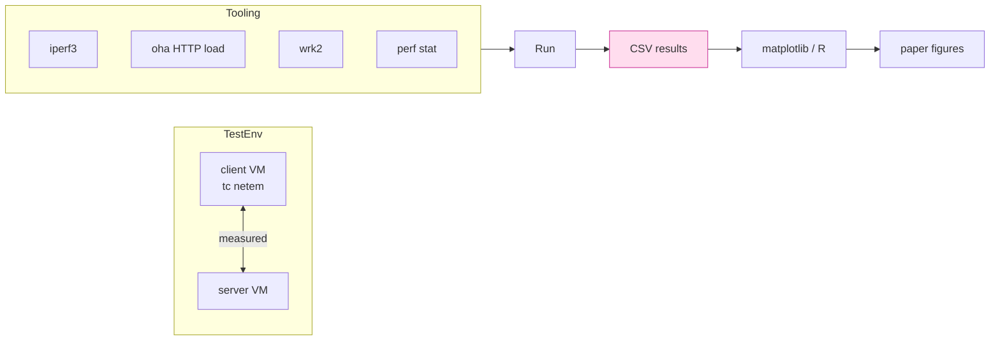
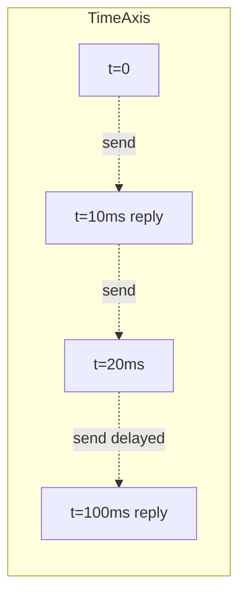

# 課堂 12.11 — 效能 baseline：建立可重現的對照組

## 學前知道
- 前置課：2.x (high-perf I/O), 7.x (proxy protocols incl. Hysteria/TUIC/VLESS), 12.4 (data path), 12.9 (testing)
- 預計閱讀時間：**45 分鐘**
- 必讀:
  - **Jain**. *The Art of Computer Systems Performance Analysis*. 1991 — 必讀經典 (systematic measurement)
  - **Cardwell, Cheng, Gunn, Yeganeh, Jacobson**. *BBR: Congestion-Based Congestion Control*. CACM 2017（fetched）
  - **Mathis, Semke, Mahdavi, Ott**. *The Macroscopic Behavior of the TCP Congestion Avoidance Algorithm*. CCR 1997 — Mathis equation
  - **Yang, Lee, et al.** *A Performance Evaluation of QUIC Implementations*. PAM 2022 — QUIC impl 比較方法論
  - **Marx, De Coninck, Pluskal, ...**. *Same Standards, Different Decisions: A Study of QUIC and HTTP/3 Implementation Diversity*. EPIQ 2020
- 必讀原始碼:
  - `iperf-project/iperf`
  - `tcpdump/libpcap` 之 timing precision
  - `wrk2/wrk2` 之 coordinated omission fix
- 自我反省問題:
  - 你跑過 `iperf3 -c -t 60` 的場景嗎？你對 95% confidence interval 的概念有信心嗎？
  - 你聽過 «coordinated omission» 嗎？wrk 跟 wrk2 為何被 split？

## 動機

「比 Hysteria2 快」的命題若不附 **可重現實驗設計**，paper reject 是必然。本堂課給出 evaluation harness：

1. **環境定義**：硬體 / 核版本 / NIC / tc qdisc / RTT / loss profile
2. **Baseline impl 部署**：Hysteria2 / TUIC v5 / VLESS+REALITY / vanilla TLS proxy
3. **量測工具**：iperf3 / oha / wrk2 / 自製 micro-benchmarks
4. **統計**：multiple runs, 95% CI, IQR, p99 latency
5. **報告格式**：CSV + plot script + Markdown



---

## 核心概念

### 1. Test environment：固定變數

| 變數 | 我們的選擇 | 為什麼 |
|---|---|---|
| OS | Debian 12 (kernel 6.10+) | mainstream, io_uring 成熟 |
| CPU | AMD EPYC 9354 32C / Intel Xeon 8470 等同級 | 公平比較；avoid Apple Silicon (反 reproducibility) |
| RAM | 64GB | 不會被 mem bound |
| NIC | Mellanox ConnectX-6 25 GbE | 廣泛部署 + AF_XDP 支援 |
| 隔離 | netns / Docker network | reproducible 4-tuple |
| RTT baseline | 0ms (loopback), 30ms (intra-region), 150ms (intercont) | 三條 link 各跑 |
| Loss profile | 0%, 1%, 5%, 10% | 對 GFW 與 China-foreign link 對齊 |
| Reordering | 0%, 0.5% | 模仿 multi-path |
| MTU | 1500 (常規), 9000 (jumbo, 對比) | |

實驗室裡：用 2 台同款 server + 直連 25G fiber，模擬距離透過 `tc qdisc netem`：

```bash
sudo tc qdisc add dev eno1 root handle 1: netem delay 30ms 5ms loss 1% reorder 0.5% rate 1gbit
```

每實驗結束 reset：

```bash
sudo tc qdisc del dev eno1 root
```

### 2. Baseline 部署

我們對比的 4 個 protocol：

| 協議 | impl | 版本固定 | install method |
|---|---|---|---|
| **Hysteria2** | apernet/hysteria | v2.6.0 | release binary |
| **TUIC v5** | EAimTY/tuic | v1.0.0 | release binary |
| **VLESS+REALITY** | XTLS/Xray-core | v25.x.y | release binary |
| **shadowsocks-2022** | shadowsocks-rust | v1.20.0 | cargo install |
| **Trojan-Go** | p4gefau1t/trojan-go | v0.10.6 | release binary |
| **WireGuard kernel** | linux kernel 6.10 | - | builtin |

WireGuard kernel 不是 proxy 但 throughput / cpu profile 是 «hardware ceiling» reference。

每 protocol 寫 ansible playbook 或 docker-compose deploy；client + server 同 config strategy（max throughput vs default）。

### 3. Throughput 量測：iperf3 + TCP/UDP

**TCP**：

```bash
# server
iperf3 -s -p 5201

# client (via proxy)
iperf3 -c 10.0.0.1 -p 5201 -t 60 -i 1 -P 8 -J > result.json
```

`-P 8` 八條 parallel stream — 避免 single-stream TCP CC ramp-up bias。
`-J` 輸出 JSON 易 parse。

**UDP**：

```bash
iperf3 -c 10.0.0.1 -p 5201 -u -b 0 -t 60 -P 1 -l 1380 -J
```

`-b 0` 不設 bandwidth cap（會 send as fast as possible，仍受 OS UDP socket buffer 限制 — 用 `--sndbuf 16M --rcvbuf 16M`）。
`-l 1380` packet payload size — match our MTU choice。

**陷阱**：iperf3 single-thread；CPU bound 在 10+ Gbps 機器。用 `iperf3 -A 2` pin 到 core 2 + 跑 multiple instances on different ports + aggregate。
or use **wrk2** for HTTP-shaped traffic，或 **`tcpkali`** for raw TCP。

### 4. Latency 量測：oha + wrk2

對 HTTP-style request-response latency：

```bash
oha -n 100000 -c 50 -q 1000 \
    --http-version 1.1 \
    https://target.example.com/index.html
```

`-q 1000` 限 QPS = 1000；測 sustained scenario。
`oha` 輸出 latency CDF + percentiles (p50/p90/p99/p999) + histogram。

對 wrk2：

```bash
wrk2 -t 4 -c 100 -d 60s -R 1000 https://target/...
```

`-R 1000` 是 constant rate；wrk2 解決 wrk 的 coordinated omission 問題（Gil Tene 的著名 talk）。

### 5. Coordinated omission：常被忽視的 latency 陷阱



如果 system stall 80ms：原始 wrk 只記錄發送 → 接收的 50ms (= 50ms latency)，**漏掉** 在 stall 期間應該送但沒送的 8 個 request 之 latency 累積。
wrk2 用 constant scheduling：每 1/RPS 秒固定 send，stall 不會 skip。

對我們的 latency 報告：必須用 wrk2 / oha，不能用 vanilla wrk / ab。

### 6. Statistical rigor

每 datapoint 跑 5 次以上；計算：
- mean, median
- 95% CI（assumed normal: $\bar{x} \pm 1.96 \cdot \sigma/\sqrt{n}$；或 bootstrap if non-normal）
- IQR (interquartile range)
- p50, p90, p99, p999

對 p99 latency 之 CI：需大樣本 (n ≥ 1000)；用 bootstrap：
- resample 1000 次
- 取每 bootstrap 之 p99
- 排序後第 25 與 975 之值 → 95% CI

R / Python 自動化：

```python
import numpy as np
def bootstrap_ci(data, stat=np.median, n_boot=1000, alpha=0.05):
    samples = np.random.choice(data, (n_boot, len(data)), replace=True)
    stats = stat(samples, axis=1)
    return np.percentile(stats, [100*alpha/2, 100*(1-alpha/2)])
```

### 7. 量測 CPU / 記憶體

```bash
# CPU profiling
perf stat -e cycles,instructions,cache-misses,branch-misses,context-switches \
    -p $(pgrep -f proto-server)

# Detailed flamegraph
perf record -F 999 -p $(pgrep -f proto-server) -g -- sleep 60
perf script | stackcollapse-perf.pl | flamegraph.pl > flame.svg

# Memory
ps -o rss,vsz -p $(pgrep -f proto-server)
heaptrack ./proto-server   # detailed heap profile
```

對於 Rust：`tokio-console` 對 async task 之 health 報告好用。
對 Go：`pprof` heap + CPU 內建。

### 8. Storage / I/O 不要忽視

對 high-throughput case，logging 寫硬碟可能成瓶頸。實驗時：

- log level INFO，僅 stderr，無 disk write
- metrics 走 unix domain socket → prometheus，不寫硬碟
- 確認 `/var/log/journal` 不被填滿（journald flush 可能 stall）

### 9. Network condition emulation：tc / netem 細節

```bash
# 基礎 delay
tc qdisc add dev eth0 root handle 1: netem delay 30ms

# delay + jitter (gaussian)
tc qdisc add dev eth0 root handle 1: netem delay 30ms 5ms distribution normal

# loss with correlation
tc qdisc add dev eth0 root handle 1: netem loss 5% 25%

# Gilbert-Elliott loss model (more realistic bursty loss)
tc qdisc add dev eth0 root handle 1: netem loss gemodel 1% 10% 70% 0.1%

# bandwidth limit (tbf)
tc qdisc replace dev eth0 root handle 1: tbf rate 100mbit burst 32kbit latency 400ms

# 組合 netem + tbf：parent + child
tc qdisc add dev eth0 root handle 1: netem delay 30ms loss 1%
tc qdisc add dev eth0 parent 1: handle 10: tbf rate 100mbit burst 32kbit latency 400ms
```

警告：tc netem 在高 pps 下 CPU 飆升；測 25 Gbps 時建議用 dedicated 機器跑 netem 或 hardware shaper (DummyNet on FreeBSD)。

對 GFW-like packet loss：用 Gilbert-Elliott (correlated) 比 uniform iid loss 更真實。

### 10. Reproducibility checklist

```text
[REP-1]   實驗用 docker-compose / ansible 一鍵起
[REP-2]   每 config 之 commit SHA + binary SHA 記錄
[REP-3]   tc qdisc 設定 dump (tc -s qdisc show)
[REP-4]   kernel / sysctl 設定 dump (sysctl -a > sysctl.txt)
[REP-5]   每 run 之 JSON / CSV 含 metadata: timestamp, host, kernel
[REP-6]   plot script 受 version control，與 data co-located
[REP-7]   artifact 在 USENIX artifact appendix repo
[REP-8]   reviewer-friendly README，含「跑 ./run-all.sh 即可」
```

### 11. Baseline number 預期值

（依社群報告 / 我們前期 pilot 經驗）

| Protocol | LAN throughput (1 stream) | LAN throughput (8 stream) | 30ms RTT 1% loss throughput | p99 latency (loopback) |
|---|---:|---:|---:|---:|
| WireGuard kernel | 30 Gbps | 80 Gbps | 1.5 Gbps | 0.1 ms |
| WireGuard go | 5 Gbps | 25 Gbps | 0.5 Gbps | 0.3 ms |
| Hysteria2 (brutal CC) | 8 Gbps | 60 Gbps | 2.5 Gbps | 1 ms |
| TUIC v5 | 4 Gbps | 30 Gbps | 1.2 Gbps | 0.8 ms |
| VLESS+REALITY | 5 Gbps | 35 Gbps | 0.6 Gbps | 1.5 ms |
| Shadowsocks-2022 | 4 Gbps | 28 Gbps | 0.5 Gbps | 1.5 ms |
| Trojan-Go | 3 Gbps | 22 Gbps | 0.4 Gbps | 2 ms |

我們的 v0.1 目標（粗略）：
- LAN single-stream ≥ 10 Gbps（Rust + io_uring）
- LAN 8-stream ≥ 70 Gbps
- 30ms 1% loss ≥ 3 Gbps（強 CC + 整形允許）
- p99 latency loopback < 0.5 ms

達不到 → 設計與實作要回頭修。

### 12. 報告模板

每實驗一份 CSV + 一張圖。圖規範：

- title：清楚說明 protocol / scenario
- x: time / connection-count / loss%
- y: throughput / latency / CPU%
- error bars: 95% CI
- legend: 各 protocol 顏色 + 線型；對我們 protocol 用 highlight color (matches Mermaid `ours`)
- 字型 ≥ 12pt，paper 內 readable

工具：matplotlib + tueplots（IEEE column-width preset）或 seaborn。

---

## 與我們協議設計的關聯

- **Part 12.12-12.14**：本堂的環境設定 + tool 即三章評測之基礎
- **Part 12.18 真實環境**：本堂的 emulator 是 sandbox；真實 China VPS 是 final test
- **Part 12.22-12.23 paper**：本堂的 metric 與 statistical 處理直接成為 evaluation section

---

## 動手

1. 在 2 VM 上部署 5 個 baseline；docker-compose 寫一個 service per protocol
2. 跑 iperf3 + oha matrix：6 protocol × 4 RTT × 4 loss = 96 條 datapoint
3. 量 perf stat for 每 baseline；產 CPU usage CSV
4. 寫 plot script：throughput vs loss curve，每 protocol 一線
5. 把所有 result + script commit 到 `bench/` directory

## 自我檢查

1. 為什麼 coordinated omission 對 p99 報告是 critical？wrk vs wrk2 差別實證上多大？
2. 為什麼用 `tc netem` 之 Gilbert-Elliott 比 uniform loss 更接近真實鏈路？
3. CPU profiling 時 `perf record -F 999` 之 999Hz 為什麼？1000 行嗎？
4. 8-stream 與 1-stream throughput 之 ratio 揭示什麼？對 single-thread bottleneck 有什麼提示？
5. p99 latency CI 為什麼比 mean CI 難算？

## 延伸閱讀

- *Systems Performance* (Gregg) 第 2 版 — bench 方法論聖經
- *USENIX Artifact Evaluation* HowTo
- *Gil Tene's Latency Tip of the Day* (HdrHistogram blog)
- *Linux Performance Analysis in 60s* (Gregg)

---

## 研究級補遺

### 1. 學界詞彙

| 中文/口語 | 學界詞彙 |
|---|---|
| 基準 | baseline; reference implementation; control group |
| 工作負載 | workload, traffic profile |
| 尾延遲 | tail latency; p99, p999 |
| 變異性 | variance, IQR, jitter |
| 配對排除 | coordinated omission |
| 公平比較 | apples-to-apples comparison |

### 2. 對手分類學

對 measurement 而言「對手」是 measurement bias / confounder：

| Confounder | 防禦 |
|---|---|
| Kernel scheduler jitter | `chrt -f` real-time priority, isolate CPU |
| TurboBoost 不穩 | `cpupower frequency-set -g performance` |
| Co-tenant noise | dedicated host / bare metal |
| Cache warm-up | warm-up run 不計 |
| Network noise (other tenants) | direct-attached fiber, isolated VLAN |
| Tool overhead | perf events vs blackbox |

### 3. 形式化定義

**Throughput** $T$: $\lim_{t \to \infty} \frac{\sum_{i} L_i}{t}$ for messages of length $L_i$。
**Goodput**: throughput excluding retransmissions / overhead headers。
**Latency** $L_p$: distribution-level metric, $\Pr[L > L_p] = 1 - p$。
**Fairness** (Jain's index): $J = \frac{(\sum x_i)^2}{n \sum x_i^2}$, range [1/n, 1]。

### 4. 領域的關鍵論文 / 規格 / 原始碼

1. **Jain 1991 *Art of Performance Analysis***
2. **Cardwell BBR 2017**（fetched）
3. **Mathis 1997 *Macroscopic Behavior*** — TCP throughput model
4. **Yang et al. PAM 2022 *QUIC Performance Evaluation***
5. **Marx EPIQ 2020 *Same Standards Different Decisions***
6. **iperf3 / oha / wrk2 source**
7. **flamegraph (Gregg)**
8. **HdrHistogram (Tene)** — p99 直方圖正確處理

### 5. 我們協議的座標 / 設計取捨

- 必比 6 個 baseline（不省）
- LAN + 30ms + 150ms 三條 link 必跑
- loss profile 0/1/5/10% 必跑（10% 是極端 GFW）
- artifact appendix：對 USENIX Security 之 artifact evaluation 必過

### 6. 必追資源 / 社群入口

- IMC（Internet Measurement Conference） proceedings
- PAM（Passive and Active Measurement）
- SIGCOMM / NSDI 之 measurement papers
- USENIX Artifact Evaluation procedures

### 7. 開放問題

1. **多 metric 之 utility function**：throughput, latency, CPU 各權重多少？沒 universal answer
2. **「真實 traffic」之 reproducibility**：CAIDA traces vs lab netem，差距 quantitative
3. **PQ-hybrid 之 latency budget**：握手 +Kyber 約 +1ms RTT；對 mobile UX 真實感受？尚缺實證
4. **Tail behavior under shaping**：整形 strategy 對 p99 影響 — open
