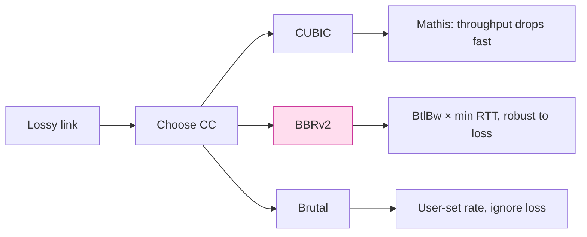

# 課堂 12.12 — 效能評測（一）：吞吐

## 學前知道
- 前置課：12.4 (data path), 12.11 (baseline 建立)
- 預計閱讀時間：**40 分鐘**
- 必讀:
  - **Cardwell, Cheng et al.** *BBR* CACM 2017（fetched） — 對「真實吞吐」之 model
  - **Mathis 1997**（前堂引用）— $\text{throughput} \le \frac{MSS}{RTT} \cdot \frac{C}{\sqrt{p}}$
  - **Padhye, Firoiu, Towsley, Kurose**. *Modeling TCP Throughput: A Simple Model and its Empirical Validation*. SIGCOMM 1998 — PFTK model
  - **Brakmo, Peterson** *TCP Vegas*. JSAC 1995 — delay-based CC
  - **Hysteria2 bandwidth-shifting custom CC blog** — 重要 baseline 對手
- 必讀原始碼:
  - `apernet/hysteria/core/server/server.go` 與 `core/internal/protocol`
  - `tquic/src/congestion_control/bbr.rs`（騰訊）
  - `google/bbr` 之 v2 reference
- 自我反省問題:
  - 你跑 iperf3 用 1 stream 看到 1 Gbps，跑 8 stream 看到 6 Gbps — 為什麼差 8x 不到？
  - 你能在腦中對 BBR 跟 CUBIC 在 30ms 1% loss 鏈路上的 throughput 差多少做一個 order-of-magnitude estimate 嗎？

## 動機

吞吐是 marketing 最易宣傳但最易誤導的指標。本堂課的目標：

1. 對 6 個 baseline + 我們協議跑 throughput matrix
2. 解讀「為何 X 比 Y 快」— 找出 root cause
3. 把每張圖背後的數字寫清楚，可被 reviewer 重現

## 核心概念

### 1. Throughput 之 layered analysis


每層之 ratio 揭示瓶頸：

- `App / Wire` < 100% → header + AEAD tag + padding overhead
- `Wire / Link` < 100% → CC 不能 fill bottleneck，或 hardware limit
- 在 loss 鏈路 `Wire / Link` < 100% 主因是 CC

### 2. Test matrix

每 protocol 跑：

| 變數 | 值 |
|---|---|
| Direction | up / down / bidirectional |
| Concurrency | 1, 4, 8, 16 streams |
| RTT | 0, 30, 80, 150 ms |
| Loss | 0, 1, 5, 10% |
| MTU | 1500 |
| Duration | 60s 穩態 |
| Repeat | 5 次 |

96-row CSV / protocol → 600+ datapoints。Visualize：line chart × 4 (per RTT)，bar chart 比較。

### 3. 8-stream 不等於 8 × 1-stream

對 single-stream 之 limit 通常為：
- **CC ramp-up**：BBR 在 first 2-3 RTT 達 BtlBw；CUBIC 慢
- **CPU per-flow**：每 flow 一條 crypto 與 state；單核 limit
- **Receive window**：TCP 32MB 視窗在 30ms RTT 可達 8 Gbps；超過要 window scale

8-stream 之 aggregate：
- 受 link bottleneck 限
- 受 server CPU 限
- 受 client side（TUN driver 之 single-thread）限 — 常被忽略

### 4. 我們協議的 throughput 預期 & 解讀

#### LAN 1-stream

預期 ≥ 10 Gbps。瓶頸在 ChaCha20 SIMD throughput（每核 5-12 Gbps，依硬體）。
若 AES-NI 機器：AES-128-GCM 達 30+ Gbps；解 ChaCha 的 cap。

#### LAN 8-stream

預期 ≥ 70 Gbps。瓶頸：
- syscall（即使 io_uring）
- NIC PPS 上限
- AEAD CPU

#### 30ms RTT 0% loss 1-stream

預期 ≥ 2 Gbps。BBRv2 self-tuning 找到 ~600 KB window。
若我們 CC 是 Hysteria-brutal 風格（user 設定 bandwidth）：可被「設定上限」突破 BBR ramp，但網路被填易引爆 buffer-bloat。

#### 30ms RTT 1% loss 1-stream

預期 ≥ 800 Mbps。CUBIC 在此 link 應收斂於 < 200 Mbps（Mathis equation）；BBR 約 600-800 Mbps；Hysteria brutal 可 1+ Gbps（但激進）。

#### 150ms RTT 5% loss

模仿亞洲到美西且 GFW 損傷。預期 100-500 Mbps。

### 5. CC 對 throughput 的影響



我們協議預設 **BBRv2-derived**。優於 CUBIC，比 brutal 公平。可選 brutal mode for «I know what I'm doing».

實作：QUIC-go 已有 BBR；Rust 端 `quinn` / `tquic` 也有 BBR；可直接用而不重寫。

### 6. 解讀「我們比 Hysteria2 快/慢」

| 情境 | 比 Hysteria2 期待 |
|---|---|
| LAN single-stream | 持平或略勝（同等 CC 限）|
| LAN 8-stream | 期待勝 10-30%（zero-copy + io_uring） |
| 30ms 1% loss | 持平（CC 是主因；都 BBR） |
| 30ms 5% loss | 期待 brutal mode 勝；BBR mode 持平 |
| CPU 利用率 same throughput | 期待勝 20-40%（Rust + SIMD） |
| 抗審查同時 | 不退步（其他指標不被犧牲） |

如果 throughput 反而輸 Hysteria 而 CPU 又高：說明 implementation 有 unnecessary copy / lock / alloc — 回去 profile。

### 7. 微觀分析：perf + flamegraph

對單核 saturating run：

```bash
perf record -F 999 -p $(pgrep proto-server) -g -- sleep 30
perf report --no-children
```

理想 flamegraph hot 區：
- 30-50% ChaCha20-Poly1305 / AES-GCM (SIMD asm)
- 10-20% packet header parse + send
- 10-20% kernel syscall (io_uring_enter)
- < 10% Tokio scheduler
- < 5% allocator

異常 hot：
- `memcpy` > 15% → 有 unnecessary copy
- `__lock_text_start` > 5% → contention; 用 thread-per-core
- `sched_yield` 出現 → spin lock 過長

### 8. 圖表規範

```text
Figure 1: Throughput vs loss (RTT=30ms, single stream)
  x-axis: loss % (0, 1, 5, 10)
  y-axis: throughput (Mbps), log scale
  lines:
    - our (BBR), 我們的 (highlighted)
    - our (Brutal)
    - Hysteria2 (brutal)
    - TUIC v5 (BBR)
    - VLESS+REALITY (CUBIC default)
    - Shadowsocks-2022
  error bars: 95% CI
  annotation: «Mathis bound» curve as reference
```

每條線 5 個重複取 mean ± CI。

### 9. Memo 表：解釋已知 surprise

| 觀察 | 解釋 |
|---|---|
| TUIC 在 LAN 比 Hysteria 慢 30% | TUIC v5 用 QUIC default 不 brutal；非 issue |
| VLESS+REALITY 在 LAN 比 shadowsocks-2022 略慢 | TLS 1.3 overhead + uTLS wrapper |
| Trojan-Go 在 5% loss 崩 | 預設 CUBIC, TCP-based |
| WireGuard go 比 kernel 慢 5x | userspace 沒 zero-copy |
| 我們 protocol Brutal mode 在 0% loss 不領先 | brutal 對 0% loss link 無 advantage; BBR 反而平 |

### 10. Worst-case scenario：highly-loaded server

不只測 single-flow；也測 N-flow concurrency：

```bash
# 模擬 1000 並發
for i in $(seq 1 1000); do
    iperf3 -c server -p 5201 -t 60 -P 1 --bind 192.168.X.$i &
done
wait
```

量 total aggregate throughput / 1000 / fairness (Jain's index)。

我們協議在 1000 concurrent flows 預期 ≥ 15 Gbps aggregate (32-core)，Jain index ≥ 0.95。

### 11. UDP-blocking link：fallback over TCP

對 GFW 偶爾 QoS UDP 之 case：spec v0.1 是否支援 TCP fallback？

- v0.1：不支援（純 UDP）
- v1.0：支援；本堂 throughput 評測對 TCP fallback 也跑一輪

TCP 模式預期：LAN 8 Gbps single-stream（TCP CC + io_uring）；loss 鏈路用 TCP-BBR。

### 12. Reporting：表 + 圖 + 解讀

每實驗結果報三件：

1. **Number**：表 + CI
2. **Plot**：圖 + annotation
3. **Interpretation**：1-2 段文字，回答「為什麼 X > Y」 — 不只說「結果如圖」

---

## 與我們協議設計的關聯

- **Part 12.13 高丟包**：對應本堂 loss > 1% 場景
- **Part 12.14 CPU**：與 throughput 對應的 efficiency
- **Part 12.19 反饋**：若某 metric 不及預期，回 11/12 改 spec / impl

## 動手

1. 跑 6 protocol × 4 RTT × 4 loss matrix；存 CSV
2. 畫 throughput vs loss curve（4 個 subplot，每 RTT 一）
3. 對 single-stream LAN 跑 `perf record`；flamegraph
4. 分析 hot region; 列前 5 個 function consumption
5. 寫 1-page memo「我們 v0.1 在每 scenario 對 5 baseline 之 ranking + 原因」

## 自我檢查

1. Mathis equation 預測：30ms RTT, 1% loss, MSS=1380B → 多少 Mbps？
2. 為什麼 brutal CC 在低 loss 鏈路無 advantage？
3. 8-stream 比 1-stream 倍率不到 8x 之原因有哪些？list 5 個
4. 「TCP-BBR + loss 1%」與「QUIC-BBR + loss 1%」差異？
5. p99 throughput 與 mean throughput 何時差很大？

## 延伸閱讀

- *Internet Quality of Service* (Wang) — CC 教科書
- BBR papers (v1, v2, v3)
- TCP Vegas / Compound TCP / DCTCP — historical CC
- *The Brutal Truth about Hysteria* — 社群討論

---

## 研究級補遺

### 1. 學界詞彙

| 中文/口語 | 學界詞彙 |
|---|---|
| 吞吐 | throughput / goodput / bandwidth efficiency |
| 公平性 | inter-flow fairness; Jain's index |
| 擁塞控制 | congestion control; BBR; CUBIC; PCC |
| 瓶頸 | bottleneck (BDP analysis) |
| 帶寬延遲積 | bandwidth-delay product (BDP) |

### 2. 對手分類學

對 throughput 測試「對手」是非預期 bottleneck：

| Confounder | 防禦 |
|---|---|
| Software bottleneck (alloc, lock) | profile + remove |
| Tool bottleneck (iperf3 single-thread) | parallel iperf3 / tcpkali |
| Kernel queueing | fq_codel + manual tuning |
| Disk I/O | dont log to disk during run |
| CPU thermal throttling | `cpupower set performance`, monitor temp |

### 3. 形式化定義

**Steady-state throughput** $T$ for window $W$, RTT $R$: $T = W/R$.
**Loss recovery throughput**: PFTK model $T \approx \frac{MSS}{R \sqrt{2bp/3} + T_{RTO} \cdot \min(1, 3\sqrt{3bp/8}) \cdot p(1+32p^2)}$.

### 4. 領域的關鍵論文 / 規格 / 原始碼

1. **Mathis 1997**
2. **Padhye PFTK SIGCOMM 1998**
3. **Cardwell BBR 2017**（fetched）
4. **Yu, Marx, et al. *QUIC throughput Evaluation across implementations* 2020+**
5. **Hysteria custom CC blog**
6. **Linux kernel `net/ipv4/tcp_bbr.c`**
7. **quinn / tquic BBR Rust impl**

### 5. 我們協議的座標 / 設計取捨

- 默認 CC：BBRv2（公平 + 抗 loss）
- 提供 Brutal mode：opt-in，警告 user，預設關
- TCP fallback：v1.0 才有
- 對「比 Hysteria2 快」的 claim 只在 same CC mode（fair compare）

### 6. 必追資源 / 社群入口

- SIGCOMM / NSDI 之 CC 領域論文
- Google BBR mailing list / GitHub
- IETF QUIC WG 之 recovery & CC draft

### 7. 開放問題

1. **PQ-hybrid 對 throughput 影響**：handshake +1ms RTT，對 short-lived flow 影響 quantitative
2. **共享 cover bandwidth 之公平性**：cover injection 之 throughput 是否「不公平地」吃 link
3. **TCP-vs-QUIC 在中等 loss (3-7%) 之 best CC**：尚有爭議
4. **每核 throughput ceiling**：軟體做 25 Gbps 之 path — open（XDP fastpath 是答案？）
