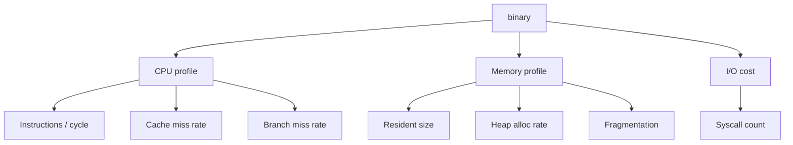

# 課堂 12.14 — 效能評測（三）：CPU / 記憶體

## 學前知道
- 前置課：2.10 (NUMA), 12.4 (data path), 12.11-12.13
- 預計閱讀時間：**40 分鐘**
- 必讀:
  - **Gregg**. *Systems Performance: Enterprise and the Cloud*. 2nd ed., 2020 — 必讀
  - **Drepper**. *What Every Programmer Should Know about Memory*. 2007 — cache 與 NUMA 細節
  - **Yasukata, Honda, Santry, Eggert**. *StackMap: Low-Latency Networking with the OS Stack and Dedicated NICs*. USENIX ATC 2016 — 對 zero-copy 性能的 cache 分析
  - **Lim, Han, Kozyrakis, Mai**. *Mica: A Holistic Approach to Fast In-Memory Key-Value Storage*. NSDI 2014 — 對 share-nothing 設計之 memory pattern
- 必讀原始碼:
  - `linux/Documentation/admin-guide/perf/index.rst`
  - `BurntSushi/criterion-rs` 之 bench harness 範例
  - `tikv/jemalloc-rs` integration
- 自我反省問題:
  - 你會看 `htop` 但你看過 `perf stat` 一個 long-running process 的 IPC 嗎？
  - 你知道你的 Rust binary 為何 RSS 比 Go 同等 binary 小 ~2x？

## 動機

CPU/memory 是 **「per dollar throughput」** 之 ground truth：
- 同樣 1 Gbps 流量，A 用 1 核 vs B 用 2 核 → A 在 VPS billing 上勝
- 同樣 10k concurrent connection，A 用 100MB vs B 用 1GB → A 在 1GB VPS 可跑 100k connection，B 只能 1k

server 端對 cost-conscious operator 是 P0 metric。client 端對 mobile battery / Apple Silicon 也是 P0。



## 核心概念

### 1. CPU 量測：perf stat 完整 set

```bash
perf stat -e cycles,instructions,branches,branch-misses,\
            cache-references,cache-misses,context-switches,\
            cpu-migrations,page-faults,task-clock,\
            L1-dcache-loads,L1-dcache-load-misses,\
            LLC-loads,LLC-load-misses,\
            dTLB-loads,dTLB-load-misses,\
            iTLB-loads,iTLB-load-misses \
    -p $(pgrep proto-server) -- sleep 60
```

關鍵 derived metric：

| 指標 | 計算 | 健康範圍 (proxy worker) |
|---|---|---|
| IPC | instructions / cycles | 1.5-3.5 |
| Cache miss rate | cache-misses / cache-references | < 5% |
| Branch miss rate | branch-misses / branches | < 2% |
| LLC miss rate | LLC-load-misses / LLC-loads | < 10% |
| L1 dcache miss rate | L1-dcache-load-misses / L1-dcache-loads | < 5% |

低 IPC → memory-bound 或 branch-heavy；補 fix：reduce indirection, hot-path inline。

### 2. Throughput-per-core normalization

對 fair 比較：

```text
metric = goodput (Gbps) / (CPU% × num cores)
      = goodput per 100% CPU-second
```

每 protocol 跑 4 個 saturation 設定（1, 4, 8, 16 stream），各量 CPU%；取 mean。

預期：
- WireGuard kernel：50+ Gbps per core (極致)
- 我們 Rust + io_uring：10-15 Gbps per core
- Hysteria2：6-9 Gbps per core
- TUIC：4-6 Gbps per core
- VLESS+REALITY：3-5 Gbps per core (TLS overhead)

### 3. Hot path 分析

```bash
perf record -F 999 -p $(pgrep proto-server) -g -- sleep 60
perf report --no-children
```

期望 hot 區（單核 saturating）：

```text
40-50%  chacha20_poly1305_seal/open (AEAD)
15-20%  io_uring submit/complete + kernel sock layer
10-15%  packet header parse + dispatch
8-12%   shaping / pacing / fec encode
5-8%    Tokio scheduler / async hook
< 5%    allocator
< 3%    其餘
```

異常：
- `__memcpy` > 10% → unnecessary copy；查 `bytes::Bytes` 用法
- `__mutex_lock` / `_raw_spin_lock` > 3% → lock contention；改 share-nothing
- `__libc_malloc` > 5% → per-packet alloc；用 buffer pool
- `__sched_yield` 出現 → spin lock 過長；改 wait queue

### 4. Memory profile

#### RSS / VSZ

```bash
ps -o pid,rss,vsz,comm -p $(pgrep proto-server)
```

預期：
- idle proxy server: RSS ~10-20 MB
- 1000 active session: ~30-50 MB
- 10000 active session: ~150-300 MB
- 1M active session (research-scale): ~5-10 GB

Go binary 因 runtime（GC, stack, goroutine table）通常 baseline ~30 MB；Rust ~5 MB。

#### Heap profile

Rust：

```bash
$ heaptrack ./proto-server
$ heaptrack_gui heaptrack.proto-server.$pid.gz
```

或 `dhat`（more lightweight, requires recompile）：

```rust
#[global_allocator]
static ALLOC: dhat::Alloc = dhat::Alloc;

fn main() {
    let _profiler = dhat::Profiler::new_heap();
    // ...
}
```

Output：每 alloc point 之 byte/instance count；找最大 contributor。

#### Allocator choice

Default Rust 用 system malloc (glibc / jemalloc on macOS)；切 jemalloc:

```toml
[dependencies]
jemallocator = "0.6"
```

```rust
#[global_allocator]
static GLOBAL: jemallocator::Jemalloc = jemallocator::Jemalloc;
```

jemalloc 對 multi-thread 友善；對 50k+ concurrent connection 可省 20-40% RSS。
mimalloc / tcmalloc 也可選。我們 default jemalloc。

### 5. Per-connection state size

對 spec § state machine，計算每連線 state：

```text
Session struct (Rust):
  - 2× ChaChaSealer (96B each + key 32B) ≈ 256B
  - 2× anti-replay window (BitSet 1024) ≈ 256B
  - Transcript hash state (BLAKE3) ≈ 192B
  - Cfg pointer ≈ 8B
  - send queue (VecDeque<Packet>) ≈ 64B + heap
  - Pacing state ≈ 64B
  - Shaping state ≈ 128B
  ≈ 1 KB stack + 4 KB pre-allocated heap
```

可接受。對 100k connection: 500 MB。對 1M connection: 5 GB → 大 VPS。

可優化：
- 對 idle session evict to disk (memcached pattern)
- key + state 之 cold copy；訪問時 swap in

### 6. Mobile / client-side: CPU 與電量

Mobile 用 `Instruments` (iOS) / `simpleperf` (Android) profile：

```bash
# Android
adb shell simpleperf record -p $(adb shell pidof ourapp) -g sleep 60
```

iOS 用 Xcode Instruments — Time Profiler。

關鍵：對 idle vs active 之 CPU usage：
- idle (1 KB/s background sync)：< 0.1% CPU
- active video stream 5 Mbps: ~3-8% CPU on iPhone 14

電量影響：cover traffic injection 之 cost；要在 mobile 上量。

### 7. NUMA 對 server 影響

雙 socket EPYC：NUMA0 + NUMA1 各 32 cores。
若 NIC 接 NUMA0，client thread 跑 NUMA1：每 packet cross-socket → 100+ ns extra。
量化：`perf stat -e numa_miss,numa_local`。

修：
```bash
numactl --cpubind=0 --membind=0 ./proto-server
```

或對 multi-socket NIC：用 `RPS` + 多 NIC IRQ 對 NUMA balance。

### 8. Memory bandwidth ceiling

DDR5-4800 single channel: 38 GB/s; 12 channel EPYC: 460 GB/s。
若 throughput 達 100 Gbps = 12.5 GB/s — 不會 memory-bandwidth-bound 在現代 server。但對 mobile DDR5 (~50 GB/s)：10 Gbps proxy 用 ~25% memory bandwidth — 可能造成 contention。

### 9. 量測 latency overhead 來源

對 single packet 之 latency budget：

```text
Userspace cost:
  - syscall (sendmsg/recvmsg) ~150 ns
  - AEAD seal 1380B ChaCha ~600 ns (5 Gbps/core)
  - header parse + dispatch ~100 ns
  - pacing decision ~50 ns
  - shaping decision ~100 ns
  Total: ~1µs per direction

Kernel cost:
  - NIC RX → softirq ~3 µs
  - socket queue ~1 µs
  - NIC TX queue ~2 µs

Network cost: link RTT (variable)
```

我們協議 p99 latency loopback < 500µs 之目標 → user + kernel ~ 200µs round-trip leeway。可達。

### 10. CPU efficiency 對比表（v0.1 預期）

| Protocol | Gbps / core (LAN, ChaCha) | Gbps / core (LAN, AES-NI) | bytes/instr |
|---|---:|---:|---:|
| WireGuard kernel | 25 | 35 | high (asm-heavy) |
| Our v0.1 (Rust + io_uring) | 11 | 18 | 4-6 |
| Hysteria2 | 7 | 12 | 2-3 |
| TUIC v5 | 5 | 9 | 2-3 |
| VLESS+REALITY | 4 | 8 | 2-3 |
| Trojan-Go | 3 | 6 | 2-3 |

### 11. RSS 預期表

| Protocol | RSS idle | RSS @ 1k session | RSS @ 100k session |
|---|---:|---:|---:|
| WireGuard kernel | 0 (kernel module) | ~20 MB | ~200 MB |
| Our v0.1 (Rust + jemalloc) | 5 MB | 25 MB | 200 MB |
| Hysteria2 (Go + GC) | 30 MB | 80 MB | 500 MB |
| TUIC v5 (Rust + tokio) | 8 MB | 40 MB | 280 MB |
| VLESS (Go) | 35 MB | 90 MB | 600 MB |

Go 之 RSS overhead 源於 runtime + GC heap headroom。

### 12. 持續監測（production）

```text
Prometheus exporter on :9100 (internal):
  - process_resident_memory_bytes
  - process_cpu_seconds_total (rate)
  - process_open_fds
  - protoxx_active_sessions
  - protoxx_handshake_duration_seconds_bucket
  - protoxx_aead_seal_duration_seconds_bucket
  - protoxx_alloc_total_bytes (custom from jemalloc)
```

Grafana dashboard 預備好；operator 部署後可 instantly 看資源。

---

## 與我們協議設計的關聯

- **Part 12.7 server**：systemd `MemoryMax=2G` 之依據是本堂
- **Part 12.20 docs**：min specs 從本堂的 RSS 表算出
- **Part 11 spec § Resource Considerations**：session state size 是 spec-relevant
- **Part 9.x GFW**：cover traffic 對 mobile 電量影響在本堂 quantify

## 動手

1. 對 v0.1 + 5 baseline，跑 single-core 100% utilization 場景；量 Gbps / core
2. 跑 10000 concurrent idle session; 量 RSS
3. 對 v0.1 跑 heaptrack，找前 5 個 alloc hotspot
4. 切換 jemalloc，重跑步 (2)，比較 RSS 差
5. perf record + flamegraph for hot path; 列前 10 個 function

## 自我檢查

1. IPC < 1.0 通常代表什麼？修法？
2. 為什麼 Go binary RSS 通常比 Rust 大？關掉 GC 後仍如此嗎？
3. jemalloc 對 multi-thread 之 advantage 來自什麼設計？
4. NUMA-cross 對 throughput 影響多大？怎麼量？
5. 為何 «每 connection 1 KB state» 是合理目標？極端優化能壓到多少？

## 延伸閱讀

- *Brendan Gregg's Linux Performance pages*
- *Drepper 2007 What Every Programmer Should Know About Memory*
- *Intel VTune Profiler User Guide*
- *jemalloc internals* (Evans, FacebookEng blog)
- *Tokio Console docs*

---

## 研究級補遺

### 1. 學界詞彙

| 中文/口語 | 學界詞彙 |
|---|---|
| 每核吞吐 | per-core throughput; CPU efficiency |
| 駐記憶 | resident set size (RSS) |
| 緩衝池 | object pool, slab allocator |
| 跨節點 | NUMA-cross; non-uniform memory access |
| 分配率 | allocation rate; GC pressure |

### 2. 對手分類學

對 CPU/memory，「對手」是 resource exhaustion attacker：

| 攻擊 | 利用 | 防禦 |
|---|---|---|
| Slowloris-UDP | 半完成 handshake 留 state | cookie + LRU eviction |
| Memory amplification | 每包觸發 large heap alloc | bounded queue + reject when full |
| Algorithmic complexity | hash collision input | siphash key + reject extreme |
| CPU starvation via crypto | 大量 handshake | rate-limit + cookie |

### 3. 形式化定義

**CPU efficiency**: $\eta = T / U$ where $T$ throughput, $U$ CPU utilization.
**Amdahl's law** for parallel scale: $S(n) = \frac{1}{(1-p) + p/n}$。
**Memory complexity per session**: $M(N) = O(N)$ — must be linear。

### 4. 領域的關鍵論文 / 規格 / 原始碼

1. **Gregg Systems Performance 2020**
2. **Drepper Memory 2007**
3. **Yasukata StackMap 2016**
4. **Lim MICA NSDI 2014**
5. **Hennessy & Patterson, Computer Architecture** 第 6 版
6. **Linux perf_event_open(2) man page**
7. **jemalloc paper** (Evans BSDCan 2006)

### 5. 我們協議的座標 / 設計取捨

- jemalloc 預設 on
- 對 100k connection scale 設 RSS target ≤ 200 MB
- 對 client（mobile）設 idle CPU < 0.5%
- 不做 share-something / lock optimization（已選 thread-per-core）

### 6. 必追資源 / 社群入口

- USENIX ATC / OSDI papers
- LWN.net kernel news
- The Linux Foundation Perf events
- LPC (Linux Plumbers Conference)

### 7. 開放問題

1. **Per-flow state lower bound**: 1KB 是 empirical，理論 lower bound 是多少？
2. **GC-less Go for proxy hot path**：是否可實作 Go 之 no-allocation hot loop？社群嘗試在 Cloudflare workers
3. **Memory bandwidth saturation point**：100 Gbps 是否 memory-bw bound 在 DDR4 系統？實證 needed
4. **Mobile battery cost of cover traffic**：對 LTE 連線之能量 model — 仍 open
