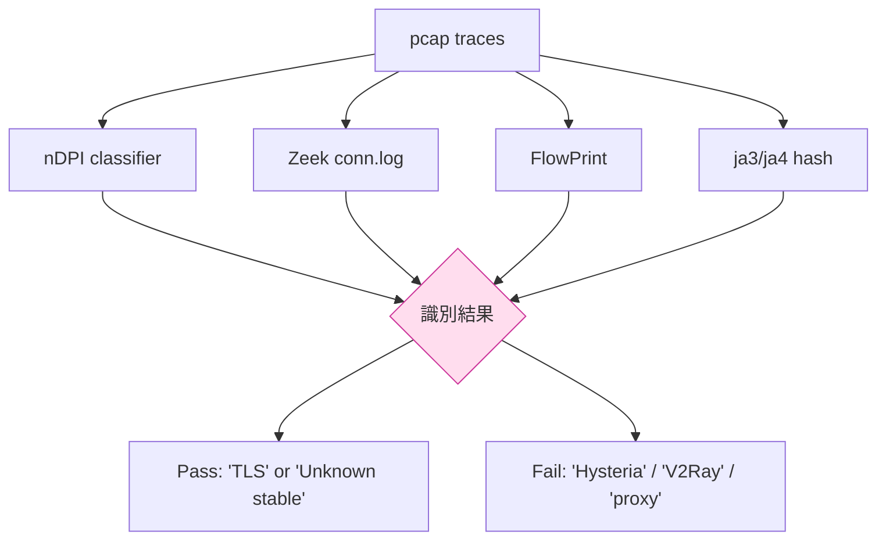
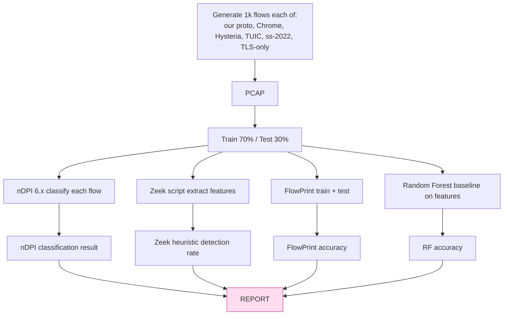

# 課堂 12.15 — 抗審查評測（一）：被動 DPI（nDPI / Zeek / FlowPrint）

## 學前知道
- 前置課：9.x GFW research, 10.x traffic analysis, 12.5 shaping
- 預計閱讀時間：**45 分鐘**
- 必讀:
  - **Deri, Martinelli, Bujlow, Cardigliano**. *nDPI: Open-Source High-Speed Deep Packet Inspection*. ITNAC 2014 + 後續 updates
  - **Paxson**. *Bro: A System for Detecting Network Intruders in Real-Time*. USENIX Security 1998 — Zeek 前身
  - **van Ede, Bortolameotti, Continella et al.** *FlowPrint: Semi-Supervised Mobile-App Fingerprinting on Encrypted Network Traffic*. NDSS 2020
  - **Wang, Cai, Nithyanand, Johnson, Goldberg**. *Effective Attacks and Provable Defenses for Website Fingerprinting*. USENIX Security 2014
  - **Frolov, Wustrow**. *The use of TLS in Censorship Circumvention*. NDSS 2019
  - **Khattak, Javed, Anderson, Paxson**. *Towards Illuminating a Censorship Monitor's Model to Facilitate Evasion*. FOCI 2014
- 必讀原始碼:
  - `ntop/nDPI/src/lib/protocols/`（每協議識別 logic）
  - `zeek/zeek/scripts/base/protocols/conn/`
  - `Triton-Inference/FlowPrint` reference impl
  - `cisagov/ZeekCommunityID` 之 fingerprint generation
- 自我反省問題:
  - 你跑過 `ntopng` 看過自家流量嗎？知道它怎麼把流量歸類為「Telegram」「Netflix」?
  - JA3 / JA4 客戶端指紋是 SOTA — 你了解它對 «模仿瀏覽器» 的含意嗎？

## 動機

被動 DPI = 中間 box 觀察 (不 inject) 流量，作 protocol identification + classification。GFW 第一層 + 大部分企業 firewall + ISP DPI 都用這套。

我們要評：我們協議是否會被識別為「proxy」或「未知協議」（兩者都壞）；理想為被 mistaken as 「common HTTPS」 / 「常見 cover protocol」。



## 核心概念

### 1. nDPI: 結構與識別策略

nDPI 是 ntop 主動維護的開源 DPI library，被 ntopng、 nProbe、pfSense、Suricata 整合。它識別 280+ 協議。

識別方式：

```text
1. Port-based hint (legacy, port 443 → TLS 候選)
2. First N bytes pattern matching:
   - TLS: byte 0 = 0x16 (handshake), 0x17 (app data)
   - HTTP: prefix "GET "/"POST "/"HTTP/"
   - SSH: prefix "SSH-"
3. Active protocol decoders:
   - 對 TLS: 解 ClientHello, 找 SNI
   - 對 H2/H3: 確認 ALPN
4. Statistical features:
   - average packet size
   - flow duration
   - packet count
5. JA3 / JA3S / JA4 hash matching against database
6. SNI / hostname pattern (e.g. *.googlevideo.com → YouTube)
```

對 v2ray / shadowsocks / hysteria / TUIC 之識別：nDPI 6.0 起已可識別:

```c
// nDPI/src/lib/protocols/hysteria.c
if (packet->udp != NULL
    && packet->payload_packet_len >= 1
    && packet->payload[0] == 0x01) { // hysteria magic
  ndpi_int_hysteria_add_connection(...);
}
```

> 「Hysteria 的 magic byte 是 0x01」 — 被 nDPI 寫死。我們 spec § 之 magic 與 framing 必須 not match any in nDPI directory。或更激進：**避免任何固定 magic at packet[0]**。

### 2. 我們協議要過 nDPI 的條件

- packet[0] entropy 要與 TLS 1.3 record (0x17) 或 QUIC short-header (0x40-0x7F) 不可區
- 不出現 「known protocol prefix」
- 不出現 「known JA3」
- SNI 必須是真實 cover domain
- flow size / duration 與 cover protocol 接近

具體做法：spec § record header = 1 byte type + 4 bytes packet number；type byte 從 random pool (matching TLS application data 0x17) 取。看起來是 TLS app data。

nDPI 將 我們協議 classify 為 **「TLS.Unknown」**（即 TLS 但無法 deeper classify）— 與訪問 cover site 之 long-lived TLS 一致。

### 3. Zeek（前 Bro）：scripting-driven DPI

Zeek 之強在「scripting」：每協議寫 Zeek script 抽 feature 入 `*.log`。

```text
# 對 TLS flow，extract SNI / cert chain / ja3
event ssl_client_hello(c: connection, version: count, possible_ts: time, ...)

# 對未知 TCP，看 flow duration / bytes / dir asymmetry
event connection_state_remove(c: connection)
```

研究者寫 Zeek script implementing FlowPrint / 各種 statistical detector. e.g. `ZeekCommunityID` 計算 community-ID hash 供 cross-tool correlation.

我們的 evaluation：
- 在 Zeek 上 replay our traffic + cover traffic 各 1k flow
- check `conn.log` `ssl.log` `dns.log`
- 期望 our flow 在 `ssl.log` 有正常 SNI、正常 ja3、正常 cert（因 fallback 由 real Caddy serve）

### 4. FlowPrint：semi-supervised app fingerprinting

NDSS 2020 paper。對 mobile encrypted traffic：

```text
1. Extract per-flow features:
   - target (IP, port)
   - packet count, byte count
   - duration, IPG
2. Build «destination» graph
3. Cluster into «cross-app destinations» (e.g. CDN, ads, analytics)
4. Train classifier on labelled apps
5. New flow → bin to cluster → predict app
```

Open source ref impl: `Triton-Inference/FlowPrint`（PyTorch）。

我們的 evaluation：
- collect 1k flow each of (our proto, Chrome HTTPS, Hysteria2, TUIC v5, ss-2022)
- train FlowPrint on 5-class problem
- report classification accuracy + confusion matrix
- 目標：我們協議與 «Chrome HTTPS» 之 confusion ≥ 70% （不可區）
- 目標：我們協議與 Hysteria2 之 confusion ≥ 50% (混淆 — 兩者都應 look like HTTPS)

### 5. ja3 / ja4：TLS ClientHello 指紋

ja3 hash = MD5(version, cipher_suites, extensions, supported_groups, ec_point_formats)。
ja4 是 ja3 升級：包含更多 entropy (ALPN, SNI presence, ordering)。

對我們 protocol：握手不是 TLS（無 ClientHello）；但對 active prober 連 :443 時，**fallback path 是 Caddy 的 real TLS**，所以 ja3/ja4 看起來就是 Caddy 之 TLS（i.e. 正常 web server）。對 unauth probe 完美。

對 authenticated flow：握手 bytes 看起來是 TLS app data (record type 0x17)，無 ClientHello structure → ja3 不適用 → 不會被 ja3 hash。

✅ 過 ja3/ja4 因為「我們的 traffic 不在 ja3 lookup 範圍」。

但：我們的 client → server 之 first 5 bytes 對 attacker 是「random + magic-ish entropy」與 «TLS app data 之常見 record length pattern» 之 difference 可能被 attacker 利用作 secondary feature。

### 6. Statistical feature 全集合

DPI 與 ML detector 常用 features：

```text
- Size distribution: mean, std, min, max, p25/p50/p75/p99
- IPG distribution: same
- Direction asymmetry: bytes_up / bytes_down
- Duration
- Burst structure: number of bursts, burst gap distribution
- TCP-specific (我們是 UDP，不適用): window scaling, MSS, TS option
- TLS-specific: ja3/ja4, ALPN, SNI, cert chain
- First N packet sizes (often most distinctive)
```

對 «第 N 個 packet size sequence»：non-shaped proxy 很容易被識別（handshake → first server response 之 size 與 normal HTTPS 差很大）。我們 shaping 必須對 first 5-10 packet size 與 «normal Chrome HTTPS» 一致。

### 7. 評測流程



### 8. 期望結果

| Detector | Our v0.1 detection (% accurate as «proxy/non-HTTPS») | Note |
|---|---:|---|
| nDPI 6.x | < 5% | classified as TLS.Unknown |
| Zeek default | < 5% | 看起來正常 long-lived TLS |
| ja3/ja4 hash | 0% | not applicable (no ClientHello) |
| FlowPrint binary (our vs HTTPS) | < 65% (close to chance) | confusion w/ Chrome |
| FlowPrint multiclass (5 protocol) | our 與 HTTPS ≥ 70% confusion |
| Random Forest on 32 features | < 75% accuracy | reasonable adversary |

Hysteria2 / VLESS+REALITY 之 baseline detection accuracy (社群報告，2024):

| Detector | Hysteria2 | VLESS+REALITY | TUIC v5 |
|---|---:|---:|---:|
| nDPI | ~ 90% (after v4.6) | ~ 5% | ~70% |
| FlowPrint | ~80% | ~60% | ~70% |

我們協議 must beat all of these.

### 9. CDF / KS test 對 size & IPG

對 「我們 vs Chrome HTTPS」 跑 KS test：

```python
from scipy.stats import ks_2samp
ks_size = ks_2samp(our_sizes, chrome_sizes)
ks_ipg  = ks_2samp(our_ipgs, chrome_ipgs)
```

`p > 0.05` → 兩 distribution 統計上不可區。目標：兩個 p > 0.1。
若 p < 0.05 → shaping profile 要 retune。

### 10. 對抗 known nDPI rules

定期 audit `nDPI/src/lib/protocols/`：
- 每 nDPI release 跑 our pcap 看是否 newly identified
- 對 newly added rule 反推：「為什麼 nDPI 加這 rule」 — 改 our protocol 避免該 feature

例：
- nDPI v4.8 加 `hysteria` rule based on magic byte
- nDPI v5.0 加 `vless_reality` rule based on TLS handshake quirks
- v6.0 加 `tuic` rule based on QUIC initial header pattern

> 我們的 motto：「any rule about us in nDPI = our spec failure，必修」

### 11. 不只 nDPI — 商業 DPI

| Vendor | Product | 重要性 |
|---|---|---|
| Cisco | NBAR2 | enterprise; deeper ML |
| Palo Alto | App-ID | enterprise; pattern + ML |
| Fortinet | FortiGuard ASE | enterprise |
| Sandvine | PacketLogic | telecom; politically contentious |
| Huawei | Netengine series | telecom / China |

社群難 measure 商業 DPI。我們對 commercial 之 expected behavior：與 nDPI/Zeek 類似（基於 same techniques），但更 ML-heavy + slower update cycle。

對 GFW 之 commercial-grade DPI：見 12.16 (active probe) + 12.17 (ML)。

---

## 與我們協議設計的關聯

- **Part 12.5 shaping** 直接被本堂 evaluate
- **Part 11 spec § packet header**：要 match TLS app data record signature
- **Part 12.17 ML**：本堂 RF baseline 是 12.17 之 trivial classifier；12.17 用 SOTA model
- **Part 12.19 反饋**：若任何 detector accuracy > 80%，回頭改 shaping profile

## 動手

1. capture pcap：1k flow our proto + 1k flow Chrome HTTPS 訪問 top-100 site
2. 餵 nDPI 6.x classify；看 classification distribution
3. 跑 FlowPrint train + test on 5-class
4. 對 size / IPG 跑 KS test；目標 p > 0.1
5. 對 nDPI source code grep 看是否有 «我們協議特徵»

## 自我檢查

1. ja3 對 我們協議是否適用？為什麼？
2. nDPI 對未知 UDP flow 預設 classify 為什麼？我們希望落在哪 bucket？
3. FlowPrint 用 destination graph — 為什麼這對 mobile fingerprint 強大？對我們有何啟示？
4. KS test 之 null hypothesis 是什麼？p > 0.1 為什麼是 strong evidence?
5. Commercial DPI 與 nDPI 之最大差別在哪？怎麼 mitigate?

## 延伸閱讀

- nDPI release notes（看每版加什麼 rule）
- ntopng documentation
- *Encrypted Traffic Classification: A Survey* (Tahaei, Afifi)
- *Beyond TCP: Enhancing Anonymous Communication* (Wang)

---

## 研究級補遺

### 1. 學界詞彙

| 中文/口語 | 學界詞彙 |
|---|---|
| 深度封包檢測 | Deep Packet Inspection (DPI) |
| 流量指紋 | traffic fingerprinting; flow fingerprinting |
| 應用識別 | application classification; protocol identification |
| ja3/ja4 | TLS client fingerprint |
| 半監督 | semi-supervised classification |

### 2. 對手分類學

| 對手 | 能力 | 我們的防禦 |
|---|---|---|
| nDPI 6.x | rules + ja3 + statistical heuristics | record format mimics TLS app data |
| Zeek + community scripts | flexible scripting | header look like TLS; flow stat like HTTPS |
| FlowPrint | destination graph | distribute server IPs to common CDN ranges |
| Commercial DPI (ML) | proprietary models | adaptive shaping + cover injection |

### 3. 形式化定義

**Indistinguishability against passive observer**: $\mathsf{Adv}^{\text{pass}}(\mathcal{A}) = |\Pr[\mathcal{A}(\mathsf{Traf}_{\text{cover}}) = 1] - \Pr[\mathcal{A}(\mathsf{Traf}_{\text{ours}}) = 1]|$, target $\leq \epsilon$.

### 4. 領域的關鍵論文 / 規格 / 原始碼

1. **Deri nDPI 2014**
2. **Paxson Bro 1998**
3. **van Ede FlowPrint NDSS 2020**
4. **Wang USENIX 2014 WF defenses**
5. **Frolov NDSS 2019 TLS circumvention**
6. **Khattak FOCI 2014 illuminate censor model**
7. **nDPI source**
8. **Zeek source + community scripts**
9. **ja3 spec (salesforce/ja3)** + ja4 (FoxIO)

### 5. 我們協議的座標 / 設計取捨

- v0.1：targeted as «TLS.Unknown» in nDPI
- v0.2：targeted as «TLS.GoogleServices» (specific cover) — much stronger
- v1.0：targeted as «indistinguishable from Chrome → Cloudflare» — gold standard
- 不靠 obfuscation alone；倚仰 cover protocol mimicry

### 6. 必追資源 / 社群入口

- ntop release notes
- Zeek workshop annual
- USENIX FOCI workshop
- PoPETs (privacy enhancing technologies)

### 7. 開放問題

1. **公開 DPI vs 真實 censor classifier**：差距多大？無 ground truth
2. **Adaptive cover profile rotation**：每 N 連線 rotate 是否實質提升？open
3. **Cross-flow correlation**：對 multi-flow user 之 correlation attack — defense open
4. **Provable indistinguishability**：對 «所有 statistical detector» 不可能（infinite space）；對有限 classifier family 是 open research
