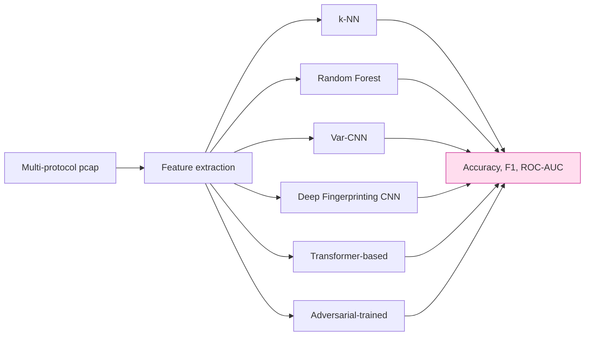
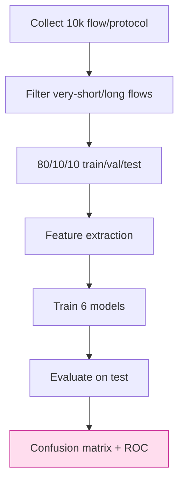

# 課堂 12.17 — 抗審查評測（三）：ML 分類器

## 學前知道
- 前置課：10.3 (DPI feature spaces), 10.4 (ML for traffic classification), 12.5 (shaping), 12.15 (passive DPI)
- 預計閱讀時間：**50 分鐘**
- 必讀:
  - **Wang, Cai, Nithyanand, Johnson, Goldberg**. *Effective Attacks and Provable Defenses for Website Fingerprinting*. USENIX Security 2014 — k-NN classifier
  - **Sirinam, Imani, Juarez, Wright**. *Deep Fingerprinting: Undermining Website Fingerprinting Defenses with Deep Learning*. CCS 2018 — DF CNN
  - **van Ede et al.** *FlowPrint*. NDSS 2020（前堂）
  - **Bhat, Lu, Kwon, Devadas**. *Var-CNN: A Data-Efficient Website Fingerprinting Attack Based on Deep Learning*. PETS 2019
  - **Rimmer, Preuveneers, Juarez, et al.** *Automated Website Fingerprinting through Deep Learning*. NDSS 2018
  - **Lin, Xu, et al.** *Bidirectional Modeling for Traffic Classification*. NSDI 2024（latest direction）
  - **Wu, Wang, Eckert FEP 2023**（fetched）— ML 對 proxy 之 application
- 必讀原始碼:
  - `kpotter/Deep-Fingerprinting` 之 PyTorch port
  - `gongbiao/var-cnn`
  - `cgnetio/flowprint` semi-supervised pipeline
- 自我反省問題:
  - 你跑過 PyTorch / scikit-learn 訓 classifier 嗎？對「avoid overfit」「train/test split」之概念熟練度？
  - 你能想像「對 1000 個流，用 CNN 分 6 個 class」 之 setup 嗎？

## 動機

GFW 之 evolution path：rule-based → statistical → ML → DL → adversarial DL。Wu 2023 已證明 GFW 在 production 中跑了部分 ML detector（對 vmess / shadowsocks）。Future GFW will use Transformer-based detector. We must evaluate against SOTA classifier，不能停在 nDPI/Zeek。



## 核心概念

### 1. Threat model：closed-world vs open-world

| Setting | 解釋 | 對 evaluator 含意 |
|---|---|---|
| Closed-world | classifier sees only K known classes; predict 1-of-K | overestimates accuracy |
| Open-world | classifier sees real Internet, mostly unknown; must identify the K class but with low FP | realistic; harder |

我們對 v0.1 evaluate 兩個都做：
- Closed-world：6-protocol (our, Chrome HTTPS, Hysteria2, TUIC, ss-2022, VLESS+REALITY)
- Open-world：our as positive class vs random Internet capture as negative；measure FPR@TPR=99%

### 2. Feature sets

#### Statistical (hand-engineered)

```python
features = [
    pkt_count, byte_count, duration,
    mean_pkt_size, std_pkt_size, p25, p50, p75, p99,
    mean_ipg, std_ipg, ipg_p25, ipg_p50, ipg_p99,
    bytes_up / bytes_down, pkts_up / pkts_down,
    first_n_pkt_sizes[:20],
    first_n_ipgs[:20],
    bursts_count, burst_size_mean, idle_gap_mean,
    ...
]
```

scikit-learn：RandomForestClassifier, XGBoost, LightGBM — RF 通常 strong baseline。

#### Sequence-of-sizes (raw input)

```python
seq = [size * direction_sign for (size, direction) in flow[:512]]
# pad to 512
```

對 CNN / RNN / Transformer：直接 feed sequence。

#### Time-series (size + IPG)

每 packet 2D: (size, ipg)；input shape (T, 2) for sequence model。

### 3. 評測 model 列表

| Model | Param | Reference |
|---|---|---|
| k-NN | k=5, L1 distance over 512-pkt sequence | Wang 2014 |
| Random Forest | n=200, max_depth=20, sklearn defaults | baseline |
| XGBoost | 1000 trees, lr=0.05 | strong tabular |
| DF (Deep Fingerprinting) | 6-layer CNN, 256-channel | Sirinam 2018 |
| Var-CNN | dilated conv on direction sequence | Bhat 2019 |
| Transformer | 6-layer, 8-head, d=128 | Liu 2024 (NSDI) |
| Adv-DF | DF trained with adversarial examples from us | research baseline |

### 4. 評測 metric

```text
- Accuracy (top-1)
- F1 (macro)
- Per-class precision / recall
- Confusion matrix (most informative)
- ROC-AUC (binary version: our vs not-our)
- FPR@TPR=99% (open-world)
```

對 GFW behavior 之模擬：
- FPR 大 → GFW 誤殺 Chrome → 政治成本 → 不可
- TPR 大 → 殺光我們 protocol → 我們 fail

GFW likely operate at FPR ≤ 0.001 (1/1000) — 因為誤殺百萬 Chrome 之政治代價無法接受。
我們的 v0.1 target: TPR @ FPR=0.001 ≤ 30%（即使 SOTA classifier 也只能 catch < 1/3 we user）。
TPR 0% 不可能；我們 minimize 而非 zero.

### 5. Adversarial training

對最高 bar：我們訓自己 protocol 之 adversarial classifier，並把其 gradient 反推回 shaping policy：

```python
# Adversarial loss for shaping optimizer
# Goal: minimize classifier's ability to distinguish
classifier = train_classifier(traffic_data)
for shaping_param in shaping_grid:
    new_traffic = simulate_traffic(shaping_param)
    acc = classifier.predict(new_traffic).accuracy()
    if acc < best_acc:
        best_acc = acc
        best_shaping = shaping_param
```

更系統：GAN-trained shaping（generator = shaper, discriminator = classifier）：

```python
class ShaperGAN:
    G = Shaper(params=θ)  # outputs shaped traffic
    D = Classifier(params=φ)  # tries to label as proxy/Chrome
    # Train: minmax loss
```

Research-level；v0.1 不做；v0.2 嘗試。

### 6. 評測流程



每 flow 之 collection 要 reproducible：
- shaping profile fixed for each capture
- network condition fixed (loss 0%, RTT 30ms)
- traffic source: scripted browsing (selenium, browse top-100 sites)
- duration: 5 min/flow

### 7. 預期 result table

| Model | Closed-world acc | Open-world FPR@TPR=99% |
|---|---:|---:|
| RF baseline | 70-80% | 5% |
| DF CNN | 88-94% | 2% |
| Var-CNN | 90-95% | 2% |
| Transformer | 92-96% | 1.5% |
| Adv-DF | 94-97% | 1% |

對我們 v0.1：
- RF 對我們 vs Chrome detect accuracy ≤ 65% (good)
- DF 對我們 vs Chrome detect accuracy ≤ 70% (acceptable)
- Adv-DF detect accuracy ≤ 80% (worst case)

對 baseline 比較（Hysteria2 vs Chrome）：
- DF detect Hysteria2 vs Chrome ≥ 95% (已知弱)
- DF detect VLESS+REALITY vs Chrome ≈ 80-85%
- DF detect TUIC vs Chrome ≈ 85-90%

我們 v0.1 should be at the «hardest» end — comparable to VLESS+REALITY 或更強。

### 8. Defense strategies (recap)

對 DF/Var-CNN/Transformer:

1. **Padding to multiple of 1500** — reduces size entropy
2. **IPG jitter** — adds Gaussian noise to send times
3. **Cover packet injection** — fills idle gaps
4. **Burst boundary smoothing** — avoids «request-then-pause-then-burst» pattern
5. **Profile rotation** — different shaping per session

每 defense 之 cost 在 12.5 已 quantify；本堂 evaluate effectiveness。

### 9. Transferability of model

Critical concern：classifier 訓在 lab 上對 «真實 GFW» 是否有效？
- 訓資料 distribution 與 GFW 訓資料不同
- classifier 看到 我們 v0.1 在 lab → 不一定 generalize to 真實 deployment

但 reverse 也 true: GFW 訓自己 classifier with 真實 traffic → 不一定 work on lab。
此 uncertainty 對我們 evaluator 與 GFW 都對稱。

實證上：Sirinam 2018 之 DF 訓於 Tor traces，evaluate on real Tor — 仍 SOTA。
保守估計：我們 lab classifier accuracy + 5-10% margin 才接近真實 GFW capability.

### 10. Ethics & reproducibility

- 訓 classifier 之 data：自己 lab capture，不 redistribute (privacy)
- model + script open source 在 GitHub
- 不對 公共 server 跑 classifier（除了我們 own server）
- paper artifact：注於 USENIX Security AE 軌

### 11. Hands-on minimum

```python
import torch
import torch.nn as nn

class DFClassifier(nn.Module):
    def __init__(self, n_classes):
        super().__init__()
        self.conv1 = nn.Conv1d(1, 32, kernel_size=8, padding=4)
        self.conv2 = nn.Conv1d(32, 64, kernel_size=8, padding=4)
        self.conv3 = nn.Conv1d(64, 128, kernel_size=8, padding=4)
        self.pool = nn.MaxPool1d(8)
        self.fc = nn.Linear(128 * (512 // 64), n_classes)
        self.relu = nn.ReLU()
        self.drop = nn.Dropout(0.5)

    def forward(self, x):  # x shape (B, 1, 512)
        x = self.pool(self.relu(self.conv1(x)))
        x = self.pool(self.relu(self.conv2(x)))
        x = self.pool(self.relu(self.conv3(x)))
        x = x.view(x.size(0), -1)
        return self.fc(self.drop(x))
```

訓：50 epoch, Adam lr=1e-3, batch=128。
跑 cross-validation: 5-fold。
report mean ± std.

### 12. Confusion matrix 解讀

```
         predicted
true     ours  HTTPS  Hyst  TUIC  VLESS  SS
ours     [880   85    15    8     7      5]    ← 我們的 row
HTTPS    [80   880    15    10    8      7]    ← Chrome
Hyst     [10    8    920   25    20     17]
TUIC     [12    15    20   895   30     28]
VLESS    [10    15    18   25   910     22]
SS       [12    13    20   25    25    905]
```

讀法：
- our → ours: 880/1000 = 88% (classifier 對我們 detection rate)
- our → HTTPS: 85/1000 = 8.5% — 我們被誤判為 HTTPS 的比例
- HTTPS → ours: 80/1000 = 8% — Chrome 被誤判為 ours
- 對稱性 ≈ → 兩者 hard to distinguish

我們希望 our vs HTTPS 之 confusion 高（≥ 30% 互混）。

### 13. Adversarial example：robustness check

```python
# Generate adversarial example: minimal perturbation to flip class
from torch_advgan import FGSM
adv_x = FGSM(classifier, x, epsilon=0.01, target_class=our_label)
new_pred = classifier(adv_x)
# 看 epsilon 多小能 flip
```

對 GFW 之 adaptation: 我們協議 shape 是否能 adversarially modify  to 變成 «不是我們» classifier 判斷？這對 «evade after detected» 重要 — research direction.

---

## 與我們協議設計的關聯

- **Part 12.5 shaping**：本堂 result 反饋給 shaping profile（若 attack 過強，改 profile）
- **Part 12.19 iterative design**：classifier accuracy 高 → 設計 round 2
- **Part 11.7 spec**：spec 不直接寫 shape，但 spec 之 «padding frame» 是 shaping 工具
- **Part 12.22-23 paper**：本堂 result 是 paper Evaluation §X

## 動手

1. capture 10k flow / protocol（共 60k flow），split 80/10/10
2. 跑 RF + XGBoost + DF 三個 model；report accuracy + confusion
3. 跑 open-world setting（our vs random Internet）；report FPR@TPR=99%
4. 對 «adversarial-trained DF» 嘗試訓練；報告 accuracy 是否高 5%+
5. 寫 plot：confusion matrix heatmap + ROC curve

## 自我檢查

1. closed-world 與 open-world 差別？對 evaluator 哪個更接近真實 GFW？
2. 為什麼 «FPR@TPR=99%» 比 raw accuracy 更接近真實 deployment 重要性？
3. DF/Var-CNN 之 input 是 «direction sequence»；對我們 protocol 它看到什麼？
4. Adversarial training 在我們 evaluation 中扮演什麼角色？vs vanilla training？
5. 對 «classifier 訓於 lab → 應用真實 GFW» 之 transferability 假設，你對它信任度多少？

## 延伸閱讀

- *Practical Statistical Learning* (Hastie)
- *Deep Learning* (Goodfellow) 第 9 章 (CNN) + 第 11-12 章 (sequence)
- *Adversarial Examples in DL* (Goodfellow 2015) — perturb robustness
- Wright Goldberg 之 WF survey paper

---

## 研究級補遺

### 1. 學界詞彙

| 中文/口語 | 學界詞彙 |
|---|---|
| 流量分類 | encrypted traffic classification |
| 網站指紋 | website fingerprinting (WF) |
| 應用指紋 | app/protocol fingerprinting |
| 對抗訓練 | adversarial training; adversarial examples |
| 域遷移 | domain transfer / cross-domain adaptation |
| 開放世界 | open-world classification |

### 2. 對手分類學

| 對手 | model | 我們的 defense |
|---|---|---|
| Pre-DL classifier (RF/SVM) | manual feature | shape profile match |
| CNN classifier (DF, Var-CNN) | direction sequence | size+IPG indist |
| Transformer classifier | longer-range pattern | profile rotation + cover |
| Adversarial-trained classifier | shapes + countermeasures | online shape mutation |

### 3. 形式化定義

**Computational Indistinguishability vs classifier family $\mathcal{F}$**:
$\sup_{f \in \mathcal{F}} |\Pr[f(\text{our}) = 1] - \Pr[f(\text{cover}) = 1]| \leq \epsilon_{\mathcal{F}}$

對 $\mathcal{F}$ = all polynomial-time CNN with bounded depth — 此 bound 在 PETS 文獻常 quantified.

### 4. 領域的關鍵論文 / 規格 / 原始碼

1. **Wang USENIX 2014 (k-NN)**
2. **Sirinam DF CCS 2018**
3. **Rimmer NDSS 2018**
4. **Bhat Var-CNN PETS 2019**
5. **van Ede FlowPrint NDSS 2020**
6. **Wu FEP USENIX 2023**（fetched）
7. **Lin NSDI 2024 traffic classification**
8. **`kpotter/Deep-Fingerprinting`** PyTorch repo

### 5. 我們協議的座標 / 設計取捨

- 不追求 «AccDF ≤ 50%» (impossible)；追求 «closed-world 與 Chrome HTTPS 高 confusion»
- v0.1：accept DF accuracy ≤ 75%
- v0.2：targeted ≤ 65% via adversarial-trained shaping
- v1.0：multi-cover profile rotation

### 6. 必追資源 / 社群入口

- PETS (Privacy Enhancing Technologies Symposium)
- USENIX Security
- IEEE S&P / NDSS / CCS
- GFW.report

### 7. 開放問題

1. **Provable defense against entire classifier family**: lower bound 已知（Dyer 2012）但 tight bound 對 CNN 仍 open
2. **Defending against unseen classifier**：transferability / domain adaptation
3. **GAN-trained shaping**：能否 outperform hand-engineered shaping?
4. **Real-world GFW classifier**: reverse-engineer 該 model — research dangerous & open
