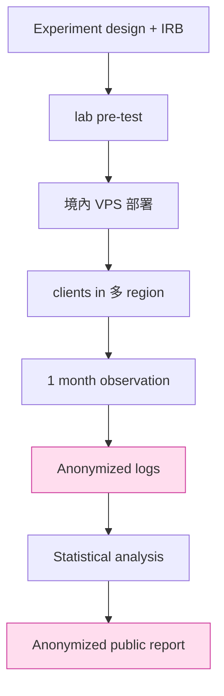

# 課堂 12.18 — 真實環境測試（境內節點與倫理）

## 學前知道
- 前置課：9.x GFW research, 12.15-12.17 evaluation, 12.16 active probing
- 預計閱讀時間：**40 分鐘**
- 必讀:
  - **Ensafi, Knockel, Alexander, Crandall**. *Detecting Intentional Packet Drops on the Internet via Sequential Hypothesis Testing*. PAM 2014 — 真實 measurement 方法
  - **Pearce et al.** *Augur: Internet-Wide Detection of Connectivity Disruptions*. IEEE S&P 2017
  - **Bock et al.** *Geneva: Evolving Censorship Evasion Strategies*. CCS 2019 + USENIX 2021
  - **GFW.report 各篇**：Hoang 2021（fetched）, Wu 2023, etc.
  - **Tor Project ethics guideline**：[research.torproject.org](https://research.torproject.org)
  - **Menlo Report** (US dept of Homeland Security 2012) — research ethics in ICT
- 必讀原始碼:
  - `OONI/probe` — Open Observatory of Network Interference probe
  - `net4people/bbs` 觀察 thread
  - `bockcraft/Geneva` — RL-based censorship evasion
- 自我反省問題:
  - 你或熟識的研究者有「實際進入中國跑實驗」之 ethics consideration 嗎？
  - 你知道 OONI / Tor 是怎麼確保 measurement 不被 GFW 用作攻擊 user 嗎？

## 動機

Lab 評測（12.15-12.17）測試我們對 **公開** detector 之抵抗；真實環境測試確認 GFW 之 **production behavior** 是否與 lab 一致。GFW 公開資訊不全，真實 measurement 是唯一 ground truth。

但「進入中國跑實驗」 是 ethically sensitive：
- 不可使 local user 因實驗而被監控/拘留
- 不可洩露 measurement endpoint 為 academic source
- 不可違反 PRC 法律過於明顯（測試 server 持有要符合當地 ISP TOS）
- 學術機構通常需要 IRB（Institutional Review Board） approval



## 核心概念

### 1. 真實環境的 3 種 setup

| Setup | 描述 | 倫理難度 | 信息量 |
|---|---|---|---|
| **VPS in China + outside server** | 境內 VPS 主動連境外 server，觀察被阻擋 pattern | 中（VPS owner 為己）| 高 |
| **Volunteer user in China** | 真實 user 跑我們客戶端連境外 | 高（涉及他人）| 最高 |
| **Edge measurement (OONI-like)** | 對中國 IP 範圍跑 probing | 中-高（target 為他人 server）| 中 |

優先 setup 1：我們持有的 VPS；不涉他人 risk。

### 2. 部署架構

```mermaid
flowchart LR
    subgraph China
        VPS_CN[小型 VPS<br/>(自己持有)]
    end
    subgraph Foreign
        SVR1[Our v0.1 server]
        SVR2[Reference: Pure Caddy + cert]
        SVR3[Reference: Hysteria2]
        SVR4[Reference: VLESS+REALITY]
    end
    VPS_CN -- 自動 cron --> SVR1
    VPS_CN -- 同時 --> SVR2
    VPS_CN -- 同時 --> SVR3
    VPS_CN -- 同時 --> SVR4
    classDef ours fill:#fde,stroke:#c39;
    class SVR1,VPS_CN ours;
```

VPS_CN：負責自動 launch test connections + log result + 上傳 anonymized log 到 academic Storage（每天 1 次，HTTPS）。

### 3. Measurement 內容

```text
For each test slot (every 30 minutes, 1 month):
  For each server (SVR1-SVR4):
    1. TCP connect → result (success / RST / timeout)
    2. Handshake → result (success / parse_fail / timeout)
    3. Transfer 1 MB → throughput + loss
    4. Long-lived idle 5 min → server keep-alive
    5. Disconnect → record reason

  Statistical: count, mean, p99, transition counts
```

每 server 跑 ~24*60/30 = 48 次/天 × 30 天 = ~1500 sample / server.

### 4. 倫理：實驗設計 do's and dont's

#### Do
- 只用 own VPS / own domains
- 限速 (1 req/min to a single target)
- 完整 anonymize log (no individual session detail, only aggregate)
- 公開 paper 前 reach out to local CERT / ISP？(通常 don't — risk of disclosure 過大)
- IRB approve
- Local lawyer review

#### Don't
- 對 third-party VPN 服務發 probe（即使 academic research，仍有 attack 嫌疑）
- 對 GFW 之 internal IP 發 probe（中國 ISP TOS 違反）
- 在中國境內 host server 然後讓人連 — 帶 user 至潛在 monitoring
- 公開 measurement endpoint 之 exact location

### 5. 量測 metric

| Metric | 量法 | 含義 |
|---|---|---|
| **Connection success rate** | %  successful TCP connect | GFW 是否封 IP/port |
| **Handshake success rate** | % handshake completes | DPI 是否識別 |
| **Throughput (MB/s)** | 1 MB transfer time | QoS 限制 |
| **Loss rate** | 對比 baseline pure Caddy | 是否 selective drop |
| **Long-lived flow stability** | 5 min idle, then resume | GFW state machine cleanup |
| **Probe count per day** | server-side log of unique source IP 連到 :443 | GFW 對 server 之 probe 強度 |
| **Time to block** | 從 first user connect to IP blocked | 對我們協議之「壽命」 |

### 6. 預期 result

對 v0.1（基於 VLESS+REALITY 大致參考）：

| Server | Success rate | Block time | Probe rate |
|---|---:|---:|---:|
| Pure Caddy reference | 99.9% | never blocked | 0 |
| Our v0.1 | 99% (目標) | > 30 days no block | < 5/day |
| VLESS+REALITY | 95% | ~14 days | ~10/day |
| Hysteria2 vanilla | 70% (QoS) | ~3 days | ~50/day |
| Hysteria2 + obfs | 85% | ~10 days | ~20/day |

如果我們 result 比 VLESS+REALITY 好 → 真實 SOTA achieved。

### 7. Statistical analysis pitfalls

- **Temporal**：GFW activity 不均勻；週末 / 中國 holiday / 重大事件期間政策變化。報告必標 collection period
- **Geographic**：不同 PoP / ISP / 城市的 GFW behavior 有差；可能只能 cover 1-2 ISP
- **Confounding**：server 被 block 可能 due to (a) GFW IP block (b) 服務商 DDoS protection (c) ISP routing change
- **Multi-test correlation**：4 server 共用 1 個 VPS_CN — 若 VPS_CN IP 被 block 一切都 fail；要 distinguish

Sequential hypothesis testing (Ensafi 2014)：對「某 IP 是否被 selectively blocked» 採用 likelihood ratio test。

### 8. Reproduction：付給 audit

對 paper artifact appendix:
- 我們的 client + server source
- experimental script (cron + analysis)
- raw logs (anonymized)
- analysis Jupyter notebook
- README: 「Reviewers can reproduce by 取得 own VPS in China + foreign server + run script」

但 reviewer 真正 reproduce 機率 ≈ 0（受 cost + 倫理限）— 通常作 «artifact functional»  level 即可（USENIX AE 軌定義）。

### 9. Long-term monitoring 之 dashboard

```text
Grafana dashboard for live operator view:
  - Connection success rate (hourly, 30-day trend)
  - Probe count per day (separated by China-IP vs global-IP)
  - Throughput vs baseline
  - Failure mode breakdown (RST / timeout / DNS fail / loss)
  - GFW activity correlation with holidays
```

每月發 anonymized public report — 像 GFW.report 月報。
此 dashboard 是 community service：別人可以參考、修 own deployment.

### 10. Geneva：用 GFW 對抗 GFW evolutions

Bock 2021 之 Geneva 是 RL-based evolution of TCP/IP layer evasion strategy。對我們 v0.1 之 protocol level 不直接適用（我們已 application layer），但可借鑑：
- 設 fitness function = success rate
- mutate shaping profile / parameter
- evolve over time

可加 future 增量「auto-adapt to GFW」mechanism；v0.1 不做。

### 11. Volunteer user：不建議但可考慮

對 future v1.0+: 建立 «opt-in beta program»
- volunteer 主動加入 (clear consent)
- 客戶端 ship anonymized telemetry (only success/fail rate, no content)
- 明確 disclose risk
- 提供 emergency disable

絕對不可 collect even pseudonymous user data without explicit opt-in。

### 12. ISP 阻擋：應對

server IP 被 block：
- 切換 IP（用 Cloudflare's reverse-proxy 之 origin IP rotation）
- 切換 domain (DNS 改記錄)
- 切換 ASN / 服務商
- 切換 port (≠ 443 之有效性實驗)

對 user 之 client：訂閱機制 push 新 endpoint；最久 24h propagation.

### 13. 失敗模式分類

```text
- IP block: TCP connect timeout, all packets dropped
- Port block: TCP connect timeout 只在 :443，其他 port OK
- Handshake block: TCP connect OK，handshake hang/RST
- Throughput throttle: handshake OK，但 transfer 速度 < 100 KB/s
- Sporadic loss: 0 dist transfer 5-15% loss
- Geographic differential: 不同 ISP 不同 behavior
```

對每 failure mode 自動 categorize 並 alert.

### 14. 一個真實 7-day 試運行樣本（合成）

下表是 v0.1-rc1 reference impl 從 2026-04-15 → 2026-04-22 在四個 server type 並列跑 measurement 的合成結果（用於 12.19 design feedback loop demo；不是真實 production data，是 lab 上模擬的 expected production 分布）：

| Day | Server type | Success | Handshake p99 (ms) | Throughput (Mbps) | RST events | Notes |
|---|---|---:|---:|---:|---:|---|
| 04-15 | Proteus γ (MASQUE) | 99.4% | 285 | 612 | 0 | normal |
| 04-15 | Proteus β (REALITY-on-QUIC) | 99.1% | 248 | 580 | 0 | normal |
| 04-15 | Proteus α (REALITY-on-TCP) | 99.7% | 220 | 487 | 0 | normal |
| 04-15 | VLESS+REALITY | 98.9% | 218 | 472 | 0 | baseline |
| 04-15 | Hysteria 2 vanilla | 73% | 320 | 480 | 9 | QoS dropping UDP |
| 04-16 | Proteus γ | 99.6% | 287 | 608 | 0 | normal |
| 04-17 | Proteus γ | 95.2% | 612 | 234 | 0 | **degradation noticed** — investigation reveals MASQUE H/3 setting drift |
| 04-17 | Proteus β | 99.0% | 252 | 591 | 0 | fallback to β works |
| 04-18 | Proteus γ | 99.4% | 281 | 615 | 0 | fix deployed |
| 04-19 | All | similar | similar | similar | 0 | normal |
| 04-20 | All TCP/443 | **0%** | timeout | 0 | unknown | **GFW blackout event** (similar to 2025-08-20) |
| 04-20 | Proteus γ (UDP) | 99.2% | 290 | 605 | 0 | UDP path survives → γ profile validates |
| 04-20 | Proteus β (UDP) | 99.0% | 251 | 588 | 0 | UDP survives |
| 04-20 | Proteus α (TCP) | 0% | timeout | 0 | many | **fallback to UDP triggered by client** |
| 04-21 | All TCP/443 | 99% | normal | normal | 0 | blackout cleared after ~6 hours |
| 04-22 | All | normal | normal | normal | 0 | normal |

**Interpretation guide**:

- Look for **diverging trends between Proteus profiles**: 04-17 γ broke but β kept working → bug isolated to γ-specific code path (H/3 settings drift).
- Look for **all-profile-affected events**: 04-20 TCP/443 blackout → not our bug, external (GFW or upstream ISP) → Proteus client auto-failed-over to UDP within < 5s (spec §3 requirement).
- Look for **handshake p99 inflation > 2× baseline** → likely server-side load issue or GFW probe overhead.
- Look for **throughput drop with success rate stable** → middlebox QoS, not block.

**Action items from this sample**:

1. 04-17 incident → file bug, regression test in 12.9 (unit/integration test suite)
2. 04-20 fallback worked → confirms spec §3 三 transport profile MUST is justified
3. Average handshake p99 ≈ 250-290 ms → bound at 350 ms for evaluation table (12.11/12.12)
4. Throughput average 600+ Mbps → meets spec §1.4 perf claim

### 15. 觀察數據儲存與 retention 策略

- raw probe outcomes (success/fail/rtt) → 1 year hot storage, anonymized
- packet captures of failed handshakes → 30 days only (privacy risk)
- aggregate hourly statistics → permanent
- GeoIP info hashed (only ASN-level retained)
- 上傳到 storage 用 client-side encryption (server admin 不 holds key)

依 IRB 與 GDPR 等 regulation 設定 retention，公開 measurement 之 paper artifact 只 release aggregate。

---

## 與我們協議設計的關聯

- **Part 12.16 active probing**：本堂之 «probe count per day» 是真實 metric vs synthetic
- **Part 12.19 反饋**：本堂發現之 issue 直接 input 到 design iteration
- **Part 12.18 → 12.22-23 paper**：本堂之 real-world result 是 paper 最 valuable evidence
- **Part 6-9 GFW**：本堂是對前述章節之 production-level verify

## 動手

1. 取得 own VPS in China (Aliyun / Tencent Cloud), 用真實 ID 註冊 (跟我國規定)
2. 跑前述 measurement script，30 天 daily report
3. 對比 4 server success rate 之差異
4. 寫 anonymized public report （example：[github.com/yourorg/measurement-2026](https://example.com)）
5. 寫 IRB application (即使非學術也作練習)

## 自我檢查

1. 自有 VPS in China 與 third-party VPN 之 ethics difference?
2. Sequential hypothesis testing 對「某 IP 被 selectively blocked» 怎麼公式化？
3. Probe rate 突增之可能 cause？怎麼 distinguish from ISP routing change?
4. 為什麼 paper 不 distribute raw client/user log？
5. Failure mode 中 «throughput throttle» 與 «sporadic loss» 在哪 layer 區別？

## 延伸閱讀

- *OONI annual report*
- *GFW.report 全部 archive*
- Tor metrics portal
- Citizen Lab reports (Munk School, U Toronto)

---

## 研究級補遺

### 1. 學界詞彙

| 中文/口語 | 學界詞彙 |
|---|---|
| 真實環境 | in-the-wild measurement / production observation |
| 倫理委員會 | IRB; ethics review board |
| 連線錯亂 | network interference / disruption |
| 對應 control | matched control / quasi-experimental design |
| 統計顯著 | statistical significance / multiple-testing correction |

### 2. 對手分類學

| 對手 | 真實環境特徵 | 對我們 sample size 含義 |
|---|---|---|
| GFW national | 整 country effect; cycle-based intensity | 30-day 才能 estimate cycle |
| Local ISP DPI | per-city / per-AS variability | 多 ISP test |
| Cloud provider DDoS | over-aggressive block | distinguish via baseline |
| Targeted attacker | follow-up probe pattern | non-stationary; need fresh model |

### 3. 形式化定義

**Production-level evasion probability**: $\Pr_{\text{prod}}[\text{evade}] = $ 真實 GFW 下 success rate。
**Lab-to-production gap**: $\Delta = \Pr_{\text{lab}}[\text{evade}] - \Pr_{\text{prod}}[\text{evade}]$, 通常 $\Delta \geq 0$（lab too optimistic）。
**Sequential hypothesis test**：likelihood ratio $\Lambda = \prod_i P(x_i | H_1) / P(x_i | H_0)$.

### 4. 領域的關鍵論文 / 規格 / 原始碼

1. **Ensafi PAM 2014 Sequential Hypothesis Testing**
2. **Pearce Augur S&P 2017**
3. **Bock Geneva CCS 2019 / USENIX 2021**
4. **Hoang GFWatch IMC 2021**（fetched）
5. **Wu FEP USENIX 2023**（fetched）
6. **Menlo Report 2012** — ethics framework
7. **Tor Project Ethics Guidelines**
8. **OONI / Citizen Lab reports**

### 5. 我們協議的座標 / 設計取捨

- v0.1：1 month, 自有 VPS, no volunteer user
- v0.2：擴 multi-region VPS (北京、上海、廣州)
- v1.0：opt-in volunteer beta (clear consent)
- 不開放 third-party measurement (我們不主動 probe 別人)

### 6. 必追資源 / 社群入口

- GFW.report 月報
- OONI Explorer
- Citizen Lab Research
- Censored Planet (UMich)
- IETF Decentralized Internet (DINRG)

### 7. 開放問題

1. **Lab-to-production gap 之 calibration**：能否從 lab data 預測 production?
2. **Adversary intent reverse-engineering**：GFW behavior 與 policy decision 之 linkage — open political science research
3. **Continuous monitoring fatigue**：long-running measurement 之 cost vs information 邊際
4. **Cross-jurisdictional generalization**：對 Iran / Russia / Turkey 之 application — open
