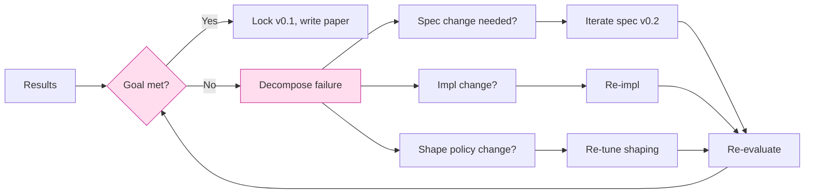
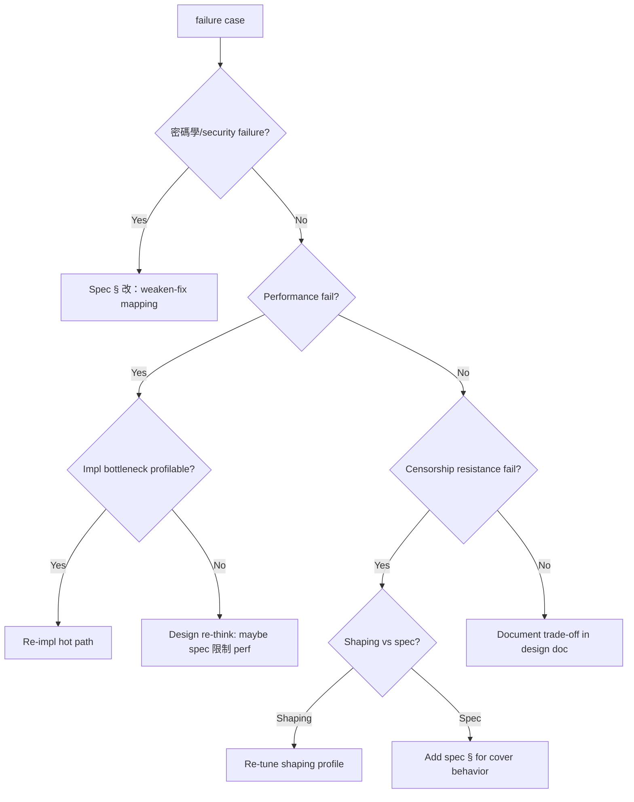

# 課堂 12.19 — 結果分析與設計反饋迭代

## 學前知道
- 前置課：12.11-12.18 全部 evaluation 章
- 預計閱讀時間：**35 分鐘**
- 必讀:
  - **Shapiro**. *Designing for Performance*. ACM Queue 2010 — perf 設計反饋
  - **Bornholt et al.** *Using Lightweight Formal Methods to Validate a KV Storage Node*. SOSP 2021 — spec ↔ impl 迭代
  - 部分 Apple Research、Cloudflare blog 關於 production iteration
- 自我反省問題:
  - 你過去寫的 software 在 measurement 後通常會發現什麼類型的「surprise」？
  - 你願意接受「跑完 evaluation 後發現 spec 要改，得回頭重寫 implementation 1/3」嗎？

## 動機

Evaluation 不是 paper 的終點 — 是 design loop 的迭代節點。本堂課給出 systematic 之「from result to next iteration」flow，避免兩個常見失敗：

1. **Cherry-picking**：只報好結果，掩蓋差 result
2. **Stuck in local optimum**：發現一個 metric 差但不敢回頭改 design



## 核心概念

### 1. 「Goal met」判定 matrix

對 Part 11 之 8 個 design goal (G1-G8)：

| Goal | Threshold | 量自 |
|---|---|---|
| G1 (confidentiality) | ProVerif `query secret` pass | 11.10 verification |
| G2 (auth) | ProVerif `query authentication` pass | 11.10 |
| G3 (FS) | ProVerif `event compromise` after `event session_done` 不洩 | 11.10 |
| G4 (KCI resistance) | ProVerif | 11.10 |
| G5 (server identity privacy) | byte indistinguishability from cover (12.15) | 12.15 |
| Proteus (cover indistinguishability, ε ≤ 0.1) | DF classifier acc ≤ 75% closed-world | 12.17 |
| G7 (anti-replay 0-RTT) | spec test + ProVerif | 11.10, 12.9 |
| G8 (DoS resistance) | handshake cookie + amplification ≤ 3x | 12.7, 12.14 |

加上 performance metric：
- Throughput goal (Part 12.12)
- Loss link goal (Part 12.13)
- CPU/RAM goal (Part 12.14)
- Probe resistance (Part 12.16)
- Real-world success rate (Part 12.18)

每項都需 「PASS / FAIL / MARGINAL」 verdict。

### 2. Decision tree：failure → action



### 3. 範例 failure case 1：FEP detection rate 高

假設 12.17 ML evaluation 發現 «DF classifier 對 ours vs Chrome 達 85%»。
- 不是 spec failure（spec § 不規定 shaping）
- 是 shaping profile 不夠 stealthy
- Action: 12.5 之 shaping profile 重 tune；e.g. 改用 GAN-trained policy

iterate:
1. capture 1000 Chrome HTTPS flows
2. fit shaping profile distribution to match
3. re-deploy shaping
4. re-run 12.17 evaluation
5. accept if accuracy ≤ 75% else retry

### 4. 範例 failure case 2：throughput 不及 Hysteria2

假設 12.12 發現「我們 LAN single-stream 只 6 Gbps，Hysteria2 8 Gbps」。
- profile 顯示：cgo cost 過高
- Root cause: Go shim send path 之 per-packet cgo
- Action：
  1. impl-level：實作 `seal_in_place_batch` 減 cgo call 50x
  2. shaping-level：避免 single-byte send pattern
  3. spec-level：包合併 (PADDING+STREAM 在 single packet) 加強

iterate:
1. re-impl batch FFI
2. re-bench
3. accept if ≥ 10 Gbps

### 5. 範例 failure case 3：spec 模糊

假設 12.10 interop 發現「Rust impl 與 Go impl 對 «padding 上限» 解 spec 不同」。
- 不是 impl bug，是 spec ambiguity
- Action：
  1. spec § 顯式定義 max padding = 65535 bytes
  2. 加入 spec test vector 之 boundary
  3. 兩 impl 都加 unit test
  4. re-run interop matrix

### 6. 範例 failure case 4：真實環境被 block

假設 12.18 發現「v0.1 部署 14 天後 server IP 被 GFW block」。
- 可能 root cause:
  - (a) IP block from 別事件（DDoS protection 等） — control with reference server
  - (b) selective shape detection from GFW 內部 classifier
  - (c) probe success rate
- Action 依 root cause:
  - (a) IP rotation 即可
  - (b) shaping profile 改
  - (c) fallback timing 改

每 cause 都對應不同 layer。要量化 attribution。

### 7. Iteration metric: 收斂 vs 發散

每 iteration round 紀錄：
- 改了什麼（commit SHA）
- 改了哪個 layer（spec / impl / shape）
- 預期 effect
- 實際 evaluation 變動
- 是否 regression（其他 metric 變差）

```text
round | layer | change | metric Δ | regression
  1   | shape | reduce IPG variance | DF acc 85→78% | +0% throughput
  2   | impl  | batch FFI | throughput +20% | +0% DF acc
  3   | spec  | explicit pad max | interop pass | +0%
  4   | shape | adversarial-trained profile | DF acc 78→72% | -3% throughput
  ...
```

理想：每 round 至少 1 個 metric 改善 + 0 regression。
真實：trade-off 不可避；要 explicitly accept。

### 8. Pareto frontier 觀念

對 throughput vs censorship-resistance：通常負相關（shaping cost throughput）。畫 frontier:

```text
y: throughput (Gbps)
x: DF detection rate (lower better, so flip)

    20 |  •
       |    •
       |       •
       |          • ← v0.1 (8 Gbps, 75% detection)
       |             •
     5 |                •
       |
       +-------------------------- detection rate
        50%      75%      95%
```

每 design 在 frontier 上一點；越往右下越好。
我們希望 v0.1 在 frontier 上（無 dominated by other design）。

### 9. Locking v0.1

當所有 goal 達標：
- spec version freeze (semantic version: v0.1.0)
- impl binary tagged + signed
- evaluation result archived
- artifact pushed to USENIX AE

接下來：
- 寫 paper (12.22-12.23)
- 開 v0.2 branch 持續 improve
- 公開 issue tracker 收 community feedback

### 10. 開發節奏 anti-pattern

避免：
- «讓 我 measure 完一切再迭代» — measurement 永遠不結束；要分階段
- «改一行就 re-measure 一切» — 太貴
- «靠 vibe 認為改好了» — 必有 metric
- «靠 reviewer feedback 才 iterate» — 太晚

推薦：每週 1 iteration round，固定 evaluation subset，全 matrix 每月 1 次。

### 11. 「失敗 → 學到的」與 paper section

對 paper 之 Lessons Learned section：每 failure case 寫 1 段：
- 我們以為 X，結果是 Y
- 為什麼 X 不對
- 我們怎麼 fix
- 一般化原則

這節對 reviewer 是「signal of honesty」 — 過於完美的 paper 反而 suspicious.

---

## 與我們協議設計的關聯

- 本堂連接 Part 11（design）與 Part 12（implement+evaluate）的反饋環
- **Part 12.22-23 paper**：本堂之 iteration log 部分變 Lessons Learned section
- **Part 11 spec**：本堂發現之 ambiguity 是 spec v0.2 之 input

## 動手

1. 對 lab evaluation 結果 (12.11-12.17) 寫 «goal verdict» table；每 goal PASS/FAIL/MARGINAL
2. 對 FAIL / MARGINAL 之每項，跑 decision tree 找 root cause
3. 寫 5 個 iteration ticket (issue tracker)；標 layer + expected impact
4. 完成 1 個 iteration round；re-evaluate；記錄 metric delta
5. 維護 «iteration log» markdown，commit 進 repo

## 自我檢查

1. 為什麼 cherry-picking 是學術 fraud？對「我們只 report 好 result」之 reviewer 的識別方式？
2. Pareto frontier 在 throughput vs censorship 之含意？
3. Spec ambiguity 與 impl bug 怎麼 distinguish？
4. Iteration 不收斂的 sign 是什麼？怎麼 escape？
5. Lessons Learned section 對 paper readability 是「signal of honesty» — 為什麼?

## 延伸閱讀

- *The Pragmatic Programmer* — iteration mindset
- *Continuous Delivery* (Humble, Farley) — gating + reproducibility
- *USENIX Security AE Guidelines*

---

## 研究級補遺

### 1. 學界詞彙

| 中文/口語 | 學界詞彙 |
|---|---|
| 反饋迭代 | iterative design refinement; spiral model |
| 設計空間搜尋 | design space exploration |
| 帕累托前沿 | Pareto frontier |
| 偏差暴露 | confounder identification |
| 後測 analysis | post-hoc evaluation |

### 2. 對手分類學

對 iteration 而言「對手」是 confounders + adversarial drift：

| Confounder | 防禦 |
|---|---|
| Hardware drift (different machine) | pinned hardware spec |
| Network env drift (ISP routing) | reference baseline ran simultaneously |
| Adversary drift (GFW updates) | continuous evaluation |
| Tooling version drift | docker images / pinned versions |

### 3. 形式化定義

**Acceptance**: 所有 goal $G_i$ 之 measured value $\geq$ threshold $T_i$。
**Pareto dominance**: design $A$ dominates $B$ iff $\forall i: A_i \geq B_i$ and $\exists j: A_j > B_j$.
**Convergence**: $|M_{n+1} - M_n| / M_n < \epsilon$ for $K$ consecutive rounds.

### 4. 領域的關鍵論文 / 規格 / 原始碼

1. **Shapiro Designing for Performance** ACM Queue
2. **Bornholt S3 SOSP 2021**
3. **Royce 1970** waterfall vs **Boehm 1988** spiral
4. **USENIX Artifact Evaluation guidelines**
5. **Cloudflare Engineering Blog** (iterative design case studies)

### 5. 我們協議的座標 / 設計取捨

- 4-week iteration cycle for v0.1 release
- Pareto frontier explicitly drawn in paper
- Lessons Learned section 1-2 pages
- Issue tracker public after v0.1.0

### 6. 必追資源 / 社群入口

- ACM Queue
- IEEE Software magazine
- The Morning Paper (Adrian Colyer)

### 7. 開放問題

1. **Automated design refinement**: ML-guided spec改寫 — research-level open
2. **Iteration termination criterion**：何時 stop iterating 是 subjective
3. **Cross-team design transfer**：external contributor 加入後 iteration cost 升高 — engineering open
4. **Long-tail performance bug**：production 收斂後仍有少量 outlier — root cause analysis automation 是 SOTA gap
